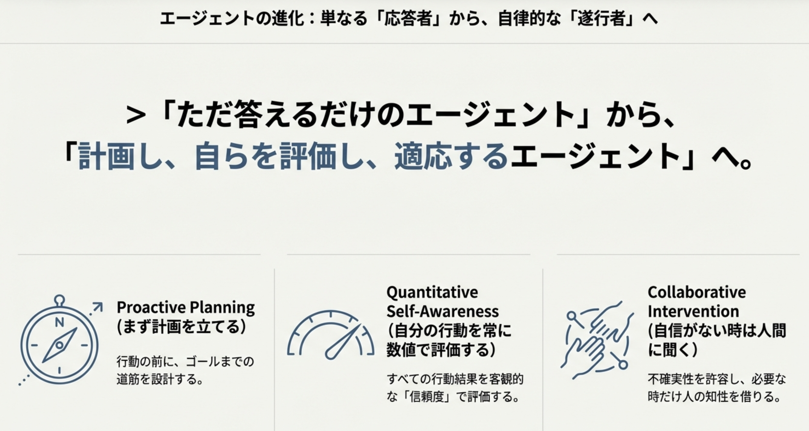
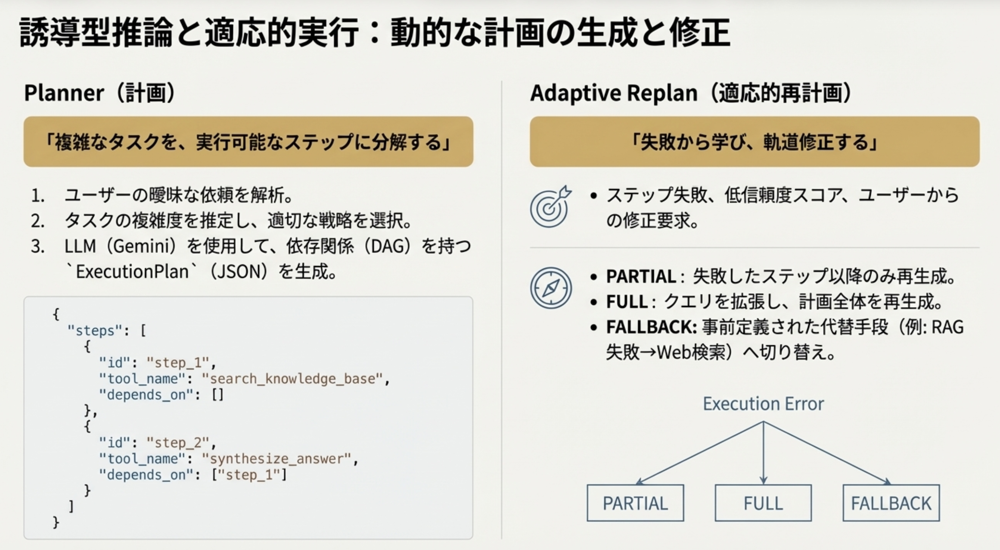
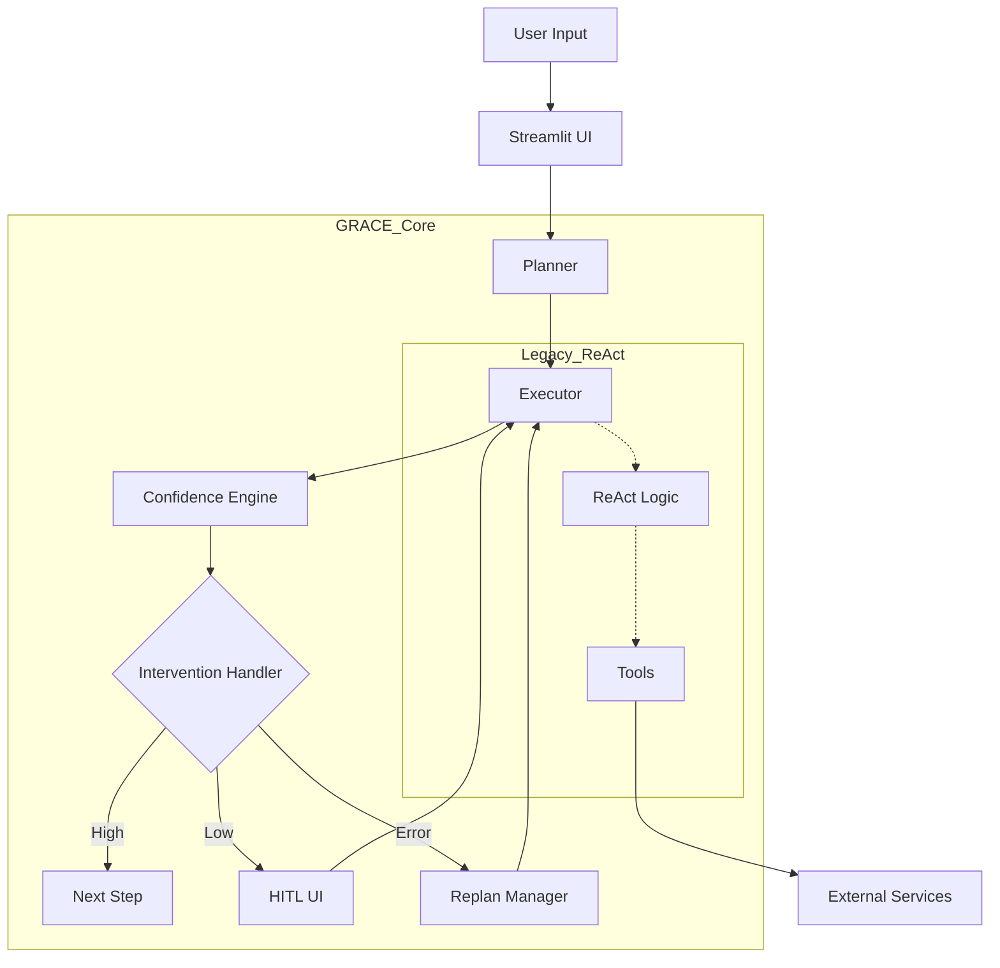
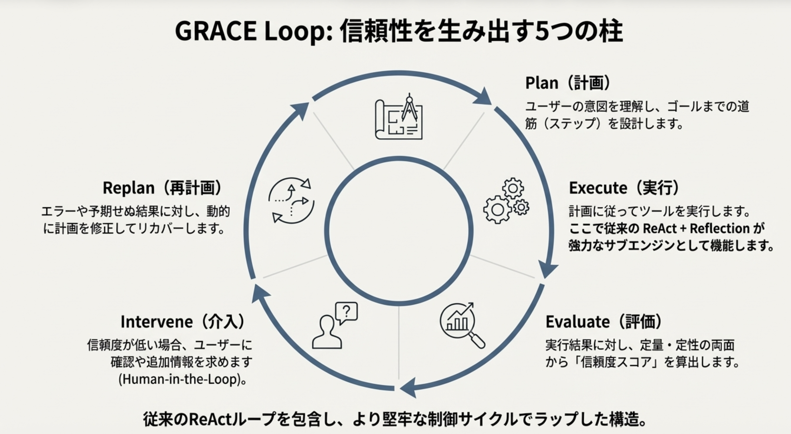
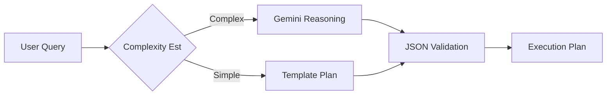
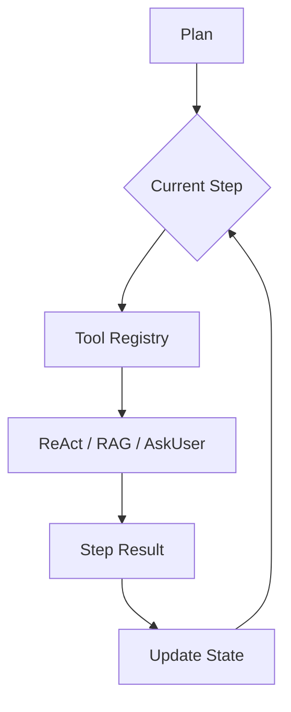
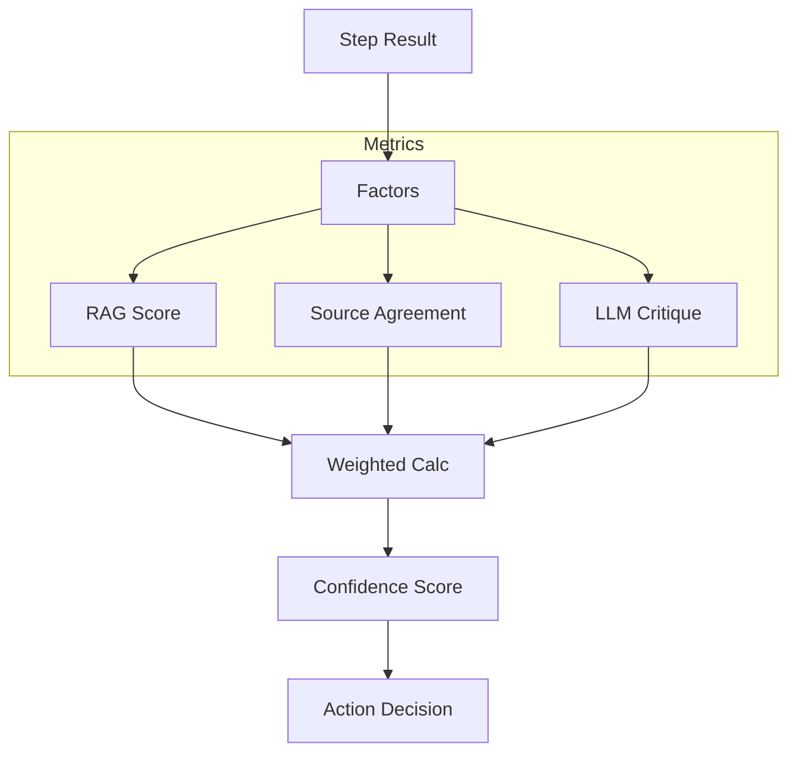
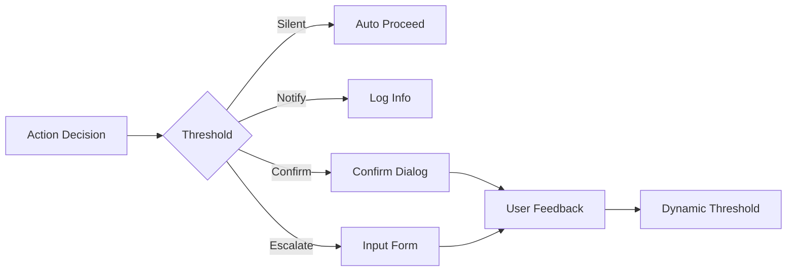
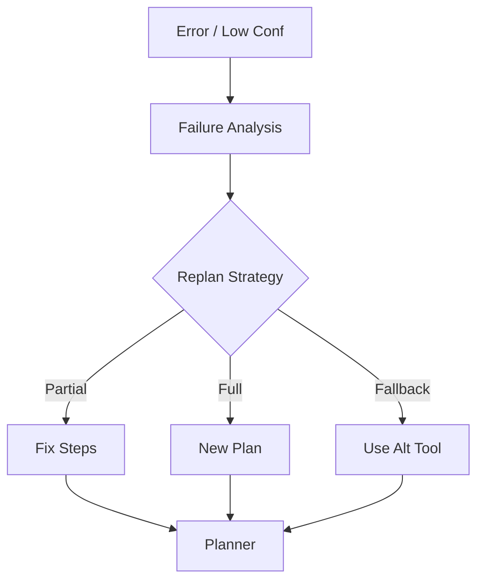
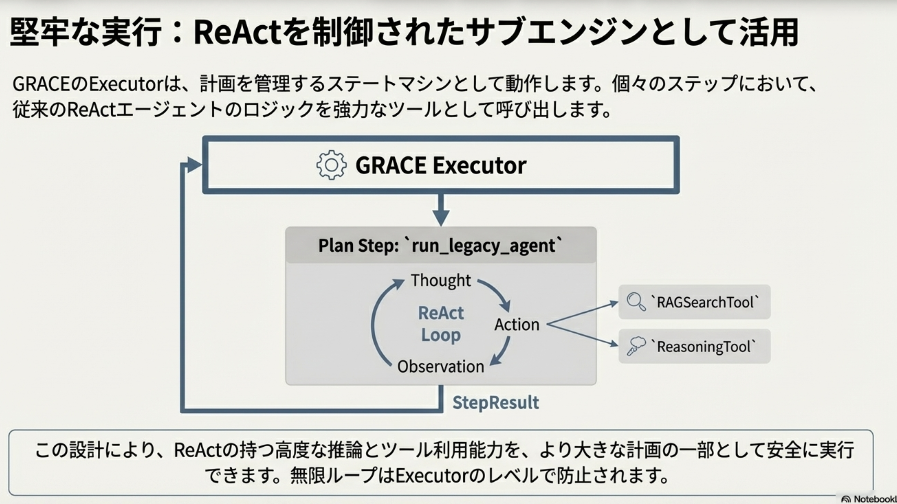

**ReActの資料へ** [ReAct](README_ReAct.md) | **RAGの資料へ** [RAG](README_RAG.md)
- （注）現在、GCPのVMでこのアプリを実行している。
- CPU: vCPU(共有2)、メモリ（4Gバイト）と貧弱なので、
- ここ、1週間ぐらいで、Google Cloud RUNに移行する予定です。いま、しばらく。

# Gemini GRACE Agent System

概要：(Guided Reasoning with Adaptive Confidence Execution)

Plan (計画)->Execute(実行)->Evaluate(評価)->Intervene(介入)->Replan (再計画)


**(Guided Reasoning with Adaptive Confidence Execution)**



## 1. Introduction

**「ただ答えるだけのエージェント」から、「計画し、自らを評価し、適応するエージェント」へ。**

本システムは、次世代の自律型AIエージェントアーキテクチャ **「GRACE」** を実装した統合RAGプラットフォームです。
従来の **ReAct (Reasoning + Acting)** と **Reflection (自己省察)** の強力な推論能力を継承しつつ、それらをより上位のレイヤーで統制する「計画 (Planning)」と「信頼度評価 (Confidence-aware)」を導入しました。



### なぜ GRACE なのか？

従来のエージェントは、複雑なタスクに対して「迷走（無限ループ）」したり、不確実な情報を「自信満々に回答（ハルシネーション）」したりする課題がありました。
GRACEは、**「まず計画を立てる」「自分の行動を常に数値で評価する」「自信がない時は人間に聞く」** というメカニズムにより、業務レベルで信頼できるAIエージェントを実現します。

---

## 2. Core Architecture (アーキテクチャ詳解)

GRACEは、従来の **ReAct + Reflection** ループを包含し、それをより堅牢な **"GRACE Loop"** でラップした構造になっています。

### システム全体構成図 (System Architecture)





### GRACE Loop: 5つの柱

1. **Plan (計画)**: ユーザーの意図を理解し、ゴールまでの道筋（ステップ）を設計します。
2. **Execute (実行)**: 計画に従ってツールを実行します。**ここで従来の ReAct + Reflection が強力なサブエンジンとして機能します。**
3. **Evaluate (評価)**: 実行結果に対し、定量・定性の両面から「信頼度スコア」を算出します。
4. **Intervene (介入)**: 信頼度が低い場合、ユーザーに確認や追加情報を求めます (Human-in-the-Loop)。
5. **Replan (再計画)**: エラーや予期せぬ結果に対し、動的に計画を修正してリカバーします。

---

## 3. Deep Dive: GRACE Components (技術詳細)

各コンポーネントの内部構造と役割を詳述します。

### 3.1 Planner (計画)

**「複雑なタスクを、実行可能なステップに分解する」**

ユーザーの曖昧な依頼を解析し、`ExecutionPlan` (JSON) を生成します。タスクの複雑度を推定し、適切な戦略を選択します。



* **主な機能**: 依存関係（DAG）の構築、使用ツールの選定、フォールバック計画の生成。

### 3.2 Executor (実行)

**「計画を遂行し、ReActの力を引き出す」**

ステートマシンとして計画を管理します。個々のステップにおいて、**Legacy Agent (ReAct)** のロジックを呼び出し、高度な推論とツール利用を行います。



* **ReActとの統合**: `ReasoningTool` や `RAGSearchTool` の内部で、思考(Thought)と行動(Action)のループが回ります。

### 3.3 Confidence Engine (信頼度評価)

**「AIの過信を防ぎ、客観的な数値を提示する」**

実行結果の品質を多角的に評価し、`0.0` 〜 `1.0` のスコアを算出します。



* **Reflectionの数値化**: 従来テキストで行っていたReflection（推敲）を、数値スコアとして定量化し、システム制御に利用します。

  

### 3.4 Intervention Handler (介入)

**「必要な時だけ、人の知恵を借りる」**

信頼度スコアに基づき、処理を一時停止してユーザーに判断を仰ぎます (HITL)。



### 3.5 Adaptive Replan (適応的再計画)

**「失敗から学び、軌道修正する」**

エラーやユーザーからの指摘、低い信頼度をトリガーとして、残りの計画を動的に書き換えます。



---

## 4. RAG Pipeline & Services



足回りとなるRAG機能とバックエンドサービス群です。

* **Qdrant Service**:
  * **Hybrid Search**: Gemini Embedding (Dense) + FastEmbed (Sparse) による高精度検索。
  * **Collection Management**: データの登録、削除、統合機能。
* **QA Service**:
  * ドキュメントから学習用Q/Aペアを自動生成するパイプライン（Celery並列処理対応）。

---

## 5. Application Features (機能一覧)

本アプリケーションは、以下の機能を提供します。


| カテゴリ     | 機能              | 概要                                                             |
| :----------- | :---------------- | :--------------------------------------------------------------- |
| **Agent**    | **GRACE Chat**    | 新アーキテクチャによる高信頼性対話。信頼度メーターと計画可視化。 |
|              | **Legacy Chat**   | 従来のReActエージェントとの比較用インターフェース。              |
| **RAG Ops**  | **Data Download** | HuggingFace等からのデータセット取得・前処理。                    |
|              | **QA Generation** | LLMを用いたQ/Aデータセットの自動生成。                           |
|              | **Vector DB**     | Qdrantへのデータ登録、閲覧、検索デバッグ。                       |
| **Analysis** | **Log Viewer**    | 未回答質問やエラーログの分析。                                   |

---

## 6. Getting Started

### 前提条件

* Python 3.10+
* Docker (Qdrant用)
* Google Cloud Project (Gemini API有効化済み)

### セットアップ手順

1. **リポジトリのクローン**:

   ```bash
   git clone https://github.com/your-repo/gemini_grace_agent.git
   cd gemini_grace_agent
   ```
2. **環境変数の設定**:
   `.env` ファイルを作成し、APIキーを設定します。

   ```bash
   GOOGLE_API_KEY="your_api_key"
   ```
3. **Qdrantの起動**:

   ```bash
   docker-compose up -d qdrant
   ```
4. **依存ライブラリのインストール**:

   ```bash
   pip install -r requirements.txt
   ```
5. **アプリケーションの起動**:

   ```bash
   streamlit run agent_rag.py
   ```

---

## 7. Development Guide

詳細な仕様や設計については、`doc/` 以下のドキュメントを参照してください。

* **アーキテクチャ詳細**: [doc/grace_architecture.md](doc/grace_architecture.md)
* **GRACEモジュール設計**: [doc/grace.md](doc/grace.md)
* **UI/画面設計**: [doc/ui.md](doc/ui.md)
* **サービス層設計**: [doc/services.md](doc/services.md)
* **Legacyエージェント**: [doc/agent_main.md](doc/agent_main.md)

### ディレクトリ構造

```text
.
├── agent_rag.py            # エントリポイント
├── grace/                  # [Core] GRACE アーキテクチャ
├── services/               # [Service] 共通ビジネスロジック
├── ui/                     # [UI] Streamlit 画面・コンポーネント
├── config/                 # 設定ファイル
├── doc/                    # ドキュメント
└── logs/                   # 実行ログ
```
