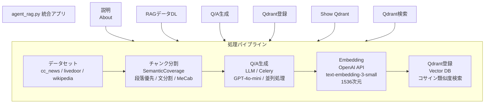
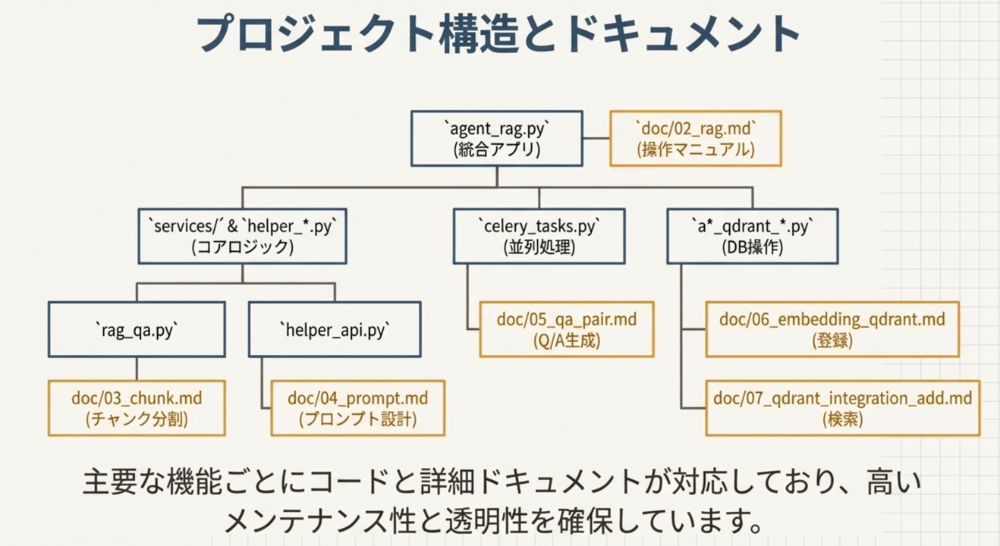
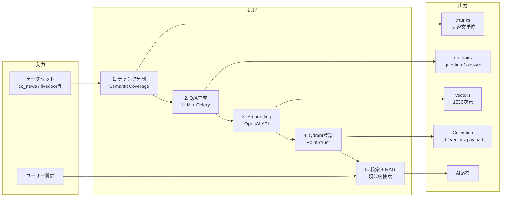
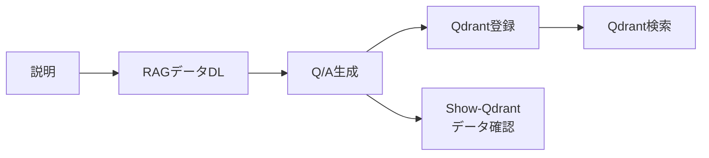
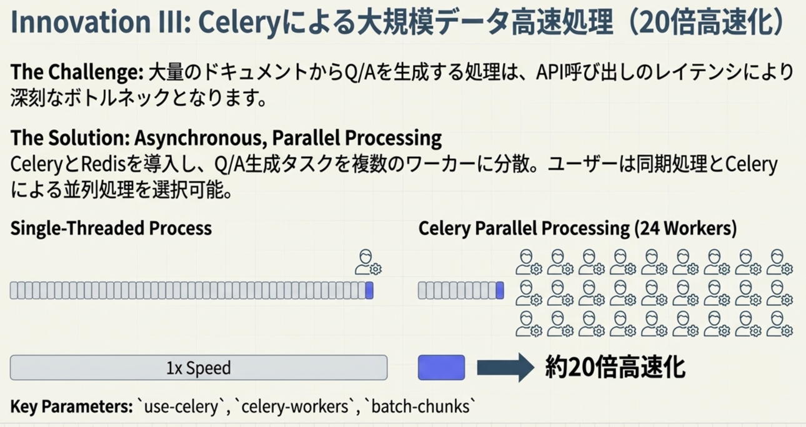
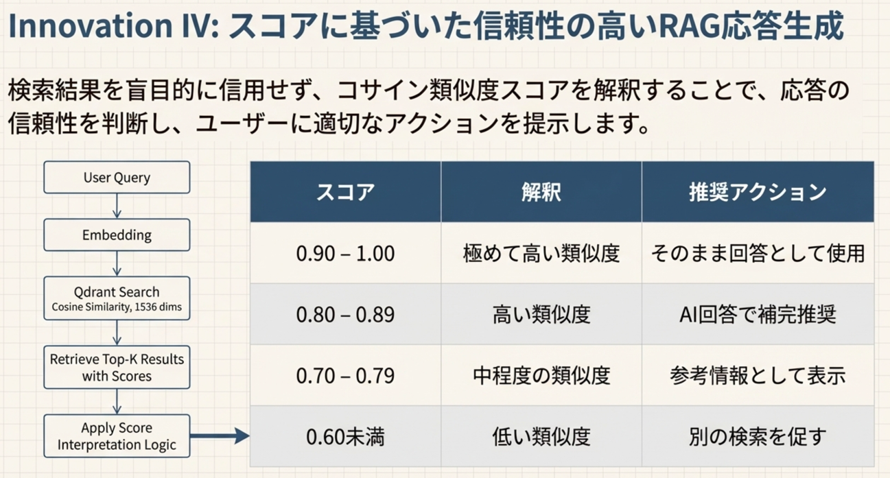
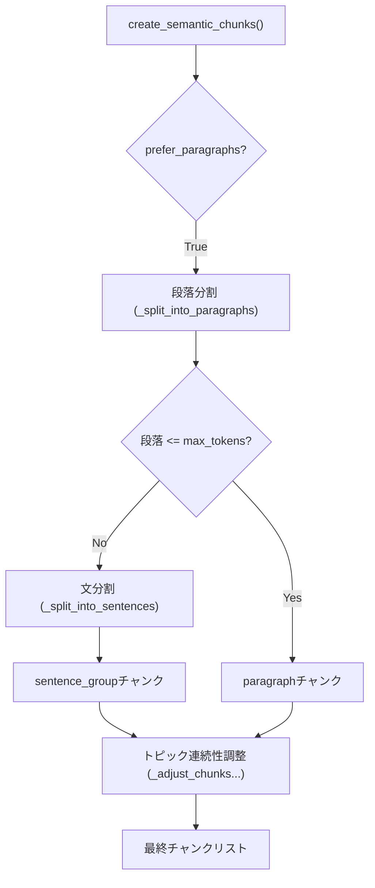
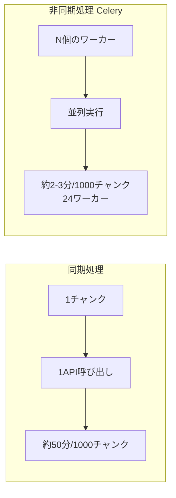
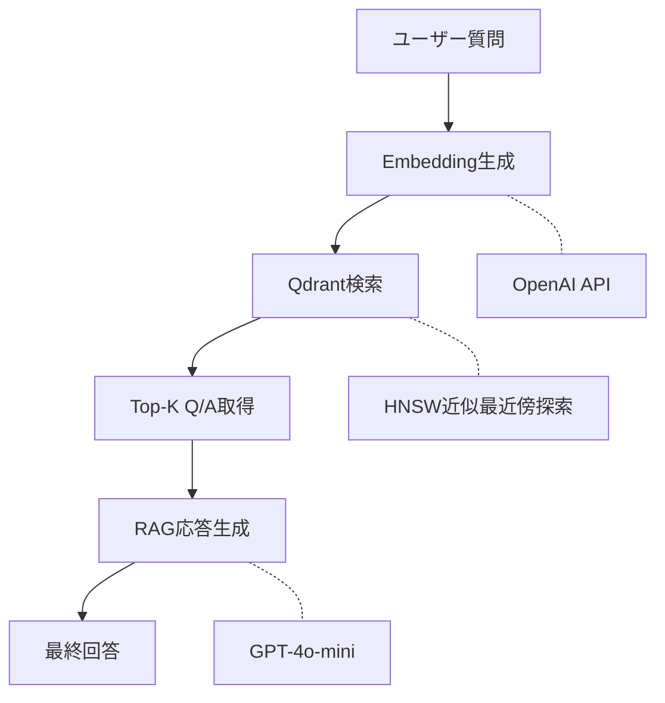
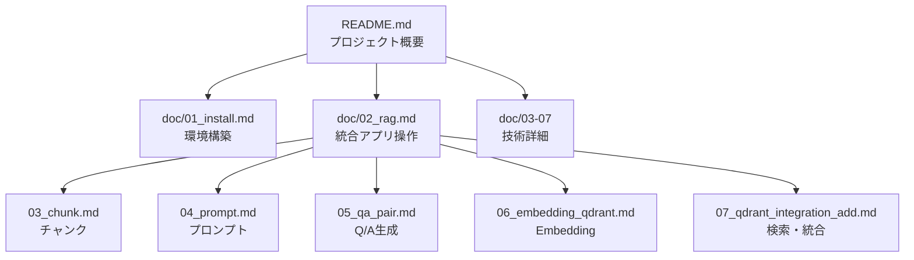

**Agentの資料へ** [link2agent](README.md)

## RAG Q/A 生成・検索システム

本プロジェクトのメインアプリケーションは `agent_rag.py` です。
日本語・英語RAG（Retrieval-Augmented Generation）システム。ドキュメントからQ/Aペアを自動生成し、Qdrantベクトルデータベースで類似度検索・AI応答生成を行う統合アプリケーション。

- 概要: RAG
  

・アプリ画面


目次

- [1. 概要](#1-概要)
- [2. クイックスタート](#2-クイックスタート)
- [3. 統合アプリ rag_qa_pair_qdrant.py](#3-統合アプリ-rag_qa_pair_qdrantpy)
- [4. 技術コンポーネント](#4-技術コンポーネント)
  - [4.1 チャンク分割技術詳細（SemanticCoverage）](#41-チャンク分割技術詳細semanticcoverage)
  - [4.2 プロンプト設計・処理方式詳細](#42-プロンプト設計・処理方式詳細)
  - [4.3 Q/Aペア生成](#43-qaペア生成)
  - [4.4 Embedding・Qdrant登録](#44-embeddingqdrant登録)
  - [4.5 ベクトル検索・RAG](#45-ベクトル検索rag)
- [5. 環境構築詳細](#5-環境構築詳細)
- [6. プログラム一覧](#6-プログラム一覧)
- [7. ドキュメント一覧](#7-ドキュメント一覧)
- [8. ディレクトリ構造](#8-ディレクトリ構造)
- [9. 対応データセット](#9-対応データセット)
- [10. 技術スタック](#10-技術スタック)
- [11. ライセンス・貢献](#11-ライセンス貢献)

---

## 1. 概要

### 1.1 プロジェクト説明

本システムは、日本語、英語ドキュメントからQ/Aペアを自動生成し、ベクトル検索による質問応答（RAG）を実現する統合アプリケーションです。

### 1.2 主要機能


| 機能                | 説明                                                |
| ------------------- | --------------------------------------------------- |
| **チャンク分割**    | 段落優先・MeCab活用のセマンティック分割で意味を保持 |
| **プロンプト設計**  | 2段階構成・構造化出力による高品質なQ/A生成制御      |
| **Q/Aペア自動生成** | LLM（GPT-4o等）を使用してドキュメントからQ/Aを生成  |
| **Celery並列処理**  | 大規模データの高速処理（24ワーカーで約20倍高速化）  |
| **Qdrant登録**      | Q/AペアをEmbedding化してベクトルDBに登録            |
| **類似度検索**      | コサイン類似度によるセマンティック検索              |
| **RAG応答生成**     | 検索結果を基にAIが回答を生成                        |
| **カバレージ分析**  | Q/Aがドキュメントをどの程度網羅しているか評価       |

### 1.3 システムアーキテクチャ


・プロジェクト構造：


### 1.4 処理パイプライン（データフロー）



---

## 2. クイックスタート

### 2.1 前提条件

- Python 3.10以上
- Docker / Docker Compose
- OpenAI APIキー

### 2.2 インストール

```bash
# リポジトリのクローン
git clone <repository-url>
cd openai_rag_qa_jp

# 依存パッケージのインストール
pip install -r requirements.txt

# 環境変数の設定
cp .env.example .env
# .envにOPENAI_API_KEYを設定
```

### 2.3 サービス起動

```bash
# Qdrant + Redis の起動
docker-compose -f docker-compose/docker-compose.yml up -d

# Celeryワーカー起動（並列処理を使う場合）
./start_celery.sh start -w 8

# 統合アプリの起動
streamlit run agent_rag.py
```

### 2.4 動作確認

ブラウザで http://localhost:8501 を開き、統合アプリが表示されることを確認。

**詳細な環境構築手順**: [doc/01_install.md](doc/01_install.md)

---

### 3. 統合アプリ agent_rag.py

### 3.1 6画面構成

統合アプリは以下の6つの画面で構成されています。


| # | 画面名          | 機能             | 主な操作                          |
| - | --------------- | ---------------- | --------------------------------- |
| 1 | **説明**        | プロジェクト概要 | ドキュメント確認                  |
| 2 | **RAGデータDL** | データセット取得 | cc_news, livedoor等のダウンロード |
| 3 | **Q/A生成**     | Q/Aペア生成      | LLM生成、Celery並列処理           |
| 4 | **Qdrant登録**  | ベクトルDB登録   | CSV→Embedding→登録              |
| 5 | **Show-Qdrant** | コレクション表示 | データ確認、統計情報              |
| 6 | **Qdrant検索**  | 類似度検索       | 質問入力→検索→AI応答            |


### 3.2 画面フロー




### 3.3 各画面の概要


#### 画面1: 説明（About）

プロジェクトの概要とドキュメントへのリンクを表示。

#### 画面2: RAGデータDL

Hugging Faceからデータセットをダウンロード・前処理。

- 対応データセット: cc_news, livedoor, wikipedia_ja

#### 画面3: Q/A生成
・プロンプトの最適化：


・チャンク分割 → LLMによるQ/Aペア生成。
・チャンク（セマンテック分割）：


- 同期処理 / Celery並列処理を選択可能


- カバレージ分析オプション


#### 画面4: Qdrant登録

CSVファイルからQdrantへベクトルデータを登録。

- Embedding生成（text-embedding-3-small）
- コレクション統合機能

#### 画面5: Show-Qdrant

登録済みコレクションの確認・統計表示。

#### 画面6: Qdrant検索

質問を入力 → 類似Q/A検索 → AI応答生成。


**詳細な操作方法**: [doc/02_rag.md](doc/02_rag.md)

---

## 4. 技術コンポーネント

### 4.1 チャンク分割技術詳細（SemanticCoverage）

本システムでは、`SemanticCoverage` クラス（`helper_rag_qa.py`）を用いて、文書を意味的に一貫性のあるチャンクに分割します。

#### 4.1.1 システム概要と役割

チャンク分割は以下の重要な役割を担います：

1. **適切なサイズへの分割**: Embeddingモデルの最適入力長（デフォルト300トークン）に収める。
2. **意味的一貫性の維持**: 段落や文の境界を尊重し、文脈の断絶を防ぐ。
3. **トピック連続性の確保**: 短すぎるチャンクを統合し、情報の断片化を防ぐ。

**システム構成とフロー:**



#### 4.1.2 SemanticCoverageクラス詳細

- **クラス**: `SemanticCoverage`
- **主要メソッド**:
  - `create_semantic_chunks()`: メイン分割処理。段落優先フラグ(`prefer_paragraphs`)により挙動を制御。
  - `_split_into_paragraphs()`: 空行（`\n\n`）を基準に、筆者が意図した意味的まとまりを抽出。
  - `_split_into_sentences()`: 日本語（MeCab/正規表現）および英語の文分割。
  - `_adjust_chunks_for_topic_continuity()`: `min_tokens`（デフォルト50）未満のチャンクを前後のチャンクとマージ。

#### 4.1.3 分割ロジックと実装技術

1. **段落優先アプローチ**:
   正規表現 `r'\n\s*\n'` を用いて、文書の構造的な段落を最優先の境界として扱います。これにより、トピックの急激な切り替わりを防ぎます。
2. **MeCabによる高精度な文分割**:
   日本語テキストの場合、自動判定ロジックにより `MeCab` を優先的に使用します。

   - **利点**: 「3.14」のような数値内のピリオドや、括弧内の句点などを正しく認識し、正規表現単独で発生する誤分割を防止します。
   - **フォールバック**: MeCabが利用できない環境では、自動的に正規表現ベースの分割（`(?<=[。．.!?])\s*`）に切り替わります。
3. **強制分割（Forced Split）**:
   単一の文が `max_tokens` を超える稀なケース（条文やログデータなど）では、トークン数に基づいて強制的に分割し、モデルの入力制限超過を防ぎます。

**詳細**: [doc/03_chunk.md](doc/03_chunk.md)

### 4.2 プロンプト設計・処理方式詳細

Geminiモデル（`gemini-2.0-flash`等）の性能を最大限に引き出すため、`UnifiedLLMClient` を介した2段階のプロンプト構成と構造化出力を採用しています。

#### 4.2.1 プロンプト設計の特徴

- **2段階プロンプト構造**:
  - **システムプロンプト**: AIの役割（「教育コンテンツ作成の専門家」）と全般的な生成ルールを定義。
  - **ユーザープロンプト**: 処理対象のテキストチャンク、生成数指示、JSONスキーマを含みます。
- **言語別テンプレート**: 日本語(`ja`)と英語(`en`)で最適化されたプロンプトを自動切り替え。
- **動的調整**: チャンクのトークン数や複雑度に応じて、生成するQ/Aペア数（2〜5ペア）を動的に決定。

#### 4.2.2 システムプロンプト定義（日本語版）

```text
あなたは教育コンテンツ作成の専門家です。
与えられた日本語テキストから、学習効果の高いQ&Aペアを生成してください。

生成ルール:
1. 質問は明確で具体的に
2. 回答は簡潔で正確に（1-2文程度）
3. テキストの内容に忠実に
4. 多様な観点から質問を作成
```

#### 4.2.3 ユーザープロンプトと構造化出力

ユーザープロンプトでは、明確なJSON形式での出力を指示し、以下の質問タイプを網羅するように誘導します。

- **質問タイプ階層**:
  - `fact`: 事実確認型
  - `reason`: 理由説明型
  - `comparison`: 比較型
  - `application`: 応用型

**UnifiedLLMClientによる型安全な実装**:
Gemini APIの `response_schema` (またはOpenAIの Structured Outputs) を利用し、Pydanticモデル (`QAPairsResponse`) に準拠したデータを強制的に生成させます。

```python
# helper_llm.py 呼び出しイメージ
response: QAPairsResponse = client.generate_structured(
    prompt=combined_prompt,
    response_schema=QAPairsResponse, # Pydanticモデル
    model="gemini-2.0-flash"
)
```

**詳細**: [doc/04_prompt.md](doc/04_prompt.md)

### 4.3 Q/Aペア生成

Celery並列処理によるスケーラブルなQ/A生成。



**主要パラメータ:**


| パラメータ         | デフォルト | 説明                     |
| ------------------ | ---------- | ------------------------ |
| --use-celery       | false      | 並列処理を有効化         |
| --celery-workers   | 4          | ワーカー数               |
| --batch-chunks     | 3          | 1API呼び出しのチャンク数 |
| --analyze-coverage | false      | カバレージ分析           |

**詳細**: [doc/05_qa_pair.md](doc/05_qa_pair.md)

### 4.4 Embedding・Qdrant登録

Q/AペアをベクトルDBに登録するフロー。


| 項目            | 設定                   |
| --------------- | ---------------------- |
| Embeddingモデル | text-embedding-3-small |
| ベクトル次元    | 1536                   |
| 距離メトリクス  | コサイン類似度         |
| バッチサイズ    | 128ポイント/バッチ     |

**コレクション命名規則:**

```
qa_{dataset}_{method}
例: qa_cc_news_a02_llm, qa_livedoor_a03_rule
```

**詳細**: [doc/06_embedding_qdrant.md](doc/06_embedding_qdrant.md)

### 4.5 ベクトル検索・RAG

類似度検索とAI応答生成。



**スコア解釈:**


| スコア     | 解釈             | 推奨アクション         |
| ---------- | ---------------- | ---------------------- |
| 0.90〜1.00 | 極めて高い類似度 | そのまま回答として使用 |
| 0.80〜0.89 | 高い類似度       | AI回答で補完推奨       |
| 0.70〜0.79 | 中程度           | 参考情報として表示     |
| 0.60未満   | 低い類似度       | 別の検索を促す         |

**詳細**: [doc/07_qdrant_integration_add.md](doc/07_qdrant_integration_add.md)

---

## 5. 環境構築詳細

### 5.1 Python環境

```bash
# Python 3.10以上が必要
python --version

# 仮想環境の作成（推奨）
python -m venv venv
source venv/bin/activate  # Mac/Linux
```

### 5.2 依存パッケージ

```bash
pip install -r requirements.txt

# Celery関連（並列処理を使う場合）
pip install "celery[redis]" kombu flower
```

### 5.3 Docker（Qdrant + Redis）

```bash
# docker-compose.ymlの場所
docker-compose -f docker-compose/docker-compose.yml up -d

# 起動確認
curl http://localhost:6333/collections  # Qdrant
redis-cli ping                           # Redis
```

### 5.4 MeCab（日本語形態素解析）

```bash
# Mac
brew install mecab mecab-ipadic

# Ubuntu
sudo apt-get install mecab libmecab-dev mecab-ipadic-utf8

# Python バインディング
pip install mecab-python3
```

### 5.5 環境変数

`.env`ファイルを作成:

```env
OPENAI_API_KEY=sk-xxxxxxxxxxxxxxxxxxxxx
QDRANT_URL=http://localhost:6333
REDIS_URL=redis://localhost:6379/0
```

**詳細な環境構築手順**: [doc/01_install.md](doc/01_install.md)

---

## 6. プログラム一覧

### 6.1 統合アプリ


| ファイル       | 説明                           |
| -------------- | ------------------------------ |
| `agent_rag.py` | 6画面構成の統合Streamlitアプリ |
| `server.py`    | Qdrantサーバー管理スクリプト   |

### 6.2 データ処理・Q&A生成


| ファイル                   | 説明                         |
| -------------------------- | ---------------------------- |
| `a01_load_set_rag_data.py` | データセットのロード・前処理 |
| `a02_make_qa_para.py`      | Q/A生成（LLM + Celery並列）  |
| `a03_make_qa_rule.py`      | Q/A生成（ルールベース）      |
| `a10_make_qa_hybrid.py`    | Q/A生成（ハイブリッド）      |
| `celery_tasks.py`          | Celeryタスク定義             |

### 6.3 ベクトルストア・検索


| ファイル                         | 説明                        |
| -------------------------------- | --------------------------- |
| `a30_qdrant_registration.py`     | Qdrantへのデータ登録（CLI） |
| `a35_qdrant_truncate.py`         | Qdrantコレクション削除      |
| `a40_show_qdrant_data.py`        | Qdrantデータ表示            |
| `a50_rag_search_local_qdrant.py` | RAG検索（CLI/Streamlit）    |

### 6.4 サービス層


| ファイル                     | 説明                        |
| ---------------------------- | --------------------------- |
| `services/qdrant_service.py` | Qdrant操作サービス          |
| `services/qa_service.py`     | Q/A生成サービス             |
| `helper_api.py`              | OpenAI API ユーティリティ   |
| `helper_rag.py`              | RAGデータ処理ユーティリティ |
| `rag_qa.py`                  | SemanticCoverageクラス      |

---

## 7. ドキュメント一覧

### 7.1 ドキュメント相関図



### 7.2 ドキュメント概要


| ドキュメント                                                         | 主題                     | 対象読者       |
| -------------------------------------------------------------------- | ------------------------ | -------------- |
| [doc/01_install.md](doc/01_install.md)                               | 環境構築ガイド           | 導入者・開発者 |
| [doc/02_rag.md](doc/02_rag.md)                                       | 統合アプリ操作マニュアル | 利用者・開発者 |
| [doc/03_chunk.md](doc/03_chunk.md)                                   | チャンク分割技術         | 開発者         |
| [doc/04_prompt.md](doc/04_prompt.md)                                 | プロンプト設計           | 開発者         |
| [doc/05_qa_pair.md](doc/05_qa_pair.md)                               | Q/Aペア生成処理          | 開発者         |
| [doc/06_embedding_qdrant.md](doc/06_embedding_qdrant.md)             | Embedding・Qdrant登録    | 開発者         |
| [doc/07_qdrant_integration_add.md](doc/07_qdrant_integration_add.md) | Qdrant検索・統合         | 開発者         |

---

## 8. ディレクトリ構造

```
openai_rag_qa_jp/
├── agent_rag.py      # 統合アプリ（メインエントリポイント）
├── server.py                   # サーバー管理
│
├── a01_load_set_rag_data.py   # データロード
├── a02_make_qa_para.py        # Q/A生成（LLM）
├── a03_make_qa_rule.py        # Q/A生成（ルール）
├── a10_make_qa_hybrid.py      # Q/A生成（ハイブリッド）
├── a30_qdrant_registration.py # Qdrant登録
├── a50_rag_search_local_qdrant.py # RAG検索
│
├── celery_tasks.py            # Celeryタスク
├── config.py                  # 設定管理
├── models.py                  # Pydanticモデル
│
├── helper_api.py              # OpenAI API ユーティリティ
├── helper_rag.py              # RAGデータ処理
├── rag_qa.py                  # SemanticCoverageクラス
│
├── services/                  # サービス層
│   ├── qdrant_service.py      # Qdrant操作
│   └── qa_service.py          # Q/A生成
│
├── ui/                        # UIコンポーネント
│   └── pages/                 # 各画面のページ
│       ├── qa_generation_page.py
│       ├── qdrant_registration_page.py
│       ├── qdrant_search_page.py
│       └── qdrant_show_page.py
│
├── doc/                       # ドキュメント
│   ├── 01_install.md
│   ├── 02_rag.md
│   ├── 03_chunk.md
│   ├── 04_prompt.md
│   ├── 05_qa_pair.md
│   ├── 06_embedding_qdrant.md
│   └── 07_qdrant_integration_add.md
│
├── docker-compose/            # Docker設定
│   └── docker-compose.yml
│
├── qa_output/                 # 生成されたQ/Aデータ
├── OUTPUT/                    # 前処理済みデータ
│
├── requirements.txt           # 依存パッケージ
├── .env                       # 環境変数（gitignore）
├── config.yml                 # アプリ設定
└── CLAUDE.md                  # Claude Code用ガイド
```

---

## 9. 対応データセット


| データセット  | 言語   | 内容          | ソース       |
| ------------- | ------ | ------------- | ------------ |
| cc_news       | 日本語 | ニュース記事  | Hugging Face |
| livedoor      | 日本語 | ブログ記事    | Hugging Face |
| wikipedia_ja  | 日本語 | Wikipedia記事 | Hugging Face |
| japanese_text | 日本語 | 汎用テキスト  | カスタム     |

---

## 10. 技術スタック


| カテゴリ       | 技術                          |
| -------------- | ----------------------------- |
| **言語**       | Python 3.10+                  |
| **LLM**        | OpenAI GPT-4o, GPT-4o-mini    |
| **Embedding**  | OpenAI text-embedding-3-small |
| **ベクトルDB** | Qdrant                        |
| **並列処理**   | Celery + Redis                |
| **Web UI**     | Streamlit                     |
| **形態素解析** | MeCab                         |
| **コンテナ**   | Docker / Docker Compose       |

---

## 11. ライセンス・貢献

### ライセンス

MIT License

---
