**Agent Graceの資料へ** [Agent Grace](README.md) | **RAGの資料へ** [RAG](README_RAG.md)

## Gemini搭載・自立型RAGエージェントシステム


# Agent RAG システム

本システムは、「自律型 RAG エージェント」および統合管理プラットフォームです。
システムの特徴（ReAct + Reflection、フルスクラッチ実装、Gemini 3世代対応）です。
StreamlitベースのUIを通じて、データの取得・ベクトル化から、Qdrant データベース管理、
そして高度なエージェント対話まで、RAG パイプライン全体を一気通貫で管理・運用することができます。

**主な特徴と技術的工夫:**
```text
1. ReAct (Reasoning + Acting):
   　　エージェント自らが「考える（Reasoning）」と「行動する（Acting）」をループ
   　　・入力プロンプトの最適化
   　　・CoT（Chain-of-Thought)のLoop
   　　・Hybrid RAG (Dense + Sparse)の検索
   　　必要な情報が揃うまで自律的に検索ツール (search_rag_knowledge_base) を行使します。
2. Reflection (自己評価結果に基づき、最終回答 (Final Answer) を抽出：自己省察):
   　　回答を作成した後、即座に出力せず「自己評価」フェーズを実行し、回答の品質を向上。
   　　検索結果との整合性やスタイルを自ら批評し、ハルシネーション（幻覚）や誤りを修正してからユーザーに回答します。
3. フルスクラッチ実装:
   　　Gemini APIを直接利用し、柔軟な制御を実現しました。
```

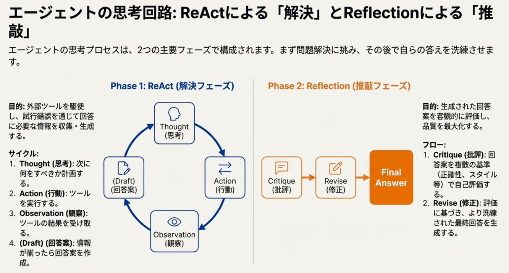

## 目次

## RAG Q/A 生成・検索システム

1. [概要](#1-概要)
   - 1.1 [本モジュールの目的](#11-本モジュールの目的)
   - 1.2 [主な機能（7画面の概要）](#12-主な機能7画面の概要)
   - 1.3 [対応データセット](#13-対応データセット)
2. [アーキテクチャ](#2-アーキテクチャ)
   - 2.1 [システム構成図（3層アーキテクチャ）](#21-システム構成図3層アーキテクチャ)
   - 2.2 [モジュール依存関係図](#22-モジュール依存関係図)
   - 2.3 [レイヤー別役割分担表](#23-レイヤー別役割分担表)
   - 2.4 [システムアーキテクチャ図（Mermaid）](#24-システムアーキテクチャ図mermaid)
   - 2.5 [コンポーネント連携シーケンス図](#25-コンポーネント連携シーケンス図)
3. [データフロー](#3-データフロー)
   - 3.1 [エンドツーエンド処理フロー図](#31-エンドツーエンド処理フロー図)
   - 3.2 [各ステップの入出力](#32-各ステップの入出力)
   - 3.3 [ディレクトリ構造](#33-ディレクトリ構造)
4. [サービス層 & ツール層](#4-サービス層--ツール層)
   - 4.1 [dataset_service.py - データセット操作](#41-dataset_servicepy---データセット操作)
   - 4.3 qdrant_service.py - Qdrant操作](#42-qdrant_servicepy---qdrant操作)
   - 4.4 file_service.py - ファイル操作](#43-file_servicepy---ファイル操作)
   - 4.5 qa_service.py - Q/A生成](#44-qa_servicepy---qa生成)
   - 4.6 agent_tools.py - エージェント用ツール](#45-agent_toolspy---エージェント用ツール)
5. [UI層 (ui/pages/)](#5-ui層-uipages)
   - 5.1 [画面一覧と遷移](#51-画面一覧と遷移)
   - 5.2 [各ページの機能詳細](#52-各ページの機能詳細)
6. [メニュー単位の処理概要・処理方式](#6-メニュー単位の処理概要処理方式)
   - 6.1 [📖 説明](#61--説明)
   - 6.2 [🤖 エージェント対話](#62--エージェント対話)
   - 6.3 [📊 未回答ログ](#63--未回答ログ)
   - 6.4 [📥 RAGデータダウンロード](#64--ragデータダウンロード)
   - 6.5 [🤖 Q/A生成](#65--qa生成)
   - 6.6 [📥 CSVデータ登録](#66--csvデータ登録)
   - 6.7 [🗄️ Qdrantデータ管理](#67--qdrantデータ管理)
   - 6.8 [🔎 Qdrant検索](#68--qdrant検索)
7. [設定・依存関係](#7-設定依存関係)
   - 7.1 [必須環境変数](#71-必須環境変数)
   - 7.2 [依存サービス](#72-依存サービス)
   - 7.3 [主要な定数・設定値](#73-主要な定数設定値)
8. [使用方法](#8-使用方法)
   - 8.1 [起動手順](#81-起動手順)
   - 8.2 [典型的なワークフロー](#82-典型的なワークフロー)
9. [ReAct エージェント詳細設計](#9-react-エージェント詳細設計)
   - 9.1 [ReAct ループの仕組み](#91-react-ループの仕組み)
   - 9.2 [主要クラス・関数 IPO 定義](#92-主要クラス関数-ipo-定義)
   - 9.3 [システムプロンプト設計](#93-システムプロンプト設計)
   - 9.4 [シーケンス図 (Agent Turn)](#94-シーケンス図-agent-turn)

---

## 1. 概要


### 1.1 本モジュールの目的

`agent_rag.py` は、**Gemini 3 (2.0 Flash)** 世代に対応したRAG（Retrieval-Augmented Generation）システムの統合管理ツールです。

**一言で言うと**: Gemini活用型RAG Q&A生成・Qdrant管理、および **ReAct型エージェント** による対話を実現する統合Streamlitアプリケーション

**役割**:

- データ取得からベクトル検索までの **RAGパイプライン全体** を管理
- **ReActエージェント** を介した、ツール利用による高度な対話機能
- **Gemini API** (`gemini-2.0-flash`, `gemini-embedding-001`) を全面的に採用し、高速・低コスト・高精度を実現


| 項目           | 内容                                            |
| -------------- | ----------------------------------------------- |
| ファイル名     | agent_rag.py                                    |
| フレームワーク | Streamlit                                       |
| 起動コマンド   | `streamlit run agent_rag.py --server.port=8500` |

### 1.2 主な機能（7画面の概要）


| 画面             | アイコン | 機能概要                                                                                                   |
| ---------------- | -------- | ---------------------------------------------------------------------------------------------------------- |
| 説明             | 📖       | システムのデータフロー・ディレクトリ構造を表示                                                             |
| エージェント対話 | 🤖       | **ReAct Agent** (Gemini 2.0) との対話。ナレッジベース検索 + **Reflection (自己推敲)** による高品質な回答。 |
| 未回答ログ       | 📊       | エージェントが回答できなかった質問のログ分析                                                               |
| RAGデータDL      | 📥       | HuggingFace/ローカルファイルからデータ取得・前処理                                                         |
| Q/A生成          | 🤖       | **Gemini 2.0 Flash** によるQ&Aペア自動生成（Celery並列処理対応）                                           |
| CSVデータ登録    | 📥       | **Gemini Embedding (3072次元)** でベクトル化・登録・コレクション統合                                       |
| Qdrantデータ管理 | 🗄️     | Qdrantコレクション内容の閲覧 (Show-Qdrant)                                                                 |
| Qdrant検索       | 🔎       | セマンティック検索単体のテスト・AI応答生成                                                                 |

**アプリケーション・全機能**
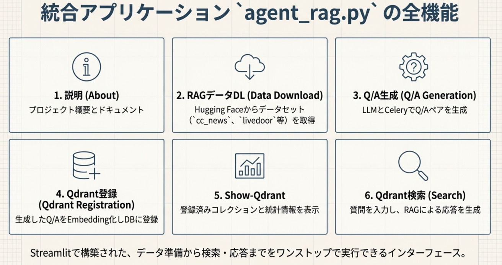

- 画面：


### 1.3 対応データセット


| データセット    | 識別子          | 説明                                   |
| --------------- | --------------- | -------------------------------------- |
| Wikipedia日本語 | `wikipedia_ja`  | Wikipedia日本語版                      |
| CC-News         | `cc_news`       | CC-News英語ニュース                    |
| Livedoor        | `livedoor`      | Livedoorニュースコーパス               |
| カスタム        | `custom_upload` | ローカルファイル（CSV/TXT/JSON/JSONL） |

---

## 2. アーキテクチャ

### 2.1 システム構成図（3層アーキテクチャ）

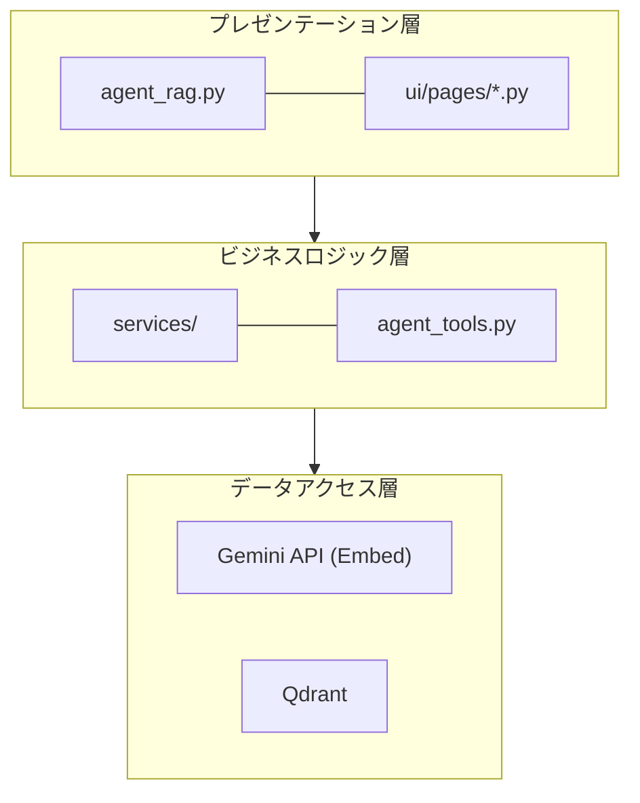

### 2.2 モジュール依存関係図

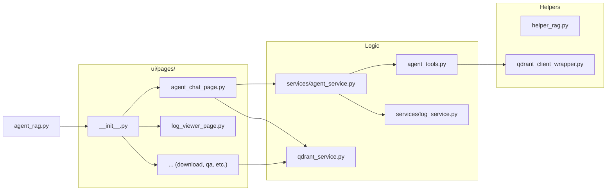

### 2.3 レイヤー別役割分担表


| レイヤー             | モジュール                    | 責務                                                         |
| -------------------- | ----------------------------- | ------------------------------------------------------------ |
| **エントリポイント** | `agent_rag.py`                | アプリ起動、ルーティング                                     |
| **UI層**             | `ui/pages/agent_chat_page.py` | エージェント対話UI、ユーザー入力受付、思考ログの表示         |
| **サービス層**       | `services/agent_service.py`   | **エージェント制御コア**。ReActループ、Reflection、履歴管理  |
| **ツール層**         | `agent_tools.py`              | エージェントが利用するツール群 (`search_rag_knowledge_base`) |
| **サービス層**       | `services/*.py`               | データ処理、DB操作の抽象化                                   |

・3層アーキテクチャ
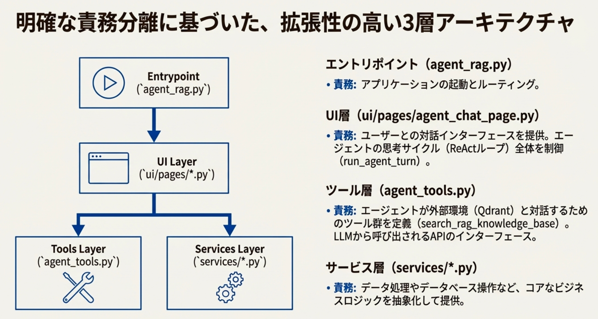

### 2.4 システムアーキテクチャ図（Mermaid）

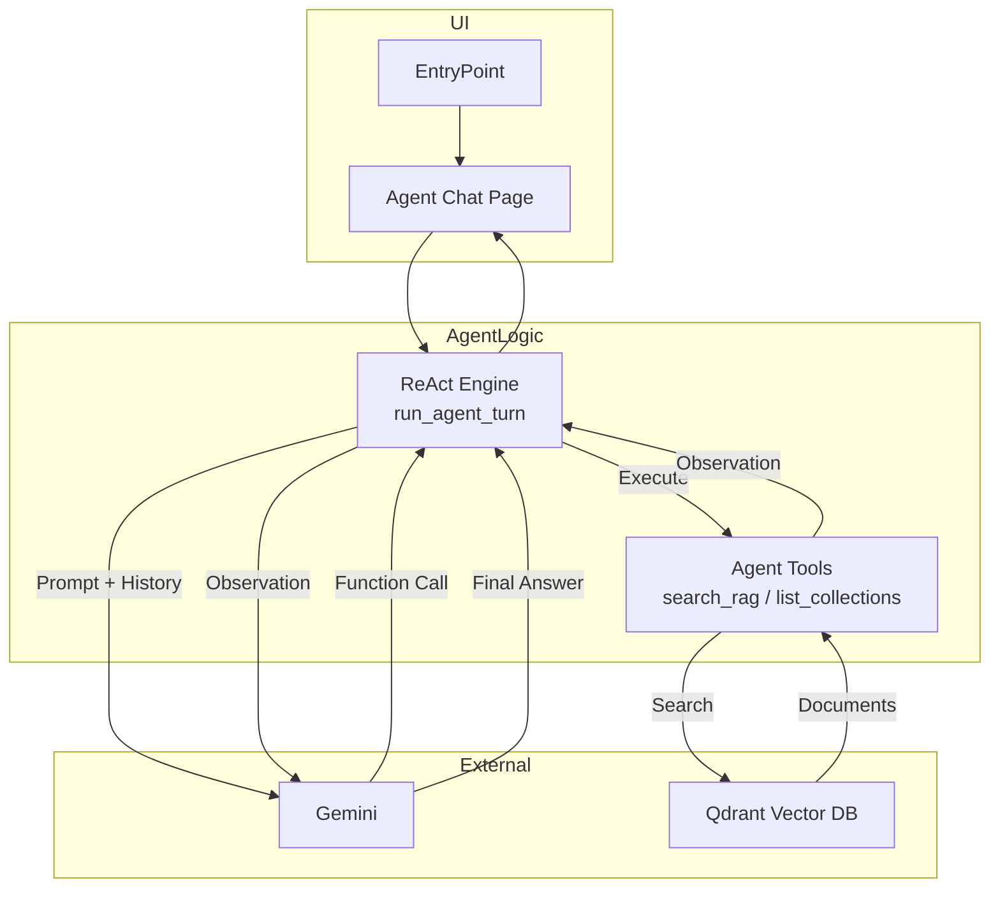

---

## 3. データフロー

(基本構成は既存と同様。RAGデータ生成パイプラインは変更なし)

### 3.1 エンドツーエンド処理フロー図

1. データDL -> 2. 前処理（プロンプト最適化、チャンク） -> 3. QA生成 -> 4. 埋め込み登録 -> **5. エージェントによる活用 (Search & Answer)**


---------------------------------------------

## 4. サービス層 & ツール層

### 4.1 agent_service.py - エージェント制御 (ReAct Engine)

**責務**: エージェントの思考プロセス (ReAct + Reflection) をカプセル化したコアサービス。

*   **クラス `ReActAgent`**:
    *   **セッション管理**: Gemini API とのチャットセッションを維持。
    *   **ReActループ**: 思考(Thought)と行動(Action)のサイクルを回し、ツール実行を制御。
    *   **Reflection**: 回答案生成後の自己評価・修正フェーズを実行。
    *   **イベント駆動**: 思考ログやツール実行結果をジェネレータとしてUIに逐次返却。

### 4.2 dataset_service.py - データセット操作

**責務**: データセットのロード、前処理、保存。

### 4.3 qdrant_service.py - Qdrant操作

**責務**: Qdrantクライアントの操作を抽象化し、コレクション管理・検索機能を提供。

### 4.4 file_service.py - ファイル操作

**責務**: アップロードされたファイルやローカルファイルの読み込み・保存・削除。

### 4.5 qa_service.py - Q/A生成

**責務**: テキストチャンクからQ/Aペアを生成するビジネスロジック (同期/非同期)。

### 4.6 agent_tools.py - エージェント用ツール


| 関数名                      | 説明                                                                           | 関連ツール名（LLM側）       |
| --------------------------- | ------------------------------------------------------------------------------ | --------------------------- |
| `search_rag_knowledge_base` | 指定されたコレクションからクエリに関連する情報を検索する。ベクトル検索を実行。 | `search_rag_knowledge_base` |
| `list_rag_collections`      | 利用可能なQdrantコレクションの一覧を返す。                                     | `list_rag_collections`      |

---

## 5. UI層 (ui/pages/)

### 5.1 画面一覧と遷移

サイドバーのラジオボタンにより、以下の画面を切り替え。

1. **説明 (`explanation`)**
2. **エージェント対話 (`agent_chat`)**
3. **未回答ログ (`log_viewer`)**
4. **RAGデータDL (`rag_download`)**
5. **Q/A生成 (`qa_generation`)**
6. **CSVデータ登録 (`qdrant_registration`)**
7. **Qdrantデータ管理 (`show_qdrant`)**
8. **Qdrant検索 (`qdrant_search`)**

### 5.2 各ページの機能詳細

#### `agent_chat_page.py` (エージェント対話)

* **機能**: Gemini 2.0 Flash を用いたチャットインターフェース。
* **特徴**:
  * **ReActループ**: 思考(Thought)と行動(Action)の可視化。
  * **Reflection**: 回答案生成後に自己評価・修正を行い、ハルシネーションの低減とスタイル統一を実現。
  * **マルチコレクション**: 検索対象のコレクションをサイドバーで選択可能。
  * **ストリーミング**: 思考プロセスを `st.expander` 内に逐次表示。

#### `log_viewer_page.py` (未回答ログ)

* **機能**: エージェントが「回答なし」と判断したクエリの履歴を表示・分析。

---

## 6. メニュー単位の処理概要・処理方式

### 6.1 📖 説明

システム全体の概要を表示。

### 6.2 🤖 エージェント対話

ReActエージェントがユーザーの質問に対し、ツール（検索）を使って回答を作成します。

* **思考の可視化**: 「なぜその検索を行うか」という推論過程を表示。
* **ツール利用**: `search_rag_knowledge_base` を自律的に呼び出し、Qdrantから情報を取得。
* **Reflection (推敲)**: 回答案を作成した後、自己評価フェーズを実行。正確性・適切性・スタイルを推敲し、より洗練された回答を提示します。

---

## 9. ReAct + Reflection エージェント詳細設計

本システムの中核である「ハイブリッド・ナレッジ・エージェント」の詳細設計です。
参考: `doc/11_agent_react.md`

### 9.1 ReAct + Reflection の仕組み


Geminiの Function Calling 機能を利用し、以下のサイクルを回します。


1. **ReAct フェーズ (解決)**:

   * **Thought (思考)**: ユーザーの入力に対し、外部知識が必要か、どのツールを使うべきか考える。
   * **Action (行動)**: ツール (`search_rag_knowledge_base`) を呼び出すことを決定し、APIにリクエスト。
   * **Observation (観察)**: ツールを実行し、その結果（検索結果やエラー）を取得。
   * **Draft Answer (ドラフト作成)**: 観察結果に基づき、回答案を生成。


2. **Reflection フェーズ (推敲)**:

* **Critique (批評)**: 生成されたドラフト回答に対し、検索結果（コンテキスト）との整合性やスタイルを自己評価。
* **Revise (修正)**: 必要に応じて回答を修正し、最終回答 (Final Answer) とする。

### 9.2 主要クラス・関数 IPO 定義

#### `services.agent_service.ReActAgent.execute_turn`

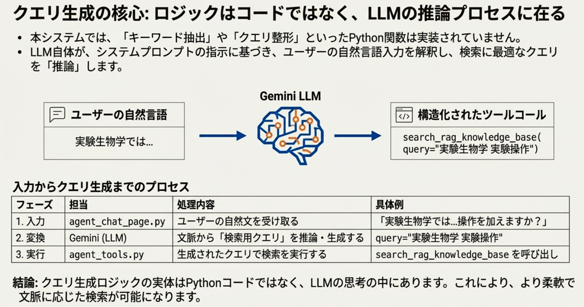
エージェントの1ターン（ユーザー発話〜最終回答）を制御するメインメソッド。ジェネレータとして実装されています。


| 項目        | 内容                                                                                                                                                                                                                                                                                                                                                                                                                                                                                                                                                                                 |
| ----------- | ------------------------------------------------------------------------------------------------------------------------------------------------------------------------------------------------------------------------------------------------------------------------------------------------------------------------------------------------------------------------------------------------------------------------------------------------------------------------------------------------------------------------------------------------------------------------------------ |
| **Input**   | `user_input`: ユーザーの質問文字列                                                                                                                                                                                                                                                                                                                                                                                                                                                                                                                                                   |
| **Process** | 1.`chat_session.send_message(user_input)` を送信。<br>2. **ReAct Loop**:<br>　a. 応答に `function_call` が含まれる場合、`tool_call` イベントをYield。<br>　b. ツール実行結果を `tool_result` イベントとしてYieldし、LLMに返送。<br>　c. 思考プロセスがあれば `log` イベントとしてYield。<br>　d. function_callがなくなるまでループ。<br>3. **Reflection Phase**:<br>　a. ドラフト回答を作成。<br>　b. `REFLECTION_INSTRUCTION` と共に自己評価を要求。<br>　c. 評価思考を `log` イベントとしてYield。<br>　d. 修正後の最終回答を抽出。<br>4. 最終回答を `final_answer` イベントとしてYield。 |
| **Output**  | `Generator[Dict[str, Any]]`: イベントストリーム<br>(例: `{'type': 'log', 'content': '...'}`, `{'type': 'final_answer', ...}`)                                                                                                                                                                                                                                                                                                                                                                                                                                                        |

#### `agent_tools.search_rag_knowledge_base`

RAG検索を実行するツール関数。


| 項目        | 内容                                                                                                                                                                                                                                                                                                    |
| ----------- | ------------------------------------------------------------------------------------------------------------------------------------------------------------------------------------------------------------------------------------------------------------------------------------------------------- |
| **Input**   | `query`: 検索クエリ<br>`collection_name`: 検索対象コレクション名 (Optional)                                                                                                                                                                                                                             |
| **Process** | 1. Qdrantヘルスチェック。<br>2. `collection_name` の存在確認。<br>3. `embed_query` でクエリをベクトル化 (Gemini Embedding)。<br>4. `search_collection` でベクトル検索。<br>5. スコア閾値 (`AgentConfig.RAG_SCORE_THRESHOLD`) でフィルタリング。<br>6. 検索結果を LLM が理解しやすいテキスト形式に整形。 |
| **Output**  | 整形された検索結果文字列 (または`[[NO_RAG_RESULT]]`)                                                                                                                                                                                                                                                    |

# Gemini Hybrid RAG Agent - 理論と実装リファレンス

本ドキュメントは、ReAct + Reflection エージェントの理論的背景（概念図）と、ユーザーが選択可能なGeminiモデルを活用した`agent_rag.py` および関連モジュールの実装詳細を体系的にまとめたリファレンスです。

---

## 第2部: アーキテクチャ概念 (Theoretical Architecture)

Gemini エージェントの思考プロセスは、大きく2つのフェーズ（解決と推敲）で構成されています。

## 2.1 Phase 1: ReAct (試行錯誤による解決)

ReActは、**「考え（Reasoning）」ながら「行動（Acting）」し、その結果を見てまた「考える」**というプロセスです。
AIは単に回答を出力するのではなく、外部ツール（検索など）を使いながら、情報が揃うまで行動を繰り返します。

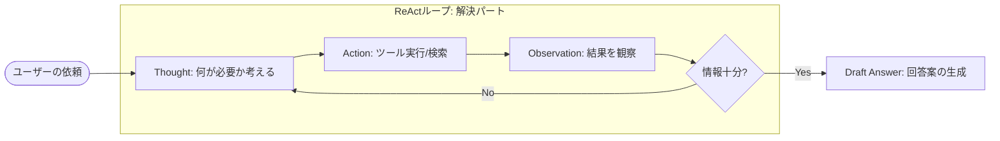

* **Thought**: 現在の状態を分析し、次に何をすべきか計画します。
* **Action**: ツール（検索）を実行します。
* **Observation**: ツールの実行結果（検索結果）を受け取ります。

## 2.1.1 入力文字列から検索クエリ生成までの処理構造（重要）

Pythonコード側で「キーワード抽出」や「クエリ整形」を行う専用の関数は実装されていません。
Geminiモデル自体が、システムプロンプトの指示に基づき、「入力文」を解釈し、「最適な検索クエリ」へと変換（推論） しています。

1. 入力フェーズ (Pythonコード: `ui/pages/agent_chat_page.py`)

* ユーザーの行動:
  チャット画面に自然文で質問を入力します。

  > 具体例: 「実験生物学では、生物の機構を解明するためにどのような操作を加えますか？」
  >
* コード処理 (`run_agent_turn` 関数):
  この文字列はそのまま Gemini API (chat_session.send_message) に渡されます。
  同時に、システムプロンプト (SYSTEM_INSTRUCTION_TEMPLATE) によって、モデルには以下の「思考のルール」が与えられています。

  > 指示: 「Thought: [なぜ検索が必要か、どのコレクションを、どんなクエリで検索するか]」
  >

2. 生成・推論フェーズ (Gemini API 内部)

* モデルの思考 (Reasoning):
  モデルはプロンプトの指示に従い、ユーザーの意図を汲み取りつつ、検索ツール (search_rag_knowledge_base)
  に渡すべき最適な引数を考えます。

  > 思考例: 「このユーザーの質問は長い。Qdrantで正確に検索するには、助詞を省いて重要なキーワードに絞ったほうが良いだろう。」
  >
* クエリの決定 (Function Call 生成):
  モデルは思考の結果に基づき、ツールの引数 query を生成します。ここでの出力が、実際の検索クエリとなります。

  > 生成パターン例:
  > ケースA (重要語抽出)*: "実験生物学 生物の機構 操作"
  > ケースB (キーワード化)*: "実験生物学 実験操作"
  > ケースC (そのまま)*: "実験生物学では、生物の機構を解明するためにどのような操作を加えますか？"
  >

※現状のプロンプトでは「キーワードのみにせよ」という強制はないため、モデルの文脈判断によりケースA～Cのように変動します。しかし、Geminは一般的に、検索に適した形（ケースAやB）へ自発的に変換する傾向があります。

3. 伝達・実行フェーズ (Pythonコード: `agent_tools.py`)

* コード処理 (`run_agent_turn` -> `search_rag_knowledge_base`):
  Gemini API から返ってきた function_call 情報（モデルが決めたクエリ）を Python 側で受け取り、そのまま検索関数を実行します。

```python
# agent_tools.py
def search_rag_knowledge_base(query: str, ...):
    # ここに来る時点で、query は既にモデルによって
    # "実験生物学 実験操作" などに変換されている可能性がある
    return qdrant_service.search_collection_rag(query, ...)
```

まとめ


| フェーズ | 担当               | 処理内容                                 | 具体例                                  |
| :------- | :----------------- | :--------------------------------------- | :-------------------------------------- |
| 1. 入力  | agent_chat_page.py | ユーザーの自然文を受け取る               | 「実験生物学では...操作を加えますか？」 |
| 2. 変換  | Gemini (LLM)       | 文脈から「検索用クエリ」を推論・生成する | 「実験生物学 実験操作」 (ケースB)       |
| 3. 実行  | agent_tools.py     | 生成されたクエリで検索を実行する         | query="実験生物学 実験操作" で検索      |

つまり、「クエリ生成ロジック」の実体は Python コードではなく、LLM の頭脳（推論プロセス）の中 にあります。

### 2.1.2 CoT (Chain of Thought) の処理構造（重要）

ReActエージェントは、最終的な回答を出す前に、思考(Thought)と行動(Action/Tool Call)を連鎖させ、論理的に答えを導き出します。
以下は、実際の実行ログに基づく思考の連鎖プロセスです。

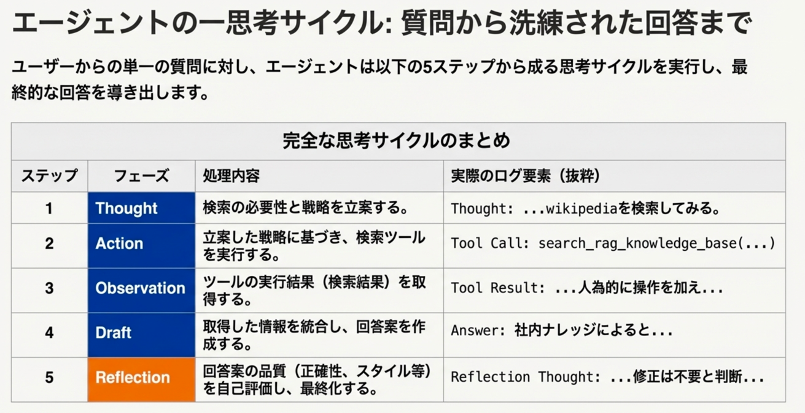

#### 具体的な挙動の仕組み (実行ログの追跡)

1. **初期思考 (Initial Thought)**

   * **入力**: 「実験生物学では、生物の機構を解明するためにどのような操作を加えますか？」
   * **LLMの推論**: 質問の意図を理解し、外部情報が必要か判断します。
   * **思考ログ**:
     > 🧠 Thought: [生物の機構を解明するための操作に関する質問なので、一般的な知識としてwikipediaを検索してみる。]
     >
2. **ツール実行 (Action & Observation)**

   * **LLMの行動**: 推論に基づき、適切なツールと引数を生成します。
   * **ツール呼び出し**:
     > 🛠️ Tool Call: `search_rag_knowledge_base`
     > Args: `{'collection_name': 'wikipedia_ja', 'query': '実験生物学\u3000生物機構\u3000操作'}`
     >
   * **ツールの結果 (Observation)**:
     > 📝 Tool Result: Result 1 (Score: 0.50): Q: 実験生物学では... A: 人為的に操作を加え通常と異なる条件を作り出し...
     >
3. **解決思考 (Reasoning & Draft)**

   * **LLMの推論**: 検索結果を読み、質問に答えられるか判断します。
   * **思考ログ**:
     > 🧠 Thought: [検索結果から、質問に対する回答が得られた。]
     >
   * **ドラフト回答**:
     > Answer: 社内ナレッジによると、実験生物学では...
     >
4. **推敲 (Reflection)**

   * **LLMの自己評価**:
     > 🤔 Reflection Thought: ** [自己評価: 回答は質問に直接的かつ明確に答えており...修正は不要と判断しました。]**
     >

#### まとめ


| ステップ | フェーズ        | 処理内容                 | 実際のログ要素                               |
| :------- | :-------------- | :----------------------- | :------------------------------------------- |
| **1**    | **Thought**     | 検索の必要性と戦略の立案 | `Thought: ...wikipediaを検索してみる。`      |
| **2**    | **Action**      | 検索ツールの実行         | `Tool Call: search_rag_knowledge_base`       |
| **3**    | **Observation** | 検索結果の取得           | `Tool Result: ...人為的に操作を加え...`      |
| **4**    | **Draft**       | 情報の統合と回答作成     | `Answer: 社内ナレッジによると...`            |
| **5**    | **Reflection**  | 回答の品質チェック       | `Reflection Thought: ...修正は不要と判断...` |

### 2.1.3 Reflectionフェーズ (自己省察と推敲) の処理構造（重要）

検索結果を基に一度回答を作成した後、さらに「推敲」を行うプロセスです。
これにより、回答の正確性やスタイルが、システム要件（丁寧な日本語など）に合致しているか自己評価し、必要に応じて修正します。

#### プロンプト戦略 (`REFLECTION_INSTRUCTION`)

`REFLECTION_INSTRUCTION` 定数にて、以下の観点でのチェックを指示しています。

1. **正確性 (Accuracy)**: 検索結果に基づいているか？ 幻覚 (Hallucination) はないか？
2. **適切性 (Relevance)**: ユーザーの質問に直接答えているか？
3. **スタイル (Style)**: 親しみやすく丁寧な日本語（です・ます調）か？ 箇条書き等のフォーマットは適切か？

#### 具体的な挙動の仕組み

1. **ドラフト生成フェーズ** (ReActループ終了後)

   * **LLMの思考**: 検索結果（wikipedia等）から情報を得たので、回答を作成します。
     > **思考例 (Thought)**: 「検索結果から、質問に対する回答が得られた。」
     >
   * **回答案 (Draft)**:
     > 「社内ナレッジによると、実験生物学では、生物に備わっている機構を解明するために、人為的に操作を加え通常と異なる条件を作り出し、その後の変化を観察・観測します。例えば、突然変異の誘発や遺伝子導入、移植実験などを行います。」
     >
   * **コード処理 (`run_agent_turn` 後半)**: この回答案を一時変数 `final_response_text` に保持します。
2. **推敲フェーズ** (Reflection)

   * **コード処理**: `REFLECTION_INSTRUCTION` (評価プロンプト) とドラフト回答を結合し、再度 Gemini に送信します。

     > **指示**: 「以下の基準で客観的に評価し...修正してください...思考プロセスは Thought: で始めてください。」
     >
   * **LLMの思考 (Reflection Thought)**: プロンプトに従い、自分の回答を評価します。

     > **思考例**: 「[自己評価: 回答は質問に直接的かつ明確に答えており、正確性、適切性、スタイルにも問題ないため、修正は不要と判断しました。]」
     >
   * **最終回答の生成 (Final Answer)**: 評価に基づき、最終版を出力します。

#### まとめ


| フェーズ    | 担当                 | 処理内容                             | 具体例                                                 |
| :---------- | :------------------- | :----------------------------------- | :----------------------------------------------------- |
| 1. 推敲指示 | `agent_chat_page.py` | ドラフト回答 + 評価プロンプトを送信  | `REFLECTION_INSTRUCTION` + 「社内ナレッジによると...」 |
| 2. 自己評価 | `Gemini (LLM)`       | 基準（正確性・スタイル）に従って評価 | 「自己評価: ...修正は不要と判断しました。」            |
| 3. 最終化   | `Gemini (LLM)`       | 修正版（またはそのまま）の回答を出力 | 「社内ナレッジによると...（最終回答）」                |

### 2.2 Phase 2: Reflection (自己省察と推敲)

Reflectionは、生成された回答（ドラフト）に対して客観的な批評を行い、品質を高めるプロセスです。

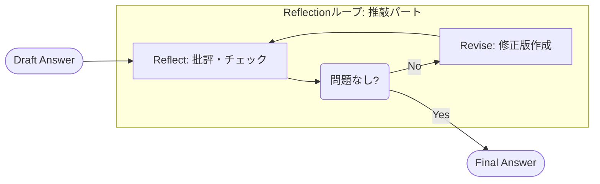

* **Reflect**: 正確性、適切性、スタイルをチェックします。
* **Revise**: 問題があれば修正し、最終回答を生成します。

## 2.3 統合モデル (ReAct + Reflection)

「動く（Action）」フェーズと「考える（Reflection）」フェーズを連携させることで、より高度な成果物を生み出します。

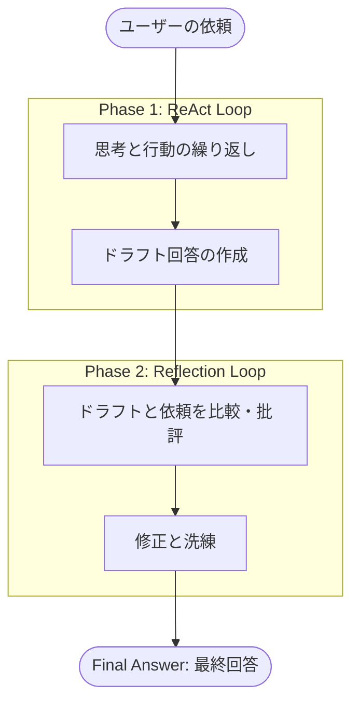

---

# 第3部: 実装詳細 (Implementation Details)

上面的理論が、実際のPythonコードでどのように実装されているか解説します。

## 2.4 エージェント制御: `ui/pages/agent_chat_page.py`

エージェントのライフサイクル管理を行うメインコントローラーです。

* **`setup_agent(selected_collections, model_name)` 関数**:
  * **役割**: エージェントを初期化し、`google.generativeai.GenerativeModel` インスタンスを生成します。
  * **詳細**: UIでユーザーが選択した `model_name` を引数として受け取り、そのモデル名を使用してLLMをセットアップします。これにより、利用するGeminiモデルを動的に切り替えることが可能です。

### ReActループの実装 (`run_agent_turn`)

Gemini API の `function_call` 機能と Python の `while` ループを組み合わせて ReAct を実現しています。

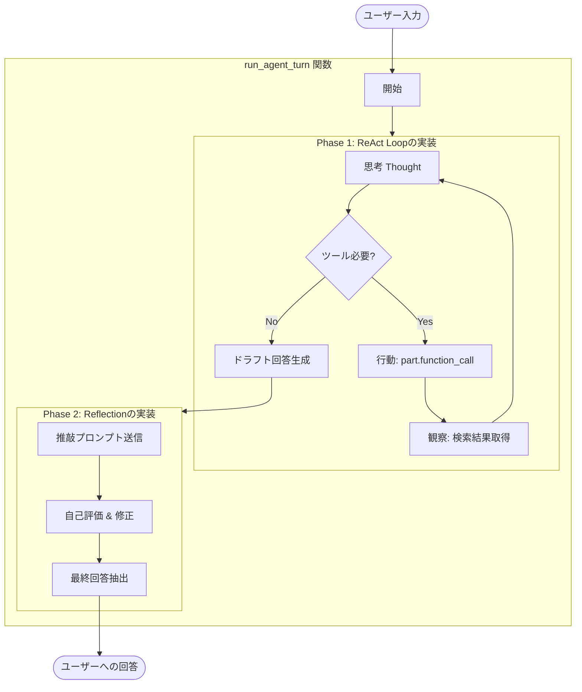

* **コード対応**: `run_agent_turn` 関数内の `while turn_count < max_turns:` ループ。
* **Thoughtの可視化**: モデルが出力する `Thought:` パートを抽出し、Streamlit UI (`st.expander`) にリアルタイム表示します。

### プロンプト設計

* **Router Guidelines (`SYSTEM_INSTRUCTION_TEMPLATE`)**:
  * **役割**: どのコレクション（`wikipedia_ja`, `livedoor`, `cc_news`）を使うべきかの判断基準を提供します。
  * **実装**: LLMはこのガイドラインに従い、自律的に適切なコレクションを選択します。
* **Reflection Strategy (`REFLECTION_INSTRUCTION`)**:
  * **役割**: ドラフト回答に対する評価基準（正確性・適切性・スタイル）を定義します。

## 2.5 ツール定義: `agent_tools.py`

LLM が呼び出すことができる「手足」となる関数群です。

* **`search_rag_knowledge_base(query, collection_name)`**:
  * **役割**: 指定されたコレクションに対して検索を実行します。
  * **詳細**: `services.qdrant_service.search_collection_rag` をラップし、LLMが使いやすいインターフェースを提供します。
* **`list_rag_collections()`**:
  * **役割**: 現在利用可能なコレクションの一覧を返します。

## 2.6 知識ベース検索: `services/qdrant_service.py`

Qdrant データベースとの対話、Embedding 生成、ハイブリッド検索を担当するコアモジュールです。

### Embedding (ベクトル化) の構成

`helper_embedding.py` に集約され、抽象化されています。


| 項目               | 詳細                                                                                                                                                |
| :----------------- | :-------------------------------------------------------------------------------------------------------------------------------------------------- |
| **抽象基底クラス** | `EmbeddingClient`                                                                                                                                   |
| **実装クラス**     | 1.**`GeminiEmbedding`**: Gemini API (`models.embed_content`) を使用。現在の主力。<br>2. **`OpenAIEmbedding`**: OpenAI API を使用。レガシー/互換用。 |
| **ファクトリ関数** | `create_embedding_client(provider="gemini", ...)`                                                                                                   |

### 検索ロジック (Hybrid Search)

Qdrant の **Hybrid RAG (Dense + Sparse)** 機能を活用しています。


| 処理フェーズ       | モジュール / 関数                                             | 詳細 (Input / Process / Output)                                                                                                                                                                 |
| :----------------- | :------------------------------------------------------------ | :---------------------------------------------------------------------------------------------------------------------------------------------------------------------------------------------- |
| **設定 (Setup)**   | `qdrant_client_wrapper.py`<br>`create_or_recreate_collection` | **Input**: `client`, `name`, `vector_size`<br>**Process**: DenseベクトルとSparseベクトルの両方の設定を行い、コレクションを作成。<br>**Output**: なし                                            |
| **実行 (Runtime)** | `qdrant_client_wrapper.py`<br>`search_collection`             | **Input**: `client`, `collection_name`, `query_vector`<br>**Process**: Dense (意味検索) と Sparse (キーワード検索) を組み合わせたハイブリッド検索を実行。<br>**Output**: 高精度な検索結果リスト |

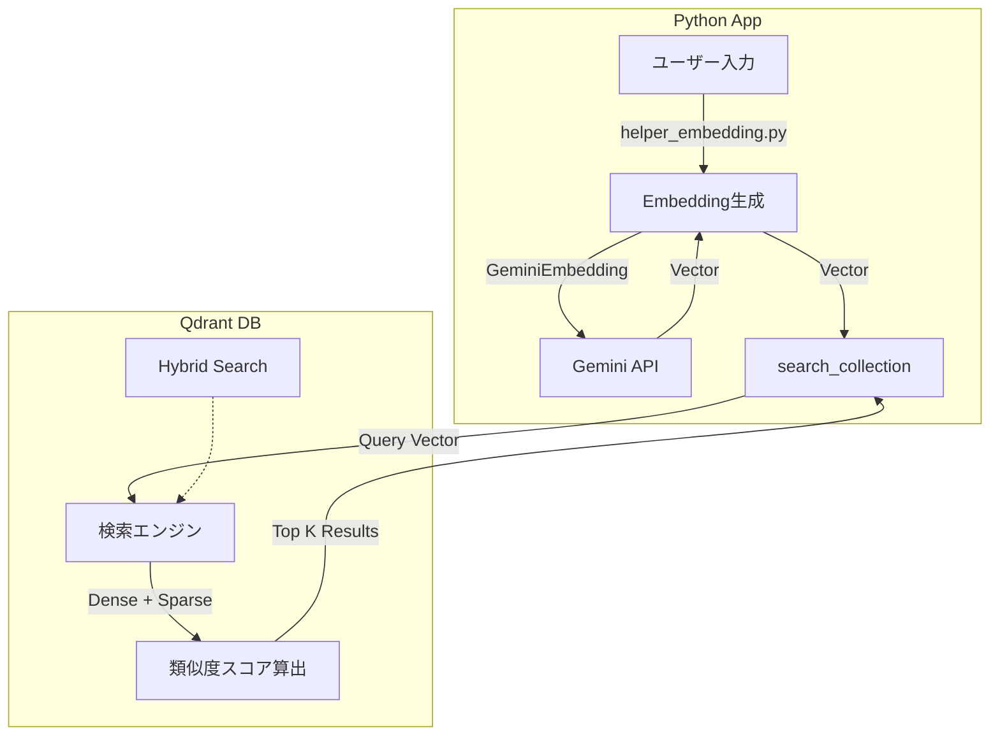

### 1. 検査機能（検索）を実現しているクラス・関数

`agent_rag.py` はあくまでエントリーポイント（画面遷移の管理）であり、実際の検索ロジックは **UI層** と **サービス層（ラッパー）** に分離されています。


| 層                | ファイル                         | 関数 / クラス               | 説明                                                                                                                                  |
| :---------------- | :------------------------------- | :-------------------------- | :------------------------------------------------------------------------------------------------------------------------------------ |
| **App Entry**     | `agent_rag.py`                   | `main()`                    | 画面選択ラジオボタンで「🔎 Qdrant検索」が選ばれると、下記の`show_qdrant_search_page` を呼び出します。                                 |
| **UI Layer**      | `ui/pages/qdrant_search_page.py` | `show_qdrant_search_page()` | 検索画面のメイン関数です。ユーザー入力（クエリ、設定）を受け取り、検索実行ボタン押下時に下記のバックエンド関数を呼び出します。        |
| **Service Layer** | `qdrant_client_wrapper.py`       | `search_collection()`       | **検索実行の中核関数です。** Qdrantクライアントに対してクエリを送信し、結果を受け取ります。ハイブリッド検索の分岐もここで行われます。 |
| **Service Layer** | `services/qdrant_service.py`     | `embed_query_for_search()`  | クエリ文字列を**Dense Vector**（密ベクトル）に変換します（Gemini or OpenAI API）。                                                    |

### 2. Dense + Sparse 機能を実現しているクラス・関数

「Dense + Sparse（ハイブリッド検索）」は、通常のベクトル検索（Dense）に加え、キーワード検索に近い性質を持つ **Sparse Vector** を組み合わせることで実現されています。


| 機能                  | ファイル                     | 関数 / クラス                                | 説明                                                                                                                            |
| :-------------------- | :--------------------------- | :------------------------------------------- | :------------------------------------------------------------------------------------------------------------------------------ |
| **Sparse Vector生成** | `qdrant_client_wrapper.py`   | `embed_sparse_query_unified()`               | クエリ文字列を**Sparse Vector**（疎ベクトル、キーワード重み）に変換します。内部で `helper_embedding_sparse.py` を呼び出します。 |
| **Hybrid検索実行**    | `qdrant_client_wrapper.py`   | `search_collection()`                        | 引数`sparse_vector` が渡された場合、DenseとSparseの両方を使って検索し、**RRF (Reciprocal Rank Fusion)** で結果を統合します。    |
| **コレクション定義**  | `services/qdrant_service.py` | `create_or_recreate_collection_for_qdrant()` | コレクション作成時に、Dense用設定に加え`sparse_vectors_config` を設定し、ハイブリッド検索可能な器を用意します。                 |
| **ポイント構築**      | `services/qdrant_service.py` | `build_points_for_qdrant()`                  | データ登録時に、DenseベクトルとSparseベクトルを一つの`PointStruct` にまとめて格納する構造を作ります。                           |

### 3. 構造と処理フロー

ハイブリッド検索が実行される際のデータフローと構造は以下の通りです。

#### A. 処理フロー

1. **UI入力**: `show_qdrant_search_page` でユーザーが「⚙️ ハイブリッド検索を有効にする」をチェックし、検索ボタンを押す。
2. **ベクトル化 (Parallel)**:
   * **Dense**: `embed_query_for_search(query)` → `[0.12, -0.5, ...]` (3072次元など)
   * **Sparse**: `embed_sparse_query_unified(query)` → `indices=[101, 503...], values=[0.5, 0.8...]`
3. **検索実行**: `search_collection(..., query_vector, sparse_vector)` が呼ばれる。
4. **Qdrantクエリ構築**:
   * Dense用とSparse用の2つの `models.Prefetch` オブジェクトを作成。
   * `models.FusionQuery(fusion=models.Fusion.RRF)` を使用して、2つの検索結果をスコアベースで融合するクエリを発行。
5. **結果表示**: 統合された検索結果（Hits）がUIに返却され、表示される。

#### B. データ構造 (Qdrant内部)

Qdrant内では、1つのポイント（ドキュメント）に対して「名前付きベクトル (Named Vectors)」としてDenseとSparseが共存しています。

```python
# build_points_for_qdrant 内での構造イメージ
PointStruct(
    id=...,
    vector={
        "default": [0.1, 0.2, ...],        # Dense Vector (意味検索用)
        "text-sparse": {                   # Sparse Vector (キーワードマッチ用)
            "indices": [12, 505, ...],
            "values": [0.9, 0.5, ...]
        }
    },
    payload={ "question": "...", "answer": "..." }
)
```

この構造により、`search_collection` 関数内で `using="default"` と `using="text-sparse"` を指定してそれぞれのベクトル空間を検索し、最後にマージすることが可能になっています。

## 第3部: 動作シーケンス (Runtime Behavior)

### 9.4 シーケンス図 (Agent Turn)

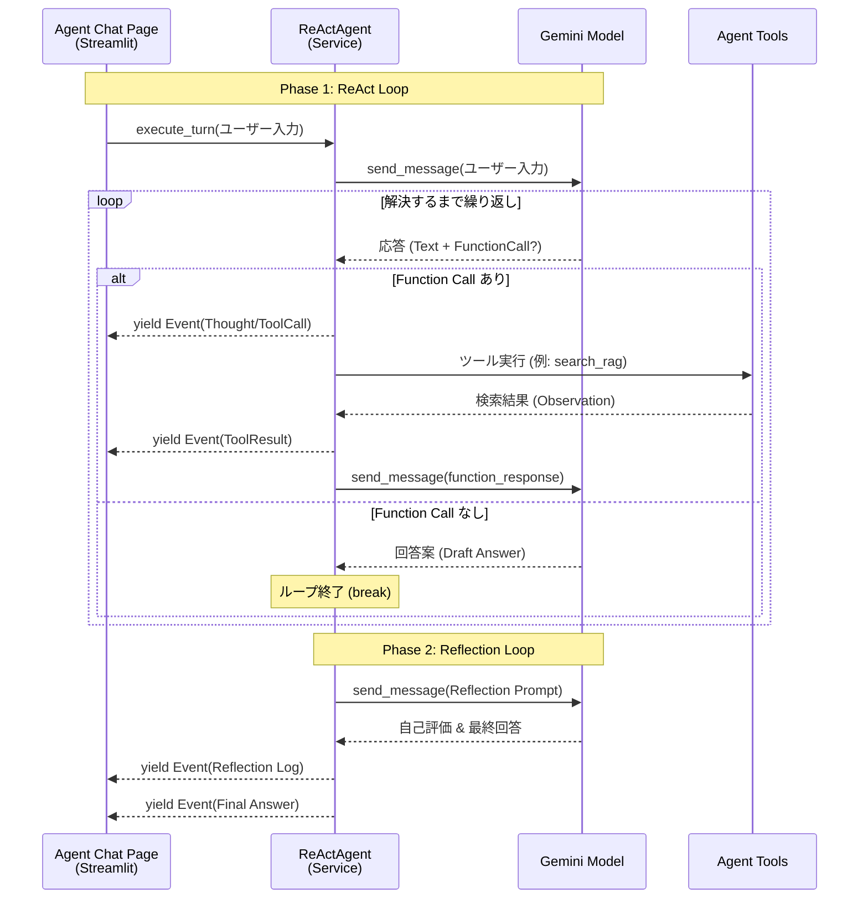

#### 主要構成要素


| 項目                   | 実装詳細                         | 役割                                                                                     |
| :--------------------- | :------------------------------- | :--------------------------------------------------------------------------------------- |
| **ループ制御**         | `while turn_count < max_turns:`  | 思考・行動サイクルの維持と無限ループ防止。                                               |
| **ツール実行**         | `part.function_call` 検知        | モデルがツール利用を要求した場合、対応する Python 関数 (`agent_tools.py`) を実行します。 |
| **結果フィードバック** | `chat_session.send_message(...)` | ツールの実行結果を`function_response` としてモデルに返し、次の思考を促します。           |

## 3.2 Router & Multi-turn Strategy

エージェントがどのように検索対象を決定し、失敗時にリカバリするかを示します。

1. **Router (コレクション選択)**:
   * ユーザー入力の内容に基づき、`SYSTEM_INSTRUCTION` のルールに従って最適なコレクションを決定します（例: 一般知識なら `wikipedia_ja`）。
2. **Multi-turn Strategy (リカバリ)**:
   * 検索結果が `[[NO_RAG_RESULT]]` だった場合、LLM は即座に諦めず、**別のコレクション**を試したり、**クエリを言い換え**て再検索を行います。

---

# 第4部: モジュール構成図 (Module Dependencies)

システムの全体的な依存関係図です。

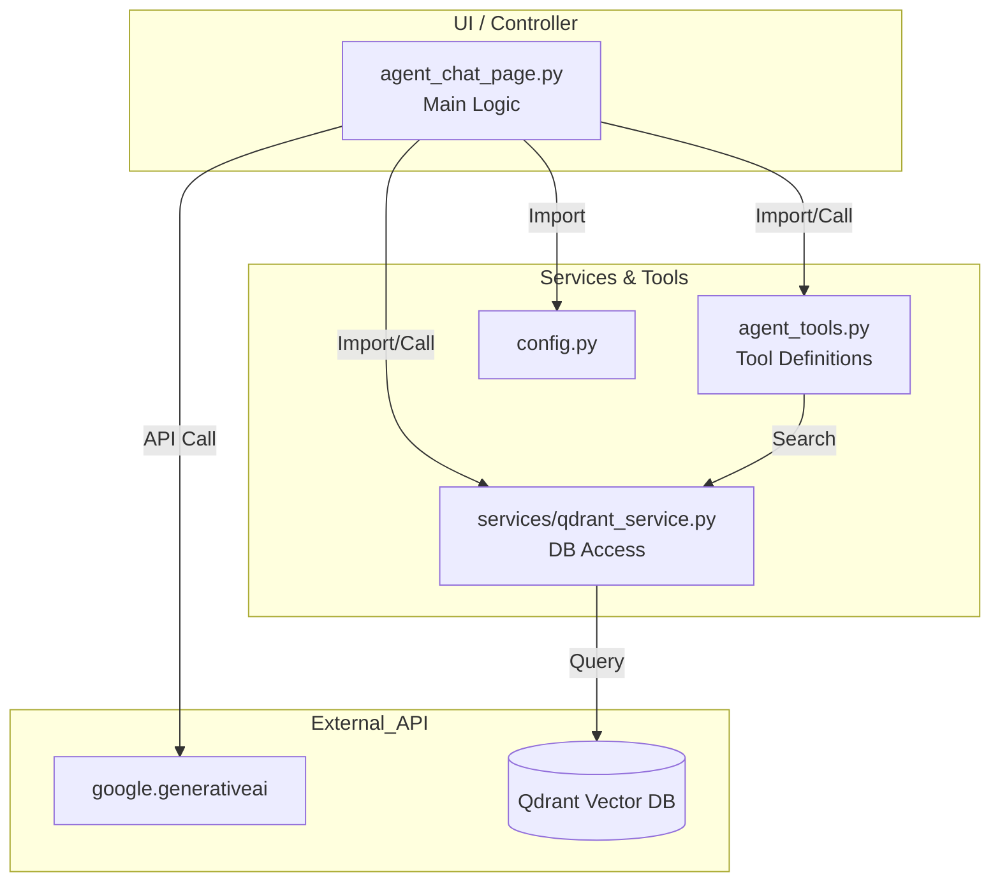
