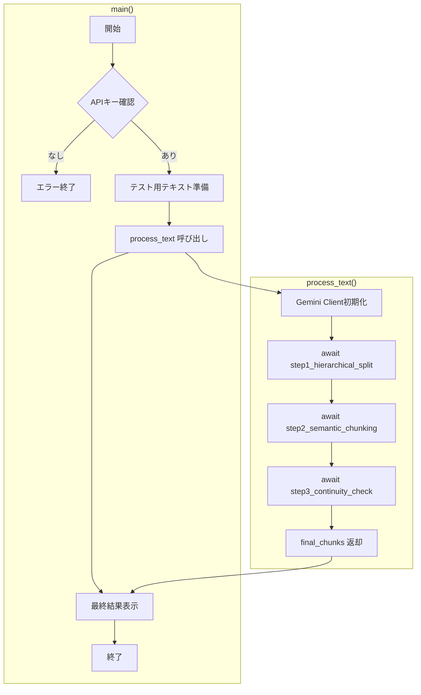
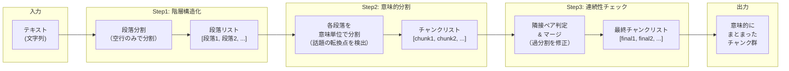
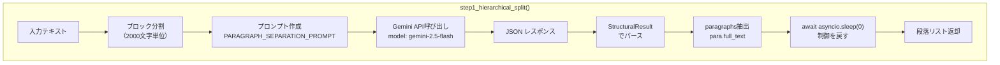
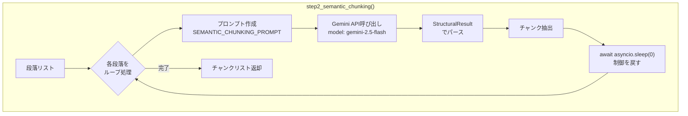
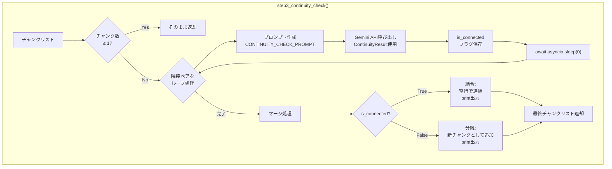
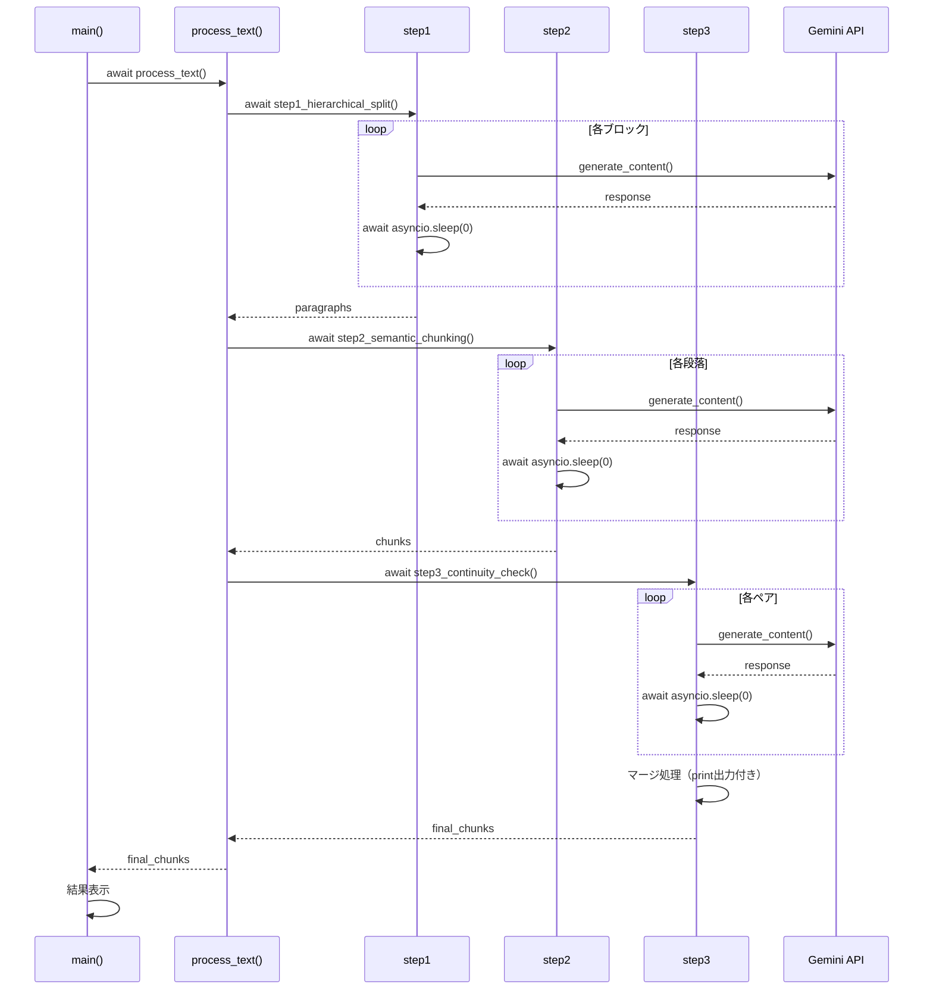
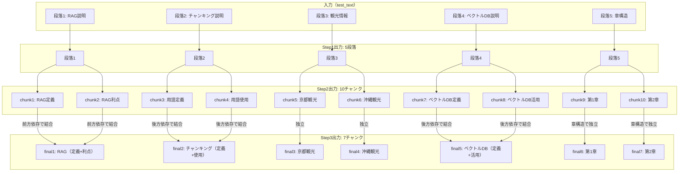
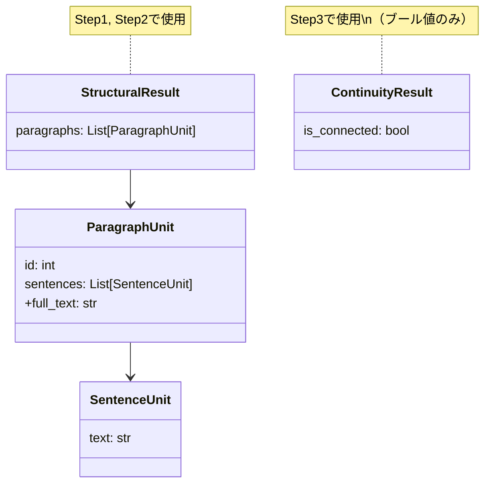

# Python 非同期処理（async/await）解説

**バージョン:** v3.1.0
**対象ファイル:** `check_async.py`
**共通モジュール:** `chunking/models.py`, `chunking/prompts.py`

## 対象読者
ソフトウェア開発の初級〜中級者で、Pythonの基本文法は理解している方

---

## 1. なぜ非同期処理が必要なのか

### 同期処理の問題点

通常のPythonプログラムは「同期処理」で動きます。

```python
# 同期処理の例
def make_coffee():
    print("コーヒーを淹れる（3分待つ）")
    time.sleep(180)  # 3分間、何もできない
    return "コーヒー完成"

def make_toast():
    print("トーストを焼く（2分待つ）")
    time.sleep(120)  # 2分間、何もできない
    return "トースト完成"

# 順番に実行 → 合計5分かかる
coffee = make_coffee()  # 3分待つ
toast = make_toast()    # さらに2分待つ
```

**問題**: コーヒーを淹れている間、トーストを焼き始められない。
実際の生活では、コーヒーメーカーが動いている間にトースターも動かせるのに。

### 非同期処理の解決策

```python
# 非同期処理の例
async def make_coffee():
    print("コーヒーを淹れる（待ち時間中は他の作業可能）")
    await asyncio.sleep(180)  # 待っている間、他の処理ができる
    return "コーヒー完成"

async def make_toast():
    print("トーストを焼く（待ち時間中は他の作業可能）")
    await asyncio.sleep(120)
    return "トースト完成"

# 並行実行 → 合計3分で済む（長い方の時間）
coffee, toast = await asyncio.gather(make_coffee(), make_toast())
```

---

## 2. 基本用語の理解

### async def - 非同期関数の定義

```python
# 通常の関数
def normal_function():
    return "結果"

# 非同期関数（コルーチン）
async def async_function():
    return "結果"
```

`async def`で定義した関数は「コルーチン」と呼ばれます。
普通に呼び出しても実行されず、`await`が必要です。

```python
# 間違い：これだけでは実行されない
result = async_function()  # → コルーチンオブジェクトが返るだけ

# 正解：awaitで実行を待つ
result = await async_function()  # → "結果"が返る
```

### await - 完了を待つ

`await`は「この処理が終わるまで待つ。待っている間は他の処理をしてもいいよ」という意味です。

```python
async def fetch_data():
    # APIからデータを取得（時間がかかる）
    response = await api_call()  # ← 待っている間、他のタスクが動ける
    return response
```

### asyncio.run() - 非同期処理の開始点

非同期処理を始めるには、イベントループが必要です。
`asyncio.run()`がそれを作成して実行します。

```python
async def main():
    result = await some_async_function()
    print(result)

# プログラムのエントリーポイント
if __name__ == "__main__":
    asyncio.run(main())  # ここでイベントループが起動
```

---

## 3. check_async.py のコード解説

### 全体構造

```
main()
  └── process_text()
        ├── step1_hierarchical_split()  # テキスト → 段落
        ├── step2_semantic_chunking()   # 段落 → チャンク
        └── step3_continuity_check()    # チャンク → 最終チャンク
```

### 各Stepの役割と違い

| Step | 入力 | 出力 | 変化 | スキーマ |
|:----:|------|------|:----:|---------|
| Step1 | テキスト | 段落リスト | 構造化 | StructuralResult |
| Step2 | 段落リスト | チャンクリスト | 増加 | StructuralResult |
| Step3 | チャンクリスト | 最終チャンク | 減少 | ContinuityResult |

### Step1: 階層構造化（段落分割）

```python
async def step1_hierarchical_split(text: str, client: genai.Client, block_size: int = 2000) -> list[str]:
    """
    テキストを段落単位に分割する

    【目的】
    テキストを段落単位に分割する。
    見出し（第X章など）と本文は分離せず、1つの段落としてまとめる。

    【分割ルール】
    - 空行（\\n\\n）が存在する箇所のみで分割
    - 見出しと直後の本文は空行がなければ同じ段落に
    - 章が変わっても空行がなければ分割しない
    - 改行（\\n）だけでは分割しない
    """
    # テキストをブロックに分割
    blocks = [text[i:i + block_size] for i in range(0, len(text), block_size)]

    paragraphs = []
    for i, block in enumerate(blocks):
        # プロンプト作成
        prompt = f"{PARAGRAPH_SEPARATION_PROMPT}\n\n【入力テキスト】\n{block}"

        # Gemini API 呼び出し（同期だが、awaitで他の処理に制御を渡せる）
        # gemini-2.5-flash: 最新の安定版、高いレート制限とパフォーマンス
        # URL: https://ai.google.dev/gemini-api/docs/text-generation?lang=python
        response = client.models.generate_content(
            model="gemini-2.5-flash",
            contents=prompt,
            config=types.GenerateContentConfig(
                response_mime_type="application/json",
                response_schema=StructuralResult
            )
        )

        # パース
        result = StructuralResult.model_validate_json(response.text)

        # 段落を抽出
        for para in result.paragraphs:
            paragraphs.append(para.full_text)

        # 非同期のポイント: 他のタスクに制御を渡す
        await asyncio.sleep(0)

    return paragraphs
```

**ポイント**:
- テキストを2000文字単位のブロックに分割して処理
- `async def`で定義することで、呼び出し元が`await`で待てるようになる
- 空行（`\n\n`）のみを分割基準とする

### Step2: 意味的分割

```python
async def step2_semantic_chunking(paragraphs: list[str], client: genai.Client) -> list[str]:
    """
    段落を意味的なチャンクに分割する

    【目的】
    段落を意味的な類似度に基づいて再構成する。
    話題の転換点で分割し、形式的な改行ではなく意味のまとまりで分割する。

    【Step1との違い】
    - Step1: 物理的構造（空行のみ）で分割
    - Step2: 意味的な類似度（話題の転換）で分割
    - 章の変わり目（第1章→第2章）はStep2で分割
    """
    chunks = []

    # Step1との違い: Step1はブロック（2000文字）単位、Step2は段落単位で処理
    for i, para in enumerate(paragraphs):
        # プロンプト作成
        prompt = f"{SEMANTIC_CHUNKING_PROMPT}\n\n【入力テキスト】\n{para}"

        # Gemini API 呼び出し（同期）
        # gemini-2.5-flash: 最新の安定版、高いレート制限
        # URL: https://ai.google.dev/gemini-api/docs/text-generation?lang=python
        response = client.models.generate_content(
            model="gemini-2.5-flash",
            contents=prompt,
            config=types.GenerateContentConfig(
                response_mime_type="application/json",
                response_schema=StructuralResult
            )
        )

        # パース
        result = StructuralResult.model_validate_json(response.text)

        for chunk_para in result.paragraphs:
            chunks.append(chunk_para.full_text)

        # ★重要★ イベントループに制御を戻す
        await asyncio.sleep(0)

    return chunks
```

**`await asyncio.sleep(0)` の意味**:
- 0秒待つ = 実質的に待たない
- しかし、イベントループに「他にやることある？」と確認する
- 長いループ処理中に、他のタスクに実行機会を与える

### Step3: 文脈連続性チェック

```python
async def step3_continuity_check(chunks: list[str], client: genai.Client) -> list[str]:
    """
    隣接チャンク間の連続性をチェックし結合/分離する

    【目的】
    隣接するチャンク間の文脈連続性を判定し、
    連続している場合は結合、非連続の場合は分離する。

    【Step2との違い】
    - Step2: 分割（1段落→複数チャンク、チャンク数が増加）
    - Step3: 結合（複数チャンク→少数チャンク、チャンク数が減少）
    - Step3はStep2の「過分割」を修正する役割

    【検証パターン】
    - 前方依存: 「この」「それ」等の指示語で前を参照 → 結合（True）
    - 後方依存: 専門用語が未定義のまま使用 → 結合（True）
    - 話題転換: 完全に別のトピック → 分離（False）
    - 独立判定: 話題は同じでも単独で理解可能 → 分離（False）
    - 章構造: 章が変わった場合 → 分離（False）
    """
    # 早期リターン（チャンクが少ない場合）
    if len(chunks) <= 1:
        return chunks

    # 連続性判定のループ
    continuity_flags = []
    for i in range(len(chunks) - 1):
        # プロンプト作成
        prompt = f"{CONTINUITY_CHECK_PROMPT}\n\n【前のテキスト】\n{chunks[i]}\n\n【次のテキスト】\n{chunks[i + 1]}"

        # Gemini API 呼び出し（同期）
        # gemini-2.5-flash: 最新の安定版、高いレート制限
        # URL: https://ai.google.dev/gemini-api/docs/text-generation?lang=python
        # Step1, Step2との違い: Step3はContinuityResult（ブール値のみ）を使用
        response = client.models.generate_content(
            model="gemini-2.5-flash",
            contents=prompt,
            config=types.GenerateContentConfig(
                response_mime_type="application/json",
                response_schema=ContinuityResult  # ブール値のみを返す
            )
        )

        result = ContinuityResult.model_validate_json(response.text)
        continuity_flags.append(result.is_connected)

        await asyncio.sleep(0)  # 他のタスクに制御を渡す

    # マージ処理
    print()
    print("マージ処理...")
    final_chunks = [chunks[0]]

    for i, is_connected in enumerate(continuity_flags):
        if is_connected:
            # 結合: 空行（\n\n）で連結し、段落構造を保持
            final_chunks[-1] += "\n\n" + chunks[i + 1]
            print(f"  チャンク{i + 1} + チャンク{i + 2} → 結合")
        else:
            # 分離: 新しいチャンクとして追加
            final_chunks.append(chunks[i + 1])
            print(f"  チャンク{i + 2} → 新規追加")

    return final_chunks
```

**マージ処理のポイント**:
- `is_connected=True`: 前のチャンクに結合（空行`\n\n`で連結）
- `is_connected=False`: 新しいチャンクとして追加
- 結合/分離の状況をprint出力（デバッグ・学習用）

### process_text: 順次実行の例

```python
async def process_text(text: str, api_key: str) -> list[str]:
    client = genai.Client(api_key=api_key)

    # await で順番に実行（直列処理）
    paragraphs = await step1_hierarchical_split(text, client)  # まずStep1
    chunks = await step2_semantic_chunking(paragraphs, client) # 次にStep2
    final_chunks = await step3_continuity_check(chunks, client) # 最後にStep3

    return final_chunks
```

**なぜ順番に実行？**:
- Step2はStep1の結果が必要
- Step3はStep2の結果が必要
- 依存関係があるため、並列実行できない

### main: エントリーポイント

```python
async def main():
    api_key = os.getenv("GOOGLE_API_KEY")
    if not api_key:
        print("エラー: GOOGLE_API_KEY 環境変数を設定してください")
        return

    test_text = """..."""

    # process_textの完了を待つ
    final_chunks = await process_text(test_text, api_key)

    # 結果表示
    for i, chunk in enumerate(final_chunks, 1):
        print(f"--- 最終チャンク{i} ({len(chunk)}文字) ---")
        print(chunk)

if __name__ == "__main__":
    asyncio.run(main())  # イベントループを起動してmain()を実行
```

---

## 4. 同期版との比較

### 同期版（step1.py, step2.py, step3.py）

```python
def step1_hierarchical_split(text: str, api_key: str) -> list[str]:
    client = genai.Client(api_key=api_key)
    response = client.models.generate_content(...)
    return paragraphs

def main():
    paragraphs = step1_hierarchical_split(text, api_key)

if __name__ == "__main__":
    main()
```

### 非同期版（check_async.py）

```python
async def step1_hierarchical_split(text: str, client: genai.Client) -> list[str]:
    response = client.models.generate_content(...)
    return paragraphs

async def main():
    paragraphs = await step1_hierarchical_split(text, client)

if __name__ == "__main__":
    asyncio.run(main())
```

**主な違い**:

| 項目 | 同期版 | 非同期版 |
|------|--------|----------|
| 関数定義 | `def` | `async def` |
| 関数呼び出し | `func()` | `await func()` |
| 実行開始 | `main()` | `asyncio.run(main())` |
| 待ち時間中 | 何もできない | 他のタスクを実行可能 |

---

## 5. このコードでの非同期の効果

### 現状のコード

このcheck_async.pyでは、Step1→Step2→Step3と順番に実行しているため、
実は同期版とほぼ同じ動作になっています。

```python
paragraphs = await step1(...)   # Step1完了まで待つ
chunks = await step2(...)       # Step2完了まで待つ
final = await step3(...)        # Step3完了まで待つ
```

### 非同期の真価が発揮される場面

**例1: 複数テキストを並列処理**

```python
async def process_multiple_texts(texts: list[str], api_key: str):
    client = genai.Client(api_key=api_key)

    # 複数のテキストを並列で処理
    tasks = [process_text(text, client) for text in texts]
    results = await asyncio.gather(*tasks)

    return results
```

**例2: Step2で各段落を並列処理**

```python
async def step2_parallel(paragraphs: list[str], client: genai.Client):
    # 各段落の処理を並列で実行
    tasks = [process_paragraph(para, client) for para in paragraphs]
    results = await asyncio.gather(*tasks)

    # 結果を結合
    chunks = []
    for result in results:
        chunks.extend(result)
    return chunks
```

---

## 6. よくある質問

### Q1: awaitを付け忘れるとどうなる？

```python
# 間違い
result = async_function()
print(result)  # → <coroutine object async_function at 0x...>

# 正解
result = await async_function()
print(result)  # → 期待した結果
```

警告メッセージも出ます:
`RuntimeWarning: coroutine 'async_function' was never awaited`

### Q2: 通常の関数からasync関数を呼べる？

直接は呼べません。`asyncio.run()`を使います。

```python
def normal_function():
    # これはエラー
    # result = await async_function()

    # これならOK
    result = asyncio.run(async_function())
    return result
```

### Q3: async関数から通常の関数を呼べる？

はい、普通に呼べます。

```python
def normal_function():
    return "結果"

async def async_function():
    result = normal_function()  # awaitは不要
    return result
```

### Q4: await asyncio.sleep(0) は本当に必要？

このコードでは、API呼び出しが同期的なので、`await asyncio.sleep(0)`がないと
ループ中ずっとCPUを占有してしまいます。

もしAPIクライアントが非同期対応（`await client.generate_content()`）なら、
`await asyncio.sleep(0)`は不要です。

---

## 7. まとめ

### 覚えるべき3つのキーワード

1. **async def**: 非同期関数を定義
2. **await**: 非同期関数の完了を待つ（待ち時間中は他の処理が動ける）
3. **asyncio.run()**: 非同期処理を開始する

### このコードでの学び

- 基本的な非同期関数の書き方
- awaitを使った順次実行
- `await asyncio.sleep(0)`でイベントループに制御を戻す方法
- 各Stepの役割と違い（物理分割 vs 意味分割 vs 連続性判定）

### 次のステップ

- `asyncio.gather()`で並列処理を学ぶ
- `asyncio.create_task()`でバックグラウンドタスクを学ぶ
- 非同期対応のHTTPクライアント（aiohttp, httpx）を使う

---

## 8. check_async.py 処理フロー図

### 8.1 全体処理フロー



### 8.2 データ処理フロー



### 8.3 各Stepの詳細処理

#### Step1: 階層構造化（段落分割）



#### Step2: 意味的分割



#### Step3: 文脈連続性チェック



### 8.4 非同期処理の流れ



### 8.5 データ変換の具体例



### 8.6 使用するPydanticモデル



### 8.7 async/await のポイント

| 要素 | 役割 | 使用箇所 |
|------|------|----------|
| `async def` | 非同期関数を定義 | 全関数 |
| `await` | 非同期関数の完了を待つ | 関数呼び出し時 |
| `asyncio.run()` | イベントループ起動 | `__main__` |
| `await asyncio.sleep(0)` | 制御をイベントループに戻す | Step1, Step2, Step3のループ内 |

---

## 9. 検証パターン一覧

### Step3での判定基準

| パターン | 説明 | 判定 | 例 |
|----------|------|:----:|-----|
| **前方依存** | 「この」「それ」等の指示語で前を参照 | 結合（True） | 「**この手法**の利点は...」 |
| **後方依存** | 専門用語が未定義のまま使用される | 結合（True） | 「**チャンク**サイズは...」 |
| **独立判定** | 話題は同じでも単独で理解可能 | 分離（False） | 京都観光と沖縄観光 |
| **章構造** | 章が変わった場合 | 分離（False） | 第1章 → 第2章 |

### 期待される処理結果

| ステップ | 入力 | 出力 | 変化 |
|:--------:|:----:|:----:|:----:|
| Step1 | 1テキスト | 5段落 | 構造化 |
| Step2 | 5段落 | 10チャンク | 増加 |
| Step3 | 10チャンク | 7チャンク | 減少 |

### Step3の詳細判定

| ペア | 判定 | 理由 |
|------|:----:|------|
| チャンク1→2 | **True** | 前方依存: 「この手法」「それ」 |
| チャンク2→3 | False | 話題転換: RAG → チャンキング |
| チャンク3→4 | **True** | 後方依存: 「チャンク」「埋め込み」未定義 |
| チャンク4→5 | False | 話題転換: チャンキング → 京都観光 |
| チャンク5→6 | False | 独立: 同じ「観光」だが単独で理解可能 |
| チャンク6→7 | False | 話題転換: 沖縄観光 → ベクトルDB |
| チャンク7→8 | **True** | 後方依存: 「ANN」「ベクトルDB」未定義 |
| チャンク8→9 | False | 話題転換: ベクトルDB → 機械学習 |
| チャンク9→10 | False | 章構造: 第1章 → 第2章 |
