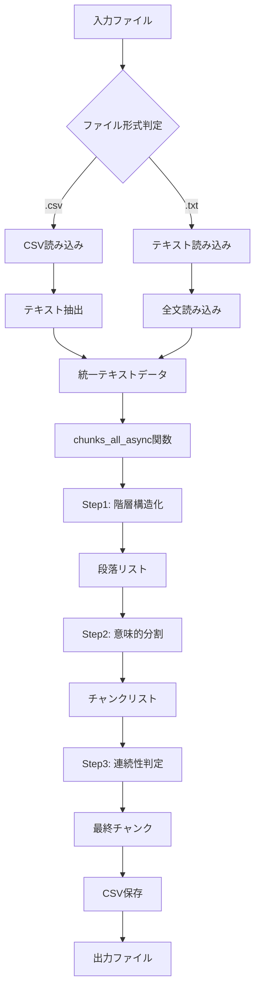

# csv_text_to_chunks_text_csv.py 詳細設計書

**バージョン:** v3.1.0
**最終更新:** 2026-01-23
**ファイル名の意味:** `csv_text` (CSV/テキスト入力) → `to_chunks` (チャンク化) → `text_csv` (テキスト/CSV出力)

## 📋 目次

1. [概要](#1-概要)
2. [v3.1.0での主要な変更点](#2-v310での主要な変更点)
3. [処理フロー全体図](#3-処理フロー全体図)
4. [データの流れ詳細](#4-データの流れ詳細)
5. [3段階チャンク化戦略](#5-3段階チャンク化戦略)
6. [関数別詳細設計](#6-関数別詳細設計)
7. [使用例](#7-使用例)
8. [トラブルシューティング](#8-トラブルシューティング)
9. [async並列処理の詳細](#9-async並列処理の詳細)

---

## 1. 概要

### 1.1 システムの目的

長文テキストを **意味的なまとまり（セマンティックチャンク）** に分割するシステム。
LLM（Gemini API）を活用し、形式的な区切りではなく、**文脈・トピックに基づいた高品質な分割** を実現。
チャンク方式は：step1:(階層構造化), step2(意味的分割), step3(連続性判定)とこれらの処理の並列化で実践向けとしました。

#### 速習コース：
- 3.1 システム全体の流れ： mermaid図で全体の処理を把握する（step1, step2, step3）
- 3.2 関数呼び出しの階層構造: step1:(階層構造化), step2(意味的分割), step3(連続性判定)
- 5.3段階チャンク化戦略 + 6-関数別詳細設計
- 具体例で、チャンクしてみる。step1.py, step2.py, step3.py
- 9. async並列処理の詳細（並列処理を確認する。）

### 1.2 主要機能一覧

| 機能 | 説明 | バージョン |
|------|------|-----------|
| `chunks_all_async()` | 3段階でテキストをチャンク化（非同期・並列処理） | v1.0.0 |
| `load_text_from_csv()` | CSVファイルからテキスト読み込み | v1.2.0 |
| `save_chunks_as_csv()` | チャンクをCSV保存（改行正規化対応） | v1.2.0 / v2.0.0 |
| `generate_output_filename()` | 出力ファイル名の自動生成 | v2.0.0 |
| `_normalize_whitespace()` | テキスト正規化（改行・空白削除） | v2.0.0 |

### 1.3 技術スタック

| 項目 | 技術 |
|------|------|
| 言語 | Python 3.10+ |
| LLM | Google Gemini API (`gemini-2.5-flash`) |
| 非同期処理 | asyncio + asyncio.to_thread() |
| 並列制御 | asyncio.Semaphore（デフォルト: 8並列） |
| データ検証 | Pydantic v2 |
| 進捗表示 | tqdm.asyncio |
| トークン計算 | tiktoken |

### 1.4 基本的な使用方法

```bash
# テキストファイルをチャンク化してCSV出力
python -m chunking.csv_text_to_chunks_text_csv \
  --input-file ./data/document.txt \
  --output chunks_output

# 出力: chunks_output/document_chunks_20260123_123456.csv
```

## 2. v3.1.0での主要な変更点

### 2.1 デフォルトモデルの更新

| 項目 | v2.0.0 | v3.1.0 |
|------|--------|--------|
| デフォルトモデル | `gemini-2.0-flash` | `gemini-2.5-flash` |
| 理由 | - | 高いレート制限とパフォーマンス |

### 2.2 コマンドライン引数（継続）

| 引数・オプション | 説明 |
|---------|---------|
| `--input-file` | 入力ファイル（.txt, .csv） |
| `--output` | 出力ディレクトリ（デフォルト: chunks_output） |
| `--model` | 使用するLLMモデル（デフォルト: gemini-2.5-flash） |
| `--workers` | 並列ワーカー数（デフォルト: 8） |
| `--block-size` | バッチサイズ（デフォルト: 2000文字） |
| `--verbose` | 詳細ログ出力 |
| `--resume` | 再開するジョブID |
| `--text-column` | CSVのテキストカラム名 |
| `--max-rows` | 最大処理行数（CSV用） |
| `--combine-rows` | CSV全行を結合 |

### 2.3 使用例

```bash
python -m chunking.csv_text_to_chunks_text_csv \
  --input-file input.txt --output chunks_output --model gemini-2.5-flash --workers 8
```

### 2.4 出力方式
- **ディレクトリ指定**: `--output`でディレクトリを指定
- **ファイル名自動生成**: `入力ファイル名_chunks_タイムスタンプ.csv`
- **CSV出力推奨**: テキスト出力は非推奨（後方互換性のみ）

---

## 3. 処理フロー全体図

### 3.1 システム全体の流れ



### 3.2 関数呼び出しの階層構造

| 階層 | 関数 | 説明 |
|:----:|------|------|
| 1 | `main()` | エントリーポイント |
| 1.1 | `load_text_from_csv()` | CSV読み込み（CSV入力時） |
| 1.2 | `generate_output_filename()` | 出力ファイル名自動生成 |
| 1.3 | `chunks_all_async()` | メイン処理 |
| 1.3.1 | `_step1_hierarchical_split()` | Step1: 階層構造化 |
| | → `AsyncAPIClient.generate_content()` × N回（並列） | |
| | → `CheckpointManager.save("step1")` | |
| 1.3.2 | `_step2_semantic_chunking()` | Step2: 意味的分割 |
| | → `AsyncAPIClient.generate_content()` × M回（並列） | |
| | → `CheckpointManager.save("step2")` | |
| 1.3.3 | `_step3_continuity_check()` | Step3: 連続性判定 |
| | → `AsyncAPIClient.generate_content()` × (M-1)回（並列） | |
| | → `CheckpointManager.save("step3")` | |
| 1.3.4 | `save_chunks_as_csv()` | CSV保存 |
| | → `_normalize_whitespace()` × チャンク数 | |

---

## 4. データの流れ詳細

### 4.1 データ変換の全体像

| 段階 | データ形式 |
|------|-----------|
| **入力** | CSV/テキストファイル |
| ↓ | |
| **統一テキスト** | `"第1章 はじめに\n\nこのドキュメントでは...\n\n第2章 基本操作\n\n..."` |
| ↓ | |
| **Step1: 階層構造化** | `["第1章 はじめに\n\nこのドキュメントでは...", "第2章 基本操作\n\n..."]` |
| ↓ | |
| **Step2: 意味的分割** | `["第1章 はじめに", "このドキュメントでは...", "第2章 基本操作", "..."]` |
| ↓ | |
| **Step3: 連続性判定** | `["第1章 はじめに\n\nこのドキュメントでは...", "第2章 基本操作\n\n..."]` |
| ↓ | |
| **CSV出力（正規化済み）** | `chunk_id,text,tokens,...` |

### 4.2 具体的な処理例

#### 入力テキストの例

```text
第1章 人工知能の基礎

人工知能（AI）は、コンピュータに人間のような知能を持たせる技術です。
機械学習やディープラーニングがその中核をなしています。

第2章 機械学習の手法

教師あり学習では、ラベル付きデータから学習します。
代表的な手法には、ランダムフォレストやサポートベクターマシンがあります。

ところで、昨日食べたラーメンが美味しかったです。
次回も同じ店に行きたいと思います。
```

### 4.3 各Stepの出力

**【Step1の出力（階層構造化）】**

| 段落 | 内容 |
|:----:|------|
| 段落1 | `"第1章 人工知能の基礎\n\n人工知能（AI）は...機械学習やディープラーニングがその中核をなしています。"` |
| 段落2 | `"第2章 機械学習の手法\n\n教師あり学習では...ところで、昨日食べたラーメンが美味しかったです。次回も同じ店に行きたいと思います。"` |

**【Step2の出力（意味的分割）】**

| チャンク | 内容 | 備考 |
|:--------:|------|------|
| 1 | `"第1章 人工知能の基礎\n\n人工知能（AI）は..."` | AI関連 |
| 2 | `"第2章 機械学習の手法\n\n教師あり学習では..."` | 機械学習関連 |
| 3 | `"ところで、昨日食べたラーメンが美味しかったです..."` | 話題転換を検出 |

**【Step3の出力（連続性判定）】**

| 最終チャンク | 内容 | 処理 |
|:------------:|------|------|
| 1 | `"第1章 人工知能の基礎...\n\n第2章 機械学習の手法..."` | AI+機械学習を結合（連続トピック） |
| 2 | `"ところで、昨日食べたラーメンが美味しかったです..."` | 独立（話題転換） |

**【CSV出力（正規化後）】**

```csv
chunk_id,text,tokens,chunk_idx,dataset_type,type,sentence_count,source_file
document_chunk_0,"第1章 人工知能の基礎 人工知能（AI）は...",156,0,document,llm_chunk,6,document.txt
document_chunk_1,"ところで、昨日食べたラーメンが美味しかったです...",38,1,document,llm_chunk,2,document.txt
```

---

## 5. 3段階チャンク化戦略

### 5.1 なぜ3段階が必要なのか？

| 問題 | 原因 | 解決するStep |
|------|------|:------------:|
| 見出しの分断 | 文字数で切ると見出しが途切れる | Step1 |
| 意味的混在 | 同じ段落内で話題が変わる | Step2 |
| 文脈の欠落 | 過剰に細分化すると代名詞の参照先が不明 | Step3 |

→ **3つの異なる視点を組み合わせることで、これらの問題を解決**

### 5.2 Step1: 階層構造化（Hierarchical Split）

#### 目的
文章の **論理構造（章・節・段落）** を尊重した分割

#### アルゴリズム

| ステップ | 処理内容 |
|:--------:|----------|
| 1 | 入力テキストを`block_size`（デフォルト2000文字）ごとに分割 |
| 2 | 各ブロックをLLMに送信（並列処理） |
| 3 | LLMが構造化:<br>・空行（`\n\n`）で段落を分割<br>・句点（。）で文を分割<br>・見出しと本文は分離せず、1つの段落として保持 |
| 4 | 全ブロックの結果を結合して段落リストを生成 |

#### Step1の効果

| 問題 | Step1がない場合 | Step1適用後 |
|------|----------------|------------|
| 見出しの分断 | 「第2章：SQL最」「適化」のように分割 | 「第2章 SQL最適化\n\n...」として完全に保持 |
| 文脈の断絶 | 途中で文が切れる | 必ず句点で分割 |
| 構造の喪失 | 章立てが不明確 | 章・段落の構造を維持 |

---

### 5.3 Step2: 意味的分割（Semantic Chunking）

#### 目的
**話題の転換点** を意味的に検出し、トピックごとに分割

#### アルゴリズム

| ステップ | 処理内容 |
|:--------:|----------|
| 1 | Step1の各段落をLLMに送信（並列処理） |
| 2 | LLMが段落内の文を分析:<br>・文の「意味的な距離」を判定<br>・話題が転換する箇所で分割<br>・物理的な改行は無視し、意味の純度を優先 |
| 3 | 分割されたチャンクを収集 |

#### RAGでの効果

| 状況 | Step2なし | Step2あり |
|------|-----------|-----------|
| 質問 | 「Gemini 2.0の主な特徴は？」 | 「Gemini 2.0の主な特徴は？」 |
| 検索チャンク | 「Gemini 2.0は...Bluetoothスピーカーの音質が...」 | 「Gemini 2.0は推論速度が向上し...」 |
| 回答品質 | ❌ 無関係な情報が混入 | ✅ 正確な回答 |

---

### 5.4 Step3: 連続性判定（Continuity Check）

#### 目的
過剰に分割されたチャンクを **文脈の連続性** に基づいて再結合

#### アルゴリズム

| ステップ | 処理内容 |
|:--------:|----------|
| 1 | Step2の隣接する2つのチャンクをペアでLLMに送信（並列処理） |
| 2 | LLMが判定:<br>・`is_connected = True` → 結合<br>・`is_connected = False` → 分離 |
| 3 | 全てのペアを判定し、結果を反映してチャンクを再構成 |

#### 判定基準

| 判定 | 条件 | 例 |
|:----:|------|-----|
| **True（結合）** | 前方依存: 指示語で前を参照 | 「**この手法**の利点は...」 |
| **True（結合）** | 後方依存: 専門用語が未定義で使用 | 「**チャンク**サイズは...」 |
| **True（結合）** | 同じトピックの説明が続く | 定義→活用の流れ |
| **False（分離）** | 章が変わった | 第1章 → 第2章 |
| **False（分離）** | 全く別の話題に転換 | RAG → 京都観光 |
| **False（分離）** | 独立して理解可能 | 京都観光と沖縄観光 |

---

### 5.5 3段階処理の比較表

| 項目 | Step1: 階層構造化 | Step2: 意味的分割 | Step3: 連続性判定 |
|------|------------------|-----------------|------------------|
| **英語名** | Hierarchical Split | Semantic Chunking | Continuity Check |
| **判断基準** | 物理構造（空行・句点） | 意味的距離（トピック） | 文脈の連続性 |
| **LLMの役割** | 構造解析 | 話題転換検出 | 文脈判定 |
| **入力** | 生テキスト | 段落リスト | チャンクリスト |
| **出力** | 段落リスト | チャンクリスト | 最終チャンクリスト |
| **API呼び出し数** | テキスト長/2000 | 段落数 | チャンク数-1 |
| **解決する問題** | 見出しの分断 | トピック混在 | 文脈の欠落 |
| **スキーマ** | StructuralResult | StructuralResult | ContinuityResult |

---

### 5.6 なぜ「Chunk Overlap」ではなく「Continuity Check」なのか？

| 方式 | 説明 | 問題点/利点 |
|------|------|-------------|
| **従来: Chunk Overlap** | 一部重複させる<br>`チャンク1: "ABCDE"`<br>`チャンク2: "CDEFG"` | ❌ ストレージ効率が悪い<br>❌ 重複部分の長さ調整が困難<br>❌ 無駄な情報の重複 |
| **本システム: Continuity Check** | 連続性を判定して結合<br>`1↔2: 連続 → 結合`<br>`2↔3: 非連続 → 分離` | ✅ 重複なし<br>✅ LLMが文脈を判断<br>✅ 自然で冗長性の少ないチャンク |

---

## 6. 関数別詳細設計

### 6.1 `chunks_all_async()` - メイン処理

#### シグネチャ

```python
async def chunks_all_async(
    text: str,
    model: str = "gemini-2.5-flash",
    max_workers: int = 8,
    block_size: int = 2000,
    checkpoint_manager: Optional[CheckpointManager] = None,
    output_file: Optional[str] = None,
    dataset_type: str = "custom",
    source_file: Optional[str] = None
) -> List[str]:
```

#### パラメータ詳細

| パラメータ | 型 | デフォルト | 説明 |
|-----------|-----|-----------|------|
| text | str | - | チャンク化対象のテキスト（必須） |
| model | str | `gemini-2.5-flash` | 使用するGeminiモデル |
| max_workers | int | 8 | 並列実行数（Semaphoreで制御） |
| block_size | int | 2000 | Step1のバッチサイズ（文字数） |
| checkpoint_manager | CheckpointManager | None | チェックポイント管理（省略時は自動生成） |
| output_file | str | None | 出力ファイルパス（省略時は保存しない） |
| dataset_type | str | custom | データセット種別（CSV出力時のメタデータ） |
| source_file | str | None | 元ファイル名（CSV出力時のメタデータ） |

#### 処理フロー

| ステップ | 処理内容 |
|:--------:|----------|
| 1 | AsyncAPIClientの初期化（Semaphoreで並列数を制御、リトライロジックを内包） |
| 2 | Step1: 階層構造化（テキストをblock_sizeで分割、各ブロックを並列でLLM処理、段落リストを生成・保存） |
| 3 | Step2: 意味的分割（各段落を並列でLLM処理、チャンクリストを生成・保存） |
| 4 | Step3: 連続性判定（隣接チャンクペアを並列でLLM処理、最終チャンクリストを生成・保存） |
| 5 | 出力処理（output_fileが指定されている場合、CSV保存、改行正規化を適用） |
| 6 | 最終チャンクリストを返す |

---

### 6.2 `load_text_from_csv()` - CSV入力処理

#### シグネチャ

```python
def load_text_from_csv(
    csv_path: str,
    text_column: Optional[str] = None,
    max_rows: Optional[int] = None,
    combine_rows: bool = False
) -> str:
```

#### パラメータ

| パラメータ | 説明 | 使用例 |
|-----------|------|--------|
| csv_path | CSVファイルパス | `"./data/articles.csv"` |
| text_column | テキストカラム名（省略時は自動検出） | `"content"` |
| max_rows | 最大処理行数（省略時は全行） | `1000` |
| combine_rows | 全行結合モード | `True`/`False` |

#### テキストカラムの自動検出ロジック

| 優先順位 | 候補 |
|:--------:|------|
| 1 | text, Text, TEXT |
| 2 | content, Content, CONTENT |
| 3 | Combined_Text, combined_text |
| 4 | body, Body, BODY |
| 5 | document, Document |
| 6 | answer, Answer |
| - | 検出できない場合: 最初のカラムを使用（警告あり） |

---

### 6.3 `save_chunks_as_csv()` - CSV出力処理

#### シグネチャ

```python
def save_chunks_as_csv(
    chunks: List[str],
    output_file: str,
    dataset_type: str = "custom",
    source_file: Optional[str] = None,
    normalize_whitespace: bool = True
) -> str:
```

#### CSV出力カラム

| カラム名 | 説明 | 例 |
|---------|------|-----|
| chunk_id | チャンクID | `document_chunk_0` |
| text | チャンクテキスト（正規化済み） | `"第1章 はじめに このドキュメントでは..."` |
| tokens | トークン数（tiktoken） | `245` |
| chunk_idx | チャンクインデックス | `0` |
| dataset_type | データセット種別 | `document` |
| type | チャンク種別（固定値） | `llm_chunk` |
| sentence_count | 文の数 | `5` |
| source_file | 元ファイル名 | `document.txt` |

#### 改行正規化の効果

| 状態 | テキスト |
|------|----------|
| 正規化前 | `"第1章\n\nこのドキュメントでは、\n基本的な概念を説明します。"` |
| 正規化後 | `"第1章 このドキュメントでは、 基本的な概念を説明します。"` |

---

### 6.4 `generate_output_filename()` - 出力ファイル名の自動生成

#### シグネチャ

```python
def generate_output_filename(
    input_file: str,
    output_dir: str,
    dataset_type: str = "custom"
) -> str:
```

#### 生成ルール

| 入力 | 出力 |
|------|------|
| `input_file = "data/document.txt"`<br>`output_dir = "chunks_output"` | `"chunks_output/document_chunks_20260123_123456.csv"` |
| `input_file = "articles.csv"`<br>`output_dir = "output"` | `"output/articles_chunks_20260123_143022.csv"` |

---

### 6.5 `_normalize_whitespace()` - テキスト正規化

#### 処理内容

| ステップ | 処理 |
|:--------:|------|
| 1 | 改行（`\n`, `\r`）を半角スペースに変換 |
| 2 | タブ（`\t`）を半角スペースに変換 |
| 3 | 連続する空白を1つに統合 |
| 4 | 先頭・末尾の空白を削除 |

#### 具体例

| 状態 | テキスト |
|------|----------|
| 入力 | `"第1章\n\nはじめに\n  基本的な    概念を\t説明します。  "` |
| 出力 | `"第1章 はじめに 基本的な 概念を 説明します。"` |

---

## 7. 使用例

### 7.1 コマンドライン実行

#### 基本的な使用（テキスト → CSV）

```bash
python -m chunking.csv_text_to_chunks_text_csv \
  --input-file ./data/document.txt \
  --output chunks_output

# 出力: chunks_output/document_chunks_20260123_123456.csv
```

#### CSV入力 → CSV出力

```bash
python -m chunking.csv_text_to_chunks_text_csv \
  --input-file ./data/articles.csv \
  --output chunks_output \
  --text-column content \
  --max-rows 1000 \
  --workers 8
```

#### 詳細ログを有効化

```bash
python -m chunking.csv_text_to_chunks_text_csv \
  --input-file document.txt \
  --output chunks_output \
  --verbose
```

#### カスタムモデルとパラメータ

```bash
python -m chunking.csv_text_to_chunks_text_csv \
  --input-file large_document.txt \
  --output chunks_output \
  --model gemini-2.5-flash \
  --workers 12 \
  --block-size 3000
```

---

### 7.2 Pythonスクリプトでの使用

#### 基本的な使用

```python
import asyncio
from chunking import chunks_all_async, CheckpointManager

async def main():
    # テキスト読み込み
    with open("document.txt", "r", encoding="utf-8") as f:
        text = f.read()

    # チャンク化
    checkpoint_manager = CheckpointManager()
    chunks = await chunks_all_async(
        text=text,
        model="gemini-2.5-flash",
        max_workers=8,
        block_size=2000,
        checkpoint_manager=checkpoint_manager,
        output_file="output/chunks.csv",
        dataset_type="document",
        source_file="document.txt"
    )

    print(f"チャンク数: {len(chunks)}")
    for i, chunk in enumerate(chunks[:3]):
        print(f"\nチャンク{i}: {chunk[:100]}...")

asyncio.run(main())
```

#### CSV入力の処理

```python
import asyncio
from chunking import load_text_from_csv, chunks_all_async, CheckpointManager

async def process_csv():
    # CSV読み込み
    text = load_text_from_csv(
        csv_path="dataset.csv",
        text_column="content",
        max_rows=500
    )

    # チャンク化
    chunks = await chunks_all_async(
        text=text,
        model="gemini-2.5-flash",
        output_file="output/chunks.csv"
    )

    return chunks

asyncio.run(process_csv())
```

---

## 8. トラブルシューティング

### 8.1 よくある問題と解決策

| 問題 | 原因 | 解決策 |
|------|------|--------|
| レート制限エラー | 並列数が多すぎる | `--workers 4` に減らす |
| メモリ不足 | 大きなテキストを処理 | `--block-size 4000` に増やす |
| 処理が遅い | 並列数が少ない | `--workers 12` に増やす |
| APIキーエラー | 環境変数未設定 | `export GOOGLE_API_KEY='your-key'` |
| CSV読み込みエラー | カラム名が見つからない | `--text-column` で明示的に指定 |

### 8.2 チェックポイントからの再開

```bash
# 前回のジョブIDを指定して再開
python -m chunking.csv_text_to_chunks_text_csv \
  --input-file document.txt \
  --output chunks_output \
  --resume job_20260123_123456
```

---

## 9. async並列処理の詳細

### 9.1 並列処理の仕組み

| コンポーネント | 役割 |
|---------------|------|
| `asyncio.Semaphore` | 同時実行数を制限（デフォルト: 8） |
| `asyncio.to_thread()` | 同期APIを非同期でラップ |
| `tqdm.asyncio.gather()` | 並列実行 + 進捗表示 |

### 9.2 各Stepの並列化

| Step | 並列対象 | 並列数 |
|:----:|----------|:------:|
| Step1 | ブロック（2000文字単位） | テキスト長 ÷ 2000 |
| Step2 | 段落 | 段落数 |
| Step3 | 隣接ペア | チャンク数 - 1 |

### 9.3 速度比較（参考値）

| 並列数 | 処理時間（相対） | 備考 |
|:------:|:---------------:|------|
| 1（逐次） | 100% | ベースライン |
| 4 | 30% | 安定性重視 |
| 8 | 15% | **推奨** |
| 12 | 12% | 速度重視 |
| 16 | 10% | 最大速度（レート制限注意） |

### 9.4 推奨設定

```bash
# 標準的な設定（推奨）
python -m chunking.csv_text_to_chunks_text_csv \
  --input-file document.txt \
  --output chunks_output \
  --model gemini-2.5-flash \
  --workers 8 \
  --block-size 2000
```

---

## 付録: 設計上の決定事項

### A. なぜ非同期・並列化？

| 項目 | 内容 |
|------|------|
| 理由 | API呼び出しはI/Oバウンド → 並列化で劇的な高速化 |
| 効果 | 逐次処理の6-8倍の速度 |

### B. なぜSemaphore固定？

| 項目 | 内容 |
|------|------|
| 理由 | レート制限回避 + 安定性重視 |
| 代替案 | Rate Limiterの実装（将来的に検討） |

### C. なぜチェックポイント？

| 項目 | 内容 |
|------|------|
| 理由 | 長時間処理のクラッシュ対策 |
| 効果 | 途中から再開可能 → 時間とコスト削減 |

### D. なぜ3段階処理？

| Step | 役割 |
|:----:|------|
| Step1 | 物理構造を維持 |
| Step2 | 意味的に分離 |
| Step3 | 文脈を最適化 |

**効果:** 単純分割より高品質で、文脈を保持したチャンク

### E. なぜ改行正規化？

| 項目 | 内容 |
|------|------|
| 理由 | CSV形式での可読性向上、パースエラーの削減、機械学習での前処理が簡単 |
| 効果 | クリーンで扱いやすいCSVデータセット |
