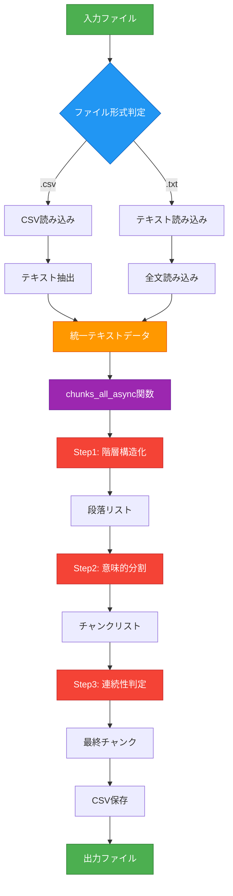

# csv_text_to_chunks_text_csv.py 詳細設計書

**バージョン:** v2.0.0
**最終更新:** 2026-01-19
**ファイル名の意味:** `csv_text` (CSV/テキスト入力) → `to_chunks` (チャンク化) → `text_csv` (テキスト/CSV出力)

## 📋 目次

1. [概要](#1-概要)
2. [v2.0.0での主要な変更点](#2-v200での主要な変更点)
3. [処理フロー全体図](#3-処理フロー全体図)
4. [データの流れ詳細](#4-データの流れ詳細)
5. [3段階チャンク化戦略](#5-3段階チャンク化戦略)
6. [関数別詳細設計](#6-関数別詳細設計)
7. [使用例](#7-使用例)
8. [トラブルシューティング](#8-トラブルシューティング)

---

## 1. 概要

### 1.1 システムの目的

長文テキストを **意味的なまとまり（セマンティックチャンク）** に分割するシステム。
LLM（Gemini API）を活用し、形式的な区切りではなく、**文脈・トピックに基づいた高品質な分割** を実現。
チャンク方式は：step1:(階層構造化), step2(意味的分割), step3(連続性判定)とこれらの処理の並列化で実践向けとしました。

#### 手っ取り早く、この技術を評価、取得したい方向けの速習コース：
- 3.1 システム全体の流れ： mermaid図で全体の処理を把握する（step1, step2, step3）
- 3.2 関数呼び出しの階層構造: step1:(階層構造化), step2(意味的分割), step3(連続性判定)
- 5.3段階チャンク化戦略 + 6-関数別詳細設計
- 具体例で、チャンクしてみる。
- 並列処理を確認する。

### 1.2 主要機能一覧

| 機能 | 説明 | バージョン |
|------|------|-----------|
| `chunks_all_async()` | 3段階でテキストをチャンク化（非同期・並列処理） | v1.0.0 |
| `load_text_from_csv()` | CSVファイルからテキスト読み込み | v1.2.0 |
| `save_chunks_as_csv()` | チャンクをCSV保存（改行正規化対応） | v1.2.0 / v2.0.0 |
| `generate_output_filename()` | 出力ファイル名の自動生成 | v2.0.0 |
| `_normalize_whitespace()` | テキスト正規化（改行・空白削除） | v2.0.0 |

### 1.3 技術スタック

- **言語:** Python 3.10+
- **LLM:** Google Gemini API (`gemini-2.0-flash`)
- **非同期処理:** asyncio + asyncio.to_thread()
- **並列制御:** asyncio.Semaphore（デフォルト: 8並列）
- **データ検証:** Pydantic v2
- **進捗表示:** tqdm.asyncio
- **トークン計算:** tiktoken

### 1.4 基本的な使用方法

```bash
# テキストファイルをチャンク化してCSV出力
python -m chunking.csv_text_to_chunks_text_csv \
  --input-file ./data/document.txt \
  --output chunks_output

# 出力: chunks_output/document_chunks_20260119_123456.csv
```

---

## 2. v2.0.0での主要な変更点

### 2.1 コマンドライン引数の統一化

#### 変更内容

|  引数・オプション | 変更内容 |
|---------|---------|
| `--input-file` | 短縮形削除、名称明確化 |
| `--output` | ディレクトリ指定に変更 |
| `--model` | 短縮形削除 |
| `--workers` | 短縮形削除 |
| `--block-size` | 短縮形削除 |
| `--verbose` | 短縮形削除 |

#### 使用例

```bash
python -m chunking.csv_text_to_chunks_text_csv \
  --input-file input.txt --output chunks_output --model gemini-2.0-flash --workers 8
```

### 2.2 出力方式
- **ディレクトリ指定**: `--output`でディレクトリを指定
- **ファイル名自動生成**: `入力ファイル名_chunks_タイムスタンプ.csv`
- **CSV出力推奨**: テキスト出力は非推奨（後方互換性のみ）
**例:**
```bash
--input-file data/document.txt --output chunks_output
# → 出力: chunks_output/document_chunks_20260119_123456.csv
```

### 2.3 デフォルトモデル
このプロジェクトではGemini APIを採用しています。
--model オプションで、評価したいモデルを指定します。

### 2.4 新機能: テキスト正規化
CSV出力時に改行・空白を自動正規化し、クリーンなCSVを生成。

**正規化の内容:**
- 改行(`\n`)を半角スペースに変換
- 連続する空白を1つに統合
- 先頭・末尾の空白を削除

（失敗例）チャンク分割の方式の失敗例：
- 最初は、チャンク分割に：Regex、重要単語の抽出に：Mecabを利用していましたが、
チャンク分割の「意味的なまとまりで分割する」、「文章の連続性を捉える」ができず、正規化、Mecab：複合名詞取得だけでは
結果、失敗でした。

## 3. 処理フロー全体図

### 3.1 システム全体の流れ



### 3.2 関数呼び出しの階層構造

```
main()
  ├─ load_text_from_csv() または ファイル読み込み
  │
  ├─ generate_output_filename()  ← v2.0.0新機能
  │
  ├─ chunks_all_async()  ← メイン処理
  │    │
  │    ├─ _step1_hierarchical_split()
  │    │    ├─ AsyncAPIClient.generate_content() × N回（並列）
  │    │    └─ CheckpointManager.save("step1")
  │    │
  │    ├─ _step2_semantic_chunking()
  │    │    ├─ AsyncAPIClient.generate_content() × M回（並列）
  │    │    └─ CheckpointManager.save("step2")
  │    │
  │    ├─ _step3_continuity_check()
  │    │    ├─ AsyncAPIClient.generate_content() × (M-1)回（並列）
  │    │    └─ CheckpointManager.save("step3")
  │    │
  │    └─ save_chunks_as_csv()
  │         └─ _normalize_whitespace() × チャンク数
  │
  └─ 完了ログ出力
```

---

## 4. データの流れ詳細

### 4.1 データ変換の全体像

```
【入力】
CSV/テキストファイル
    ↓
【統一テキスト】
"第1章 はじめに\n\nこのドキュメントでは...\n\n第2章 基本操作\n\n..."
    ↓
【Step1: 階層構造化】
["第1章 はじめに\n\nこのドキュメントでは...", "第2章 基本操作\n\n..."]
    ↓
【Step2: 意味的分割】
["第1章 はじめに", "このドキュメントでは...", "第2章 基本操作", "..."]
    ↓
【Step3: 連続性判定】
["第1章 はじめに\n\nこのドキュメントでは...", "第2章 基本操作\n\n..."]
    ↓
【CSV出力（正規化済み）】
chunk_id,text,tokens,...
document_chunk_0,"第1章 はじめに このドキュメントでは...",245,...
document_chunk_1,"第2章 基本操作 ...",198,...
```

### 4.2 具体的な処理例

#### 入力テキストの例

```text
第1章 人工知能の基礎

人工知能（AI）は、コンピュータに人間のような知能を持たせる技術です。
機械学習やディープラーニングがその中核をなしています。

第2章 機械学習の手法

教師あり学習では、ラベル付きデータから学習します。
代表的な手法には、ランダムフォレストやサポートベクターマシンがあります。

ところで、昨日食べたラーメンが美味しかったです。
次回も同じ店に行きたいと思います。
```

#### Step1の出力（階層構造化）

```python
[
  "第1章 人工知能の基礎\n\n人工知能（AI）は、コンピュータに人間のような知能を持たせる技術です。\n機械学習やディープラーニングがその中核をなしています。",

  "第2章 機械学習の手法\n\n教師あり学習では、ラベル付きデータから学習します。\n代表的な手法には、ランダムフォレストやサポートベクターマシンがあります。\n\nところで、昨日食べたラーメンが美味しかったです。\n次回も同じ店に行きたいと思います。"
]
```

**ポイント:**
- 章ごとに段落を分割
- 見出しと本文を1つの段落として保持
- 改行構造を維持

#### Step2の出力（意味的分割）

```python
[
  "第1章 人工知能の基礎\n\n人工知能（AI）は、コンピュータに人間のような知能を持たせる技術です。\n機械学習やディープラーニングがその中核をなしています。",

  "第2章 機械学習の手法\n\n教師あり学習では、ラベル付きデータから学習します。\n代表的な手法には、ランダムフォレストやサポートベクターマシンがあります。",

  "ところで、昨日食べたラーメンが美味しかったです。\n次回も同じ店に行きたいと思います。"
]
```

**ポイント:**
- 第2章の段落内で意味の転換を検出
- 「機械学習」と「ラーメン」という無関係なトピックを分離
- 物理的な段落構造を無視して意味優先で分割

#### Step3の出力（連続性判定）

```python
[
  "第1章 人工知能の基礎\n\n人工知能（AI）は、コンピュータに人間のような知能を持たせる技術です。\n機械学習やディープラーニングがその中核をなしています。\n\n第2章 機械学習の手法\n\n教師あり学習では、ラベル付きデータから学習します。\n代表的な手法には、ランダムフォレストやサポートベクターマシンがあります。",

  "ところで、昨日食べたラーメンが美味しかったです。\n次回も同じ店に行きたいと思います。"
]
```

**ポイント:**
- 第1章と第2章は連続したトピック（AI→機械学習）なので結合
- ラーメンの話は全く別のトピックなので独立したチャンク

#### CSV出力（正規化後）

```csv
chunk_id,text,tokens,chunk_idx,dataset_type,type,sentence_count,source_file
document_chunk_0,"第1章 人工知能の基礎 人工知能（AI）は、コンピュータに人間のような知能を持たせる技術です。 機械学習やディープラーニングがその中核をなしています。 第2章 機械学習の手法 教師あり学習では、ラベル付きデータから学習します。 代表的な手法には、ランダムフォレストやサポートベクターマシンがあります。",156,0,document,llm_chunk,6,document.txt
document_chunk_1,"ところで、昨日食べたラーメンが美味しかったです。 次回も同じ店に行きたいと思います。",38,1,document,llm_chunk,2,document.txt
```

**ポイント:**
- 改行が半角スペースに変換され、CSV形式としてクリーン
- トークン数、文数などのメタデータが付与
- データ分析や機械学習に適した形式

---

## 5. 3段階チャンク化戦略

### 5.1 なぜ3段階が必要なのか？

単純な文字数分割やベクトル類似度だけでは不十分な理由:

1. **物理構造の無視**: 文字数で切ると見出しが分断される
2. **意味的混在**: 同じ段落内でも話題が変わることがある
3. **文脈の欠落**: 過剰に細分化すると代名詞の参照先が不明

→ **3つの異なる視点を組み合わせることで、これらの問題を解決**

### 5.2 Step1: 階層構造化（Hierarchical Split）

#### 5.2.1 目的

文章の **論理構造（章・節・段落）** を尊重した分割

#### 5.2.2 アルゴリズム

```
1. 入力テキストをblock_size（デフォルト2000文字）ごとに分割
2. 各ブロックをLLMに送信
3. LLMが以下のルールで構造化:
   - 空行（\n\n）で段落を分割
   - 句点（。）で文を分割
   - 見出しと本文は分離せず、1つの段落として保持
4. 全ブロックの結果を結合して段落リストを生成
```

#### 5.2.3 LLMへのプロンプト

```
あなたはテキスト構造化エンジンです。
入力されたテキストを階層構造（段落 > 文）に変換してください。

【分割ルール】
- **見出しと本文を分離しないこと**
- 「第〇章」や「見出し」がある場合、直後の本文も含めて1つのParagraph
- Paragraphを分ける基準は「空行（\n\n）」や「章の変わり目」のみ
```

#### 5.2.4 具体例

**入力:**
```text
第1章 データベース設計

データベース設計は、システム開発の基礎です。正規化により、データの冗長性を削減します。第2正規形では、部分関数従属性を排除します。

第2章 SQL最適化

クエリのパフォーマンス向上には、インデックスが重要です。
```

**Step1の出力（JSON構造）:**
```json
{
  "paragraphs": [
    {
      "id": 0,
      "sentences": [
        {"text": "第1章 データベース設計\n\n"},
        {"text": "データベース設計は、システム開発の基礎です。"},
        {"text": "正規化により、データの冗長性を削減します。"},
        {"text": "第2正規形では、部分関数従属性を排除します。"}
      ]
    },
    {
      "id": 1,
      "sentences": [
        {"text": "第2章 SQL最適化\n\n"},
        {"text": "クエリのパフォーマンス向上には、インデックスが重要です。"}
      ]
    }
  ]
}
```

**Step1の出力（結合後のテキストリスト）:**
```python
[
  "第1章 データベース設計\n\nデータベース設計は、システム開発の基礎です。正規化により、データの冗長性を削減します。第2正規形では、部分関数従属性を排除します。",

  "第2章 SQL最適化\n\nクエリのパフォーマンス向上には、インデックスが重要です。"
]
```

#### 5.2.5 Step1の効果

| 問題 | Step1がない場合 | Step1適用後 |
|------|----------------|------------|
| 見出しの分断 | 「第2章：SQL最」「適化」のように分割 | 「第2章 SQL最適化\n\n...」として完全に保持 |
| 文脈の断絶 | 途中で文が切れる | 必ず句点で分割 |
| 構造の喪失 | 章立てが不明確 | 章・段落の構造を維持 |

---

### 5.3 Step2: 意味的分割（Semantic Chunking）

#### 5.3.1 目的

**話題の転換点** を意味的に検出し、トピックごとに分割

#### 5.3.2 アルゴリズム

```
1. Step1の各段落をLLMに送信（並列処理）
2. LLMが段落内の文を分析:
   - 文の「意味的な距離」を判定
   - 話題が転換する箇所で分割
   - 物理的な改行は無視し、意味の純度を優先
3. 分割されたチャンクを収集
```

#### 5.3.3 LLMへのプロンプト

```
あなたは「セマンティック・チャンキング（意味的分割）エンジン」です。
入力されたテキストを「意味のまとまり（トピック）」に基づいて再構成してください。

【処理ロジック】
1. 隣り合う文同士の「意味的な距離」を分析
2. 文の内容が連続している場合は同じブロックに結合
3. **話題の転換点**を見つけたら分割

【分割の基準】
- 文字数や物理的な改行（\n）は無視
- 改行がなくても、話題が大きく変われば分割
- 改行があっても、文脈や意味が続いているなら分割しない
```

#### 5.3.4 具体例: トピック混在の検出

**入力（Step1の1つの段落）:**
```text
最新のGemini 2.0は、推論速度が大幅に向上しています。
コンテキスト長も200万トークンまで拡大され、大規模文書の処理が可能になりました。
また、マルチモーダル機能により、画像と音声の同時処理も実現しています。

話は変わりますが、先週購入したBluetoothスピーカーの音質が素晴らしいです。
低音の響きが非常にクリアで、映画鑑賞にも最適です。
次は、同じメーカーのヘッドホンも購入しようと考えています。
```

**Step2の処理:**

LLMが文の意味的距離を分析:

```
文1: "Gemini 2.0は、推論速度が大幅に..."
文2: "コンテキスト長も200万トークンまで..."
文3: "また、マルチモーダル機能により..."
→ トピック: AIモデルの性能向上（類似度: 高）

文4: "話は変わりますが、先週購入したBluetoothスピーカーの..."
→ トピック転換検出！（類似度: 低）

文5: "低音の響きが非常にクリアで..."
文6: "次は、同じメーカーのヘッドホンも..."
→ トピック: オーディオ機器（類似度: 高）
```

**Step2の出力:**
```python
[
  "最新のGemini 2.0は、推論速度が大幅に向上しています。\nコンテキスト長も200万トークンまで拡大され、大規模文書の処理が可能になりました。\nまた、マルチモーダル機能により、画像と音声の同時処理も実現しています。",

  "話は変わりますが、先週購入したBluetoothスピーカーの音質が素晴らしいです。\n低音の響きが非常にクリアで、映画鑑賞にも最適です。\n次は、同じメーカーのヘッドホンも購入しようと考えています。"
]
```

#### 5.3.5 RAGでの効果

**悪い例（Step2なし）:**
```
質問: 「Gemini 2.0の主な特徴は？」

検索されたチャンク:
"最新のGemini 2.0は...マルチモーダル機能も...
話は変わりますが、Bluetoothスピーカーの音質が..."

生成された回答:
"Gemini 2.0は推論速度が向上し、Bluetoothスピーカーの音質も
素晴らしいです..." ← 無関係な情報が混入！
```

**良い例（Step2適用）:**
```
質問: 「Gemini 2.0の主な特徴は？」

検索されたチャンク:
"最新のGemini 2.0は、推論速度が大幅に向上しています。
コンテキスト長も200万トークン...マルチモーダル機能..."

生成された回答:
"Gemini 2.0の主な特徴は、推論速度の向上、200万トークンの
コンテキスト長、マルチモーダル機能です。" ← 正確！
```

---

### 5.4 Step3: 連続性判定（Continuity Check）

#### 5.4.1 目的

過剰に分割されたチャンクを **文脈の連続性** に基づいて再結合

#### 5.4.2 アルゴリズム

```
1. Step2の隣接する2つのチャンクをペアでLLMに送信
2. LLMが判定: 「同じトピックで連続しているか？」
   - is_connected = True  → 結合
   - is_connected = False → 分離
3. 全てのペアを判定し、結果を反映してチャンクを再構成
```

#### 5.4.3 LLMへのプロンプト

```
あなたは「文脈判定エンジン」です。
「前のテキスト(Prev)」と「次のテキスト(Next)」が
**「一つの連続した話題（トピック）」**としてつながっているかを判定してください。

【判定基準】
False (切断すべき):
- 章が変わった（例：「第1章」から「第2章」へ）
- 全く別の話題、製品、カテゴリの話に切り替わった
- 前の文が「完結」しており、次の文から新しいセクションが始まっている

True (接続すべき):
- 文脈が連続しており、前の文の情報を知らないと次の文が理解しにくい
- 同じトピックの説明が続いている
```

#### 5.4.4 具体例: 代名詞の参照先を維持

**入力（Step2の出力）:**
```python
チャンクA: "Appleは2024年に新型MacBook Proを発表しました。"

チャンクB: "同社は、M4チップの性能を大幅に向上させています。"

チャンクC: "また、バッテリー持続時間も22時間に延長されました。"

チャンクD: "Googleは、同時期にPixel 9シリーズを発売しました。"
```

**Step3の判定プロセス:**

```
ペア1: A ↔ B
前: "Appleは2024年に新型MacBook Proを..."
次: "同社は、M4チップの性能を..."
→ 判定: is_connected = True（「同社」=Appleの文脈が連続）

ペア2: B ↔ C
前: "同社は、M4チップの性能を..."
次: "また、バッテリー持続時間も..."
→ 判定: is_connected = True（MacBook Proの話題が継続）

ペア3: C ↔ D
前: "また、バッテリー持続時間も22時間に..."
次: "Googleは、同時期にPixel 9シリーズを..."
→ 判定: is_connected = False（Apple → Googleに話題転換）
```

**Step3の出力:**
```python
[
  "Appleは2024年に新型MacBook Proを発表しました。\n\n同社は、M4チップの性能を大幅に向上させています。\n\nまた、バッテリー持続時間も22時間に延長されました。",

  "Googleは、同時期にPixel 9シリーズを発売しました。"
]
```

#### 5.4.5 Step3の効果

**悪い例（Step3なし）:**
```
質問: 「M4チップの特徴は？」

検索されたチャンク:
"同社は、M4チップの性能を大幅に向上させています。"

生成された回答:
"M4チップは性能が向上しています（詳細不明）"
← 「同社」が誰か不明で文脈不足！
```

**良い例（Step3適用）:**
```
質問: 「M4チップの特徴は？」

検索されたチャンク:
"Appleは2024年に新型MacBook Proを発表しました。
同社は、M4チップの性能を大幅に向上させています。
また、バッテリー持続時間も22時間に延長されました。"

生成された回答:
"AppleのM4チップは、MacBook Proに搭載され、性能が大幅に向上し、
バッテリー持続時間も22時間に延長されました。"
← 文脈が完結して正確！
```

---

### 5.5 3段階処理の比較表

| 項目 | Step1: 階層構造化 | Step2: 意味的分割 | Step3: 連続性判定 |
|------|------------------|-----------------|------------------|
| **英語名** | Hierarchical Split | Semantic Chunking | Continuity Check |
| **判断基準** | 物理構造（改行・句点） | 意味的距離（トピック） | 文脈の連続性 |
| **LLMの役割** | 構造解析 | 話題転換検出 | 文脈判定 |
| **入力** | 生テキスト | 段落リスト | チャンクリスト |
| **出力** | 段落リスト | チャンクリスト | 最終チャンクリスト |
| **API呼び出し数** | テキスト長/2000 | 段落数 | チャンク数-1 |
| **解決する問題** | 見出しの分断 | トピック混在 | 文脈の欠落 |
| **有効な場面** | 構造化された文書 | トピック混在文書 | 細分化された文書 |

---

### 5.6 なぜ「Chunk Overlap」ではなく「Continuity Check」なのか？

#### 従来手法: Chunk Overlap（重複方式）

```
チャンク1: "ABCDE"
チャンク2:     "CDEFG"  ← 一部重複
チャンク3:         "EFGHI"
```

**問題点:**
- 同じ情報が複数のチャンクに重複 → ストレージ効率が悪い
- 重複部分の長さを調整するのが難しい
- 無駄な情報の重複が発生

#### 本システム: Continuity Check（連続性判定）

```
ステップA: 細分化
チャンク1: "ABC"
チャンク2: "DE"
チャンク3: "FGH"
チャンク4: "I"

ステップB: 連続性判定
1 ↔ 2: 連続 → 結合 → "ABCDE"
2 ↔ 3: 非連続 → 分離
3 ↔ 4: 連続 → 結合 → "FGHI"

最終結果:
チャンク1: "ABCDE"
チャンク2: "FGHI"
```

**利点:**
- 重複なし → ストレージ効率が高い
- LLMが文脈を判断 → 最適な結合
- 自然で冗長性の少ないチャンク

---

## 6. 関数別詳細設計

### 6.1 `chunks_all_async()` - メイン処理のオーケストレーター

#### シグネチャ

```python
async def chunks_all_async(
    text: str,
    model: str = "gemini-2.0-flash",
    max_workers: int = 8,
    block_size: int = 2000,
    checkpoint_manager: Optional[CheckpointManager] = None,
    output_file: Optional[str] = None,
    dataset_type: str = "custom",
    source_file: Optional[str] = None
) -> List[str]:
```

#### パラメータ詳細

| パラメータ | 型 | デフォルト | 説明 |
|-----------|-----|-----------|------|
| text | str | - | チャンク化対象のテキスト（必須） |
| model | str | gemini-2.0-flash | 使用するGeminiモデル |
| max_workers | int | 8 | 並列実行数（Semaphoreで制御） |
| block_size | int | 2000 | Step1のバッチサイズ（文字数） |
| checkpoint_manager | CheckpointManager | None | チェックポイント管理（省略時は自動生成） |
| output_file | str | None | 出力ファイルパス（省略時は保存しない） |
| dataset_type | str | custom | データセット種別（CSV出力時のメタデータ） |
| source_file | str | None | 元ファイル名（CSV出力時のメタデータ） |

#### 処理フロー

```python
1. AsyncAPIClientの初期化
   - Semaphoreで並列数を制御
   - リトライロジックを内包

2. Step1: 階層構造化
   - テキストをblock_sizeで分割
   - 各ブロックを並列でLLM処理
   - 段落リストを生成・保存

3. Step2: 意味的分割
   - 各段落を並列でLLM処理
   - チャンクリストを生成・保存

4. Step3: 連続性判定
   - 隣接チャンクペアを並列でLLM処理
   - 最終チャンクリストを生成・保存

5. 出力処理
   - output_fileが指定されている場合、CSV保存
   - 改行正規化を適用

6. 最終チャンクリストを返す
```

---

### 6.2 `load_text_from_csv()` - CSV入力処理

#### 機能

CSVファイルからテキストを抽出し、統一された文字列として返す。

#### パラメータ

```python
def load_text_from_csv(
    csv_path: str,
    text_column: Optional[str] = None,
    max_rows: Optional[int] = None,
    combine_rows: bool = False
) -> str:
```

| パラメータ | 説明 | 使用例 |
|-----------|------|--------|
| csv_path | CSVファイルパス | "./data/articles.csv" |
| text_column | テキストカラム名（省略時は自動検出） | "content" |
| max_rows | 最大処理行数（省略時は全行） | 1000 |
| combine_rows | 全行結合モード | True/False |

#### テキストカラムの自動検出ロジック

```python
優先順位:
1. text, Text, TEXT
2. content, Content, CONTENT
3. Combined_Text, combined_text
4. body, Body, BODY
5. document, Document
6. answer, Answer

検出できない場合: 最初のカラムを使用（警告あり）
```

#### 使用例

```python
# 基本的な使用
text = load_text_from_csv("data.csv")

# カラム指定
text = load_text_from_csv(
    csv_path="articles.csv",
    text_column="article_body"
)

# 行数制限
text = load_text_from_csv(
    csv_path="large_dataset.csv",
    max_rows=500
)

# 全行結合モード
text = load_text_from_csv(
    csv_path="chunks.csv",
    combine_rows=True
)
```

---

### 6.3 `save_chunks_as_csv()` - CSV出力処理（v2.0.0改修）

#### 機能

チャンクをCSV形式で保存。メタデータ付き、改行正規化対応。

#### シグネチャ

```python
def save_chunks_as_csv(
    chunks: List[str],
    output_file: str,
    dataset_type: str = "custom",
    source_file: Optional[str] = None,
    normalize_whitespace: bool = True  # ← v2.0.0新機能
) -> str:
```

#### CSV出力カラム

| カラム名 | 説明 | 例 |
|---------|------|-----|
| chunk_id | チャンクID | `document_chunk_0` |
| text | チャンクテキスト（正規化済み） | `"第1章 はじめに このドキュメントでは..."` |
| tokens | トークン数（tiktoken） | `245` |
| chunk_idx | チャンクインデックス | `0` |
| dataset_type | データセット種別 | `document` |
| type | チャンク種別（固定値） | `llm_chunk` |
| sentence_count | 文の数 | `5` |
| source_file | 元ファイル名 | `document.txt` |

#### 改行正規化の効果（v2.0.0）

**正規化前:**
```
"第1章\n\nこのドキュメントでは、\n基本的な概念を説明します。"
```

**正規化後:**
```
"第1章 このドキュメントでは、 基本的な概念を説明します。"
```

**メリット:**
- CSVファイルが読みやすく、編集しやすい
- パース時のエラーが減少
- 機械学習での前処理が簡単

---

### 6.4 `generate_output_filename()` - 出力ファイル名の自動生成（v2.0.0新機能）

#### 機能

入力ファイル名とタイムスタンプから出力ファイル名を自動生成。

#### シグネチャ

```python
def generate_output_filename(
    input_file: str,
    output_dir: str,
    dataset_type: str = "custom"
) -> str:
```

#### 生成ルール

```
{入力ファイルのベース名}_chunks_{タイムスタンプ}.csv

例:
input_file = "data/document.txt"
output_dir = "chunks_output"
→ "chunks_output/document_chunks_20260119_123456.csv"

input_file = "articles.csv"
output_dir = "output"
→ "output/articles_chunks_20260119_143022.csv"
```

#### タイムスタンプ形式

```python
datetime.now().strftime("%Y%m%d_%H%M%S")
# 例: 20260119_123456
```

---

### 6.5 `_normalize_whitespace()` - テキスト正規化（v2.0.0新機能）

#### 機能

改行・空白を正規化し、CSV出力をクリーンにする。

#### 処理内容

```python
1. 改行（\n, \r）を半角スペースに変換
2. タブ（\t）を半角スペースに変換
3. 連続する空白を1つに統合
4. 先頭・末尾の空白を削除
```

#### 具体例

```python
入力: "第1章\n\nはじめに\n  基本的な    概念を\t説明します。  "
出力: "第1章 はじめに 基本的な 概念を 説明します。"
```

#### 適用タイミング

- CSV保存時（`save_chunks_as_csv()` 内で自動適用）
- `normalize_whitespace=False` で無効化可能

---

## 7. 使用例

### 7.1 コマンドライン実行

#### 基本的な使用（テキスト → CSV）

```bash
python -m chunking.csv_text_to_chunks_text_csv \
  --input-file ./data/document.txt \
  --output chunks_output

# 出力: chunks_output/document_chunks_20260119_123456.csv
```

#### CSV入力 → CSV出力

```bash
python -m chunking.csv_text_to_chunks_text_csv \
  --input-file ./data/articles.csv \
  --output chunks_output \
  --text-column content \
  --max-rows 1000 \
  --workers 8
```

#### 詳細ログを有効化

```bash
python -m chunking.csv_text_to_chunks_text_csv \
  --input-file document.txt \
  --output chunks_output \
  --verbose
```

#### カスタムモデルとパラメータ

```bash
python -m chunking.csv_text_to_chunks_text_csv \
  --input-file large_document.txt \
  --output chunks_output \
  --model gemini-2.0-flash \
  --workers 12 \
  --block-size 3000
```

---

### 7.2 Pythonスクリプトでの使用

#### 基本的な使用

```python
import asyncio
from chunking import chunks_all_async, CheckpointManager

async def main():
    # テキスト読み込み
    with open("document.txt", "r", encoding="utf-8") as f:
        text = f.read()

    # チャンク化
    checkpoint_manager = CheckpointManager()
    chunks = await chunks_all_async(
        text=text,
        model="gemini-2.0-flash",
        max_workers=8,
        block_size=2000,
        checkpoint_manager=checkpoint_manager,
        output_file="output/chunks.csv",
        dataset_type="document",
        source_file="document.txt"
    )

    print(f"チャンク数: {len(chunks)}")
    for i, chunk in enumerate(chunks[:3]):
        print(f"\nチャンク{i}: {chunk[:100]}...")

asyncio.run(main())
```

#### CSV入力の処理

```python
import asyncio
from chunking import load_text_from_csv, chunks_all_async, CheckpointManager

async def process_csv():
    # CSV読み込み
    text = load_text_from_csv(
        csv_path="dataset.csv",
        text_column="content",
        max_rows=500
    )

    # チャンク化
    checkpoint_manager = CheckpointManager()
    chunks = await chunks_all_async(
        text=text,
        checkpoint_manager=checkpoint_manager,
        output_file="output/dataset_chunks.csv",
        dataset_type="dataset",
        source_file="dataset.csv"
    )

    return chunks

asyncio.run(process_csv())
```

#### チェックポイントからの再開

```python
import asyncio
from chunking import chunks_all_async, CheckpointManager

async def resume_from_checkpoint():
    # 既存のチェックポイントを指定
    checkpoint_manager = CheckpointManager(job_id="20260119_123456")

    with open("document.txt", "r", encoding="utf-8") as f:
        text = f.read()

    # 途中から再開
    chunks = await chunks_all_async(
        text=text,
        checkpoint_manager=checkpoint_manager,
        output_file="output/resumed_chunks.csv"
    )

    return chunks

asyncio.run(resume_from_checkpoint())
```

---

## 8. トラブルシューティング

### 8.1 よくあるエラー

#### エラー1: `Rate limit hit`

**原因:** API呼び出しが多すぎる

**解決策:**
```bash
# 並列数を減らす
--workers 4

# または、処理を分割
--max-rows 500
```

#### エラー2: `Incomplete JSON detected`

**原因:** LLMのレスポンスが切断された

**解決策:**
```python
# AsyncAPIClientのmax_output_tokensを増やす
client = AsyncAPIClient(
    api_key=api_key,
    max_output_tokens=8192  # デフォルト: 4096
)
```

#### エラー3: `指定されたカラムが見つかりません`

**原因:** CSV入力時にtext_columnの指定ミス

**解決策:**
```bash
# CSVのカラム名を確認
python -c "import pandas as pd; print(pd.read_csv('data.csv').columns.tolist())"

# 正しいカラム名を指定
--text-column "article_body"

# または、自動検出に任せる（--text-columnを省略）
```

#### エラー4: `入力ファイルが見つかりません`

**原因:** ファイルパスの誤り

**解決策:**
```bash
# 絶対パスを使用
--input-file /absolute/path/to/file.txt

# または、カレントディレクトリを確認
pwd
ls -la
```

---

### 8.2 パフォーマンスチューニング

#### 並列数の調整

```
小さいテキスト（<10,000文字）: --workers 4
中程度（10,000-50,000文字）: --workers 8
大きいテキスト（>50,000文字）: --workers 12
```

#### block_sizeの調整

```
詳細な分割が必要: --block-size 1000
標準: --block-size 2000（デフォルト）
粗い分割で高速化: --block-size 4000
```

#### メモリ不足の対処

```bash
# 行数を制限
--max-rows 1000

# または、ファイルを分割して処理
split -l 5000 large_file.csv chunk_

# 各チャンクを個別に処理
for file in chunk_*; do
  python -m chunking.csv_text_to_chunks_text_csv \
    --input-file $file --output chunks_output
done
```

---

### 8.3 デバッグ方法

#### 詳細ログの確認

```bash
# 詳細ログを有効化
python -m chunking.csv_text_to_chunks_text_csv \
  --input-file document.txt \
  --output chunks_output \
  --verbose

# ログファイルを確認
tail -f ./logs/chunking_*.log
```

#### チェックポイントの確認

```bash
# 保存されているジョブを確認
ls -la ./checkpoints/

# 特定ジョブの内容を確認
cat ./checkpoints/20260119_123456/step1.json | head -n 50
```

#### API統計情報の取得

```python
import asyncio
from chunking.async_api_client import AsyncAPIClient

async def check_stats():
    client = AsyncAPIClient(api_key="your-key", max_workers=8)

    # ... 処理実行 ...

    stats = client.get_stats()
    print(f"総リクエスト数: {stats['total_requests']}")
    print(f"失敗リクエスト数: {stats['failed_requests']}")
    print(f"成功率: {stats['success_rate']:.2f}%")
    print(f"切断レスポンス数: {stats['truncated_responses']}")

asyncio.run(check_stats())
```

---

## 付録: 設計上の決定事項

### A. なぜ非同期・並列化？

**理由:** API呼び出しはI/Oバウンド → 並列化で劇的な高速化
**効果:** 逐次処理の6-8倍の速度

### B. なぜSemaphore固定？

**理由:** レート制限回避 + 安定性重視
**代替案:** Rate Limiterの実装（将来的に検討）

### C. なぜチェックポイント？

**理由:** 長時間処理のクラッシュ対策
**効果:** 途中から再開可能 → 時間とコスト削減

### D. なぜ3段階処理？

**理由:**
- Step1: 物理構造を維持
- Step2: 意味的に分離
- Step3: 文脈を最適化

**効果:** 単純分割より高品質で、文脈を保持したチャンク

### E. なぜ改行正規化？（v2.0.0）

**理由:**
- CSV形式での可読性向上
- パースエラーの削減
- 機械学習での前処理が簡単

**効果:** クリーンで扱いやすいCSVデータセット

---

**END OF DOCUMENT**
