# csv_text_to_chunks_text_csv.py 詳細設計書
## [Usage:] 基本的な実行、並列数を3に変更
```python
python -m chunking.csv_to_chunks_text_para -i ./OUTPUT/wikipedia_ja_5per.csv -o ./OUTPUT/wikipedia_ja_5per_chunked.csv -w 3
```
**バージョン:** v1.2.0
**作成日:** 2026-01-15
**ファイル名の意味:** `csv_text` (CSV/テキスト入力) → `to_chunks` (チャンク化) → `text_csv` (テキスト/CSV出力)
**概要:** LLMベースのセマンティックチャンキングシステム - **CSV/テキストファイルを入力**として意味的なチャンクに分割し、**CSV/テキストファイルで出力**

---

## 目次

1. [概要](#1-概要)
2. [ファイル・クラス・関数一覧](#2-ファイルクラス関数一覧)
3. [処理フロー全体図](#3-処理フロー全体図)
4. [Step1/2/3 詳細設計](#4-step123-詳細設計)
5. [非同期・並列化詳細設計](#5-非同期並列化詳細設計)
6. [関数別IPO詳細](#6-関数別ipo詳細)
7. [エラーハンドリング詳細](#7-エラーハンドリング詳細)
8. [制約条件](#8-制約条件)

---

## 1. 概要

### 1.1 目的

長文テキストを **意味的なまとまり（セマンティックチャンク）** に分割するシステム。
LLM（Gemini API）を活用し、形式的な区切りではなく、**文脈・トピックに基づいた分割** を実現。

### 1.2 主要機能

| 機能 | 説明 | バージョン |
|------|------|-----------|
| `chunks_all_async()` | テキストを3段階でチャンク化（非同期・並列処理） | v1.0.0 |
| `load_text_from_csv()` | CSVファイルからテキスト読み込み | v1.2.0 |
| `save_chunks_as_csv()` | チャンクをCSV形式で保存（改行正規化対応） | v1.2.0 |
| `save_chunks_as_text()` | チャンクをテキスト形式で保存 | v1.2.0 |

### 1.3 技術スタック

- **言語:** Python 3.10+
- **LLM:** Google Gemini API (gemini-2.0-flash-exp)
- **非同期処理:** asyncio + asyncio.to_thread()
- **並列制御:** asyncio.Semaphore (固定並列数)
- **データ検証:** Pydantic v2
- **進捗表示:** tqdm.asyncio
- **トークン計算:** tiktoken

### 1.4 入出力形式

#### 入力形式（2種類対応）

本システムは **CSV** と **テキスト** の2種類の入力形式に対応しています。

| 入力形式 | 拡張子 | 説明 | 処理方法 |
|---------|--------|------|---------|
| **CSV** | `.csv` | データセット形式のテキスト | `load_text_from_csv()` で読み込み |
| **テキスト** | `.txt` | プレーンテキスト | 直接読み込み |

**CSV入力の特徴:**
- テキストカラムを自動検出（text, content, body等）
- 特定カラムの指定可能（`--text-column`）
- 行数制限可能（`--max-rows`）
- 全行結合モード対応（`--combine-rows`）

**テキスト入力の特徴:**
- ファイル全体を一括読み込み
- シンプルな処理フロー
- 改行・段落構造をそのまま保持

#### 出力形式（2種類対応）

| 出力形式 | 拡張子 | 説明 | メタデータ |
|---------|--------|------|-----------|
| **CSV** | `.csv` | データセット形式（推奨） | chunk_id, tokens, sentence_count等 |
| **テキスト** | `.txt` | プレーンテキスト | なし（`---`区切り） |

**CSV出力の特徴:**
- メタデータ付き（トークン数、文数、データセット種別）
- 改行正規化対応（クリーンなCSV生成）
- データ分析・機械学習に最適

**テキスト出力の特徴:**
- 人間が読みやすい形式
- チャンク間を`---`で区切り
- 後方互換性維持

#### 入出力の組み合わせ例

```
入力: CSV → 出力: CSV    （データセット処理に最適）
入力: CSV → 出力: TXT    （人間による確認用）
入力: TXT → 出力: CSV    （メタデータ付き保存）
入力: TXT → 出力: TXT    （シンプルな変換）
```

### 1.5 入力処理フロー

本システムは、入力形式（CSV/テキスト）に関わらず、**統一されたテキストデータ**として処理します。

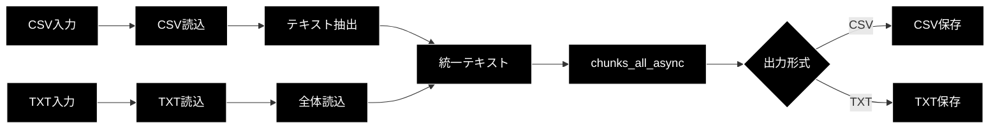

**重要:**
- `chunks_all_async()` 関数は入力形式を意識しない（常にstr型テキストを受け取る）
- 入力形式の違いは、前処理（CSV読み込み or ファイル読み込み）で吸収
- 出力形式は拡張子で自動判定

### 1.6 処理方式（3段階チャンク化戦略）

本システムは、**3つの異なるアプローチを段階的に組み合わせる**ことで、意味的に高品質なチャンクを生成します。

#### 1.6.1 全体戦略


**3段構えの相乗効果:**
1. **階層分割（Step1）**: 文章の「物理的な構造（段落・文）」を壊さない
2. **意味解析（Step2）**: 構造が同じでも「意味」が離れていれば分割
3. **連続性判定（Step3）**: 過剰に分割されたチャンクを「文脈」で再結合

---

#### 1.6.2 Step1: 階層分割（Recursive Character Text Splitter）

**目的:** 文章の論理構造（章・節・段落）を尊重した分割

**手法:** LLMによる階層的分析
- 改行（`\n\n`）で大きなブロックに分割
- 各ブロック内を句点（`。`）で文に分割
- 見出しと本文を分離せず、1つの段落として保持

**具体例:**

```
【入力テキスト】
第1章 導入手順

まずは電源を入れてください。次に設定ボタンを押します。
画面に表示される指示に従って操作してください。

第2章 トラブルシューティング

電源が入らない場合は、コンセントを確認してください。
```

**Step1の処理結果:**
```
段落1: 「第1章 導入手順\n\nまずは電源を入れてください。次に設定ボタンを押します。
       画面に表示される指示に従って操作してください。」

段落2: 「第2章 トラブルシューティング\n\n電源が入らない場合は、
       コンセントを確認してください。」
```

**効果:**
- ❌ 悪い例: 文字数で機械的に切ると → 「第2章：トラ」「ブルシューティング」のように見出しが分断
- ✅ 良い例: 必ず「意味の区切り（改行・句点）」で分割 → AIが内容を正しく理解

**技術的背景:**
- LangChainの「Recursive Character Text Splitter」と同様の設計思想
- 大きな単位（段落）→ 小さな単位（文）→ 最小単位（トークン）の順に分割を試みる

---

#### 1.6.3 Step2: 意味解析（Semantic Chunking）

**目的:** 話題の転換点を意味的に検出し、トピックごとに分割

**手法:** LLMによるセマンティック分析
- 文の「意味的な距離」をLLMが判定
- 類似度が低下する箇所（話題転換）で分割
- 物理的な改行に関係なく、意味の純度を優先

**具体例:**

```
【Step1の出力（1つの段落）】
「最新のGemini 2.0は非常に高速で、特に推論性能が向上しています。
ベンチマークでは従来比で2倍の速度を記録しました。
ところで、昨日のランチで食べたカレーが凄く美味しくて、
スパイスの香りが忘れられません。次回も同じ店に行きたいです。」
```

**Step2の処理結果:**
```
チャンク1: 「最新のGemini 2.0は非常に高速で、特に推論性能が向上しています。
          ベンチマークでは従来比で2倍の速度を記録しました。」

チャンク2: 「ところで、昨日のランチで食べたカレーが凄く美味しくて、
          スパイスの香りが忘れられません。次回も同じ店に行きたいです。」
```

**効果:**
- ❌ 悪い例: 構造的に同じ段落 → 「Geminiの性能は？」と質問すると、カレーの話が混入
- ✅ 良い例: 意味的に分離 → 「Gemini（技術）」と「カレー（食事）」を完全に切り離し

**RAGでの効果:**
- 検索時のノイズを劇的に削減
- トピックの純度が高いチャンク → 高精度な回答生成

**技術的背景:**
- Embeddingによるベクトル類似度計算の代わりに、LLMの意味理解を活用
- プロンプトで「話題の転換点」を明示的に検出させる

---

#### 1.6.4 Step3: 連続性判定（Continuity Check & Merge）

**目的:** 過剰に分割されたチャンクを、文脈の連続性に基づいて再結合

**手法:** LLMによる文脈判定
- 隣接する2つのチャンクが「同じトピック」か判定
- 連続している場合は結合（`\n\n`で接続）
- 連続していない場合は別チャンクとして保持

**具体例:**

```
【Step2の出力】
チャンクA: 「Appleは2024年に新型のiPhoneを発売しました。」
チャンクB: 「同社はさらに、独自のAIチップも発表しています。」
チャンクC: 「GoogleのPixelシリーズも好調な売れ行きです。」
```

**Step3の判定:**
```
A ↔ B: is_connected = True  → 結合
B ↔ C: is_connected = False → 分離
```

**Step3の処理結果:**
```
最終チャンク1: 「Appleは2024年に新型のiPhoneを発売しました。\n\n
              同社はさらに、独自のAIチップも発表しています。」

最終チャンク2: 「GoogleのPixelシリーズも好調な売れ行きです。」
```

**効果:**
- ❌ 悪い例: チャンクBだけがヒット → 「同社ってどこ？」（文脈不足）
- ✅ 良い例: チャンクA+Bが結合 → 「同社＝Apple」という文脈を維持

**RAGでの効果:**
- 代名詞（それ、彼、同社等）の参照先を保持
- 情報の分断を防ぎ、完結した文脈を提供

**技術的背景:**
- 従来の「Chunk Overlap（前後の重複）」とは異なるアプローチ
- 重複させるのではなく、「連続しているものを結合」することで文脈を維持
- より自然で冗長性の少ないチャンクを生成

---

#### 1.6.5 3段階処理の比較表

| 方式 | Step1: 階層分割 | Step2: 意味解析 | Step3: 連続性判定 |
|------|----------------|----------------|------------------|
| **別名** | Recursive Character Splitter | Semantic Chunking | Continuity Check |
| **判断基準** | 物理的構造（改行・句点） | 意味的距離（トピック） | 文脈の連続性 |
| **LLMの役割** | 構造解析 | 意味理解 | 文脈判定 |
| **有効な場面** | 構造化された文書 | トピック混在文書 | 細分化された文書 |
| **防ぐ問題** | 見出しの分断 | 無関係情報の混入 | 文脈の欠落 |

---

#### 1.6.6 なぜ3段階が必要か？

**各ステップの限界と相互補完:**

1. **Step1だけでは不十分:**
   - 同じ段落内でも話題が変わることがある
   - 構造的には1つでも、意味的には複数のトピックが混在

2. **Step2だけでは不十分:**
   - 過剰に細分化されすぎる可能性
   - 文脈が分断され、代名詞の参照先が失われる

3. **Step3で最適化:**
   - Step2で分割されたチャンクを、文脈に基づいて適切に再結合
   - 「意味の純度」と「文脈の完結性」のバランスを取る

**最終的な効果:**
```
入力: 構造が乱れた長文
 ↓ Step1: 構造を整理
 ↓ Step2: 意味で分離
 ↓ Step3: 文脈で最適化
出力: トピックが明確で、文脈が完結した理想的なチャンク
```

この3段階戦略により、RAG（Retrieval-Augmented Generation）で高精度な情報検索と回答生成が可能になります。

---

## 2. ファイル・クラス・関数一覧

### 2.1 ファイル構成

```
chunking/
├── __init__.py                          # パッケージ初期化
├── async_api_client.py                  # 非同期APIクライアント
├── checkpoint_manager.py                # チェックポイント管理
├── models.py                            # Pydanticモデル定義
├── prompts.py                           # プロンプトテンプレート
├── utils.py                             # ユーティリティ関数
└── csv_text_to_chunks_text_csv.py       # メイン処理 ← 本設計書対象
```

### 2.2 関数一覧表

| 関数名 | 種別 | 役割 | 行数 | 非同期 |
|--------|------|------|------|--------|
| `_normalize_whitespace()` | ユーティリティ | テキスト正規化（改行・空白削除） | 59-92 | ❌ |
| `load_text_from_csv()` | 入力処理 | CSVファイルからテキスト読み込み | 99-166 | ❌ |
| `save_chunks_as_csv()` | 出力処理 | チャンクをCSV保存（メタデータ付き） | 173-231 | ❌ |
| `save_chunks_as_text()` | 出力処理 | チャンクをテキスト保存 | 234-241 | ❌ |
| `_split_sentences_simple()` | ユーティリティ | 簡易文分割（日本語対応） | 244-257 | ❌ |
| `chunks_all_async()` | メイン処理 | 3段階チャンク化のオーケストレーター | 263-327 |  |
| `_step1_hierarchical_split()` | Step1 | 階層構造化（テキスト→段落→文） | 330-378 |  |
| `_step2_semantic_chunking()` | Step2 | 意味的分割（段落→セマンティックチャンク） | 381-426 |  |
| `_step3_continuity_check()` | Step3 | 文脈連続性チェック＆マージ | 429-483 |  |
| `main()` | エントリ | コマンドライン処理 | 490-545 |  |

### 2.3 クラス依存関係

本ファイルはクラスを定義せず、**関数ベース** で実装。
外部クラスを利用:

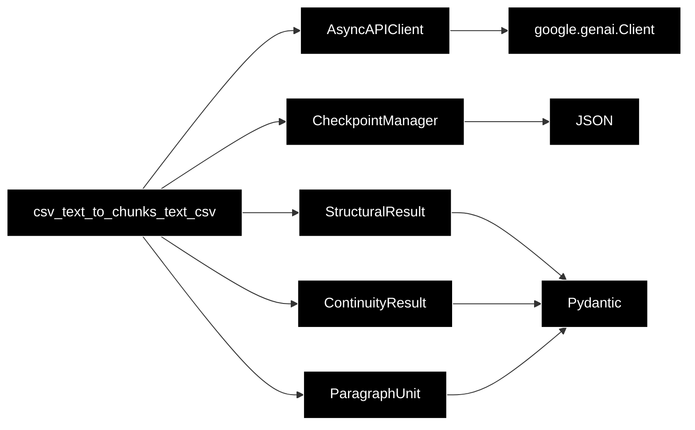

---

## 3. 処理フロー全体図

### 3.1 全体アーキテクチャ

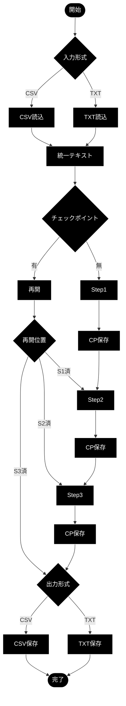

### 3.2 データフロー図

```mermaid
graph LR
    A1[CSV入力] --> B1[CSV読込]
    A2[TXT入力] --> B2[TXT読込]

    B1 --> C[統一テキスト]
    B2 --> C

    C --> D[Step1]
    D --> E[段落50個]
    E --> F[Step2]
    F --> G[チャンク75個]
    G --> H[Step3]
    H --> I[最終60個]

    I --> J{出力形式}
    J -->|CSV| K[CSV出力]
    J -->|TXT| L[TXT出力]

    style A1 fill:#000,stroke:#fff,color:#fff
    style A2 fill:#000,stroke:#fff,color:#fff
    style B1 fill:#000,stroke:#fff,color:#fff
    style B2 fill:#000,stroke:#fff,color:#fff
    style C fill:#000,stroke:#fff,color:#fff
    style D fill:#000,stroke:#fff,color:#fff
    style E fill:#000,stroke:#fff,color:#fff
    style F fill:#000,stroke:#fff,color:#fff
    style G fill:#000,stroke:#fff,color:#fff
    style H fill:#000,stroke:#fff,color:#fff
    style I fill:#000,stroke:#fff,color:#fff
    style J fill:#000,stroke:#fff,color:#fff
    style K fill:#000,stroke:#fff,color:#fff
    style L fill:#000,stroke:#fff,color:#fff
```

---

## 4. Step1/2/3 詳細設計

### 4.1 Step1: 階層構造化

**目的:** テキストを段落と文に構造化（物理的な区切りベース）

#### 処理フロー

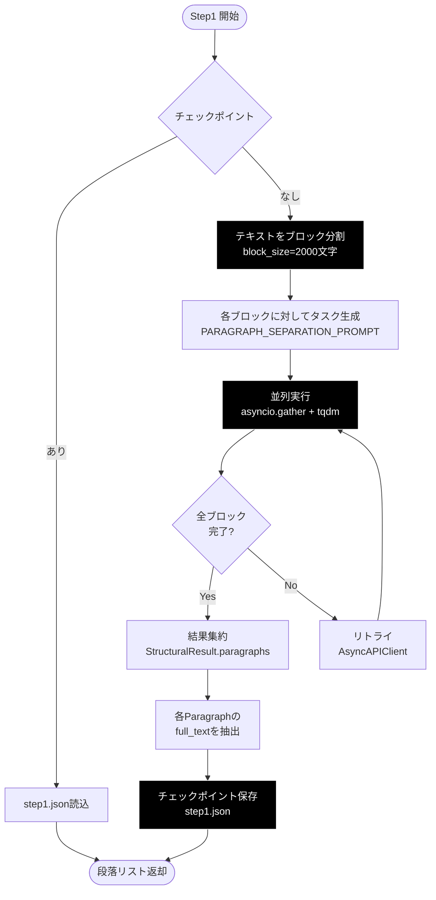

#### 入力例

```
第1章 導入

本章では、基本的な概念を説明します。まず...

第2章 応用

次に、応用例を示します...
```

#### 出力例 (段落リスト)

```python
[
  "第1章 導入\n\n本章では、基本的な概念を説明します。まず...",
  "第2章 応用\n\n次に、応用例を示します..."
]
```

---

### 4.2 Step2: 意味的分割

**目的:** 段落を意味的なまとまり（トピック）で再分割

#### 処理フロー

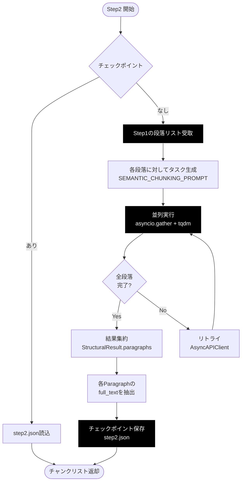

#### 入力例 (1段落)

```
第1章 導入

本章では、基本的な概念を説明します。まず、定義について述べます。次に、歴史的背景を解説します。

さらに、現代における意義を考察します。
```

#### 出力例 (意味的に分割)

```python
[
  "第1章 導入\n\n本章では、基本的な概念を説明します。まず、定義について述べます。次に、歴史的背景を解説します。",
  "さらに、現代における意義を考察します。"
]
```

---

### 4.3 Step3: 文脈連続性チェック

**目的:** 隣接するチャンクが意味的に連続しているか判定し、必要に応じてマージ

#### 処理フロー

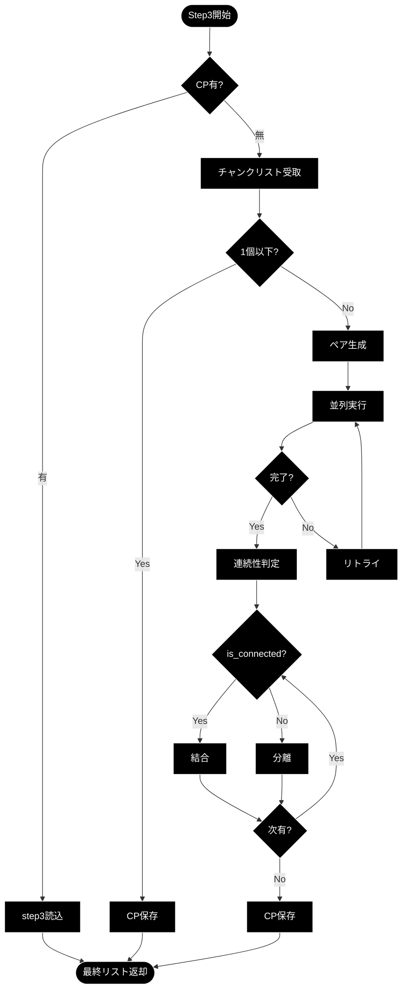

#### 判定ロジック

```python
final_chunks = [chunks[0]]  # 最初のチャンクを初期値

for i, result_json in enumerate(results):
    result = ContinuityResult.model_validate_json(result_json)

    if result.is_connected:
        # 連続している → 前のチャンクにマージ
        final_chunks[-1] += "\n\n" + chunks[i + 1]
    else:
        # 連続していない → 新しいチャンクとして追加
        final_chunks.append(chunks[i + 1])
```

#### 入力例 (2チャンク)

```
Chunk A: "第1章では基本概念を説明しました。"
Chunk B: "第2章では応用例を示します。"
```

#### LLM判定

```json
{
  "is_connected": false  // 章が変わっているため
}
```

#### 出力例

```python
[
  "第1章では基本概念を説明しました。",
  "第2章では応用例を示します。"
]
# → 2つのチャンクを維持
```

---

## 5. 非同期・並列化詳細設計

### 5.1 非同期アーキテクチャ

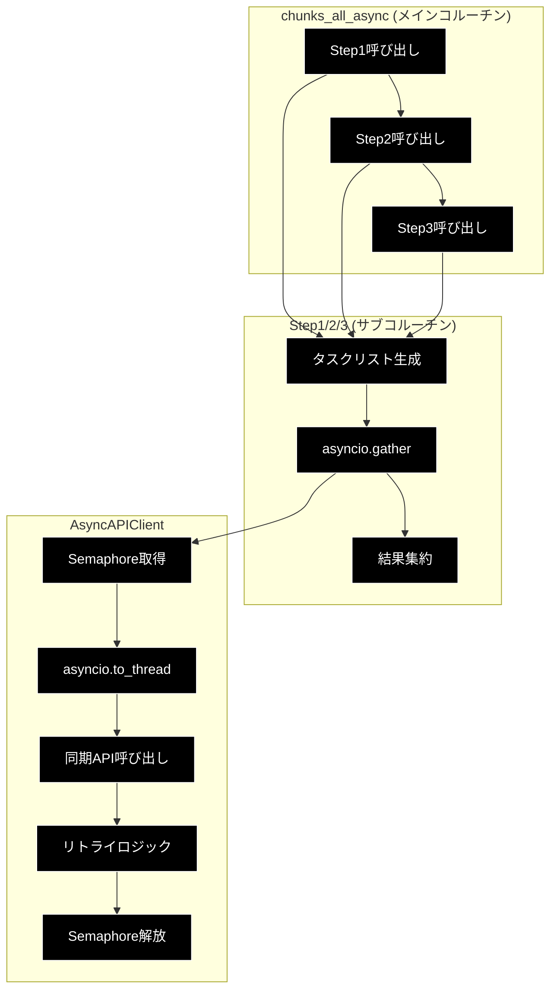

### 5.2 並列制御メカニズム

#### 5.2.1 Semaphoreによる並列数制御

```python
class AsyncAPIClient:
    def __init__(self, max_workers: int = 8):
        self.semaphore = asyncio.Semaphore(max_workers)

    async def generate_content(self, ...):
        async with self.semaphore:  # ← 並列数を max_workers に制限
            return await self._execute_with_retry(...)
```

**制御方式:**
- **固定並列数:** Semaphore(8) → 同時に8リクエストまで
- **待機:** 9個目のリクエストはSemaphore解放まで待機
- **スループット制御:** レート制限回避

#### 5.2.2 並列実行パターン

```python
# Step1の例
tasks = []
for i, block in enumerate(blocks):
    task = client.generate_content(
        model=model,
        contents=prompt,
        response_schema=StructuralResult,
        task_id=f"step1_block_{i}"
    )
    tasks.append(task)

# 全タスクを並列実行（Semaphoreで制御）
results = await asyncio.gather(*tasks)
```

**実行モデル:**
1. **タスク生成:** 全ブロックに対してタスクを作成
2. **並列実行:** `asyncio.gather()` で一括実行
3. **Semaphore制御:** 内部で並列数を8に制限
4. **結果収集:** 全タスク完了後に結果を返却

### 5.3 進捗表示 (tqdm)

```python
from tqdm.asyncio import tqdm as async_tqdm

results = await async_tqdm.gather(
    *tasks,
    desc="Step1: 階層構造化",
    total=len(tasks)
)
```

**表示例:**
```
Step1: 階層構造化: 100%|██████████| 50/50 [00:42<00:00,  1.19it/s]
```

### 5.4 非同期処理のタイムライン

```mermaid
gantt
    title 非同期並列処理タイムライン (max_workers=8)
    dateFormat X
    axisFormat %s

    section API Calls
    Request 1  :0, 2s
    Request 2  :0, 2s
    Request 3  :0, 2s
    Request 4  :0, 2s
    Request 5  :0, 2s
    Request 6  :0, 2s
    Request 7  :0, 2s
    Request 8  :0, 2s
    Request 9  :2, 4s
    Request 10 :2, 4s
    Request 11 :2, 4s
    Request 12 :2, 4s

    section Semaphore
    Slot 1-8   :0, 2s
    Slot 9-12  :2, 4s
```

**説明:**
- 0秒: Request 1-8が同時実行開始（Semaphore空き枠: 8）
- 2秒: Request 1-8完了、Request 9-12が実行開始
- 4秒: 全リクエスト完了

**逐次処理との比較:**
- 逐次: 12リクエスト × 2秒 = **24秒**
- 並列(8): (12 ÷ 8) × 2秒 = **4秒**
- **高速化率: 6倍**

---

## 6. 関数別IPO詳細

### 6.1 `_normalize_whitespace(text: str) -> str`

#### INPUT
| パラメータ | 型 | 説明 | 例 |
|-----------|---|------|-----|
| text | str | 正規化対象テキスト | `"行1\n\n行2  空白"` |

#### PROCESS


**処理ステップ:**
1. `\n`, `\r` → ` ` (半角スペース)
2. `\t` → ` ` (半角スペース)
3. `\s+` → ` ` (連続空白を1つに)
4. `.strip()` (前後の空白削除)

#### OUTPUT
| 型 | 説明 | 例 |
|----|------|-----|
| str | 正規化されたテキスト | `"行1 行2 空白"` |

#### エラーハンドリング
- **なし** (純粋関数、例外発生なし)

---

### 6.2 `load_text_from_csv() -> str`

#### INPUT
| パラメータ | 型 | デフォルト | 説明 |
|-----------|---|-----------|------|
| csv_path | str | (必須) | CSVファイルパス |
| text_column | Optional[str] | None | テキストカラム名 |
| max_rows | Optional[int] | None | 最大処理行数 |
| combine_rows | bool | False | 全行結合モード |

#### PROCESS

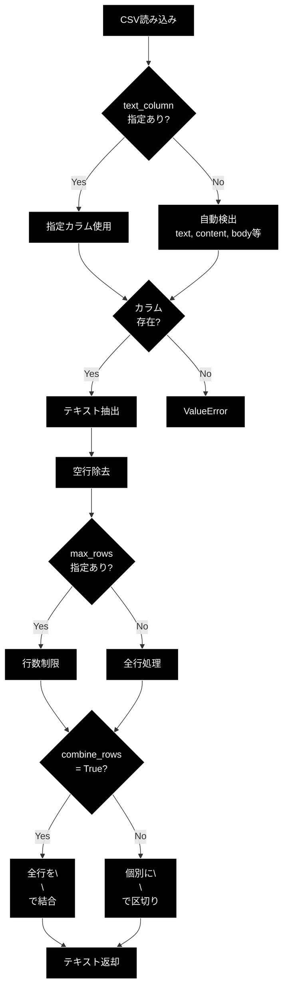

#### OUTPUT
| 型 | 説明 | 形式 |
|----|------|------|
| str | 結合されたテキスト | `"行1\n\n行2\n\n行3"` |

#### エラーハンドリング
```python
try:
    df = pd.read_csv(csv_path)
except Exception as e:
    logger.error(f"CSV読み込みエラー: {e}")
    raise

if text_column and text_column not in df.columns:
    raise ValueError(
        f"指定されたカラム '{text_column}' が見つかりません。\n"
        f"利用可能なカラム: {list(df.columns)}"
    )
```

---

### 6.3 `save_chunks_as_csv() -> str`

#### INPUT
| パラメータ | 型 | デフォルト | 説明 |
|-----------|---|-----------|------|
| chunks | List[str] | (必須) | チャンクリスト |
| output_file | str | (必須) | 出力ファイルパス |
| dataset_type | str | "custom" | データセット種別 |
| source_file | Optional[str] | None | 元ファイル名 |
| normalize_whitespace | bool | True | 改行正規化の有効化 |

#### PROCESS

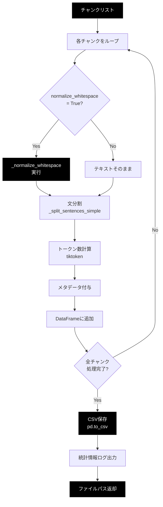

#### CSV出力フォーマット

| カラム | 型 | 説明 | 例 |
|--------|---|------|-----|
| chunk_id | str | チャンクID | `"custom_chunk_0"` |
| text | str | 正規化されたテキスト | `"第1章 導入 本章では..."` |
| tokens | int | トークン数 | `512` |
| chunk_idx | int | チャンクインデックス | `0` |
| dataset_type | str | データセット種別 | `"custom"` |
| type | str | チャンク種別 | `"llm_chunk"` |
| sentence_count | int | 文数 | `5` |
| source_file | str | 元ファイル名 | `"data.csv"` |

#### OUTPUT
| 型 | 説明 |
|----|------|
| str | 保存したCSVファイルパス |

#### エラーハンドリング
```python
try:
    df.to_csv(output_file, index=False, encoding='utf-8')
except Exception as e:
    logger.error(f"CSV保存エラー: {e}")
    raise
```

---

### 6.4 `chunks_all_async() -> List[str]`

#### INPUT
| パラメータ | 型 | デフォルト | 説明 |
|-----------|---|-----------|------|
| text | str | (必須) | **入力テキスト** (CSV/テキストファイルから読み込まれた統一テキストデータ) |
| api_key | str | (環境変数) | Google API Key |
| model | str | "gemini-2.0-flash-exp" | モデル名 |
| max_workers | int | 8 | 並列ワーカー数 |
| block_size | int | 2000 | バッチサイズ |
| checkpoint_manager | Optional[CheckpointManager] | None | チェックポイント管理 |
| output_file | Optional[str] | None | 出力ファイルパス (.csv または .txt) |
| dataset_type | str | "custom" | データセット種別 |
| source_file | Optional[str] | None | 元ファイル名 (CSV/テキスト) |

**textパラメータについて:**
- CSV入力の場合: `load_text_from_csv()` でテキスト抽出済み
- テキスト入力の場合: ファイルから直接読み込み済み
- いずれの場合も、この関数には **統一されたstr型テキスト** として渡される

#### PROCESS (Mermaid シーケンス図)

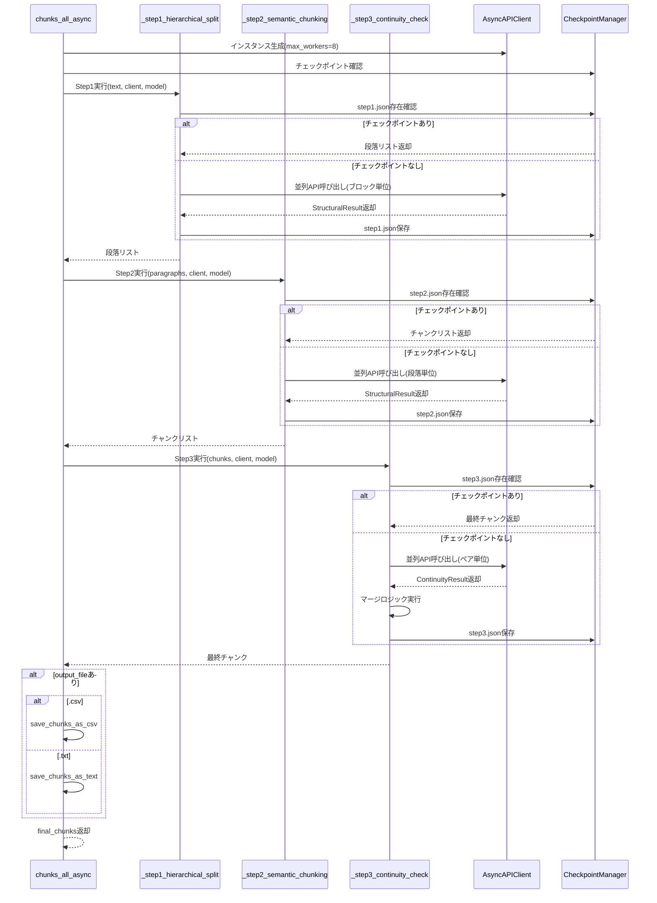

#### OUTPUT
| 型 | 説明 |
|----|------|
| List[str] | 最終的なチャンクリスト |

---

### 6.5 `_step1_hierarchical_split() -> List[str]`

#### INPUT
| パラメータ | 型 | 説明 |
|-----------|---|------|
| text | str | 入力テキスト |
| client | AsyncAPIClient | APIクライアント |
| model | str | モデル名 |
| block_size | int | ブロックサイズ |
| checkpoint_manager | CheckpointManager | チェックポイント管理 |

#### PROCESS (詳細フロー)

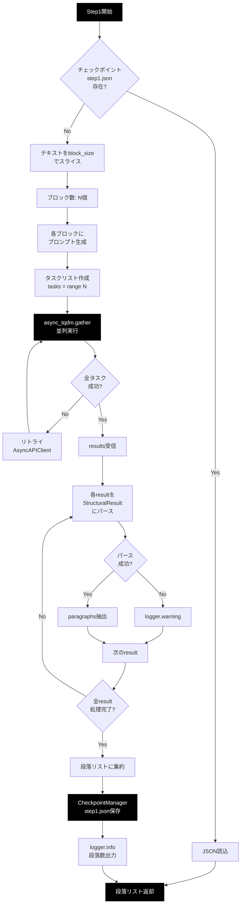

#### API呼び出し詳細

```python
for i, block in enumerate(blocks):
    prompt = f"{PARAGRAPH_SEPARATION_PROMPT}\n\n【入力テキスト】\n{block}"
    task = client.generate_content(
        model=model,
        contents=prompt,
        response_schema=StructuralResult,  # Pydanticスキーマ
        task_id=f"step1_block_{i}"        # ログ用ID
    )
    tasks.append(task)

results = await async_tqdm.gather(*tasks, desc="Step1: 階層構造化")
```

#### OUTPUT
| 型 | 説明 | 例 |
|----|------|-----|
| List[str] | 段落リスト | `["段落1", "段落2", ...]` |

---

### 6.6 `_step2_semantic_chunking() -> List[str]`

#### INPUT
| パラメータ | 型 | 説明 |
|-----------|---|------|
| paragraphs | List[str] | Step1の段落リスト |
| client | AsyncAPIClient | APIクライアント |
| model | str | モデル名 |
| checkpoint_manager | CheckpointManager | チェックポイント管理 |

#### PROCESS (詳細フロー)

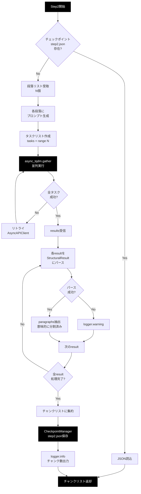

#### 意味的分割の例

**入力段落:**
```
第1章 導入

本章では、基本概念を説明します。定義と歴史を述べます。

次に現代における意義を考察します。これは重要なトピックです。
```

**LLMによる分割:**
```python
[
  "第1章 導入\n\n本章では、基本概念を説明します。定義と歴史を述べます。",
  "次に現代における意義を考察します。これは重要なトピックです。"
]
```

#### OUTPUT
| 型 | 説明 |
|----|------|
| List[str] | 意味的に分割されたチャンクリスト |

---

### 6.7 `_step3_continuity_check() -> List[str]`

#### INPUT
| パラメータ | 型 | 説明 |
|-----------|---|------|
| chunks | List[str] | Step2のチャンクリスト |
| client | AsyncAPIClient | APIクライアント |
| model | str | モデル名 |
| checkpoint_manager | CheckpointManager | チェックポイント管理 |

#### PROCESS (詳細フロー)

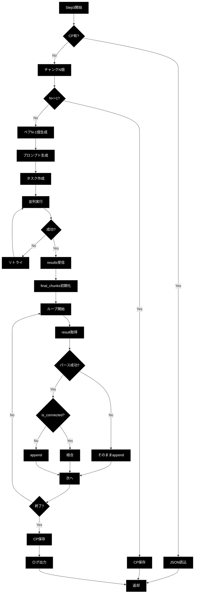

#### マージロジック (擬似コード)

```python
final_chunks = [chunks[0]]  # 最初のチャンクを初期値

for i, result_json in enumerate(results):
    if result_json is None:
        # API失敗 → 別チャンクとして保持
        final_chunks.append(chunks[i + 1])
        continue

    try:
        result = ContinuityResult.model_validate_json(result_json)
    except Exception as e:
        # パース失敗 → 別チャンクとして保持
        logger.warning(f"パース失敗: {e}")
        final_chunks.append(chunks[i + 1])
        continue

    if result.is_connected:
        # 連続している → マージ
        final_chunks[-1] += "\n\n" + chunks[i + 1]
    else:
        # 連続していない → 別チャンク
        final_chunks.append(chunks[i + 1])

return final_chunks
```

#### OUTPUT
| 型 | 説明 |
|----|------|
| List[str] | マージ後の最終チャンクリスト |

---

## 7. エラーハンドリング詳細

### 7.1 エラー分類

| レベル | 種別 | ハンドリング方法 | 影響範囲 |
|--------|------|-----------------|---------|
| **Critical** | CSV読み込み失敗 | 例外発生 → 処理中断 | プログラム全体 |
| **Error** | API全リトライ失敗 | None返却 → フォールバック | 該当チャンク |
| **Warning** | JSONパース失敗 | ログ出力 → スキップ | 該当レスポンス |
| **Info** | チェックポイント読込 | ログ出力 → 処理続行 | なし |

### 7.2 各関数のエラーハンドリング

#### 7.2.1 `load_text_from_csv()`

```python
def load_text_from_csv(csv_path, text_column, max_rows, combine_rows):
    try:
        df = pd.read_csv(csv_path)
    except FileNotFoundError:
        logger.error(f"ファイルが見つかりません: {csv_path}")
        raise
    except pd.errors.ParserError as e:
        logger.error(f"CSVパースエラー: {e}")
        raise
    except Exception as e:
        logger.error(f"CSV読み込みエラー: {e}")
        raise

    # カラム存在確認
    if text_column and text_column not in df.columns:
        raise ValueError(
            f"指定されたカラム '{text_column}' が見つかりません。\n"
            f"利用可能なカラム: {list(df.columns)}"
        )

    # 自動検出失敗
    if col is None:
        logger.warning("テキストカラムを自動検出できませんでした")
        col = df.columns[0]  # フォールバック
```

**エラーフロー:**
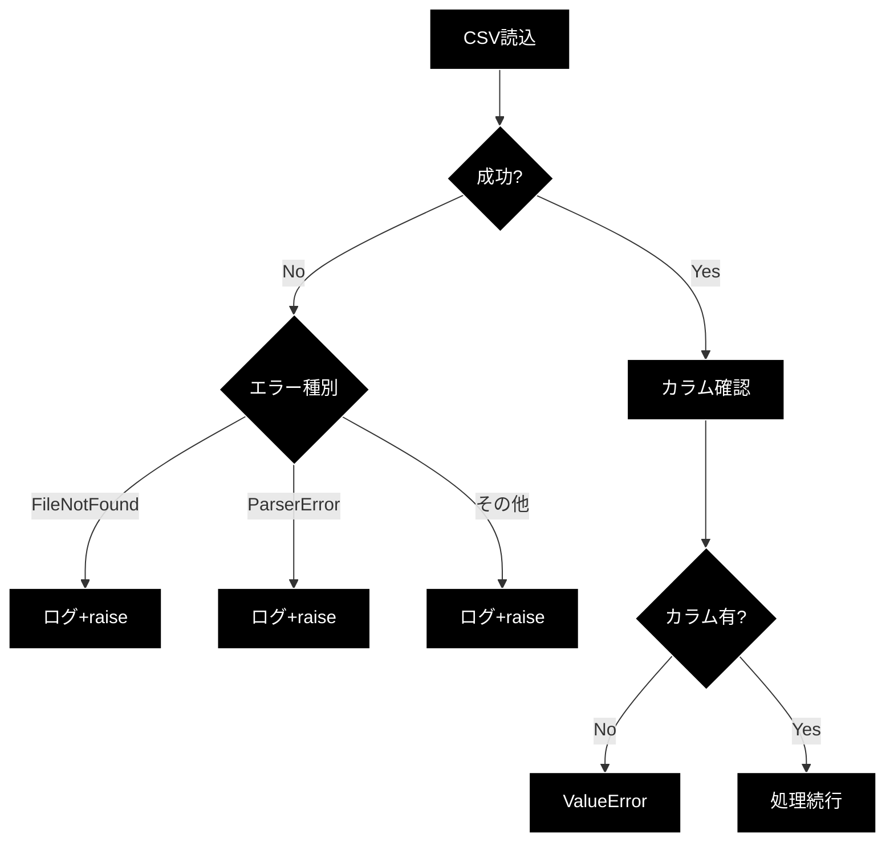

#### 7.2.2 `AsyncAPIClient.generate_content()`

```python
async def _execute_with_retry(self, model, contents, response_schema, task_id):
    for attempt in range(self.max_retries):  # デフォルト3回
        try:
            response = await asyncio.to_thread(
                self.client.models.generate_content, ...
            )

            # レスポンス切断チェック
            if self._is_truncated_response(response):
                raise ValueError("Response truncated")

            # JSON完全性チェック
            if not self._is_valid_json(response.text):
                raise ValueError("Incomplete JSON")

            return response.text

        except ValueError as e:
            # 不完全レスポンス → リトライ
            wait_time = 2 ** attempt  # 指数バックオフ
            logger.warning(f"[{task_id}] {e}. Retrying in {wait_time}s")
            await asyncio.sleep(wait_time)

        except Exception as e:
            # レート制限チェック
            if "429" in str(e).lower():
                wait_time = 30 * (attempt + 1)  # 長時間待機
            else:
                wait_time = 2 ** attempt

            logger.warning(f"[{task_id}] Error: {e}. Retrying in {wait_time}s")
            await asyncio.sleep(wait_time)

    # 全リトライ失敗
    self._failed_requests += 1
    logger.error(f"[{task_id}] Failed after {self.max_retries} retries")
    return None  # フォールバック
```

**リトライフロー:**
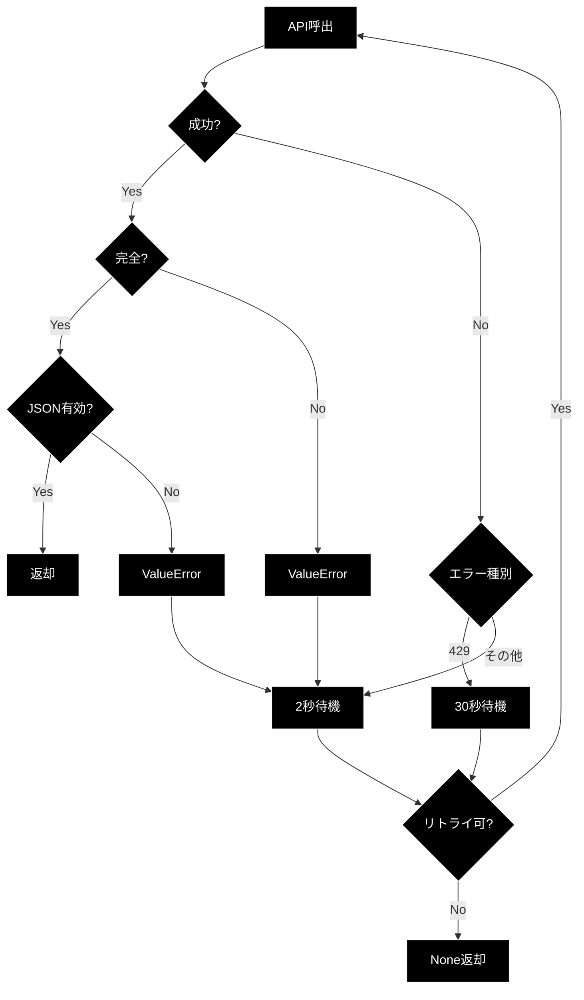

#### 7.2.3 `_step1/2/3_*()` のパース処理

```python
for result_json in results:
    if result_json:  # API成功
        try:
            result = StructuralResult.model_validate_json(result_json)
            for para in result.paragraphs:
                paragraphs.append(para.full_text)
        except Exception as e:
            logger.warning(f"パース失敗: {e}")
            # → そのブロックはスキップ (データ欠損)
    else:  # API失敗 (None)
        logger.warning("API呼び出し失敗 (None返却)")
        # → そのブロックはスキップ
```

**パースフロー:**
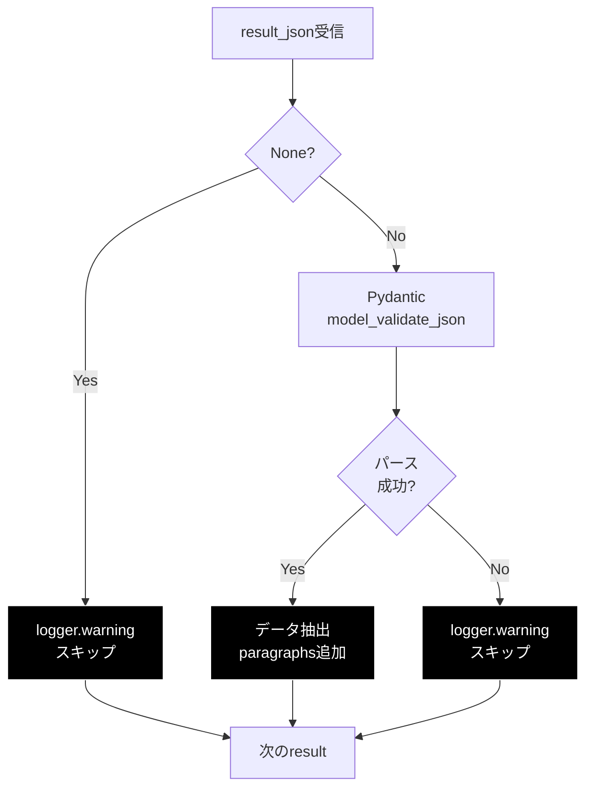

### 7.3 チェックポイント失敗時の処理

```python
def load(self, step_name: str) -> Optional[List[str]]:
    filepath = os.path.join(self.job_dir, f"{step_name}.json")
    if not os.path.exists(filepath):
        return None  # チェックポイントなし → 通常処理

    try:
        with open(filepath, "r", encoding="utf-8") as f:
            checkpoint_data = json.load(f)

        logger.info(f"Checkpoint loaded: {filepath}")
        return checkpoint_data["data"]

    except Exception as e:
        logger.error(f"Failed to load checkpoint: {e}")
        return None  # 読込失敗 → 通常処理にフォールバック
```

**フォールバック戦略:**
- チェックポイント読込失敗 → **最初から処理実行**
- チェックポイント破損 → **警告ログ + 再計算**

### 7.4 エラー統計情報

```python
# AsyncAPIClient.get_stats()
stats = {
    "total_requests": 100,
    "failed_requests": 2,
    "truncated_responses": 1,
    "success_rate": 98.0,  # (100 - 2) / 100 * 100
    "concurrency": 8
}
```

**ログ出力例:**
```
2026-01-15 10:30:45 [INFO] Total API Requests: 100
2026-01-15 10:30:45 [INFO] Failed Requests: 2 (2.0%)
2026-01-15 10:30:45 [INFO] Truncated Responses: 1 (1.0%)
2026-01-15 10:30:45 [INFO] Success Rate: 98.0%
```

---

## 8. 制約条件

### 8.1 API制約

| 項目 | 制約 | 対策 |
|------|------|------|
| **レート制限** | 60 RPM (Requests Per Minute) | Semaphore(8) + リトライ |
| **同時接続数** | 最大10接続 | max_workers=8に固定 |
| **出力トークン制限** | 4096トークン/リクエスト | max_output_tokens=4096 |
| **入力テキスト制限** | ~1M tokens | block_size=2000文字で分割 |

### 8.2 システム制約

| 項目 | 制約 | 理由 |
|------|------|------|
| **Python バージョン** | ≥ 3.10 | asyncio.to_thread()使用 |
| **メモリ使用量** | テキストサイズ × 3倍 | 中間データ保持のため |
| **並列数** | 8固定 | レート制限回避 + 安定性 |
| **チェックポイントサイズ** | 制限なし | ディスク容量に依存 |

### 8.3 パフォーマンス制約

| 項目 | 想定値 | 実測例 |
|------|--------|--------|
| **処理速度** | ~500文字/秒 | 10K文字→20秒 |
| **API呼び出し時間** | 2秒/リクエスト | Gemini-2.0-flash平均 |
| **高速化率** | 6-8倍 | 並列数8の場合 |

### 8.4 データ制約

| 項目 | 制約 | 対策 |
|------|------|------|
| **CSV最大行数** | 制限なし | max_rows引数で制限可 |
| **テキスト最大長** | 制限なし | block_sizeで分割 |
| **チャンク最大数** | 制限なし | メモリ使用量に注意 |
| **文字エンコーディング** | UTF-8のみ | 日本語対応 |

### 8.5 品質制約

| 項目 | 目標 | 測定方法 |
|------|------|---------|
| **API成功率** | ≥ 95% | success_rate |
| **JSON完全性** | ≥ 98% | truncated_responses |
| **チャンク品質** | 主観評価 | 人手レビュー |

### 8.6 セキュリティ制約

| 項目 | 制約 | 実装 |
|------|------|------|
| **API Key管理** | 環境変数のみ | `os.environ["GOOGLE_API_KEY"]` |
| **ログ出力** | 個人情報除外 | テキスト内容をログに出さない |
| **チェックポイント** | ローカルのみ | `./checkpoints` ディレクトリ |

### 8.7 拡張性制約

| 項目 | 現状 | 拡張可能性 |
|------|------|-----------|
| **LLMモデル** | Gemini固定 | OpenAI対応可 |
| **並列戦略** | Semaphore固定 | Rate Limiter実装可 |
| **出力形式** | CSV/TXT | JSON/Parquet追加可 |
| **チャンク戦略** | 3段階固定 | カスタマイズ可 |

---

## 付録A: 使用例

### A.1 入力形式別の使用例

#### A.1.1 テキスト入力 → CSV出力（推奨）

メタデータ付きでデータセット化する場合に最適。

```bash
python -m chunking.csv_text_to_chunks_text_csv \
    -i input.txt \
    -o output.csv \
    -w 8 \
    -b 2000 \
    -m gemini-2.0-flash-exp
```

**出力例 (output.csv):**
```csv
chunk_id,text,tokens,chunk_idx,dataset_type,type,sentence_count,source_file
input_chunk_0,"第1章 導入...",512,0,input,llm_chunk,5,input.txt
input_chunk_1,"第2章 応用...",487,1,input,llm_chunk,4,input.txt
```

---

#### A.1.2 CSV入力 → CSV出力（データセット処理）

大量のテキストデータをバッチ処理する場合に最適。

```bash
python -m chunking.csv_text_to_chunks_text_csv \
    -i dataset.csv \
    -o chunked_dataset.csv \
    --text-column "content" \
    --max-rows 1000 \
    -w 8 \
    -b 1500 \
    -m gemini-2.0-flash-exp
```

**入力例 (dataset.csv):**
```csv
id,content,category
1,"第1章の内容...",tech
2,"第2章の内容...",science
```

**出力例 (chunked_dataset.csv):**
```csv
chunk_id,text,tokens,chunk_idx,dataset_type,type,sentence_count,source_file
dataset_chunk_0,"第1章の内容の前半...",350,0,dataset,llm_chunk,3,dataset.csv
dataset_chunk_1,"第1章の内容の後半...",280,1,dataset,llm_chunk,2,dataset.csv
```

---

#### A.1.3 テキスト入力 → テキスト出力（シンプル）

人間が読みやすい形式で確認する場合。

```bash
python -m chunking.csv_text_to_chunks_text_csv \
    -i document.txt \
    -o chunks.txt \
    -w 8
```

**出力例 (chunks.txt):**
```
第1章 導入

本章では、基本的な概念を説明します...
---
第2章 応用

次に、応用例を示します...
---
```

---

#### A.1.4 CSV入力 → テキスト出力（確認用）

データセットの内容を人間が確認する場合。

```bash
python -m chunking.csv_text_to_chunks_text_csv \
    -i data.csv \
    -o preview.txt \
    --text-column "text" \
    --max-rows 100
```

---

### A.2 CSV入力の詳細オプション

#### A.2.1 テキストカラムの自動検出

カラム名を指定しない場合、以下の順で自動検出:
```python
['text', 'Text', 'TEXT', 'content', 'Content', 'CONTENT',
 'Combined_Text', 'body', 'Body', 'document', 'answer']
```

```bash
# カラム名を自動検出
python -m chunking.csv_text_to_chunks_text_csv \
    -i data.csv \
    -o chunks.csv
```

---

#### A.2.2 特定カラムの指定

```bash
# "article_body"カラムを使用
python -m chunking.csv_text_to_chunks_text_csv \
    -i news.csv \
    -o news_chunks.csv \
    --text-column "article_body"
```

---

#### A.2.3 行数制限

大きなCSVファイルの一部だけを処理する場合。

```bash
# 最初の500行のみ処理
python -m chunking.csv_text_to_chunks_text_csv \
    -i large_dataset.csv \
    -o sample_chunks.csv \
    --max-rows 500
```

---

#### A.2.4 全行結合モード

CSV全体を1つの連続したテキストとして処理する場合。

```bash
python -m chunking.csv_text_to_chunks_text_csv \
    -i articles.csv \
    -o combined_chunks.csv \
    --combine-rows
```

**違い:**
- 通常モード: 各行を `\n\n` で区切る → 行ごとの区切りを維持
- 結合モード: 全行を完全に結合 → 1つの連続テキストとして処理

---

### A.3 チェックポイントからの再開

```bash
# ジョブID確認
ls ./checkpoints/

# 再開
python -m chunking.csv_text_to_chunks_text_csv \
    -i input.txt \
    -o output.csv \
    --resume 20260115_103045
```

### A.4 Pythonスクリプトからの使用

#### A.4.1 テキスト入力の場合

```python
import asyncio
from chunking import chunks_all_async, CheckpointManager

async def main():
    # テキストファイルから読み込み
    with open("document.txt", "r", encoding="utf-8") as f:
        text = f.read()

    checkpoint_manager = CheckpointManager()

    chunks = await chunks_all_async(
        text=text,
        model="gemini-2.0-flash-exp",
        max_workers=8,
        block_size=2000,
        checkpoint_manager=checkpoint_manager,
        output_file="output.csv",
        dataset_type="document",
        source_file="document.txt"
    )

    print(f"チャンク数: {len(chunks)}")
    print(f"平均チャンク長: {sum(len(c) for c in chunks) / len(chunks):.1f}文字")

asyncio.run(main())
```

---

#### A.4.2 CSV入力の場合

```python
import asyncio
from chunking import (
    chunks_all_async,
    load_text_from_csv,  # CSV読み込み関数
    CheckpointManager
)

async def main():
    # CSVファイルからテキスト読み込み
    text = load_text_from_csv(
        csv_path="dataset.csv",
        text_column="content",  # カラム指定
        max_rows=1000,         # 行数制限
        combine_rows=False     # 個別モード
    )

    checkpoint_manager = CheckpointManager()

    chunks = await chunks_all_async(
        text=text,
        model="gemini-2.0-flash-exp",
        max_workers=8,
        block_size=1500,
        checkpoint_manager=checkpoint_manager,
        output_file="chunks.csv",
        dataset_type="dataset",
        source_file="dataset.csv"
    )

    print(f"入力: {len(text)}文字")
    print(f"チャンク数: {len(chunks)}")

asyncio.run(main())
```

---

#### A.4.3 入力形式の自動判定

```python
import asyncio
from pathlib import Path
from chunking import (
    chunks_all_async,
    load_text_from_csv,
    CheckpointManager
)

async def process_file(input_file: str, output_file: str):
    """入力形式を自動判定してチャンク化"""
    input_path = Path(input_file)

    # 入力形式判定
    if input_path.suffix.lower() == '.csv':
        print("CSV入力モード")
        text = load_text_from_csv(input_file)
    else:
        print("テキスト入力モード")
        with open(input_file, 'r', encoding='utf-8') as f:
            text = f.read()

    # チャンク化
    checkpoint_manager = CheckpointManager()
    chunks = await chunks_all_async(
        text=text,
        checkpoint_manager=checkpoint_manager,
        output_file=output_file,
        dataset_type=input_path.stem,
        source_file=input_path.name
    )

    return chunks

# 使用例
asyncio.run(process_file("data.csv", "output.csv"))
asyncio.run(process_file("doc.txt", "output.txt"))
```

---

## 付録B: トラブルシューティング

### B.1 よくある問題

| 問題 | 原因 | 解決策 |
|------|------|--------|
| `Rate limit hit` | API呼び出し過多 | max_workersを減らす |
| `Incomplete JSON` | レスポンス切断 | max_output_tokensを増やす |
| `CSV読み込みエラー` | カラム名不一致 | --text-column指定 |
| `指定されたカラムが見つかりません` | CSV入力時のカラム名誤り | --text-columnを確認、または自動検出に任せる |
| `メモリ不足` | 大量データ処理 | --max-rows で制限 |
| `テキストが空` | CSVに空行が多い | CSV内容を確認 |
| `入力ファイルが見つかりません` | ファイルパス誤り | 入力パスを確認（相対パス/絶対パス）|

### B.2 入力形式別のデバッグ

#### CSV入力のデバッグ

```bash
# CSVのカラム名を確認
python -c "import pandas as pd; print(pd.read_csv('data.csv').columns.tolist())"

# CSVの最初の5行を確認
python -c "import pandas as pd; print(pd.read_csv('data.csv').head())"

# 特定カラムのデータサンプル
python -c "import pandas as pd; df = pd.read_csv('data.csv'); print(df['text'].head())"
```

#### テキスト入力のデバッグ

```bash
# ファイルの文字数確認
wc -c input.txt

# ファイルの行数確認
wc -l input.txt

# ファイルの先頭100文字を確認
head -c 100 input.txt
```

### B.3 一般的なデバッグ方法

```bash
# 詳細ログ有効化
python -m chunking.csv_text_to_chunks_text_csv \
    -i input.txt \
    -o output.csv \
    -v

# ログファイル確認
tail -f ./logs/chunking_*.log
```

---

## 付録C: 設計上の決定事項

### C.1 なぜ非同期・並列化?

- **理由:** API呼び出しは I/O バウンド → 並列化で高速化
- **効果:** 逐次処理の6-8倍の速度

### C.2 なぜSemaphore固定?

- **理由:** レート制限回避 + 安定性重視
- **代替案:** Rate Limiterの実装（将来的に検討）

### C.3 なぜチェックポイント?

- **理由:** 長時間処理のクラッシュ対策
- **効果:** 途中から再開可能 → 時間とコスト削減

### C.4 なぜ3段階処理?

- **理由:** 段階的な意味的分析で高品質なチャンク化
- **効果:** 単純分割より文脈を保持

### C.5 なぜCSV/テキスト両方の入力対応?

- **理由:** データセット処理とドキュメント処理の両方に対応
- **設計:** 入力形式の違いを前処理で吸収 → コア処理は統一インターフェース
- **効果:**
  - CSV: 大規模データセットのバッチ処理に最適
  - テキスト: 個別ドキュメントのシンプルな処理
  - 同じチャンク化ロジックで両方に対応

### C.6 なぜ出力形式も2種類?

- **CSV出力:** メタデータ（トークン数、文数等）が必要な機械学習用途
- **テキスト出力:** 人間が読みやすい形式での確認用
- **自動判定:** 拡張子で出力形式を判定 → ユーザーの意図を尊重

---

**END OF DOCUMENT**
