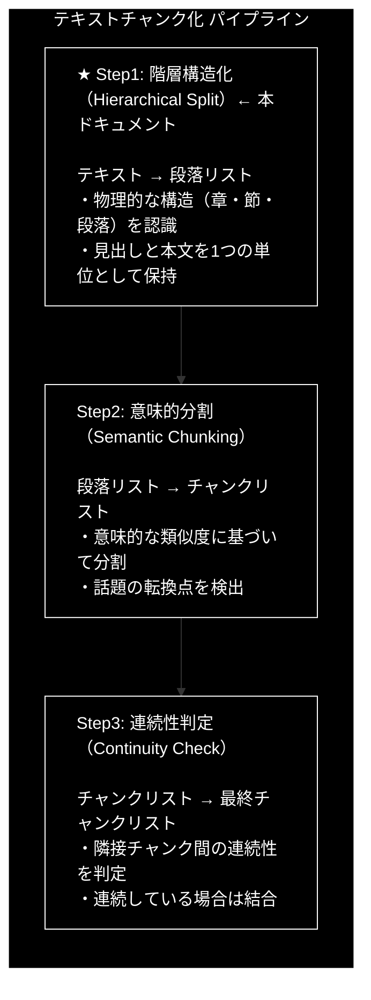
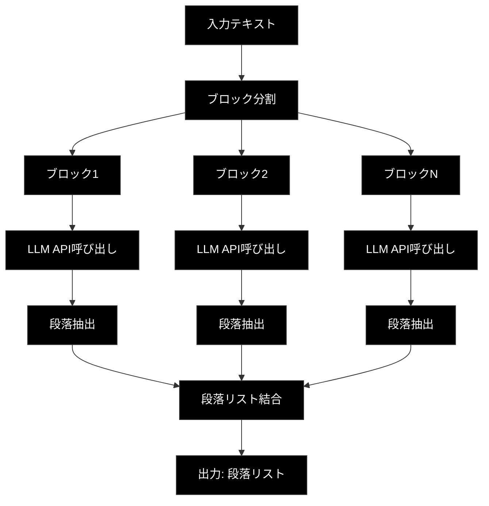

# Step1: 階層構造化（Hierarchical Split）

**バージョン:** v2.0.0
**対象ファイル:** `chunking/csv_text_to_chunks_text_csv.py`
**確認用プログラム:** `chunking/check_function/check_step1.py`

---

## 📋 目次

1. [全体像](#1-全体像)
2. [Step1の方式説明](#2-step1の方式説明)
3. [check_step1.pyの説明](#3-check_step1pyの説明)
4. [具体例](#4-具体例)
5. [csv_text_to_chunks_text_csv.pyでの実装](#5-csv_text_to_chunks_text_csvpyでの実装)

---

## 1. 全体像

### 1.1 3段階処理における Step1 の位置づけ




### 1.2 データフロー

```
【入力】
"第1章 人工知能の基礎\n\n人工知能（AI）は...\n\n第2章 機械学習..."
        │
        ▼
┌───────────────────────────────────────┐
│          Step1: 階層構造化             │
│                                       │
│  1. テキストをブロックに分割              │
│  2. 各ブロックをLLMに送信                │
│  3. 段落構造を抽出                      │
│  4. 結果を結合                          │
└───────────────────────────────────────┘
        │
        ▼
【出力】
[
  "第1章 人工知能の基礎\n\n人工知能（AI）は...",
  "第2章 機械学習の手法\n\n教師あり学習では..."
]
```

### 1.3 処理の流れ図



---

## 2. Step1の方式説明

### 2.1 目的

**文章の論理構造（章・節・段落）を尊重した分割**を行います。

単純な文字数分割では、以下の問題が発生します：
- 見出しと本文が別々のチャンクに分断される
- 文の途中で切れてしまう
- 意味のまとまりが壊れる

Step1では、LLM（Gemini API）を活用して、これらの問題を解決します。

### 2.2 アルゴリズム

```
1. 入力テキストを block_size（デフォルト2000文字）ごとに分割
   - 大きなテキストを処理可能なサイズに分割

2. 各ブロックをLLM（Gemini API）に送信
   - JSON形式で構造化されたレスポンスを取得

3. LLMが以下のルールで構造化:
   ┌────────────────────────────────────────────────┐
   │ 【分割ルール】                                   │
   │ - 空行（\n\n）で段落を分割                        │
   │ - 句点（。）で文を分割                            │
   │ - 見出しと本文は分離せず、1つの段落として保持         │
   └────────────────────────────────────────────────┘

4. 全ブロックの結果を結合して段落リストを生成
```

### 2.3 LLMへのプロンプト

`chunking/prompts.py` で定義されている `PARAGRAPH_SEPARATION_PROMPT`:

```python
PARAGRAPH_SEPARATION_PROMPT = """
あなたはテキスト構造化エンジンです。入力されたテキストを以下の【分割ルール】に従って解析し、階層構造（段落 > 文）に変換してください。

【分割ルール】
入力されたテキストを、以下のルールに従って構造化してください。
目的は、テキストを「大きな意味のブロック（Paragraph）」に分け、その中を「文（Sentence）」に分解することです。

【Rule 1: Paragraphの分割（最優先）】
- **見出しと本文を分離しないこと**。
- 「第〇章」や「見出し」がある場合、それ単体でParagraphを作らず、**直後の本文も含めて1つのParagraph**としてまとめてください。
- Paragraphを分ける基準は、原則として「空行（\\n\\n）」や「章の変わり目」のみです。

【Rule 2: Sentenceの分割】
- Paragraphの中身を、句点「。」や改行ごとに区切って sentences リストに格納してください。
- 見出し部分も1つの sentence として扱ってください。

【出力要件】
- JSONスキーマに従い、paragraphs リストの中に sentences リストを持つ構造で出力すること。
- 元のテキストの内容を省略したり要約したりせず、**そのままの文字列**を保持すること。
"""
```

### 2.4 レスポンススキーマ（Pydanticモデル）

`chunking/models.py` で定義:

```python
class SentenceUnit(BaseModel):
    """1つの文、または意味の最小単位"""
    text: str = Field(description="1つの文、または意味の最小単位")


class ParagraphUnit(BaseModel):
    """段落単位"""
    id: int = Field(description="Paragraph ID")
    sentences: List[SentenceUnit] = Field(description="この段落に含まれる文のリスト")

    @property
    def full_text(self) -> str:
        """段落内の全文を結合して返す"""
        return "".join([s.text for s in self.sentences])


class StructuralResult(BaseModel):
    """テキスト構造化の結果"""
    paragraphs: List[ParagraphUnit]
```

### 2.5 なぜ Step1 が必要なのか？

| 問題 | Step1 の解決策 |
|------|---------------|
| 見出しの分断 | 見出しと本文を1つの段落として保持 |
| 文字数での切断 | LLMが意味を理解して分割 |
| 構造の欠落 | 章・節の構造を維持 |

---

## 3. check_step1.pyの説明

### 3.1 ファイルの目的

`check_step1.py` は、Step1（階層構造化）の動作を単体で確認するためのテストプログラムです。

### 3.2 プログラム構成

```python
# check_step1.py の構成

# 1. インポート
import os
from google import genai
from google.genai import types
from chunking.models import StructuralResult
from chunking.prompts import PARAGRAPH_SEPARATION_PROMPT

# 2. コア関数
def step1_hierarchical_split(text: str, api_key: str, block_size: int = 2000) -> list[str]:
    """Step1のコア機能を実装"""
    ...

# 3. メイン処理
def main():
    """テスト実行"""
    ...
```

### 3.3 プログラムの流れ

```
┌──────────────────────────────────────────────────────────────┐
│                    check_step1.py の処理フロー                 │
└──────────────────────────────────────────────────────────────┘
                              │
                              ▼
┌──────────────────────────────────────────────────────────────┐
│ 1. APIキー取得                                                │
│    api_key = os.getenv("GOOGLE_API_KEY")                     │
└──────────────────────────────────────────────────────────────┘
                              │
                              ▼
┌──────────────────────────────────────────────────────────────┐
│ 2. テスト用テキスト準備                                         │
│    test_text = """第1章 人工知能の基礎..."""                    │
└──────────────────────────────────────────────────────────────┘
                              │
                              ▼
┌──────────────────────────────────────────────────────────────┐
│ 3. step1_hierarchical_split() 呼び出し                        │
│    paragraphs = step1_hierarchical_split(test_text, api_key) │
└──────────────────────────────────────────────────────────────┘
                              │
                              ▼
┌──────────────────────────────────────────────────────────────┐
│ 4. 結果表示・検証                                              │
│    - 段落数の確認                                              │
│    - 各段落の内容表示                                           │
│    - 検証ポイントの確認                                         │
└──────────────────────────────────────────────────────────────┘
```

### 3.4 コア関数の詳細解説

```python
def step1_hierarchical_split(text: str, api_key: str, block_size: int = 2000) -> list[str]:
    """
    テキストを段落単位に分割する（Step1のコア機能）

    Args:
        text: 入力テキスト
        api_key: Gemini API キー
        block_size: ブロックサイズ（文字数）

    Returns:
        段落のリスト
    """
    # ① Gemini APIクライアントを初期化
    client = genai.Client(api_key=api_key)

    # ② テキストをブロックに分割
    #    例: 5000文字のテキスト → 3ブロック（2000, 2000, 1000文字）
    blocks = [text[i:i + block_size] for i in range(0, len(text), block_size)]
    print(f"入力: {len(text)}文字 → {len(blocks)}ブロック")

    paragraphs = []

    # ③ 各ブロックを処理
    for i, block in enumerate(blocks):
        print(f"ブロック {i + 1}/{len(blocks)} 処理中...")

        # ④ プロンプト作成（プロンプト + 入力テキスト）
        prompt = f"{PARAGRAPH_SEPARATION_PROMPT}\n\n【入力テキスト】\n{block}"

        # ⑤ Gemini API 呼び出し（同期）
        response = client.models.generate_content(
            model="gemini-2.0-flash",
            contents=prompt,
            config=types.GenerateContentConfig(
                response_mime_type="application/json",  # JSON形式で応答
                response_schema=StructuralResult        # Pydanticスキーマを指定
            )
        )

        # ⑥ レスポンスをパース（JSON → Pydanticオブジェクト）
        result = StructuralResult.model_validate_json(response.text)

        # ⑦ 段落を抽出してリストに追加
        for para in result.paragraphs:
            paragraphs.append(para.full_text)

        print(f"  → {len(result.paragraphs)}個の段落を抽出")

    return paragraphs
```

### 3.5 処理のポイント対応表

| 行番号 | 処理 | 説明 |
|--------|------|------|
| ① | クライアント初期化 | Gemini APIへの接続を確立 |
| ② | ブロック分割 | 大きなテキストを処理可能なサイズに分割 |
| ③ | ループ処理 | 各ブロックを順番に処理 |
| ④ | プロンプト作成 | 指示とテキストを組み合わせ |
| ⑤ | API呼び出し | LLMに構造化を依頼 |
| ⑥ | JSON解析 | レスポンスをPydanticオブジェクトに変換 |
| ⑦ | 段落抽出 | 結果から段落テキストを取得 |

---

## 4. 具体例

### 4.1 入力テキスト

```text
第1章 人工知能の基礎
人工知能（AI）は、コンピュータに人間のような知能を持たせる技術です。
機械学習やディープラーニングがその中核をなしています。

第2章 機械学習の手法
教師あり学習では、ラベル付きデータから学習します。
代表的な手法には、ランダムフォレストやサポートベクターマシンがあります。

ところで、昨日食べたラーメンが美味しかったです。
次回も同じ店に行きたいと思います。
```

### 4.2 Step1の処理

```
【入力テキスト】
┌────────────────────────────────────────────────────────────────┐
│ 第1章 人工知能の基礎                                              │
│ 人工知能（AI）は、コンピュータに人間のような知能を持たせる技術です。      │
│ 機械学習やディープラーニングがその中核をなしています。                  │
│                                                                │
│ 第2章 機械学習の手法                                              │
│ 教師あり学習では、ラベル付きデータから学習します。                     │
│ 代表的な手法には、ランダムフォレストやサポートベクターマシンが...        │
│                                                                │
│ ところで、昨日食べたラーメンが美味しかったです。                       │
│ 次回も同じ店に行きたいと思います。                                   │
└────────────────────────────────────────────────────────────────┘
                              │
                              ▼
                    ┌─────────────────┐
                    │  Step1 処理      │
                    │  (階層構造化)     │
                    └─────────────────┘
                              │
                              ▼
【LLMのJSON出力】
{
  "paragraphs": [
    {
      "id": 0,
      "sentences": [
        {"text": "第1章 人工知能の基礎\n"},
        {"text": "人工知能（AI）は、コンピュータに人間のような知能を持たせる技術です。"},
        {"text": "機械学習やディープラーニングがその中核をなしています。"}
      ]
    },
    {
      "id": 1,
      "sentences": [
        {"text": "第2章 機械学習の手法\n"},
        {"text": "教師あり学習では、ラベル付きデータから学習します。"},
        {"text": "代表的な手法には、ランダムフォレストやサポートベクターマシンがあります。"},
        {"text": "\nところで、昨日食べたラーメンが美味しかったです。"},
        {"text": "次回も同じ店に行きたいと思います。"}
      ]
    }
  ]
}
                              │
                              ▼
【Step1の出力（段落リスト）】
┌────────────────────────────────────────────────────────────────┐
│ 段落0:                                                          │
│ "第1章 人工知能の基礎\n人工知能（AI）は、コンピュータに人間の           │
│  ような知能を持たせる技術です。機械学習やディープラーニングが            │
│  その中核をなしています。"                                         │
├────────────────────────────────────────────────────────────────┤
│ 段落1:                                                          │
│ "第2章 機械学習の手法\n教師あり学習では、ラベル付きデータから           │
│  学習します。代表的な手法には、ランダムフォレストやサポート             │
│  ベクターマシンがあります。\nところで、昨日食べたラーメンが             │
│  美味しかったです。次回も同じ店に行きたいと思います。"                 │
└────────────────────────────────────────────────────────────────┘
```

### 4.3 出力結果の解説

```python
# Step1の出力
[
  # 段落0: 第1章
  "第1章 人工知能の基礎\n人工知能（AI）は、コンピュータに人間のような知能を持たせる技術です。\n機械学習やディープラーニングがその中核をなしています。",

  # 段落1: 第2章（ラーメンの話も含まれている点に注目）
  "第2章 機械学習の手法\n教師あり学習では、ラベル付きデータから学習します。\n代表的な手法には、ランダムフォレストやサポートベクターマシンがあります。\n\nところで、昨日食べたラーメンが美味しかったです。\n次回も同じ店に行きたいと思います。"
]
```

**ポイント:**
- ✅ 見出し（第X章）と本文が1つの段落として保持されている
- ✅ 空行で段落が分割されている
- ⚠️ 第2章内の「ラーメンの話」は同じ段落に含まれている
  - → これは **Step2（意味的分割）** で分離される

### 4.4 検証ポイント

check_step1.py を実行した際に確認すべきポイント：

| チェック項目 | 期待結果 |
|-------------|---------|
| 見出しと本文の結合 | 「第X章」と直後の本文が同じ段落に |
| 空行での分割 | 空行（\n\n）で段落が区切られる |
| テキストの保持 | 省略や要約なく、原文が保持される |

---

## 5. csv_text_to_chunks_text_csv.pyでの実装

### 5.1 関数の位置づけ

```
csv_text_to_chunks_text_csv.py
│
├── main()                              # エントリーポイント
│   └── chunks_all_async()              # メイン処理
│       │
│       ├── _step1_hierarchical_split() # ★ Step1 実装
│       ├── _step2_semantic_chunking()  # Step2 実装
│       └── _step3_continuity_check()   # Step3 実装
│
└── その他のユーティリティ関数
```

### 5.2 _step1_hierarchical_split() の実装

**ファイル:** `csv_text_to_chunks_text_csv.py`
**行番号:** 394-442

```python
async def _step1_hierarchical_split(
        text: str,
        client: AsyncAPIClient,
        model: str,
        block_size: int,
        checkpoint_manager: CheckpointManager
) -> List[str]:
    """Step 1: 階層構造化"""

    # ① チェックポイント確認（再開時はスキップ）
    if checkpoint_manager.exists("step1"):
        logger.info("Step1: チェックポイントから再開")
        return checkpoint_manager.load("step1")

    logger.info("\n[Step 1/3] 階層構造化（段落 > 文）")

    # ② テキストをブロックに分割
    blocks = [text[i:i + block_size] for i in range(0, len(text), block_size)]
    logger.info(f"  ブロック数: {len(blocks)}")

    # ③ 各ブロックのタスクを作成（非同期）
    tasks = []
    for i, block in enumerate(blocks):
        prompt = f"{PARAGRAPH_SEPARATION_PROMPT}\n\n【入力テキスト】\n{block}"
        task = client.generate_content(
            model=model,
            contents=prompt,
            response_schema=StructuralResult,
            task_id=f"step1_block_{i}"
        )
        tasks.append(task)

    # ④ 並列実行（tqdm で進捗表示）
    results = await async_tqdm.gather(
        *tasks,
        desc="Step1: 階層構造化",
        total=len(tasks)
    )

    # ⑤ 結果の集約
    paragraphs = []
    for result_json in results:
        if result_json:
            try:
                result = StructuralResult.model_validate_json(result_json)
                for para in result.paragraphs:
                    paragraphs.append(para.full_text)
            except Exception as e:
                logger.warning(f"パース失敗: {e}")

    logger.info(f"  出力: {len(paragraphs)} 段落")

    # ⑥ チェックポイント保存
    checkpoint_manager.save("step1", paragraphs)

    return paragraphs
```

### 5.3 check_step1.py との対比

| 機能 | check_step1.py | csv_text_to_chunks_text_csv.py |
|------|----------------|-------------------------------|
| 処理方式 | 同期（逐次処理） | 非同期（並列処理） |
| API呼び出し | `client.models.generate_content()` | `client.generate_content()` (AsyncAPIClient) |
| エラー処理 | 基本的 | try-except + ログ出力 |
| チェックポイント | なし | あり（途中再開可能） |
| 進捗表示 | print文 | tqdm.asyncio |

### 5.4 非同期処理のポイント

```python
# 【check_step1.py】同期処理（逐次実行）
for i, block in enumerate(blocks):
    response = client.models.generate_content(...)  # 1つずつ順番に実行
    # ブロック1完了 → ブロック2実行 → ブロック3実行...

# 【csv_text_to_chunks_text_csv.py】非同期処理（並列実行）
tasks = []
for i, block in enumerate(blocks):
    task = client.generate_content(...)  # タスクを作成（まだ実行しない）
    tasks.append(task)

results = await async_tqdm.gather(*tasks)  # 全タスクを並列実行
# ブロック1, 2, 3... が同時に処理される
```

**並列処理の利点:**
- 処理時間の大幅短縮（6-8倍の高速化）
- Semaphore による並列数制御（デフォルト: 8並列）
- tqdm による進捗表示

### 5.5 呼び出しフロー

```
chunks_all_async()
│
├── 1. AsyncAPIClient 初期化
│       client = AsyncAPIClient(api_key, max_workers=8)
│
├── 2. CheckpointManager 確認
│       if checkpoint_manager is None:
│           checkpoint_manager = CheckpointManager()
│
├── 3. Step1 呼び出し
│       step1_chunks = await _step1_hierarchical_split(
│           text, client, model, block_size, checkpoint_manager
│       )
│       │
│       ├── チェックポイント確認
│       ├── ブロック分割
│       ├── タスク作成（非同期）
│       ├── 並列実行（await gather）
│       ├── 結果集約
│       └── チェックポイント保存
│
├── 4. Step2 呼び出し（Step1の出力を入力として使用）
│       step2_chunks = await _step2_semantic_chunking(...)
│
└── 5. Step3 呼び出し（Step2の出力を入力として使用）
        final_chunks = await _step3_continuity_check(...)
```

### 5.6 チェックポイント機能

```python
# 処理開始時: 既存のチェックポイントを確認
if checkpoint_manager.exists("step1"):
    logger.info("Step1: チェックポイントから再開")
    return checkpoint_manager.load("step1")  # 保存済みの結果を返す

# 処理完了時: 結果を保存
checkpoint_manager.save("step1", paragraphs)
```

**チェックポイントのメリット:**
- クラッシュ時に途中から再開可能
- 長時間処理の中断・再開をサポート
- デバッグ時に特定ステップの結果を確認可能

---

## まとめ

### Step1 の役割

| 項目 | 内容 |
|------|------|
| 入力 | テキスト（文字列） |
| 出力 | 段落リスト（List[str]） |
| 目的 | 物理構造（章・節・段落）を維持した分割 |
| 方式 | LLM（Gemini API）による構造認識 |

### 重要なポイント

1. **見出しと本文の保持**: 「第X章」と直後の本文は同じ段落として扱う
2. **空行での分割**: \n\n で段落を区切る
3. **テキストの完全保持**: 省略や要約は行わない
4. **並列処理**: 本番実装では非同期・並列処理で高速化

### 次のステップ

Step1 の出力（段落リスト）は、**Step2（意味的分割）** の入力として使用されます。
Step2 では、各段落内の意味的な転換点を検出し、より細かいチャンクに分割します。
