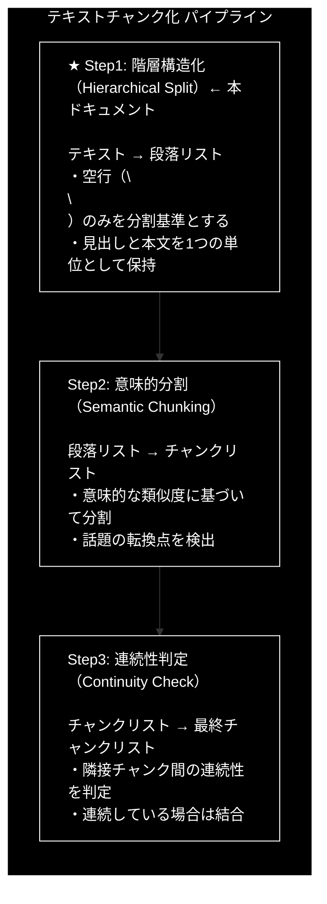
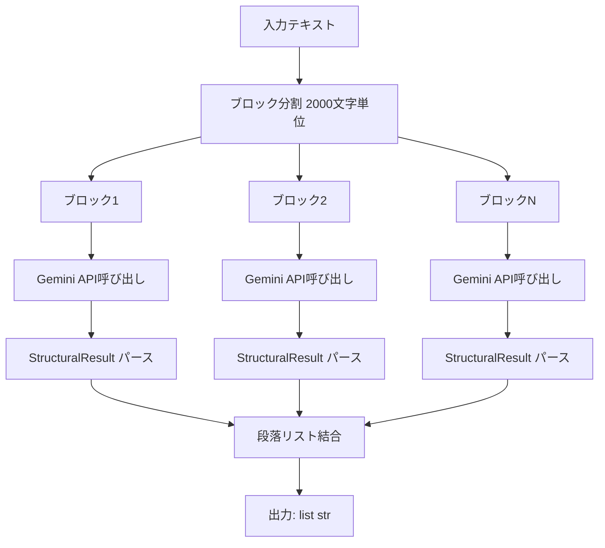

# Step1: 階層構造化（Hierarchical Split）

**バージョン:** v3.1.0
**対象ファイル:** `chunking/step1.py`（同期版・単体テスト用）
**共通モジュール:** `chunking/models.py`, `chunking/prompts.py`

---

## 📋 目次

1. [全体像](#1-全体像)
2. [Step1の方式説明](#2-step1の方式説明)
3. [step1.pyの説明](#3-step1pyの説明)
4. [具体例](#4-具体例)
5. [重要な設計判断](#5-重要な設計判断)

---

## 1. 全体像

### 1.1 3段階処理における Step1 の位置づけ




### 1.2 データフロー

| 段階 | 内容 |
|:----:|------|
| **入力** | `"RAG（Retrieval-Augmented Generation）は...\n\nセマンティックチャンキングは...\n\n京都の紅葉は..."` |
| ↓ | |
| **Step1: 階層構造化** | 1. テキストをブロックに分割<br>2. 各ブロックをLLMに送信<br>3. 段落構造を抽出<br>4. 結果を結合 |
| ↓ | |
| **出力（5段落）** | 段落1: `"RAG（Retrieval-Augmented Generation）は...（定義+利点）"`<br>段落2: `"セマンティックチャンキングは...（用語定義+用語使用）"`<br>段落3: `"京都の紅葉は...沖縄の海は...（京都+沖縄）"`<br>段落4: `"ベクトルデータベースは...（定義+活用）"`<br>段落5: `"第1章 機械学習入門...第2章 深層学習の基礎...（第1章+第2章）"` |

### 1.3 処理の流れ図



---

## 2. Step1の方式説明

### 2.1 目的

**文章の物理構造（空行による段落分け）を尊重した分割**を行います。

> ⚠️ **重要**: Step1は**空行（`\n\n`）のみ**を分割基準とします。
> 章の変わり目（第1章→第2章）では**分割しません**。

単純な文字数分割では、以下の問題が発生します：

| 問題 | 具体例 |
|------|--------|
| 見出しと本文の分断 | 「第1章 機械学習入門」と本文が別チャンクに |
| 文の途中での切断 | 「この手法の最大の利点は、最新情報を反映でき」で切れる |
| 意味のまとまりの破壊 | RAGの定義と利点が別々のチャンクに |

Step1では、LLM（Gemini API）を活用して、これらの問題を解決します。

### 2.2 分割ルール（最重要）

**【Step1の分割ルール】**

| 区分 | ルール |
|:----:|--------|
| ✅ **分割する場合** | 空行（`\n\n`）が存在する箇所のみ |
| ❌ **分割しない場合** | 見出し（「第〇章」など）と直後の本文 → 空行なければ同一段落 |
| ❌ **分割しない場合** | 章が変わっても（第1章→第2章）→ 空行なければ分割しない |
| ❌ **分割しない場合** | 改行（`\n`）だけでは分割しない |

### 2.3 アルゴリズム

| ステップ | 処理内容 |
|:--------:|----------|
| 1 | 入力テキストを `block_size`（デフォルト2000文字）ごとに分割<br>例: 5000文字 → 3ブロック（2000, 2000, 1000文字） |
| 2 | 各ブロックをLLM（Gemini API）に送信<br>・JSON形式（`response_mime_type="application/json"`）<br>・Pydanticスキーマ（`response_schema=StructuralResult`） |
| 3 | LLMが以下のルールで構造化:<br>・Rule 1: 空行（`\n\n`）のみで段落を分割<br>・Rule 2: 見出しと本文は分離せず1つの段落に<br>・Rule 3: 句点（。）や改行で文を分割 |
| 4 | 全ブロックの結果を結合して段落リストを生成 |

### 2.4 LLMへのプロンプト

`chunking/prompts.py` で定義されている `PARAGRAPH_SEPARATION_PROMPT`:

```python
PARAGRAPH_SEPARATION_PROMPT = """
あなたはテキスト構造化エンジンです。入力されたテキストを以下の【分割ルール】に従って解析し、階層構造（段落 > 文）に変換してください。

【分割ルール】
入力されたテキストを、以下のルールに従って構造化してください。
目的は、テキストを「大きな意味のブロック（Paragraph）」に分け、その中を「文（Sentence）」に分解することです。

【Rule 1: Paragraphの分割基準（厳密に従うこと）】
**分割する場合（これ以外では分割しない）:**
- 空行（\\n\\n）が存在する箇所で分割する

**分割してはいけない場合（重要）:**
- 見出し（「第〇章」など）と直後の本文は、**空行がなければ**同じParagraphに含める
- 章が変わっても（例: 第1章 → 第2章）、**空行がなければ**分割しない
- 改行（\\n）だけでは分割しない

【Rule 2: 見出しの扱い】
- 「第〇章」などの見出しがある場合:
  - 見出し単体でParagraphを作らない
  - 見出しと直後の本文を**まとめて1つのParagraph**とする
  - ただし、見出しの前に空行（\\n\\n）があれば、そこで分割する

【Rule 3: Sentenceの分割】
- Paragraphの中身を、句点「。」や改行ごとに区切って sentences リストに格納してください。
- 見出し部分も1つの sentence として扱ってください。

【具体例】
```
入力テキスト:
段落A。段落A続き。

段落B。段落B続き。
第1章 タイトル
本文1。本文2。
第2章 タイトル
本文3。本文4。

段落C。
```

期待される分割:
- Paragraph 1: 「段落A。段落A続き。」
- Paragraph 2: 「段落B。段落B続き。第1章 タイトル 本文1。本文2。第2章 タイトル 本文3。本文4。」
  （空行がないので、第1章も第2章も同じParagraphに含まれる）
- Paragraph 3: 「段落C。」

【出力要件】
- JSONスキーマに従い、paragraphs リストの中に sentences リストを持つ構造で出力すること。
- 元のテキストの内容を省略したり要約したりせず、**そのままの文字列**を保持すること。
- **空行（\\n\\n）のみを分割基準とし、章の変わり目では分割しないこと。**
"""
```

### 2.5 レスポンススキーマ（Pydanticモデル）

`chunking/models.py` で定義:

```python
class SentenceUnit(BaseModel):
    """1つの文、または意味の最小単位"""
    text: str = Field(description="1つの文、または意味の最小単位")


class ParagraphUnit(BaseModel):
    """段落単位"""
    id: int = Field(description="Paragraph ID")
    sentences: List[SentenceUnit] = Field(description="この段落に含まれる文のリスト")

    @property
    def full_text(self) -> str:
        """段落内の全文を結合して返す

        注意: 改行（\n）で文を結合します。
        これにより、元のテキスト構造が保持され、
        Step2・Step3での処理精度が向上します。

        CSV入力時に特に重要：
        - CSVセル内の改行が保持される
        - 可読性が高まる
        - 意味的分割が正確になる
        """
        return "\n".join([s.text for s in self.sentences])  # ← 改行で結合


class StructuralResult(BaseModel):
    """テキスト構造化の結果"""
    paragraphs: List[ParagraphUnit]
```

> ⚠️ **重要**: `full_text` プロパティは **改行（`\n`）** で文を結合します。
> これにより、元のテキスト構造が保持され、Step2・Step3での処理精度が向上します。

### 2.6 なぜ Step1 が必要なのか？

| 問題 | Step1 の解決策 |
|------|---------------|
| 見出しの分断 | 見出しと本文を1つの段落として保持 |
| 文字数での切断 | LLMが意味を理解して分割 |
| 構造の欠落 | 空行ベースの分割で物理構造を維持 |
| 改行の誤認識 | 空行（`\n\n`）と改行（`\n`）を区別 |

---

## 3. step1.pyの説明

### 3.1 ファイルの目的

`step1.py` は、Step1（階層構造化）の動作を**単体で確認**するためのテストプログラムです。

- **同期処理**で実装（デバッグ・理解しやすい）
- **単体テスト用**（Step1のみを独立して検証）
- Step2・Step3との連携を検証するためのテストデータを含む

### 3.2 プログラム構成

```python
# step1.py の構成

# 1. インポート
import os
from google import genai
from google.genai import types
from chunking.models import StructuralResult
from chunking.prompts import PARAGRAPH_SEPARATION_PROMPT

# 2. コア関数
def step1_hierarchical_split(text: str, api_key: str, block_size: int = 2000) -> list[str]:
    """Step1のコア機能を実装"""
    ...

# 3. メイン処理
def main():
    """テスト実行"""
    ...
```

### 3.3 プログラムの流れ

**step1.py の処理フロー**

| 順序 | 処理 | 詳細 |
|:----:|------|------|
| 1 | APIキー取得 | `api_key = os.getenv("GOOGLE_API_KEY")` |
| ↓ | | |
| 2 | テスト用テキスト準備 | `test_text = """RAG（Retrieval-Augmented Generation）..."""`<br>※ 空行（`\n\n`）で5段落に分割されることを期待 |
| ↓ | | |
| 3 | 関数呼び出し | `paragraphs = step1_hierarchical_split(test_text, api_key)` |
| ↓ | | |
| 4 | 結果表示・検証 | 段落数の確認（期待: 5段落）<br>各段落の内容表示<br>検証ポイントの確認 |
```

### 3.4 コア関数の詳細解説

```python
def step1_hierarchical_split(text: str, api_key: str, block_size: int = 2000) -> list[str]:
    """
    テキストを段落単位に分割する（Step1のコア機能）

    Args:
        text: 入力テキスト
        api_key: Gemini API キー
        block_size: ブロックサイズ（文字数）

    Returns:
        段落のリスト
    """
    # ① Gemini APIクライアントを初期化
    client = genai.Client(api_key=api_key)

    # ② テキストをブロックに分割
    #    例: 5000文字のテキスト → 3ブロック（2000, 2000, 1000文字）
    blocks = [text[i:i + block_size] for i in range(0, len(text), block_size)]
    print(f"入力: {len(text)}文字 → {len(blocks)}ブロック")

    paragraphs = []

    # ③ 各ブロックを処理
    for i, block in enumerate(blocks):
        print(f"ブロック {i + 1}/{len(blocks)} 処理中...")

        # ④ プロンプト作成（プロンプト + 入力テキスト）
        prompt = f"{PARAGRAPH_SEPARATION_PROMPT}\n\n【入力テキスト】\n{block}"

        # ⑤ Gemini API 呼び出し（同期）
        #    - gemini-2.5-flash: 最新の安定版、高いレート制限とパフォーマンス
        #    - response_mime_type: JSON形式を指定
        #    - response_schema: Pydanticモデルを指定
        response = client.models.generate_content(
            model="gemini-2.5-flash",
            contents=prompt,
            config=types.GenerateContentConfig(
                response_mime_type="application/json",
                response_schema=StructuralResult
            )
        )

        # ⑥ レスポンスをパース
        result = StructuralResult.model_validate_json(response.text)

        # ⑦ 段落を抽出（full_textプロパティで改行結合）
        for para in result.paragraphs:
            paragraphs.append(para.full_text)

        print(f"  → {len(result.paragraphs)}個の段落を抽出")

    return paragraphs
```

### 3.5 API呼び出しの詳細

```python
response = client.models.generate_content(
    model="gemini-2.5-flash",           # モデル名
    contents=prompt,                     # プロンプト
    config=types.GenerateContentConfig(
        response_mime_type="application/json",  # JSON形式を指定
        response_schema=StructuralResult        # Pydanticスキーマを指定
    )
)
```

| パラメータ | 値 | 説明 |
|-----------|-----|------|
| `model` | `"gemini-2.5-flash"` | 最新の安定版、高いレート制限とパフォーマンス |
| `response_mime_type` | `"application/json"` | JSON形式のレスポンスを要求 |
| `response_schema` | `StructuralResult` | Pydanticモデルでスキーマを指定 |

---

## 4. 具体例

### 4.1 テスト用入力テキスト

| 段落 | 内容 | 備考 |
|:----:|------|------|
| 1 | RAG（Retrieval-Augmented Generation）は、検索と生成を組み合わせた手法です。<br>外部知識ベースから関連情報を取得し、それをLLMのコンテキストとして渡します。<br>2020年にFacebookが発表し、現在では多くのシステムで採用されています。<br>この手法の最大の利点は、最新情報を反映できることです。<br>それにより、LLM単体では対応できない時事的な質問にも回答可能になります。<br>また、ハルシネーションを軽減する効果も報告されています。 | |
| | **↑ 空行 ↓** | 分割ポイント |
| 2 | セマンティックチャンキングは、テキストを意味単位で分割する技術です。<br>「チャンク」とは、分割されたテキストの各ブロックを指します。<br>「埋め込み」（Embedding）は、テキストを数値ベクトルに変換したものです。<br>チャンクサイズは検索精度に大きく影響します。<br>小さすぎると文脈が失われ、埋め込みの品質が低下します。<br>大きすぎると検索ノイズが増加し、関連性の低い情報が混入します。 | |
| | **↑ 空行 ↓** | 分割ポイント |
| 3 | 京都の紅葉は11月中旬から下旬が見頃です。<br>清水寺や嵐山が特に人気のスポットとして知られています。<br>混雑を避けるなら平日の早朝がおすすめです。<br>沖縄の海は透明度が高く、シュノーケリングに最適です。<br>那覇から車で約1時間の恩納村には美しいビーチが点在しています。<br>夏季は台風に注意が必要ですが、それ以外の季節も温暖で過ごしやすいです。 | |
| | **↑ 空行 ↓** | 分割ポイント |
| 4 | ベクトルデータベースは、高次元ベクトルを効率的に格納・検索するシステムです。<br>代表的な製品にPinecone、Weaviate、Chromaなどがあります。<br>ANN（Approximate Nearest Neighbor）アルゴリズムにより高速な類似検索を実現します。<br>ANNの精度とスピードはトレードオフの関係にあります。<br>HNSWやIVFなどのインデックス手法を選択することで、このバランスを調整できます。<br>ベクトルDBの選定では、スケーラビリティとコストも重要な判断基準となります。 | |
| | **↑ 空行 ↓** | 分割ポイント |
| 5 | 第1章 機械学習入門<br>機械学習は、データからパターンを学習するアルゴリズムの総称です。<br>教師あり学習、教師なし学習、強化学習の3つに大別されます。<br>本章では、これらの基本概念を解説しました。<br>第2章 深層学習の基礎<br>深層学習は、多層のニューラルネットワークを用いる機械学習の一手法です。<br>画像認識や自然言語処理で革命的な成果を上げています。<br>本章では、CNNとRNNの基本アーキテクチャを説明します。 | ⚠️ 第1章と第2章の間に空行なし→同一段落 |

### 4.2 分割ポイントの可視化

| 段落 | 内容 | 分割理由 |
|:----:|------|----------|
| **段落1** | RAGの説明<br>`RAG（Retrieval-Augmented Generation）は...`<br>`...ハルシネーションを軽減する効果も報告されています。` | |
| ↓ | 空行（`\n\n`）あり | **分割** |
| **段落2** | セマンティックチャンキングの説明<br>`セマンティックチャンキングは...`<br>`...関連性の低い情報が混入します。` | |
| ↓ | 空行（`\n\n`）あり | **分割** |
| **段落3** | 観光情報<br>`京都の紅葉は...`<br>`...それ以外の季節も温暖で過ごしやすいです。` | |
| ↓ | 空行（`\n\n`）あり | **分割** |
| **段落4** | ベクトルDBの説明<br>`ベクトルデータベースは...`<br>`...スケーラビリティとコストも重要な判断基準となります。` | |
| ↓ | 空行（`\n\n`）あり | **分割** |
| **段落5** | 章構造（第1章+第2章）<br>`第1章 機械学習入門`<br>`機械学習は...本章では、これらの基本概念を解説しました。`<br>`第2章 深層学習の基礎`<br>`深層学習は...本章では、CNNとRNNの基本アーキテクチャを説明します。` | ⚠️ 空行がないので**分割しない** |

### 4.3 期待される出力

```python
# Step1の出力（5段落）
[
  # 段落1: RAGの説明（定義+利点）
  "RAG（Retrieval-Augmented Generation）は、検索と生成を組み合わせた手法です。\n"
  "外部知識ベースから関連情報を取得し、それをLLMのコンテキストとして渡します。\n"
  "2020年にFacebookが発表し、現在では多くのシステムで採用されています。\n"
  "この手法の最大の利点は、最新情報を反映できることです。\n"
  "それにより、LLM単体では対応できない時事的な質問にも回答可能になります。\n"
  "また、ハルシネーションを軽減する効果も報告されています。",

  # 段落2: セマンティックチャンキングの説明（用語定義+用語使用）
  "セマンティックチャンキングは、テキストを意味単位で分割する技術です。\n"
  "「チャンク」とは、分割されたテキストの各ブロックを指します。\n"
  "「埋め込み」（Embedding）は、テキストを数値ベクトルに変換したものです。\n"
  "チャンクサイズは検索精度に大きく影響します。\n"
  "小さすぎると文脈が失われ、埋め込みの品質が低下します。\n"
  "大きすぎると検索ノイズが増加し、関連性の低い情報が混入します。",

  # 段落3: 観光情報（京都+沖縄）
  "京都の紅葉は11月中旬から下旬が見頃です。\n"
  "清水寺や嵐山が特に人気のスポットとして知られています。\n"
  "混雑を避けるなら平日の早朝がおすすめです。\n"
  "沖縄の海は透明度が高く、シュノーケリングに最適です。\n"
  "那覇から車で約1時間の恩納村には美しいビーチが点在しています。\n"
  "夏季は台風に注意が必要ですが、それ以外の季節も温暖で過ごしやすいです。",

  # 段落4: ベクトルDBの説明（定義+活用）
  "ベクトルデータベースは、高次元ベクトルを効率的に格納・検索するシステムです。\n"
  "代表的な製品にPinecone、Weaviate、Chromaなどがあります。\n"
  "ANN（Approximate Nearest Neighbor）アルゴリズムにより高速な類似検索を実現します。\n"
  "ANNの精度とスピードはトレードオフの関係にあります。\n"
  "HNSWやIVFなどのインデックス手法を選択することで、このバランスを調整できます。\n"
  "ベクトルDBの選定では、スケーラビリティとコストも重要な判断基準となります。",

  # 段落5: 章構造（第1章+第2章）← 空行がないので同じ段落！
  "第1章 機械学習入門\n"
  "機械学習は、データからパターンを学習するアルゴリズムの総称です。\n"
  "教師あり学習、教師なし学習、強化学習の3つに大別されます。\n"
  "本章では、これらの基本概念を解説しました。\n"
  "第2章 深層学習の基礎\n"
  "深層学習は、多層のニューラルネットワークを用いる機械学習の一手法です。\n"
  "画像認識や自然言語処理で革命的な成果を上げています。\n"
  "本章では、CNNとRNNの基本アーキテクチャを説明します。"
]
```

### 4.4 検証ポイント

| チェック項目 | 期待結果 | 確認方法 |
|-------------|---------|---------|
| 段落数 | 5段落 | `len(paragraphs) == 5` |
| 空行での分割 | 空行（`\n\n`）で分割 | 各段落の境界を確認 |
| 章の非分割 | 第1章と第2章が同じ段落 | 段落5の内容を確認 |
| テキスト保持 | 省略なし | 文字数・内容を比較 |
| 改行結合 | `\n` で文を結合 | `full_text` の出力を確認 |

### 4.5 Step2・Step3との連携（テストデータの流れ）

**【Step1】1テキスト → 5段落**

| 段落 | 内容 |
|:----:|------|
| 段落1 | RAGの説明（定義+利点） |
| 段落2 | セマンティックチャンキングの説明（用語定義+用語使用） |
| 段落3 | 観光情報（京都+沖縄） |
| 段落4 | ベクトルDBの説明（定義+活用） |
| 段落5 | 章構造（第1章+第2章） |

**【Step2】5段落 → 10チャンク（意味的に分割）**

| 入力 | 出力 |
|------|------|
| 段落1 | チャンク1（RAG定義）+ チャンク2（RAG利点） |
| 段落2 | チャンク3（用語定義）+ チャンク4（用語使用） |
| 段落3 | チャンク5（京都観光）+ チャンク6（沖縄観光） |
| 段落4 | チャンク7（ベクトルDB定義）+ チャンク8（活用） |
| 段落5 | チャンク9（第1章）+ チャンク10（第2章） |

**【Step3】10チャンク → 7チャンク（連続性で結合/分離）**

| 処理 | 結果 | 理由 |
|------|------|------|
| チャンク1+2 | 結合 | 前方依存: 「この手法」「それ」 |
| チャンク3+4 | 結合 | 後方依存: 「チャンク」「埋め込み」未定義 |
| チャンク5 | 独立 | 京都観光は単独で理解可能 |
| チャンク6 | 独立 | 沖縄観光は単独で理解可能 |
| チャンク7+8 | 結合 | 後方依存: 「ANN」「ベクトルDB」未定義 |
| チャンク9 | 独立 | 第1章は完結 |
| チャンク10 | 独立 | 第2章は独立して理解可能 |

#### 検証パターンの詳細

| パターン | 説明 | 具体例 | Step3での判定 |
|----------|------|--------|--------------|
| **前方依存** | 指示語で前を参照 | 「この手法」「それ」 | → 結合（True） |
| **後方依存** | 専門用語が未定義のまま使用 | 「チャンク」「埋め込み」「ANN」 | → 結合（True） |
| **独立判定** | 話題は同じでも単独で理解可能 | 京都観光 / 沖縄観光 | → 分離（False） |
| **章構造** | 章が変わった場合 | 第1章 / 第2章 | → 分離（False） |

---

## 5. 重要な設計判断

### 5.1 なぜ空行のみを分割基準とするのか？

**【問題】** 章の変わり目で分割すると、Step2で「章の変わり目かどうか」の判断が難しくなる

**【例：入力テキスト】**
```
第1章 機械学習入門
機械学習は...
第2章 深層学習の基礎
深層学習は...
```

| 方式 | Step1の出力 | Step2での問題 |
|------|-------------|---------------|
| ❌ 章で分割 | 段落1: `第1章 機械学習入門\n機械学習は...`<br>段落2: `第2章 深層学習の基礎\n深層学習は...` | 段落1内は「第1章」しかないので、意味的分割の判断が困難<br>章構造の情報が失われる |
| ✅ 空行のみで分割 | 段落1: `第1章 機械学習入門\n機械学習は...第2章 深層学習の基礎\n深層学習は...` | 段落1内に「第1章」「第2章」の両方があり、章の転換点を検出可能<br>→ チャンク1: 第1章<br>→ チャンク2: 第2章 |

### 5.2 なぜ改行（`\n`）で文を結合するのか？

```python
# models.py の full_text プロパティ

@property
def full_text(self) -> str:
    """段落内の全文を結合して返す

    注意: 改行（\n）で文を結合します。
    これにより、元のテキスト構造が保持され、
    Step2・Step3での処理精度が向上します。

    CSV入力時に特に重要：
    - CSVセル内の改行が保持される
    - 可読性が高まる
    - 意味的分割が正確になる
    """
    return "\n".join([s.text for s in self.sentences])  # ← 改行で結合
```

| 結合方法 | 結果 | 問題点 |
|----------|------|--------|
| 空文字結合 `"".join()` | `"文1。文2。文3。"` | 元の改行構造が失われる |
| 改行結合 `"\n".join()` | `"文1。\n文2。\n文3。"` | ✅ 元の構造が保持される |

**改行結合のメリット:**
- Step2で文の区切りを認識しやすい
- Step3で連続性判定の精度が向上
- デバッグ時に可読性が高い
- CSV入力時にセル内の改行が保持される

### 5.3 ブロックサイズの選定理由

```python
block_size: int = 2000  # デフォルト値
```

| サイズ | メリット | デメリット |
|--------|----------|------------|
| 500文字 | 処理が軽い | 段落が分断されやすい |
| 2000文字 | バランスが良い | ✅ 推奨 |
| 5000文字 | 段落が保持されやすい | API制限に近づく |

---

## まとめ

### Step1 の役割

| 項目 | 内容 |
|------|------|
| 入力 | テキスト（文字列） |
| 出力 | 段落リスト（`list[str]`） |
| 目的 | 物理構造（空行による段落分け）を維持した分割 |
| 方式 | LLM（Gemini API）による構造認識 |

### 重要なポイント

1. **空行のみで分割**: `\n\n` のみが分割基準、章の変わり目では分割しない
2. **見出しと本文の保持**: 「第X章」と直後の本文は同じ段落として扱う
3. **改行で文を結合**: `full_text` は `\n` で文を結合し、構造を保持
4. **テキストの完全保持**: 省略や要約は行わない

### 次のステップ

Step1 の出力（段落リスト）は、**Step2（意味的分割）** の入力として使用されます。

Step2 では、各段落内の**意味的な転換点**を検出し、より細かいチャンクに分割します。
特に、章の変わり目（第1章→第2章）はStep2で分割されます。

Step3 では、隣接チャンク間の**連続性**を判定し、以下のパターンで結合/分離を行います：

| パターン | 判定 | 結果 |
|----------|------|------|
| **前方依存** | 指示語（「この」「それ」）で前を参照 | 結合 |
| **後方依存** | 専門用語が未定義のまま使用 | 結合 |
| **独立判定** | 話題は同じでも単独で理解可能 | 分離 |
| **章構造** | 章が変わった場合 | 分離 |
