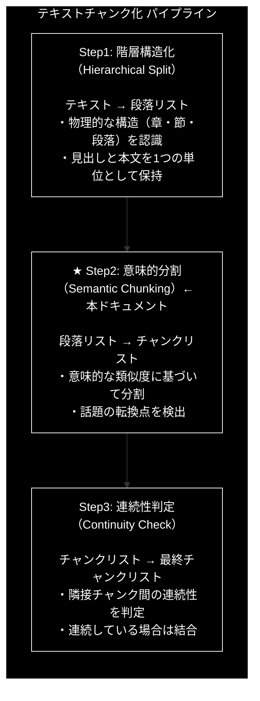
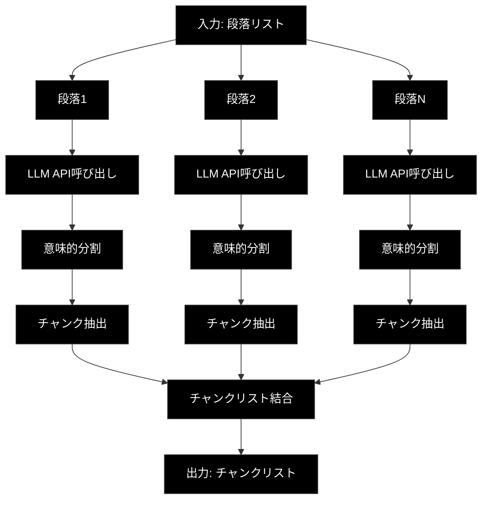

# Step2: 意味的分割（Semantic Chunking）

**バージョン:** v2.0.0
**対象ファイル:** `chunking/csv_text_to_chunks_text_csv.py`
**確認用プログラム:** `chunking/check_function/check_step2.py`

---

## 📋 目次

1. [全体像](#1-全体像)
2. [Step2の方式説明](#2-step2の方式説明)
3. [check_step2.pyの説明](#3-check_step2pyの説明)
4. [具体例](#4-具体例)
5. [csv_text_to_chunks_text_csv.pyでの実装](#5-csv_text_to_chunks_text_csvpyでの実装)

---

## 1. 全体像

### 1.1 3段階処理における Step2 の位置づけ



### 1.2 データフロー

```
【入力: Step1の出力（段落リスト）】
[
  "第1章 人工知能の基礎\n人工知能（AI）は...",
  "第2章 機械学習の手法\n教師あり学習では...\nところで、ラーメンが..."
]
        │
        ▼
┌───────────────────────────────────────┐
│          Step2: 意味的分割            │
│                                       │
│  1. 各段落をLLMに送信                 │
│  2. 意味的な転換点を検出              │
│  3. 話題ごとにチャンクを分割          │
│  4. 結果を結合                        │
└───────────────────────────────────────┘
        │
        ▼
【出力: チャンクリスト】
[
  "第1章 人工知能の基礎\n人工知能（AI）は...",
  "第2章 機械学習の手法\n教師あり学習では...",
  "ところで、ラーメンが..."  ← 別トピックとして分離
]
```

### 1.3 処理の流れ図



---

## 2. Step2の方式説明

### 2.1 目的

**意味的な類似度に基づいた分割**を行います。

Step1では物理的な構造（章・節・段落）で分割しましたが、同じ段落内でも話題が変わることがあります。Step2では、LLMを活用して**話題の転換点**を検出し、意味的なまとまりごとにチャンクを分割します。

### 2.2 Step1との違い

| 項目 | Step1（階層構造化） | Step2（意味的分割） |
|------|-------------------|-------------------|
| 分割基準 | 物理的構造（空行、章の変わり目） | 意味的な類似度（話題の転換） |
| 改行の扱い | 改行を尊重 | 改行を無視（意味優先） |
| 目的 | 見出しと本文を保持 | 話題の混在を解消 |

### 2.3 アルゴリズム

```
1. Step1の出力（段落リスト）を入力として受け取る

2. 各段落をLLM（Gemini API）に送信
   - JSON形式で構造化されたレスポンスを取得

3. LLMが以下のロジックで分割:
   ┌────────────────────────────────────────────────┐
   │ 【処理ロジック: 仮想的なベクトル類似度判定】      │
   │                                                │
   │ 1. テキストを文脈に沿って読み進める             │
   │ 2. 隣り合う文同士の「意味的な距離」を分析       │
   │ 3. 意味の類似度が高い → 同じブロックに結合      │
   │ 4. 話題の転換点を検出 → ブロックを分割          │
   └────────────────────────────────────────────────┘

4. 全段落の結果を結合してチャンクリストを生成
```

### 2.4 LLMへのプロンプト

`chunking/prompts.py` で定義されている `SEMANTIC_CHUNKING_PROMPT`:

```python
SEMANTIC_CHUNKING_PROMPT = """
あなたは「セマンティック・チャンキング（意味的分割）エンジン」です。
入力されたテキストを、形式的な段落や改行ではなく、「意味のまとまり（トピック）」に基づいて再構成してください。

【処理ロジック: 仮想的なベクトル類似度判定】
1. テキストを文脈に沿って読み進め、隣り合う文同士の「意味的な距離」を分析してください。
2. 文の内容が連続している、または高い関連性を持つ場合は、同じブロック（Paragraph）に結合してください。
3. **「話題の転換点」**（意味の類似度がしきい値を下回るような、話題の切り替わり）を見つけたら、そこでブロックを分割してください。

【分割の基準】
- **文字数や物理的な改行（\\n）は無視すること**。
- たとえ改行がなくても、話題が大きく変われば分割する。
- たとえ改行があっても、文脈や意味が続いているなら分割しない。

【出力要件】
- 意味的に凝集したブロックを1つの Paragraph と定義し、その中の文を sentences リストに格納して出力すること。
- 元のテキストを一言一句変更せず保持すること。
"""
```

### 2.5 なぜ Step2 が必要なのか？

Step1だけでは解決できない問題があります：

| 問題 | 具体例 | Step2 の解決策 |
|------|--------|---------------|
| 話題の混在 | 機械学習の説明 → ラーメンの話 → 機械学習に戻る | 話題ごとに分割 |
| 不適切な結合 | 異なるトピックが同じ段落に | 意味的境界で分離 |
| 形式的分割の限界 | 改行がなくても話題は変わりうる | 改行を無視して意味で判断 |

### 2.6 意味的分割のイメージ

```
【Step1の出力（1つの段落）】
┌─────────────────────────────────────────────────────────────┐
│ 強化学習は、エージェントが環境と相互作用しながら学習する手法です。│
│ 報酬を最大化するように行動を学習していきます。                  │
│ ゲームAIやロボット制御などに応用されています。                  │
│ ところで、昨日食べたラーメンが美味しかったです。  ← 話題転換！   │
│ 次回も同じ店に行きたいと思います。                              │
│ 話を戻すと、深層強化学習はDeep Learningと強化学習を...         │
└─────────────────────────────────────────────────────────────┘
                              │
                              ▼
                    【Step2: 意味的分割】
                              │
                              ▼
┌─────────────────────────────────────────────────────────────┐
│ チャンク1: 強化学習について                                    │
│ 「強化学習は、エージェントが環境と相互作用しながら...」         │
├─────────────────────────────────────────────────────────────┤
│ チャンク2: ラーメンの話（別トピック）                          │
│ 「ところで、昨日食べたラーメンが美味しかったです...」          │
├─────────────────────────────────────────────────────────────┤
│ チャンク3: 深層強化学習について                                │
│ 「話を戻すと、深層強化学習はDeep Learningと...」              │
└─────────────────────────────────────────────────────────────┘
```

---

## 3. check_step2.pyの説明

### 3.1 ファイルの目的

`check_step2.py` は、Step2（意味的分割）の動作を単体で確認するためのテストプログラムです。

### 3.2 プログラム構成

```python
# check_step2.py の構成

# 1. インポート
import os
from google import genai
from google.genai import types
from chunking.models import StructuralResult
from chunking.prompts import SEMANTIC_CHUNKING_PROMPT

# 2. コア関数
def step2_semantic_chunking(paragraphs: list[str], api_key: str) -> list[str]:
    """Step2のコア機能を実装"""
    ...

# 3. メイン処理
def main():
    """テスト実行"""
    ...
```

### 3.3 プログラムの流れ

```
┌──────────────────────────────────────────────────────────────┐
│                    check_step2.py の処理フロー                │
└──────────────────────────────────────────────────────────────┘
                              │
                              ▼
┌──────────────────────────────────────────────────────────────┐
│ 1. APIキー取得                                                │
│    api_key = os.getenv("GOOGLE_API_KEY")                     │
└──────────────────────────────────────────────────────────────┘
                              │
                              ▼
┌──────────────────────────────────────────────────────────────┐
│ 2. テスト用段落準備（Step1の出力を想定）                       │
│    test_paragraphs = [                                       │
│        "第1章 人工知能の基礎...",                             │
│        "第2章 機械学習の手法...",                             │
│        "強化学習は...ところで、ラーメンが..."  ← 話題混在     │
│    ]                                                         │
└──────────────────────────────────────────────────────────────┘
                              │
                              ▼
┌──────────────────────────────────────────────────────────────┐
│ 3. step2_semantic_chunking() 呼び出し                        │
│    chunks = step2_semantic_chunking(test_paragraphs, api_key)│
└──────────────────────────────────────────────────────────────┘
                              │
                              ▼
┌──────────────────────────────────────────────────────────────┐
│ 4. 結果表示・検証                                             │
│    - チャンク数の確認（段落数より増える可能性）                │
│    - 各チャンクの内容表示                                     │
│    - 検証ポイントの確認                                       │
└──────────────────────────────────────────────────────────────┘
```

### 3.4 コア関数の詳細解説

```python
def step2_semantic_chunking(paragraphs: list[str], api_key: str) -> list[str]:
    """
    段落を意味的なチャンクに分割する（Step2のコア機能）

    Args:
        paragraphs: 段落のリスト（Step1の出力）
        api_key: Gemini API キー

    Returns:
        意味的に分割されたチャンクのリスト
    """
    # ① Gemini APIクライアントを初期化
    client = genai.Client(api_key=api_key)

    print(f"入力: {len(paragraphs)}段落")

    chunks = []

    # ② 各段落を処理
    for i, para in enumerate(paragraphs):
        print(f"段落 {i + 1}/{len(paragraphs)} 処理中...")

        # ③ プロンプト作成（プロンプト + 入力テキスト）
        prompt = f"{SEMANTIC_CHUNKING_PROMPT}\n\n【入力テキスト】\n{para}"

        # ④ Gemini API 呼び出し（同期）
        response = client.models.generate_content(
            model="gemini-2.0-flash-exp",
            contents=prompt,
            config=types.GenerateContentConfig(
                response_mime_type="application/json",  # JSON形式で応答
                response_schema=StructuralResult        # Pydanticスキーマを指定
            )
        )

        # ⑤ レスポンスをパース（JSON → Pydanticオブジェクト）
        result = StructuralResult.model_validate_json(response.text)

        # ⑥ チャンクを抽出してリストに追加
        for chunk_para in result.paragraphs:
            chunks.append(chunk_para.full_text)

        print(f"  → {len(result.paragraphs)}個のチャンクに分割")

    return chunks
```

### 3.5 処理のポイント対応表

| 行番号 | 処理 | 説明 |
|--------|------|------|
| ① | クライアント初期化 | Gemini APIへの接続を確立 |
| ② | ループ処理 | 各段落を順番に処理（Step1との違い: 段落単位） |
| ③ | プロンプト作成 | 意味的分割の指示とテキストを組み合わせ |
| ④ | API呼び出し | LLMに意味的分割を依頼 |
| ⑤ | JSON解析 | レスポンスをPydanticオブジェクトに変換 |
| ⑥ | チャンク抽出 | 結果からチャンクテキストを取得（1段落→複数チャンクの可能性） |

### 3.6 Step1との処理の違い

| 項目 | Step1 | Step2 |
|------|-------|-------|
| 入力 | テキスト全体 | 段落リスト |
| 処理単位 | ブロック（2000文字） | 段落（Step1の出力） |
| 出力の変化 | テキスト → 段落（構造化） | 1段落 → 複数チャンク（分割） |
| プロンプト | PARAGRAPH_SEPARATION_PROMPT | SEMANTIC_CHUNKING_PROMPT |

---

## 4. 具体例

### 4.1 入力（Step1の出力）

```python
test_paragraphs = [
    # 段落1: AI基礎（単一トピック → 分割なし）
    """第1章 人工知能の基礎
人工知能（AI）は、コンピュータに人間のような知能を持たせる技術です。
機械学習やディープラーニングがその中核をなしています。
AIの研究は1950年代から始まり、現在では様々な分野で応用されています。""",

    # 段落2: 機械学習（単一トピック → 分割なし）
    """第2章 機械学習の手法
教師あり学習では、ラベル付きデータから学習します。
代表的な手法には、ランダムフォレストやサポートベクターマシンがあります。
一方、教師なし学習では、ラベルのないデータからパターンを発見します。
クラスタリングや次元削減などが代表的な手法です。""",

    # 段落3: 話題が混在（複数トピック → 分割される！）
    """強化学習は、エージェントが環境と相互作用しながら学習する手法です。
報酬を最大化するように行動を学習していきます。
ゲームAIやロボット制御などに応用されています。
ところで、昨日食べたラーメンが美味しかったです。   ← 話題転換
次回も同じ店に行きたいと思います。
話を戻すと、深層強化学習はDeep Learningと強化学習を組み合わせた手法です。"""
]
```

### 4.2 Step2の処理

```
【入力: 段落3（話題混在）】
┌─────────────────────────────────────────────────────────────────┐
│ 強化学習は、エージェントが環境と相互作用しながら学習する手法です。 │
│ 報酬を最大化するように行動を学習していきます。                    │
│ ゲームAIやロボット制御などに応用されています。                    │
│ ところで、昨日食べたラーメンが美味しかったです。  ← 話題転換      │
│ 次回も同じ店に行きたいと思います。                                │
│ 話を戻すと、深層強化学習はDeep Learningと強化学習を...            │
└─────────────────────────────────────────────────────────────────┘
                              │
                              ▼
                    ┌─────────────────┐
                    │  Step2 処理     │
                    │  (意味的分割)   │
                    └─────────────────┘
                              │
                              ▼
【LLMのJSON出力】
{
  "paragraphs": [
    {
      "id": 0,
      "sentences": [
        {"text": "強化学習は、エージェントが環境と相互作用しながら学習する手法です。"},
        {"text": "報酬を最大化するように行動を学習していきます。"},
        {"text": "ゲームAIやロボット制御などに応用されています。"}
      ]
    },
    {
      "id": 1,
      "sentences": [
        {"text": "ところで、昨日食べたラーメンが美味しかったです。"},
        {"text": "次回も同じ店に行きたいと思います。"}
      ]
    },
    {
      "id": 2,
      "sentences": [
        {"text": "話を戻すと、深層強化学習はDeep Learningと強化学習を組み合わせた手法です。"}
      ]
    }
  ]
}
                              │
                              ▼
【Step2の出力（段落3から生成されたチャンク）】
┌─────────────────────────────────────────────────────────────────┐
│ チャンク: 強化学習                                               │
│ "強化学習は、エージェントが環境と相互作用しながら学習する手法です。│
│  報酬を最大化するように行動を学習していきます。                   │
│  ゲームAIやロボット制御などに応用されています。"                  │
├─────────────────────────────────────────────────────────────────┤
│ チャンク: ラーメン（話題転換で分離）                              │
│ "ところで、昨日食べたラーメンが美味しかったです。                 │
│  次回も同じ店に行きたいと思います。"                              │
├─────────────────────────────────────────────────────────────────┤
│ チャンク: 深層強化学習                                           │
│ "話を戻すと、深層強化学習はDeep Learningと強化学習を組み合わせた  │
│  手法です。"                                                     │
└─────────────────────────────────────────────────────────────────┘
```

### 4.3 全体の入出力

```
【入力】3段落
┌────────────────────────────────────────┐
│ 段落1: 第1章 人工知能の基礎            │
│ 段落2: 第2章 機械学習の手法            │
│ 段落3: 強化学習 + ラーメン + 深層強化学習│
└────────────────────────────────────────┘
                    │
                    ▼
             【Step2 処理】
                    │
                    ▼
【出力】5チャンク（段落3が3つに分割）
┌────────────────────────────────────────┐
│ チャンク1: 第1章 人工知能の基礎        │ ← 段落1そのまま
│ チャンク2: 第2章 機械学習の手法        │ ← 段落2そのまま
│ チャンク3: 強化学習                    │ ← 段落3から分割
│ チャンク4: ラーメン                    │ ← 段落3から分割
│ チャンク5: 深層強化学習                │ ← 段落3から分割
└────────────────────────────────────────┘
```

### 4.4 検証ポイント

check_step2.py を実行した際に確認すべきポイント：

| チェック項目 | 期待結果 |
|-------------|---------|
| 意味的凝集 | 同じトピックの文が同じチャンクに |
| 話題転換の検出 | 「ところで」「話を戻すと」で分離 |
| テキストの保持 | 省略や要約なく、原文が保持される |
| チャンク数の増加 | 入力段落数 ≤ 出力チャンク数 |

---

## 5. csv_text_to_chunks_text_csv.pyでの実装

### 5.1 関数の位置づけ

```
csv_text_to_chunks_text_csv.py
│
├── main()                              # エントリーポイント
│   └── chunks_all_async()              # メイン処理
│       │
│       ├── _step1_hierarchical_split() # Step1 実装
│       ├── _step2_semantic_chunking()  # ★ Step2 実装
│       └── _step3_continuity_check()   # Step3 実装
│
└── その他のユーティリティ関数
```

### 5.2 _step2_semantic_chunking() の実装

**ファイル:** `csv_text_to_chunks_text_csv.py`
**行番号:** 445-490

```python
async def _step2_semantic_chunking(
        paragraphs: List[str],
        client: AsyncAPIClient,
        model: str,
        checkpoint_manager: CheckpointManager
) -> List[str]:
    """Step 2: 意味的分割"""

    # ① チェックポイント確認（再開時はスキップ）
    if checkpoint_manager.exists("step2"):
        logger.info("Step2: チェックポイントから再開")
        return checkpoint_manager.load("step2")

    logger.info("\n[Step 2/3] 意味的分割")
    logger.info(f"  入力: {len(paragraphs)} 段落")

    # ② 各段落のタスクを作成（非同期）
    tasks = []
    for i, para in enumerate(paragraphs):
        prompt = f"{SEMANTIC_CHUNKING_PROMPT}\n\n【入力テキスト】\n{para}"
        task = client.generate_content(
            model=model,
            contents=prompt,
            response_schema=StructuralResult,
            task_id=f"step2_para_{i}"
        )
        tasks.append(task)

    # ③ 並列実行（tqdm で進捗表示）
    results = await async_tqdm.gather(
        *tasks,
        desc="Step2: 意味的分割",
        total=len(tasks)
    )

    # ④ 結果の集約（1段落 → 複数チャンクの可能性）
    chunks = []
    for result_json in results:
        if result_json:
            try:
                result = StructuralResult.model_validate_json(result_json)
                for para in result.paragraphs:
                    chunks.append(para.full_text)
            except Exception as e:
                logger.warning(f"パース失敗: {e}")

    logger.info(f"  出力: {len(chunks)} チャンク")

    # ⑤ チェックポイント保存
    checkpoint_manager.save("step2", chunks)

    return chunks
```

### 5.3 check_step2.py との対比

| 機能 | check_step2.py | csv_text_to_chunks_text_csv.py |
|------|----------------|-------------------------------|
| 処理方式 | 同期（逐次処理） | 非同期（並列処理） |
| API呼び出し | `client.models.generate_content()` | `client.generate_content()` (AsyncAPIClient) |
| エラー処理 | 基本的 | try-except + ログ出力 |
| チェックポイント | なし | あり（途中再開可能） |
| 進捗表示 | print文 | tqdm.asyncio |

### 5.4 Step1との実装の違い

```python
# 【Step1】ブロック単位で処理
blocks = [text[i:i + block_size] for i in range(0, len(text), block_size)]
for i, block in enumerate(blocks):
    prompt = f"{PARAGRAPH_SEPARATION_PROMPT}\n\n【入力テキスト】\n{block}"
    # ...

# 【Step2】段落単位で処理（Step1の出力を入力として使用）
for i, para in enumerate(paragraphs):  # paragraphs = Step1の出力
    prompt = f"{SEMANTIC_CHUNKING_PROMPT}\n\n【入力テキスト】\n{para}"
    # ...
```

**違いのポイント:**
- **入力**: Step1はテキスト全体、Step2は段落リスト
- **プロンプト**: 目的に応じた異なるプロンプト
- **出力の性質**: Step1は構造化、Step2は分割（数が増える可能性）

### 5.5 呼び出しフロー

```
chunks_all_async()
│
├── 1. Step1 呼び出し
│       step1_chunks = await _step1_hierarchical_split(...)
│       # 出力: ["段落1", "段落2", "段落3"]
│
├── 2. Step2 呼び出し（Step1の出力を入力として使用）
│       step2_chunks = await _step2_semantic_chunking(
│           step1_chunks,  # ← Step1の出力
│           client, model, checkpoint_manager
│       )
│       │
│       ├── チェックポイント確認
│       ├── タスク作成（段落ごと）
│       ├── 並列実行（await gather）
│       ├── 結果集約（1段落→複数チャンクの可能性）
│       └── チェックポイント保存
│
│       # 出力: ["チャンク1", "チャンク2", "チャンク3", "チャンク4", "チャンク5"]
│       #       （段落数より増える可能性）
│
└── 3. Step3 呼び出し（Step2の出力を入力として使用）
        final_chunks = await _step3_continuity_check(step2_chunks, ...)
```

### 5.6 データ量の変化

```
Step1: テキスト → 段落リスト
       10,000文字 → 5段落

Step2: 段落リスト → チャンクリスト
       5段落 → 8チャンク（話題混在の段落が分割される）

Step3: チャンクリスト → 最終チャンクリスト
       8チャンク → 6チャンク（連続したチャンクが結合される）
```

---

## まとめ

### Step2 の役割

| 項目 | 内容 |
|------|------|
| 入力 | 段落リスト（Step1の出力） |
| 出力 | チャンクリスト（数が増える可能性） |
| 目的 | 意味的な類似度に基づいた分割 |
| 方式 | LLM（Gemini API）による話題転換検出 |

### 重要なポイント

1. **意味優先**: 物理的な改行ではなく、意味的なまとまりで分割
2. **話題転換の検出**: 「ところで」「話を戻すと」などの転換点を認識
3. **チャンク数の増加**: 1段落が複数チャンクに分割される可能性
4. **テキストの完全保持**: 省略や要約は行わない

### 次のステップ

Step2 の出力（チャンクリスト）は、**Step3（連続性判定）** の入力として使用されます。
Step3 では、隣接するチャンク間の連続性を判定し、同じトピックであれば結合します。
