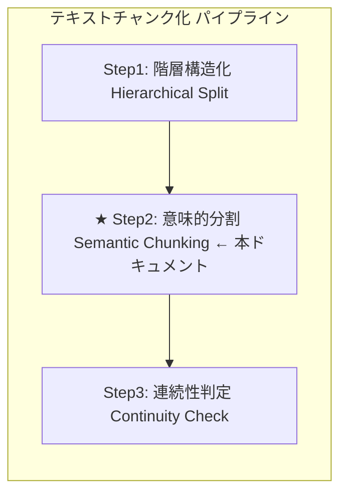
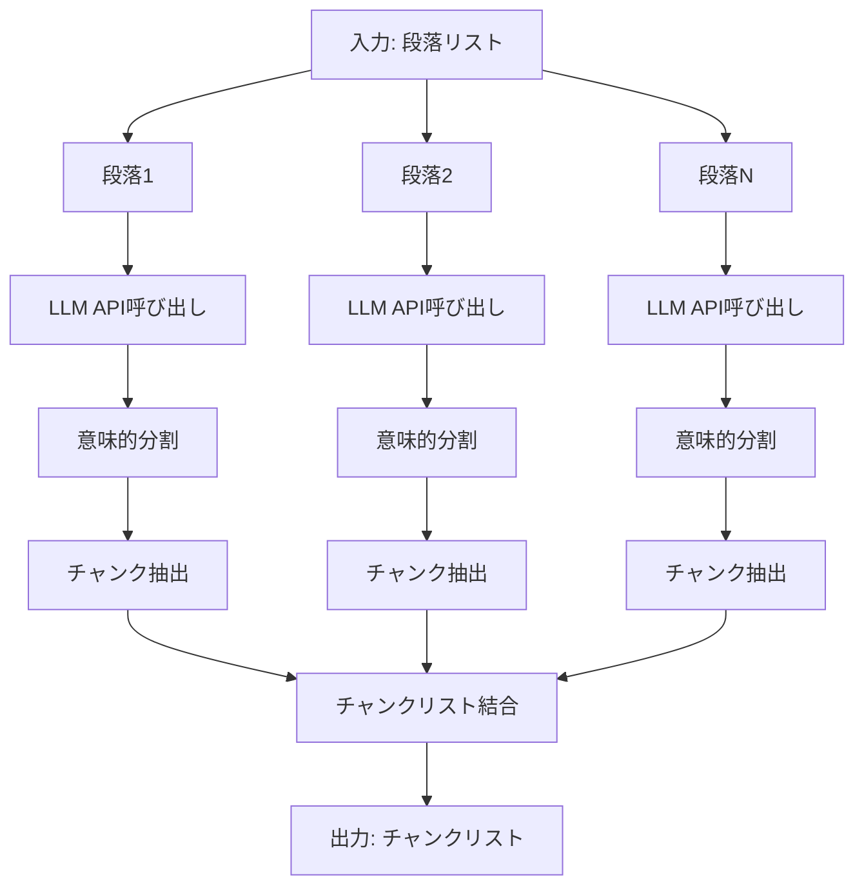

## Step2: 意味的分割（Semantic Chunking）

本番チャンクは、「csv_text_to_chunks_text_csv.py」のコマンドです。
ここでは、上記コマンドの
RAGの[チャンク分割]の4つのステージのStep2（意味的分割）の説明をします。

- Step1（階層構造化）
- Step2（意味的分割）
- Step3（文脈連続性チェック）
- 非同期・並列処理

##### 全ソースは： GitHubにあります。
- URL: https://github.com/nakashima2toshio/gemini_grace_agent

---

## 📋 目次

1. [全体像](#1-全体像)
2. [Step2の方式説明](#2-step2の方式説明)
3. [step2.pyの説明](#3-step2pyの説明)
4. [具体例](#4-具体例)
5. [重要な設計判断](#5-重要な設計判断)

---

## 1. 全体像

### 1.1 3段階処理における Step2 の位置づけ



| ステップ | 処理内容 |
|:--------:|----------|
| Step1 | テキスト → 段落リスト<br>・空行（`\n\n`）のみを分割基準とする<br>・見出しと本文を1つの単位として保持 |
| **Step2** | 段落リスト → チャンクリスト<br>・意味的な類似度に基づいて分割<br>・話題の転換点を検出 |
| Step3 | チャンクリスト → 最終チャンクリスト<br>・隣接チャンク間の連続性を判定<br>・連続している場合は結合 |

### 1.2 データフロー

| 段階 | 内容 |
|:----:|------|
| **入力（Step1の出力: 5段落）** | 段落1: `"RAG（Retrieval-Augmented Generation）は...（定義+利点）"`<br>段落2: `"セマンティックチャンキングは...（用語定義+用語使用）"`<br>段落3: `"京都の紅葉は...沖縄の海は...（京都+沖縄）"`<br>段落4: `"ベクトルデータベースは...（定義+活用）"`<br>段落5: `"第1章 機械学習入門...第2章 深層学習の基礎...（第1章+第2章）"` |
| ↓ | |
| **Step2: 意味的分割** | 1. 各段落をLLMに送信<br>2. 意味的な転換点を検出<br>3. 話題ごとにチャンクを分割<br>4. 結果を結合 |
| ↓ | |
| **出力（10チャンク）** | チャンク1: `"RAG...（定義）"`<br>チャンク2: `"この手法の最大の利点は...（利点）"` ← 前方依存<br>チャンク3: `"セマンティックチャンキングは...（用語定義）"`<br>チャンク4: `"チャンクサイズは...（用語使用）"` ← 後方依存<br>チャンク5: `"京都の紅葉は...（京都観光）"`<br>チャンク6: `"沖縄の海は...（沖縄観光）"` ← 独立<br>チャンク7: `"ベクトルデータベースは...（定義）"`<br>チャンク8: `"ANNの精度と...（活用）"` ← 後方依存<br>チャンク9: `"第1章 機械学習入門...（第1章）"`<br>チャンク10: `"第2章 深層学習の基礎...（第2章）"` ← 章構造 |

### 1.3 処理の流れ図



---

## 2. Step2の方式説明

### 2.1 目的

**意味的な類似度に基づいた分割**を行います。

Step1では物理的な構造（空行による段落分け）で分割しましたが、同じ段落内でも話題が変わることがあります。Step2では、LLMを活用して**話題の転換点**を検出し、意味的なまとまりごとにチャンクを分割します。

### 2.2 Step1との違い

| 項目 | Step1（階層構造化） | Step2（意味的分割） |
|------|-------------------|-------------------|
| 分割基準 | 物理的構造（空行のみ） | 意味的な類似度（話題の転換） |
| 改行の扱い | 空行（`\n\n`）を尊重 | 改行を無視（意味優先） |
| 章の扱い | 空行がなければ分割しない | 章の変わり目で分割 |
| 目的 | 見出しと本文を保持 | 話題の混在を解消 |

### 2.3 アルゴリズム

| ステップ | 処理内容 |
|:--------:|----------|
| 1 | Step1の出力（段落リスト）を入力として受け取る |
| 2 | 各段落をLLM（Gemini API）に送信<br>・JSON形式（`response_mime_type="application/json"`）<br>・Pydanticスキーマ（`response_schema=StructuralResult`） |
| 3 | LLMが以下のロジックで分割:<br>・テキストを文脈に沿って読み進める<br>・隣り合う文同士の「意味的な距離」を分析<br>・意味の類似度が高い → 同じブロックに結合<br>・話題の転換点を検出 → ブロックを分割 |
| 4 | 全段落の結果を結合してチャンクリストを生成 |

### 2.4 LLMへのプロンプト

`chunking/prompts.py` で定義されている `SEMANTIC_CHUNKING_PROMPT`:

```python
SEMANTIC_CHUNKING_PROMPT = """
あなたは「セマンティック・チャンキング（意味的分割）エンジン」です。
入力されたテキストを、形式的な段落や改行ではなく、「意味のまとまり（トピック）」に基づいて再構成してください。

【処理ロジック: 仮想的なベクトル類似度判定】
1. テキストを文脈に沿って読み進め、隣り合う文同士の「意味的な距離」を分析してください。
2. 文の内容が連続している、または高い関連性を持つ場合は、同じブロック（Paragraph）に結合してください。
3. **「話題の転換点」**（意味の類似度がしきい値を下回るような、話題の切り替わり）を見つけたら、そこでブロックを分割してください。

【分割の基準】
- **文字数や物理的な改行（\\n）は無視すること**。
- たとえ改行がなくても、話題が大きく変われば分割する。
- たとえ改行があっても、文脈や意味が続いているなら分割しない。
- **章の変わり目（例: 第1章 → 第2章）は、話題の大きな転換点として扱い、分割すること。**

【出力要件】
- 意味的に凝集したブロックを1つの Paragraph と定義し、その中の文を sentences リストに格納して出力すること。
- 元のテキストを一言一句変更せず保持すること。
"""
```

### 2.5 なぜ Step2 が必要なのか？

Step1だけでは解決できない問題があります：

| 問題 | 具体例 | Step2 の解決策 |
|------|--------|---------------|
| 話題の混在 | 機械学習の説明 → ラーメンの話 → 機械学習に戻る | 話題ごとに分割 |
| 章構造の分割 | 第1章と第2章が同じ段落に | 章の変わり目で分離 |
| 形式的分割の限界 | 改行がなくても話題は変わりうる | 改行を無視して意味で判断 |

### 2.6 意味的分割のイメージ

**【Step1の出力（1つの段落）】**

| 内容 | 備考 |
|------|------|
| 強化学習は、エージェントが環境と相互作用しながら学習する手法です。 | |
| 報酬を最大化するように行動を学習していきます。 | |
| ゲームAIやロボット制御などに応用されています。 | |
| ところで、昨日食べたラーメンが美味しかったです。 | ← 話題転換！ |
| 次回も同じ店に行きたいと思います。 | |
| 話を戻すと、深層強化学習はDeep Learningと強化学習を... | ← 話題復帰 |

↓ **Step2: 意味的分割**

| チャンク | 内容 |
|:--------:|------|
| チャンク1 | 強化学習について<br>「強化学習は、エージェントが環境と相互作用しながら...」 |
| チャンク2 | ラーメンの話（別トピック）<br>「ところで、昨日食べたラーメンが美味しかったです...」 |
| チャンク3 | 深層強化学習について<br>「話を戻すと、深層強化学習はDeep Learningと...」 |

---

## 3. step2.pyの説明

### 3.1 ファイルの目的

`step2.py` は、Step2（意味的分割）の動作を**単体で確認**するためのテストプログラムです。

- **同期処理**で実装（デバッグ・理解しやすい）
- **単体テスト用**（Step2のみを独立して検証）
- Step3との連携を検証するためのテストデータを含む

### 3.2 プログラム構成

```python
# step2.py の構成

# 1. インポート
import os
from google import genai
from google.genai import types
from chunking.models import StructuralResult
from chunking.prompts import SEMANTIC_CHUNKING_PROMPT

# 2. コア関数
def step2_semantic_chunking(paragraphs: list[str], api_key: str) -> list[str]:
    """Step2のコア機能を実装"""
    ...

# 3. メイン処理
def main():
    """テスト実行"""
    ...
```

### 3.3 プログラムの流れ

**step2.py の処理フロー**

| 順序 | 処理 | 詳細 |
|:----:|------|------|
| 1 | APIキー取得 | `api_key = os.getenv("GOOGLE_API_KEY")` |
| ↓ | | |
| 2 | テスト用段落準備 | Step1の出力を想定した5段落のテストデータ<br>各段落は2つのチャンクに分割されることを期待 |
| ↓ | | |
| 3 | 関数呼び出し | `chunks = step2_semantic_chunking(test_paragraphs, api_key)` |
| ↓ | | |
| 4 | 結果表示・検証 | チャンク数の確認（期待: 10チャンク）<br>各チャンクの内容表示<br>検証ポイントの確認 |

### 3.4 コア関数の詳細解説

```python
def step2_semantic_chunking(paragraphs: list[str], api_key: str) -> list[str]:
    """
    段落を意味的なチャンクに分割する（Step2のコア機能）

    Args:
        paragraphs: 段落のリスト（Step1の出力）
        api_key: Gemini API キー

    Returns:
        意味的に分割されたチャンクのリスト
    """
    # ① Gemini APIクライアントを初期化
    client = genai.Client(api_key=api_key)

    print(f"入力: {len(paragraphs)}段落")

    chunks = []

    # ② 各段落を処理
    for i, para in enumerate(paragraphs):
        print(f"段落 {i + 1}/{len(paragraphs)} 処理中...")

        # ③ プロンプト作成（プロンプト + 入力テキスト）
        prompt = f"{SEMANTIC_CHUNKING_PROMPT}\n\n【入力テキスト】\n{para}"

        # ④ Gemini API 呼び出し（同期）
        #    - gemini-2.5-flash: 最新の安定版、高いレート制限
        response = client.models.generate_content(
            model="gemini-2.5-flash",
            contents=prompt,
            config=types.GenerateContentConfig(
                response_mime_type="application/json",  # JSON形式で応答
                response_schema=StructuralResult        # Pydanticスキーマを指定
            )
        )

        # ⑤ レスポンスをパース（JSON → Pydanticオブジェクト）
        result = StructuralResult.model_validate_json(response.text)

        # ⑥ チャンクを抽出してリストに追加
        for chunk_para in result.paragraphs:
            chunks.append(chunk_para.full_text)

        print(f"  → {len(result.paragraphs)}個のチャンクに分割")

    return chunks
```

### 3.5 処理のポイント対応表

| 番号 | 処理 | 説明 |
|:----:|------|------|
| ① | クライアント初期化 | Gemini APIへの接続を確立 |
| ② | ループ処理 | 各段落を順番に処理（Step1との違い: 段落単位） |
| ③ | プロンプト作成 | 意味的分割の指示とテキストを組み合わせ |
| ④ | API呼び出し | LLMに意味的分割を依頼（gemini-2.5-flash使用） |
| ⑤ | JSON解析 | レスポンスをPydanticオブジェクトに変換 |
| ⑥ | チャンク抽出 | 結果からチャンクテキストを取得（1段落→複数チャンクの可能性） |

### 3.6 Step1との処理の違い

| 項目 | Step1 | Step2 |
|------|-------|-------|
| 入力 | テキスト全体 | 段落リスト（Step1の出力） |
| 処理単位 | ブロック（2000文字） | 段落 |
| 出力の変化 | テキスト → 段落（構造化） | 1段落 → 複数チャンク（分割） |
| プロンプト | `PARAGRAPH_SEPARATION_PROMPT` | `SEMANTIC_CHUNKING_PROMPT` |

### 3.7 API呼び出しの詳細

```python
response = client.models.generate_content(
    model="gemini-2.5-flash",           # モデル名
    contents=prompt,                     # プロンプト
    config=types.GenerateContentConfig(
        response_mime_type="application/json",  # JSON形式を指定
        response_schema=StructuralResult        # Pydanticスキーマを指定
    )
)
```

| パラメータ | 値 | 説明 |
|-----------|-----|------|
| `model` | `"gemini-2.5-flash"` | 最新の安定版、高いレート制限 |
| `response_mime_type` | `"application/json"` | JSON形式のレスポンスを要求 |
| `response_schema` | `StructuralResult` | Pydanticモデルでスキーマを指定 |

---

## 4. 具体例

### 4.1 入力（Step1の出力）

Step3で**前方依存・後方依存・独立判定**を検証するためのテストデータです。

```python
test_paragraphs = [
    # 段落1: RAGの説明（前方依存のテスト用）
    """RAG（Retrieval-Augmented Generation）は、検索と生成を組み合わせた手法です。
外部知識ベースから関連情報を取得し、それをLLMのコンテキストとして渡します。
2020年にFacebookが発表し、現在では多くのシステムで採用されています。
この手法の最大の利点は、最新情報を反映できることです。
それにより、LLM単体では対応できない時事的な質問にも回答可能になります。
また、ハルシネーションを軽減する効果も報告されています。""",

    # 段落2: セマンティックチャンキングの説明（後方依存のテスト用）
    """セマンティックチャンキングは、テキストを意味単位で分割する技術です。
「チャンク」とは、分割されたテキストの各ブロックを指します。
「埋め込み」（Embedding）は、テキストを数値ベクトルに変換したものです。
チャンクサイズは検索精度に大きく影響します。
小さすぎると文脈が失われ、埋め込みの品質が低下します。
大きすぎると検索ノイズが増加し、関連性の低い情報が混入します。""",

    # 段落3: 観光情報（独立判定のテスト用）
    """京都の紅葉は11月中旬から下旬が見頃です。
清水寺や嵐山が特に人気のスポットとして知られています。
混雑を避けるなら平日の早朝がおすすめです。
沖縄の海は透明度が高く、シュノーケリングに最適です。
那覇から車で約1時間の恩納村には美しいビーチが点在しています。
夏季は台風に注意が必要ですが、それ以外の季節も温暖で過ごしやすいです。""",

    # 段落4: ベクトルDBの説明（後方依存のテスト用）
    """ベクトルデータベースは、高次元ベクトルを効率的に格納・検索するシステムです。
代表的な製品にPinecone、Weaviate、Chromaなどがあります。
ANN（Approximate Nearest Neighbor）アルゴリズムにより高速な類似検索を実現します。
ANNの精度とスピードはトレードオフの関係にあります。
HNSWやIVFなどのインデックス手法を選択することで、このバランスを調整できます。
ベクトルDBの選定では、スケーラビリティとコストも重要な判断基準となります。""",

    # 段落5: 章構造（章による独立のテスト用）
    """第1章 機械学習入門
機械学習は、データからパターンを学習するアルゴリズムの総称です。
教師あり学習、教師なし学習、強化学習の3つに大別されます。
本章では、これらの基本概念を解説しました。
第2章 深層学習の基礎
深層学習は、多層のニューラルネットワークを用いる機械学習の一手法です。
画像認識や自然言語処理で革命的な成果を上げています。
本章では、CNNとRNNの基本アーキテクチャを説明します。"""
]
```

### 4.2 テストデータの設計意図

| 段落 | 内容 | Step2での分割 | Step3での検証パターン |
|:----:|------|--------------|---------------------|
| 段落1 | RAGの説明 | 定義 / 利点 | **前方依存**（「この手法」「それ」で参照） |
| 段落2 | チャンキング説明 | 用語定義 / 用語使用 | **後方依存**（専門用語が未定義で使用） |
| 段落3 | 観光情報 | 京都 / 沖縄 | **独立判定**（同じ話題だが単独で理解可能） |
| 段落4 | ベクトルDB説明 | 定義 / 活用 | **後方依存**（ANNが未定義で使用） |
| 段落5 | 章構造 | 第1章 / 第2章 | **章構造**（章が変わり独立） |

### 4.3 Step2の処理例（段落1の場合）

**【入力: 段落1（RAGの説明）】**

| 文 | 備考 |
|----|------|
| RAG（Retrieval-Augmented Generation）は、検索と生成を組み合わせた手法です。 | 定義 |
| 外部知識ベースから関連情報を取得し、それをLLMのコンテキストとして渡します。 | 定義 |
| 2020年にFacebookが発表し、現在では多くのシステムで採用されています。 | 定義 |
| この手法の最大の利点は、最新情報を反映できることです。 | ← **話題転換（利点へ）** |
| それにより、LLM単体では対応できない時事的な質問にも回答可能になります。 | 利点 |
| また、ハルシネーションを軽減する効果も報告されています。 | 利点 |

↓ **Step2 処理（意味的分割）**

**【LLMのJSON出力】**
```json
{
  "paragraphs": [
    {
      "id": 0,
      "sentences": [
        {"text": "RAG（Retrieval-Augmented Generation）は、検索と生成を組み合わせた手法です。"},
        {"text": "外部知識ベースから関連情報を取得し、それをLLMのコンテキストとして渡します。"},
        {"text": "2020年にFacebookが発表し、現在では多くのシステムで採用されています。"}
      ]
    },
    {
      "id": 1,
      "sentences": [
        {"text": "この手法の最大の利点は、最新情報を反映できることです。"},
        {"text": "それにより、LLM単体では対応できない時事的な質問にも回答可能になります。"},
        {"text": "また、ハルシネーションを軽減する効果も報告されています。"}
      ]
    }
  ]
}
```

**【Step2の出力（段落1から生成されたチャンク）】**

| チャンク | 内容 |
|:--------:|------|
| チャンク1 | **RAGの定義**<br>`"RAG（Retrieval-Augmented Generation）は、検索と生成を組み合わせた手法です。`<br>`外部知識ベースから関連情報を取得し...`<br>`2020年にFacebookが発表し、現在では多くのシステムで採用..."` |
| チャンク2 | **RAGの利点（前方依存：「この手法」「それ」で参照）**<br>`"この手法の最大の利点は、最新情報を反映できることです。`<br>`それにより、LLM単体では対応できない時事的な質問にも...`<br>`また、ハルシネーションを軽減する効果も報告されています。"` |

### 4.4 全体の入出力

**【入力】5段落**

| 段落 | 内容 |
|:----:|------|
| 段落1 | RAGの説明（定義+利点） |
| 段落2 | チャンキング説明（用語定義+用語使用） |
| 段落3 | 観光情報（京都+沖縄） |
| 段落4 | ベクトルDB説明（定義+活用） |
| 段落5 | 章構造（第1章+第2章） |

↓ **Step2 処理**

**【出力】10チャンク（各段落が2つに分割）**

| チャンク | 内容 | 元の段落 |
|:--------:|------|:--------:|
| チャンク1 | RAGの定義 | 段落1 |
| チャンク2 | RAGの利点（前方依存） | 段落1 |
| チャンク3 | 用語定義 | 段落2 |
| チャンク4 | 用語使用（後方依存） | 段落2 |
| チャンク5 | 京都観光 | 段落3 |
| チャンク6 | 沖縄観光（独立） | 段落3 |
| チャンク7 | ベクトルDB定義 | 段落4 |
| チャンク8 | ベクトルDB活用（後方依存） | 段落4 |
| チャンク9 | 第1章 機械学習入門 | 段落5 |
| チャンク10 | 第2章 深層学習の基礎（章構造） | 段落5 |

### 4.5 検証ポイント

step2.py を実行した際に確認すべきポイント：

| チェック項目 | 期待結果 |
|-------------|---------|
| チャンク数 | 5段落 → 10チャンクに分割 |
| 意味的凝集 | 同じトピックの文が同じチャンクに |
| 話題転換の検出 | 各段落が意味的な境界で2つに分割 |
| 章の分割 | 第1章と第2章が別チャンクに |
| テキストの保持 | 省略や要約なく、原文が保持される |

### 4.6 Step3との連携（テストデータの流れ）

**【Step1】1テキスト → 5段落**

| 段落 | 内容 |
|:----:|------|
| 段落1 | RAGの説明（定義+利点） |
| 段落2 | セマンティックチャンキングの説明（用語定義+用語使用） |
| 段落3 | 観光情報（京都+沖縄） |
| 段落4 | ベクトルDBの説明（定義+活用） |
| 段落5 | 章構造（第1章+第2章） |

**【Step2】5段落 → 10チャンク**

| 入力 | 出力 |
|------|------|
| 段落1 | チャンク1（RAG定義）+ チャンク2（RAG利点） |
| 段落2 | チャンク3（用語定義）+ チャンク4（用語使用） |
| 段落3 | チャンク5（京都観光）+ チャンク6（沖縄観光） |
| 段落4 | チャンク7（ベクトルDB定義）+ チャンク8（活用） |
| 段落5 | チャンク9（第1章）+ チャンク10（第2章） |

**【Step3】10チャンク → 7チャンク**

| 処理 | 結果 | 理由 |
|------|------|------|
| チャンク1+2 | 結合 | 前方依存 |
| チャンク3+4 | 結合 | 後方依存 |
| チャンク5 | 独立 | |
| チャンク6 | 独立 | |
| チャンク7+8 | 結合 | 後方依存 |
| チャンク9 | 独立 | |
| チャンク10 | 独立 | |

#### Step3での判定詳細

| ペア | 判定 | 理由 |
|------|------|------|
| チャンク1→2 | **結合（True）** | 「この手法」「それ」が前のチャンクを参照（前方依存） |
| チャンク2→3 | 分離（False） | 話題転換（RAG → チャンキング） |
| チャンク3→4 | **結合（True）** | 「チャンク」「埋め込み」が未定義のまま使用（後方依存） |
| チャンク4→5 | 分離（False） | 話題転換（チャンキング → 京都観光） |
| チャンク5→6 | 分離（False） | 話題は「観光」だが、単独で完全に理解可能（独立） |
| チャンク6→7 | 分離（False） | 話題転換（沖縄観光 → ベクトルDB） |
| チャンク7→8 | **結合（True）** | 「ANN」「ベクトルDB」を説明なしで使用（後方依存） |
| チャンク8→9 | 分離（False） | 話題転換（ベクトルDB → 機械学習） |
| チャンク9→10 | 分離（False） | 章が変わり、単独で理解可能（章構造）|

---

## 5. 重要な設計判断

### 5.1 なぜStep2で章を分割するのか？

| 方式 | Step1での処理 | Step2での処理 | 結果 |
|------|--------------|--------------|------|
| ✅ 採用方式 | 空行がなければ第1章と第2章を同じ段落に | 章の変わり目で分割 | 章構造を正しく認識 |
| ❌ 代替案 | 章の変わり目で分割 | なし | Step2で章の文脈を失う |

**理由**: Step1で空行のみで分割し、章の判断をStep2に委ねることで、章構造の情報を保持したまま意味的な分割が可能になります。

### 5.2 1段落が複数チャンクになる理由

Step2では、1つの段落が複数のチャンクに分割される可能性があります：

| ケース | 例 | 結果 |
|--------|-----|------|
| 話題の転換 | RAGの定義 → RAGの利点 | 2チャンクに分割 |
| 章の変わり目 | 第1章 → 第2章 | 2チャンクに分割 |
| 単一トピック | 京都観光のみ | 1チャンクのまま |

### 5.3 Step1との役割分担

| 処理 | Step1 | Step2 |
|------|-------|-------|
| 空行での分割 | ✅ 実施 | - |
| 章での分割 | ❌ 実施しない | ✅ 実施 |
| 話題での分割 | ❌ 実施しない | ✅ 実施 |
| 見出しの保持 | ✅ 本文と一緒に保持 | ✅ チャンク内に保持 |

---

## まとめ

### Step2 の役割

| 項目 | 内容 |
|------|------|
| 入力 | 段落リスト（Step1の出力） |
| 出力 | チャンクリスト（数が増える可能性） |
| 目的 | 意味的な類似度に基づいた分割 |
| 方式 | LLM（Gemini API）による話題転換検出 |

### 重要なポイント

1. **意味優先**: 物理的な改行ではなく、意味的なまとまりで分割
2. **話題転換の検出**: 定義→利点、用語定義→用語使用 などの転換点を認識
3. **章構造の分割**: 第1章→第2章 のような章の変わり目で分割
4. **チャンク数の増加**: 1段落が複数チャンクに分割される可能性
5. **テキストの完全保持**: 省略や要約は行わない

### 次のステップ

Step2 の出力（チャンクリスト）は、**Step3（連続性判定）** の入力として使用されます。
Step3 では、隣接するチャンク間の連続性を判定し、以下のパターンで結合/分離を行います：

| パターン | 説明 | 例 |
|----------|------|-----|
| **前方依存** | 「この」「それ」等の指示語で前を参照 → 結合 | チャンク2の「この手法」「それ」 |
| **後方依存** | 専門用語が未定義のまま使用 → 結合 | チャンク4の「チャンク」「埋め込み」 |
| **独立判定** | 話題は同じでも単独で理解可能 → 分離 | チャンク5（京都）とチャンク6（沖縄） |
| **章構造** | 章が変わった場合 → 分離 | チャンク9（第1章）とチャンク10（第2章）|
