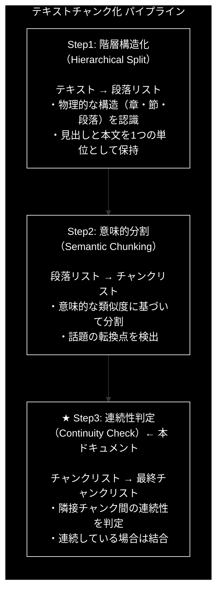
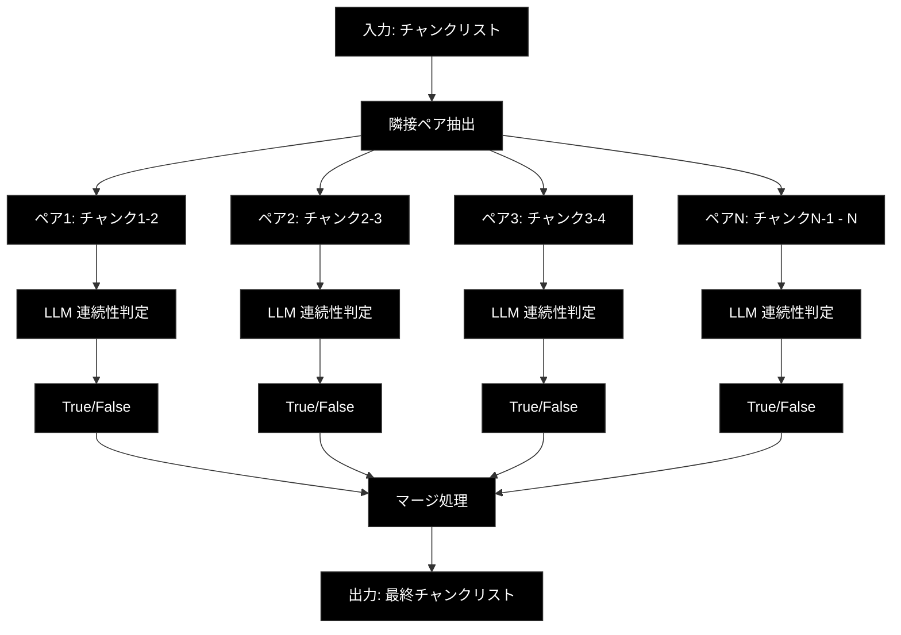

# Step3: 連続性判定（Continuity Check）

**バージョン:** v2.0.0
**対象ファイル:** `chunking/csv_text_to_chunks_text_csv.py`
**確認用プログラム:** `chunking/check_function/check_step3.py`

---

## 📋 目次

1. [全体像](#1-全体像)
2. [Step3の方式説明](#2-step3の方式説明)
3. [check_step3.pyの説明](#3-check_step3pyの説明)
4. [具体例](#4-具体例)
5. [csv_text_to_chunks_text_csv.pyでの実装](#5-csv_text_to_chunks_text_csvpyでの実装)

---

## 1. 全体像

### 1.1 3段階処理における Step3 の位置づけ



### 1.2 データフロー

```
【入力: Step2の出力（チャンクリスト）】
[
  "チャンク1: 機械学習の基礎",
  "チャンク2: 機械学習の応用",    ← チャンク1と連続
  "チャンク3: ラーメンの話",      ← チャンク2と非連続
  "チャンク4: ラーメン店の情報",  ← チャンク3と連続
  "チャンク5: 深層学習"           ← チャンク4と非連続
]
        │
        ▼
┌───────────────────────────────────────┐
│          Step3: 連続性判定            │
│                                       │
│  1. 隣接ペアごとに連続性を判定        │
│  2. 連続 → 結合 / 非連続 → 分離       │
│  3. 最終チャンクリストを生成          │
└───────────────────────────────────────┘
        │
        ▼
【出力: 最終チャンクリスト】
[
  "チャンク1+2: 機械学習（基礎+応用）",  ← 結合された
  "チャンク3+4: ラーメン（話+店情報）",  ← 結合された
  "チャンク5: 深層学習"                  ← 単独
]
```

### 1.3 処理の流れ図



---

## 2. Step3の方式説明

### 2.1 目的

**隣接チャンク間の文脈連続性を判定し、適切に結合/分離**します。

Step2で意味的に分割されたチャンクの中には、本来1つにまとまるべきものが分かれてしまっている場合があります。Step3では、LLMを活用して隣接するチャンク間の連続性を判定し、同じトピックであれば結合します。

### 2.2 Step2との違い

| 項目 | Step2（意味的分割） | Step3（連続性判定） |
|------|-------------------|-------------------|
| 処理方向 | 分割（1→多） | 結合（多→少） |
| 判定対象 | 段落内の文同士 | チャンク間のペア |
| 出力の変化 | チャンク数が増加 | チャンク数が減少 |
| 目的 | 話題の分離 | 過分割の修正 |

### 2.3 アルゴリズム

```
1. Step2の出力（チャンクリスト）を入力として受け取る

2. 隣接するチャンクのペアを作成
   - チャンク数がN個の場合、N-1個のペアを作成
   - 例: [A, B, C, D] → [(A,B), (B,C), (C,D)]

3. 各ペアをLLM（Gemini API）に送信して連続性を判定
   ┌────────────────────────────────────────────────┐
   │ 【判定基準】                                    │
   │                                                │
   │ True（連続 → 結合）:                           │
   │   - 文脈が連続している                         │
   │   - 同じトピックの説明が続いている             │
   │   - 前の文の情報を知らないと次の文が理解困難   │
   │                                                │
   │ False（非連続 → 分離）:                        │
   │   - 章が変わった                               │
   │   - 全く別の話題に切り替わった                 │
   │   - 前の文が完結し、新しいセクションが開始     │
   └────────────────────────────────────────────────┘

4. 判定結果に基づいてマージ処理
   - True: 前のチャンクに結合
   - False: 新しいチャンクとして追加

5. 最終チャンクリストを生成
```

### 2.4 LLMへのプロンプト

`chunking/prompts.py` で定義されている `CONTINUITY_CHECK_PROMPT`:

```python
CONTINUITY_CHECK_PROMPT = """
あなたは「文脈判定エンジン」です。
提示された「前のテキスト(Prev)」と「次のテキスト(Next)」を読み、
これらが**「一つの連続した話題（トピック）」**としてつながっているかを判定してください。

【判定基準】
- **False (切断すべき)**:
    - 章が変わった（例：「第1章」から「第2章」へ）。
    - 全く別の話題、製品、カテゴリの話に切り替わった。
    - 前の文が「完結」しており、次の文から新しいセクションが始まっている。
- **True (接続すべき)**:
    - 文脈が連続しており、前の文の情報を知らないと次の文が理解しにくい。
    - 同じトピックの説明が続いている。

判定結果（is_connected）のみをJSONで返してください。
"""
```

### 2.5 レスポンススキーマ（Pydanticモデル）

`chunking/models.py` で定義（Step3専用）:

```python
class ContinuityResult(BaseModel):
    """文脈連続性判定の結果"""
    is_connected: bool = Field(
        description="前のテキストと次のテキストが、意味的に連続している（同じトピックである）場合はTrue、話題が転換している場合はFalse"
    )
```

**注意:** Step1, Step2では `StructuralResult` を使用しましたが、Step3では `ContinuityResult`（ブール値のみ）を使用します。

### 2.6 なぜ Step3 が必要なのか？

Step2だけでは発生しうる問題：

| 問題 | 具体例 | Step3 の解決策 |
|------|--------|---------------|
| 過分割 | 同じトピックが細切れに | 連続したチャンクを結合 |
| 文脈の欠落 | 代名詞の参照先が別チャンクに | 参照元と結合して文脈を保持 |
| 細かすぎるチャンク | 1-2文のチャンクが大量発生 | 関連するチャンクを統合 |

### 2.7 マージ処理のロジック

```
【入力】5チャンク
[チャンク1, チャンク2, チャンク3, チャンク4, チャンク5]

【連続性判定結果】
ペア1 (1-2): True  → 結合
ペア2 (2-3): False → 分離
ペア3 (3-4): True  → 結合
ペア4 (4-5): False → 分離

【マージ処理】
初期: final_chunks = [チャンク1]

ペア1 True:  final_chunks[-1] += チャンク2  → [チャンク1+2]
ペア2 False: final_chunks.append(チャンク3) → [チャンク1+2, チャンク3]
ペア3 True:  final_chunks[-1] += チャンク4  → [チャンク1+2, チャンク3+4]
ペア4 False: final_chunks.append(チャンク5) → [チャンク1+2, チャンク3+4, チャンク5]

【出力】3チャンク
[チャンク1+2, チャンク3+4, チャンク5]
```

---

## 3. check_step3.pyの説明

### 3.1 ファイルの目的

`check_step3.py` は、Step3（連続性判定）の動作を単体で確認するためのテストプログラムです。

### 3.2 プログラム構成

```python
# check_step3.py の構成

# 1. インポート
import os
from google import genai
from google.genai import types
from chunking.models import ContinuityResult  # ← Step3専用モデル
from chunking.prompts import CONTINUITY_CHECK_PROMPT

# 2. コア関数
def step3_continuity_check(chunks: list[str], api_key: str) -> list[str]:
    """Step3のコア機能を実装"""
    ...

# 3. メイン処理
def main():
    """テスト実行"""
    ...
```

### 3.3 プログラムの流れ

```
┌──────────────────────────────────────────────────────────────┐
│                    check_step3.py の処理フロー                │
└──────────────────────────────────────────────────────────────┘
                              │
                              ▼
┌──────────────────────────────────────────────────────────────┐
│ 1. APIキー取得                                                │
│    api_key = os.getenv("GOOGLE_API_KEY")                     │
└──────────────────────────────────────────────────────────────┘
                              │
                              ▼
┌──────────────────────────────────────────────────────────────┐
│ 2. テスト用チャンク準備（Step2の出力を想定）                   │
│    test_chunks = [                                           │
│        "機械学習の基礎...",                                   │
│        "機械学習の応用...",   ← 連続                         │
│        "ラーメンの話...",     ← 非連続                       │
│        "ラーメン店の情報...", ← 連続                         │
│        "深層学習..."          ← 非連続                       │
│    ]                                                         │
└──────────────────────────────────────────────────────────────┘
                              │
                              ▼
┌──────────────────────────────────────────────────────────────┐
│ 3. step3_continuity_check() 呼び出し                         │
│    final_chunks = step3_continuity_check(test_chunks, api_key)│
└──────────────────────────────────────────────────────────────┘
                              │
                              ▼
┌──────────────────────────────────────────────────────────────┐
│ 4. 結果表示・検証                                             │
│    - チャンク数の確認（入力より減少するはず）                 │
│    - 各チャンクの内容表示                                     │
│    - 検証ポイントの確認                                       │
└──────────────────────────────────────────────────────────────┘
```

### 3.4 コア関数の詳細解説

```python
def step3_continuity_check(chunks: list[str], api_key: str) -> list[str]:
    """
    隣接チャンク間の連続性をチェックし結合/分離する（Step3のコア機能）

    Args:
        chunks: チャンクのリスト（Step2の出力）
        api_key: Gemini API キー

    Returns:
        連続性に基づいて結合/分離された最終チャンクリスト
    """
    # ① Gemini APIクライアントを初期化
    client = genai.Client(api_key=api_key)

    print(f"入力: {len(chunks)}チャンク")

    # ② チャンクが1つ以下なら判定不要
    if len(chunks) <= 1:
        print("チャンクが1つ以下のため、そのまま返します")
        return chunks

    # ③ 隣接ペアの連続性を判定
    continuity_flags = []

    for i in range(len(chunks) - 1):
        print(f"ペア {i + 1}/{len(chunks) - 1} 判定中...")

        # ④ プロンプト作成（前のテキスト + 次のテキスト）
        prompt = f"{CONTINUITY_CHECK_PROMPT}\n\n【前のテキスト】\n{chunks[i]}\n\n【次のテキスト】\n{chunks[i + 1]}"

        # ⑤ Gemini API 呼び出し（同期）
        response = client.models.generate_content(
            model="gemini-2.0-flash-exp",
            contents=prompt,
            config=types.GenerateContentConfig(
                response_mime_type="application/json",
                response_schema=ContinuityResult  # ← ブール値のみ
            )
        )

        # ⑥ レスポンスをパース
        result = ContinuityResult.model_validate_json(response.text)
        continuity_flags.append(result.is_connected)

        status = "連続 → 結合" if result.is_connected else "非連続 → 分離"
        print(f"  → {status}")

    # ⑦ マージ処理
    print()
    print("マージ処理...")
    final_chunks = [chunks[0]]  # 最初のチャンクで初期化

    for i, is_connected in enumerate(continuity_flags):
        if is_connected:
            # ⑧ 結合: 前のチャンクに追加
            final_chunks[-1] += "\n\n" + chunks[i + 1]
            print(f"  チャンク{i} + チャンク{i + 1} → 結合")
        else:
            # ⑨ 分離: 新しいチャンクとして追加
            final_chunks.append(chunks[i + 1])
            print(f"  チャンク{i + 1} → 新規追加")

    return final_chunks
```

### 3.5 処理のポイント対応表

| 行番号 | 処理 | 説明 |
|--------|------|------|
| ① | クライアント初期化 | Gemini APIへの接続を確立 |
| ② | 早期リターン | チャンク数が1以下なら判定不要 |
| ③ | ペアループ | N個のチャンク → N-1回の判定 |
| ④ | プロンプト作成 | 「前のテキスト」「次のテキスト」を含める |
| ⑤ | API呼び出し | LLMに連続性判定を依頼 |
| ⑥ | 結果取得 | True/False のブール値を取得 |
| ⑦ | マージ処理開始 | 最初のチャンクで初期化 |
| ⑧ | 結合処理 | `is_connected=True` → 前のチャンクに追加 |
| ⑨ | 分離処理 | `is_connected=False` → 新規チャンクとして追加 |

### 3.6 Step1, Step2との処理の違い

| 項目 | Step1 | Step2 | Step3 |
|------|-------|-------|-------|
| 入力 | テキスト全体 | 段落リスト | チャンクリスト |
| 処理単位 | ブロック | 段落 | 隣接ペア |
| レスポンススキーマ | StructuralResult | StructuralResult | ContinuityResult |
| 出力の変化 | 構造化 | 分割（増加） | 結合（減少） |

---

## 4. 具体例

### 4.1 入力（Step2の出力）

```python
test_chunks = [
    # チャンク1: 機械学習の基礎
    """機械学習は、データからパターンを学習する技術です。
教師あり学習、教師なし学習、強化学習の3つに大別されます。
これらの手法は様々な分野で応用されています。""",

    # チャンク2: 機械学習の応用（チャンク1と連続）
    """機械学習の応用例としては、画像認識や自然言語処理があります。
特に深層学習の登場により、精度が飛躍的に向上しました。
医療診断や自動運転などの分野でも活用されています。""",

    # チャンク3: ラーメンの話（話題転換 → 非連続）
    """ところで、昨日食べたラーメンが非常に美味しかったです。
醤油ベースのスープに、細麺が絶妙にマッチしていました。
チャーシューも柔らかく、また行きたいと思います。""",

    # チャンク4: ラーメン店の情報（チャンク3と連続）
    """そのラーメン店は駅から徒歩5分の場所にあります。
営業時間は11時から22時までで、定休日は水曜日です。
次回は友人を誘って行こうと考えています。""",

    # チャンク5: 深層学習（話題転換 → 非連続）
    """深層学習は、多層のニューラルネットワークを用いる手法です。
畳み込みニューラルネットワーク（CNN）やリカレントニューラルネットワーク（RNN）が代表的です。
大量のデータと計算資源が必要ですが、高い性能を発揮します。"""
]
```

### 4.2 期待される判定

```
ペア1 (機械学習基礎 vs 機械学習応用): True  → 結合
ペア2 (機械学習応用 vs ラーメン):     False → 分離
ペア3 (ラーメン vs ラーメン店):       True  → 結合
ペア4 (ラーメン店 vs 深層学習):       False → 分離
```

### 4.3 Step3の処理

```
【入力】5チャンク
┌─────────────────────────────────────────────────────────────────┐
│ チャンク1: 機械学習の基礎                                        │
│ チャンク2: 機械学習の応用                                        │
│ チャンク3: ラーメンの話                                          │
│ チャンク4: ラーメン店の情報                                      │
│ チャンク5: 深層学習                                              │
└─────────────────────────────────────────────────────────────────┘
                              │
                              ▼
                    ┌─────────────────┐
                    │  Step3 処理     │
                    │  (連続性判定)   │
                    └─────────────────┘
                              │
                              ▼
【連続性判定】
┌─────────────────────────────────────────────────────────────────┐
│ ペア1: チャンク1 ←→ チャンク2                                    │
│   判定: True（同じ機械学習のトピック）                           │
│   処理: 結合                                                     │
├─────────────────────────────────────────────────────────────────┤
│ ペア2: チャンク2 ←→ チャンク3                                    │
│   判定: False（機械学習 → ラーメン、話題転換）                   │
│   処理: 分離                                                     │
├─────────────────────────────────────────────────────────────────┤
│ ペア3: チャンク3 ←→ チャンク4                                    │
│   判定: True（同じラーメンのトピック）                           │
│   処理: 結合                                                     │
├─────────────────────────────────────────────────────────────────┤
│ ペア4: チャンク4 ←→ チャンク5                                    │
│   判定: False（ラーメン → 深層学習、話題転換）                   │
│   処理: 分離                                                     │
└─────────────────────────────────────────────────────────────────┘
                              │
                              ▼
【マージ処理】
┌─────────────────────────────────────────────────────────────────┐
│ 初期状態: [チャンク1]                                            │
│                                                                 │
│ ペア1 True:  [チャンク1] + チャンク2 → [チャンク1+2]             │
│ ペア2 False: [チャンク1+2] + [チャンク3] → [チャンク1+2, チャンク3]│
│ ペア3 True:  [チャンク1+2, チャンク3+4]                          │
│ ペア4 False: [チャンク1+2, チャンク3+4, チャンク5]               │
└─────────────────────────────────────────────────────────────────┘
                              │
                              ▼
【出力】3チャンク
┌─────────────────────────────────────────────────────────────────┐
│ 最終チャンク1: 機械学習（基礎 + 応用）                           │
│ "機械学習は、データからパターンを学習する技術です。              │
│  教師あり学習、教師なし学習、強化学習の3つに大別されます。       │
│  これらの手法は様々な分野で応用されています。                    │
│                                                                 │
│  機械学習の応用例としては、画像認識や自然言語処理があります。    │
│  特に深層学習の登場により、精度が飛躍的に向上しました。          │
│  医療診断や自動運転などの分野でも活用されています。"             │
├─────────────────────────────────────────────────────────────────┤
│ 最終チャンク2: ラーメン（話 + 店情報）                           │
│ "ところで、昨日食べたラーメンが非常に美味しかったです。          │
│  醤油ベースのスープに、細麺が絶妙にマッチしていました。          │
│  チャーシューも柔らかく、また行きたいと思います。                │
│                                                                 │
│  そのラーメン店は駅から徒歩5分の場所にあります。                 │
│  営業時間は11時から22時までで、定休日は水曜日です。              │
│  次回は友人を誘って行こうと考えています。"                       │
├─────────────────────────────────────────────────────────────────┤
│ 最終チャンク3: 深層学習                                          │
│ "深層学習は、多層のニューラルネットワークを用いる手法です。      │
│  畳み込みニューラルネットワーク（CNN）やリカレントニューラル     │
│  ネットワーク（RNN）が代表的です。                               │
│  大量のデータと計算資源が必要ですが、高い性能を発揮します。"     │
└─────────────────────────────────────────────────────────────────┘
```

### 4.4 検証ポイント

check_step3.py を実行した際に確認すべきポイント：

| チェック項目 | 期待結果 |
|-------------|---------|
| 同トピックの結合 | 機械学習(基礎+応用)、ラーメン(話+店)が結合 |
| 話題転換での分離 | 機械学習/ラーメン、ラーメン/深層学習で分離 |
| テキストの保持 | 結合時に `\n\n` で連結、内容は保持 |
| チャンク数の減少 | 5チャンク → 3チャンク |

---

## 5. csv_text_to_chunks_text_csv.pyでの実装

### 5.1 関数の位置づけ

```
csv_text_to_chunks_text_csv.py
│
├── main()                              # エントリーポイント
│   └── chunks_all_async()              # メイン処理
│       │
│       ├── _step1_hierarchical_split() # Step1 実装
│       ├── _step2_semantic_chunking()  # Step2 実装
│       └── _step3_continuity_check()   # ★ Step3 実装
│
└── その他のユーティリティ関数
```

### 5.2 _step3_continuity_check() の実装

**ファイル:** `csv_text_to_chunks_text_csv.py`
**行番号:** 493-547

```python
async def _step3_continuity_check(
        chunks: List[str],
        client: AsyncAPIClient,
        model: str,
        checkpoint_manager: CheckpointManager
) -> List[str]:
    """Step 3: 文脈連続性チェック"""

    # ① チェックポイント確認（再開時はスキップ）
    if checkpoint_manager.exists("step3"):
        logger.info("Step3: チェックポイントから再開")
        return checkpoint_manager.load("step3")

    logger.info("\n[Step 3/3] 文脈連続性チェック")
    logger.info(f"  入力: {len(chunks)} チャンク")

    # ② チャンクが1つ以下なら判定不要
    if len(chunks) <= 1:
        checkpoint_manager.save("step3", chunks)
        return chunks

    # ③ 各ペアのタスクを作成（非同期）
    tasks = []
    for i in range(len(chunks) - 1):
        prompt = f"{CONTINUITY_CHECK_PROMPT}\n\n【前のテキスト】\n{chunks[i]}\n\n【次のテキスト】\n{chunks[i + 1]}"
        task = client.generate_content(
            model=model,
            contents=prompt,
            response_schema=ContinuityResult,
            task_id=f"step3_pair_{i}"
        )
        tasks.append(task)

    # ④ 並列実行（tqdm で進捗表示）
    results = await async_tqdm.gather(
        *tasks,
        desc="Step3: 連続性チェック",
        total=len(tasks)
    )

    # ⑤ マージ処理（※ここは逐次処理）
    final_chunks = [chunks[0]]
    for i, result_json in enumerate(results):
        if result_json:
            try:
                result = ContinuityResult.model_validate_json(result_json)
                if result.is_connected:
                    # ⑥ 結合
                    final_chunks[-1] += "\n\n" + chunks[i + 1]
                else:
                    # ⑦ 分離
                    final_chunks.append(chunks[i + 1])
            except Exception as e:
                logger.warning(f"パース失敗: {e}")
                final_chunks.append(chunks[i + 1])
        else:
            # ⑧ API失敗時は分離（安全側に倒す）
            final_chunks.append(chunks[i + 1])

    logger.info(f"  出力: {len(final_chunks)} チャンク（マージ後）")

    # ⑨ チェックポイント保存
    checkpoint_manager.save("step3", final_chunks)

    return final_chunks
```

### 5.3 check_step3.py との対比

| 機能 | check_step3.py | csv_text_to_chunks_text_csv.py |
|------|----------------|-------------------------------|
| 処理方式 | 同期（逐次処理） | 非同期（並列処理） |
| API呼び出し | `client.models.generate_content()` | `client.generate_content()` (AsyncAPIClient) |
| エラー処理 | 基本的 | try-except + フォールバック |
| チェックポイント | なし | あり（途中再開可能） |
| 進捗表示 | print文 | tqdm.asyncio |

### 5.4 並列処理と逐次処理の使い分け

```python
# 【並列処理】連続性判定（API呼び出し）
# → 各ペアの判定は独立しているため並列実行可能
tasks = []
for i in range(len(chunks) - 1):
    task = client.generate_content(...)
    tasks.append(task)

results = await async_tqdm.gather(*tasks)  # 全ペアを並列判定

# 【逐次処理】マージ処理
# → 前の結果に依存するため逐次実行が必要
final_chunks = [chunks[0]]
for i, result_json in enumerate(results):
    if result.is_connected:
        final_chunks[-1] += "\n\n" + chunks[i + 1]  # 前のチャンクに依存
    else:
        final_chunks.append(chunks[i + 1])
```

**ポイント:**
- API呼び出し（判定）は並列実行 → 高速化
- マージ処理は逐次実行 → 正確な結合順序を保証

### 5.5 呼び出しフロー

```
chunks_all_async()
│
├── 1. Step1 呼び出し
│       step1_chunks = await _step1_hierarchical_split(...)
│       # 出力: ["段落1", "段落2", "段落3"]
│
├── 2. Step2 呼び出し
│       step2_chunks = await _step2_semantic_chunking(...)
│       # 出力: ["チャンク1", "チャンク2", "チャンク3", "チャンク4", "チャンク5"]
│
└── 3. Step3 呼び出し（Step2の出力を入力として使用）
        final_chunks = await _step3_continuity_check(
            step2_chunks,  # ← Step2の出力
            client, model, checkpoint_manager
        )
        │
        ├── チェックポイント確認
        ├── 早期リターン判定（チャンク数≤1）
        ├── タスク作成（ペアごと）
        ├── 並列実行（await gather）← API呼び出しは並列
        ├── マージ処理 ← 結果の適用は逐次
        └── チェックポイント保存

        # 出力: ["チャンク1+2", "チャンク3+4", "チャンク5"]
        #       （チャンク数が減少）
```

### 5.6 データ量の変化（3段階全体）

```
Step1: テキスト → 段落リスト
       10,000文字 → 5段落

Step2: 段落リスト → チャンクリスト
       5段落 → 8チャンク（話題混在の段落が分割される）

Step3: チャンクリスト → 最終チャンクリスト
       8チャンク → 5チャンク（連続したチャンクが結合される）
       ↓
       最終出力として CSV に保存
```

### 5.7 エラー時のフォールバック

```python
for i, result_json in enumerate(results):
    if result_json:
        try:
            result = ContinuityResult.model_validate_json(result_json)
            # 正常処理
        except Exception as e:
            logger.warning(f"パース失敗: {e}")
            final_chunks.append(chunks[i + 1])  # 分離（安全側）
    else:
        # API失敗時も分離（安全側に倒す）
        final_chunks.append(chunks[i + 1])
```

**設計思想:**
- API失敗やパースエラー時は「分離」を選択
- 不適切な結合よりも、過分割のほうが安全
- 過分割は情報の欠落にならないが、不適切な結合は文脈を壊す可能性

---

## まとめ

### Step3 の役割

| 項目 | 内容 |
|------|------|
| 入力 | チャンクリスト（Step2の出力） |
| 出力 | 最終チャンクリスト（数が減少） |
| 目的 | 隣接チャンク間の連続性を判定し結合 |
| 方式 | LLM（Gemini API）による連続性判定 |

### 重要なポイント

1. **ペア単位の判定**: 隣接する2つのチャンクを比較
2. **True/Falseの二値判定**: 結合か分離かを明確に決定
3. **マージ処理は逐次**: 前の結果に依存するため並列化不可
4. **エラー時は分離**: 安全側に倒す設計

### 3段階処理の全体像

```
【Step1】テキスト → 段落（構造化）
    ↓
【Step2】段落 → チャンク（分割・増加）
    ↓
【Step3】チャンク → 最終チャンク（結合・減少）
    ↓
【CSV出力】改行正規化 → 保存
```

### 各Stepの特徴比較

| Step | 入力 | 出力 | 変化 | スキーマ |
|------|------|------|------|---------|
| Step1 | テキスト | 段落リスト | 構造化 | StructuralResult |
| Step2 | 段落リスト | チャンクリスト | 増加 | StructuralResult |
| Step3 | チャンクリスト | 最終チャンク | 減少 | ContinuityResult |
