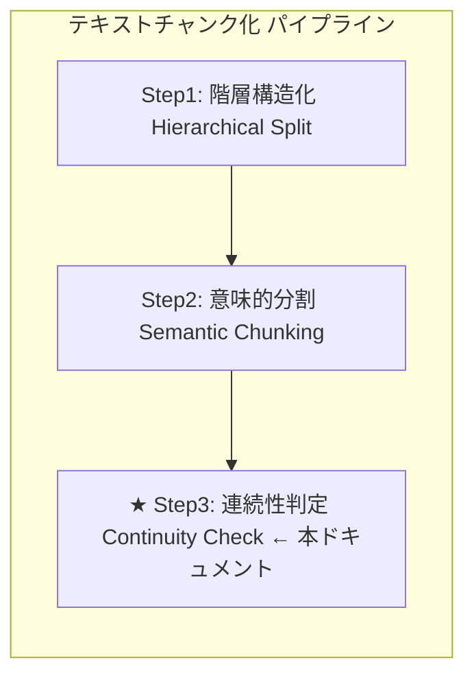
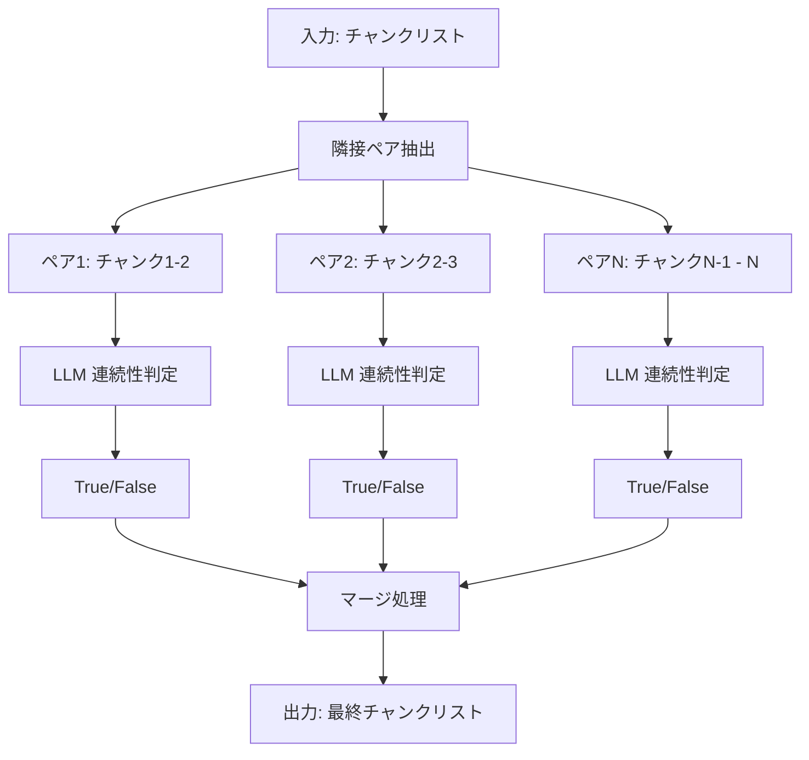

# Step3: 連続性判定（Continuity Check）

**バージョン:** v3.1.0
**対象ファイル:** `chunking/step3.py`（同期版・単体テスト用）
**共通モジュール:** `chunking/models.py`, `chunking/prompts.py`

---

## 📋 目次

1. [全体像](#1-全体像)
2. [Step3の方式説明](#2-step3の方式説明)
3. [step3.pyの説明](#3-step3pyの説明)
4. [具体例](#4-具体例)
5. [重要な設計判断](#5-重要な設計判断)

---

## 1. 全体像

### 1.1 3段階処理における Step3 の位置づけ



| ステップ | 処理内容 |
|:--------:|----------|
| Step1 | テキスト → 段落リスト<br>・空行（`\n\n`）のみを分割基準とする<br>・見出しと本文を1つの単位として保持 |
| Step2 | 段落リスト → チャンクリスト<br>・意味的な類似度に基づいて分割<br>・話題の転換点を検出 |
| **Step3** | チャンクリスト → 最終チャンクリスト<br>・隣接チャンク間の連続性を判定<br>・連続している場合は結合 |

### 1.2 データフロー

| 段階 | 内容 |
|:----:|------|
| **入力（Step2の出力: 10チャンク）** | チャンク1: RAGの定義<br>チャンク2: RAGの利点 ← 前方依存（結合）<br>チャンク3: 用語定義<br>チャンク4: 用語使用 ← 後方依存（結合）<br>チャンク5: 京都観光<br>チャンク6: 沖縄観光 ← 独立（分離）<br>チャンク7: ベクトルDB定義<br>チャンク8: ベクトルDB活用 ← 後方依存（結合）<br>チャンク9: 第1章 機械学習入門<br>チャンク10: 第2章 深層学習の基礎 ← 章構造（分離） |
| ↓ | |
| **Step3: 連続性判定** | 1. 隣接ペアごとに連続性を判定<br>2. 連続 → 結合 / 非連続 → 分離<br>3. 最終チャンクリストを生成 |
| ↓ | |
| **出力（7チャンク）** | 最終1: RAG（定義+利点）← 前方依存で結合<br>最終2: チャンキング（定義+使用）← 後方依存で結合<br>最終3: 京都観光 ← 独立<br>最終4: 沖縄観光 ← 独立<br>最終5: ベクトルDB（定義+活用）← 後方依存で結合<br>最終6: 第1章 機械学習入門 ← 独立<br>最終7: 第2章 深層学習の基礎 ← 独立 |

### 1.3 処理の流れ図



---

## 2. Step3の方式説明

### 2.1 目的

**隣接チャンク間の文脈連続性を判定し、適切に結合/分離**します。

Step2で意味的に分割されたチャンクの中には、本来1つにまとまるべきものが分かれてしまっている場合があります。Step3では、LLMを活用して隣接するチャンク間の連続性を判定し、連続している場合は結合します。

### 2.2 Step2との違い

| 項目 | Step2（意味的分割） | Step3（連続性判定） |
|------|-------------------|-------------------|
| 処理方向 | 分割（1→多） | 結合（多→少） |
| 判定対象 | 段落内の文同士 | チャンク間のペア |
| 出力の変化 | チャンク数が増加 | チャンク数が減少 |
| 目的 | 話題の分離 | 過分割の修正 |

### 2.3 アルゴリズム

| ステップ | 処理内容 |
|:--------:|----------|
| 1 | Step2の出力（チャンクリスト）を入力として受け取る |
| 2 | 隣接するチャンクのペアを作成<br>・チャンク数がN個の場合、N-1個のペアを作成<br>・例: [A, B, C, D] → [(A,B), (B,C), (C,D)] |
| 3 | 各ペアをLLM（Gemini API）に送信して連続性を判定 |
| 4 | 判定結果に基づいてマージ処理<br>・True: 前のチャンクに結合<br>・False: 新しいチャンクとして追加 |
| 5 | 最終チャンクリストを生成 |

### 2.4 判定基準

| 判定 | 条件 | 具体例 |
|:----:|------|--------|
| **True（結合）** | 前方依存: 指示語（「この」「それ」等）で前のチャンクを参照 | 「**この手法**の最大の利点は...」 |
| **True（結合）** | 後方依存: 専門用語が未定義のまま使用され、単独では意味が不完全 | 「**チャンク**サイズは...」（チャンクの定義なし） |
| **True（結合）** | 同じトピックの説明が続いている | 定義→活用の流れ |
| **False（分離）** | 章が変わった（例：「第1章」→「第2章」） | 章構造による独立 |
| **False（分離）** | 全く別の話題に切り替わった | RAG → 京都観光 |
| **False（分離）** | 話題は同じでも単独で完全に理解可能（独立判定） | 京都観光と沖縄観光 |

### 2.5 LLMへのプロンプト

`chunking/prompts.py` で定義されている `CONTINUITY_CHECK_PROMPT`:

```python
CONTINUITY_CHECK_PROMPT = """
あなたは「文脈判定エンジン」です。
提示された「前のテキスト(Prev)」と「次のテキスト(Next)」を読み、
これらが**「一つの連続した話題（トピック）」**としてつながっているかを判定してください。

【判定基準】
- **True (接続すべき)**:
    - 文脈が連続しており、前の文の情報を知らないと次の文が理解しにくい。
    - 同じトピックの説明が続いている。
    - **次のテキスト(Next)が、前のテキスト(Prev)で定義された概念・用語・文脈を前提としている。**
    - **次のテキスト(Next)を単独で読んだ場合、意味が不完全または曖昧になる。**

- **False (切断すべき)**:
    - 章が変わった（例：「第1章」から「第2章」へ）。
    - 全く別の話題、製品、カテゴリの話に切り替わった。
    - 前の文が「完結」しており、次の文から新しいセクションが始まっている。
    - **次のテキスト(Next)が、前のテキスト(Prev)なしでも完全に理解できる。**

判定結果（is_connected）のみをJSONで返してください。
"""
```

### 2.6 レスポンススキーマ（Pydanticモデル）

`chunking/models.py` で定義（Step3専用）:

```python
class ContinuityResult(BaseModel):
    is_connected: bool = Field(
        description=(
            "前のテキスト(Prev)と次のテキスト(Next)が一つの連続した話題としてつながっている場合はTrue。"
            "Nextを単独で読んだ場合に意味が不完全・曖昧になる場合もTrue。"
            "話題が転換し、NextがPrevなしでも完全に理解できる場合はFalse。"
        )
    )
```

**注意:** Step1, Step2では `StructuralResult` を使用しましたが、Step3では `ContinuityResult`（ブール値のみ）を使用します。

### 2.7 なぜ Step3 が必要なのか？

Step2だけでは発生しうる問題：

| 問題 | 具体例 | Step3 の解決策 |
|------|--------|---------------|
| 前方依存の分断 | 「この手法」「それ」の参照先が別チャンクに | 参照元と結合して文脈を保持 |
| 後方依存の分断 | 専門用語の定義が別チャンクに | 定義と使用を結合 |
| 過分割 | 同じトピックが細切れに | 連続したチャンクを結合 |

### 2.8 検証パターン

Step3で検証すべき4つのパターン：

| パターン | 説明 | 判定 | 例 |
|----------|------|:----:|-----|
| **前方依存** | 「この」「それ」等の指示語で前を参照 | 結合（True） | 「この手法の利点は...」 |
| **後方依存** | 専門用語が未定義のまま使用される | 結合（True） | 「チャンクサイズは...」（チャンクの定義なし） |
| **独立判定** | 話題は同じでも単独で理解可能 | 分離（False） | 京都観光と沖縄観光 |
| **章構造** | 章が変わった場合 | 分離（False） | 第1章 → 第2章 |

### 2.9 マージ処理のロジック

**【入力】10チャンク → 【出力】7チャンク**

| ペア | 判定 | 理由 | 処理 |
|------|:----:|------|------|
| 1→2 | True | 前方依存 | 結合 |
| 2→3 | False | 話題転換 | 分離 |
| 3→4 | True | 後方依存 | 結合 |
| 4→5 | False | 話題転換 | 分離 |
| 5→6 | False | 独立 | 分離 |
| 6→7 | False | 話題転換 | 分離 |
| 7→8 | True | 後方依存 | 結合 |
| 8→9 | False | 話題転換 | 分離 |
| 9→10 | False | 章構造 | 分離 |

**マージ処理の流れ:**

| ステップ | 判定 | final_chunks の状態 |
|:--------:|:----:|---------------------|
| 初期 | - | `[チャンク1]` |
| ペア1→2 | True | `[チャンク1+2]` |
| ペア2→3 | False | `[チャンク1+2, チャンク3]` |
| ペア3→4 | True | `[チャンク1+2, チャンク3+4]` |
| ペア4→5 | False | `[チャンク1+2, チャンク3+4, チャンク5]` |
| ペア5→6 | False | `[..., チャンク5, チャンク6]` |
| ペア6→7 | False | `[..., チャンク6, チャンク7]` |
| ペア7→8 | True | `[..., チャンク7+8]` |
| ペア8→9 | False | `[..., チャンク7+8, チャンク9]` |
| ペア9→10 | False | `[..., チャンク9, チャンク10]` |

---

## 3. step3.pyの説明

### 3.1 ファイルの目的

`step3.py` は、Step3（連続性判定）の動作を**単体で確認**するためのテストプログラムです。

- **同期処理**で実装（デバッグ・理解しやすい）
- **単体テスト用**（Step3のみを独立して検証）
- 前方依存・後方依存・独立判定・章構造の4パターンを検証

### 3.2 プログラム構成

```python
# step3.py の構成

# 1. インポート
import os
from google import genai
from google.genai import types
from chunking.models import ContinuityResult  # ← Step3専用モデル
from chunking.prompts import CONTINUITY_CHECK_PROMPT

# 2. コア関数
def step3_continuity_check(chunks: list[str], api_key: str) -> list[str]:
    """Step3のコア機能を実装"""
    ...

# 3. メイン処理
def main():
    """テスト実行"""
    ...
```

### 3.3 プログラムの流れ

**step3.py の処理フロー**

| 順序 | 処理 | 詳細 |
|:----:|------|------|
| 1 | APIキー取得 | `api_key = os.getenv("GOOGLE_API_KEY")` |
| ↓ | | |
| 2 | テスト用チャンク準備 | Step2の出力を想定した10チャンクのテストデータ<br>前方依存・後方依存・独立・章構造の各パターンを含む |
| ↓ | | |
| 3 | 関数呼び出し | `final_chunks = step3_continuity_check(test_chunks, api_key)` |
| ↓ | | |
| 4 | 結果表示・検証 | チャンク数の確認（期待: 7チャンク）<br>各チャンクの内容表示<br>検証ポイントの確認 |

### 3.4 コア関数の詳細解説

```python
def step3_continuity_check(chunks: list[str], api_key: str) -> list[str]:
    """
    隣接チャンク間の連続性をチェックし結合/分離する（Step3のコア機能）

    Args:
        chunks: チャンクのリスト（Step2の出力）
        api_key: Gemini API キー

    Returns:
        連続性に基づいて結合/分離された最終チャンクリスト
    """
    # ① Gemini APIクライアントを初期化
    client = genai.Client(api_key=api_key)

    print(f"入力: {len(chunks)}チャンク")

    # ② チャンクが1つ以下なら判定不要
    if len(chunks) <= 1:
        print("チャンクが1つ以下のため、そのまま返します")
        return chunks

    # ③ 隣接ペアの連続性を判定
    continuity_flags = []

    for i in range(len(chunks) - 1):
        print(f"ペア {i + 1}/{len(chunks) - 1} 判定中...")

        # ④ プロンプト作成（前のテキスト + 次のテキスト）
        prompt = f"{CONTINUITY_CHECK_PROMPT}\n\n【前のテキスト】\n{chunks[i]}\n\n【次のテキスト】\n{chunks[i + 1]}"

        # ⑤ Gemini API 呼び出し（同期）
        #    - gemini-2.5-flash: 最新の安定版、高いレート制限
        response = client.models.generate_content(
            model="gemini-2.5-flash",
            contents=prompt,
            config=types.GenerateContentConfig(
                response_mime_type="application/json",
                response_schema=ContinuityResult  # ← ブール値のみ
            )
        )

        # ⑥ レスポンスをパース
        result = ContinuityResult.model_validate_json(response.text)
        continuity_flags.append(result.is_connected)

        status = "連続 → 結合" if result.is_connected else "非連続 → 分離"
        print(f"  → {status}")

    # ⑦ マージ処理
    print()
    print("マージ処理...")
    final_chunks = [chunks[0]]  # 最初のチャンクで初期化

    for i, is_connected in enumerate(continuity_flags):
        if is_connected:
            # ⑧ 結合: 前のチャンクに追加
            final_chunks[-1] += "\n\n" + chunks[i + 1]
            print(f"  チャンク{i} + チャンク{i + 1} → 結合")
        else:
            # ⑨ 分離: 新しいチャンクとして追加
            final_chunks.append(chunks[i + 1])
            print(f"  チャンク{i + 1} → 新規追加")

    return final_chunks
```

### 3.5 処理のポイント対応表

| 番号 | 処理 | 説明 |
|:----:|------|------|
| ① | クライアント初期化 | Gemini APIへの接続を確立 |
| ② | 早期リターン | チャンク数が1以下なら判定不要 |
| ③ | ペアループ | N個のチャンク → N-1回の判定 |
| ④ | プロンプト作成 | 「前のテキスト」「次のテキスト」を含める |
| ⑤ | API呼び出し | LLMに連続性判定を依頼（gemini-2.5-flash使用） |
| ⑥ | 結果取得 | True/False のブール値を取得 |
| ⑦ | マージ処理開始 | 最初のチャンクで初期化 |
| ⑧ | 結合処理 | `is_connected=True` → 前のチャンクに追加 |
| ⑨ | 分離処理 | `is_connected=False` → 新規チャンクとして追加 |

### 3.6 Step1, Step2との処理の違い

| 項目 | Step1 | Step2 | Step3 |
|------|-------|-------|-------|
| 入力 | テキスト全体 | 段落リスト | チャンクリスト |
| 処理単位 | ブロック（2000文字） | 段落 | 隣接ペア |
| レスポンススキーマ | StructuralResult | StructuralResult | ContinuityResult |
| 出力の変化 | 構造化 | 分割（増加） | 結合（減少） |

### 3.7 API呼び出しの詳細

```python
response = client.models.generate_content(
    model="gemini-2.5-flash",           # モデル名
    contents=prompt,                     # プロンプト
    config=types.GenerateContentConfig(
        response_mime_type="application/json",  # JSON形式を指定
        response_schema=ContinuityResult        # Pydanticスキーマを指定
    )
)
```

| パラメータ | 値 | 説明 |
|-----------|-----|------|
| `model` | `"gemini-2.5-flash"` | 最新の安定版、高いレート制限とパフォーマンス |
| `response_mime_type` | `"application/json"` | JSON形式のレスポンスを要求 |
| `response_schema` | `ContinuityResult` | ブール値のみを返すPydanticモデル |

---

## 4. 具体例

### 4.1 入力（Step2の出力）

Step3で**前方依存・後方依存・独立判定・章構造**を検証するためのテストデータです。

```python
test_chunks = [
    # パターン1: 前方依存（明示的参照）
    # チャンク1: RAGの定義
    """RAG（Retrieval-Augmented Generation）は、検索と生成を組み合わせた手法です。
外部知識ベースから関連情報を取得し、それをLLMのコンテキストとして渡します。
2020年にFacebookが発表し、現在では多くのシステムで採用されています。""",

    # チャンク2: 前方依存あり（「この手法」「それ」で前を参照）→ 結合すべき
    """この手法の最大の利点は、最新情報を反映できることです。
それにより、LLM単体では対応できない時事的な質問にも回答可能になります。
また、ハルシネーションを軽減する効果も報告されています。""",

    # パターン2: 後方依存（暗黙の前提知識）
    # チャンク3: 用語定義を含む
    """セマンティックチャンキングは、テキストを意味単位で分割する技術です。
「チャンク」とは、分割されたテキストの各ブロックを指します。
「埋め込み」（Embedding）は、テキストを数値ベクトルに変換したものです。""",

    # チャンク4: 後方依存あり（「チャンク」「埋め込み」を定義なしで使用）→ 結合すべき
    """チャンクサイズは検索精度に大きく影響します。
小さすぎると文脈が失われ、埋め込みの品質が低下します。
大きすぎると検索ノイズが増加し、関連性の低い情報が混入します。""",

    # パターン3: 完全独立（話題転換）
    # チャンク5: 完全に異なる話題 → 分離すべき
    """京都の紅葉は11月中旬から下旬が見頃です。
清水寺や嵐山が特に人気のスポットとして知られています。
混雑を避けるなら平日の早朝がおすすめです。""",

    # パターン4: 話題は同じだが独立して理解可能
    # チャンク6: 別の観光地（話題は「観光」だが独立）→ 分離すべき
    """沖縄の海は透明度が高く、シュノーケリングに最適です。
那覇から車で約1時間の恩納村には美しいビーチが点在しています。
夏季は台風に注意が必要ですが、それ以外の季節も温暖で過ごしやすいです。""",

    # パターン5: 後方依存（専門用語の連鎖）
    # チャンク7: 専門用語の定義
    """ベクトルデータベースは、高次元ベクトルを効率的に格納・検索するシステムです。
代表的な製品にPinecone、Weaviate、Chromaなどがあります。
ANN（Approximate Nearest Neighbor）アルゴリズムにより高速な類似検索を実現します。""",

    # チャンク8: 後方依存あり（ANN、ベクトルDBを前提として使用）→ 結合すべき
    """ANNの精度とスピードはトレードオフの関係にあります。
HNSWやIVFなどのインデックス手法を選択することで、このバランスを調整できます。
ベクトルDBの選定では、スケーラビリティとコストも重要な判断基準となります。""",

    # パターン6: 章構造による独立
    # チャンク9: 第1章（完結）
    """第1章 機械学習入門
機械学習は、データからパターンを学習するアルゴリズムの総称です。
教師あり学習、教師なし学習、強化学習の3つに大別されます。
本章では、これらの基本概念を解説しました。""",

    # チャンク10: 第2章（独立して理解可能）→ 分離すべき
    """第2章 深層学習の基礎
深層学習は、多層のニューラルネットワークを用いる機械学習の一手法です。
画像認識や自然言語処理で革命的な成果を上げています。
本章では、CNNとRNNの基本アーキテクチャを説明します。"""
]
```

### 4.2 テストデータの設計意図

| チャンク | 内容 | 判定パターン | 期待される判定 |
|:--------:|------|--------------|:-------------:|
| チャンク1 | RAGの定義 | - | - |
| チャンク2 | RAGの利点 | **前方依存** | 結合（True） |
| チャンク3 | 用語定義 | 話題転換 | 分離（False） |
| チャンク4 | 用語使用 | **後方依存** | 結合（True） |
| チャンク5 | 京都観光 | 話題転換 | 分離（False） |
| チャンク6 | 沖縄観光 | **独立判定** | 分離（False） |
| チャンク7 | ベクトルDB定義 | 話題転換 | 分離（False） |
| チャンク8 | ベクトルDB活用 | **後方依存** | 結合（True） |
| チャンク9 | 第1章 機械学習 | 話題転換 | 分離（False） |
| チャンク10 | 第2章 深層学習 | **章構造** | 分離（False） |

### 4.3 期待される判定

| ペア | 判定 | 理由 |
|------|:----:|------|
| 1→2 | **True** | 前方依存: 「この手法」「それ」が前のチャンクを参照 |
| 2→3 | False | 話題転換: RAG → チャンキング |
| 3→4 | **True** | 後方依存: 「チャンク」「埋め込み」が未定義のまま使用 |
| 4→5 | False | 話題転換: チャンキング → 京都観光 |
| 5→6 | False | 独立: 話題は「観光」だが、単独で完全に理解可能 |
| 6→7 | False | 話題転換: 沖縄観光 → ベクトルDB |
| 7→8 | **True** | 後方依存: 「ANN」「ベクトルDB」を説明なしで使用 |
| 8→9 | False | 話題転換: ベクトルDB → 機械学習 |
| 9→10 | False | 章構造: 第1章 → 第2章、章が変わり単独で理解可能 |

### 4.4 Step3の処理

**【入力】10チャンク**

| チャンク | 内容 | 備考 |
|:--------:|------|------|
| 1 | RAGの定義 | |
| 2 | RAGの利点 | 前方依存 |
| 3 | 用語定義 | |
| 4 | 用語使用 | 後方依存 |
| 5 | 京都観光 | |
| 6 | 沖縄観光 | 独立 |
| 7 | ベクトルDB定義 | |
| 8 | ベクトルDB活用 | 後方依存 |
| 9 | 第1章 機械学習入門 | |
| 10 | 第2章 深層学習の基礎 | 章構造 |

↓ **Step3 処理（連続性判定）**

**【連続性判定】**

| ペア | 判定 | 理由 | 処理 |
|------|:----:|------|:----:|
| 1→2 | True | 前方依存:「この手法」「それ」 | 結合 |
| 2→3 | False | 話題転換: RAG → チャンキング | 分離 |
| 3→4 | True | 後方依存:「チャンク」「埋め込み」未定義 | 結合 |
| 4→5 | False | 話題転換: チャンキング → 京都観光 | 分離 |
| 5→6 | False | 独立: 同じ「観光」だが単独で理解可能 | 分離 |
| 6→7 | False | 話題転換: 沖縄観光 → ベクトルDB | 分離 |
| 7→8 | True | 後方依存:「ANN」「ベクトルDB」未定義 | 結合 |
| 8→9 | False | 話題転換: ベクトルDB → 機械学習 | 分離 |
| 9→10 | False | 章構造: 第1章 → 第2章 | 分離 |

**【出力】7チャンク**

| 最終チャンク | 内容 | 構成 |
|:------------:|------|------|
| 1 | RAG（定義 + 利点） | チャンク1+2を結合 |
| 2 | チャンキング（用語定義 + 用語使用） | チャンク3+4を結合 |
| 3 | 京都観光（独立） | チャンク5のみ |
| 4 | 沖縄観光（独立） | チャンク6のみ |
| 5 | ベクトルDB（定義 + 活用） | チャンク7+8を結合 |
| 6 | 第1章 機械学習入門（独立） | チャンク9のみ |
| 7 | 第2章 深層学習の基礎（独立） | チャンク10のみ |

### 4.5 検証ポイント

step3.py を実行した際に確認すべきポイント：

| チェック項目 | 期待結果 |
|-------------|---------|
| チャンク数 | 10チャンク → 7チャンクに結合 |
| 前方依存の結合 | チャンク1+2が結合（「この手法」「それ」で参照） |
| 後方依存の結合 | チャンク3+4、チャンク7+8が結合（専門用語の依存） |
| 独立判定 | チャンク5、チャンク6が分離（同じ「観光」でも独立） |
| 章構造の分離 | チャンク9、チャンク10が分離（章が変わり独立） |
| テキストの保持 | 結合時に `\n\n` で連結、内容は保持 |

### 4.6 Step1・Step2との連携（テストデータの流れ）

**【Step1】1テキスト → 5段落**

| 段落 | 内容 |
|:----:|------|
| 段落1 | RAGの説明（定義+利点） |
| 段落2 | セマンティックチャンキングの説明（用語定義+用語使用） |
| 段落3 | 観光情報（京都+沖縄） |
| 段落4 | ベクトルDBの説明（定義+活用） |
| 段落5 | 章構造（第1章+第2章） |

**【Step2】5段落 → 10チャンク**

| 入力 | 出力 |
|------|------|
| 段落1 | チャンク1（RAG定義）+ チャンク2（RAG利点） |
| 段落2 | チャンク3（用語定義）+ チャンク4（用語使用） |
| 段落3 | チャンク5（京都観光）+ チャンク6（沖縄観光） |
| 段落4 | チャンク7（ベクトルDB定義）+ チャンク8（活用） |
| 段落5 | チャンク9（第1章）+ チャンク10（第2章） |

**【Step3】10チャンク → 7チャンク**

| 処理 | 結果 | 理由 |
|------|------|------|
| チャンク1+2 | 結合 | 前方依存 |
| チャンク3+4 | 結合 | 後方依存 |
| チャンク5 | 独立 | |
| チャンク6 | 独立 | |
| チャンク7+8 | 結合 | 後方依存 |
| チャンク9 | 独立 | |
| チャンク10 | 独立 | |

---

## 5. 重要な設計判断

### 5.1 なぜ結合時に `\n\n` で連結するのか？

```python
if is_connected:
    final_chunks[-1] += "\n\n" + chunks[i + 1]  # 空行で連結
```

| 連結方法 | 結果 | 問題点 |
|----------|------|--------|
| 空文字結合 `""` | `"文1。文2。"` | 段落の境界が消える |
| 改行結合 `"\n"` | `"文1。\n文2。"` | 段落の区切りが不明確 |
| 空行結合 `"\n\n"` | `"文1。\n\n文2。"` | ✅ 段落構造が保持される |

### 5.2 エラー時のフォールバック設計

**設計思想:** API失敗やパースエラー時は「分離」を選択

| 状況 | 処理 | 理由 |
|------|------|------|
| API成功 | 判定結果に従う | 正常処理 |
| パースエラー | 分離（False扱い） | 安全側に倒す |
| API失敗 | 分離（False扱い） | 安全側に倒す |

**理由:**
- 不適切な結合は文脈を壊す可能性がある
- 過分割は情報の欠落にならない
- エラー時は安全な選択（分離）を優先

### 5.3 各Stepの特徴比較

| Step | 入力 | 出力 | 変化 | スキーマ |
|:----:|------|------|:----:|---------|
| Step1 | テキスト | 段落リスト | 構造化 | StructuralResult |
| Step2 | 段落リスト | チャンクリスト | 増加 | StructuralResult |
| Step3 | チャンクリスト | 最終チャンク | 減少 | ContinuityResult |

### 5.4 並列処理と逐次処理の使い分け

| 処理 | 方式 | 理由 |
|------|:----:|------|
| API呼び出し（判定） | 並列 | 各ペアの判定は独立 |
| マージ処理 | 逐次 | 前の結果に依存 |

---

## まとめ

### Step3 の役割

| 項目 | 内容 |
|------|------|
| 入力 | チャンクリスト（Step2の出力） |
| 出力 | 最終チャンクリスト（数が減少） |
| 目的 | 隣接チャンク間の連続性を判定し結合 |
| 方式 | LLM（Gemini API）による連続性判定 |

### 重要なポイント

1. **ペア単位の判定**: 隣接する2つのチャンクを比較
2. **True/Falseの二値判定**: 結合か分離かを明確に決定
3. **マージ処理は逐次**: 前の結果に依存するため並列化不可
4. **エラー時は分離**: 安全側に倒す設計

### 検証パターン

| パターン | 説明 | 判定 | 例 |
|----------|------|:----:|-----|
| **前方依存** | 「この」「それ」等の指示語で前を参照 | 結合（True） | 「この手法の利点は...」 |
| **後方依存** | 専門用語が未定義のまま使用される | 結合（True） | 「チャンクサイズは...」 |
| **独立判定** | 話題は同じでも単独で理解可能 | 分離（False） | 京都観光と沖縄観光 |
| **章構造** | 章が変わった場合 | 分離（False） | 第1章 → 第2章 |

### 3段階処理の全体像

| ステップ | 処理 | データ量の変化 |
|:--------:|------|:--------------:|
| Step1 | テキスト → 段落（構造化） | 1テキスト → 5段落 |
| Step2 | 段落 → チャンク（分割・増加） | 5段落 → 10チャンク |
| Step3 | チャンク → 最終チャンク（結合・減少） | 10チャンク → 7チャンク |
