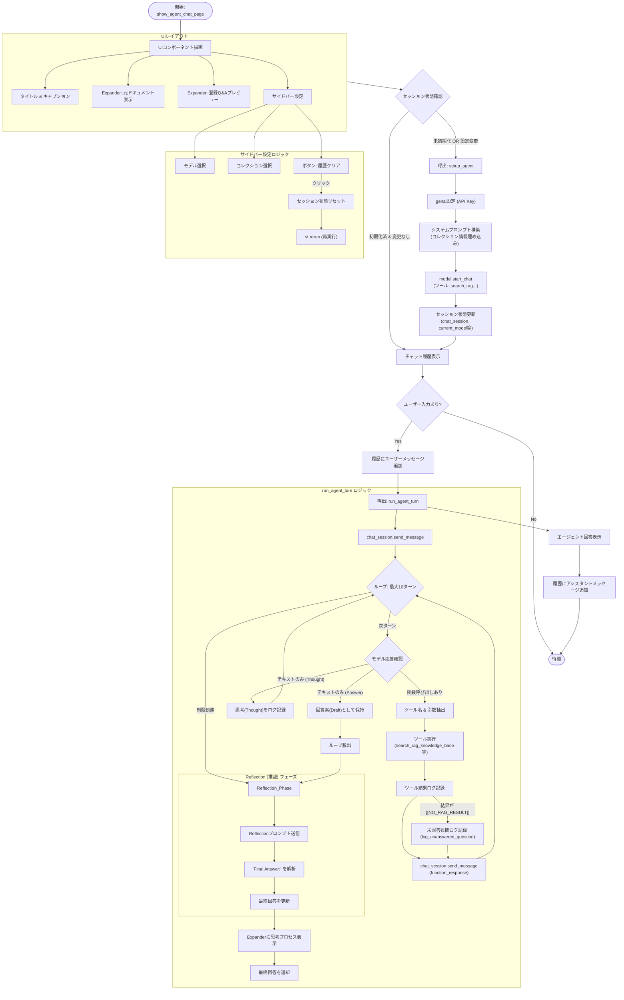

# `ui/pages/agent_chat_page.py` 処理フロー

このドキュメントは、Streamlitアプリケーションの「エージェントチャット (Agent Chat)」ページの制御フローを概説します。

## 概要

このページでは、Gemini ReActエージェントを初期化し、チャットセッションの状態を管理し、ユーザー入力、エージェントの推論（思考/行動）、ツール実行（RAG検索）、およびReflection（推敲）ステップを含む最終回答生成の対話ループを処理します。

## フローチャート (Mermaid)



## 関数の詳細ロジック

### 1. `setup_agent(selected_collections, model_name)`
*   **目的:** Gemini `ChatSession` を初期化します。
*   **入力:** コレクション名のリスト、モデル名。
*   **処理:** 
    *   APIキーを取得します。
    *   利用可能なコレクション名を埋め込んだ `SYSTEM_INSTRUCTION_TEMPLATE` を構築します。
    *   ツール（`search_rag_knowledge_base`, `list_rag_collections`）を指定して `GenerativeModel` を初期化します。
    *   チャットセッションを開始します（`start_chat`）。

### 2. `run_agent_turn(chat_session, user_input)`
*   **目的:** マルチターンの ReAct ループと Reflection（推敲）を管理します。
*   **ReAct ループ:**
    *   ユーザー入力をモデルに送信します。
    *   ツール呼び出しを処理するために最大10回反復します。
    *   **ツール呼び出しの場合:** ツール（Qdrant検索など）を実行し、結果（失敗時は `log_unanswered_question` によるログ記録を含む）を記録し、結果をモデルに返します。
    *   **テキストの場合:** ログ記録用に「Thought（思考）」をキャプチャします。ツール呼び出しがない場合、そのテキストを **回答案 (Draft Answer)** として扱います。
*   **Reflection (推敲) フェーズ:**
    *   回答案を取得します。
    *   正確性とスタイルを評価するために `REFLECTION_INSTRUCTION` をモデルに送信します。
    *   出力から `Final Answer:` を解析します。
*   **出力:** 推敲された回答文字列を返します。

### 3. `show_agent_chat_page()`
*   **目的:** メインの Streamlit 描画関数です。
*   **コンポーネント:**
    *   **サイドバー:** QdrantコレクションとLLMモデルの選択、セッションリセットを処理します。
    *   **ドキュメントビューア:** `OUTPUT/` ディレクトリからファイルを読み込み、元のテキストデータを表示します。
    *   **Q&A プレビュー:** `Qdrant` コレクションをスクロールして、RAGで使用されるQ&Aペアのサンプルを表示します。
    *   **チャットインターフェース:** 標準的な Streamlit チャットインターフェース（`st.chat_message`, `st.chat_input`）。

```