# agent_chat_page.py 詳細設計図

## 1. モジュール概要

| 項目 | 内容 |
|------|------|
| ファイル名 | `ui/pages/agent_chat_page.py` |
| 目的 | Gemini 2.0 Flash を使用した ReAct 型エージェントとの対話インターフェース |
| 主要機能 | Qdrant 上のナレッジベースを動的に選択し、RAG 検索を行いながら回答 |
| 使用技術 | Streamlit, Google Generative AI, Qdrant, ReAct パターン |

---

## 2. 重要な定数一覧

| 定数名 | 型 | 役割・概要 |
|--------|-----|-----------|
| `SYSTEM_INSTRUCTION_TEMPLATE` | `str` | エージェントのシステムプロンプトテンプレート。ReActプロセス（Thought/Action/Observation）の出力フォーマット、行動指針（Router Guidelines）、コレクション選択ヒント、再試行戦略を定義 |
| `REFLECTION_INSTRUCTION` | `str` | Reflection（自己評価・修正）フェーズ用のプロンプト。正確性・適切性・スタイルのチェックリストと出力フォーマットを定義 |
| `TOOLS_MAP` | `Dict[str, Callable]` | ツール名と実際の関数のマッピング辞書。`search_rag_knowledge_base` と `list_rag_collections` を登録 |

### 2.1 SYSTEM_INSTRUCTION_TEMPLATE の構成

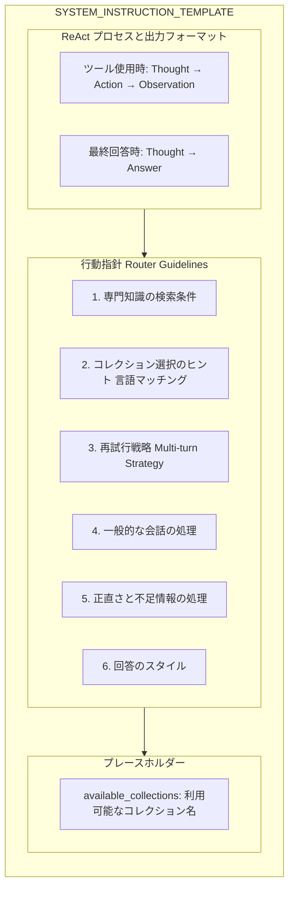

### 2.2 コレクション選択ガイド（定数内定義）

| コレクション名 | 対象言語 | 用途 |
|---------------|----------|------|
| `cc_news` | 英語 | 英語ニュース記事 |
| `wikipedia_ja` | 日本語 | 百科事典、一般知識 |
| `livedoor` | 日本語 | ニュース、エンタメ、映画 |
| `japanese_text` | 日本語 | Webテキスト（予備用） |

---

## 3. 関数一覧と IPO 分析

### 3.1 get_available_collections_from_qdrant()

| 項目 | 内容 |
|------|------|
| **行番号** | 118-127 |
| **目的** | Qdrantから利用可能なコレクション名を取得 |

#### IPO

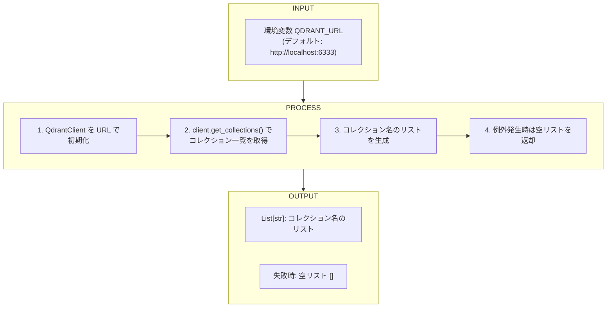

---

### 3.2 setup_agent()

| 項目 | 内容 |
|------|------|
| **行番号** | 129-152 |
| **目的** | Geminiエージェント（ChatSession）のセットアップ |

#### 引数

| 引数名 | 型 | 説明 |
|--------|-----|------|
| `selected_collections` | `List[str]` | 検索対象として選択されたコレクション名のリスト |
| `model_name` | `str` | 使用するGeminiモデル名 |

#### IPO

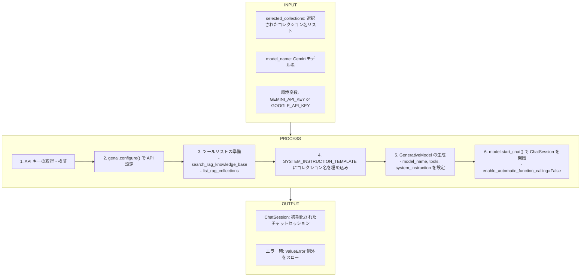

---

### 3.3 run_agent_turn()

| 項目 | 内容 |
|------|------|
| **行番号** | 154-306 |
| **目的** | エージェントの1ターンを実行（ReActループ + Reflection） |

#### 引数

| 引数名 | 型 | 説明 |
|--------|-----|------|
| `chat_session` | `ChatSession` | Gemini の ChatSession インスタンス |
| `user_input` | `str` | ユーザーからの入力メッセージ |

#### IPO

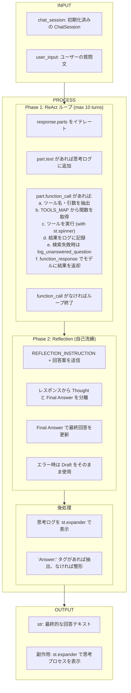

---

### 3.4 show_agent_chat_page()

| 項目 | 内容 |
|------|------|
| **行番号** | 312-519 |
| **目的** | メイン画面の表示とユーザーインタラクションの処理 |

#### IPO

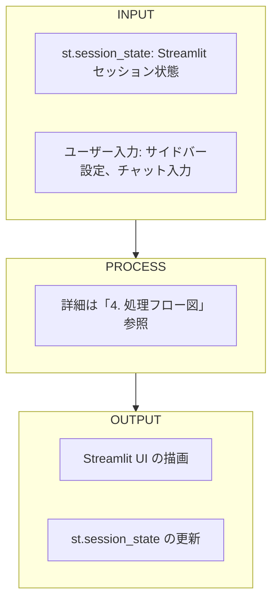

---

## 4. 処理フロー図

### 4.1 全体の概要処理フロー図

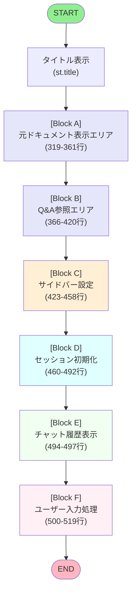

---

### 4.2 各処理ブロックの詳細フロー図

#### Block A: 元ドキュメント表示エリア (319-361行)

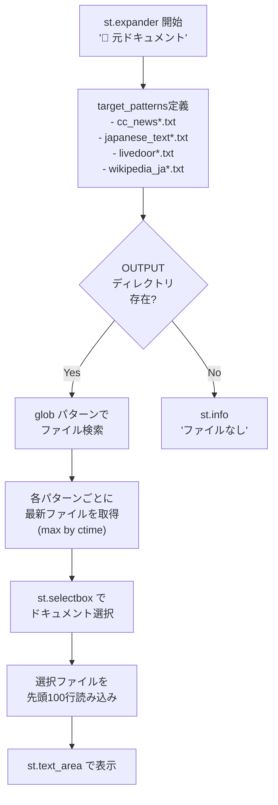

---

#### Block B: Q&A参照エリア (366-420行)

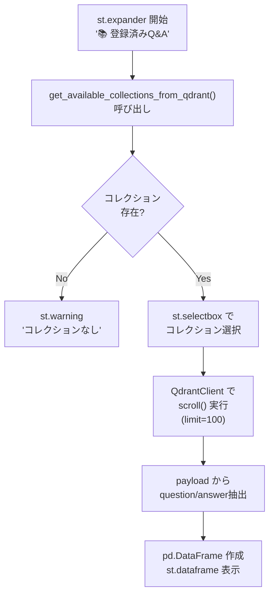

---

#### Block C: サイドバー設定 (423-458行)

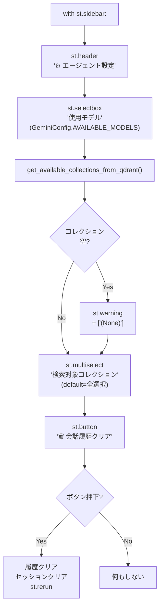

---

#### Block D: セッション初期化 (460-492行)

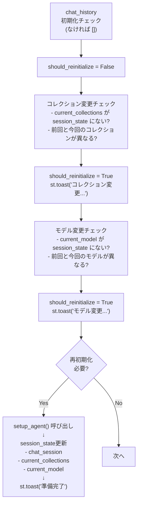

---

#### Block E: チャット履歴表示 (494-497行)

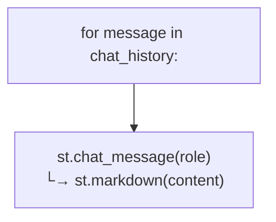

---

#### Block F: ユーザー入力処理 (500-519行)

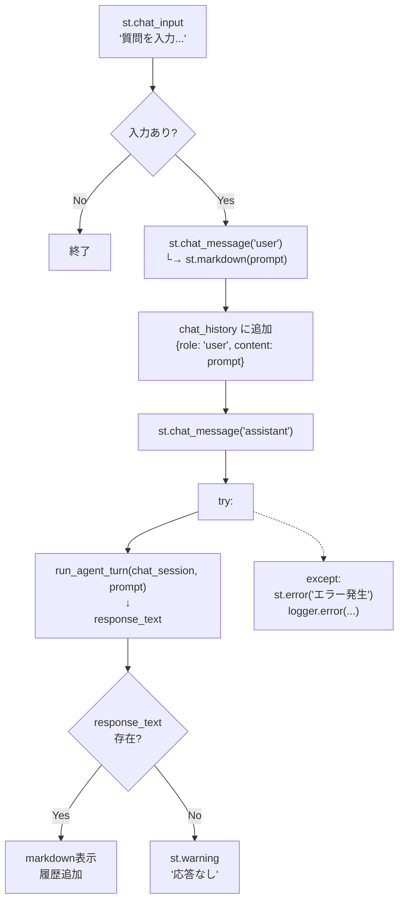

---

### 4.3 run_agent_turn() 詳細フロー図

```mermaid
%%{init: {'theme': 'dark', 'themeVariables': { 'primaryColor': '#1a1a1a', 'primaryTextColor': '#ffffff', 'primaryBorderColor': '#666666', 'lineColor': '#888888', 'secondaryColor': '#2a2a2a', 'tertiaryColor': '#1a1a1a'}}}%%
flowchart TB
    START([START])
    SEND["chat_session.send_message(user_input)"]
    INIT["max_turns = 10<br/>turn_count = 0<br/>thought_log = []"]

    subgraph Phase1["Phase 1: ReAct ループ"]
        LOOP_START{"while<br/>turn_count < max_turns"}
        INCREMENT["turn_count += 1<br/>function_call_found = False"]

        subgraph PartLoop["for part in response.parts:"]
            TEXT_CHECK{"part.text?"}
            TEXT_LOG["思考ログに追加<br/>'Thought:' 検出"]
            FC_CHECK{"part.function_call?"}
            FC_FOUND["function_call_found = True"]
            FC_EXTRACT["ツール名・引数抽出"]
            FC_EXEC["TOOLS_MAP から実行<br/>(with st.spinner)"]
            FC_LOG["結果をログに記録"]
            FC_NO_RESULT{"[[NO_RAG_RESULT]]?"}
            FC_UNANSWERED["log_unanswered_question"]
            FC_RESPONSE["function_response 送信"]
        end

        NO_FC{"function_call_found?"}
        SET_FINAL["final_response_text = current_text<br/>break"]
    end

    subgraph Phase2["Phase 2: Reflection 自己洗練"]
        FINAL_CHECK{"final_text<br/>存在?"}
        SKIP["後処理へ"]
        SPINNER["with st.spinner:<br/>'回答を推敲中...'"]
        REFLECT_SEND["REFLECTION_INSTRUCTION +<br/>回答案を送信"]
        SPLIT["'Final Answer:'で分割<br/>- reflection_thought<br/>- reflection_answer"]
        UPDATE["final_response_text<br/>= reflection_answer"]
    end

    subgraph PostProcess["後処理"]
        EXPANDER["thought_log を<br/>st.expander で表示"]
        TAG_PROCESS["'Answer:' タグ処理<br/>- あれば抽出<br/>- なければ整形"]
    end

    RETURN["return final_response_text"]
    END_NODE([END])

    START --> SEND
    SEND --> INIT
    INIT --> LOOP_START
    LOOP_START -->|Yes| INCREMENT
    INCREMENT --> TEXT_CHECK
    TEXT_CHECK -->|Yes| TEXT_LOG
    TEXT_CHECK -->|No| FC_CHECK
    TEXT_LOG --> FC_CHECK
    FC_CHECK -->|Yes| FC_FOUND
    FC_CHECK -->|No| NO_FC
    FC_FOUND --> FC_EXTRACT
    FC_EXTRACT --> FC_EXEC
    FC_EXEC --> FC_LOG
    FC_LOG --> FC_NO_RESULT
    FC_NO_RESULT -->|Yes| FC_UNANSWERED
    FC_NO_RESULT -->|No| FC_RESPONSE
    FC_UNANSWERED --> FC_RESPONSE
    FC_RESPONSE --> LOOP_START
    NO_FC -->|No| SET_FINAL
    NO_FC -->|Yes| LOOP_START
    LOOP_START -->|No| FINAL_CHECK
    SET_FINAL --> FINAL_CHECK

    FINAL_CHECK -->|Yes| SPINNER
    FINAL_CHECK -->|No| SKIP
    SPINNER --> REFLECT_SEND
    REFLECT_SEND --> SPLIT
    SPLIT --> UPDATE
    UPDATE --> EXPANDER
    SKIP --> EXPANDER
    EXPANDER --> TAG_PROCESS
    TAG_PROCESS --> RETURN
    RETURN --> END_NODE

    style START fill:#1a1a1a,stroke:#666,color:#fff
    style END_NODE fill:#1a1a1a,stroke:#666,color:#fff
    style SEND fill:#1a1a1a,stroke:#666,color:#fff
    style INIT fill:#1a1a1a,stroke:#666,color:#fff
    style LOOP_START fill:#1a1a1a,stroke:#666,color:#fff
    style INCREMENT fill:#1a1a1a,stroke:#666,color:#fff
    style TEXT_CHECK fill:#1a1a1a,stroke:#666,color:#fff
    style TEXT_LOG fill:#1a1a1a,stroke:#666,color:#fff
    style FC_CHECK fill:#1a1a1a,stroke:#666,color:#fff
    style FC_FOUND fill:#1a1a1a,stroke:#666,color:#fff
    style FC_EXTRACT fill:#1a1a1a,stroke:#666,color:#fff
    style FC_EXEC fill:#1a1a1a,stroke:#666,color:#fff
    style FC_LOG fill:#1a1a1a,stroke:#666,color:#fff
    style FC_NO_RESULT fill:#1a1a1a,stroke:#666,color:#fff
    style FC_UNANSWERED fill:#1a1a1a,stroke:#666,color:#fff
    style FC_RESPONSE fill:#1a1a1a,stroke:#666,color:#fff
    style NO_FC fill:#1a1a1a,stroke:#666,color:#fff
    style SET_FINAL fill:#1a1a1a,stroke:#666,color:#fff
    style FINAL_CHECK fill:#1a1a1a,stroke:#666,color:#fff
    style SKIP fill:#1a1a1a,stroke:#666,color:#fff
    style SPINNER fill:#1a1a1a,stroke:#666,color:#fff
    style REFLECT_SEND fill:#1a1a1a,stroke:#666,color:#fff
    style SPLIT fill:#1a1a1a,stroke:#666,color:#fff
    style UPDATE fill:#1a1a1a,stroke:#666,color:#fff
    style EXPANDER fill:#1a1a1a,stroke:#666,color:#fff
    style TAG_PROCESS fill:#1a1a1a,stroke:#666,color:#fff
    style RETURN fill:#1a1a1a,stroke:#666,color:#fff
    style Phase1 fill:#2a2a2a,stroke:#666,color:#fff
    style Phase2 fill:#2a2a2a,stroke:#666,color:#fff
    style PostProcess fill:#2a2a2a,stroke:#666,color:#fff
    style PartLoop fill:#333333,stroke:#666,color:#fff
```

---

## 5. 状態管理（st.session_state）

| キー | 型 | 説明 |
|------|-----|------|
| `chat_history` | `List[Dict]` | チャット履歴。各要素は `{"role": str, "content": str}` |
| `chat_session` | `ChatSession` | Gemini の ChatSession インスタンス |
| `current_collections` | `List[str]` | 現在選択されているコレクション名リスト |
| `current_model` | `str` | 現在選択されているモデル名 |

---

## 6. 外部依存関係

### 6.1 インポートモジュール

| モジュール | 用途 |
|-----------|------|
| `streamlit` | Web UI フレームワーク |
| `google.generativeai` | Gemini API クライアント |
| `qdrant_client` | Qdrant ベクトル DB クライアント |
| `pandas` | データフレーム処理 |
| `config.AgentConfig` | エージェント設定 |
| `config.GeminiConfig` | Gemini モデル設定 |
| `agent_tools` | RAG 検索ツール |
| `services.qdrant_service` | Qdrant サービス |
| `services.log_service` | ログ記録サービス |

### 6.2 環境変数

| 変数名 | 必須 | 説明 |
|--------|------|------|
| `GEMINI_API_KEY` or `GOOGLE_API_KEY` | Yes | Gemini API キー |
| `QDRANT_URL` | No | Qdrant サーバー URL (デフォルト: `http://localhost:6333`) |

---

## 7. エラーハンドリング

| 箇所 | エラー種別 | 処理 |
|------|-----------|------|
| `get_available_collections_from_qdrant` | Qdrant 接続エラー | 空リストを返却、ログ出力 |
| `setup_agent` | API キー未設定 | `st.error` + `ValueError` 送出 |
| `run_agent_turn` | ツール実行エラー | エラーメッセージを `tool_result` に設定 |
| `run_agent_turn` | Reflection エラー | Draft をそのまま使用、ログ出力 |
| `show_agent_chat_page` | エージェント初期化失敗 | `st.error` + 早期リターン |
| `show_agent_chat_page` | チャット処理エラー | `st.error` + ログ出力 |

---

## 8. ログ出力

| ログレベル | 出力内容 |
|-----------|---------|
| `INFO` | Agent Thought, Agent Response, Agent Tool Call, Tool Result, Reflection |
| `ERROR` | Qdrant 接続失敗, Reflection フェーズエラー, チャット処理エラー |

---

*Generated: 2024*