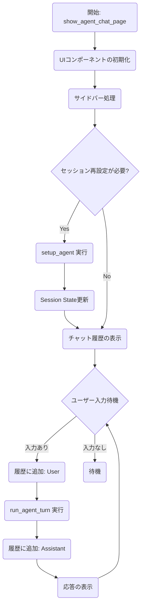
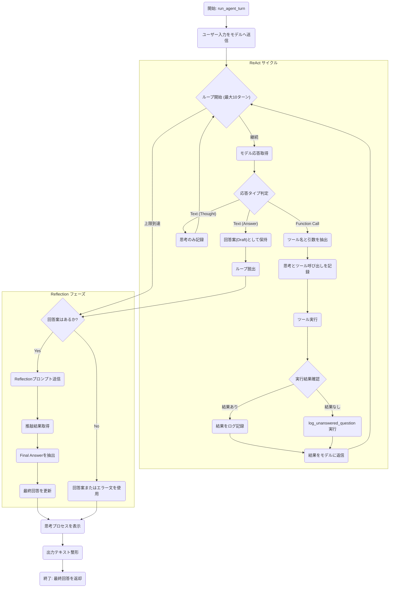

# `ui/pages/agent_chat_page.py` 詳細設計書

## 1. 重要な定数 (Constants)

| 定数名 | 役割・概要 | 内容 |
| :--- | :--- | :--- |
| `SYSTEM_INSTRUCTION_TEMPLATE` | **システムプロンプトのテンプレート** | エージェントの役割（ReAct型エージェント）、思考プロセス（Thought/Action/Observation）、行動指針（Router Guidelines）、コレクション選択基準、回答スタイル（です・ます調）を定義する長文のテンプレート文字列。実行時に利用可能なコレクション名が `{available_collections}` に埋め込まれる。 |
| `REFLECTION_INSTRUCTION` | **Reflection（推敲）用プロンプト** | エージェントが生成した一次回答（Draft）に対して、自己評価と修正を促すための指示。正確性、適切性、スタイルをチェックし、`Thought:` と `Final Answer:` の形式で出力させる。 |
| `TOOLS_MAP` | **ツールマッピング辞書** | エージェントが呼び出すツール名（文字列）と実際のPython関数オブジェクトを紐付ける辞書。<br>`{'search_rag_knowledge_base': search_rag_knowledge_base, 'list_rag_collections': list_rag_collections}` |

---

## 2. 関数仕様 (Functions IPO)

### `get_available_collections_from_qdrant`

*   **概要:** Qdrantデータベースから現在利用可能なコレクション名のリストを取得する。
*   **引数:** なし
*   **INPUT (入力):**
    *   環境変数 `QDRANT_URL` (デフォルト: `http://localhost:6333`)
*   **PROCESS (処理):**

    ```mermaid
    graph TD
        Start("開始") --> Init_Client("QdrantClient初期化")
        Init_Client --> Call_API("client.get_collections() 呼出")
        
        Call_API -->|成功| Extract("コレクション名抽出")
        Extract --> Return_List("リスト返却")
        
        Call_API -->|"失敗(Exception)"| Log_Err("エラーログ出力")
        Log_Err --> Return_Empty("空リスト[]返却")
    ```

    1.  `QdrantClient` を初期化し、Qdrantサーバーに接続。
    2.  `client.get_collections()` を呼び出し、サーバー上の全コレクション情報を取得。
    3.  コレクションオブジェクトから名前 (`name`) を抽出してリスト化する。
    4.  例外発生時はエラーログを出力し、空リストを返す。
*   **OUTPUT (出力):**
    *   `List[str]`: 利用可能なコレクション名のリスト (例: `['cc_news', 'livedoor']`)。失敗時は `[]`。

### `setup_agent`

*   **概要:** Gemini APIを使用したチャットセッション (`ChatSession`) を初期化・設定する。
*   **引数:**
    *   `selected_collections` (`List[str]`): 検索対象として許可されたコレクション名のリスト。
    *   `model_name` (`str`): 使用するGeminiモデル名。
*   **INPUT (入力):**
    *   環境変数 `GEMINI_API_KEY` または `GOOGLE_API_KEY`。
    *   定数 `SYSTEM_INSTRUCTION_TEMPLATE`。
*   **PROCESS (処理):**

    ```mermaid
    flowchart TD
        Start("開始") --> Check_Key{"API Key確認"}
        Check_Key -- なし --> Error("エラー発生")
        Check_Key -- あり --> Config_GenAI("genai.configure(api_key)")
        
        Config_GenAI --> Prep_Tools("ツールリスト準備")
        Prep_Tools --> Format_Prompt("システムプロンプト整形\n(コレクション名埋め込み)")
        Format_Prompt --> Init_Model("GenerativeModel初期化")
        Init_Model --> Start_Chat("model.start_chat()")
        Start_Chat --> Return_Session("ChatSession返却")
    ```

    1.  APIキーの存在確認と設定 (`genai.configure`)。
    2.  利用可能なツールリスト (`search_rag_knowledge_base`, `list_rag_collections`) を準備。
    3.  `selected_collections` を文字列結合し、システムプロンプトテンプレートの `{available_collections}` プレースホルダーに埋め込む。
    4.  `genai.GenerativeModel` を、指定された `model_name`、ツール、システムプロンプトで初期化する。
    5.  `model.start_chat` でチャットセッションを開始する（自動関数呼び出しは無効化 `enable_automatic_function_calling=False`）。
*   **OUTPUT (出力):**
    *   `ChatSession`: 初期化されたGeminiチャットセッションオブジェクト。

### `run_agent_turn`

*   **概要:** ユーザー入力に対するエージェントの1ターン分の応答処理を実行する。ReActループ（思考→ツール実行→観察）と Reflection（推敲）フェーズを含む。
*   **引数:**
    *   `chat_session` (`ChatSession`): 現在のGeminiチャットセッション。
    *   `user_input` (`str`): ユーザーからの質問テキスト。
*   **INPUT (入力):**
    *   ユーザーの質問。
    *   ツール実行結果（Qdrant検索結果など）。
*   **PROCESS (処理):**

    ```mermaid
    flowchart TD
        Start("開始") --> Send_Msg("ユーザー入力送信")
        Send_Msg --> Loop{"ReActループ\n(最大10回)"}
        
        Loop -- 継続 --> Check_Resp{"応答判定"}
        
        Check_Resp -- "Function Call" --> Exec_Tool("ツール実行")
        Exec_Tool --> Log_Result("結果ログ記録\n(失敗時はlog_unanswered)")
        Log_Result --> Reply_Tool("結果をモデルへ送信")
        Reply_Tool --> Loop
        
        Check_Resp -- "Thought (思考)" --> Log_Thought("思考ログ記録")
        Log_Thought --> Loop
        
        Check_Resp -- "Answer (回答)" --> Draft_Ans("回答案(Draft)採用")
        Draft_Ans --> Break("ループ脱出")
        
        Loop -- 上限 --> Break
        
        Break --> Reflect{"Reflectionフェーズ"}
        Reflect -- "回答案あり" --> Send_Reflect("推敲プロンプト送信")
        Send_Reflect --> Parse_Final("Final Answer抽出")
        Parse_Final --> Finalize("最終回答設定")
        
        Reflect -- "回答案なし" --> Finalize
        
        Finalize --> UI_Expander("思考プロセス表示(UI)")
        UI_Expander --> Clean("出力テキスト整形")
        Clean --> Return("回答返却")
    ```

    1.  **ReActループ (最大10回):**
        *   `chat_session.send_message` でユーザー入力を送信。
        *   モデルの応答を確認：
            *   **テキスト (Thought):** 思考プロセスとしてログに記録。
            *   **関数呼び出し (Function Call):** ツール名と引数を抽出。対応するツールを実行し、結果を取得。結果が「結果なし (`[[NO_RAG_RESULT]]`)」の場合はログサービスに未回答ログを記録。ツール実行結果を `function_response` としてモデルに送り返し、次のループへ。
            *   **テキスト (Answer):** 関数呼び出しがなく、テキストのみの場合はこれを「回答案 (Draft)」として採用し、ループを抜ける。
    2.  **Reflectionフェーズ:**
        *   回答案がある場合、`REFLECTION_INSTRUCTION` と回答案をモデルに送信し、推敲を依頼。
        *   応答から `Final Answer:` 以降を抽出し、最終回答とする。
    3.  思考プロセス (`thought_log`) を Streamlit の `expander` で表示。
    4.  最終回答文字列の整形（`Thought:` や `Answer:` タグの除去）。
*   **OUTPUT (出力):**
    *   `str`: エージェントからの最終的な回答テキスト。

### `show_agent_chat_page`

*   **概要:** Streamlitアプリケーションのメイン画面を描画し、ステート管理とユーザーインタラクションを制御する。
*   **引数:** なし
*   **INPUT (入力):**
    *   `st.session_state` (チャット履歴、現在のセッションなど)。
    *   ユーザーのUI操作（サイドバー設定、チャット入力）。
*   **PROCESS (処理):**

    ```mermaid
    flowchart TD
        Start("開始") --> Draw_Base("基本UI描画\n(タイトル, Expander)")
        Draw_Base --> Sidebar("サイドバー設定処理")
        
        Sidebar --> Check_Init{"初期化/変更チェック"}
        Check_Init -- 必要 --> Setup("setup_agent() 呼出")
        Setup --> Update_State("Session State更新")
        
        Check_Init -- 不要 --> Draw_Hist("チャット履歴表示")
        Update_State --> Draw_Hist
        
        Draw_Hist --> Wait_Input{"ユーザー入力待機"}
        
        Wait_Input -- 入力あり --> Add_User("User履歴追加")
        Add_User --> Run("run_agent_turn() 実行")
        Run --> Add_Assist("Assistant履歴追加")
        Add_Assist --> ReDraw("画面再描画")
        
        Wait_Input -- なし --> End("待機")
    ```

    1.  **UI描画:**
        *   タイトル、キャプション。
        *   **元ドキュメント表示エリア (Expander):** `OUTPUT/` ディレクトリ内のファイルを読み込み表示。
        *   **登録済みQ&A表示エリア (Expander):** Qdrantからデータを取得してプレビュー表示。
        *   **サイドバー:** モデル選択、コレクション選択（マルチセレクト）、履歴クリアボタン。
    2.  **セッション管理:**
        *   チャット履歴の初期化。
        *   コレクション選択やモデル変更を検知し、必要に応じて `setup_agent` を呼び出してエージェントを再初期化。
    3.  **チャット履歴表示:** 過去のメッセージ (`user`, `assistant`) をループ表示。
    4.  **インタラクション処理:**
        *   `st.chat_input` で入力を受け付ける。
        *   入力を履歴に追加。
        *   `run_agent_turn` を呼び出して応答を生成。
        *   応答を表示し、履歴に追加。
*   **OUTPUT (出力):**
    *   なし (Streamlitによる画面描画)。

---

## 3. 処理フロー図 (Process Flow)

### (1) 全体の概要処理フロー (High-Level Flow)



### (2) 詳細処理ブロック図：`run_agent_turn` (ReAct & Reflection Logic)

この関数はエージェントの思考と行動の中核です。

