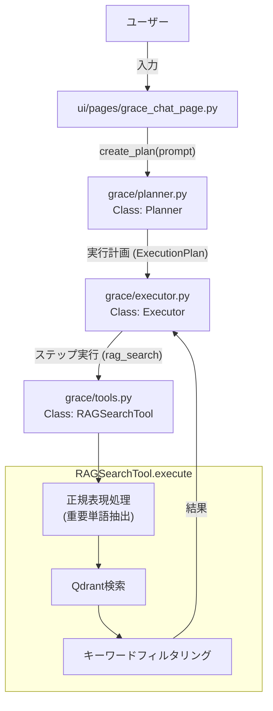
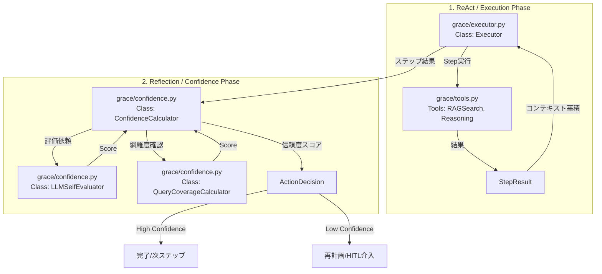

### 改修計画：
###   ConfidenceCalculator における各評価項目の「意味」「取得元」「満点の条件」を整理し、正しい計算式を再設計します。

1. 各項目の詳細定義と満点条件

① search_quality (検索品質)
* 何が重要か？: 回答の根拠となる情報（ドキュメント）が、どれだけ質問にマッチしているか。
* 取得元: ConfidenceFactors.search_max_score と search_avg_score。
* 満点(1.0)条件: クエリに対して、類似度 1.0（完全一致）のドキュメントが見つかった場合。
   * 例: 「浦沢直樹 受賞」で検索し、「浦沢直樹は...を受賞した」という文を含むドキュメントがヒット。

② tool_success (ツール成功率)
* 何が重要か？: 計画されたツール（検索や推論）がエラーなく正常に完了したか。
* 取得元: ToolResult.success (Trueなら1.0, Falseなら0.0)。
* 満点(1.0)条件: ツール実行中に例外やエラーが発生せず、正常に結果を返した場合。

③ source_agreement (ソース一致度)
* 何が重要か？: 複数の情報源がある場合、それらが矛盾していないか。
* 取得元: 複数の検索結果や回答ベクトル間のコサイン類似度。
* 満点(1.0)条件:
 全てのソースが同じ事実を述べている場合。または、ソースが1つしかなく矛盾のしようがない場合も（論理的には）1.0扱いとすべき。

④ llm_self_eval (LLM自己評価)
* 何が重要か？: 生成した回答に対し、LLM自身が「正確だ」と確信しているか。
* 取得元: 回答生成後に別プロンプトで自己採点させた結果。
* 満点(1.0)条件: LLMが「情報源に基づき、完璧に回答できた」と判断した場合

---
###動作イメージ

1. 質問: 「浦沢直樹の初受賞作品は？」
2. Step 1: RAG検索（auto）を実行。
3. 判定: もし結果が不十分（Confidence低）なら、Executorが Replan（再計画） をトリガー。
4. Step 1' (追加): 検索キーワードを変える、あるいは別の角度から再検索。
5. 回答: 十分な情報が得られた段階で最終回答を生成。

## 質問入力からのモジュール構成, ReAct, Reflection（エージェント対話）：

エージェント対話 (Legacy) の処理について、以下の通り回答します。

### 重要単語の抽出処理

**結論から言うと、Legacy エージェントでは、ユーザーの質問から事前のキーワード抽出処理は行われていません。**

入力された質問文字列 (`user_input`) は、キーワード抽出や最適化の処理を経ることなく、そのままの形で ReAct の思考プロセスに渡されます。

*   **ファイル:** `ui/pages/agent_chat_page.py`
*   **関数:** `show_agent_chat_page()`
    *   `prompt = st.chat_input(...)` でユーザー入力を受け取ります。
    *   `st.session_state.agent.execute_turn(prompt)` を呼び出し、`prompt` がそのまま `ReActAgent` に渡されます。

*   **ファイル:** `services/agent_service.py`
*   **クラス:** `ReActAgent`
*   **関数:** `execute_turn(self, user_input: str)` -> `_execute_react_loop(self, user_input: str)`
    *   `self.chat_session.send_message(user_input)` が呼ばれ、加工されていないユーザー入力が直接 Gemini モデルに送信されます。

**重要単語の抽出・検索クエリの最適化は、LLM (Gemini) 自身が ReAct の思考 (Thought) の中で行います。**
これは、システムプロンプトによってそのように振る舞うよう指示されているためです。

```
Thought: [なぜ検索が必要か、どのコレクションを、どんなクエリで検索するか]
```

### ReAct と Reflection の実行

ReAct と Reflection の実行は、上記の通り `ReActAgent` クラスが担当します。

*   **ファイル:** `services/agent_service.py`
*   **クラス:** `ReActAgent`
*   **構成:**
    *   **`execute_turn`**: ReAct と Reflection の実行フロー全体を管理するメイン関数です。
        1.  `_execute_react_loop` を呼び出して ReAct フェーズを実行し、回答案を取得します。
        2.  回答案を `_execute_reflection_phase` に渡し、Reflection (推敲) フェーズを実行します。
        3.  推敲された最終回答を返します。
    *   **`_execute_react_loop` (ReAct)**:
        *   ユーザー入力を Gemini に送信します。
        *   モデルからの応答に `function_call` が含まれていれば、対応するツール (例: `search_rag_knowledge_base`) を実行します。
        *   ツールの実行結果をモデルに返し、最終的な `Answer:` が得られるまでこのサイクルを繰り返します。
    *   **`_execute_reflection_phase` (Reflection)**:
        *   ReAct フェーズで得られた回答案を、自己評価用のプロンプト (`REFLECTION_INSTRUCTION`) と共に再度 Gemini に送信します。
        *   モデルに回答案を「正確性」「適切性」「スタイル」の観点から評価させ、必要であれば修正させます。
        *   修正された `Final Answer:` を返します。

### モジュール構成図

```mermaid
graph TD
    UI["ui/pages/agent_chat_page.py"] -->|1. ユーザー入力(prompt)| Agent["services/agent_service.py<br>Class: ReActAgent"]
    
    subgraph ReActAgent
        Agent -->|2. execute_turn(prompt)| ReAct["_execute_react_loop"]
        
        subgraph ReActCycle ["ReAct ループ"]
            ReAct -->|3. send_message(prompt)| Gemini["LLM (Gemini)"]
            Gemini -->|4. Thought / Function Call| ReAct
            ReAct -->|5. ツール実行| Tools["agent_tools.py"]
            Tools -->|6. 実行結果| ReAct
            ReAct -->|7. 結果をLLMへ| Gemini
            Gemini -->|8. Answer| ReAct
        end
        
        ReAct -->|9. 回答案| Reflection["_execute_reflection_phase"]
        
        subgraph ReflectionCycle ["Reflection フェーズ"]
            Reflection -->|10. 推敲プロンプト送信| Gemini
            Gemini -->|11. Final Answer| Reflection
        end
        
        Reflection -->|12. 最終回答| UI
    end
```


## 質問入力からのモジュール構成（grace）：

GRACE エージェント (New) の構成について回答します。

1. 質問入力を受け付けるモジュール
   ユーザーの質問を受け付け、計画生成（プランニング）に渡す処理は以下の通りです。

* ファイル名: ui/pages/grace_chat_page.py
* 関数: show_grace_chat_page
  * st.chat_input("質問を入力してください...") で入力を受け付けます。
  * その入力（prompt）を st.session_state.planner.create_plan(prompt) に渡します。

内部処理（プランニング）:

* ファイル名: grace/planner.py
* クラス: Planner
* 関数: create_plan(self, query: str)
  * 受け取った質問文を元に、LLMを使用して実行計画（ExecutionPlan）を作成します。

2. 質問の最適化・重要単語抽出・Regex処理を行うモジュール
   GRACEエージェントにおいて、検索クエリから正規表現（Regex）を使って重要単語（漢字・カタカナなど）を抽出し、検索結果のフィルタリングを行う処理は、ツールの実行時に行われています。
   (regex_mecab.py は使用されておらず、ツール内にロジックが実装されています)

* ファイル名: grace/tools.py
* クラス: RAGSearchTool
* 関数: execute
  * このメソッド内の import re から始まるブロックで正規表現処理が行われています。

具体的な処理内容:

1 # grace/tools.py の execute メソッド内
2 kanji_katakana_pattern = r'^[\u4e00-\u9fff\u30a0-\u30ffー]+$'
3 kanji_katakana_extract_pattern = r'[\u4e00-\u9fff\u30a0-\u30ffー]{2,}'
4
5 # 1. クエリをスペース分割し、漢字・カタカナのみのトークンを必須キーワードとする
6 # 2. 正規表現で文中の漢字・カタカナの連続（2文字以上）を抽出し、必須キーワードに追加する

3. モジュール構成の概要



## ReAct & Reflection

GRACE エージェントにおける「ReAct (推論+行動)」と「Reflection (自己評価)」の実装について説明します。
GRACE アーキテクチャでは、**ReAct パターンは Plan-and-Execute (Executor) に統合**され、**Reflection パターンは Confidence (信頼度計算) システムに進化**して実装されています。

### 1. ReAct (Reason + Act) 担当モジュール

GRACE における ReAct サイクルは、Executor が計画（Plan）に従ってステップを実行し、ReasoningTool が文脈を考慮して推論・回答生成を行うことで実現されています。

* **ファイル名:** `grace/executor.py`

  * **クラス:** `Executor`
  * **関数:** `execute_plan`, `_execute_step`, `_execute_reasoning` (tools経由)
  * **処理概要:**
    * **Reasoning (思考):** `grace/planner.py` で生成された計画自体が「思考」の結果です。Executor はその計画に従い、ステップごとにコンテキスト（過去のステップの結果）を積み上げていきます。
    * **Act (行動):** ステップのアクション（`rag_search` や `ask_user`）を実行します。
    * **Observation (観察):** ツールの実行結果 (`ToolResult`) を受け取り、次のステップの入力として保持します。
  * **補足:** 従来のループ型の ReAct (`services/agent_service.py`) と異なり、計画されたステップを順次実行する形に進化した「Plan-and-Execute」パターンを採用しています。
* **ファイル名:** `grace/tools.py`

  * **クラス:** `ReasoningTool`
  * **関数:** `execute`
  * **処理概要:** 収集された情報（Sources）と文脈（Context）を元に、LLM が最終的な回答や推論結果を生成します。

### 2. Reflection (自己評価) 担当モジュール

GRACE における Reflection は、単なる「振り返り」から、定量的・定性的な「信頼度評価 (Confidence-aware)」へと高度化されています。

* **ファイル名:** `grace/confidence.py`
  * **クラス:** `ConfidenceCalculator`
    * **関数:** `calculate`
    * **処理概要:** 検索結果の質、ソースの一致度、LLM自己評価などを総合して、0.0〜1.0 の信頼度スコアを計算します。
  * **クラス:** `LLMSelfEvaluator`
    * **関数:** `evaluate`
    * **処理概要:** 生成された回答が質問に対して適切か、情報源に基づいているかを LLM 自身に評価させます（Reflection の中核）。
  * **クラス:** `QueryCoverageCalculator`
    * **関数:** `calculate`
    * **処理概要:** 回答がユーザーの質問の要素をどれだけ網羅しているかを評価します。

### モジュール構成図 (Next Stage: Execution & Evaluation)



## GRACE Agent - 機能別ファイル・クラス・関数一覧

8. grace/config.py - 設定管理

設定モデル


| クラス名             | 説明                   | 主要フィールド                                                                                        |
| -------------------- | ---------------------- | ----------------------------------------------------------------------------------------------------- |
| LLMConfig            | LLM設定                | provider, model, temperature, max_tokens, timeout                                                     |
| EmbeddingConfig      | Embedding設定          | provider, model, dimensions                                                                           |
| ConfidenceWeights    | Confidence重み設定     | search_quality(25%), source_agreement(20%), llm_self_eval(25%),tool_success(15%), query_coverage(15%) |
| ConfidenceThresholds | Confidence閾値設定     | silent(0.9), notify(0.7), confirm(0.4)                                                                |
| ConfidenceConfig     | Confidence計算設定     | weights, thresholds                                                                                   |
| InterventionConfig   | 介入設定               | default_timeout(300秒), auto_proceed_on_timeout, max_clarification_rounds                             |
| ReplanConfig         | リプラン設定           | max_replans(3), confidence_threshold(0.4), partial_replan_threshold(0.6)                              |
| CostConfig           | コスト管理設定         | daily_limit_usd, hourly_limit_usd, per_query_limit_usd                                                |
| ErrorConfig          | エラーハンドリング設定 | max_retries, exponential_backoff                                                                      |
| LoggingConfig        | ログ設定               | level, file, max_size_mb                                                                              |
| QdrantConfig         | Qdrant設定             | url, collection_name, search_limit, score_threshold                                                   |
| ToolsConfig          | ツール設定             | enabled（デフォルト: rag_search, reasoning, ask_user）                                                |
| GraceConfig          | GRACE Agent 統合設定   | 上記すべてを包含                                                                                      |

## ディレクトリ構成図

services:

```
gemini_grace_agent/
├── services/                     # 共通サービス層（既存ロジック・基盤機能）
│   └── __init__.py
│   └── agent_service.py          # エージェント基底機能（ReAct + Reflection の実装）
|                                 # (1) ReAct + (2) Reflection の実装箇所
│                                 #  - Class: ReActAgent
│                                 #  - Method: _execute_react_loop (ReAct)
│                                 #  - Method: _execute_reflection_phase (Reflection)
│
│    ├── cache_service.py         # キャッシュ管理（プロンプトや検索結果の再利用）
│    ├── config_service.py        # サービス固有の設定管理
│    ├── dataset_service.py       # データセット操作（ロード、前処理、管理）
│    ├── file_service.py          # ファイル入出力処理（ドキュメント読み込み等）
│    ├── json_service.py          # JSONデータの検証・変換処理
│    ├── log_service.py           # ログ管理（未回答ログ、システム実行ログの記録）
│    ├── qa_service.py            # Q&A生成・管理のコアロジック
│    ├── qdrant_service.py        # Qdrant操作（コレクション作成、ベクトル検索、データ登録）
│    └── token_service.py         # トークン制御（LLM入力制限の計算・管理）

```

grace:

```
├── grace/                        # GRACEコア機能 (次世代アーキテクチャ)
│   ├── __init__.py
│   ├── schemas.py                # 共通スキーマ定義
│   ├── config.py                 # 設定管理
│   ├── planner.py                # (3) Plan-and-Execute（計画生成）
│   ├── executor.py               # (3) Plan-and-Execute（計画実行 - ReActの進化版）
│   ├── confidence.py             # (5) Confidence-aware（信頼度スコアリング）
│   ├── intervention.py           # (4) HITL（人間による介入判断）
│   ├── replan.py                 # (6) Adaptive Replanning（動的計画修正）
│   └── tools.py                  # ツール定義（RAG検索など）
│

```

ファイル構成図：

```
grace/
├── schemas.py           # スキーマ定義（計画・実行結果の型）
├── config.py            # 設定管理（YAML+環境変数）
├── planner.py           # 計画生成（Gemini API使用）
├── executor.py          # 計画実行エンジン
├── confidence.py        # 信頼度計算（5軸ハイブリッド方式）
├── intervention.py      # HITL介入システム
├── replan.py            # 動的リプランニング
├── tools.py             # ツール定義（RAG検索、推論、ユーザー質問）
└── __init__.py
```

tests:

```
└── tests/grace/                  # GRACE用テスト群
    ├── test_schemas.py
    ├── test_planner.py
    ├── test_executor.py
    ├── test_confidence.py
    ├── test_intervention.py
    └── test_replan.py
```

---

## 機能別対応表

### (1) ReAct


| ファイル                    | クラス       | 主要メソッド                              |
| --------------------------- | ------------ | ----------------------------------------- |
| `services/agent_service.py` | `ReActAgent` | `execute_turn()`, `_execute_react_loop()` |

### (2) Reflection


| ファイル                    | クラス       | 主要メソッド                  |
| --------------------------- | ------------ | ----------------------------- |
| `services/agent_service.py` | `ReActAgent` | `_execute_reflection_phase()` |

### (3) Plan-and-Execute


| ファイル            | クラス                      | 主要メソッド                                              |
| ------------------- | --------------------------- | --------------------------------------------------------- |
| `grace/planner.py`  | `Planner`                   | `create_plan()`, `estimate_complexity()`, `refine_plan()` |
| `grace/executor.py` | `Executor`                  | `execute_plan()`, `cancel()`, `resume()`                  |
| `grace/executor.py` | `ExecutionState`            | `get_completed_outputs()`, `can_replan()`                 |
| `grace/schemas.py`  | `ExecutionPlan`, `PlanStep` | -                                                         |

### (4) HITL (Human-in-the-Loop)


| ファイル                | クラス                     | 主要メソッド                                                    |
| ----------------------- | -------------------------- | --------------------------------------------------------------- |
| `grace/intervention.py` | `InterventionHandler`      | `handle()`, `request_confirmation()`, `request_clarification()` |
| `grace/intervention.py` | `DynamicThresholdAdjuster` | `record_feedback()`, `get_level()`                              |
| `grace/intervention.py` | `ConfirmationFlow`         | `confirm_plan()`                                                |
| `grace/tools.py`        | `AskUserTool`              | `execute()`                                                     |

### (5) Confidence-aware


| ファイル              | クラス                      | 主要メソッド                                     |
| --------------------- | --------------------------- | ------------------------------------------------ |
| `grace/confidence.py` | `ConfidenceCalculator`      | `calculate()`, `decide_action()`                 |
| `grace/confidence.py` | `LLMSelfEvaluator`          | `evaluate()`                                     |
| `grace/confidence.py` | `SourceAgreementCalculator` | `calculate()`                                    |
| `grace/confidence.py` | `QueryCoverageCalculator`   | `calculate()`                                    |
| `grace/confidence.py` | `ConfidenceAggregator`      | `aggregate()`, `aggregate_with_critical_check()` |

### (6) Adaptive Replanning


| ファイル          | クラス               | 主要メソッド                                                   |
| ----------------- | -------------------- | -------------------------------------------------------------- |
| `grace/replan.py` | `ReplanManager`      | `should_replan()`, `determine_strategy()`, `create_new_plan()` |
| `grace/replan.py` | `ReplanOrchestrator` | `handle_step_failure()`, `handle_user_feedback()`              |

---

## Enum・データクラス一覧


| 機能             | Enum/データクラス    | 値                                                                   |
| ---------------- | -------------------- | -------------------------------------------------------------------- |
| Plan-and-Execute | `ActionType`         | RAG_SEARCH, WEB_SEARCH, REASONING, ASK_USER, CODE_EXECUTE            |
| Plan-and-Execute | `StepStatus`         | PENDING, RUNNING, SUCCESS, PARTIAL, FAILED, SKIPPED                  |
| Confidence       | `InterventionLevel`  | SILENT(≥0.9), NOTIFY(≥0.7), CONFIRM(≥0.4), ESCALATE(<0.4)         |
| HITL             | `InterventionAction` | PROCEED, MODIFY, CANCEL, INPUT, RETRY, SKIP                          |
| Replanning       | `ReplanTrigger`      | STEP_FAILED, LOW_CONFIDENCE, USER_FEEDBACK, NEW_INFORMATION, TIMEOUT |
| Replanning       | `ReplanStrategy`     | PARTIAL, FULL, FALLBACK, SKIP, ABORT                                 |

---

## テスト件数


| Phase    | テストファイル                                                                              | テスト数 |
| -------- | ------------------------------------------------------------------------------------------- | -------- |
| Phase 1  | `test_schemas.py`, `test_planner.py`, `test_executor.py`, `test_tools.py`, `test_config.py` | 49       |
| Phase 2  | `test_confidence.py`                                                                        | 32       |
| Phase 3  | `test_intervention.py`                                                                      | 40       |
| Phase 4  | `test_replan.py`                                                                            | 58       |
| **合計** |                                                                                             | **179**  |

---

---

# GRACE Agent プロジェクト計画書（改訂版 v2.0）

> **GRACE** = **G**uided **R**easoning with **A**daptive **C**onfidence **E**xecution
> 適応型計画実行エージェント

---

## 目次

1. [プロジェクト概要](#1-プロジェクト概要)
2. [アーキテクチャ概要](#2-アーキテクチャ概要)
3. [技術的特徴の比較](#3-技術的特徴の比較)
4. [実装詳細設計](#4-実装詳細設計)
5. [Confidence Score 計算（詳細設計）](#5-confidence-score-計算詳細設計)
6. [エラーハンドリング戦略](#6-エラーハンドリング戦略)
7. [コスト管理・制限機能](#7-コスト管理制限機能)
8. [ロギング・オブザーバビリティ](#8-ロギングオブザーバビリティ)
9. [テスト戦略](#9-テスト戦略)
10. [実装ロードマップ](#10-実装ロードマップ)
11. [評価方法](#11-評価方法)

---

## 1. プロジェクト概要

### 1.1 背景

現在の `gemini_grace_agent` プロジェクトは、**ReAct + Reflection** パターンを実装した学習用エージェントである。このプロジェクトを発展させ、より高度なエージェントアーキテクチャを学習・実装する。

### 1.2 命名


| 項目               | 名称                                                |
| ------------------ | --------------------------------------------------- |
| **プロジェクト名** | `gemini_grace_agent`                                |
| **アプリ表示名**   | GRACE                                               |
| **サブタイトル**   | Adaptive Research Agent                             |
| **正式名称**       | Guided Reasoning with Adaptive Confidence Execution |
| **日本語名**       | 適応型計画実行エージェント                          |

### 1.3 命名の由来

```
G - Guided      : 計画に導かれる + HITL（人間介入）
R - Reasoning   : ReActの思考部分を継承
A - Adaptive    : 動的リプランニング
C - Confidence  : 信頼度ベース判断
E - Execution   : 実行フェーズ
```

### 1.4 技術スタック決定事項


| 項目                     | 選定技術                          | 理由                                     |
| ------------------------ | --------------------------------- | ---------------------------------------- |
| **LLMプロバイダー**      | **Gemini API のみ**               | 既存実装との統合、コスト効率             |
| **Embedding**            | `gemini-embedding-001` (3072次元) | 高精度、既存Qdrantコレクションとの整合性 |
| **ベクトルDB**           | Qdrant                            | 既存インフラ活用                         |
| **テストフレームワーク** | pytest + PyCharm Pro              | 既存環境の継続利用                       |

### 1.5 ディレクトリ構成（既存リポジトリ活用）

```
gemini_grace_agent/               # 既存リポジトリをそのまま使用
├── README.md
├── config.py                     # 既存: 設定管理
├── helper_llm.py                 # 既存: LLM抽象化レイヤー
├── helper_embedding.py           # 既存: Embedding抽象化レイヤー
├── services/
│   ├── agent_service.py          # 既存: ReActエージェント（拡張対象）
│   ├── qdrant_service.py         # 既存: RAG検索（そのまま活用）
│   └── log_service.py            # 既存: ロギング
├── grace/                        # 【新規】GRACEコア機能
│   ├── __init__.py
│   ├── planner.py                # 計画生成エージェント
│   ├── executor.py               # 計画実行エージェント
│   ├── confidence.py             # 信頼度スコア計算
│   ├── intervention.py           # HITL介入ロジック
│   ├── replan.py                 # 動的リプランニング
│   └── schemas.py                # Pydanticスキーマ
├── ui/
│   └── pages/
│       └── grace_chat_page.py    # 【新規】GRACE専用UI
├── tests/
│   └── grace/                    # 【新規】GRACEテスト
│       ├── test_planner.py
│       ├── test_executor.py
│       ├── test_confidence.py
│       └── test_integration.py
├── doc/
│   ├── 00_plan.md                # 旧計画書
│   └── 00_plan_now.md            # 【本ファイル】現行計画書
└── old_code/                     # 使用しない（参照のみ）
```

### 1.6 利用しないコード

以下のコード・ディレクトリは本プロジェクトでは使用しない：

- `old_code/` 以下のすべてのファイル
- `a30_qdrant_registration.py`（旧登録スクリプト）
- OpenAI API 関連コード（Geminiに統一）

---

## 2. アーキテクチャ概要

### 2.1 GRACE はハイブリッドアーキテクチャ

GRACE は単一のパターンではなく、**複数のエージェントパターンを統合したハイブリッドアーキテクチャ**である。

```
┌─────────────────────────────────────────────────────────┐
│                    GRACE Agent                          │
│         (Hybrid Agentic Architecture)                   │
├─────────────────────────────────────────────────────────┤
│                                                         │
│   ┌─────────────┐   ┌─────────────┐   ┌─────────────┐  │
│   │ Plan-and-   │ + │ ReAct       │ + │ Reflection  │  │
│   │ Execute     │   │ (継承)      │   │ (継承)      │  │
│   └─────────────┘   └─────────────┘   └─────────────┘  │
│          │                                              │
│          ▼                                              │
│   ┌─────────────┐   ┌─────────────┐   ┌─────────────┐  │
│   │ Confidence  │ + │ HITL        │ + │ Adaptive    │  │
│   │ -aware      │   │             │   │ Replanning  │  │
│   └─────────────┘   └─────────────┘   └─────────────┘  │
│                                                         │
└─────────────────────────────────────────────────────────┘
```

### 2.2 既存コードとの統合方針


| 既存コンポーネント                       | 統合方針                        |
| ---------------------------------------- | ------------------------------- |
| `services/agent_service.py` (ReActAgent) | 基盤として継承・拡張            |
| `services/qdrant_service.py`             | RAG検索ツールとしてそのまま活用 |
| `helper_llm.py` (GeminiClient)           | LLMアクセスに使用               |
| `helper_embedding.py` (GeminiEmbedding)  | Embedding生成に使用             |
| `config.py` (GeminiConfig)               | モデル設定に使用                |

### 2.3 典型的な Plan-and-Execute との違い

```
┌─────────────────────────────────────────────────────────┐
│  典型的な Plan-and-Execute                              │
├─────────────────────────────────────────────────────────┤
│  Plan → Execute Step 1 → Step 2 → ... → Output         │
│  （計画は固定、失敗したら終わり）                         │
└─────────────────────────────────────────────────────────┘

                        vs

┌─────────────────────────────────────────────────────────┐
│  GRACE Agent                                            │
├─────────────────────────────────────────────────────────┤
│  Plan ──┬──→ Execute (ReAct) ──→ Evaluate (Confidence) │
│         │         │                    │                │
│         │         ▼                    ▼                │
│         │    [失敗/低信頼]        [要確認]              │
│         │         │                    │                │
│         ◀─────────┴── Replan ◀── HITL ◀┘               │
│                                                         │
│  （動的に計画修正、人間と協調、自己評価）                 │
└─────────────────────────────────────────────────────────┘
```

---

## 3. 技術的特徴の比較

### 3.1 現行 vs 改修版


| # | 特徴       | 現行 (ReAct + Reflection) | GRACE (改修版)            |
| - | ---------- | ------------------------- | ------------------------- |
| 1 | 思考と行動 | ✅ ReAct                  | ✅ 継承                   |
| 2 | 自己評価   | ✅ Reflection             | ✅ 継承・強化             |
| 3 | 事前計画   | ❌                        | ✅**Plan-and-Execute**    |
| 4 | 人間介入   | ❌                        | ✅**HITL**                |
| 5 | 信頼度判断 | ❌                        | ✅**Confidence-aware**    |
| 6 | 動的再計画 | ❌                        | ✅**Adaptive Replanning** |

### 3.2 技術項目の依存関係

```
                    ┌─────────────────┐
                    │ (1) ReAct       │ ← 既存（継承）
                    │ (2) Reflection  │
                    └────────┬────────┘
                             │
                             ▼
                    ┌─────────────────┐
                    │ (3) Plan-and-   │ ← 最初に実装
                    │     Execute     │   （他の基盤）
                    └────────┬────────┘
                             │
              ┌──────────────┼──────────────┐
              ▼              ▼              ▼
     ┌──────────────┐ ┌──────────────┐ ┌──────────────┐
     │(4) Confidence│ │(5) HITL      │ │(6) Adaptive  │
     │   -aware     │ │              │ │  Replanning  │
     └──────────────┘ └──────────────┘ └──────────────┘
```

### 3.3 実装優先度マトリクス


| 項目                | 重要度     | 難易度 | 学習効果   | 依存関係   | 推奨順序 |
| ------------------- | ---------- | ------ | ---------- | ---------- | -------- |
| Plan-and-Execute    | ⭐⭐⭐⭐⭐ | 中     | ⭐⭐⭐⭐⭐ | なし       | **1st**  |
| Confidence-aware    | ⭐⭐⭐⭐   | 中〜高 | ⭐⭐⭐⭐   | (3)必須    | **2nd**  |
| HITL                | ⭐⭐⭐⭐   | 中     | ⭐⭐⭐⭐⭐ | (3)(4)必須 | **3rd**  |
| Adaptive Replanning | ⭐⭐⭐⭐⭐ | 高     | ⭐⭐⭐⭐⭐ | (3)(4)必須 | **4th**  |

---

## 4. 実装詳細設計

### 4.1 計画スキーマ（Pydantic）

```python
# grace/schemas.py

from typing import Literal, Optional
from pydantic import BaseModel, Field

class PlanStep(BaseModel):
    """計画の1ステップを表現"""
    step_id: int = Field(..., description="ステップ番号（1から開始）")
    action: Literal["rag_search", "web_search", "reasoning", "ask_user"] = Field(
        ..., description="実行するアクション種別"
    )
    description: str = Field(..., description="このステップで何をするか")
    query: Optional[str] = Field(None, description="検索クエリ（検索系アクションの場合）")
    collection: Optional[str] = Field(None, description="検索対象コレクション")
    depends_on: list[int] = Field(default_factory=list, description="依存する先行ステップのID")
    expected_output: str = Field(..., description="期待される出力の説明")
    fallback: Optional[str] = Field(None, description="失敗時の代替アクション")

class ExecutionPlan(BaseModel):
    """実行計画全体"""
    original_query: str = Field(..., description="ユーザーの元の質問")
    complexity: float = Field(..., ge=0.0, le=1.0, description="推定複雑度")
    estimated_steps: int = Field(..., description="推定ステップ数")
    requires_confirmation: bool = Field(..., description="実行前に確認が必要か")
    steps: list[PlanStep] = Field(..., description="実行ステップのリスト")
    success_criteria: str = Field(..., description="計画成功の判定基準")

class StepResult(BaseModel):
    """ステップ実行結果"""
    step_id: int
    status: Literal["success", "partial", "failed"]
    output: str
    confidence: float = Field(..., ge=0.0, le=1.0)
    sources: list[str] = Field(default_factory=list)
    error: Optional[str] = None
```

### 4.2 RAG検索ツールの活用（既存コード統合）

```python
# grace/tools.py

from services.qdrant_service import (
    QdrantHealthChecker,
    QdrantDataFetcher,
    embed_query_for_search,
    get_collection_embedding_params
)
from qdrant_client import QdrantClient

class GraceRAGTool:
    """GRACE用RAG検索ツール（既存QdrantServiceをラップ）"""

    def __init__(self):
        self.client = QdrantClient(url="http://localhost:6333")
        self.fetcher = QdrantDataFetcher(self.client)

    def search(
        self,
        query: str,
        collection: str,
        limit: int = 5
    ) -> dict:
        """
        RAG検索を実行

        Returns:
            {
                "results": [...],
                "confidence_factors": {
                    "result_count": int,
                    "avg_score": float,
                    "score_variance": float
                }
            }
        """
        # 既存のembed_query_for_searchを使用
        params = get_collection_embedding_params(self.client, collection)
        query_vector = embed_query_for_search(
            query,
            model=params["model"],
            dims=params["dims"]
        )

        # 検索実行
        results = self.client.search(
            collection_name=collection,
            query_vector=query_vector,
            limit=limit,
            with_payload=True
        )

        # Confidence計算用の統計情報を返す
        scores = [r.score for r in results]
        return {
            "results": results,
            "confidence_factors": {
                "result_count": len(results),
                "avg_score": sum(scores) / len(scores) if scores else 0,
                "score_variance": self._variance(scores) if scores else 1.0
            }
        }

    @staticmethod
    def _variance(scores: list[float]) -> float:
        if len(scores) < 2:
            return 0.0
        mean = sum(scores) / len(scores)
        return sum((x - mean) ** 2 for x in scores) / len(scores)
```

### 4.3 介入レベル判定

```python
# grace/intervention.py

from dataclasses import dataclass, field
from typing import Literal

InterventionLevel = Literal["silent", "notify", "confirm", "escalate"]

@dataclass
class InterventionConfig:
    """介入レベルの閾値設定"""

    # 基本閾値
    silent_threshold: float = 0.9
    notify_threshold: float = 0.7
    confirm_threshold: float = 0.4

    # 動的調整パラメータ
    adjustment_history: list[tuple[float, bool]] = field(default_factory=list)
    learning_rate: float = 0.05

    def get_level(self, confidence: float) -> InterventionLevel:
        """信頼度から介入レベルを判定"""
        if confidence > self.silent_threshold:
            return "silent"
        elif confidence > self.notify_threshold:
            return "notify"
        elif confidence > self.confirm_threshold:
            return "confirm"
        else:
            return "escalate"

    def record_feedback(self, confidence: float, was_correct: bool):
        """ユーザーフィードバックを記録し、閾値を調整"""
        self.adjustment_history.append((confidence, was_correct))

        if len(self.adjustment_history) >= 10:
            recent = self.adjustment_history[-10:]
            false_positives = sum(1 for c, correct in recent if c > 0.7 and not correct)
            false_negatives = sum(1 for c, correct in recent if c < 0.5 and correct)

            if false_positives > 3:
                self._raise_thresholds()
            elif false_negatives > 3:
                self._lower_thresholds()

    def _raise_thresholds(self):
        """閾値を引き上げ（より慎重に）"""
        self.silent_threshold = min(0.95, self.silent_threshold + self.learning_rate)
        self.notify_threshold = min(0.85, self.notify_threshold + self.learning_rate)
        self.confirm_threshold = min(0.6, self.confirm_threshold + self.learning_rate)

    def _lower_thresholds(self):
        """閾値を引き下げ（より積極的に）"""
        self.silent_threshold = max(0.8, self.silent_threshold - self.learning_rate)
        self.notify_threshold = max(0.6, self.notify_threshold - self.learning_rate)
        self.confirm_threshold = max(0.3, self.confirm_threshold - self.learning_rate)
```

**介入レベルの定義:**


| レベル   | 判定基準                | UI上の挙動                                                       |
| -------- | ----------------------- | ---------------------------------------------------------------- |
| Silent   | Confidence > 0.9        | バックグラウンドで進行し、最終結果だけ表示                       |
| Notify   | 0.7 < Confidence ≤ 0.9 | 「～を検索中...」などのステータスを逐次表示                      |
| Confirm  | 0.4 < Confidence ≤ 0.7 | 「この方針で実行して良いですか？」とボタンを表示                 |
| Escalate | Confidence ≤ 0.4       | 「情報が不足しています。〇〇について教えてください」と入力を促す |

### 4.4 HITL ツール定義（Gemini Function Calling）

```python
# grace/tools.py (続き)

# Gemini Function Calling 用の定義
ASK_USER_TOOL = {
    "name": "ask_user_for_clarification",
    "description": """
    ユーザーに追加情報を求めるツール。
    以下の場合にのみ使用:
    - 質問の意図が曖昧で、複数の解釈が可能
    - 必要な情報が検索で見つからない
    - 矛盾する情報があり、どちらを優先すべきか不明

    使用は最後の手段。まず他のツールで解決を試みること。
    """,
    "parameters": {
        "type": "object",
        "properties": {
            "question": {
                "type": "string",
                "description": "ユーザーへの質問文（明確かつ簡潔に）"
            },
            "reason": {
                "type": "string",
                "description": "なぜこの質問が必要か（ユーザーに表示）"
            },
            "options": {
                "type": "array",
                "items": {"type": "string"},
                "description": "選択肢がある場合のリスト（任意）"
            },
            "urgency": {
                "type": "string",
                "enum": ["blocking", "optional"],
                "description": "blocking: 回答がないと進めない, optional: 推測で進めることも可能"
            }
        },
        "required": ["question", "reason", "urgency"]
    }
}
```

### 4.5 Planner 詳細設計

```python
# grace/planner.py

from typing import Optional
from pydantic import BaseModel
from google import genai
from .schemas import ExecutionPlan, PlanStep

class Planner:
    """計画生成エージェント"""

    PLAN_PROMPT = """
あなたは計画策定の専門家です。ユーザーの質問を分析し、回答を生成するための実行計画を作成してください。

【利用可能なアクション】
- rag_search: ベクトルDBから関連情報を検索
- web_search: Web検索（最新情報が必要な場合）
- reasoning: 収集した情報を分析・統合
- ask_user: ユーザーに追加情報を求める

【計画作成のルール】
1. 最小限のステップで目標を達成すること
2. 各ステップには明確な期待出力を設定
3. 依存関係を正しく設定（depends_on）
4. 失敗時の代替手段（fallback）を検討

ユーザーの質問: {query}

JSON形式で実行計画を出力してください。
"""

    def __init__(self, model_name: str = "gemini-2.0-flash"):
        self.client = genai.Client()
        self.model_name = model_name

    def create_plan(self, query: str) -> ExecutionPlan:
        """質問から実行計画を生成"""
        response = self.client.models.generate_content(
            model=self.model_name,
            contents=self.PLAN_PROMPT.format(query=query),
            config={
                "response_mime_type": "application/json",
                "response_schema": ExecutionPlan
            }
        )
        return ExecutionPlan.model_validate_json(response.text)

    def estimate_complexity(self, query: str) -> float:
        """質問の複雑度を推定（0.0-1.0）"""
        complexity_factors = [
            ("複数の", 0.2),
            ("比較", 0.15),
            ("最新", 0.1),
            ("理由", 0.1),
            ("方法", 0.1),
        ]
        score = 0.3  # ベーススコア
        for keyword, weight in complexity_factors:
            if keyword in query:
                score += weight
        return min(1.0, score)
```

### 4.6 Executor 詳細設計

```python
# grace/executor.py

from typing import Dict, Any, List, Optional
from dataclasses import dataclass, field
from enum import Enum
from .schemas import ExecutionPlan, PlanStep, StepResult
from .tools import GraceRAGTool
from .confidence import ConfidenceCalculator, ConfidenceFactors
from .intervention import InterventionConfig

class StepStatus(Enum):
    PENDING = "pending"
    RUNNING = "running"
    SUCCESS = "success"
    PARTIAL = "partial"
    FAILED = "failed"
    SKIPPED = "skipped"

@dataclass
class ExecutionState:
    """実行状態管理"""
    plan: ExecutionPlan
    current_step_id: int = 0
    step_results: Dict[int, StepResult] = field(default_factory=dict)
    step_statuses: Dict[int, StepStatus] = field(default_factory=dict)
    overall_confidence: float = 0.0
    is_cancelled: bool = False
    replan_count: int = 0
    max_replans: int = 3

    def get_completed_outputs(self) -> Dict[int, str]:
        """完了済みステップの出力を取得"""
        return {
            step_id: result.output
            for step_id, result in self.step_results.items()
            if result.status == "success"
        }

    def can_replan(self) -> bool:
        return self.replan_count < self.max_replans and not self.is_cancelled

class Executor:
    """計画実行エージェント"""

    def __init__(
        self,
        rag_tool: Optional[GraceRAGTool] = None,
        confidence_calc: Optional[ConfidenceCalculator] = None,
        intervention_config: Optional[InterventionConfig] = None
    ):
        self.rag_tool = rag_tool or GraceRAGTool()
        self.confidence_calc = confidence_calc or ConfidenceCalculator()
        self.intervention_config = intervention_config or InterventionConfig()

    def execute_plan(self, plan: ExecutionPlan) -> ExecutionState:
        """計画全体を実行"""
        state = ExecutionState(plan=plan)

        for step in plan.steps:
            if state.is_cancelled:
                break

            # 依存ステップの完了確認
            if not self._check_dependencies(step, state):
                state.step_statuses[step.step_id] = StepStatus.SKIPPED
                continue

            # ステップ実行
            state.current_step_id = step.step_id
            state.step_statuses[step.step_id] = StepStatus.RUNNING

            result = self._execute_step(step, state)
            state.step_results[step.step_id] = result
            state.step_statuses[step.step_id] = StepStatus(result.status)

            # 介入判定
            level = self.intervention_config.get_level(result.confidence)
            if level == "escalate":
                # 人間介入が必要
                break

        return state

    def _check_dependencies(self, step: PlanStep, state: ExecutionState) -> bool:
        """依存ステップの完了確認"""
        for dep_id in step.depends_on:
            if dep_id not in state.step_results:
                return False
            if state.step_results[dep_id].status == "failed":
                return False
        return True

    def _execute_step(self, step: PlanStep, state: ExecutionState) -> StepResult:
        """個別ステップの実行"""
        try:
            if step.action == "rag_search":
                return self._execute_rag_search(step)
            elif step.action == "reasoning":
                return self._execute_reasoning(step, state)
            elif step.action == "ask_user":
                return self._execute_ask_user(step)
            else:
                raise ValueError(f"Unknown action: {step.action}")
        except Exception as e:
            return StepResult(
                step_id=step.step_id,
                status="failed",
                output="",
                confidence=0.0,
                error=str(e)
            )

    def _execute_rag_search(self, step: PlanStep) -> StepResult:
        """RAG検索の実行"""
        result = self.rag_tool.search(
            query=step.query or step.description,
            collection=step.collection or "customer_support_faq",
            limit=5
        )

        factors = ConfidenceFactors(
            search_result_count=result["confidence_factors"]["result_count"],
            search_avg_score=result["confidence_factors"]["avg_score"],
            search_score_variance=result["confidence_factors"]["score_variance"]
        )

        return StepResult(
            step_id=step.step_id,
            status="success" if result["results"] else "partial",
            output=str([r.payload for r in result["results"]]),
            confidence=self.confidence_calc.calculate(factors),
            sources=[r.payload.get("source", "") for r in result["results"]]
        )

    def _execute_reasoning(self, step: PlanStep, state: ExecutionState) -> StepResult:
        """推論ステップの実行"""
        # 依存ステップの出力を収集
        context = state.get_completed_outputs()
        # LLM呼び出しで推論（実装は省略）
        return StepResult(
            step_id=step.step_id,
            status="success",
            output="推論結果",
            confidence=0.7
        )

    def _execute_ask_user(self, step: PlanStep) -> StepResult:
        """ユーザー質問ステップ（UI連携が必要）"""
        return StepResult(
            step_id=step.step_id,
            status="partial",
            output="",
            confidence=0.0,
            error="User input required"
        )

    def cancel(self, state: ExecutionState):
        """実行キャンセル"""
        state.is_cancelled = True
```

### 4.7 Replan 詳細設計

```python
# grace/replan.py

from enum import Enum
from dataclasses import dataclass
from typing import List, Optional
from .schemas import ExecutionPlan, PlanStep, StepResult
from .planner import Planner

class ReplanTrigger(Enum):
    """リプランのトリガー条件"""
    STEP_FAILED = "step_failed"           # ステップ実行失敗
    LOW_CONFIDENCE = "low_confidence"     # 信頼度が閾値未満
    USER_FEEDBACK = "user_feedback"       # ユーザーからの修正要求
    NEW_INFORMATION = "new_information"   # 新しい情報の発見
    TIMEOUT = "timeout"                   # タイムアウト

class ReplanStrategy(Enum):
    """リプラン戦略"""
    PARTIAL = "partial"   # 失敗ステップ以降のみ再計画
    FULL = "full"         # 全体を再計画
    FALLBACK = "fallback" # 代替アクションへ切り替え

@dataclass
class ReplanContext:
    """リプラン時のコンテキスト"""
    trigger: ReplanTrigger
    failed_step_id: Optional[int]
    error_message: Optional[str]
    completed_results: dict[int, StepResult]
    user_feedback: Optional[str]
    original_query: str

class ReplanManager:
    """動的リプランニング管理"""

    # リプラン判定閾値
    CONFIDENCE_THRESHOLD = 0.4  # この値未満でリプラン検討
    MAX_REPLANS = 3             # 最大リプラン回数

    def __init__(self, planner: Planner):
        self.planner = planner

    def should_replan(
        self,
        step_result: StepResult,
        replan_count: int
    ) -> tuple[bool, Optional[ReplanTrigger]]:
        """
        リプランが必要か判定

        Returns:
            (should_replan, trigger)
        """
        if replan_count >= self.MAX_REPLANS:
            return False, None

        # ステップ失敗
        if step_result.status == "failed":
            return True, ReplanTrigger.STEP_FAILED

        # 低信頼度
        if step_result.confidence < self.CONFIDENCE_THRESHOLD:
            return True, ReplanTrigger.LOW_CONFIDENCE

        return False, None

    def determine_strategy(
        self,
        context: ReplanContext,
        current_plan: ExecutionPlan
    ) -> ReplanStrategy:
        """リプラン戦略を決定"""

        # ステップ失敗で代替手段がある場合
        if context.trigger == ReplanTrigger.STEP_FAILED:
            if context.failed_step_id:
                failed_step = next(
                    (s for s in current_plan.steps if s.step_id == context.failed_step_id),
                    None
                )
                if failed_step and failed_step.fallback:
                    return ReplanStrategy.FALLBACK

        # 序盤（最初の1/3）で失敗した場合は全体再計画
        if context.failed_step_id:
            progress = context.failed_step_id / len(current_plan.steps)
            if progress < 0.33:
                return ReplanStrategy.FULL

        # それ以外は部分再計画
        return ReplanStrategy.PARTIAL

    def create_new_plan(
        self,
        context: ReplanContext,
        strategy: ReplanStrategy,
        current_plan: ExecutionPlan
    ) -> ExecutionPlan:
        """新しい計画を生成"""

        if strategy == ReplanStrategy.FULL:
            # 全体再計画（エラー情報を含めて）
            enhanced_query = self._enhance_query_with_context(
                context.original_query,
                context
            )
            return self.planner.create_plan(enhanced_query)

        elif strategy == ReplanStrategy.PARTIAL:
            # 部分再計画
            return self._create_partial_plan(context, current_plan)

        elif strategy == ReplanStrategy.FALLBACK:
            # 代替アクションへ切り替え
            return self._apply_fallback(context, current_plan)

        return current_plan

    def _enhance_query_with_context(
        self,
        original_query: str,
        context: ReplanContext
    ) -> str:
        """エラーコンテキストを含めたクエリ生成"""
        hints = []

        if context.error_message:
            hints.append(f"注意: 前回の試行で「{context.error_message}」というエラーが発生")

        if context.completed_results:
            completed_info = [
                f"ステップ{sid}は完了済み"
                for sid in context.completed_results.keys()
            ]
            hints.append(f"進捗: {', '.join(completed_info)}")

        if hints:
            return f"{original_query}\n\n【追加情報】\n" + "\n".join(hints)
        return original_query

    def _create_partial_plan(
        self,
        context: ReplanContext,
        current_plan: ExecutionPlan
    ) -> ExecutionPlan:
        """部分再計画: 失敗ステップ以降を再生成"""
        if not context.failed_step_id:
            return current_plan

        # 完了済みステップを保持
        completed_steps = [
            step for step in current_plan.steps
            if step.step_id < context.failed_step_id
        ]

        # 残りのステップを再計画
        remaining_query = f"""
以下の計画の続きを作成してください。

元の質問: {context.original_query}
完了済みステップ: {len(completed_steps)}個
失敗理由: {context.error_message or "不明"}

失敗したステップ以降の代替アプローチを提案してください。
"""
        new_partial = self.planner.create_plan(remaining_query)

        # ステップIDを調整して結合
        new_step_id = len(completed_steps) + 1
        adjusted_steps = []
        for step in new_partial.steps:
            adjusted_step = PlanStep(
                step_id=new_step_id,
                action=step.action,
                description=step.description,
                query=step.query,
                collection=step.collection,
                depends_on=[s - 1 + len(completed_steps) for s in step.depends_on if s > 0],
                expected_output=step.expected_output,
                fallback=step.fallback
            )
            adjusted_steps.append(adjusted_step)
            new_step_id += 1

        # 結合
        final_steps = completed_steps + adjusted_steps

        return ExecutionPlan(
            original_query=context.original_query,
            complexity=current_plan.complexity,
            estimated_steps=len(final_steps),
            requires_confirmation=True,  # リプラン後は確認を推奨
            steps=final_steps,
            success_criteria=current_plan.success_criteria
        )

    def _apply_fallback(
        self,
        context: ReplanContext,
        current_plan: ExecutionPlan
    ) -> ExecutionPlan:
        """代替アクションを適用"""
        if not context.failed_step_id:
            return current_plan

        new_steps = []
        for step in current_plan.steps:
            if step.step_id == context.failed_step_id and step.fallback:
                # 代替アクションに置き換え
                new_step = PlanStep(
                    step_id=step.step_id,
                    action=step.fallback,  # 代替アクション
                    description=f"[代替] {step.description}",
                    query=step.query,
                    collection=step.collection,
                    depends_on=step.depends_on,
                    expected_output=step.expected_output,
                    fallback=None  # 代替の代替はなし
                )
                new_steps.append(new_step)
            else:
                new_steps.append(step)

        return ExecutionPlan(
            original_query=current_plan.original_query,
            complexity=current_plan.complexity,
            estimated_steps=current_plan.estimated_steps,
            requires_confirmation=False,
            steps=new_steps,
            success_criteria=current_plan.success_criteria
        )
```

**リプラントリガー条件:**


| トリガー               | 判定条件             | 戦略                                         |
| ---------------------- | -------------------- | -------------------------------------------- |
| ステップ失敗           | `status == "failed"` | fallbackがあれば切り替え、なければ部分再計画 |
| 低信頼度               | `confidence < 0.4`   | 部分再計画                                   |
| ユーザーフィードバック | HITL経由             | 指示に応じて部分/全体再計画                  |
| 新情報発見             | 検索結果が予想外     | 部分再計画                                   |
| タイムアウト           | 実行時間超過         | 簡略化した全体再計画                         |

---

## 5. Confidence Score 計算（詳細設計）

### 5.1 概要

Confidence Score は、エージェントの判断の確信度を 0.0〜1.0 の数値で表現する。この値に基づいて HITL 介入や Replan のトリガーを判断する。

### 5.2 計算方式の候補と推奨


| 方式                | 説明                          | 長所                   | 短所                       | 推奨度     |
| ------------------- | ----------------------------- | ---------------------- | -------------------------- | ---------- |
| **A: 重み付き平均** | 複数要素の重み付き平均        | シンプル、解釈しやすい | 要素間の相関を考慮しない   | ⭐⭐⭐⭐   |
| **B: LLM自己評価**  | LLMに自身の確信度を出力させる | 文脈理解が深い         | コストが高い、バイアスあり | ⭐⭐⭐     |
| **C: ハイブリッド** | A + B の組み合わせ            | バランスが良い         | 実装が複雑                 | ⭐⭐⭐⭐⭐ |
| **D: ベイズ推定**   | 事後確率として計算            | 理論的に堅牢           | 事前分布の設定が難しい     | ⭐⭐       |

### 5.3 推奨：ハイブリッド方式（C）

```python
# grace/confidence.py

from dataclasses import dataclass
from typing import Optional
import google.generativeai as genai

@dataclass
class ConfidenceFactors:
    """信頼度を構成する各要素"""
    # RAG検索関連
    search_result_count: int = 0        # 検索結果数
    search_avg_score: float = 0.0       # 平均類似度スコア
    search_score_variance: float = 1.0  # スコアの分散（低いほど一貫性あり）

    # 複数ソース関連
    source_agreement: float = 0.0       # 情報源間の一致度 (0-1)
    source_count: int = 0               # 引用ソース数

    # LLM自己評価
    llm_self_confidence: float = 0.5    # LLMの自己評価 (0-1)

    # ツール実行関連
    tool_success_rate: float = 1.0      # ツール成功率

    # クエリ関連
    query_coverage: float = 0.0         # クエリへの回答網羅度

class ConfidenceCalculator:
    """ハイブリッド方式によるConfidence計算"""

    # 重み設定（調整可能）
    DEFAULT_WEIGHTS = {
        "search_quality": 0.25,      # RAG検索の品質
        "source_agreement": 0.20,    # 複数ソースの一致
        "llm_self_eval": 0.25,       # LLM自己評価
        "tool_success": 0.15,        # ツール成功率
        "query_coverage": 0.15,      # クエリ網羅度
    }

    def __init__(self, weights: Optional[dict[str, float]] = None):
        self.weights = weights or self.DEFAULT_WEIGHTS
        self._validate_weights()

    def _validate_weights(self):
        total = sum(self.weights.values())
        if abs(total - 1.0) > 0.01:
            raise ValueError(f"Weights must sum to 1.0, got {total}")

    def calculate(self, factors: ConfidenceFactors) -> float:
        """
        ハイブリッドConfidence計算

        1. 各要素を0-1にスケーリング
        2. 重み付き平均を計算
        3. ペナルティ適用（検索結果0件など）
        """
        # 検索品質スコア
        search_quality = self._calc_search_quality(factors)

        # ソース一致度（そのまま使用）
        source_agreement = factors.source_agreement

        # LLM自己評価（そのまま使用）
        llm_self_eval = factors.llm_self_confidence

        # ツール成功率（そのまま使用）
        tool_success = factors.tool_success_rate

        # クエリ網羅度（そのまま使用）
        query_coverage = factors.query_coverage

        # 重み付き平均
        base_score = (
            search_quality * self.weights["search_quality"] +
            source_agreement * self.weights["source_agreement"] +
            llm_self_eval * self.weights["llm_self_eval"] +
            tool_success * self.weights["tool_success"] +
            query_coverage * self.weights["query_coverage"]
        )

        # ペナルティ適用
        final_score = self._apply_penalties(base_score, factors)

        return round(min(1.0, max(0.0, final_score)), 3)

    def _calc_search_quality(self, factors: ConfidenceFactors) -> float:
        """RAG検索品質のスコア化"""
        if factors.search_result_count == 0:
            return 0.0

        # 平均スコアを主体に、分散でペナルティ
        avg_score = factors.search_avg_score
        variance_penalty = min(0.2, factors.search_score_variance * 0.5)

        return max(0.0, avg_score - variance_penalty)

    def _apply_penalties(self, base_score: float, factors: ConfidenceFactors) -> float:
        """特定条件でのペナルティ適用"""
        score = base_score

        # 検索結果が0件の場合、大幅減点
        if factors.search_result_count == 0:
            score *= 0.5

        # ツール失敗がある場合
        if factors.tool_success_rate < 1.0:
            score *= (0.8 + 0.2 * factors.tool_success_rate)

        # ソースが1つしかない場合
        if factors.source_count == 1:
            score *= 0.9

        return score


class LLMSelfEvaluator:
    """LLMによる自己評価"""

    EVAL_PROMPT = """
あなたの回答の確信度を0.0から1.0の数値で評価してください。

評価基準:
- 1.0: 確実に正しい（複数の信頼できる情報源で確認済み）
- 0.8: ほぼ確実（信頼できる情報源あり）
- 0.6: やや確信あり（関連情報あり、完全ではない）
- 0.4: 不確実（情報が限定的または曖昧）
- 0.2: 推測に近い（根拠が弱い）
- 0.0: 全く分からない

質問: {query}
回答: {answer}
使用した情報源: {sources}

確信度（0.0-1.0の数値のみ回答）:
"""

    def __init__(self, model_name: str = "gemini-2.0-flash"):
        self.model = genai.GenerativeModel(model_name)

    def evaluate(self, query: str, answer: str, sources: list[str]) -> float:
        """LLMに自己評価させる"""
        prompt = self.EVAL_PROMPT.format(
            query=query,
            answer=answer,
            sources=", ".join(sources) if sources else "なし"
        )

        try:
            response = self.model.generate_content(prompt)
            confidence = float(response.text.strip())
            return min(1.0, max(0.0, confidence))
        except (ValueError, Exception) as e:
            # パース失敗時はデフォルト値
            return 0.5
```

### 5.4 Confidence計算の各要素の算出方法


| 要素                    | 算出方法                                | 実装場所                      |
| ----------------------- | --------------------------------------- | ----------------------------- |
| `search_result_count`   | Qdrant検索結果の件数                    | `GraceRAGTool.search()`       |
| `search_avg_score`      | 検索結果のスコア平均                    | `GraceRAGTool.search()`       |
| `search_score_variance` | 検索スコアの分散                        | `GraceRAGTool.search()`       |
| `source_agreement`      | 複数結果の回答一致度（Embedding類似度） | `ConfidenceCalculator`        |
| `source_count`          | 引用されたソース数                      | 実行時にカウント              |
| `llm_self_confidence`   | LLMの自己評価                           | `LLMSelfEvaluator.evaluate()` |
| `tool_success_rate`     | 成功ツール数 / 実行ツール数             | `Executor`                    |
| `query_coverage`        | 質問の各要素への回答有無                | `LLMSelfEvaluator`（拡張）    |

### 5.5 source_agreement 計算アルゴリズム

複数の情報源から得られた回答の一致度を計算する。

```python
# grace/confidence.py (続き)

from typing import List
from helper_embedding import create_embedding_client

class SourceAgreementCalculator:
    """複数ソース間の一致度計算"""

    def __init__(self, similarity_threshold: float = 0.7):
        self.embedding_client = create_embedding_client("gemini")
        self.similarity_threshold = similarity_threshold

    def calculate(self, source_texts: List[str]) -> float:
        """
        source_agreement 計算アルゴリズム

        手法: 各ソーステキストのEmbedding間のコサイン類似度の平均

        Args:
            source_texts: 各ソースから抽出した回答テキストのリスト

        Returns:
            0.0-1.0 の一致度スコア
        """
        if len(source_texts) < 2:
            return 1.0  # ソースが1つなら一致度は定義しない（最大値）

        # 各ソースのEmbeddingを生成
        embeddings = self.embedding_client.embed_texts(source_texts)

        # 全ペア間のコサイン類似度を計算
        similarities = []
        n = len(embeddings)
        for i in range(n):
            for j in range(i + 1, n):
                sim = self._cosine_similarity(embeddings[i], embeddings[j])
                similarities.append(sim)

        # 平均類似度を返す
        avg_similarity = sum(similarities) / len(similarities)

        # 閾値以上のペアの割合も考慮（オプション）
        agreement_ratio = sum(1 for s in similarities if s >= self.similarity_threshold) / len(similarities)

        # 重み付き平均（類似度60% + 閾値超えペア率40%）
        return 0.6 * avg_similarity + 0.4 * agreement_ratio

    @staticmethod
    def _cosine_similarity(vec1: List[float], vec2: List[float]) -> float:
        """コサイン類似度計算"""
        dot_product = sum(a * b for a, b in zip(vec1, vec2))
        norm1 = sum(a ** 2 for a in vec1) ** 0.5
        norm2 = sum(b ** 2 for b in vec2) ** 0.5
        if norm1 == 0 or norm2 == 0:
            return 0.0
        return dot_product / (norm1 * norm2)
```

### 5.6 query_coverage 計算アルゴリズム

ユーザーの質問に対して、回答がどの程度網羅的かを評価する。

```python
# grace/confidence.py (続き)

from google import genai
from pydantic import BaseModel, Field

class QueryElement(BaseModel):
    """質問を構成する要素"""
    element: str = Field(..., description="質問の構成要素")
    is_answered: bool = Field(..., description="回答で言及されているか")
    coverage_score: float = Field(..., ge=0.0, le=1.0, description="言及の充実度")

class QueryCoverageResult(BaseModel):
    """網羅度評価結果"""
    elements: List[QueryElement]
    overall_coverage: float = Field(..., ge=0.0, le=1.0)

class QueryCoverageCalculator:
    """クエリ網羅度計算"""

    COVERAGE_PROMPT = """
ユーザーの質問と回答を分析し、回答の網羅度を評価してください。

【質問】
{query}

【回答】
{answer}

【評価手順】
1. 質問を構成する主要な要素（何を知りたいか）を抽出
2. 各要素が回答でどの程度カバーされているか評価（0.0-1.0）
3. 全体の網羅度を算出

JSON形式で出力してください。
"""

    def __init__(self, model_name: str = "gemini-2.0-flash"):
        self.client = genai.Client()
        self.model_name = model_name

    def calculate(self, query: str, answer: str) -> float:
        """
        query_coverage 計算

        手法: LLMによる構造化評価

        Args:
            query: ユーザーの元の質問
            answer: 生成された回答

        Returns:
            0.0-1.0 の網羅度スコア
        """
        prompt = self.COVERAGE_PROMPT.format(query=query, answer=answer)

        try:
            response = self.client.models.generate_content(
                model=self.model_name,
                contents=prompt,
                config={
                    "response_mime_type": "application/json",
                    "response_schema": QueryCoverageResult
                }
            )
            result = QueryCoverageResult.model_validate_json(response.text)
            return result.overall_coverage

        except Exception as e:
            # フォールバック: 簡易計算
            return self._fallback_coverage(query, answer)

    def _fallback_coverage(self, query: str, answer: str) -> float:
        """フォールバック: キーワードベースの簡易計算"""
        # 質問から重要語を抽出（簡易版）
        query_words = set(query.lower().split())
        answer_words = set(answer.lower().split())

        # 共通語の割合
        common = query_words & answer_words
        if not query_words:
            return 0.5

        return len(common) / len(query_words)
```

---

## 6. エラーハンドリング戦略

### 6.1 エラー分類

```python
# grace/errors.py

from enum import Enum
from dataclasses import dataclass
from typing import Optional

class ErrorCategory(Enum):
    """エラーカテゴリ"""
    NETWORK = "network"           # ネットワークエラー
    RATE_LIMIT = "rate_limit"     # APIレート制限
    TIMEOUT = "timeout"           # タイムアウト
    INVALID_INPUT = "invalid_input"  # 不正な入力
    TOOL_FAILURE = "tool_failure"    # ツール実行失敗
    LLM_ERROR = "llm_error"       # LLMエラー（hallucination等）
    QDRANT_ERROR = "qdrant_error" # Qdrant接続エラー
    UNKNOWN = "unknown"           # 不明なエラー

class ErrorSeverity(Enum):
    """エラー重大度"""
    RECOVERABLE = "recoverable"   # 自動リトライ可能
    NEEDS_REPLAN = "needs_replan" # リプランニング必要
    NEEDS_HUMAN = "needs_human"   # 人間介入必要
    FATAL = "fatal"               # 致命的（処理中断）

@dataclass
class GraceError:
    """GRACE統一エラー"""
    category: ErrorCategory
    severity: ErrorSeverity
    message: str
    original_exception: Optional[Exception] = None
    retry_count: int = 0
    max_retries: int = 3

    def can_retry(self) -> bool:
        return (
            self.severity == ErrorSeverity.RECOVERABLE and
            self.retry_count < self.max_retries
        )
```

### 6.2 エラーハンドリングフロー

```python
# grace/error_handler.py

import time
import logging
from functools import wraps
from typing import Callable, TypeVar, Any

from .errors import GraceError, ErrorCategory, ErrorSeverity

logger = logging.getLogger(__name__)

T = TypeVar('T')

class ErrorHandler:
    """エラーハンドリング戦略"""

    # エラーカテゴリ別の対処マッピング
    ERROR_STRATEGIES = {
        ErrorCategory.RATE_LIMIT: {
            "severity": ErrorSeverity.RECOVERABLE,
            "wait_time": 60,  # 秒
            "max_retries": 3
        },
        ErrorCategory.NETWORK: {
            "severity": ErrorSeverity.RECOVERABLE,
            "wait_time": 5,
            "max_retries": 3
        },
        ErrorCategory.TIMEOUT: {
            "severity": ErrorSeverity.RECOVERABLE,
            "wait_time": 10,
            "max_retries": 2
        },
        ErrorCategory.QDRANT_ERROR: {
            "severity": ErrorSeverity.NEEDS_REPLAN,
            "wait_time": 5,
            "max_retries": 1
        },
        ErrorCategory.TOOL_FAILURE: {
            "severity": ErrorSeverity.NEEDS_REPLAN,
            "wait_time": 0,
            "max_retries": 0
        },
        ErrorCategory.LLM_ERROR: {
            "severity": ErrorSeverity.NEEDS_HUMAN,
            "wait_time": 0,
            "max_retries": 0
        },
        ErrorCategory.INVALID_INPUT: {
            "severity": ErrorSeverity.NEEDS_HUMAN,
            "wait_time": 0,
            "max_retries": 0
        },
    }

    @classmethod
    def classify_error(cls, exception: Exception) -> GraceError:
        """例外をGraceErrorに変換"""
        error_message = str(exception)

        # エラーメッセージからカテゴリを推定
        if "rate limit" in error_message.lower() or "429" in error_message:
            category = ErrorCategory.RATE_LIMIT
        elif "timeout" in error_message.lower():
            category = ErrorCategory.TIMEOUT
        elif "connection" in error_message.lower() or "network" in error_message.lower():
            category = ErrorCategory.NETWORK
        elif "qdrant" in error_message.lower():
            category = ErrorCategory.QDRANT_ERROR
        else:
            category = ErrorCategory.UNKNOWN

        strategy = cls.ERROR_STRATEGIES.get(category, {
            "severity": ErrorSeverity.FATAL,
            "wait_time": 0,
            "max_retries": 0
        })

        return GraceError(
            category=category,
            severity=strategy["severity"],
            message=error_message,
            original_exception=exception,
            max_retries=strategy["max_retries"]
        )

    @classmethod
    def handle_with_retry(cls, func: Callable[..., T]) -> Callable[..., T]:
        """リトライ付きデコレータ"""
        @wraps(func)
        def wrapper(*args, **kwargs) -> T:
            last_error: Optional[GraceError] = None

            for attempt in range(4):  # 最大3回リトライ + 1回目
                try:
                    return func(*args, **kwargs)
                except Exception as e:
                    error = cls.classify_error(e)
                    error.retry_count = attempt
                    last_error = error

                    if error.can_retry():
                        wait_time = cls.ERROR_STRATEGIES.get(
                            error.category, {}
                        ).get("wait_time", 5)

                        logger.warning(
                            f"[Retry {attempt + 1}] {error.category.value}: "
                            f"{error.message}. Waiting {wait_time}s..."
                        )
                        time.sleep(wait_time)
                    else:
                        logger.error(
                            f"[Non-recoverable] {error.category.value}: {error.message}"
                        )
                        raise

            # 全リトライ失敗
            if last_error:
                raise last_error.original_exception

        return wrapper
```

### 6.3 Gemini API固有のエラーハンドリング

```python
# grace/gemini_error_handler.py

from google.api_core import exceptions as google_exceptions
from .errors import GraceError, ErrorCategory, ErrorSeverity

def handle_gemini_error(exception: Exception) -> GraceError:
    """Gemini API固有のエラーハンドリング"""

    if isinstance(exception, google_exceptions.ResourceExhausted):
        return GraceError(
            category=ErrorCategory.RATE_LIMIT,
            severity=ErrorSeverity.RECOVERABLE,
            message="Gemini API rate limit exceeded",
            original_exception=exception,
            max_retries=3
        )

    elif isinstance(exception, google_exceptions.DeadlineExceeded):
        return GraceError(
            category=ErrorCategory.TIMEOUT,
            severity=ErrorSeverity.RECOVERABLE,
            message="Gemini API request timed out",
            original_exception=exception,
            max_retries=2
        )

    elif isinstance(exception, google_exceptions.InvalidArgument):
        return GraceError(
            category=ErrorCategory.INVALID_INPUT,
            severity=ErrorSeverity.NEEDS_HUMAN,
            message=f"Invalid input to Gemini API: {str(exception)}",
            original_exception=exception,
            max_retries=0
        )

    elif isinstance(exception, google_exceptions.ServiceUnavailable):
        return GraceError(
            category=ErrorCategory.NETWORK,
            severity=ErrorSeverity.RECOVERABLE,
            message="Gemini API service unavailable",
            original_exception=exception,
            max_retries=3
        )

    else:
        return GraceError(
            category=ErrorCategory.UNKNOWN,
            severity=ErrorSeverity.FATAL,
            message=str(exception),
            original_exception=exception,
            max_retries=0
        )
```

---

## 7. コスト管理・制限機能

### 7.1 コスト追跡システム

```python
# grace/cost_manager.py

from dataclasses import dataclass, field
from datetime import datetime, timedelta
from typing import Dict, List, Optional
import json
from pathlib import Path
import logging

logger = logging.getLogger(__name__)

@dataclass
class APICall:
    """API呼び出し記録"""
    timestamp: datetime
    model: str
    input_tokens: int
    output_tokens: int
    cost: float
    operation: str  # "generate", "embed", "plan", etc.

@dataclass
class CostLimits:
    """コスト制限設定"""
    daily_limit_usd: float = 10.0      # 1日あたりの上限
    hourly_limit_usd: float = 2.0      # 1時間あたりの上限
    per_query_limit_usd: float = 0.5   # 1クエリあたりの上限
    warning_threshold: float = 0.8     # 警告閾値（上限の80%）

class CostManager:
    """コスト管理システム"""

    # Gemini モデル料金（$1/1M tokens）
    PRICING = {
        "gemini-2.0-flash": {"input": 0.0001, "output": 0.0004},
        "gemini-2.5-flash-preview": {"input": 0.00015, "output": 0.0006},
        "gemini-3-pro-preview": {"input": 0.002, "output": 0.012},
        "gemini-embedding-001": {"input": 0.00001, "output": 0.0},  # Embedding
    }

    def __init__(
        self,
        limits: Optional[CostLimits] = None,
        history_file: Optional[str] = None
    ):
        self.limits = limits or CostLimits()
        self.history_file = history_file or "logs/cost_history.json"
        self.calls: List[APICall] = []
        self._load_history()

    def _load_history(self):
        """履歴ファイルから読み込み"""
        path = Path(self.history_file)
        if path.exists():
            try:
                with open(path, "r") as f:
                    data = json.load(f)
                    self.calls = [
                        APICall(
                            timestamp=datetime.fromisoformat(c["timestamp"]),
                            model=c["model"],
                            input_tokens=c["input_tokens"],
                            output_tokens=c["output_tokens"],
                            cost=c["cost"],
                            operation=c["operation"]
                        )
                        for c in data
                    ]
            except Exception as e:
                logger.warning(f"Failed to load cost history: {e}")

    def _save_history(self):
        """履歴ファイルに保存"""
        path = Path(self.history_file)
        path.parent.mkdir(parents=True, exist_ok=True)

        # 直近7日分のみ保持
        cutoff = datetime.now() - timedelta(days=7)
        recent_calls = [c for c in self.calls if c.timestamp > cutoff]

        with open(path, "w") as f:
            json.dump(
                [
                    {
                        "timestamp": c.timestamp.isoformat(),
                        "model": c.model,
                        "input_tokens": c.input_tokens,
                        "output_tokens": c.output_tokens,
                        "cost": c.cost,
                        "operation": c.operation
                    }
                    for c in recent_calls
                ],
                f,
                indent=2
            )

    def calculate_cost(
        self,
        model: str,
        input_tokens: int,
        output_tokens: int
    ) -> float:
        """コスト計算"""
        pricing = self.PRICING.get(model, {"input": 0.001, "output": 0.004})
        input_cost = (input_tokens / 1_000_000) * pricing["input"]
        output_cost = (output_tokens / 1_000_000) * pricing["output"]
        return input_cost + output_cost

    def record_call(
        self,
        model: str,
        input_tokens: int,
        output_tokens: int,
        operation: str
    ) -> float:
        """API呼び出しを記録"""
        cost = self.calculate_cost(model, input_tokens, output_tokens)

        call = APICall(
            timestamp=datetime.now(),
            model=model,
            input_tokens=input_tokens,
            output_tokens=output_tokens,
            cost=cost,
            operation=operation
        )
        self.calls.append(call)
        self._save_history()

        logger.info(
            f"[Cost] {operation}: {model} | "
            f"in={input_tokens}, out={output_tokens} | "
            f"${cost:.6f}"
        )

        return cost

    def get_daily_cost(self) -> float:
        """本日のコスト合計"""
        today = datetime.now().date()
        return sum(
            c.cost for c in self.calls
            if c.timestamp.date() == today
        )

    def get_hourly_cost(self) -> float:
        """直近1時間のコスト合計"""
        cutoff = datetime.now() - timedelta(hours=1)
        return sum(
            c.cost for c in self.calls
            if c.timestamp > cutoff
        )

    def check_limits(self, estimated_cost: float = 0.0) -> Dict[str, any]:
        """
        制限チェック

        Returns:
            {
                "allowed": bool,
                "warnings": List[str],
                "daily_remaining": float,
                "hourly_remaining": float
            }
        """
        daily_cost = self.get_daily_cost()
        hourly_cost = self.get_hourly_cost()

        warnings = []
        allowed = True

        # 日次制限チェック
        daily_remaining = self.limits.daily_limit_usd - daily_cost
        if daily_cost + estimated_cost > self.limits.daily_limit_usd:
            allowed = False
            warnings.append(f"Daily limit exceeded: ${daily_cost:.4f} / ${self.limits.daily_limit_usd:.2f}")
        elif daily_cost > self.limits.daily_limit_usd * self.limits.warning_threshold:
            warnings.append(f"Approaching daily limit: ${daily_cost:.4f} / ${self.limits.daily_limit_usd:.2f}")

        # 時間制限チェック
        hourly_remaining = self.limits.hourly_limit_usd - hourly_cost
        if hourly_cost + estimated_cost > self.limits.hourly_limit_usd:
            allowed = False
            warnings.append(f"Hourly limit exceeded: ${hourly_cost:.4f} / ${self.limits.hourly_limit_usd:.2f}")

        return {
            "allowed": allowed,
            "warnings": warnings,
            "daily_remaining": max(0, daily_remaining),
            "hourly_remaining": max(0, hourly_remaining),
            "daily_cost": daily_cost,
            "hourly_cost": hourly_cost
        }

    def get_cost_summary(self) -> Dict[str, any]:
        """コストサマリーを取得"""
        daily_cost = self.get_daily_cost()

        # モデル別集計
        model_costs = {}
        for call in self.calls:
            if call.timestamp.date() == datetime.now().date():
                if call.model not in model_costs:
                    model_costs[call.model] = {"cost": 0.0, "calls": 0}
                model_costs[call.model]["cost"] += call.cost
                model_costs[call.model]["calls"] += 1

        return {
            "daily_total": daily_cost,
            "daily_limit": self.limits.daily_limit_usd,
            "usage_percent": (daily_cost / self.limits.daily_limit_usd) * 100,
            "by_model": model_costs
        }
```

### 7.2 コスト見積もり


| 操作                    | 推定トークン        | 推定コスト (gemini-2.0-flash) |
| ----------------------- | ------------------- | ----------------------------- |
| 計画生成                | in: 1000, out: 500  | $0.0003                       |
| RAG検索 (Embedding)     | in: 100             | $0.000001                     |
| ステップ実行 (ReAct)    | in: 2000, out: 1000 | $0.0006                       |
| Reflection              | in: 1500, out: 500  | $0.00035                      |
| Confidence評価          | in: 500, out: 50    | $0.00007                      |
| **1クエリ合計（推定）** | -                   | **$0.001〜0.005**             |

---

## 8. ロギング・オブザーバビリティ

### 8.1 ロギング設計

```python
# grace/logging_config.py

import logging
import json
from datetime import datetime
from pathlib import Path
from typing import Dict, Any, Optional
from dataclasses import dataclass, asdict

# ログレベル定義
LOG_LEVELS = {
    "DEBUG": logging.DEBUG,
    "INFO": logging.INFO,
    "WARNING": logging.WARNING,
    "ERROR": logging.ERROR,
}

@dataclass
class GraceLogEvent:
    """構造化ログイベント"""
    timestamp: str
    level: str
    component: str  # "planner", "executor", "confidence", etc.
    event_type: str  # "plan_created", "step_executed", "error", etc.
    message: str
    details: Optional[Dict[str, Any]] = None

    def to_json(self) -> str:
        return json.dumps(asdict(self), ensure_ascii=False)

class GraceLogger:
    """GRACE専用ロガー"""

    def __init__(
        self,
        name: str = "grace",
        log_dir: str = "logs",
        level: str = "INFO",
        enable_file: bool = True,
        enable_console: bool = True
    ):
        self.name = name
        self.log_dir = Path(log_dir)
        self.log_dir.mkdir(parents=True, exist_ok=True)

        self.logger = logging.getLogger(name)
        self.logger.setLevel(LOG_LEVELS.get(level, logging.INFO))
        self.logger.handlers = []  # 既存ハンドラをクリア

        # フォーマッター
        formatter = logging.Formatter(
            '%(asctime)s | %(levelname)s | %(name)s | %(message)s'
        )

        # コンソールハンドラ
        if enable_console:
            console_handler = logging.StreamHandler()
            console_handler.setFormatter(formatter)
            self.logger.addHandler(console_handler)

        # ファイルハンドラ（日次ローテーション）
        if enable_file:
            today = datetime.now().strftime("%Y%m%d")
            file_handler = logging.FileHandler(
                self.log_dir / f"grace_{today}.log",
                encoding="utf-8"
            )
            file_handler.setFormatter(formatter)
            self.logger.addHandler(file_handler)

            # 構造化ログ（JSON）
            json_handler = logging.FileHandler(
                self.log_dir / f"grace_{today}.jsonl",
                encoding="utf-8"
            )
            json_handler.setFormatter(logging.Formatter('%(message)s'))
            self.json_logger = logging.getLogger(f"{name}.json")
            self.json_logger.setLevel(logging.INFO)
            self.json_logger.addHandler(json_handler)

    def log_event(
        self,
        level: str,
        component: str,
        event_type: str,
        message: str,
        details: Optional[Dict[str, Any]] = None
    ):
        """構造化イベントログ"""
        event = GraceLogEvent(
            timestamp=datetime.now().isoformat(),
            level=level,
            component=component,
            event_type=event_type,
            message=message,
            details=details
        )

        # 通常ログ
        log_method = getattr(self.logger, level.lower(), self.logger.info)
        log_method(f"[{component}] {event_type}: {message}")

        # JSONログ
        if hasattr(self, 'json_logger'):
            self.json_logger.info(event.to_json())

    # 便利メソッド
    def plan_created(self, plan_id: str, steps: int, complexity: float):
        self.log_event(
            "INFO", "planner", "plan_created",
            f"Plan {plan_id} created with {steps} steps",
            {"plan_id": plan_id, "steps": steps, "complexity": complexity}
        )

    def step_executed(
        self,
        step_id: int,
        action: str,
        status: str,
        confidence: float
    ):
        self.log_event(
            "INFO", "executor", "step_executed",
            f"Step {step_id} ({action}): {status}",
            {"step_id": step_id, "action": action, "status": status, "confidence": confidence}
        )

    def confidence_calculated(self, score: float, factors: Dict[str, float]):
        self.log_event(
            "INFO", "confidence", "score_calculated",
            f"Confidence score: {score:.3f}",
            {"score": score, "factors": factors}
        )

    def intervention_triggered(self, level: str, reason: str):
        self.log_event(
            "WARNING", "intervention", "triggered",
            f"Intervention level {level}: {reason}",
            {"level": level, "reason": reason}
        )

    def error_occurred(self, component: str, error_type: str, message: str):
        self.log_event(
            "ERROR", component, "error",
            f"{error_type}: {message}",
            {"error_type": error_type}
        )


# グローバルロガーインスタンス
grace_logger = GraceLogger()
```

### 8.2 ログ出力例

```
# 通常ログ (grace_20250119.log)
2025-01-19 10:30:15,123 | INFO | grace | [planner] plan_created: Plan abc123 created with 3 steps
2025-01-19 10:30:16,456 | INFO | grace | [executor] step_executed: Step 1 (rag_search): success
2025-01-19 10:30:17,789 | INFO | grace | [confidence] score_calculated: Confidence score: 0.782

# 構造化ログ (grace_20250119.jsonl)
{"timestamp": "2025-01-19T10:30:15.123456", "level": "INFO", "component": "planner", "event_type": "plan_created", "message": "Plan abc123 created with 3 steps", "details": {"plan_id": "abc123", "steps": 3, "complexity": 0.6}}
```

---

## 9. テスト戦略

### 9.1 テスト構成

```
tests/
├── conftest.py              # 共通フィクスチャ
├── grace/
│   ├── __init__.py
│   ├── test_planner.py      # Plannerユニットテスト
│   ├── test_executor.py     # Executorユニットテスト
│   ├── test_confidence.py   # Confidence計算テスト
│   ├── test_intervention.py # 介入ロジックテスト
│   ├── test_replan.py       # リプランニングテスト
│   ├── test_error_handler.py # エラーハンドリングテスト
│   └── test_integration.py  # 統合テスト
└── fixtures/
    ├── sample_plans.json    # テスト用計画データ
    └── sample_queries.json  # テスト用クエリ
```

### 9.2 pytest + PyCharm Pro 設定

```python
# tests/conftest.py

import pytest
from unittest.mock import MagicMock, patch
import os

# 環境変数設定
os.environ.setdefault("GOOGLE_API_KEY", "test-key")
os.environ.setdefault("LLM_PROVIDER", "gemini")

@pytest.fixture
def mock_gemini_client():
    """Gemini APIモック"""
    with patch("google.generativeai.GenerativeModel") as mock:
        model_instance = MagicMock()
        model_instance.generate_content.return_value = MagicMock(
            text="Test response"
        )
        mock.return_value = model_instance
        yield mock

@pytest.fixture
def mock_qdrant_client():
    """Qdrantクライアントモック"""
    with patch("qdrant_client.QdrantClient") as mock:
        client_instance = MagicMock()
        client_instance.search.return_value = [
            MagicMock(score=0.85, payload={"question": "Q1", "answer": "A1"}),
            MagicMock(score=0.75, payload={"question": "Q2", "answer": "A2"}),
        ]
        mock.return_value = client_instance
        yield mock

@pytest.fixture
def sample_plan():
    """テスト用計画"""
    from grace.schemas import ExecutionPlan, PlanStep
    return ExecutionPlan(
        original_query="Pythonの非同期処理について教えて",
        complexity=0.5,
        estimated_steps=2,
        requires_confirmation=False,
        steps=[
            PlanStep(
                step_id=1,
                action="rag_search",
                description="RAG検索で関連情報を取得",
                query="Python 非同期処理 async await",
                expected_output="非同期処理の説明文"
            ),
            PlanStep(
                step_id=2,
                action="reasoning",
                description="取得情報を整理して回答作成",
                depends_on=[1],
                expected_output="ユーザー向けの回答"
            )
        ],
        success_criteria="非同期処理の基本概念を説明できている"
    )
```

### 9.3 テスト例

```python
# tests/grace/test_confidence.py

import pytest
from grace.confidence import ConfidenceCalculator, ConfidenceFactors

class TestConfidenceCalculator:
    """Confidence計算のテスト"""

    def test_high_confidence_scenario(self):
        """高信頼度シナリオ"""
        calc = ConfidenceCalculator()
        factors = ConfidenceFactors(
            search_result_count=5,
            search_avg_score=0.85,
            search_score_variance=0.05,
            source_agreement=0.9,
            source_count=3,
            llm_self_confidence=0.85,
            tool_success_rate=1.0,
            query_coverage=0.9
        )

        score = calc.calculate(factors)
        assert score > 0.8, f"Expected high confidence, got {score}"

    def test_low_confidence_no_results(self):
        """検索結果なしの低信頼度シナリオ"""
        calc = ConfidenceCalculator()
        factors = ConfidenceFactors(
            search_result_count=0,
            search_avg_score=0.0,
            llm_self_confidence=0.3
        )

        score = calc.calculate(factors)
        assert score < 0.4, f"Expected low confidence, got {score}"

    def test_medium_confidence_partial_results(self):
        """部分的な結果の中程度信頼度"""
        calc = ConfidenceCalculator()
        factors = ConfidenceFactors(
            search_result_count=2,
            search_avg_score=0.65,
            search_score_variance=0.15,
            source_agreement=0.6,
            source_count=2,
            llm_self_confidence=0.6,
            tool_success_rate=1.0,
            query_coverage=0.5
        )

        score = calc.calculate(factors)
        assert 0.4 <= score <= 0.7, f"Expected medium confidence, got {score}"

    def test_weight_customization(self):
        """重みカスタマイズのテスト"""
        custom_weights = {
            "search_quality": 0.5,
            "source_agreement": 0.1,
            "llm_self_eval": 0.2,
            "tool_success": 0.1,
            "query_coverage": 0.1,
        }
        calc = ConfidenceCalculator(weights=custom_weights)

        factors = ConfidenceFactors(
            search_result_count=5,
            search_avg_score=0.9,
            llm_self_confidence=0.5
        )

        score = calc.calculate(factors)
        # search_qualityの重みが高いので、検索品質がスコアに大きく影響
        assert score > 0.5
```

### 9.4 PyCharm Pro での推奨設定

1. **テスト実行設定**

   - Run/Debug Configurations → pytest
   - Working directory: プロジェクトルート
   - Additional Arguments: `-v --tb=short`
2. **カバレッジ設定**

   - Run with Coverage を使用
   - 目標カバレッジ: 80%以上（graceディレクトリ）
3. **便利なショートカット**

   - `Ctrl+Shift+F10`: カーソル位置のテスト実行
   - `Ctrl+Shift+F10` (テストファイル内): 全テスト実行
   - `Alt+Shift+E`: 選択範囲をPython Consoleで実行

---

## 10. 実装ロードマップ

### 10.1 全体スケジュール

```
Phase 1: Plan-and-Execute        Phase 2: Confidence       Phase 3: HITL          Phase 4: Replanning
├─────────────────────────────────┼─────────────────────────┼──────────────────────┼─────────────────────┤
│ Week 1-2                        │ Week 3-4                │ Week 5-6             │ Week 7-9            │
│ Planner + Executor 基本実装     │ Confidence計算          │ 介入UI + ツール       │ リプラン + 統合      │
│                                 │ 閾値判定                │ 確認フロー            │                     │
└─────────────────────────────────┴─────────────────────────┴──────────────────────┴─────────────────────┘
```

### 10.2 Phase 1: Plan-and-Execute

**目標**: 計画を生成し、順次実行できる基本フレームワーク


| Task          | 成果物                  | 完了条件               |
| ------------- | ----------------------- | ---------------------- |
| スキーマ定義  | `grace/schemas.py`      | Pydanticモデル定義完了 |
| Planner実装   | `grace/planner.py`      | 10種類の質問で計画生成 |
| Executor実装  | `grace/executor.py`     | 計画通りに順次実行     |
| RAGツール統合 | `grace/tools.py`        | 既存Qdrantと連携       |
| 単体テスト    | `tests/grace/test_*.py` | カバレッジ80%以上      |

### 10.3 Phase 2: Confidence-aware

**目標**: 判断の品質を数値化


| Task           | 成果物                    | 完了条件               |
| -------------- | ------------------------- | ---------------------- |
| Confidence計算 | `grace/confidence.py`     | 5要素の計算実装        |
| LLM自己評価    | `grace/confidence.py`     | 自己評価プロンプト実装 |
| 閾値判定       | `grace/intervention.py`   | 4レベル判定動作        |
| ログ統合       | `grace/logging_config.py` | Confidence記録         |

### 10.4 Phase 3: HITL

**目標**: 人間と協調できるエージェント


| Task           | 成果物                            | 完了条件             |
| -------------- | --------------------------------- | -------------------- |
| ask_userツール | `grace/tools.py`                  | Function Calling実装 |
| Streamlit UI   | `ui/pages/grace_chat_page.py`     | 4レベルの介入UI      |
| 確認フロー     | `grace/executor.py`               | 計画確認→修正→実行 |
| E2Eテスト      | `tests/grace/test_integration.py` | 介入フロー動作確認   |

### 10.5 Phase 4: Adaptive Replanning

**目標**: 真の自律性


| Task              | 成果物                            | 完了条件             |
| ----------------- | --------------------------------- | -------------------- |
| 失敗検知          | `grace/replan.py`                 | StepOutcome判定      |
| リプラントリガー  | `grace/replan.py`                 | 5条件のトリガー実装  |
| 部分/全体リプラン | `grace/replan.py`                 | リプラン実行         |
| 無限ループ防止    | `grace/replan.py`                 | 最大リプラン回数制限 |
| 統合テスト        | `tests/grace/test_integration.py` | 複雑シナリオ通過     |

---

## 11. 評価方法

### 11.1 テストシナリオ


| Phase | テスト内容                       | 成功基準                       |
| ----- | -------------------------------- | ------------------------------ |
| 1     | 「Pythonの非同期処理を説明して」 | 2-3ステップの計画を生成・実行  |
| 2     | RAGで矛盾する情報を返す          | Confidence低下を検知           |
| 3     | 「最新の〇〇」（曖昧な質問）     | 自発的に clarification を要求  |
| 4     | 存在しない情報を検索させる       | 失敗→リプラン→代替手段で回答 |

### 11.2 定量評価指標

```python
@dataclass
class GraceMetrics:
    # Phase 1
    plan_generation_success_rate: float  # 計画生成成功率
    plan_execution_completion_rate: float  # 計画完遂率

    # Phase 2
    confidence_accuracy: float  # 信頼度と実際の正確性の相関
    false_positive_rate: float  # 高信頼度での誤り率

    # Phase 3
    unnecessary_hitl_rate: float  # 不要な人間介入率
    user_satisfaction: float  # ユーザー満足度（手動評価）

    # Phase 4
    replan_success_rate: float  # リプラン後の成功率
    avg_replan_count: float  # 平均リプラン回数

    # コスト効率
    avg_cost_per_query: float  # 1クエリあたりの平均コスト
    tokens_per_successful_query: int  # 成功クエリあたりのトークン数
```

---

## 付録

### A. 環境変数設定

```bash
# .env
GOOGLE_API_KEY=your-gemini-api-key
QDRANT_URL=http://localhost:6333
LLM_PROVIDER=gemini
EMBEDDING_PROVIDER=gemini

# オプション
GRACE_LOG_LEVEL=INFO
GRACE_COST_DAILY_LIMIT=10.0
```

### B. 開発コマンド

```bash
# テスト実行
pytest tests/grace/ -v

# カバレッジ付きテスト
pytest tests/grace/ --cov=grace --cov-report=html

# 特定テスト実行
pytest tests/grace/test_confidence.py -v

# Streamlit UI起動
streamlit run ui/app.py

# Qdrant起動
docker-compose -f docker-compose/docker-compose.yml up -d
```

### C. 非同期設計パターン（Async Design）

#### C.1 Executorの非同期実装

```python
# grace/executor_async.py

import asyncio
from typing import AsyncIterator, Optional
from dataclasses import dataclass
from enum import Enum

from grace.schemas import ExecutionPlan, PlanStep, StepResult
from grace.confidence import ConfidenceCalculator
from grace.tools import ToolRegistry


class AsyncExecutionState:
    """非同期実行状態管理"""

    def __init__(self, plan: ExecutionPlan):
        self.plan = plan
        self.current_step_id: int = 0
        self.step_results: dict[int, StepResult] = {}
        self.is_cancelled: bool = False
        self._lock = asyncio.Lock()

    async def update_step_result(self, step_id: int, result: StepResult):
        """スレッドセーフな結果更新"""
        async with self._lock:
            self.step_results[step_id] = result

    async def cancel(self):
        """実行キャンセル"""
        async with self._lock:
            self.is_cancelled = True


class AsyncExecutor:
    """非同期Executor実装"""

    def __init__(
        self,
        llm_client,
        tool_registry: ToolRegistry,
        confidence_calculator: ConfidenceCalculator,
        timeout_per_step: float = 30.0
    ):
        self.llm_client = llm_client
        self.tool_registry = tool_registry
        self.confidence_calculator = confidence_calculator
        self.timeout_per_step = timeout_per_step

    async def execute_plan(
        self,
        plan: ExecutionPlan,
        on_step_complete: Optional[callable] = None
    ) -> AsyncIterator[StepResult]:
        """
        計画を非同期実行し、ステップごとに結果をyield

        Args:
            plan: 実行計画
            on_step_complete: ステップ完了時のコールバック

        Yields:
            StepResult: 各ステップの結果
        """
        state = AsyncExecutionState(plan)

        for step in plan.steps:
            if state.is_cancelled:
                break

            try:
                result = await asyncio.wait_for(
                    self._execute_step(step, state),
                    timeout=self.timeout_per_step
                )

                await state.update_step_result(step.step_id, result)

                if on_step_complete:
                    await on_step_complete(result)

                yield result

                # 信頼度低下時の早期終了
                if result.confidence < 0.3:
                    break

            except asyncio.TimeoutError:
                timeout_result = StepResult(
                    step_id=step.step_id,
                    success=False,
                    output=None,
                    confidence=0.0,
                    error_message=f"Step timeout after {self.timeout_per_step}s"
                )
                yield timeout_result
                break
            except asyncio.CancelledError:
                break

    async def _execute_step(
        self,
        step: PlanStep,
        state: AsyncExecutionState
    ) -> StepResult:
        """個別ステップの非同期実行"""

        # 依存ステップの結果を収集
        dependency_context = await self._gather_dependencies(step, state)

        # ツール実行
        tool = self.tool_registry.get(step.action)
        if tool:
            output = await tool.execute_async(
                query=step.query,
                context=dependency_context
            )
        else:
            # LLM推論
            output = await self._llm_reasoning_async(step, dependency_context)

        # Confidence計算
        confidence = await self._calculate_confidence_async(step, output)

        return StepResult(
            step_id=step.step_id,
            success=True,
            output=output,
            confidence=confidence
        )

    async def _gather_dependencies(
        self,
        step: PlanStep,
        state: AsyncExecutionState
    ) -> dict:
        """依存ステップの結果を非同期で収集"""
        if not step.depends_on:
            return {}

        return {
            dep_id: state.step_results.get(dep_id)
            for dep_id in step.depends_on
            if dep_id in state.step_results
        }

    async def _llm_reasoning_async(
        self,
        step: PlanStep,
        context: dict
    ) -> str:
        """LLM推論の非同期実行"""
        # run_in_executor でブロッキング呼び出しをラップ
        loop = asyncio.get_event_loop()
        return await loop.run_in_executor(
            None,
            self._llm_reasoning_sync,
            step,
            context
        )

    def _llm_reasoning_sync(self, step: PlanStep, context: dict) -> str:
        """LLM推論の同期実行（内部用）"""
        prompt = f"""
タスク: {step.description}

コンテキスト:
{context}

回答を生成してください。
"""
        return self.llm_client.generate(prompt)

    async def _calculate_confidence_async(
        self,
        step: PlanStep,
        output
    ) -> float:
        """Confidence計算の非同期実行"""
        loop = asyncio.get_event_loop()
        return await loop.run_in_executor(
            None,
            self.confidence_calculator.calculate_for_output,
            output
        )


# 並列ステップ実行（依存関係がないステップ用）
async def execute_parallel_steps(
    executor: AsyncExecutor,
    steps: list[PlanStep],
    state: AsyncExecutionState
) -> list[StepResult]:
    """
    依存関係のないステップを並列実行

    Args:
        executor: AsyncExecutorインスタンス
        steps: 並列実行するステップリスト
        state: 実行状態

    Returns:
        並列実行された結果のリスト
    """
    tasks = [
        executor._execute_step(step, state)
        for step in steps
    ]
    return await asyncio.gather(*tasks, return_exceptions=True)
```

#### C.2 ストリーミングレスポンス対応

```python
# grace/streaming.py

import asyncio
from typing import AsyncIterator
from dataclasses import dataclass


@dataclass
class StreamChunk:
    """ストリーミングチャンク"""
    content: str
    is_final: bool = False
    step_id: Optional[int] = None
    confidence: Optional[float] = None


class StreamingExecutor:
    """ストリーミング対応Executor"""

    async def execute_with_streaming(
        self,
        plan: ExecutionPlan
    ) -> AsyncIterator[StreamChunk]:
        """
        ステップ実行中の中間結果をストリーミング

        UI側でリアルタイム表示するために使用
        """
        for step in plan.steps:
            # ステップ開始通知
            yield StreamChunk(
                content=f"[Step {step.step_id}] {step.description}",
                step_id=step.step_id
            )

            # 中間結果をストリーミング
            async for chunk in self._stream_step_execution(step):
                yield chunk

            # ステップ完了通知
            yield StreamChunk(
                content=f"[Step {step.step_id}] 完了",
                is_final=True,
                step_id=step.step_id
            )

    async def _stream_step_execution(
        self,
        step: PlanStep
    ) -> AsyncIterator[StreamChunk]:
        """ステップ実行の中間結果をストリーミング"""
        # Gemini APIのストリーミングを使用
        async for text_chunk in self.llm_client.generate_stream(step.query):
            yield StreamChunk(content=text_chunk, step_id=step.step_id)
```

### D. 設定外部化（Config Externalization）

#### D.1 設定ファイル構造

```yaml
# config/grace_config.yml

# GRACE Agent 設定ファイル
# 環境変数での上書き: GRACE_<SECTION>_<KEY> (例: GRACE_LLM_MODEL)

version: "1.0"

# LLM設定
llm:
  provider: "gemini"
  model: "gemini-2.0-flash"
  temperature: 0.7
  max_tokens: 4096
  timeout: 30

# Embedding設定
embedding:
  provider: "gemini"
  model: "gemini-embedding-001"
  dimensions: 3072

# Confidence計算設定
confidence:
  weights:
    search_quality: 0.25
    source_agreement: 0.20
    llm_self_eval: 0.25
    tool_success: 0.15
    query_coverage: 0.15
  thresholds:
    silent: 0.9
    notify: 0.7
    confirm: 0.4
    # escalate: < 0.4

# 介入設定
intervention:
  default_timeout: 300  # 5分
  auto_proceed_on_timeout: false
  max_clarification_rounds: 3

# リプラン設定
replan:
  max_replans: 3
  confidence_threshold: 0.4
  partial_replan_threshold: 0.6
  cooldown_seconds: 5

# コスト管理設定
cost:
  daily_limit_usd: 10.0
  per_query_limit_usd: 0.50
  warning_threshold: 0.8  # 80%で警告

# エラーハンドリング設定
error:
  max_retries: 3
  retry_delay_base: 1.0  # 秒
  retry_delay_max: 30.0
  exponential_backoff: true

# ログ設定
logging:
  level: "INFO"
  format: "%(asctime)s - %(name)s - %(levelname)s - %(message)s"
  file: "logs/grace.log"
  max_size_mb: 100
  backup_count: 5

# Qdrant設定
qdrant:
  url: "http://localhost:6333"
  collection_name: "customer_support_faq"
  search_limit: 5
  score_threshold: 0.7

# ツール設定
tools:
  enabled:
    - rag_search
    - web_search
    - ask_user
    - code_executor
  web_search:
    provider: "google"
    max_results: 5
```

#### D.2 設定ローダー実装

```python
# grace/config.py

import os
from pathlib import Path
from typing import Any, Optional
from dataclasses import dataclass, field
import yaml
from pydantic import BaseModel, Field


class LLMConfig(BaseModel):
    """LLM設定"""
    provider: str = "gemini"
    model: str = "gemini-2.0-flash"
    temperature: float = 0.7
    max_tokens: int = 4096
    timeout: int = 30


class EmbeddingConfig(BaseModel):
    """Embedding設定"""
    provider: str = "gemini"
    model: str = "gemini-embedding-001"
    dimensions: int = 3072


class ConfidenceWeights(BaseModel):
    """Confidence重み設定"""
    search_quality: float = 0.25
    source_agreement: float = 0.20
    llm_self_eval: float = 0.25
    tool_success: float = 0.15
    query_coverage: float = 0.15


class ConfidenceThresholds(BaseModel):
    """Confidence閾値設定"""
    silent: float = 0.9
    notify: float = 0.7
    confirm: float = 0.4


class ConfidenceConfig(BaseModel):
    """Confidence計算設定"""
    weights: ConfidenceWeights = Field(default_factory=ConfidenceWeights)
    thresholds: ConfidenceThresholds = Field(default_factory=ConfidenceThresholds)


class ReplanConfig(BaseModel):
    """リプラン設定"""
    max_replans: int = 3
    confidence_threshold: float = 0.4
    partial_replan_threshold: float = 0.6
    cooldown_seconds: int = 5


class CostConfig(BaseModel):
    """コスト管理設定"""
    daily_limit_usd: float = 10.0
    per_query_limit_usd: float = 0.50
    warning_threshold: float = 0.8


class GraceConfig(BaseModel):
    """GRACE Agent 統合設定"""
    version: str = "1.0"
    llm: LLMConfig = Field(default_factory=LLMConfig)
    embedding: EmbeddingConfig = Field(default_factory=EmbeddingConfig)
    confidence: ConfidenceConfig = Field(default_factory=ConfidenceConfig)
    replan: ReplanConfig = Field(default_factory=ReplanConfig)
    cost: CostConfig = Field(default_factory=CostConfig)


class ConfigLoader:
    """設定ローダー"""

    DEFAULT_CONFIG_PATH = "config/grace_config.yml"
    ENV_PREFIX = "GRACE_"

    def __init__(self, config_path: Optional[str] = None):
        self.config_path = config_path or self.DEFAULT_CONFIG_PATH
        self._config: Optional[GraceConfig] = None

    def load(self) -> GraceConfig:
        """設定を読み込み"""
        if self._config is not None:
            return self._config

        # 1. デフォルト設定
        config_dict = {}

        # 2. YAMLファイルから読み込み
        if Path(self.config_path).exists():
            with open(self.config_path, 'r', encoding='utf-8') as f:
                config_dict = yaml.safe_load(f) or {}

        # 3. 環境変数で上書き
        config_dict = self._apply_env_overrides(config_dict)

        # 4. Pydanticモデルで検証
        self._config = GraceConfig(**config_dict)

        return self._config

    def _apply_env_overrides(self, config_dict: dict) -> dict:
        """環境変数による上書き"""
        for key, value in os.environ.items():
            if not key.startswith(self.ENV_PREFIX):
                continue

            # GRACE_LLM_MODEL -> llm.model
            parts = key[len(self.ENV_PREFIX):].lower().split('_')

            if len(parts) >= 2:
                section = parts[0]
                subkey = '_'.join(parts[1:])

                if section not in config_dict:
                    config_dict[section] = {}

                # 型変換
                config_dict[section][subkey] = self._convert_value(value)

        return config_dict

    def _convert_value(self, value: str) -> Any:
        """文字列から適切な型に変換"""
        # bool
        if value.lower() in ('true', 'false'):
            return value.lower() == 'true'

        # int
        try:
            return int(value)
        except ValueError:
            pass

        # float
        try:
            return float(value)
        except ValueError:
            pass

        return value

    def reload(self) -> GraceConfig:
        """設定を再読み込み"""
        self._config = None
        return self.load()


# シングルトンインスタンス
_config_loader: Optional[ConfigLoader] = None


def get_config(config_path: Optional[str] = None) -> GraceConfig:
    """設定を取得（シングルトン）"""
    global _config_loader

    if _config_loader is None:
        _config_loader = ConfigLoader(config_path)

    return _config_loader.load()


def reload_config() -> GraceConfig:
    """設定を再読み込み"""
    global _config_loader

    if _config_loader is not None:
        return _config_loader.reload()

    return get_config()
```

#### D.3 使用例

```python
# grace/planner.py での使用例

from grace.config import get_config

class Planner:
    def __init__(self):
        config = get_config()
        self.llm_model = config.llm.model
        self.temperature = config.llm.temperature
        self.max_tokens = config.llm.max_tokens

# grace/confidence.py での使用例

from grace.config import get_config

class ConfidenceCalculator:
    def __init__(self):
        config = get_config()
        self.weights = config.confidence.weights.model_dump()
        self.thresholds = config.confidence.thresholds

# 環境変数での上書き例
# export GRACE_LLM_MODEL=gemini-2.0-flash-lite
# export GRACE_COST_DAILY_LIMIT_USD=5.0
```

### E. プロジェクト構造（最終版）

```
gemini_grace_agent/
├── grace/                        # GRACEエージェントコア
│   ├── __init__.py
│   ├── schemas.py               # Pydanticスキーマ定義
│   ├── planner.py               # 計画生成
│   ├── executor.py              # 計画実行
│   ├── executor_async.py        # 非同期Executor
│   ├── streaming.py             # ストリーミング対応
│   ├── confidence.py            # Confidence計算
│   ├── intervention.py          # 介入判定
│   ├── replan.py                # リプラン管理
│   ├── tools.py                 # ツール定義
│   ├── errors.py                # エラー定義
│   ├── cost.py                  # コスト管理
│   ├── config.py                # 設定ローダー
│   └── agent.py                 # メインエージェント
│
├── config/                       # 設定ファイル
│   ├── grace_config.yml         # GRACE設定
│   └── logging_config.yml       # ログ設定
│
├── ui/                           # Streamlit UI
│   ├── app.py
│   └── pages/
│       └── grace_chat_page.py
│
├── tests/                        # テスト
│   ├── conftest.py
│   ├── grace/
│   │   ├── test_planner.py
│   │   ├── test_executor.py
│   │   ├── test_confidence.py
│   │   ├── test_replan.py
│   │   └── test_integration.py
│   └── fixtures/
│
├── helper_api.py                 # 後方互換レイヤー
├── helper_llm.py                 # LLM抽象化
├── helper_embedding.py           # Embedding抽象化
├── helper_rag.py                 # RAG共通機能
├── helper_text.py                # テキスト処理
│
├── services/                     # 共通サービス
│   ├── config_service.py
│   ├── cache_service.py
│   ├── json_service.py
│   └── token_service.py
│
├── docker-compose/
│   └── docker-compose.yml
│
├── .env                          # 環境変数
├── config.yml                    # 既存設定（後方互換）
├── requirements.txt
└── README.md
```

---

**Document Version:** 2.1
**Created:** 2025-01-19
**Status:** Planning Phase (Active)
**Previous Version:** doc/00_plan.md (v1.0)
