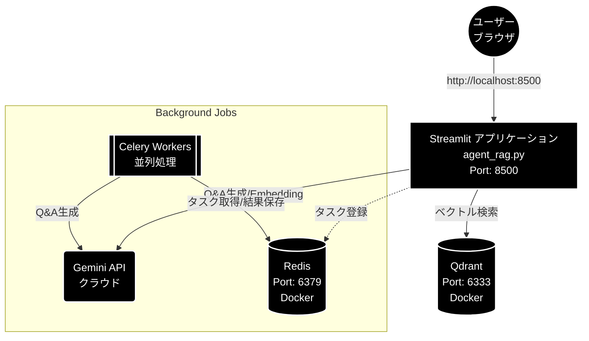

# インストール・環境構築ガイド

本ドキュメントでは、RAG Q&A生成システムの環境構築から agent_rag.py の起動までの手順を解説します。

## 目次

- [1. はじめに](#1-はじめに)
  - [1.1 本ドキュメントの目的](#11-本ドキュメントの目的)
  - [1.2 システム構成図](#12-システム構成図)
  - [1.3 前提条件・動作環境](#13-前提条件動作環境)
- [2. Python環境構築](#2-python環境構築)
  - [2.1 Pythonインストール(3.10+)](#21-pythonインストール310)
  - [2.2 仮想環境の作成](#22-仮想環境の作成)
  - [2.3 依存パッケージのインストール](#23-依存パッケージのインストール)
  - [2.4 MeCabのインストール(日本語処理用)](#24-mecabのインストール日本語処理用)
- [3. 環境変数設定](#3-環境変数設定)
  - [3.1 .envファイルの作成](#31-envファイルの作成)
  - [3.2 Gemini API Keyの取得・設定](#32-gemini-api-keyの取得設定)
  - [3.3 設定項目一覧](#33-設定項目一覧)
  - [3.4 設定確認](#34-設定確認)
- [4. Dockerサービス起動](#4-dockerサービス起動)
  - [4.1 Docker/Docker Composeのインストール](#41-dockerdocker-composeのインストール)
  - [4.2 Qdrant + Redisの起動](#42-qdrant--redisの起動)
  - [4.3 サービス確認方法](#43-サービス確認方法)
  - [4.4 Docker トラブルシューティング](#44-docker-トラブルシューティング)
- [5. Celery並列処理環境](#5-celery並列処理環境)
  - [5.1 Celery概要(なぜ必要か)](#51-celery概要なぜ必要か)
  - [5.2 Celery設定ファイルの解説](#52-celery設定ファイルの解説)
  - [5.3 Celeryワーカーの起動](#53-celeryワーカーの起動)
  - [5.4 start_celery.sh の使い方](#54-start_celerysh-の使い方)
  - [5.5 Redisキャッシュのクリア](#55-redisキャッシュのクリア)
  - [5.6 Flower監視UI(オプション)](#56-flower監視uiオプション)
  - [5.7 Celery動作確認](#57-celery動作確認)
- [6. アプリケーション起動](#6-アプリケーション起動)
  - [6.1 ディレクトリ準備](#61-ディレクトリ準備)
  - [6.2 agent_rag.py の起動](#62-rag_qa_pair_qdrantpy-の起動)
  - [6.3 ブラウザでのアクセス確認](#63-ブラウザでのアクセス確認)
- [7. 起動チェックリスト](#7-起動チェックリスト)
  - [7.1 全サービス確認コマンド](#71-全サービス確認コマンド)
  - [7.2 正常起動時の状態](#72-正常起動時の状態)
  - [7.3 起動スクリプト(一括起動)](#73-起動スクリプト一括起動)
- [8. トラブルシューティング](#8-トラブルシューティング)
  - [8.1 よくあるエラーと対処法](#81-よくあるエラーと対処法)
  - [8.2 ログの確認方法](#82-ログの確認方法)
  - [8.3 サービス再起動手順](#83-サービス再起動手順)
- [付録](#付録)
  - [A. コマンドリファレンス](#a-コマンドリファレンス)
  - [B. ポート一覧](#b-ポート一覧)
  - [C. 環境変数一覧](#c-環境変数一覧)
  - [D. ファイル構成](#d-ファイル構成)

---

## 1. はじめに

### 1.1 本ドキュメントの目的

本ドキュメントは以下を目的とします:

- Python環境の構築
- 依存パッケージのインストール
- Docker(Qdrant, Redis)のセットアップ
- Celery並列処理環境の構築
- 統合アプリケーションの起動

### 1.2 システム構成図



### 1.3 前提条件・動作環境

| 項目 | 要件 |
|------|------|
| OS | macOS / Linux / Windows (WSL2推奨) |
| Python | 3.10 以上 |
| Docker | Docker Desktop または Docker Engine |
| メモリ | 8GB 以上推奨 |
| ディスク | 10GB 以上の空き容量 |

---

## 2. Python環境構築

### 2.1 Pythonインストール(3.10+)

#### macOS

```bash
# Homebrewでインストール
brew install python@3.11

# バージョン確認
python3 --version
# Python 3.11.x
```

#### Ubuntu/Debian

```bash
sudo apt update
sudo apt install python3.11 python3.11-venv python3-pip
```

#### Windows

Python公式サイト(<https://www.python.org/downloads/)からインストーラをダウンロードしてインストール。>

### 2.2 仮想環境の作成

#### venv(推奨)

```bash
# プロジェクトディレクトリに移動
cd /path/to/gemini_rag_qa

# 仮想環境を作成
python3 -m venv .venv

# 仮想環境を有効化
# macOS/Linux
source venv/bin/activate

# Windows
.\venv\Scripts\activate

# 有効化確認(プロンプトに(venv)が表示される)
(venv) $ which python
/path/to/gemini_rag_qa/venv/bin/python
```

#### conda(代替)

```bash
# 環境作成
conda create -n rag_qa python=3.11

# 環境有効化
conda activate rag_qa
```

### 2.3 依存パッケージのインストール

```bash
# 仮想環境が有効化されていることを確認
(venv) $ pip install --upgrade pip

# requirements.txtからインストール (Celery, Gemini, Qdrant等)
(venv) $ pip install -r requirements.txt

# requirements.txtに含まれていないパッケージをインストール
(venv) $ pip install streamlit mecab-python3
```

**主要パッケージ:**

| パッケージ | バージョン | 用途 |
|-----------|-----------|------|
| google-generativeai | 0.8.0 | Gemini API クライアント |
| streamlit | 1.48.1 | Web UI フレームワーク |
| qdrant-client | 1.16.1 | Qdrant クライアント |
| redis | 7.1.0 | Redis クライアント |
| pandas | 2.3.3 | データ処理 |
| tiktoken | 0.12.0 | トークンカウント |
| mecab-python3 | 1.0.10 | 形態素解析 |
| celery | 5.5.3 | タスクキュー・並列処理 |
| kombu | 5.5.4 | メッセージング |
| flower | 2.0.1 | Celery監視UI |

### 2.4 MeCabのインストール(日本語処理用)

mecab-python3 はPythonバインディングのみのため、MeCab本体と辞書のインストールが必要です。

#### macOS

```bash
# MeCab本体と辞書をインストール
brew install mecab mecab-ipadic

# 動作確認
echo "日本語の形態素解析" | mecab
```

#### Ubuntu/Debian

```bash
sudo apt install mecab libmecab-dev mecab-ipadic-utf8

# 動作確認
echo "日本語の形態素解析" | mecab
```

#### 動作確認(Python)

```python
import MeCab
tagger = MeCab.Tagger()
print(tagger.parse("日本語の形態素解析"))
```

---

## 3. 環境変数設定

### 3.1 .envファイルの作成

プロジェクトルートに .env ファイルを作成します。

```bash
# .env ファイルを作成
touch .env
```

### 3.2 Gemini API Keyの取得・設定

1. Google AI Studio(<https://aistudio.google.com/)にアクセス>
2. API Keys ページで新しいキーを作成
3. .env ファイルに記載

```bash
# .env ファイルの内容
GEMINI_API_KEY=AIzaxxxxxxxxxxxxxxxxxxxxxxxxxxxxxxxxxxxxxxxx
```

### 3.3 設定項目一覧

.env ファイルで設定可能な項目:

```bash
# === 必須 ===
GEMINI_API_KEY=AIzaxxxxxxxxxxxxxxxxxxxxxxxxxxxxxxxxxxxxxxxx

# === オプション ===
# Qdrant URL(デフォルト: http://localhost:6333)
QDRANT_URL=http://localhost:6333

# Redis URL(デフォルト: redis://localhost:6379/0)
REDIS_URL=redis://localhost:6379/0

# ログレベル(デフォルト: INFO)
LOG_LEVEL=INFO
```

### 3.4 設定確認

```bash
# 環境変数が読み込まれることを確認
python -c "from dotenv import load_dotenv; import os; load_dotenv(); print('GEMINI_API_KEY:', 'Set' if os.getenv('GEMINI_API_KEY') else 'Not Set')"
```

---

## 4. Dockerサービス起動

### 4.1 Docker/Docker Composeのインストール

#### macOS

Docker Desktop for Mac(<https://www.docker.com/products/docker-desktop/)をインストール。>

#### Ubuntu/Debian

```bash
# Docker Engine インストール
sudo apt update
sudo apt install docker.io docker-compose-plugin

# ユーザーをdockerグループに追加(再ログイン必要)
sudo usermod -aG docker $USER
```

#### 動作確認

```bash
docker --version
docker compose version
```

### 4.2 Qdrant + Redisの起動

```bash
# docker-composeディレクトリに移動
cd docker-compose

# サービス起動(バックグラウンド)
docker compose up -d

# 起動確認
docker compose ps
```

**期待される出力:**

```
NAME                    IMAGE                 STATUS              PORTS
docker-compose-qdrant-1 qdrant/qdrant:latest  Up (healthy)        0.0.0.0:6333->6333/tcp
docker-compose-redis-1  redis:7-alpine        Up (healthy)        0.0.0.0:6379->6379/tcp
```

### 4.3 サービス確認方法

#### Qdrant

```bash
# ヘルスチェック
curl http://localhost:6333/health

# コレクション一覧
curl http://localhost:6333/collections
```

**ブラウザでも確認可能:** <http://localhost:6333/dashboard>

#### Redis

```bash
# 接続テスト
redis-cli ping
# PONG

# 情報確認
redis-cli info server | head -5
```

### 4.4 Docker トラブルシューティング

| 問題 | 原因 | 対処法 |
|------|------|--------|
| port already in use | ポート競合 | 既存プロセスを停止するか、ポート変更 |
| permission denied | Docker権限なし | sudo usermod -aG docker $USER 後に再ログイン |
| コンテナが起動しない | リソース不足 | Docker Desktopのメモリ割り当てを増加 |

```bash
# サービス停止
docker compose down

# ログ確認
docker compose logs qdrant
docker compose logs redis

# 完全にリセット(データも削除)
docker compose down -v
docker compose up -d
```

---

## 5. Celery並列処理環境

### 5.1 Celery概要(なぜ必要か)

Q&A生成処理では、Gemini APIを大量に呼び出します。同期処理では:

- 1000チャンク x 3秒/チャンク = 50分

Celery並列処理(24ワーカー)では:

- 1000チャンク / 24ワーカー = 2-3分

**並列化により処理時間を大幅に短縮できます。**

### 5.2 Celery設定ファイルの解説

celery_config.py の主要設定:

```python
# Redis接続
broker_url = 'redis://localhost:6379/0'
result_backend = 'redis://localhost:6379/0'

# ワーカー設定
worker_prefetch_multiplier = 1    # 一度に取得するタスク数
worker_max_tasks_per_child = 50   # メモリリーク対策

# タイムアウト設定
task_time_limit = 300             # 5分
task_soft_time_limit = 270        # 4.5分

# リトライ設定
task_retry_kwargs = {
    'max_retries': 3,
    'countdown': 60,              # 60秒後にリトライ
}
```

### 5.3 Celeryワーカーの起動

#### 方法1: start_celery.sh を使用(推奨)

```bash
# 実行権限を付与(初回のみ)
chmod +x start_celery.sh

# ワーカー起動(24ワーカー)
# ※PCのスペック(CPUコア数/メモリ)に合わせて調整してください(例: 4~8)
./start_celery.sh start -w 24

# ステータス確認
./start_celery.sh status

# 停止
./start_celery.sh stop

# 再起動
./start_celery.sh restart -w 24
```

#### 方法2: 直接起動

```bash
# Celeryワーカーを直接起動
celery -A celery_tasks worker \
    --loglevel=info \
    --concurrency=24 \
    --pool=prefork \
    --queues=qa_generation
```

### 5.4 start_celery.sh の使い方

```bash
Usage: ./start_celery.sh [start|stop|status|restart] [options]

Commands:
  start    Celeryワーカーを起動
  stop     Celeryワーカーを停止
  status   ワーカーのステータスを確認
  restart  ワーカーを再起動

Options:
  -w, --workers NUM    ワーカー数(デフォルト: 8)
  -l, --loglevel LEVEL ログレベル(debug|info|warning|error)

Example:
  ./start_celery.sh start -w 24     # 24ワーカーで起動
  ./start_celery.sh status          # ステータス確認
```

### 5.5 Redisキャッシュのクリア

タスクが滞留している場合や、再起動時にクリアすることを推奨:

```bash
# Redisキャッシュをクリアしてワーカー再起動
redis-cli FLUSHDB && ./start_celery.sh restart -w 24
```

### 5.6 Flower監視UI(オプション)

Flowerを使用すると、Celeryタスクの状態をWebブラウザで監視できます。

```bash
# Flower起動
celery -A celery_config flower --port=5555
```

**ブラウザでアクセス:** <http://localhost:5555>

Flower画面で確認できる情報:

- アクティブなワーカー一覧
- タスクの実行状況
- 成功/失敗の統計
- タスクの詳細ログ

### 5.7 Celery動作確認

```bash
# 1. ワーカーステータス確認
./start_celery.sh status

# 期待される出力:
# Redis: (ok) 起動中
# キュー長: 0
# ワーカー: (ok) 起動中

# 2. Celery inspectコマンドで詳細確認
celery -A celery_tasks inspect active
celery -A celery_tasks inspect stats
```

---

## 6. アプリケーション起動

### 6.1 ディレクトリ準備

アプリケーションが使用するディレクトリを作成します:

```bash
# 必要なディレクトリを作成
mkdir -p datasets OUTPUT qa_output logs
```

| ディレクトリ | 用途 |
|-------------|------|
| datasets/ | ダウンロードした生データ |
| OUTPUT/ | 前処理済みデータ |
| qa_output/ | 生成されたQ&Aペア |
| logs/ | Celeryログファイル |

### 6.2 agent_rag.py の起動

```bash
# 仮想環境が有効化されていることを確認
(venv) $ streamlit run agent_rag.py --server.port=8500
```

**起動メッセージ:**

```
  You can now view your Streamlit app in your browser.

  Local URL: http://localhost:8500
  Network URL: http://192.168.x.x:8500
```

### 6.3 ブラウザでのアクセス確認

1. ブラウザで <http://localhost:8500> を開く
2. サイドバーで「説明」画面を選択
3. データフロー図が表示されれば正常起動

---

## 7. 起動チェックリスト

### 7.1 全サービス確認コマンド

以下のコマンドで全サービスの状態を確認できます:

```bash
# === 1. Dockerサービス ===
echo "=== Docker Services ==="
docker compose -f docker-compose/docker-compose.yml ps

# === 2. Qdrant ===
echo "=== Qdrant ==="
curl -s http://localhost:6333/health && echo " OK" || echo " NG"

# === 3. Redis ===
echo "=== Redis ==="
redis-cli ping

# === 4. Celeryワーカー ===
echo "=== Celery Workers ==="
./start_celery.sh status

# === 5. 環境変数 ===
echo "=== Environment ==="
python -c "from dotenv import load_dotenv; import os; load_dotenv(); print('GEMINI_API_KEY:', 'Set' if os.getenv('GEMINI_API_KEY') else 'Not Set')"
```

### 7.2 正常起動時の状態

| サービス | ポート | 確認方法 | 正常時の応答 |
|---------|--------|---------|-------------|
| Streamlit | 8500 | ブラウザアクセス | 画面表示 |
| Qdrant | 6333 | curl localhost:6333/health | {"status":"ok"} |
| Redis | 6379 | redis-cli ping | PONG |
| Celery | - | ./start_celery.sh status | ワーカー: (ok) 起動中 |

### 7.3 起動スクリプト(一括起動)

全サービスを一括で起動するスクリプト例:

```bash
#!/bin/bash
# start_all.sh - 全サービス起動

echo "1. Docker サービス起動..."
docker compose -f docker-compose/docker-compose.yml up -d

echo "2. サービス起動待機..."
sleep 5

echo "3. Celeryワーカー起動..."
redis-cli FLUSHDB
./start_celery.sh start -w 24

echo "4. Streamlit起動..."
streamlit run agent_rag.py --server.port=8500
```

---

## 8. トラブルシューティング

### 8.1 よくあるエラーと対処法

#### Qdrant接続エラー

**エラー:** Connection refused: localhost:6333

**対処:**

```bash
# Dockerサービス確認
docker compose -f docker-compose/docker-compose.yml ps

# 起動していない場合
docker compose -f docker-compose/docker-compose.yml up -d

# ログ確認
docker compose -f docker-compose/docker-compose.yml logs qdrant
```

#### Redis接続エラー

**エラー:** Error connecting to Redis

**対処:**

```bash
# Redisコンテナ確認
docker compose -f docker-compose/docker-compose.yml ps redis

# または、ローカルRedis起動(macOS)
brew services start redis
```

#### Celeryワーカーが起動しない

**エラー:** No module named 'celery_tasks'

**対処:**

```bash
# プロジェクトルートにいることを確認
pwd
# /path/to/gemini_rag_qa

# 仮想環境が有効化されていることを確認
which python
# /path/to/gemini_rag_qa/venv/bin/python

# celeryパッケージがインストールされていることを確認
pip show celery
```

#### Gemini API エラー

**エラー:** AuthenticationError: Incorrect API key

**対処:**

```bash
# .envファイルを確認
cat .env | grep GEMINI_API_KEY

# APIキーのフォーマット確認(AIzaで始まる)
# 空白や改行が含まれていないか確認
```

#### Gemini API 429エラー (Resource Exhausted)

**エラー:** 429 Resource has been exhausted (e.g. check quota).

**対処:**

* **原因**: APIのレート制限(RPM/TPM)を超過しています。
* **対策**:
    1. Celeryのワーカー数を減らす (`./start_celery.sh restart -w 4`)
    2. `celery_rate_limit_fix.py` (もしあれば) を適用するか、リトライ設定を確認する
    3. Pay-as-you-goプランへの移行を検討する

#### MeCabエラー

**エラー:** MeCab: Failed to initialize

**対処:**

```bash
# macOS
brew install mecab mecab-ipadic

# Ubuntu
sudo apt install mecab libmecab-dev mecab-ipadic-utf8

# 辞書パスの確認
mecab-config --dicdir
```

### 8.2 ログの確認方法

```bash
# Celeryログ
tail -f logs/celery_qa_*.log

# Dockerログ
docker compose -f docker-compose/docker-compose.yml logs -f

# Streamlitログ(コンソール出力)
# 起動時のターミナルに表示される
```

### 8.3 サービス再起動手順

問題が解決しない場合、以下の順序で再起動:

```bash
# 1. 全サービス停止
./start_celery.sh stop
docker compose -f docker-compose/docker-compose.yml down

# 2. キャッシュクリア
redis-cli FLUSHALL 2>/dev/null || true

# 3. 再起動
docker compose -f docker-compose/docker-compose.yml up -d
sleep 5
./start_celery.sh start -w 24

# 4. アプリケーション起動
streamlit run agent_rag.py --server.port=8500
```

---

## 付録

### A. コマンドリファレンス

#### 環境構築

```bash
# 仮想環境作成・有効化
python3 -m venv venv
source venv/bin/activate  # macOS/Linux

# パッケージインストール
pip install -r requirements.txt
pip install streamlit mecab-python3
```

#### Docker操作

```bash
# 起動
docker compose -f docker-compose/docker-compose.yml up -d

# 停止
docker compose -f docker-compose/docker-compose.yml down

# ログ確認
docker compose -f docker-compose/docker-compose.yml logs -f

# 完全リセット(データ削除)
docker compose -f docker-compose/docker-compose.yml down -v
```

#### Celery操作

```bash
# ワーカー起動
./start_celery.sh start -w 24

# ワーカー停止
./start_celery.sh stop

# ステータス確認
./start_celery.sh status

# キャッシュクリア + 再起動
redis-cli FLUSHDB && ./start_celery.sh restart -w 24

# Flower監視
celery -A celery_config flower --port=5555
```

#### アプリケーション起動

```bash
# 統合アプリ起動
streamlit run agent_rag.py --server.port=8500

# CLI版Q&A生成
python a02_make_qa_para.py --dataset cc_news --use-celery --celery-workers 24
```

### B. ポート一覧

| サービス | ポート | 用途 |
|---------|--------|------|
| Streamlit | 8500 | Web UI |
| Qdrant | 6333 | ベクトルDB API |
| Qdrant Dashboard | 6333 | 管理画面 |
| Redis | 6379 | Celeryブローカー |
| Flower | 5555 | Celery監視UI |

### C. 環境変数一覧

| 変数名 | 必須 | デフォルト | 説明 |
|-------|------|-----------|------|
| GEMINI_API_KEY | Yes | - | Gemini API キー |
| QDRANT_URL | No | <http://localhost:6333> | Qdrant URL |
| REDIS_URL | No | redis://localhost:6379/0 | Redis URL |
| LOG_LEVEL | No | INFO | ログレベル |

### D. ファイル構成

```
gemini_rag_qa/
├── .env                      # 環境変数(作成必要)
├── requirements.txt          # Python依存パッケージ
├── agent_rag.py     # 統合アプリ
├── celery_config.py          # Celery設定
├── celery_tasks.py           # Celeryタスク定義
├── start_celery.sh           # Celery起動スクリプト
├── docker-compose/
│   └── docker-compose.yml    # Docker設定
├── datasets/                 # ダウンロードデータ
├── OUTPUT/                   # 前処理済みデータ
├── qa_output/                # Q&Aペア出力
└── logs/                     # ログファイル
```

---

## 更新履歴

| 日付 | 変更内容 |
|------|---------|
| 2025-11-28 | 初版作成 |
| 2025-12-03 | 構成図のMermaid化、トラブルシューティング追記 |
