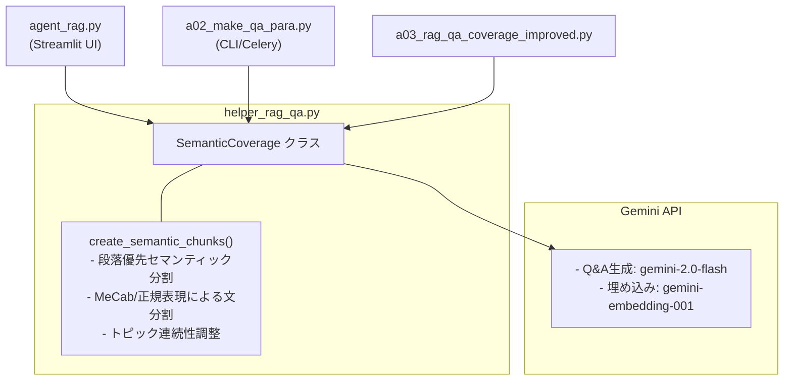
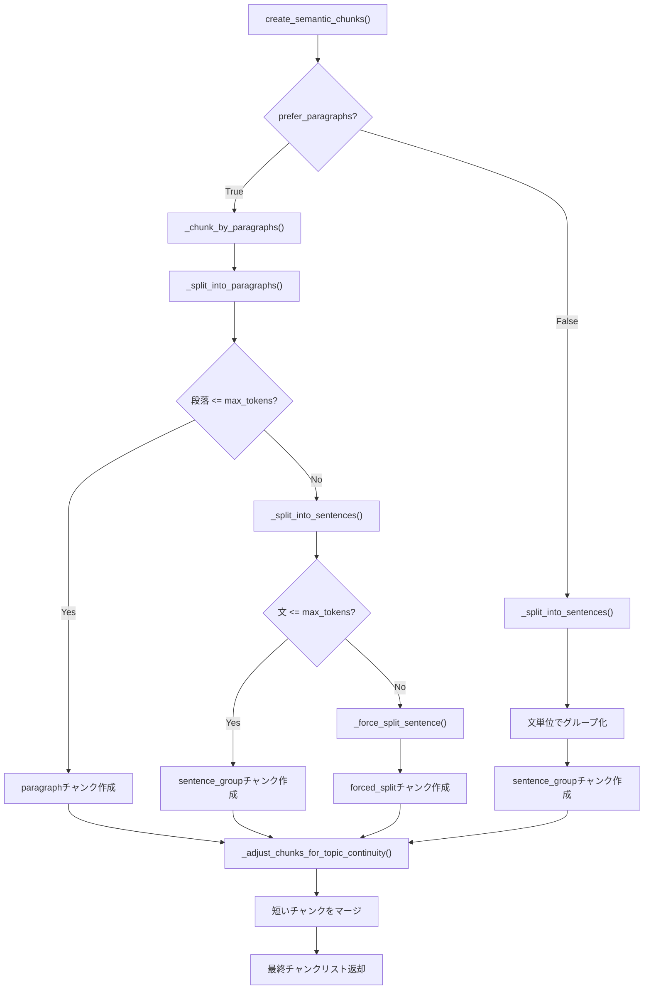

# チャンク分割技術ドキュメント

本ドキュメントでは、RAG Q&A生成システムで使用しているチャンク分割技術について解説します。

## 目次

- [1. システム概要](#1-システム概要)
  - [1.1 チャンク分割の役割](#11-チャンク分割の役割)
  - [1.2 システム構成図](#12-システム構成図)
- [2. 関連ファイル一覧](#2-関連ファイル一覧)
  - [2.1 agent_rag.py](#21-rag_qa_pair_qdrantpy)
  - [2.2 a02_make_qa_para.py](#22-a02_make_qa_parapy)
  - [2.3 a03_rag_qa_coverage_improved.py](#23-a03_rag_qa_coverage_improvedpy)
- [3. SemanticCoverageクラス詳細](#3-semanticcoverageクラス詳細)
  - [3.1 クラス概要](#31-クラス概要)
  - [3.2 主要メソッド一覧](#32-主要メソッド一覧)
- [4. チャンク分割処理フロー](#4-チャンク分割処理フロー)
  - [4.1 メイン処理フロー](#41-メイン処理フロー)
  - [4.2 段落分割処理](#42-段落分割処理)
  - [4.3 文分割処理](#43-文分割処理)
  - [4.4 強制分割処理](#44-強制分割処理)
  - [4.5 トピック連続性調整](#45-トピック連続性調整)
- [5. 実装コード解説](#5-実装コード解説)
  - [5.1 定数と設定値](#51-定数と設定値)
  - [5.2 SemanticCoverageクラスの初期化](#52-semanticcoverageクラスの初期化)
  - [5.3 create_semantic_chunks()](#53-create_semantic_chunks)
  - [5.4 段落分割の実装](#54-段落分割の実装)
  - [5.5 文分割の実装](#55-文分割の実装)
  - [5.6 MeCabによる文分割](#56-mecabによる文分割)
  - [5.7 トピック連続性調整の実装](#57-トピック連続性調整の実装)
- [6. チャンクタイプと設計思想](#6-チャンクタイプと設計思想)

---

## 1. システム概要

### 1.1 チャンク分割の役割

チャンク分割は、RAGシステムにおいて以下の重要な役割を果たします：

1. **適切なサイズへの分割**: 文書を埋め込みモデル（Gemini Embedding）の最適入力長に収める
2. **意味的一貫性の維持**: 段落・文の境界を尊重し、文脈の断絶を防ぐ
3. **Q&A生成品質の向上**: 意味的にまとまったチャンクから高品質なQ&Aを生成
4. **検索精度の向上**: 適切なサイズのチャンクでセマンティック検索の精度を確保

### 1.2 システム構成図



---

## 2. 関連ファイル一覧

### 2.1 agent_rag.py

Streamlit UIアプリケーションのエントリポイントです。

| 項目 | 内容 |
|------|------|
| 役割 | 統合RAGツールのUI提供 |
| チャンク分割 | 内部で `a02_make_qa_para.py` を呼び出し |
| 画面構成 | 説明/DL/Q&A生成/Qdrant登録/表示/検索 |

```
agent_rag.py
├── services/
│   ├── dataset_service.py   # データ取得・前処理
│   ├── qa_service.py        # Q&A生成（a02_make_qa_para.py連携）
│   └── qdrant_service.py    # Qdrant操作
└── ui/pages/
    └── qa_generation_page.py  # Q&A生成UI
```

### 2.2 a02_make_qa_para.py

CLI/Celery対応のQ&Aペア自動生成システムです。

| 項目 | 内容 |
|------|------|
| 役割 | バッチ処理によるQ&Aペア生成 |
| チャンク分割 | `SemanticCoverage.create_semantic_chunks()` を使用 |
| 特徴 | Celery並列処理、小チャンク統合、カバレージ分析 |

**チャンク分割フロー:**

```
a02_make_qa_para.py
│
├── create_document_chunks() (756行目)
│   └── DataFrameの各文書をチャンク化
│
├── create_semantic_chunks() (487行目) [ローカルラッパー]
│   └── SemanticCoverage.create_semantic_chunks() を呼び出し
│       ├── prefer_paragraphs=True（段落優先）
│       ├── max_tokens: 指定値
│       └── min_tokens=50
│
└── merge_small_chunks() (819行目)
    └── min_tokens未満のチャンクを統合
```

### 2.3 a03_rag_qa_coverage_improved.py

高品質Q&A生成とカバレージ分析システムです。

| 項目 | 内容 |
|------|------|
| 役割 | 品質重視のQ&A生成・カバレージ分析 |
| チャンク分割 | `SemanticCoverage` クラスを直接インポート |
| 特徴 | 複雑度分析、品質スコアリング、多段階カバレージ |

---

## 3. SemanticCoverageクラス詳細

### 3.1 クラス概要

**ソース:** `helper_rag_qa.py:1485`

```python
class SemanticCoverage:
    """意味的な網羅性を測定するクラス（Gemini API使用）"""

    def __init__(self, embedding_model="gemini-embedding-001"):
        self.embedding_model = embedding_model
        self.embedding_client = create_embedding_client(provider="gemini")
        self.embedding_dims = get_embedding_dimensions("gemini")  # 3072
        self.tokenizer = tiktoken.get_encoding("cl100k_base")
        self.mecab_available = self._check_mecab_availability()
```

### 3.2 主要メソッド一覧

| メソッド | 行番号 | 役割 |
|---------|--------|------|
| `create_semantic_chunks()` | 1510 | メイン分割関数（段落優先） |
| `_split_into_paragraphs()` | 1605 | 段落分割（\n\n区切り） |
| `_chunk_by_paragraphs()` | 1620 | 段落ベースのチャンク化 |
| `_split_into_sentences()` | 1710 | 文分割（MeCab/正規表現自動切替） |
| `_split_sentences_mecab()` | 1730 | MeCabによる日本語文分割 |
| `_force_split_sentence()` | 1682 | 長文の強制分割（最終手段） |
| `_adjust_chunks_for_topic_continuity()` | 1764 | トピック連続性の調整 |
| `generate_embeddings()` | 1806 | チャンクの埋め込み生成 |
| `generate_embeddings_batch()` | 1862 | バッチ埋め込み生成 |

---

## 4. チャンク分割処理フロー

### 4.1 メイン処理フロー



**処理の流れ:**

1. `prefer_paragraphs=True`（デフォルト）の場合、段落境界を最優先で分割
2. 段落が `max_tokens` を超える場合のみ文単位に再分割
3. 単一の文が `max_tokens` を超える場合は強制的にトークン単位で分割
4. 最後にトピック連続性を考慮して短いチャンクをマージ

### 4.2 段落分割処理

**ソース:** `helper_rag_qa.py:1605-1618`

段落は筆者が意図的に作った意味的なまとまりであり、最も重要なセマンティック境界です。

```
入力テキスト
    │
    ▼
┌──────────────────────────────┐
│ _split_into_paragraphs()     │
│                              │
│ 正規表現: r'\n\s*\n'         │
│ （空行で段落を分割）          │
└──────────────────────────────┘
    │
    ▼
段落のリスト ["段落1", "段落2", ...]
```

### 4.3 文分割処理

**ソース:** `helper_rag_qa.py:1710-1728`

```
入力テキスト
     │
     ▼
┌─────────────────────────────────────┐
│  _split_into_sentences()            │
│  ┌───────────────────────────────┐  │
│  │ 日本語判定（先頭100文字）     │  │
│  └───────────────────────────────┘  │
│       │                             │
│   日本語？ ─── NO ─────────────────────────────┐
│       │YES                          │          │
│       ▼                             │          │
│  MeCab利用可？ ─ NO ───────────────────────────┤
│       │YES                          │          │
│       ▼                             │          ▼
│  _split_sentences_mecab()           │   正規表現で分割
│                                     │   (?<=[。．.!?])\s*
└─────────────────────────────────────┘
```

**日本語判定の仕組み:**

```python
is_japanese = bool(re.search(r'[\u3040-\u309F\u30A0-\u30FF\u4E00-\u9FFF]', text[:100]))
```

| Unicode範囲 | 文字種 | 例 |
|------------|--------|-----|
| `\u3040-\u309F` | ひらがな | あ、い、う、を、ん |
| `\u30A0-\u30FF` | カタカナ | ア、イ、ウ、ヲ、ン |
| `\u4E00-\u9FFF` | 漢字 | 日、本、語 |

### 4.4 強制分割処理

**ソース:** `helper_rag_qa.py:1682-1708`

単一の文が `max_tokens` を超える場合の最終手段です。

```
入力: 超長文（500トークン）
max_tokens=200 の場合:

→ チャンク1: 最初の200トークン (type='forced_split')
→ チャンク2: 次の200トークン   (type='forced_split')
→ チャンク3: 残りの100トークン (type='forced_split')
```

⚠️ `forced_split` チャンクは意味的な境界を無視するため、Q&A生成品質が低下する可能性があります。

### 4.5 トピック連続性調整

**ソース:** `helper_rag_qa.py:1764-1804`

短すぎるチャンクを前のチャンクにマージし、意味的なまとまりを維持します。

```
入力チャンク列
[チャンク1: 150トークン] [チャンク2: 30トークン] [チャンク3: 180トークン]
                              ↑
                         min_tokens(50)未満
                              │
                              ▼
                    前のチャンクとマージ検討
                              │
              ┌───────────────┴───────────────┐
              ▼                               ▼
    結合後 <= 300トークン？           結合後 > 300トークン？
              │                               │
              ▼                               ▼
         マージ実行                    独立チャンク維持
              │
              ▼
[チャンク1+2: 180トークン] [チャンク3: 180トークン]
```

---

## 5. 実装コード解説

### 5.1 定数と設定値

**ソース:** `helper_text.py:27-33`

```python
# デフォルトのチャンクサイズ設定
DEFAULT_CHUNK_SIZE = 300      # トークン数（Embeddingモデルの最適入力長）
DEFAULT_CHUNK_OVERLAP = 50    # オーバーラップトークン数（文脈の連続性確保）
DEFAULT_MIN_CHUNK_SIZE = 50   # 最小チャンクサイズ（Q/A生成に必要な最低限の文脈）

# デフォルトの埋め込みモデル用エンコーディング
DEFAULT_ENCODING = "cl100k_base"  # GPT-4/Gemini用トークナイザ
```

| 定数 | 値 | 設計根拠 |
|-----|-----|---------|
| `DEFAULT_CHUNK_SIZE` | 300 | Gemini Embeddingの推奨入力長を考慮 |
| `DEFAULT_CHUNK_OVERLAP` | 50 | チャンク境界での文脈喪失を防止 |
| `DEFAULT_MIN_CHUNK_SIZE` | 50 | Q/A生成に最低限必要な文脈量 |

### 5.2 SemanticCoverageクラスの初期化

**ソース:** `helper_rag_qa.py:1485-1508`

```python
class SemanticCoverage:
    """意味的な網羅性を測定するクラス（Gemini API使用）"""

    def __init__(self, embedding_model="gemini-embedding-001"):
        self.embedding_model = embedding_model
        # Gemini埋め込みクライアントを使用
        self.embedding_client = create_embedding_client(provider="gemini")
        self.embedding_dims = get_embedding_dimensions("gemini")  # 3072
        self.has_api_key = self.embedding_client is not None
        self.tokenizer = tiktoken.get_encoding("cl100k_base")

        # MeCab利用可否チェック
        self.mecab_available = self._check_mecab_availability()

    def _check_mecab_availability(self) -> bool:
        """MeCabの利用可能性をチェック"""
        try:
            import MeCab
            tagger = MeCab.Tagger()
            tagger.parse("テスト")
            return True
        except (ImportError, RuntimeError):
            return False
```

### 5.3 create_semantic_chunks()

**ソース:** `helper_rag_qa.py:1510-1603`

```python
def create_semantic_chunks(self, document: str, max_tokens: int = 200, min_tokens: int = 50,
                           prefer_paragraphs: bool = True, verbose: bool = True) -> List[Dict]:
    """
    文書を意味的に区切られたチャンクに分割（段落優先のセマンティック分割）

    重要ポイント：
    1. 段落の境界で分割（最優先 - 筆者の意図したセマンティック境界）
    2. 文の境界で分割（意味の断絶を防ぐ）
    3. トピックの変化を検出
    4. 適切なサイズを維持（埋め込みモデルの制限内）

    Args:
        document: 分割対象の文書
        max_tokens: チャンクの最大トークン数（デフォルト: 200）
        min_tokens: チャンクの最小トークン数（デフォルト: 50）
        prefer_paragraphs: 段落ベースの分割を優先するか（デフォルト: True）
        verbose: 詳細な出力を行うか

    Returns:
        チャンク辞書のリスト（id, text, type, sentences等を含む）
    """
```

**返却されるチャンクの構造:**

```python
{
    "id": "chunk_0",
    "text": "チャンクのテキスト内容",
    "type": "paragraph",  # paragraph/sentence_group/forced_split/merged
    "sentences": ["文1", "文2", ...],
    "start_sentence_idx": 0,
    "end_sentence_idx": 2
}
```

### 5.4 段落分割の実装

**ソース:** `helper_rag_qa.py:1605-1618`

```python
def _split_into_paragraphs(self, text: str) -> List[str]:
    """
    段落単位で分割（セマンティック分割の最優先レベル）
    """
    # 空行（\n\n）で段落を分割
    paragraphs = re.split(r'\n\s*\n', text)

    # 空白のみの段落を除外
    paragraphs = [p.strip() for p in paragraphs if p.strip()]

    return paragraphs
```

**正規表現 `\n\s*\n` の解説:**

| パターン | 意味 |
|---------|------|
| `\n` | 改行 |
| `\s*` | 0個以上の空白（空行内のスペース/タブを許容） |
| `\n` | 改行 |

### 5.5 文分割の実装

**ソース:** `helper_rag_qa.py:1710-1728`

```python
def _split_into_sentences(self, text: str) -> List[str]:
    """文単位で分割（言語自動判定・MeCab優先対応）"""

    # 日本語判定（最初の100文字で判定）
    is_japanese = bool(re.search(r'[\u3040-\u309F\u30A0-\u30FF\u4E00-\u9FFF]', text[:100]))

    if is_japanese and self.mecab_available:
        # 日本語の場合、MeCab利用を優先（セマンティック精度向上）
        try:
            sentences = self._split_sentences_mecab(text)
            if sentences:
                return sentences
        except Exception:
            pass  # フォールバック

    # 英語 or MeCab失敗時: 正規表現
    sentences = re.split(r'(?<=[。．.!?])\s*', text)
    sentences = [s.strip() for s in sentences if s.strip()]
    return sentences
```

### 5.6 MeCabによる文分割

**ソース:** `helper_rag_qa.py:1730-1762`

```python
def _split_sentences_mecab(self, text: str) -> List[str]:
    """MeCabを使った文分割（日本語用）"""
    import MeCab

    tagger = MeCab.Tagger()
    node = tagger.parseToNode(text)

    sentences = []
    current_sentence = []

    while node:
        surface = node.surface

        if surface:
            current_sentence.append(surface)

            # 文末判定：句点（。）、疑問符（？）、感嘆符（！）
            if surface in ['。', '．', '？', '！', '?', '!']:
                sentence = ''.join(current_sentence).strip()
                if sentence:
                    sentences.append(sentence)
                current_sentence = []

        node = node.next

    # 最後の文を追加（句点なしで終わる場合）
    if current_sentence:
        sentence = ''.join(current_sentence).strip()
        if sentence:
            sentences.append(sentence)

    return sentences if sentences else []
```

**MeCabを優先する理由:**

正規表現だけだと誤分割が起きるケースがあります：

```
【正規表現の弱点】
「3.14は円周率です。」→ 「3」「14は円周率です。」（誤分割！）

【MeCabなら正しく分割】
「3.14は円周率です。」→ 「3.14は円周率です。」（正しい）
```

### 5.7 トピック連続性調整の実装

**ソース:** `helper_rag_qa.py:1764-1804`

```python
def _adjust_chunks_for_topic_continuity(self, chunks: List[Dict], min_tokens: int = 50) -> List[Dict]:
    """
    トピックの連続性を考慮してチャンクを調整（最小トークン数対応）
    """
    adjusted_chunks = []

    for i, chunk in enumerate(chunks):
        chunk_tokens = len(self.tokenizer.encode(chunk["text"]))

        # 最小トークン数以下の短いチャンクの場合
        if i > 0 and chunk_tokens < min_tokens:
            # 前のチャンクとマージを検討
            prev_chunk = adjusted_chunks[-1]
            combined_text = prev_chunk["text"] + " " + chunk["text"]
            combined_tokens = len(self.tokenizer.encode(combined_text))

            # マージしても最大トークン数（300）を超えない場合はマージ
            if combined_tokens < 300:
                prev_chunk["text"] = combined_text
                prev_chunk["sentences"].extend(chunk["sentences"])
                prev_chunk["end_sentence_idx"] = chunk["end_sentence_idx"]

                # typeの更新（異なるtypeがマージされた場合）
                if prev_chunk.get("type") != chunk.get("type"):
                    prev_chunk["type"] = "merged"

                continue

        adjusted_chunks.append(chunk)

    return adjusted_chunks
```

**マージ条件:**

| 条件 | チェック内容 |
|------|------------|
| 1 | `i > 0` - 最初のチャンクでない |
| 2 | `chunk_tokens < min_tokens` - 短すぎる |
| 3 | `combined_tokens < 300` - マージ後も上限以内 |

---

## 6. チャンクタイプと設計思想

### チャンクタイプ一覧

| type | 説明 | 生成元 |
|------|------|-------|
| `paragraph` | 段落がそのままチャンクになった | `_chunk_by_paragraphs()` |
| `sentence_group` | 複数の文をグループ化 | `_chunk_by_paragraphs()` / 文単位分割 |
| `forced_split` | 強制的にトークン分割 | `_force_split_sentence()` |
| `merged` | 異なるtypeがマージされた | `_adjust_chunks_for_topic_continuity()` |

### 設計思想まとめ

| 観点 | 設計 | 理由 |
|------|------|------|
| **段落優先** | `prefer_paragraphs=True` がデフォルト | 段落は筆者が意図した意味的境界 |
| **言語自動判定** | 先頭100文字でひらがな/カタカナ/漢字を検出 | 高速かつ十分な精度 |
| **MeCab優先** | 日本語ならMeCabを第一選択 | 形態素解析により「3.14」等の誤分割を防止 |
| **フォールバック** | MeCab失敗時は正規表現に切替 | MeCab未インストール環境でも動作 |
| **句読点保持** | 分割後も句点を文末に残す | 文の完全性を維持 |
| **短チャンクマージ** | min_tokens未満は前チャンクに統合 | 意味的まとまりと品質確保 |

### 推奨使い分け

| 用途 | 推奨メソッド |
|------|------------|
| Q/A生成、RAG検索 | `SemanticCoverage.create_semantic_chunks()` |
| 大量テキストの高速処理 | `helper_text.split_into_chunks()` |
| 既存チャンクの後処理 | `merge_small_chunks()` |

---

## 更新履歴

| 日付 | 変更内容 |
|------|---------|
| 2025-12-01 | Gemini API対応、行番号更新、構成再編 |
| 2025-11-28 | 初版作成 |