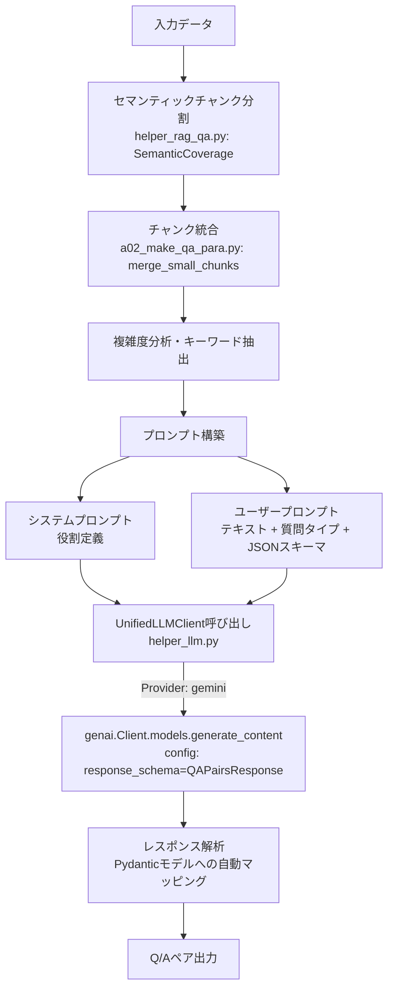

# RAG プロンプト設計・処理方式ドキュメント

本ドキュメントでは、RAG Q/A生成システムにおけるプロンプト設計と処理方式について解説する。
Geminiモデルへの移行と `UnifiedLLMClient` による抽象化を反映した最新版である。

## 目次

- [1. 概要](#1-概要)
  - [1.1 本ドキュメントの目的](#11-本ドキュメントの目的)
  - [1.2 関連ファイル一覧](#12-関連ファイル一覧)
  - [1.3 プロンプト処理フロー図](#13-プロンプト処理フロー図)
- [2. プロンプト設計の特徴](#2-プロンプト設計の特徴)
  - [2.1 2段階プロンプト構造](#21-2段階プロンプト構造)
  - [2.2 言語別対応](#22-言語別対応)
  - [2.3 動的プロンプト調整](#23-動的プロンプト調整)
  - [2.4 型安全な出力（UnifiedLLMClient）](#24-型安全な出力unifiedllmclient)
- [3. システムプロンプト設計](#3-システムプロンプト設計)
  - [3.1 日本語版システムプロンプト](#31-日本語版システムプロンプト)
  - [3.2 英語版システムプロンプト](#32-英語版システムプロンプト)
- [4. 質問タイプ階層構造](#4-質問タイプ階層構造)
- [5. ユーザープロンプト構築](#5-ユーザープロンプト構築)
- [6. チャンク前処理とプロンプト最適化](#6-チャンク前処理とプロンプト最適化)
- [7. API呼び出し方式（Gemini対応）](#7-api呼び出し方式gemini対応)
  - [7.1 UnifiedLLMClientによる抽象化](#71-unifiedllmclientによる抽象化)
  - [7.2 構造化出力（generate_structured）](#72-構造化出力generate_structured)
  - [7.3 モデル別パラメータ設定](#73-モデル別パラメータ設定)
- [8. Pydanticモデル定義](#8-pydanticモデル定義)
- [9. データセット別設定](#9-データセット別設定)

---

## 1. 概要

### 1.1 本ドキュメントの目的

本ドキュメントは以下を目的とする：

- Geminiモデル（`gemini-2.0-flash`等）を中心としたQ/A生成プロセスの理解
- `UnifiedLLMClient` を介したLLM抽象化レイヤーの仕様把握
- Pydanticモデルを使用した型安全な構造化出力の実装方法の理解

### 1.2 関連ファイル一覧


| ファイル              | 役割                          | 主要な処理                                        |
| --------------------- | ----------------------------- | ------------------------------------------------- |
| `a02_make_qa_para.py` | 主要なプロンプト処理・Q/A生成 | プロンプト構築、UnifiedLLMClient呼び出し          |
| `helper_llm.py`       | LLM抽象化レイヤー             | Gemini/OpenAI共通インターフェース、構造化出力制御 |
| `helper_api.py`       | 旧APIラッパー（互換性維持）   | OpenAIクライアント（一部機能で使用）              |
| `models.py`           | Pydanticモデル                | `QAPair`, `QAPairsResponse` 定義                  |
| `config.py`           | 設定管理                      | モデル設定、プロンプト定数                        |

### 1.3 プロンプト処理フロー図



---

## 2. プロンプト設計の特徴

### 2.1 2段階プロンプト構造

Gemini移行後も、**システムプロンプト**と**ユーザープロンプト**の概念的な分離は維持されています。

* **システムプロンプト**: LLMの役割（「教育コンテンツ作成の専門家」）と全般的なルールを定義。
* **ユーザープロンプト**: 具体的な処理対象テキスト、出力数、質問タイプ、JSON形式の指示を含みます。

※ `helper_llm.py` の `generate_structured` メソッドは `system_instruction` 引数をサポートしていますが、現在の `a02_make_qa_para.py` では、これらを結合して `prompt` として渡す実装パターンも見られます。

### 2.2 言語別対応

日本語（`ja`）と英語（`en`）でプロンプトテンプレートを切り替えます。
`config["lang"]` の設定に基づき、適切なテンプレートが選択されます。

### 2.3 動的プロンプト調整

チャンクのトークン数や複雑度に応じて、生成するQ/Aペア数（`num_pairs`）を動的に調整します。

* **Short (<100 tokens)**: 2-3ペア (Geminiの性能向上により増加)
* **Medium (<200 tokens)**: 基本数 + 1
* **Long**: 基本数 + 2~3
* **位置補正**: 文書後半のチャンクは +1

### 2.4 型安全な出力（UnifiedLLMClient）

`UnifiedLLMClient` は、プロバイダー（Gemini/OpenAI）に関わらず、Pydanticモデルを用いた型安全な出力を保証します。

* **Gemini**: `response_mime_type: "application/json"` と `response_schema` を使用し、JSONモードで生成後、Pydanticモデルにパースします。
* **OpenAI**: `response_format` (Structured Outputs) を使用します。

---

## 3. システムプロンプト設計

### 3.1 日本語版システムプロンプト

```text
あなたは教育コンテンツ作成の専門家です。
与えられた日本語テキストから、学習効果の高いQ&Aペアを生成してください。

生成ルール:
1. 質問は明確で具体的に
2. 回答は簡潔で正確に（1-2文程度）
3. テキストの内容に忠実に
4. 多様な観点から質問を作成
```

### 3.2 英語版システムプロンプト

```text
You are an expert in educational content creation.
Generate high-quality Q&A pairs from the given English text.

Generation rules:
1. Questions should be clear and specific
2. Answers should be concise and accurate (1-2 sentences)
3. Stay faithful to the text content
4. Create questions from diverse perspectives
```

---

## 4. 質問タイプ階層構造

`config.py` で定義された階層構造に基づき、プロンプト内では以下の簡略化されたタイプを指定します。

* **fact**: 事実確認型 (Definition, Identification)
* **reason**: 理由説明型 (Cause-Effect, Process)
* **comparison**: 比較型 (Comparison)
* **application**: 応用型 (Synthesis, Evaluation)

---

## 5. ユーザープロンプト構築

JSON形式での出力を明示的に指示します。PydanticモデルのスキーマがAPI側で適用される場合でも、プロンプト内で形式を例示することで精度が向上します。

**テンプレート例（日本語）:**

```text
以下のテキストから{num_pairs}個のQ&Aペアを生成してください。

質問タイプ:
- fact: 事実確認型（〜は何ですか？）
- reason: 理由説明型（なぜ〜ですか？）
- comparison: 比較型（〜と〜の違いは？）
- application: 応用型（〜はどのように活用されますか？）

テキスト:
{chunk_text}

JSON形式で出力:
{
  "qa_pairs": [
    {
      "question": "質問文",
      "answer": "回答文",
      "question_type": "fact/reason/comparison/application"
    }
  ]
}
```

### 5.1 プロンプト設計の効果例

具体的で構造化されたプロンプトを使用することで、回答の質がどのように変わるかの例です。

#### 悪いプロンプト例（指示が曖昧）

> このテキストからクイズを作って。
>
> テキスト: ...

**生成される可能性のある回答（制御不能）:**

> Q: この文章の主語は？
> A: 私
> *（※文脈がなく、単純すぎる。形式もバラバラで機械処理できない）*

#### 良いプロンプト例（本システム採用）

> 以下のテキストから教育的なQ&Aを生成してください。
>
> - 質問タイプ: 'reason' (なぜ〜ですか？)
> - 出力形式: JSON（スキーマに従うこと）
> - 回答は1-2文で簡潔に記述すること
>
> テキスト: ...

**生成される回答（高品質・構造化済み）:**

```json
{
  "question": "なぜ著者はRAGシステムにおいてセマンティックチャンク分割を推奨しているのですか？",
  "answer": "文脈の分断を防ぎ、検索精度を向上させるためです。",
  "question_type": "reason"
}
```

*（※目的が明確で、学習効果が高く、システムで即座に利用可能な形式）*

---

## 6. チャンク前処理とプロンプト最適化

### 6.1 セマンティックチャンク分割

`helper_rag_qa.py` の `SemanticCoverage` クラスを使用します。
埋め込みモデルには `text-embedding-3-small` (OpenAI) がデフォルトで使用されますが、LLMによる処理とは独立しています。

### 6.2 複雑度分析

`analyze_chunk_complexity` 関数により、専門用語の密度や文長を分析し、Q/A生成の難易度推定やキーワード抽出に利用します。

---

## 7. API呼び出し方式（Gemini対応）

### 7.1 UnifiedLLMClientによる抽象化

`helper_llm.py` が提供する `UnifiedLLMClient` により、モデルの違いを意識せずに実装可能です。

```python
from helper_llm import create_llm_client

# デフォルト（Gemini）クライアントの作成
client = create_llm_client(provider="gemini")
```

### 7.2 構造化出力（generate_structured）

Q/A生成の核心部分です。Pydanticモデルクラスを直接渡すことで、パース済みのオブジェクトを受け取ります。

```python
from models import QAPairsResponse

# プロンプトの結合（システム＋ユーザー）
combined_input = f"{system_prompt}\n\n{user_prompt}"

# 構造化出力の生成
response: QAPairsResponse = client.generate_structured(
    prompt=combined_input,
    response_schema=QAPairsResponse,
    model="gemini-2.0-flash",
    max_output_tokens=4000
)

# 結果の利用
for qa in response.qa_pairs:
    print(qa.question, qa.answer)
```

**Gemini特有の動作:**

* Gemini APIは `response_schema` を受け取り、JSONとして出力を強制します。
* `helper_llm.py` 内部で JSON 文字列をパースし、`QAPairsResponse` インスタンスに変換して返します。

### 7.3 モデル別パラメータ設定


| パラメータ            | Gemini (gemini-2.0-flash)             | OpenAI (gpt-4o)                        | 備考             |
| --------------------- | ------------------------------------- | -------------------------------------- | ---------------- |
| **temperature**       | 0.0 - 1.0 (デフォルトあり)            | 0.0 - 2.0                              | 生成の多様性制御 |
| **max_output_tokens** | 指定推奨 (例: 4000)                   | 指定推奨                               | 出力長制限       |
| **response_schema**   | `generate_content` の `config` で指定 | `responses.parse` の `response_format` | 構造化出力用     |
| **thinking_level**    | `gemini-3` 系のみ対応                 | 非対応                                 | 推論深さの制御   |

---

## 8. Pydanticモデル定義

`models.py` で定義されています。

```python
class QAPair(BaseModel):
    question: str = Field(..., description="質問文")
    answer: str = Field(..., description="回答文")
    question_type: str = Field(..., description="質問タイプ: fact/reason/comparison/application")
    # ... 他フィールド

class QAPairsResponse(BaseModel):
    qa_pairs: List[QAPair]
```

---

## 9. データセット別設定

`config.py` および `a02_make_qa_para.py` 内で定義されます。


| データセット      | 言語 | モデル (推奨)    | バッチサイズ | 特記事項                      |
| ----------------- | ---- | ---------------- | ------------ | ----------------------------- |
| **cc_news**       | en   | gemini-2.0-flash | 3-5          | 英語ニュース、構造的          |
| **wikipedia_ja**  | ja   | gemini-2.0-flash | 3            | 情報密度高                    |
| **livedoor**      | ja   | gemini-2.0-flash | 3-5          | 日本語ニュース                |
| **japanese_text** | ja   | gemini-2.0-flash | 3            | Webテキスト、品質ばらつきあり |

※ Gemini 2.0 Flash は高速かつ安価なため、バッチサイズを大きめ（3〜5）に設定しても効率的に処理可能です。

```

```
