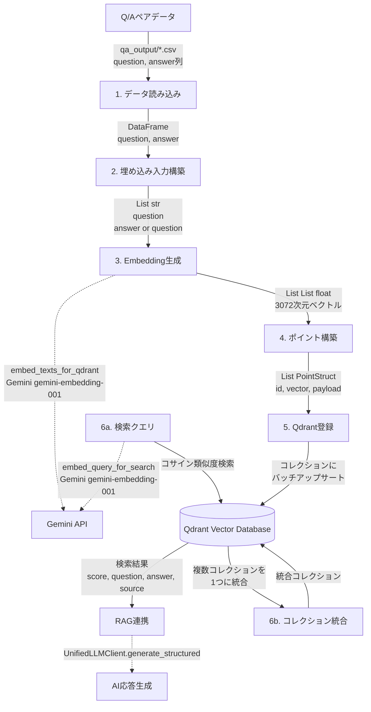

# Embedding・Qdrant登録・検索ドキュメント

本ドキュメントでは、Q/AペアデータのEmbedding（ベクトル化）、Qdrantへの登録、および検索処理について解説する。
Geminiモデルと `UnifiedLLMClient` への移行を反映した最新版である。

## 目次

- [1. 概要](#1-概要)
  - [1.1 本ドキュメントの位置づけ](#11-本ドキュメントの位置づけ)
  - [1.2 関連ファイル一覧](#12-関連ファイル一覧)
  - [1.3 データフロー図](#13-データフロー図)
- [2. Qdrantの主要な設定・処理・関数](#2-qdrantの主要な設定処理関数)
  - [2.1. 設定 (Configuration)](#21-設定-configuration)
  - [2.2. 検索 (Search)](#22-検索-search)
  - [2.3. 登録 (Registration)](#23-登録-registration)
  - [2.4. 削除 (Deletion)](#24-削除-deletion)
  - [2.5. 管理・確認 (Management & Inspection)](#25-管理確認-management--inspection)
- [3. Embedding（ベクトル化）](#3-embeddingベクトル化)
  - [3.1 使用モデルと設定（Gemini移行済み）](#31-使用モデルと設定gemini移行済み)
  - [3.2 embed_texts_for_qdrant() 関数の処理フロー](#32-embed_texts_for_qdrant-関数の処理フロー)
  - [3.3 バッチ処理とトークン制限](#33-バッチ処理とトークン制限)
  - [3.4 埋め込み入力の構築（question + answer）](#34-埋め込み入力の構築question--answer)
  - [3.5 空文字列・エッジケース処理](#35-空文字列エッジケース処理)
- [4. Qdrant登録](#4-qdrant登録)
  - [4.1 コレクション設計](#41-コレクション設計)
  - [4.2 ベクトルパラメータ設定](#42-ベクトルパラメータ設定)
  - [4.3 ポイント構造（PointStruct）](#43-ポイント構造pointstruct)
  - [4.4 ペイロードスキーマ](#44-ペイロードスキーマ)
  - [4.5 バッチアップサート処理](#45-バッチアップサート処理)
  - [4.6 ペイロードインデックス](#46-ペイロードインデックス)
- [5. コレクション統合](#5-コレクション統合)
  - [5.1 統合機能の概要](#51-統合機能の概要)
  - [5.2 scroll_all_points_with_vectors()](#52-scroll_all_points_with_vectors)
  - [5.3 merge_collections()](#53-merge_collections)
  - [5.4 統合時のペイロード拡張](#54-統合時のペイロード拡張)
- [6. 検索処理](#6-検索処理)
  - [6.1 クエリのベクトル化](#61-クエリのベクトル化)
  - [6.2 コサイン類似度検索](#62-コサイン類似度検索)
  - [6.3 検索結果の構造](#63-検索結果の構造)
  - [6.4 AI応答生成との連携（UnifiedLLMClient利用）](#64-ai応答生成との連携unifiedllmclient利用)
- [7. 運用・設定](#7-運用設定)
  - [7.1 Qdrant設定（QDRANT_CONFIG）](#71-qdrant設定qdrant_config)
  - [7.2 コレクション管理（CRUD）](#72-コレクション管理crud)
  - [7.3 ヘルスチェック](#73-ヘルスチェック)
  - [7.4 統計情報取得](#74-統計情報取得)
- [8. 付録](#8-付録)
  - [8.1 コレクション名とCSVファイルの対応表](#81-コレクション名とcsvファイルの対応表)
  - [8.2 コード参照一覧](#82-コード参照一覧)

---

## 1. 概要

### 1.1 本ドキュメントの位置づけ

本ドキュメントは「ベクトル化・Qdrant登録・検索」に焦点を当てる。
RAGシステム全体がGeminiモデルに移行したことに伴い、Embedding生成およびAI応答生成の両方でGemini APIが使用される。

| ドキュメント | 焦点 | 内容 |
|-------------|------|------|
| `doc/01_chunk.md` | チャンク分割技術 | SemanticCoverage、文分割 |
| `doc/04_prompt.md` | プロンプト設計 | Gemini向けプロンプト、UnifiedLLMClient |
| `doc/05_qa_pair.md` | 実行・処理フロー | 並列処理、Celery、出力、カバレージ |
| `doc/06_embedding_qdrant.md`（本書） | ベクトル化・DB登録・検索 | Embedding、Qdrant、類似度検索、コレクション統合 |

### 1.2 関連ファイル一覧

| ファイル | 役割 |
|---------|------|
| `services/qdrant_service.py` | Qdrant操作サービス層（動的マッピング、統合ロジック） |
| `qdrant_client_wrapper.py` | Qdrantクライアントラッパー（Embeddingプロバイダー抽象化） |
| `helper_embedding.py` | Embedding生成の低レベル実装（Gemini/OpenAI） |
| `helper_llm.py` | LLM抽象化レイヤー（Gemini/OpenAI共通） |
| `ui/pages/qdrant_registration_page.py` | 登録UI（CSV登録・コレクション統合・進捗表示） |
| `ui/pages/qdrant_search_page.py` | 検索UI（インテリジェント検索・AI応答生成） |

### 1.3 データフロー図

```
[Q/Aペアデータ]
    │
    │ qa_output/*.csv (question, answer列)
    ▼
[1. データ読み込み]
    │
    │ DataFrame (question, answer)
    ▼
[2. 埋め込み入力構築]
    │
    │ List[str] ("question\nanswer" or "question")
    ▼
[3. Embedding生成]  ←── embed_texts_for_qdrant() (Gemini gemini-embedding-001)
    │
    │ List[List[float]] (3072次元ベクトル)
    ▼
[4. ポイント構築]
    │
    │ List[PointStruct] (id, vector, payload)
    ▼
[5. Qdrant登録]
    │
    │ コレクションにバッチアップサート
    ▼
[Qdrant Vector Database]
    │
    ├──[6a. 検索クエリ]  ←── embed_query_for_search() (Gemini gemini-embedding-001)
    │       │
    │       │ コサイン類似度検索
    │       ▼
    │   [検索結果] (score, question, answer, source)
    │       │
    │       │ (RAG連携)
    │       ▼
    │   [AI応答生成]  ←── UnifiedLLMClient.generate_structured() (Gemini)
    │
    └──[6b. コレクション統合]
            │
            │ 複数コレクションを1つに統合
            ▼
        [統合コレクション]
```



### 1.4 Qdrant採用の理由（Why Qdrant?）

本プロジェクトにおいてベクターデータベースとしてQdrantを採用した理由は、単なる「実績」や「高速性」に加え、RAGシステムの構築・運用における以下の技術的優位性に基づいています。

*   **圧倒的なパフォーマンスと効率性（Rust製 + HNSW）**
    *   **技術的裏付け**: メモリ安全性とC++並みの処理速度を誇る**Rust言語**で実装されています。インデックスアルゴリズムには、近似最近傍探索（ANN）のデファクトスタンダードである**HNSW (Hierarchical Navigable Small World)** を採用しており、高次元ベクトルに対してもミリ秒単位の高速応答を実現します。
    *   **メリット**: ローカル環境（Dockerコンテナ）でも低リソースで軽快に動作し、開発時の試行錯誤を妨げません。

*   **強力なメタデータフィルタリング（Payload Filtering）**
    *   **技術的裏付け**: ベクトル検索と同時に、メタデータ（Payload）による条件フィルタリングを高速に行う仕組み（Pre-filtering / Post-filteringの最適化）が組み込まれています。
    *   **メリット**: 「特定のソースファイルのみ」「特定のカテゴリのみ」といった絞り込み検索が容易であり、本プロジェクトのような多種多様なデータソースを扱うRAGにおいて、精度の高い検索結果を得るために不可欠です。

*   **柔軟なデータ管理APIとコレクション操作**
    *   **技術的裏付け**: RESTful APIおよびgRPCをサポートし、Python SDK (`qdrant-client`) が非常に直感的です。特に `Scroll` APIによる全データ取得や `Upsert` のバッチ処理が効率的です。
    *   **メリット**: 本プロジェクトで実装している「**コレクションの統合機能**」や「動的なデータ登録」が、複雑なSQL等を書くことなく、シンプルなPythonコードで実現できます。

*   **開発者体験（DX）とデプロイの容易さ**
    *   **技術的裏付け**: 外部依存関係が少なく、軽量なDockerイメージ一つで完結します。
    *   **メリット**: `docker-compose up -d` だけで即座に利用可能な状態になり、環境構築の手間が最小限で済みます。また、クラウドネイティブなアーキテクチャでありながら、ローカル開発環境との親和性が非常に高いです。

*   **将来的なスケーラビリティ（量子化・分散対応）**
    *   **技術的裏付け**: メモリ使用量を大幅に削減する**量子化（Quantization）**機能や、データ量が増加した際の分散デプロイモードを標準で備えています。
    *   **メリット**: 現状の規模から将来的に大規模な知識ベースへ拡張する際も、同じ技術スタックを維持したままスケールアウトが可能です。

---

## 2. Qdrantの主要な設定・処理・関数

`agent_rag.py` および関連モジュール（`services/qdrant_service.py`, `qdrant_client_wrapper.py`）に基づき、Qdrantに関する主要な設定、処理、関数を整理しました。

### 2.1. 設定 (Configuration)
Qdrantへの接続およびコレクションの基本設定です。

*   **接続先**:
    *   Host: `localhost`
    *   Port: `6333`
    *   URL: `http://localhost:6333`
*   **コレクション設定**:
    *   **距離尺度**: `Cosine` (コサイン類似度)
    *   **ベクトルサイズ (自動判別)**:
        *   Gemini Embedding: `3072`次元
        *   OpenAI Embedding: `1536`次元
    *   **ペイロードインデックス**: `domain` フィールド (KEYWORD型)

### 2.2. 検索 (Search)
入力されたクエリから関連するQ&Aを検索するフローです。

*   **主要関数**:
    *   `search_collection(client, collection_name, query_vector, limit)`: 指定コレクションから類似ベクトルを検索。
    *   `embed_query_unified(text, provider)`: クエリテキストをベクトル化（プロバイダー自動判別）。
    *   `get_collection_embedding_params(client, collection_name)`: コレクションの設定から最適なEmbeddingモデルを推論。
*   **処理フロー**:
    1.  ユーザー入力（テキスト）と選択されたコレクションを受け取る。
    2.  `get_collection_embedding_params` でモデルと次元数を特定。
    3.  `embed_query_unified` でベクトル化。
    4.  `search_collection` で類似度検索を実行。
    5.  検索結果（コンテキスト）を `UnifiedLLMClient` に渡し、AI応答を生成。

### 2.3. 登録 (Registration)
CSVデータからベクトルを生成し、Qdrantへ登録するフローです。

*   **主要関数**:
    *   `load_csv_for_qdrant(path)`: CSVファイルを読み込み、必須列を確認・整形。
    *   `create_collection_for_provider(client, name, provider)`: プロバイダー（Gemini/OpenAI）に応じた設定でコレクションを作成。
    *   `embed_texts_unified(texts, provider)`: テキストリストを一括でベクトル化（バッチ処理対応）。
    *   `build_points(df, vectors, domain)`: ベクトルとメタデータを結合し、`PointStruct` を作成。
    *   `upsert_points(client, collection, points)`: データをバッチ分割して登録。

### 2.4. 削除 (Deletion)
コレクションやデータの削除に関する処理です。

*   **主要関数**:
    *   `delete_all_collections(client, excluded)`: 指定除外リスト以外の全コレクションを削除。
    *   `client.delete_collection(collection_name)`: 特定のコレクションを削除。

### 2.5. 管理・確認 (Management & Inspection)
登録データの確認や状態監視に関する機能です。

*   **主要クラス・関数**:
    *   `QdrantDataFetcher`: データ取得用クラス。
        *   `fetch_collections()`: 全コレクションの状態一覧を取得。
        *   `fetch_collection_source_info(collection_name)`: コレクション内のデータソース分布（ファイル別件数など）を分析・表示。
        *   `fetch_collection_points(collection_name)`: 登録データの詳細プレビュー。
    *   `get_dynamic_collection_mapping(client)`: Qdrant内のデータとローカルCSVファイルの対応関係を動的に生成。
    *   `QdrantHealthChecker`: サーバー接続確認。

---

## 3. Embedding（ベクトル化）

### 3.1 使用モデルと設定（Gemini移行済み・マルチプロバイダー対応）

本システムでは、デフォルトで **Gemini (gemini-embedding-001, 3072次元)** を使用するが、OpenAI (text-embedding-3-small, 1536次元) もサポートする抽象化レイヤー (`qdrant_client_wrapper.py`) を導入している。

```python
# qdrant_client_wrapper.py
DEFAULT_EMBEDDING_PROVIDER = "gemini"  # "gemini" or "openai"

PROVIDER_DEFAULTS = {
    "gemini": {"model": "gemini-embedding-001", "dims": 3072},
    "openai": {"model": "text-embedding-3-small", "dims": 1536},
}
```

### 3.2 embed_texts_unified() 関数の処理フロー

`embed_texts_for_qdrant` は後方互換性のためのエイリアスとなり、実体は `embed_texts_unified` が担う。

```python
def embed_texts_unified(
    texts: List[str],
    provider: str = None,  # "gemini" or "openai"
    batch_size: int = 100
) -> List[List[float]]:
```

1.  **プロバイダー決定**: 指定がない場合はデフォルト（Gemini）を使用。
2.  **空文字列フィルタリング**: 空のテキストを除外。
3.  **Embedding生成**: `create_embedding_client(provider)` を使用してAPIを呼び出す。
4.  **ベクトル再配置**: 除外したインデックス位置にダミーベクトル（`[0.0] * dims`）を挿入し、元のリストと長さを合わせる。

### 2.3 バッチ処理とトークン制限

Gemini APIのレート制限（RPM/TPM）を考慮し、`helper_embedding.py` 内で適切なウェイトタイムを挟みながらバッチ処理を行う。

### 2.4 埋め込み入力の構築（question + answer）

`build_inputs_for_embedding` 関数により、Q/Aペアをベクトル化する際の入力形式を選択できる。
デフォルトでは `question` と `answer` を改行で連結したテキスト (`"question\nanswer"`) が使用され、回答内容も含めた関連性検索が可能。

### 2.5 空文字列・エッジケース処理

空文字列や空白のみのテキストはEmbedding生成対象から除外され、対応する位置には `[0.0] * 3072` のダミーベクトルが配置される。

---

## 4. Qdrant登録

### 4.1 コレクション設計

データセットおよび生成方式ごとにQdrantコレクションを分離する。命名規則は `qa_{dataset}_{method}`。

### 4.2 ベクトルパラメータ設定（プロバイダー対応）

コレクション作成には `create_collection_for_provider` 関数を使用する。これにより、指定したプロバイダー（Gemini/OpenAI）に合わせて適切なベクトルサイズが自動設定される。

*   **Gemini**: 3072次元
*   **OpenAI**: 1536次元

### 4.3 ポイント構造（PointStruct）

Qdrantの各データポイントは一意な `id` (64ビット正整数)、`vector` (浮動小数点リスト)、および `payload` (JSONオブジェクト) から構成される。

### 4.4 ペイロードスキーマ

`qa:v1` スキーマを基本とし、`domain`, `question`, `answer`, `source`, `created_at`, `schema` フィールドを含む。
`source` フィールドは、後述の動的マッピング機能で重要な役割を果たす。

### 4.5 バッチアップサート処理

`upsert_points` 関数は `batched` ユーティリティを使用してポイントリストを効率的にアップサートする。進捗はUI上のログで可視化される。

### 3.6 ペイロードインデックス

検索効率を向上させるため、コレクション作成時に `domain` フィールドに `KEYWORD` タイプでペイロードインデックスが自動的に作成される。

---

## 5. コレクション統合

複数のQdrantコレクションを1つの新しいコレクションに統合する機能。

### 5.1 統合機能の概要

`merge_collections` 関数を使用して、指定された複数のソースコレクションから全ポイントを取得し、新しい一意のIDを付与し、ペイロードに元のコレクション情報を追加してターゲットコレクションにアップサートする。

### 4.2 scroll_all_points_with_vectors()

コレクションから全ポイントを、そのベクトルデータも含めて取得するための関数。

### 4.3 merge_collections()

ソースコレクションからのデータ取得、ID再生成、ペイロード拡張、そしてターゲットコレクションへのバッチアップサートを一連の処理として実行する。
**統合時のベクトルサイズもデフォルトで3072に設定される。**

### 4.4 統合時のペイロード拡張

統合されたポイントのペイロードには、`_source_collection` と `_original_id` フィールドが追加される。

---

## 6. 検索処理

### 6.1 クエリのベクトル化とモデル自動選択

検索時には、対象コレクションのベクトルサイズ（3072 or 1536）を `get_collection_embedding_params` で確認し、適切なEmbeddingモデルを自動選択する。

```python
# 自動判別ロジックの概要
collection_config = get_collection_embedding_params(client, collection)
# -> {"model": "gemini-embedding-001", "dims": 3072} など

qvec = embed_query_unified(query, provider="gemini")
```

### 6.2 コサイン類似度検索

ベクトル化されたクエリを用いてQdrantの `client.search()` （または `client.query_points`）メソッドでコサイン類似度検索を実行する。

### 6.3 検索結果の構造とデータソース表示

検索結果には `score` と `payload` が含まれる。`ui/pages/qdrant_search_page.py` では、これらの情報に加え、`fetch_collection_source_info` で取得したデータソースの内訳（「どのファイル由来のデータか」）も合わせて表示する。

### 6.4 AI応答生成との連携（UnifiedLLMClient利用）

検索されたコンテキストを用いて、Gemini 2.0 FlashなどのLLMが回答を生成する。
プロンプトには、検索スコアや元の質問・回答が含まれ、回答の根拠を明確にする。

---

## 7. 運用・設定

### 7.1 Qdrant設定（QDRANT_CONFIG）

`services/qdrant_service.py` 内の `QDRANT_CONFIG` に、Qdrantホスト、ポート、URLなどの基本設定が定義されている。

### 6.2 コレクション管理（CRUD）

Qdrantクライアントを通じて、コレクションの作成、取得、統計情報の参照、および削除が可能。

### 6.3 ヘルスチェック

`QdrantHealthChecker` クラスは、ポートの開放状況とQdrant APIへの接続性をチェックする。

### 6.4 統計情報取得

`QdrantDataFetcher` クラスは、コレクション一覧、詳細ポイントデータ、コレクション情報を提供する。

---

## 8. 付録

### 8.1 動的コレクションマッピング

従来の静的なファイル名マッピングに代わり、`get_dynamic_collection_mapping` 関数が導入された。
これはQdrant内の全コレクションを走査し、各コレクションのペイロード内にある `source` フィールドを参照することで、コレクションとローカルCSVファイル（`qa_output/*.csv`）の対応関係を自動的に構築する。

これにより、コレクション名が命名規則に従っていない場合でも、正しいソースファイルを特定可能となった。

### 8.2 コード参照一覧

| 機能 | ファイル | 関数/クラス |
|-----|---------|------------|
| プロバイダー設定 | `qdrant_client_wrapper.py` | `PROVIDER_DEFAULTS` |
| 統合Embedding | `qdrant_client_wrapper.py` | `embed_texts_unified`, `embed_query_unified` |
| コレクション作成 | `qdrant_client_wrapper.py` | `create_collection_for_provider` |
| 動的マッピング | `services/qdrant_service.py` | `get_dynamic_collection_mapping` |
| 埋め込み設定推論 | `services/qdrant_service.py` | `get_collection_embedding_params` |
| データソース分析 | `services/qdrant_service.py` | `fetch_collection_source_info` (QdrantDataFetcher) |
| 検索UIロジック | `ui/pages/qdrant_search_page.py` | `show_qdrant_search_page` |
| 登録UIロジック | `ui/pages/qdrant_registration_page.py` | `show_qdrant_registration_page` |