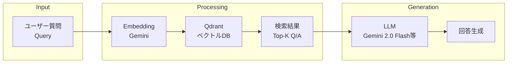
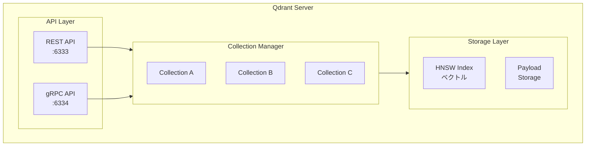
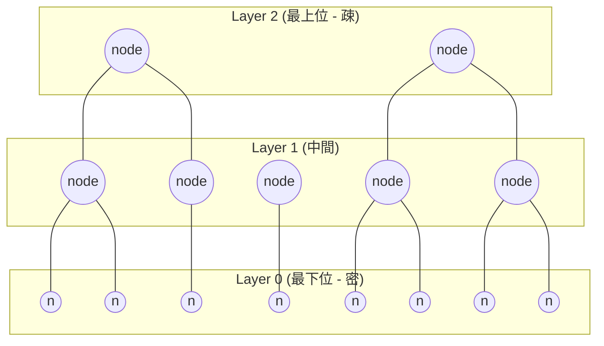
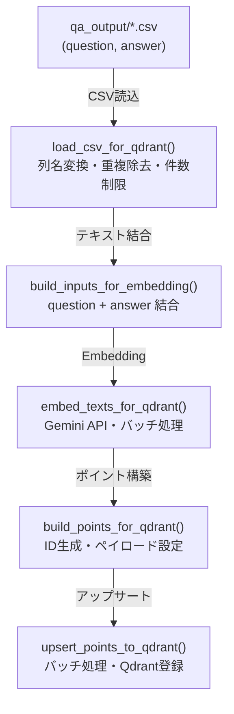
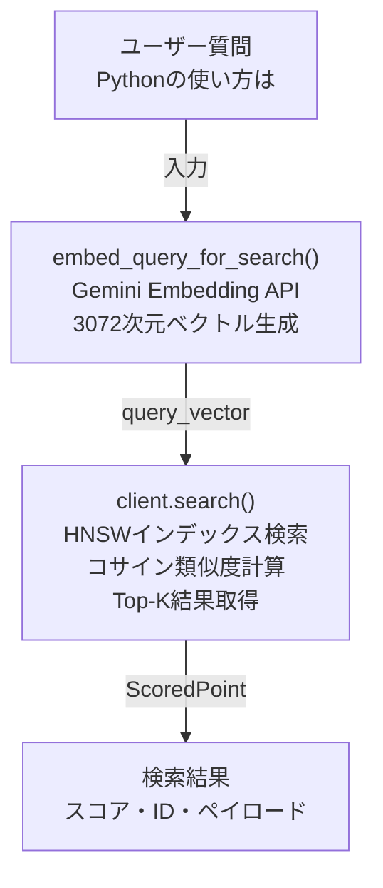
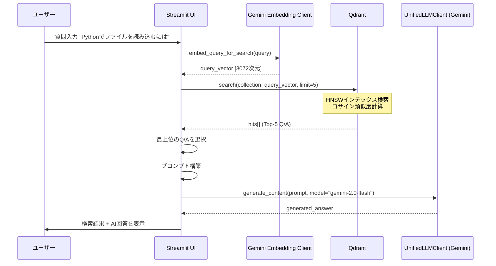

# Qdrant統合・検索・コレクション管理ドキュメント

作成日: 2025-11-28 (最終更新: Gemini移行対応)

## 目次

1. [概要](#1-概要)
   - 1.1 [本ドキュメントの目的](#11-本ドキュメントの目的)
   - 1.2 [RAGにおけるQdrantの役割](#12-ragにおけるqdrantの役割)
   - 1.3 [関連ファイル一覧](#13-関連ファイル一覧)
2. [Qdrant基礎知識](#2-qdrant基礎知識)
   - 2.1 [Qdrantとは](#21-qdrantとは)
   - 2.2 [アーキテクチャ](#22-アーキテクチャ)
   - 2.3 [HNSWアルゴリズム（近似最近傍探索）](#23-hnswアルゴリズム近似最近傍探索)
   - 2.4 [距離メトリクス](#24-距離メトリクス)
   - 2.5 [コレクションとポイントの構造](#25-コレクションとポイントの構造)
3. [ベクトルデータの登録](#3-ベクトルデータの登録)
   - 3.1 [Embeddingの生成（Gemini API使用）](#31-embeddingの生成gemini-api使用)
   - 3.2 [PointStruct構造とペイロード設計](#32-pointstruct構造とペイロード設計)
   - 3.3 [バッチアップサート処理](#33-バッチアップサート処理)
   - 3.4 [ペイロードインデックス](#34-ペイロードインデックス)
4. [類似度検索](#4-類似度検索)
   - 4.1 [コサイン類似度の基礎](#41-コサイン類似度の基礎)
   - 4.2 [検索フロー](#42-検索フロー)
   - 4.3 [クエリベクトル化（Gemini API使用）](#43-クエリベクトル化gemini-api使用)
   - 4.4 [検索結果の構造](#44-検索結果の構造)
   - 4.5 [ペイロードフィルタリング](#45-ペイロードフィルタリング)
5. [RAG応用（Query&Answer）](#5-rag応用queryanswer)
   - 5.1 [RAGの基本概念](#51-ragの基本概念)
   - 5.2 [Question=Queryから類似Q/Aを検索](#52-questionqueryから類似qaを検索)
   - 5.3 [検索結果に基づくAI回答生成（UnifiedLLMClient利用）](#53-検索結果に基づくai回答生成unifiedllmclient利用)
   - 5.4 [プロンプト設計](#54-プロンプト設計)
   - 5.5 [シーケンス図](#55-シーケンス図)
6. [検索結果の評価](#6-検索結果の評価)
   - 6.1 [スコアの解釈](#61-スコアの解釈)
   - 6.2 [閾値設定の指針](#62-閾値設定の指針)
   - 6.3 [評価指標](#63-評価指標)
   - 6.4 [検索精度の改善テクニック](#64-検索精度の改善テクニック)
7. [コレクション統合](#7-コレクション統合)
   - 7.1 [統合の目的とユースケース](#71-統合の目的とユースケース)
   - 7.2 [統合フロー](#72-統合フロー)
   - 7.3 [scroll_all_points_with_vectors()](#73-scroll_all_points_with_vectors)
   - 7.4 [merge_collections()](#74-merge_collections)
   - 7.5 [ID再生成とペイロード拡張](#75-id再生成とペイロード拡張)
   - 7.6 [UI操作](#76-ui操作)
8. [参考](#8-参考)
   - 8.1 [関数一覧](#81-関数一覧)
   - 8.2 [Qdrant API リファレンス](#82-qdrant-api-リファレンス)
   - 8.3 [パフォーマンスチューニング](#83-パフォーマンスチューニング)

---

## 1. 概要

### 1.1 本ドキュメントの目的

本ドキュメントは以下の3つの技術領域について、Qdrantベクトルデータベースを活用した統合的な解説を行う。
Geminiモデルへの移行に伴い、Embedding生成およびLLMによる応答生成がGemini APIを使用する構成となった。

1.  **Qdrantの基礎知識** - ベクトルDBの仕組み、HNSWアルゴリズム等
2.  **検索の仕組み** - Embedding、類似度検索、Query&Answer生成
3.  **コレクション統合** - 複数コレクションの統合機能と運用

### 1.2 RAGにおけるQdrantの役割

RAG（Retrieval-Augmented Generation）システムにおいてQdrantは文脈検索の中核として機能する。



**Qdrantの役割:**
- Q/Aペアのベクトルを高速検索
- コサインベクトル間の類似度計算
- 関連性の高いQ/Aを効率的に検索
- ペイロードフィルタリングによる絞り込み

### 1.3 関連ファイル一覧

| ファイル | 役割 | 主要関数/クラス |
|---------|------|----------------|
| `services/qdrant_service.py` | Qdrant操作サービス層 | `embed_texts_for_qdrant()`, `merge_collections()` |
| `helper_embedding.py` | Embedding抽象化レイヤー | `create_embedding_client()` |
| `helper_llm.py` | LLM抽象化レイヤー | `create_llm_client()` |
| `ui/pages/qdrant_search_page.py` | 検索UI | `show_qdrant_search_page()` |
| `ui/pages/qdrant_registration_page.py` | 登録・統合UI | `show_qdrant_registration_page()` |

---

## 2. Qdrant基礎知識

### 2.1 Qdrantとは

**Qdrant**（クアドラント）はRust製の高性能ベクトル類似度検索エンジンである。

| 項目 | 内容 |
|------|------|
| 開発言語 | Rust |
| ライセンス | Apache 2.0 |
| 主要用途 | 類似度検索、セマンティック検索、RAG |
| API | REST API / gRPC |
| クライアント | Python, JavaScript, Rust, Go |

**特徴:**
- **高速検索**: HNSWアルゴリズムによる近似最近傍探索
- **フィルタリング**: 条件付き検索のサポート
- **スケーラビリティ**: ペイロードの柔軟なスキーマ
- **永続化**: ディスクベースのストレージ

### 2.2 アーキテクチャ



**各レイヤーの役割:**

| コンポーネント | 役割 |
|--------------|------|
| API Layer | REST/gRPCリクエストの処理 |
| Collection Manager | コレクションのCRUD管理 |
| HNSW Index | ベクトルの近似最近傍探索インデックス |
| Payload Storage | メタデータ（JSON）の格納 |

### 2.3 HNSWアルゴリズム（近似最近傍探索）

**HNSW（Hierarchical Navigable Small World）** は高次元ベクトルの近似最近傍探索アルゴリズムである。

#### HNSWの構造



**探索の流れ:** 上位レイヤーから開始し、より近い隣接点を辿って下位レイヤーへ移動

**探索アルゴリズム:**

1.  **挿入時**: ポイントはランダムな最大レイヤーに配置され、各レイヤーで最近傍と接続
2.  **探索時**: 最上位レイヤーから開始し、より近い隣接点を辿って下位レイヤーへ移動
3.  **結果**: 完全探索ではないが、非常に高い精度で高速な検索

**主要パラメータ:**

| パラメータ | 説明 | デフォルト | 影響 |
|-----------|------|----------|------|
| `m` | 各レイヤーの接続数 | 16 | 大きいほど精度向上、メモリ増加 |
| `ef_construct` | 構築時の探索幅 | 100 | 大きいほど精度向上、構築時間増加 |
| `ef` | 検索時の探索幅 | 128 | 大きいほど精度向上、検索時間増加 |

**計算量:**
- 挿入: O(log N)
- 検索: O(log N)
- 完全探索比: N=100万で約1000倍高速

### 2.4 距離メトリクス

Qdrantがサポートする距離メトリクス:

| メトリクス | 計算式 | 範囲 | 用途 |
|-----------|------|------|------|
| **Cosine** | 1 - (A・B / \|A\|\|B\|) | 0〜2 | テキスト類似度**（推奨）** |
| **Dot** | -A・B | -∞〜∞ | 非正規化ベクトル |
| **Euclid** | √Σ(Ai-Bi)² | 0〜∞ | 空間距離 |

**本システムでの設定:**

```python
# services/qdrant_service.py:538-540
vectors_config = models.VectorParams(
    size=3072,  # Gemini embeddingの次元数
    distance=models.Distance.COSINE  # コサイン類似度
)
```

**コサイン類似度を選択する理由:**
- テキスト埋め込みは正規化済み
- 文の長さの違いに影響されにくい
- 意味的類似度の計測に最適

### 2.5 コレクションとポイントの構造

#### コレクション（Collection）

コレクションは関連するベクトルデータをグループ化したもの。

```python
# コレクション作成
client.create_collection(
    collection_name="qa_livedoor",
    vectors_config=models.VectorParams(
        size=3072,                    # ベクトル次元数
        distance=models.Distance.COSINE
    )
)
```

#### ポイント（Point）

ポイントはベクトル + ペイロード（メタデータ）の組み合わせ。

```python
point = models.PointStruct(
    id=12345678901234,           # 一意のID（64bit整数）
    vector=[0.023, -0.156, ...], # 3072次元ベクトル
    payload={                     # メタデータ（JSON）
        "question": "質問文",
        "answer": "回答文",
        "domain": "livedoor",
        "source": "a02_qa_pairs_livedoor.csv"
    }
)
```

---

## 3. ベクトルデータの登録

### 3.1 Embeddingの生成（Gemini API使用）

Q/AペアをQdrantに登録するまでのフロー:



本システムでは `gemini-embedding-001` モデルを使用する。
`services/qdrant_service.py` 内の `embed_texts_for_qdrant` 関数が、`helper_embedding.py` の `create_embedding_client(provider="gemini")` を呼び出し、Gemini APIでEmbeddingを生成する。

**Embedding設定:**

| 項目 | 値 |
|------|-----|
| モデル | gemini-embedding-001 |
| 次元数 | 3072 |
| バッチ上限 | Gemini APIの推奨に従う |

### 3.2 PointStruct構造とペイロード設計

`services/qdrant_service.py` の `build_points_for_qdrant` 関数でQdrantポイントを構築する。

**ペイロードスキーマ（qa:v1）:**

| フィールド | 型 | 説明 |
|-----------|-----|------|
| domain | string | データドメイン（livedoor, cc_news, custom） |
| question | string | 質問文 |
| answer | string | 回答文 |
| source | string | ソースCSVファイル名 |
| created_at | string | 登録日時（ISO 8601） |
| schema | string | スキーマバージョン |

### 3.3 バッチアップサート処理

`services/qdrant_service.py` の `upsert_points_to_qdrant` 関数は、`batched` ユーティリティを使用してポイントリストを128件ずつのバッチに分割し、効率的にQdrantにアップサートする。

### 3.4 ペイロードインデックス

検索効率化のため、`domain` フィールドに `KEYWORD` タイプでインデックスを作成する。

---

## 4. 類似度検索

### 4.1 コサイン類似度の基礎

**コサイン類似度**は2つのベクトルの角度の余弦を計算する。テキスト埋め込みにおいて意味的類似度の計測に最適。

### 4.2 検索フロー



### 4.3 クエリベクトル化（Gemini API使用）

`services/qdrant_service.py` の `embed_query_for_search` 関数が、`create_embedding_client(provider="gemini")` を使用して検索クエリをEmbeddingベクトルに変換する。
デフォルトモデルは `gemini-embedding-001`、次元数は `3072`。

### 4.4 検索結果の構造

検索結果は `ScoredPoint` オブジェクトのリストとして返され、`score` (類似度)、Qdrantの `id`、および `payload` (元の質問、回答、ソースなどのメタデータ) を含む。

### 4.5 ペイロードフィルタリング

`models.Filter` を使用することで、`domain` などのペイロードフィールドに基づいて検索結果をフィルタリングできる。AND/OR条件もサポート。

---

## 5. RAG応用（Query&Answer）

### 5.1 RAGの基本概念

**RAG（Retrieval-Augmented Generation）** は検索拡張生成の手法で、LLMの回答に外部知識を活用し、ハルシネーションの抑制や最新情報への対応を可能にする。

### 5.2 Question=Queryから類似Q/Aを検索

ユーザーの質問（Query）はGemini Embedding APIでベクトル化され、Qdrantで類似Q/Aが検索される。

### 5.3 検索結果に基づくAI回答生成（UnifiedLLMClient利用）

検索された関連性の高いQ/Aペアをコンテキストとして、`helper_llm.py` が提供する `UnifiedLLMClient` を介してGemini LLMによる最終的な回答を生成する。
これは `ui/pages/qdrant_search_page.py` で実装されている。

```python
from helper_llm import create_llm_client, LLMClient

# 検索結果から最適なものを選択 (best_hitはQdrantのScoredPoint)
best_hit = hits[0]
question_from_qdrant = best_hit.payload.get("question", "")
answer_from_qdrant = best_hit.payload.get("answer", "")

# AI応答生成用のプロンプト構築
qa_prompt = (
    "以下の検索結果とユーザーの質問を踏まえて、"
    "日本語で簡潔かつ正確に回答してください。\n\n"
    f"ユーザーの質問:\n{query}\n\n"
    f"検索結果のスコア: {best_hit.score:.4f}\n"
    f"検索結果の質問: {question_from_qdrant}\n"
    f"検索結果の回答: {answer_from_qdrant}\n"
)

# UnifiedLLMClient を使用してAI応答を生成
llm_client: LLMClient = create_llm_client(provider="gemini") # デフォルトでGemini
generated_answer = llm_client.generate_content(
    prompt=qa_prompt,
    model="gemini-2.0-flash", # UIからの設定、またはデフォルト
    temperature=0.7
)
```

### 5.4 プロンプト設計

RAG用プロンプトは、システム指示、ユーザー質問、そしてQdrantからの検索結果コンテキストを組み合わせて構成される。

### 5.5 シーケンス図



---

## 6. 検索結果の評価

### 6.1 スコアの解釈

Qdrantのコサイン類似度スコアは、2つのベクトル間の角度に基づき、-1から1の範囲で類似度を示す。

### 6.2 閾値設定の指針

ユースケースに応じて、`score_threshold` を設定し、検索結果のフィルタリングを行う。

### 6.3 評価指標

Precision@K, Recall@K, MRR, NDCGなどの指標を用いて検索精度を評価する。

### 6.4 検索精度の改善テクニック

クエリ拡張、ハイブリッド検索、リランキングなどの技術を導入することで、検索精度を向上させることが可能。

---

## 7. コレクション統合

### 7.1 統合の目的とユースケース

複数のコレクションデータを1つにまとめることで、複数データソースの横断検索、段階的統合、インデックス再構築などが可能になる。

### 7.2 統合フロー

`merge_collections` 関数は、ソースコレクションから全ポイント（ベクトル含む）を取得し、新しい一意のIDと元のコレクション情報をペイロードに付与して、ターゲットコレクションにアップサートする。

### 7.3 scroll_all_points_with_vectors()

コレクションから全ポイント（ベクトル含む）を取得するための関数。`batch_size` と `progress_callback` に対応。

### 7.4 merge_collections()

複数コレクションを統合し、新しいコレクションに登録する関数。**統合時のベクトルサイズもデフォルトで3072に設定される。**

### 7.5 ID再生成とペイロード拡張

統合元コレクションでのID重複を回避し、トレーサビリティを確保するため、新しいID (`hash(f"{target_collection}-{src_collection}-{point.id}-{i}")`) が生成され、ペイロードに `_source_collection` および `_original_id` フィールドが追加される。

### 7.6 UI操作

Streamlit UI (`ui/pages/qdrant_registration_page.py`) から、統合元コレクションの選択、統合先コレクション名の設定、進捗確認が可能。

---

## 8. 参考

### 8.1 関数一覧

| 機能 | ファイル | 関数/クラス |
|-----|---------|------------|
| Qdrant設定 | services/qdrant_service.py | QDRANT_CONFIG |
| ヘルスチェック | services/qdrant_service.py | QdrantHealthChecker |
| データ取得 | services/qdrant_service.py | QdrantDataFetcher |
| CSV読み込み | services/qdrant_service.py | load_csv_for_qdrant() |
| 埋め込み入力構築 | services/qdrant_service.py | build_inputs_for_embedding() |
| 埋め込み生成 | services/qdrant_service.py | embed_texts_for_qdrant() |
| コレクション作成 | services/qdrant_service.py | create_or_recreate_collection_for_qdrant() |
| 検索クエリベクトル化 | services/qdrant_service.py | embed_query_for_search() |
| 登録UI | ui/pages/qdrant_registration_page.py | show_qdrant_registration_page() |
| 検索UI | ui/pages/qdrant_search_page.py | show_qdrant_search_page() |

### 8.2 Qdrant API リファレンス

**主要なQdrant Client API:**

| メソッド | 説明 | 例 |
|---------|------|-----|
| `create_collection()` | コレクション作成 | `client.create_collection(name, vectors_config)` |
| `delete_collection()` | コレクション削除 | `client.delete_collection(name)` |
| `get_collection()` | コレクション情報取得 | `client.get_collection(name)` |
| `upsert()` | ポイント登録/更新 | `client.upsert(collection, points)` |
| `search()` | ベクトル検索 | `client.search(collection, query_vector, limit)` |
| `scroll()` | ページネーション取得 | `client.scroll(collection, limit, offset)` |

### 8.3 パフォーマンスチューニング

#### バッチサイズ設定

| 操作 | 推奨バッチサイズ | 理由 |
|------|----------------|------|
| Embedding | Gemini APIの推奨に従う | Gemini API制限 |
| Qdrant upsert | 128ポイント/バッチ | メモリ/レスポンスバランス |
| scroll取得 | 100ポイント/バッチ | 応答速度 |

#### HNSWパラメータ調整

```python
# コレクション作成時に設定
client.create_collection(
    collection_name="high_precision_collection",
    vectors_config=models.VectorParams(
        size=3072,
        distance=models.Distance.COSINE
    ),
    hnsw_config=models.HnswConfigDiff(
        m=32,              # デフォルト16 → 精度向上
        ef_construct=200,  # デフォルト100 → 構築精度向上
    )
)
```

#### メモリ使用量の目安

```
メモリ ≈ ポイント数 × (ベクトル次元数 × 4バイト + ペイロード平均サイズ + HNSWオーバーヘッド)

例: 100万ポイント、3072次元、ペイロード1KB
    ≈ 1,000,000 × (3072 × 4 + 1024 + 100)
    ≈ 13.3 GB
```

---

## 関連ドキュメント

- [doc/06_embedding_qdrant.md](./06_embedding_qdrant.md) - Embedding・Qdrant登録・検索の詳細
- [doc/rag_qa_pair_qdrant.md](./rag_qa_pair_qdrant.md) - システム全体のドキュメント
- [Qdrant公式ドキュメント](https://qdrant.tech/documentation/) - 公式リファレンス
