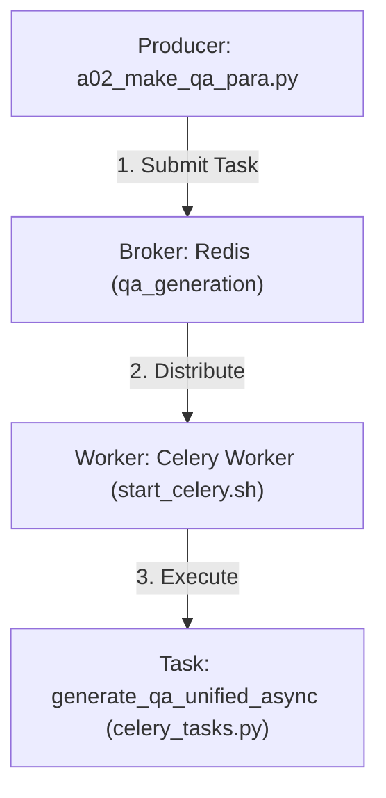
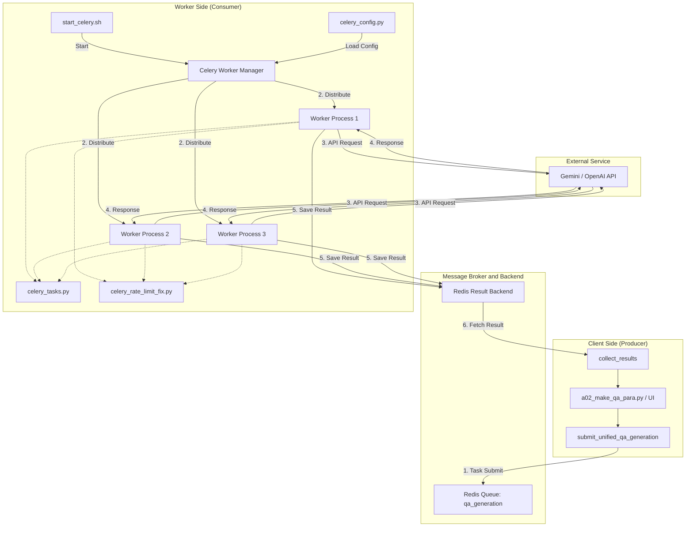

# Celeryによる非同期並列処理環境

本ドキュメントでは、大規模なドキュメントから効率的にQ&Aペアを生成するために実装された、CeleryとRedisを用いた非同期並列処理環境について解説します。

## 目次

1. [概要と構成要素](#1-概要と構成要素)
2. [システムアーキテクチャ](#2-システムアーキテクチャ)
3. [構成ファイルの詳細](#3-構成ファイルの詳細)
4. [セットアップと起動](#4-セットアップと起動)
5. [Q&A生成の実行](#5-qa生成の実行)
6. [モニタリングとトラブルシューティング](#6-モニタリングとトラブルシューティング)

---

## 1. 概要と構成要素

`a02_make_qa_para.py` は、ドキュメントをチャンク（意味的なまとまり）に分割し、LLM（Gemini/OpenAI）を用いてQ&Aペアを生成します。文書量が多い場合、順次処理では非常に時間がかかるため、**Celery**（分散タスクキュー）と **Redis**（インメモリデータストア）を用いた非同期並列処理アーキテクチャを採用しています。

### 主なメリット

* **高速化**: 複数のワーカープロセスで同時にAPIリクエストを行うことで、全体の処理時間を大幅に短縮（例: 8並列で約1/5〜1/8の時間）。
* **耐障害性**: 一部のタスクが失敗しても、他のタスクは継続し、失敗したタスクのみリトライが可能。
* **レート制限管理**: Celeryの設定により、APIのレート制限（RPM/TPM）を考慮した制御が可能。

### 非同期処理の主要コンポーネント

本システムは以下の要素で構成されています。

* **プロデューサー (Producer)**

  * **役割**: タスク（Q/A生成の依頼）を作成し、ブローカーに送信するクライアント。
  * **実体**: `a02_make_qa_para.py` (バッチ処理スクリプト) や Streamlitアプリ (`agent_rag.py`)。これらがドキュメントを分割し、処理リクエストを発行します。
* **ブローカー (Broker)**

  * **役割**: プロデューサーからタスクメッセージを受け取り、待機しているワーカーに配送する仲介役（メッセージキュー）。
  * **実体**: **Redis**。タスクは `qa_generation` などのキューに一時的に保存されます。
* **ワーカー (Worker)**

  * **役割**: キューからタスクを取り出し、実際の処理（LLM APIを呼び出してQ/Aを生成）を実行するプロセス。
  * **実体**: `start_celery.sh` によって起動される **Celeryワーカープロセス**。これらは並列に動作し、複数のタスクを同時に処理します。
*   **タスク (Task) - 並列実行されるコアロジック**
    *   **役割**: ワーカーが実行する処理の定義。ここでAPI呼び出し等の重い処理が行われます。
    *   **実体**: `celery_tasks.py` の `generate_qa_unified_async` 関数。
    *   **コード解説**:
        `@app.task` デコレータを付与することで、通常のPython関数がCeleryタスクに変換されます。以下のコード部分が、各ワーカープロセス上で並列に実行されます。

        ```python
        # celery_tasks.py

        @app.task(bind=True, max_retries=3)
        def generate_qa_unified_async(
            self,
            chunk_data: Dict,
            config: Dict,
            model: str = None,
            provider: str = None
        ) -> Dict:
            """
            この関数全体がワーカー上で非同期に実行されます。
            複数のワーカーがこの関数を同時に呼び出すことで、
            Gemini/OpenAI APIへのリクエストを並列化します。
            """
            
            # ... (プロンプト構築などの前処理) ...

            # 統合LLMクライアントの初期化
            llm_client = create_llm_client(provider=provider)

            # 【並列化の核心部分】
            # 外部APIへのリクエスト（I/O待ち時間が発生する箇所）
            # ここを並列化することで全体の待ち時間を短縮します
            result = llm_client.generate_structured(
                prompt=f"{system_instruction}\n\n{prompt}",
                response_schema=QAPairsResponse,
                model=model
            )

            # ... (結果の整形などの後処理) ...
            
            return { "success": True, "qa_pairs": ... }
        ```
* **結果バックエンド (Result Backend)**

  * **役割**: ワーカーが処理した結果（生成されたQ/Aペアのデータ）を保存する場所。
  * **実体**: **Redis**。プロデューサーはここから非同期に完了したタスクの結果を収集します。

### コンポーネント間アーキテクチャ



## 2. システムアーキテクチャ

データと処理の流れを示すアーキテクチャ図です。



## 3. 構成ファイルの詳細

各ファイルは、この非同期処理エコシステムの中で特定の役割を担っています。

### ① `start_celery.sh` (ワーカー管理)

Celeryワーカープロセスのライフサイクルを管理するBashスクリプトです。

* **起動 (`start`)**: Redisの稼働確認後、`celery worker` コマンドを実行してワーカープロセスをバックグラウンドで起動します。指定された並列数（Concurrency）でプロセスを展開します。
* **停止 (`stop`)**: PIDファイルを基に、稼働中のワーカープロセスを安全に停止（Graceful Shutdown）させます。応答がない場合は強制終了します。
* **監視 (`status`)**: Redisへの接続確認、キューの滞留状況、ワーカープロセスの生存確認、最新ログの表示を行います。

### ② `celery_config.py` (Celery設定)

Celeryアプリケーションの動作設定を定義するファイルです。

* **接続設定**: ブローカーおよび結果バックエンドとしてRedisのURLを設定します。
* **キュー設定**: タスクの優先度に応じたキュー（`high_priority`, `normal_priority`, `low_priority`）を定義します。
* **レート制限**: 外部API（OpenAI/Gemini）の制限超過を防ぐため、タスクごとの実行頻度制限（`rate_limit`）を設定します。
* **ワーカー挙動**: メモリリーク対策（`worker_max_tasks_per_child`）やタイムアウト時間を設定します。

### ③ `celery_rate_limit_fix.py` (レート制限対策)

API呼び出しの頻度を制御するためのユーティリティモジュールです。

* **RateLimiterクラス**: 直近1分間のリクエスト回数を追跡し、制限（例: 50回/分）を超える場合にスレッドをスリープさせて待機させます。
* **デコレータ (`@with_rate_limit`)**: タスク関数に付与することで、その関数の実行前にレート制限チェックを自動的に行います。Gemini APIの厳しいレート制限（RPM）によるエラーを回避するために使用されます。

### ④ `celery_tasks.py` (タスク定義)

実際にワーカーが実行する処理ロジックと、クライアント用インターフェースを定義しています。

* **タスク定義 (`generate_qa_unified_async`)**:
  * `@app.task` デコレータによりCeleryタスクとして登録されます。
  * 受け取ったテキストチャンクを基にプロンプトを構築し、`helper_llm` モジュールを通じてLLM (Gemini/OpenAI) を呼び出します。
  * 生成されたQ/Aペアを解析し、JSON形式で返却します。
* **タスク投入 (`submit_unified_qa_generation`)**:
  * プロデューサーが使用する関数。チャンクのリストを受け取り、非同期タスクとしてCeleryに投入します。
* **結果収集 (`collect_results`)**:
  * プロデューサーが使用する関数。投入したタスクIDリストを元に、Redisからポーリングを行って処理完了を待ち、結果（Q/Aペア）を一括で回収します。

## 4. セットアップと起動

### 前提条件

* **Redisサーバー**がインストールされ、起動していること。
  * macOS: `brew services start redis`
  * Linux: `sudo systemctl start redis`

### ワーカーの管理 (`start_celery.sh`)

専用の管理スクリプトを使用してワーカーを制御します。

**1. ワーカーの起動**

```bash
# 標準起動（デフォルト8ワーカー）
./start_celery.sh start

# ワーカー数を指定して起動
./start_celery.sh start -w 8
```

**2. 再起動（キャッシュクリア推奨）**
既存のタスクやキャッシュによる問題を避けるため、実行前にはRedisのフラッシュと再起動を推奨します。

```bash
redis-cli FLUSHDB && ./start_celery.sh restart -w 8
```

**3. ステータス確認**

```bash
./start_celery.sh status
```

出力例：

* Redisの接続状態
* 現在のキューの長さ
* 稼働中のワーカープロセス
* 最新のログ出力

**4. 停止**

```bash
./start_celery.sh stop
```

## 5. Q&A生成の実行

Celeryモードを有効にするには `--use-celery` フラグを使用します。

### 推奨実行コマンド（`a02_make_qa_para.py`）

**1. デバッグ実行（小規模）**
動作確認のために、少量のデータ（1チャンクなど）でテストします。

```bash
python a02_make_qa_para.py \
  --dataset cc_news \
  --use-celery \
  --celery-workers 8 \
  --batch-chunks 1 \
  --max-docs 1 \
  --model gemini-2.0-flash
```

**2. 本番実行**
バッチ処理（複数チャンクを1リクエストにまとめる）とカバレージ分析を有効にして実行します。

```bash
python a02_make_qa_para.py \
  --dataset cc_news \
  --use-celery \
  --celery-workers 8 \
  --batch-chunks 3 \
  --merge-chunks \
  --min-tokens 150 \
  --max-tokens 400 \
  --coverage-threshold 0.58 \
  --model gemini-2.0-flash \
  --analyze-coverage
```

### 主な引数解説


| 引数                 | 説明                                                                                         | 推奨値/備考        |
| :------------------- | :------------------------------------------------------------------------------------------- | :----------------- |
| `--use-celery`       | Celeryによる並列処理を有効化します。                                                         | 必須               |
| `--celery-workers`   | 起動しているワーカー数に合わせて指定します。スクリプト内での待機ロジック調整に使用されます。 | 8                  |
| `--batch-chunks`     | 1回のAPIリクエストで処理するチャンク数。API呼び出し回数を削減します。                        | 3 (Geminiの場合)   |
| `--merge-chunks`     | 小さなチャンクを結合してコンテキストを豊かにし、API効率を高めます。                          | ON (flag)          |
| `--model`            | 使用するLLMモデル。                                                                          | `gemini-2.0-flash` |
| `--analyze-coverage` | 生成後、元ドキュメントの内容がどの程度Q&Aに含まれているか分析します。                        | ON (flag)          |

## 6. モニタリングとトラブルシューティング

### ログの確認

ワーカーの動作ログは `logs/` ディレクトリに出力されます。

```bash
# リアルタイム監視
tail -f logs/celery_qa_*.log
```

### よくある問題と対策

**Q. タスクが一向に進まない（Pendingのまま）**

* **原因**: Celeryワーカーが起動していない、またはRedisに接続できていない。
* **対策**: `./start_celery.sh status` で確認し、起動していなければ `./start_celery.sh start` を実行してください。また、`redis-cli ping` でPONGが返るか確認してください。

**Q. 結果が "FAILURE" になる**

* **原因**: APIエラー、タイムアウト、パースエラーなど。
* **対策**: ログファイルを確認し、エラーメッセージを特定してください。APIキーの設定（`.env`）やクレジット残高も確認が必要です。

**Q. 処理が途中から遅くなる**

* **原因**: APIのレート制限（Rate Limit）にかかっている可能性があります。
* **対策**: `celery_config.py` のレート制限設定を確認するか、ワーカー数を減らしてください。Gemini 2.0 Flashは比較的高速ですが、短時間の大量リクエストは制限される場合があります。
