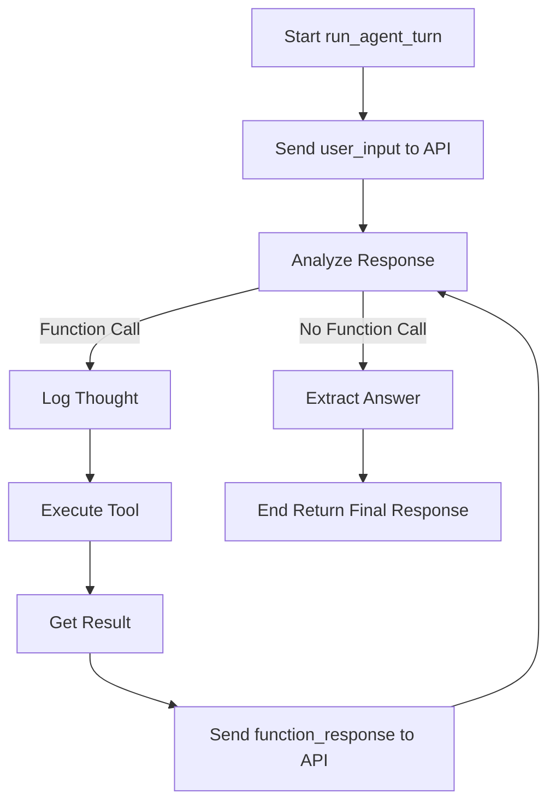

# agent_main.py 詳細設計

## 1. ファイルの機能概要

`agent_main.py` は、Gemini 2.0 Flash を使用した **CLI ベースの Hybrid RAG エージェント** のエントリーポイントです。
ユーザーと対話し、一般的な知識と社内ナレッジ（Qdrant上のベクトルデータベース）を自律的に使い分けて回答します。

**主な特徴:**
*   **ReAct (Reasoning + Acting) ループ:** ユーザーの質問に対し、「思考 (Thought) → ツール実行 (Action) → 結果観察 (Observation)」のサイクルを回し、情報を検索・収集してから回答します。
*   **Chain of Thought (CoT):** 思考プロセスを可視化し、ユーザーに「なぜその検索を行ったか」を提示します。
*   **Router機能:** プロンプトエンジニアリングにより、質問内容に応じて適切なナレッジベース（コレクション）を自動選択します。
*   **エラーハンドリング:** ツール実行時のエラーを捕捉し、エージェントが停止せずに対話を継続できるよう設計されています。

## 2. 関数一覧

| 関数名 | 処理概要 |
| :--- | :--- |
| **`setup_logging`** | ログ出力設定を行います。`logs/` ディレクトリに日次ログファイルを生成します。 |
| **`setup_agent`** | Gemini ChatSession を初期化します。APIキーの読み込み、ツールの登録、システムプロンプトの設定を行います。 |
| **`print_colored`** | CLI上での視認性を高めるため、指定された色でテキストを出力します。 |
| **`run_agent_turn`** | エージェントの1ターン（ユーザー発話〜最終回答）を実行するコアロジックです。ReActループ（思考・ツール呼び出し・再推論）を制御します。 |
| **`main`** | メインループです。ユーザー入力を受け付け、`run_agent_turn` を呼び出し、結果を表示します。 |

## 3. 主要関数の IPO とプロセスフロー

### 3.1 `run_agent_turn`

エージェントの思考と行動のループを制御する最も重要な関数です。

**IPO (Input-Process-Output):**

*   **Input:**
    *   `chat_session` (ChatSession): Gemini API セッションオブジェクト
    *   `user_input` (str): ユーザーからの質問文字列
    *   `return_tool_info` (bool): ツール使用状況を戻り値に含めるかどうかのフラグ
*   **Process:**
    1.  ユーザー入力を Gemini API に送信。
    2.  **While Loop (ReAct Loop):**
        *   モデルからの応答を解析。
        *   **Thought (思考)** が含まれていればログ出力。
        *   **Function Call (ツール呼び出し)** が含まれているか確認。
        *   **Yes (ツール呼び出しあり):**
            *   ツール名と引数を抽出。
            *   対応する Python 関数 (`agent_tools.py` 内) を実行。
            *   実行結果 (Observation) を `function_response` として Gemini API に返送。
            *   ループ継続 (次の思考/回答へ)。
        *   **No (ツール呼び出しなし):**
            *   最終回答とみなし、テキストを抽出。
            *   ループ終了。
*   **Output:**
    *   `final_response_text` (str): エージェントの最終回答
    *   (Optional) `tool_info` (Dict): 使用したツールやコレクションの情報

**Process Flow (Mermaid):**



### 3.2 `setup_agent`

**IPO:**

*   **Input:** 環境変数 (`GEMINI_API_KEY`), `config.py` (モデル設定, システムプロンプト)
*   **Process:**
    1.  APIキーの検証。
    2.  ツールリスト (`search_rag_knowledge_base` 等) の作成。
    3.  システムプロンプト (`SYSTEM_INSTRUCTION`) の準備。
    4.  `genai.GenerativeModel` の初期化。
    5.  チャットセッションの開始 (`start_chat`).

    **Process Flow (Mermaid):**
    ```mermaid
    graph TD
        Start[Start setup_agent] --> CheckAPI[Check API Key]
        CheckAPI -->|OK| LoadConfig[Load Config and Prompt]
        CheckAPI -->|NG| Error[Error Occurred]
        LoadConfig --> InitModel[Initialize Gemini Model]
        InitModel --> StartChat[Start ChatSession]
        StartChat --> End[End Return session]
    ```

*   **Output:**
    *   `chat`: 初期化済みの Gemini ChatSession オブジェクト

### 3.3 `main`

**IPO:**

*   **Input:** 標準入力 (User Input)
*   **Process:**
    1.  ロギング設定、エージェント初期化。
    2.  **Interaction Loop:**
        *   入力待ち (`input()`).
        *   終了コマンド確認 (`exit`, `quit`).
        *   `run_agent_turn` 呼び出し。
        *   回答を標準出力に表示。
        *   エラー捕捉 (KeyboardInterrupt, Exception).

    **Process Flow (Mermaid):**
    ```mermaid
    graph TD
        Start[Start main] --> LogSetup[Setup Logging]
        LogSetup --> AgentSetup[Initialize Agent]
        AgentSetup --> WaitInput[Wait User Input]

        WaitInput -->|exit or quit| Exit[Exit Program]
        WaitInput -->|Text Input| CallTurn[Call run_agent_turn]

        CallTurn --> ShowRes[Show Response]
        ShowRes --> WaitInput

        WaitInput -->|Error| CatchErr[Catch Error and Log]
        CatchErr --> WaitInput
    ```

*   **Output:** 標準出力 (Agent Response), ログファイル
