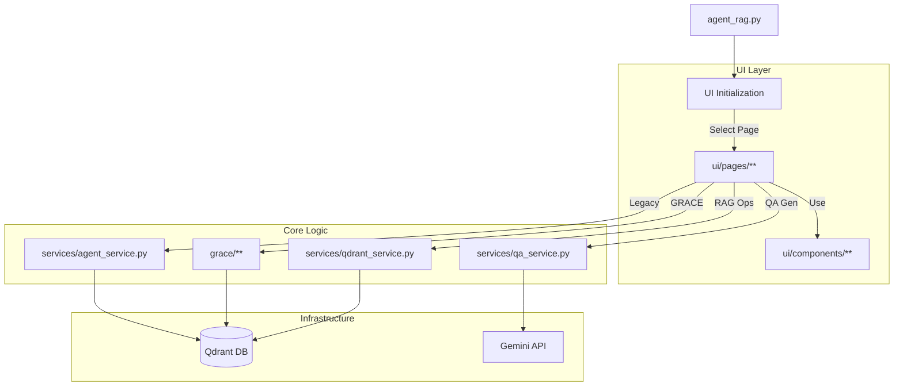

# Agent RAG 詳細設計書

## 1. システム全体構成概要

`agent_rag.py` は、Streamlitベースの **Hybrid RAG エージェントアプリケーション** のエントリポイントです。
従来の「Legacy ReAct Agent」と、新アーキテクチャ「GRACE (Guided Reasoning with Adaptive Confidence Execution)」の両方をホストし、UIを通じてユーザーに機能を提供します。

### 1.1 モジュール関連図



---

## 2. 機能構成

### 2.1 エントリポイント (`agent_rag.py`)
アプリケーションの起動、設定読み込み、サイドバーメニューによるページルーティングを担当します。

*   **Process:**
    1.  `st.set_page_config`: ページタイトル、アイコン設定。
    2.  `st.sidebar`: 機能選択メニューの表示。
    3.  `page_mapping`: 選択された機能に対応するページ関数を呼び出し。

### 2.2 GRACE 統合 (`ui/pages/grace_chat_page.py`)
新アーキテクチャ「GRACE」の対話インターフェース。

*   **Process:**
    1.  `grace.planner`: ユーザー入力から実行計画を生成。
    2.  `grace.executor`: 計画を実行し、ストリーミングイベントをUIに反映。
    3.  `grace.confidence`: 実行中の信頼度をサイドバーに可視化。
    4.  `grace.intervention`: 信頼度低下時にユーザー介入（確認/入力）を要求。

### 2.3 Legacy Agent 統合 (`ui/pages/agent_chat_page.py`)
従来のReActエージェントの対話インターフェース。

*   **Process:**
    1.  `services.agent_service.ReActAgent`: エージェント初期化。
    2.  `execute_turn`: 思考プロセス（Thought）とツール実行（Action）をUIに表示。

### 2.4 RAG 管理機能
*   **データダウンロード**: `ui/pages/download_page.py`
*   **Q/A生成**: `ui/pages/qa_generation_page.py`
*   **Qdrant登録**: `ui/pages/qdrant_registration_page.py`
*   **データ管理**: `ui/pages/qdrant_show_page.py`

---

## 3. UIモジュール詳細 (IPO & Process Flow)

### 3.1 `ui/pages/grace_chat_page.py`

**GRACE チャット画面**

*   **Input**: ユーザーメッセージ、介入応答
*   **Process**:
    1.  `Planner` で計画生成。
    2.  `Executor` でステップ実行（ジェネレータ）。
    3.  イベント（`step_start`, `confidence_update`）をUIに描画。
    4.  介入が必要な場合、実行を一時停止しUIを表示。
    
    ```mermaid
    graph TD
        User[User Input] --> Planner[Create Plan]
        Planner --> Executor{Execute Step}
        
        Executor -->|Step Event| UI_Main[Chat Area Update]
        Executor -->|Confidence| UI_Side[Sidebar Metric Update]
        
        Executor -->|Low Confidence| Intervention[Show Intervention UI]
        Intervention -->|User Response| Executor
        
        Executor -->|Finish| Final[Display Answer]
    ```
*   **Output**: チャットUI、信頼度メトリクス、介入ダイアログ。

### 3.2 `ui/pages/agent_chat_page.py`

**Legacy エージェントチャット画面**

*   **Input**: ユーザーメッセージ、コレクション選択
*   **Process**:
    1.  `ReActAgent` 初期化。
    2.  `agent.execute_turn` を呼び出し。
    3.  `yield` されるイベント（Log, Tool Call）を `st.expander` に追記。
    4.  最終回答を表示。
    
    ```mermaid
    graph TD
        User[User Input] --> Agent[ReActAgent]
        Agent -->|Yield| Stream[Stream Processing]
        
        Stream -->|Log| Expander[Thought Process UI]
        Stream -->|Tool Call| Expander
        Stream -->|Final Answer| Chat[Chat Message]
    ```
*   **Output**: チャットログ、回答。

### 3.3 `ui/pages/qa_generation_page.py`

**Q/A ペア生成画面**

*   **Input**: ソースファイル/データセット、生成パラメータ（モデル、チャンクサイズ等）
*   **Process**:
    1.  入力ソースの読み込み。
    2.  `run_advanced_qa_generation` (Celery/Subprocess) を起動。
    3.  `progress_callback` で進捗バーを更新。
    4.  生成されたCSV/JSONを保存。
    
    ```mermaid
    graph TD
        Config[Settings] --> Runner[QA Generator Runner]
        Source[Data Source] --> Runner
        
        Runner -->|Chunking| Chunks
        Chunks -->|LLM Gen| QAPairs
        
        Runner -->|Update| ProgressBar[UI Progress Bar]
        QAPairs -->|Save| Files[CSV/JSON Files]
    ```
*   **Output**: 生成ファイル、カバレッジレポート。

### 3.4 `ui/pages/qdrant_registration_page.py`

**Qdrant 登録画面**

*   **Input**: CSVファイル、コレクション名、Hybrid検索設定
*   **Process**:
    1.  CSVロード。
    2.  コレクション作成（Dense/Sparse設定）。
    3.  Embedding生成（Gemini + FastEmbed）。
    4.  QdrantへUpsert。
    
    ```mermaid
    graph TD
        CSV[Select CSV] --> Load[Load Data]
        Load --> EmbedDense[Dense Vector Gen]
        Load --> EmbedSparse[Sparse Vector Gen]
        
        EmbedDense --> Upsert[Upsert to Qdrant]
        EmbedSparse --> Upsert
        
        Upsert --> Log[Execution Log UI]
    ```
*   **Output**: 登録完了ステータス、ログ。

### 3.5 `ui/pages/qdrant_search_page.py`

**Qdrant 検索デバッグ画面**

*   **Input**: 検索クエリ、コレクション、検索設定
*   **Process**:
    1.  クエリをベクトル化。
    2.  `search_collection` で検索実行。
    3.  結果をDataFrame表示。
    4.  Top-1結果を用いてGeminiで回答生成。
    
    ```mermaid
    graph LR
        Query[Query] --> Vector[Vectorize]
        Vector --> Search[Qdrant Search]
        Search --> Results[Result Table]
        Results --> Gen[Gemini Answer]
    ```
*   **Output**: 検索結果一覧、生成回答。

### 3.6 `ui/components/grace_components.py`

**GRACE UI コンポーネント**

*   **`display_execution_plan`**:
    *   **Input**: `ExecutionPlan` オブジェクト、現在のステップID
    *   **Process**: ステップごとにカード状のUIを生成。現在のステップをハイライト、完了ステップを緑色、未完了をグレーで表示。
    *   **Output**: HTML/Markdownによる計画可視化。

*   **`display_confidence_metric`**:
    *   **Input**: スコア(float), レベル(str), 内訳(dict)
    *   **Process**: `st.metric` と `st.progress` で全体スコアを表示。`plotly` で内訳をバーチャート表示。
    *   **Output**: 信頼度ダッシュボード。

*   **`display_intervention_request`**:
    *   **Input**: リクエストタイプ(confirm/escalate), メッセージ, コールバック関数
    *   **Process**: タイプに応じた入力フォーム（ボタンまたはテキスト入力）を表示。アクション時にコールバックを実行。
    *   **Output**: ユーザー入力UI。