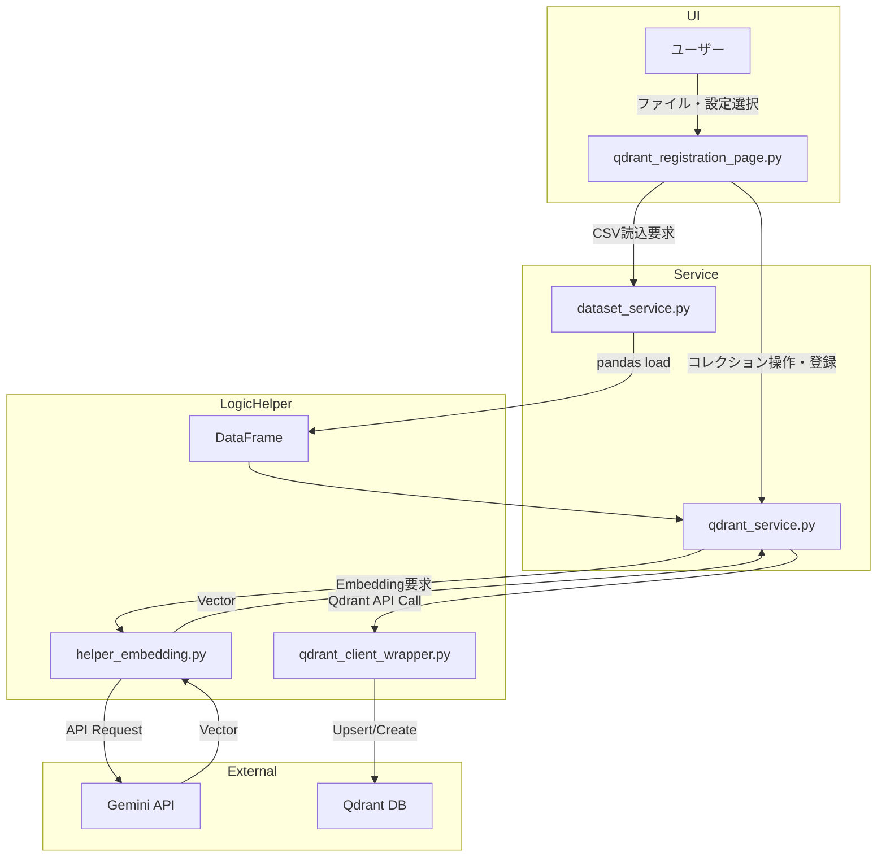
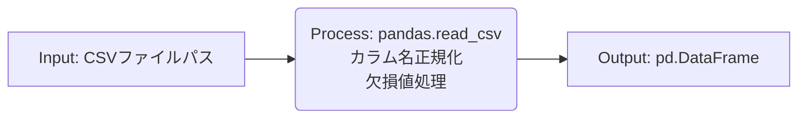
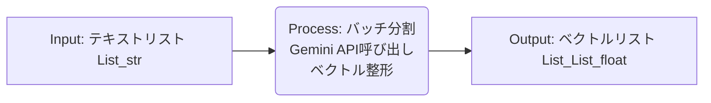
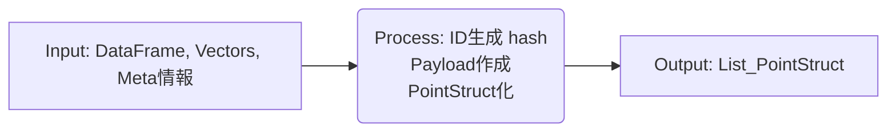
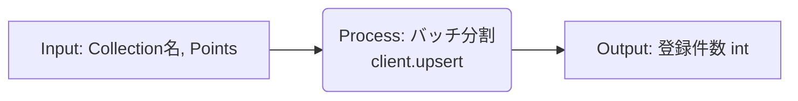

# Agent RAG CSVからQdrant登録処理

本ドキュメントでは、Streamlitアプリケーション `agent_rag.py` における「CSVデータ登録」機能（CSVファイルからQdrantベクトルデータベースへの登録処理）について、その構造、データフロー、および関連するコードコンポーネントを詳細に解説する。

## 1. 概要

`agent_rag.py` の「Qdrant登録」メニューは、ローカルにあるCSVファイル（Q/Aペアまたは生テキスト）を読み込み、Embedding（ベクトル化）を行い、Qdrantデータベースの指定されたコレクションに登録する機能を提供する。これはCLIツール `register_qdrant.py` と同等の機能をGUIベースで提供するものである。

## 2. 関連ファイル・クラス・関数一覧

### 2.1 主要ファイル

| ファイルパス | 役割 |
| :--- | :--- |
| `agent_rag.py` | メインアプリケーションのエントリーポイント。画面遷移を制御。 |
| `ui/pages/qdrant_registration_page.py` | 「Qdrant登録」画面のUIロジックと処理フローを実装。 |
| `services/qdrant_service.py` | Qdrant操作のビジネスロジック（コレクション作成、登録、統合など）。 |
| `services/dataset_service.py` | CSVファイルの読み込み、前処理を担当。 |
| `qdrant_client_wrapper.py` | Qdrantクライアントのラッパー。Embedding生成の抽象化も担う。 |
| `helper_embedding.py` | Embedding API（Gemini/OpenAI）との通信を担当。 |

### 2.2 主要クラス・関数

| ファイル | クラス/関数 | 説明 |
| :--- | :--- | :--- |
| `ui/pages/qdrant_registration_page.py` | `show_qdrant_registration_page()` | 登録画面の描画とイベントハンドリングを行うメイン関数。 |
| `services/dataset_service.py` | `load_csv_for_qdrant(path, ...)` | 指定されたCSVファイルを読み込み、DataFrameとして返す。 |
| `services/qdrant_service.py` | `create_or_recreate_collection_for_qdrant(...)` | コレクションの新規作成または再作成を行う。 |
| `services/qdrant_service.py` | `embed_texts_for_qdrant(texts)` | テキストリストを受け取り、Embeddingベクトルを生成する。 |
| `services/qdrant_service.py` | `build_points_for_qdrant(...)` | DataFrameとベクトルからQdrant用 `PointStruct` リストを作成する。 |
| `services/qdrant_service.py` | `upsert_points_to_qdrant(...)` | ポイントリストをバッチ処理でQdrantに登録する。 |

## 3. 処理構造とデータフロー

### 3.1 全体処理フロー

ユーザーがGUIで操作を行い、最終的にQdrantにデータが格納されるまでの流れは以下の通り。

1.  **ファイル選択**: ユーザーが登録したいCSVファイルを選択（`qa_output/` 内のファイルなど）。
2.  **設定入力**: コレクション名、再作成フラグ、Embeddingモデル（Gemini等）を選択。
3.  **データ読み込み**: `load_csv_for_qdrant` がCSVを読み込み、Pandas DataFrameに変換。
4.  **ベクトル化対象抽出**: DataFrameから `question` と `answer` を結合、または `Combined_Text` を抽出し、テキストリストを作成。
5.  **コレクション準備**: `create_or_recreate_collection_for_qdrant` でQdrant上にコレクションを用意。
6.  **バッチループ**:
    *   **Embedding生成**: `embed_texts_for_qdrant` でテキストをベクトル化。
    *   **ポイント構築**: `build_points_for_qdrant` でベクトルとメタデータ（Payload）を結合。
    *   **登録**: `upsert_points_to_qdrant` でQdrantに送信。
7.  **完了通知**: 処理結果をUIに表示。

### 3.2 データ処理構造図

## 4. IPO (Input-Process-Output) 詳細

主要な処理ブロックごとの入出力定義。

### 4.1 データ読み込み (`load_csv_for_qdrant`)

*   **Input**: ファイルパス (`str`), 必須カラムリスト (`tuple`)
*   **Process**:
    *   `pd.read_csv` で読み込み。
    *   カラム名を `question`, `answer` 等に統一（リネーム）。
    *   `fillna` で欠損値を空文字に置換。
*   **Output**: クレンジング済みの DataFrame。

### 4.2 Embedding生成 (`embed_texts_for_qdrant`)

*   **Input**: ベクトル化したいテキストのリスト。
*   **Process**:
    *   空文字列の除外。
    *   APIのレート制限を考慮したバッチ処理。
    *   Gemini API (`embedding-001`) へのリクエスト。
*   **Output**: 3072次元（Geminiの場合）の浮動小数点ベクトルリスト。

### 4.3 ポイント構築 (`build_points_for_qdrant`)

*   **Input**: DataFrame, ベクトルリスト, ドメイン名, ソースファイル名。
*   **Process**:
    *   各行に対して一意なID（ハッシュ値）を生成。
    *   `question`, `answer`, `source`, `domain` などをPayload（JSON）に格納。
    *   Qdrantクライアント用 `models.PointStruct` オブジェクトを生成。
*   **Output**: Qdrant登録用のポイントオブジェクトリスト。

### 4.4 Qdrant登録 (`upsert_points_to_qdrant`)

*   **Input**: ターゲットコレクション名, ポイントリスト。
*   **Process**:
    *   Qdrantの推奨バッチサイズ（例: 100件）に分割。
    *   `client.upsert` を呼び出してデータを送信。
*   **Output**: 成功した登録件数。
