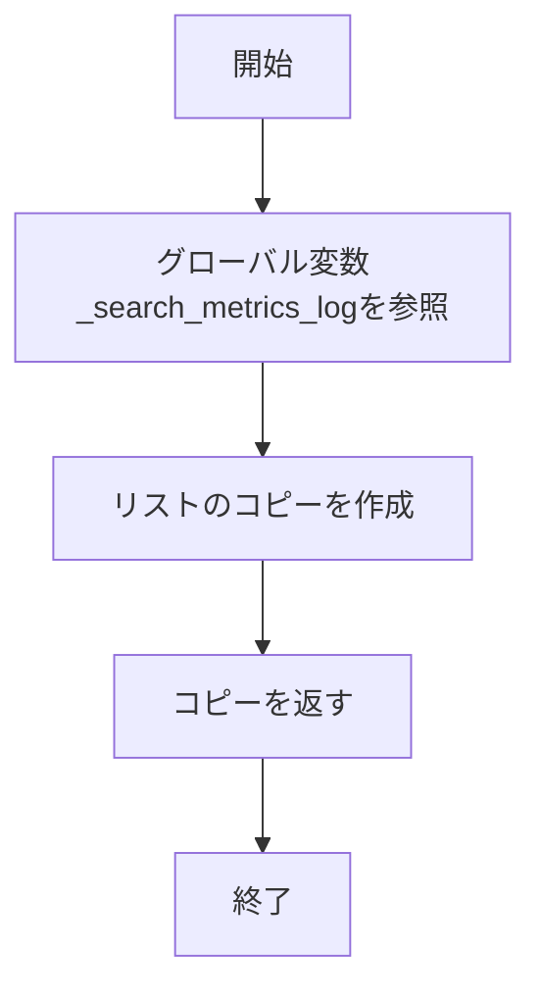
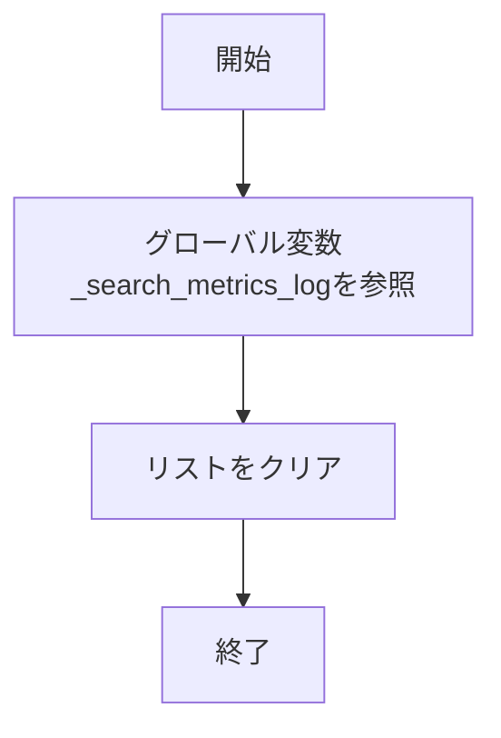
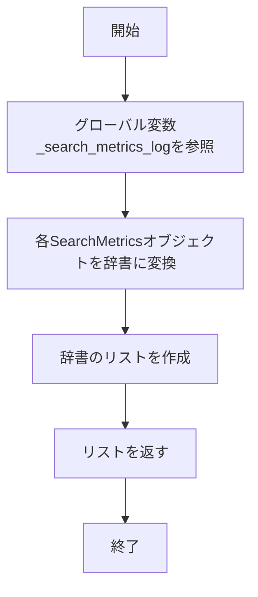
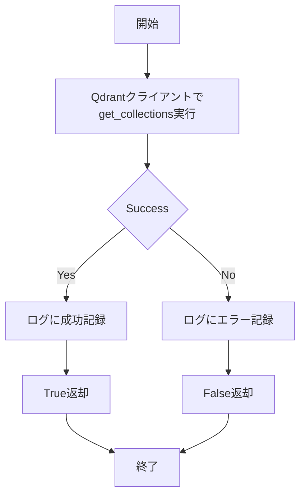
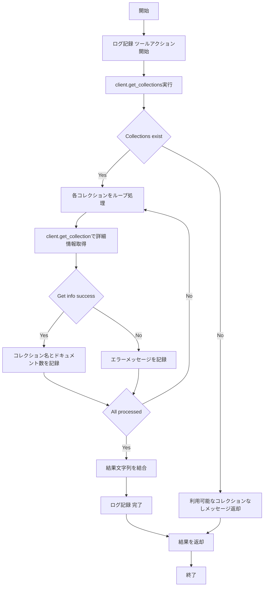
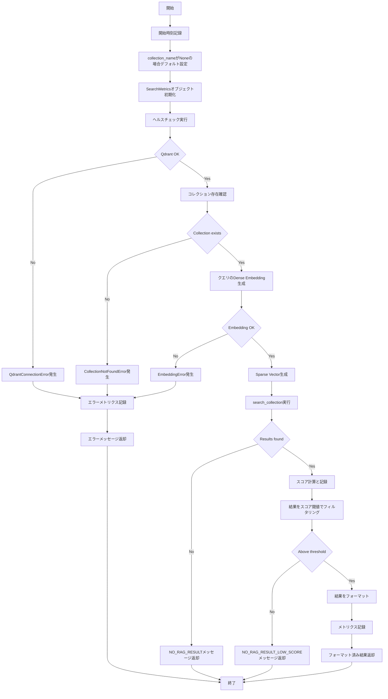

# agent_tools.py 詳細設計書

## 1. ファイルの機能概要

`agent_tools.py`は、RAG（Retrieval-Augmented Generation）システムにおいて、Qdrantベクトルデータベースを使用した知識ベース検索機能を提供するツールモジュールです。

### 主要機能
- Qdrantベクトルデータベースとの接続管理
- コレクション（ナレッジベース）の一覧取得
- セマンティック検索によるナレッジベースからの情報取得
- 検索パフォーマンスメトリクスの収集と評価
- ヘルスチェック機能

### 技術的特徴
- ハイブリッド検索（Dense + Sparse Vector）対応
- 詳細な検索メトリクスの記録
- カスタム例外によるエラーハンドリング
- スコア閾値によるフィルタリング機能

## 2. 関数一覧表

| 関数名 | 処理概要 |
|--------|----------|
| `get_search_metrics()` | 収集した検索メトリクスを取得 |
| `clear_search_metrics()` | メトリクスログをクリア |
| `export_metrics_to_dict()` | メトリクスを辞書形式でエクスポート |
| `check_qdrant_health()` | Qdrantサーバーの接続状態を確認 |
| `list_rag_collections()` | 利用可能なコレクション一覧を取得 |
| `search_rag_knowledge_base()` | ナレッジベースから情報を検索 |

## 3. カスタム例外クラス

| 例外クラス | 説明 |
|-----------|------|
| `RAGToolError` | RAGツール固有エラーの基底クラス |
| `QdrantConnectionError` | Qdrant接続エラー |
| `CollectionNotFoundError` | コレクション未存在エラー |
| `EmbeddingError` | 埋め込みベクトル生成エラー |

## 4. データクラス

### SearchMetrics
検索結果のメトリクスを記録するデータクラス

| フィールド | 型 | 説明 |
|-----------|-----|------|
| `query` | str | 検索クエリ |
| `collection_name` | str | 検索対象コレクション名 |
| `latency_ms` | float | レスポンスタイム（ミリ秒） |
| `total_results` | int | 検索結果総数 |
| `filtered_results` | int | フィルタリング後の結果数 |
| `top_score` | float | 最高スコア |
| `scores` | List[float] | 全スコアリスト |
| `error` | Optional[str] | エラーメッセージ |
| `timestamp` | str | タイムスタンプ |

## 5. 関数のIPO（Input, Process, Output）

### 5.1 `get_search_metrics()`

**Input:** なし

**Process:**


**Output:** `List[SearchMetrics]` - 検索メトリクスのコピー

---

### 5.2 `clear_search_metrics()`

**Input:** なし

**Process:**


**Output:** `None`

---

### 5.3 `export_metrics_to_dict()`

**Input:** なし

**Process:**


**Output:** `List[Dict[str, Any]]` - メトリクスの辞書形式リスト

---

### 5.4 `check_qdrant_health()`

**Input:** なし

**Process:**


**Output:** `bool` - 接続成功時True、失敗時False

---

### 5.5 `list_rag_collections()`

**Input:** なし

**Process:**


**Output:** `str` - コレクション一覧の文字列

---

### 5.6 `search_rag_knowledge_base()`

**Input:**
- `query: str` - 検索クエリ
- `collection_name: Optional[str]` - コレクション名（省略時はデフォルト使用）

**Process:**


**Output:** `str` - 検索結果またはエラーメッセージ

### 出力フォーマット例

#### 成功時の出力
```
Result 1 (Score: 0.85):
Q: [質問内容]
A: [回答内容]
Source: [ソース名]
```

#### エラー時の出力パターン
- `[[NO_RAG_RESULT]]` - 検索結果なし
- `[[NO_RAG_RESULT_LOW_SCORE]]` - 全結果がスコア閾値以下
- `[[RAG_TOOL_ERROR]]` - 各種エラー発生時

## 6. 依存関係

### 外部ライブラリ
- `qdrant_client`: Qdrantベクトルデータベースクライアント
- `dataclasses`: データクラス定義

### 内部モジュール
- `qdrant_client_wrapper`: Qdrant操作のラッパー関数群
- `config`: エージェント設定（AgentConfig）

### 設定値（AgentConfig）
- `RAG_DEFAULT_COLLECTION`: デフォルトコレクション名
- `RAG_SEARCH_LIMIT`: 検索結果の上限数
- `RAG_SCORE_THRESHOLD`: スコア閾値（フィルタリング用）

## 7. エラーハンドリング戦略

1. **カスタム例外による分類**
   - 接続エラー、コレクションエラー、埋め込みエラーを区別
   - エラータイプに応じた適切なメッセージ返却

2. **詳細なエラーメッセージ**
   - エラー発生箇所と原因を明確に記録
   - ユーザー向けとログ向けで異なるレベルの詳細度

3. **メトリクスへのエラー記録**
   - エラー発生時もメトリクスに記録
   - パフォーマンス分析時にエラー率を把握可能

## 8. パフォーマンス最適化

- **ハイブリッド検索**: Dense VectorとSparse Vectorの併用による精度向上
- **スコア閾値フィルタリング**: 低関連性結果の除外による品質向上
- **メトリクス収集**: レイテンシ監視による性能劣化の早期発見
- **エラーハンドリング**: 部分的失敗時でも可能な限り結果を返却

## 9. セキュリティ考慮事項

- Qdrant接続URLの環境変数管理
- エラーメッセージでの内部情報露出の最小化
- ログレベル設定による本番環境での情報漏洩防止