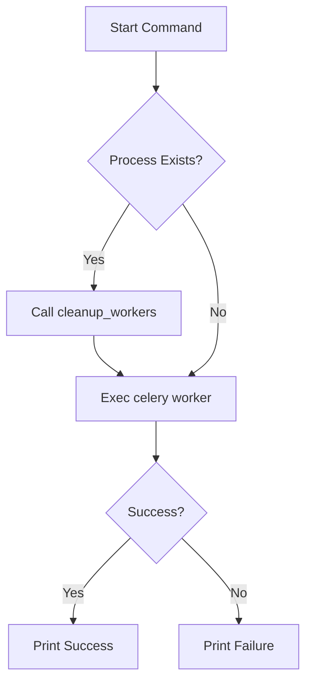
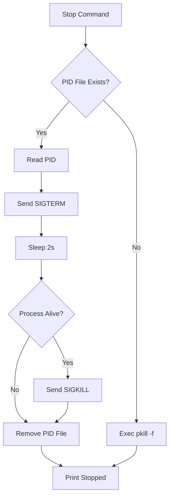

# Script: Start Celery (ワーカー起動スクリプト)

## 1. 概要
`start_celery.sh` は、Q/A生成タスクを非同期処理するための Celery ワーカープロセスを管理（起動、停止、再起動、状態確認）する Bash スクリプトです。
Redis サーバーの状態を確認した上で、適切な設定（並列数、ログレベル、キュー名）でワーカーを起動し、PIDファイルを用いてプロセス管理を行います。

**主な責務:**
*   **Process Management**: ワーカーの起動 (start)、停止 (stop)、再起動 (restart)。
*   **Health Check**: Redis サーバーの稼働確認と、ワーカープロセスの状態監視 (status)。
*   **Configuration**: コマンドライン引数によるワーカー数 (`-w`) やログレベル (`-l`) の動的設定。
*   **Cleanup**: 異常終了時のPIDファイル削除やプロセス強制終了。

## 2. モジュール構成

### 2.1 依存関係

本スクリプトは、システム上の `celery` コマンド、`redis-cli`、および標準的な Unix ツール (`pgrep`, `pkill`, `kill` 等) に依存します。

```mermaid
graph TD
    User[User/System] -->|Command| Script[start_celery.sh]
    
    Script -->|Check| Redis[Redis Server]
    Script -->|Spawn| Celery[Celery Worker Process]
    
    Celery -->|Log| LogFile[logs/celery_qa_*.log]
    Celery -->|PID| PidFile[/tmp/celery_qa.pid]
```

## 3. 関数一覧

| 関数名 | 概要 | 主要引数 |
| :--- | :--- | :--- |
| `usage` | ヘルプメッセージを表示して終了する。 | なし |
| `check_redis` | Redisサーバーが起動しているか確認する。 | なし |
| `cleanup_workers` | 既存のワーカープロセスとPIDファイルを強制的にクリーンアップする。 | なし |
| `start_workers` | Celeryワーカーをバックグラウンドで起動する。 | `WORKERS`, `LOG_LEVEL` (グローバル変数) |
| `stop_workers` | 実行中のワーカーを停止する（SIGTERM -> SIGKILL）。 | なし |
| `check_status` | Redis、ワーカープロセス、キューの状態を表示する。 | なし |

### 4. IPO (Input-Process-Output)

#### Function: `start_workers` IPO

*   **Input**:
    *   `WORKERS`: 並列ワーカー数 (default: 24)
    *   `LOG_LEVEL`: ログ出力レベル (default: info)
    *   `QUEUE_NAME`: 監視対象キュー (default: qa_generation)
*   **Process**:
    1.  既存プロセスの確認 (`pgrep`)。存在すれば `cleanup_workers` を実行。
    2.  `celery` コマンドを構築し、オプション（`--concurrency`, `--logfile` 等）を指定して実行。
    3.  終了コード (`$?`) を確認。
*   **Output**:
    *   標準出力: 起動成功/失敗メッセージ。
    *   ファイル: PIDファイル (`/tmp/celery_qa.pid`)、ログファイル (`logs/celery_qa_%n.log`)。



#### Function: `stop_workers` IPO

*   **Input**: なし（PIDファイルを読み込む）
*   **Process**:
    1.  PIDファイル (`/tmp/celery_qa.pid`) の存在確認。
    2.  存在する場合:
        *   PIDを読み込み、`kill -TERM` を送信。
        *   2秒待機後、プロセスが残っていれば `kill -9` (SIGKILL) で強制終了。
        *   PIDファイルを削除。
    3.  存在しない場合:
        *   プロセス名 (`celery.*worker.*qa_generation`) で `pkill` を実行（フォールバック）。
*   **Output**:
    *   標準出力: 停止結果メッセージ。
    *   システム状態: プロセスの終了。



#### Function: `check_status` IPO

*   **Input**: なし
*   **Process**:
    1.  Redis接続確認 (`redis-cli ping`) とキュー長取得 (`llen`)。
    2.  ワーカープロセス確認 (`pgrep`)。
    3.  起動中の場合、Celery inspectコマンドで詳細情報 (`active`, `stats`) を取得。
    4.  最新ログファイルの末尾を表示 (`tail`)。
*   **Output**:
    *   標準出力: 各コンポーネントの状態レポート。

## 5. 利用方法

```bash
# 起動 (デフォルト設定)
./start_celery.sh start

# ワーカー数を指定して起動
./start_celery.sh start -w 8

# ステータス確認
./start_celery.sh status

# 停止
./start_celery.sh stop
```
