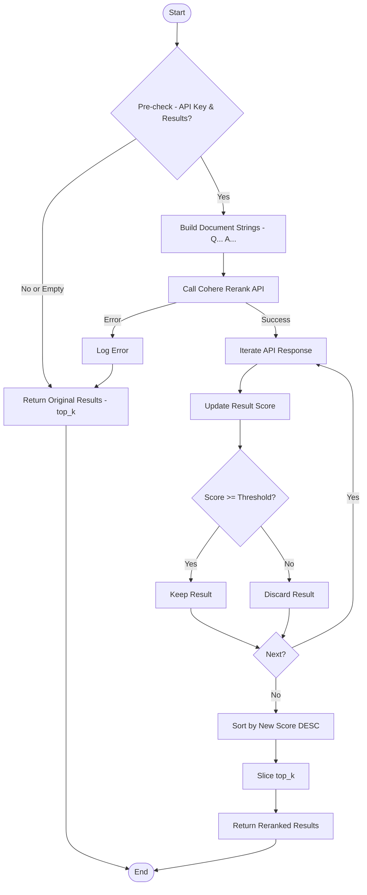
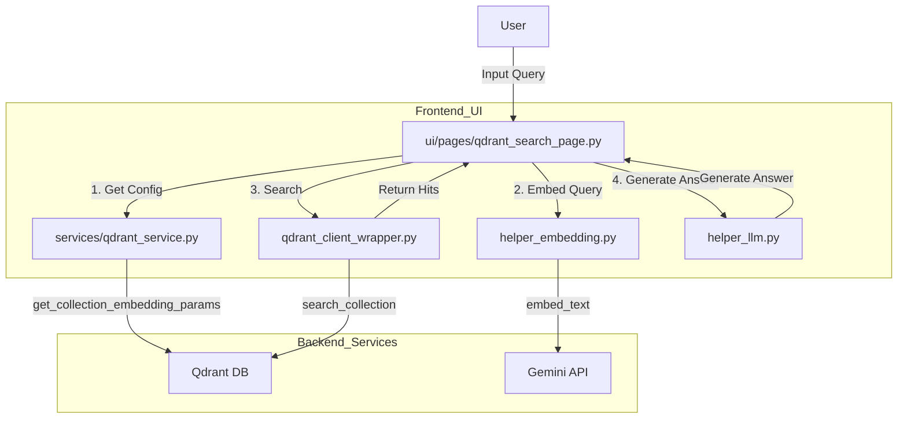
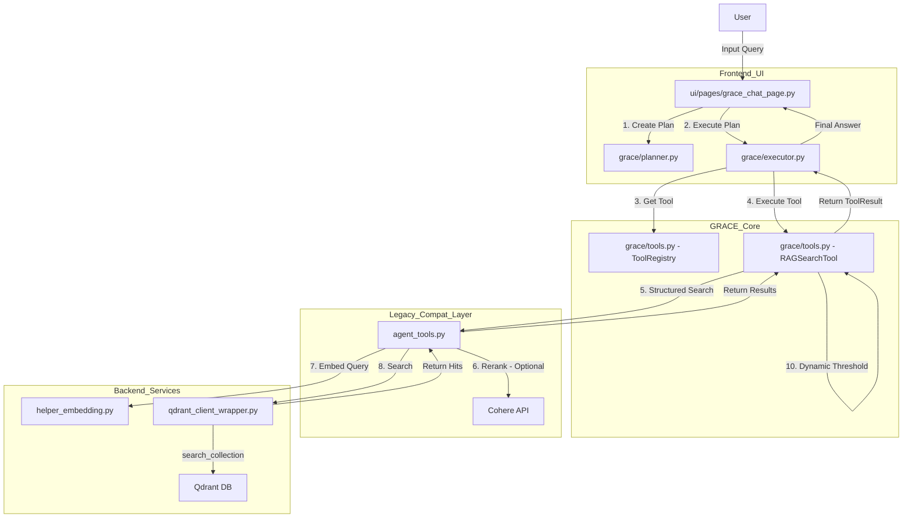

## Gemini 検索と登録の違い（重要）
Gemini (Google Generative AI) の models.embed_content API は、埋め込みの目的に応じて task_type
を指定することでベクトルの最適化を行います。これが一致していないと、同じ文章でもベクトルが異なる方向を向き、コサイン類似度（スコア）が大
幅に低下します。

1. バグのある現状のコード（タスクタイプ未指定）

A. 登録時（ドキュメントのベクトル化）
ファイル: helper_embedding.py
関数: GeminiEmbedding.embed_texts (リストで渡す)

1 # 現状のコード (helper_embedding.py)
2 response = self.client.models.embed_content(
3     model=self.model,
4     contents=batch_texts, # リスト
5     config={"output_dimensionality": self._dims},
6     # ★ ここで task_type が指定されていない！
7     # API仕様: リストを渡すとデフォルトで task_type が推論されるが、
8     # 意図せず "SEMANTIC_SIMILARITY" などになる可能性がある
9 )

B. 検索時（クエリのベクトル化）
ファイル: services/qdrant_service.py -> helper_embedding.py
関数: GeminiEmbedding.embed_text (単一テキスト)

1 # 現状のコード (helper_embedding.py)
2 def embed_text(self, text: str, task_type: Optional[str] = None) -> List[float]:
3     # ...
4     kwargs = {
5         "model": self.model,
6         "contents": text, # 単一文字列
7         "config": config
8     }
9
10     if task_type: # 呼び出し元が指定しない限り None
11         kwargs["task_type"] = task_type
12
13     response = self.client.models.embed_content(**kwargs)
14     # ★ 検索時もデフォルトでは task_type が指定されず、
15     # 単一テキストの場合は "SEMANTIC_SIMILARITY" 扱いになることが多いが、
16     # 検索用途（クエリ）として最適化されない。

2. なぜ問題なのか？（ズレの仕組み）

Geminiの学習モデルにおいて：
* RETRIEVAL_DOCUMENT: 「検索される側」として、質問に対して見つけられやすい特徴空間に配置されます。
* RETRIEVAL_QUERY: 「検索する側」として、回答を持つドキュメントを探しに行くベクトルを生成します。

これらは対（ペア）になるように学習されています。
もし両方とも task_type なし（または
SEMANTIC_SIMILARITY）で行うと、「文章としての類似度」を測ってしまい、質問文と回答文のような「意味は通じるが単語や構成が違う」ペアのスコア
が低くなります。

3. 修正後のコード例

A. 登録時: `RETRIEVAL_DOCUMENT` を明示
ファイル: helper_embedding.py

1 # 修正案 (helper_embedding.py)
2 response = self.client.models.embed_content(
3     model=self.model,
4     contents=batch_texts,
5     config={"output_dimensionality": self._dims},
6     task_type="retrieval_document" # ★ これを追加！
7 )

B. 検索時: `RETRIEVAL_QUERY` を明示
ファイル: services/qdrant_service.py

1 # 修正案 (services/qdrant_service.py)
2 def embed_query_for_search(query: str, ...):
3     # ...
4     # embedding_clientを作成
5     embedding_client = create_embedding_client(provider="gemini")
6
7     # ★ embed_text の引数で task_type を指定！
8     vector = embedding_client.embed_text(query, task_type="retrieval_query")
9     return vector

このように修正することで、登録側と検索側の役割が明確になり、ベクトル空間上で正しくマッチングされるようになります。

## search_rag_knowledge_base_structured <- agent_tools.rerank_results: コメント化による影響

✦ rerank_results 関数およびそれを呼び出している関数の利用箇所を調査した結果を報告します。

プロジェクト全体での rerank_results の利用状況、およびその上位呼び出し元の影響範囲は以下の通りです。

1. rerank_results 関数の直接の利用箇所
   調査の結果、コード内でこの関数を直接呼び出しているのは `agent_tools.py` の内部のみ でした。

| ファイルパス   | 呼び出し元関数                       | 役割                                                               |
| :------------- | :----------------------------------- | :----------------------------------------------------------------- |
| agent_tools.py | search_rag_knowledge_base_structured | Qdrantからの候補（20件）をCohereで再ランク付けして絞り込む中核処理 |

---

2. 影響を受ける「上位呼び出し元」の波及範囲
   rerank_results を含む search_rag_knowledge_base_structured
   は、以下のファイル・クラスから利用されており、これら全ての機能において「再ランク付け（およびそれによるスコアの正規化）」が無効化されます
   。

A. GRACE エージェント (New)

* ファイル: grace/tools.py
* クラス/メソッド: RAGSearchTool.execute
* 影響: GRACEエージェントの「検索ステップ」において、結果の順序が変わるほか、agent_tools.py 側で 0.5
  以下の結果が返されなくなるため、後続の「動的閾値（0.98判定）」にも影響します。

B. Legacy エージェント (ReAct)

* ファイル: agent_tools.py
* 関数: search_rag_knowledge_base
* 影響: 旧型エージェントの検索結果が、単純なベクトル検索のスコア（RRF等）に基づいた順序になります。

C. UI ページ (Legacy 対話画面)

* ファイル: ui/pages/agent_chat_page.py
* 影響: Legacy チャット画面でエージェントがナレッジを検索する際、Rerank が行われなくなります。

---

3. 無効化した場合の主な挙動変化
   rerank_results を無効化（パススルー化）した場合、以下の事象が発生します。
4. スコアの尺度の変化:

   * Cohere Rerank は「0.0〜1.0 の確率値」を返しますが、Qdrant の素の結果（Hybrid検索時）は RRF（単純なベクトル検索のスコア）
     スコアなどの異なる尺度になる場合があります。
5. 足切り（Threshold）の消失:

   * 現在 rerank_results 内で threshold=0.5
     による足切りが行われていますが、これを止めると「関連性の低い情報」も上位に含まれるようになり、LLMが誤った回答を生成するリスク（ハ
     ルシネーション）が高まります。
6. 検索精度の低下:

   * 特にキーワード一致（Sparse）と意味検索（Dense）を統合した直後の順位は必ずしも最適ではないため、トップ回答の的中率が下がります。

まとめ：調査結果一覧

| 分類         | ファイル / 関数                                       | 備考                               |
| :----------- | :---------------------------------------------------- | :--------------------------------- |
| 直接呼び出し | agent_tools.py / search_rag_knowledge_base_structured | 唯一の直接呼び出し箇所             |
| 間接的影響   | grace/tools.py / RAGSearchTool                        | GRACEエージェントの検索品質に直結  |
| 間接的影響   | agent_tools.py / search_rag_knowledge_base            | Legacyエージェントの検索品質に影響 |
| 間接的影響   | ui/pages/agent_chat_page.py                           | Legacy UIでの回答生成に影響        |

※ agent_rag.py 自体は UI のルーティングのみを担当しているため、ロジック変更による直接的なクラッシュ等は発生しません。

## `rerank_results` 関数の詳細設計 (IPO)

**ファイル**: `agent_tools.py`

### 1. Input (入力)

* `query` (str): ユーザーの検索クエリ。
* `results` (List[Dict[str, Any]]): Qdrantから取得した検索結果候補のリスト。各要素はペイロード(`question`, `answer`等)と初期スコアを持つ。
* `top_k` (int): 最終的に残す結果の件数（デフォルト: 3）。
* `threshold` (float): 再計算後のスコアに対する足切り閾値（デフォルト: 0.5）。
* **環境変数/設定**: `CohereConfig.API_KEY`, `CohereConfig.RERANK_MODEL`。

### 2. Process (処理)

1. **前提チェック**:
   * `results` が空、または `CohereConfig.API_KEY` が未設定、または `cohere` ライブラリがない場合、入力された `results` をそのまま `top_k` 件で切り出して返す（パススルー）。
2. **ドキュメント構築**:
   * `results` の各要素から、Rerankモデルに入力するためのテキストを作成する。
   * フォーマット: "Question: {question}\nAnswer: {answer}"
3. **Cohere API 実行**:
   * `cohere.Client` を初期化。
   * `client.rerank` メソッドを呼び出し。
     * `model`: 設定されたモデル名。
     * `query`: ユーザーのクエリ。
     * `documents`: 構築したドキュメントリスト。
     * `top_n`: 入力されたドキュメント数（全件評価）。
4. **結果の再構成**:
   * APIからの応答をループ処理。
   * 元の `results` をインデックスで参照し、コピーを作成。
   * `score` をAPIから返却された `relevance_score` で上書き。
5. **フィルタリング & ソート**:
   * `new_score >= threshold` の結果のみをリストに追加。
   * スコアの降順でソート。
6. **例外処理**:
   * API呼び出し等のエラーが発生した場合、ログを出力し、フォールバックとして元の `results` を `top_k` 件返却する。

### Process Flow (Mermaid)

def rerank_results が使われている、クラス、関数：

### 3. Output (出力)

* `reranked_results` (List[Dict[str, Any]]): 再ランク付けされ、閾値フィルタリングとソートが適用された結果リスト。

---

## @doc/compare_qdrant_vs_grace.md：

間接的に利用しているクラス・関数（Chain of Calls）

search_rag_knowledge_base_structured を経由して、実質的に再ランク付け機能を利用している箇所です。

* クラス: RAGSearchTool (grace/tools.py)

  * メソッド: execute
    * 役割: GRACE エージェントの検索ステップにおいて、このメソッドが実行される際、内部で agent_tools
      の検索関数を呼び出すため、自動的にリランクが適用されます。
* 関数: search_rag_knowledge_base (agent_tools.py)

  * 役割: 旧来のエージェント用。内部で search_rag_knowledge_base_structured
    を呼び出しているため、ここを経由した場合もリランクが実行されます。

まとめ（呼び出し階層）

1. [UI/Agent] RAGSearchTool.execute (GRACEエージェント)
   * ↘ 呼び出し: search_rag_knowledge_base_structured
     * ↘ [直接実行]: rerank_results (Cohere API使用)

### 旧プロンプト

【計画作成のルール】

1. 最小限のステップで目標を達成すること（通常2-5ステップ）
2. 各ステップには明確な期待出力を設定
3. 依存関係を正しく設定（depends_onは先行ステップのIDのみ）
4. 失敗時の代替手段（fallback）を検討
5. 最後のステップは必ず "reasoning" で回答を生成
6. コレクションは上記リストから最も適切なものを選択すること（存在しないコレクション名は使用不可）

### 残る差異

1. Rerank (再ランク付け): agent_tools.py 内で Cohere API によるリランクが実行される可能性があります（スコアの順序が変わります）。
2. 動的閾値 (Dynamic Thresholding): grace/tools.py の後半にある「Top 1が0.98以上の場合は他を捨てる」処理が残ります。
3. 複数コレクションの自動検索:
   UIで指定したコレクションだけでなく、設定ファイルにある優先順位に従って他のコレクションも探しに行く挙動が残ります。

---

## Qdrant検索 vs GRACEエージェント検索 比較調査

本ドキュメントは、正常に動作する「Qdrant検索」と、「GRACEエージェント(New)」の検索処理フローを対比・調査した結果をまとめたものである。
※2026/01/03更新: コード修正により、GRACE側の過剰なフィルタリングロジックは無効化された。

## （1）「Qdrant検索」の処理フロー (正常)

「Qdrant検索」機能は、ユーザーが指定したコレクションに対して直接ベクトル検索を行い、その結果を表示するシンプルな構成となっている。

### 1. 処理フロー概要 (Architecture Overview)

### 2. データ処理の詳細フロー (Step-by-Step Data Flow)

| Step  | 処理フェーズ                       | 実行ファイル / クラス                                      | 関数 / メソッド                                       | 処理内容の詳細                                                                                                                    |
| :---- | :--------------------------------- | :--------------------------------------------------------- | :---------------------------------------------------- | :-------------------------------------------------------------------------------------------------------------------------------- |
| **1** | **UI初期化**                       | `ui/pages/qdrant_search_page.py`                           | `show_qdrant_search_page`                             | Qdrantクライアント接続、コレクション一覧取得、検索設定（Top-K, Hybrid等）のUI表示。                                               |
| **2** | **検索トリガー**                   | `ui/pages/qdrant_search_page.py`                           | (Button Click)                                        | 「検索実行」ボタン押下により処理開始。                                                                                            |
| **3** | **設定取得**                       | `services/qdrant_service.py`                               | `get_collection_embedding_params`                     | 選択されたコレクションのベクトル次元数（例: 3072）を取得し、使用すべきモデル（Gemini vs OpenAI）を決定。                          |
| **4** | **クエリ埋め込み**                 | `services/qdrant_service.py` `helper_embedding.py`      | `embed_query_for_search` `create_embedding_client` | ユーザーのクエリテキストをベクトル（Dense Vector）に変換。 ※`helper_embedding.py` がAPI呼び出しを担当。                       |
| **5** | **Sparse生成** *(Hybrid時のみ)* | `qdrant_client_wrapper.py` `helper_embedding_sparse.py` | `embed_sparse_query_unified`                          | キーワード検索用のSparseベクトルを生成（Splade等を使用）。                                                                        |
| **6** | **検索実行**                       | `qdrant_client_wrapper.py`                                 | `search_collection`                                   | 生成したベクトルを用いてQdrantに対して検索クエリ(`client.query_points` or `search`)を発行。 Dense単体またはHybrid(RRF)を実行。 |
| **7** | **結果整形**                       | `ui/pages/qdrant_search_page.py`                           | `MockHit` (Inner Class)                               | 検索結果（Dictのリスト）をUI表示用のオブジェクトに変換。                                                                          |
| **8** | **回答生成**                       | `ui/pages/qdrant_search_page.py` `helper_llm.py`        | `create_llm_client` `generate_content`             | 検索結果（Top-1）のコンテキストをプロンプトに組み込み、Gemini APIで最終的な回答を生成・表示。                                     |

### 3. 主要コンポーネント解説

#### A. `ui/pages/qdrant_search_page.py`

* **役割**: ユーザーインターフェースとオーケストレーション。
* **特徴**: ロジックを直接持たず、`services` や `wrapper` を呼び出して処理をつなぐ役割に徹している。エラーハンドリングもここで行う。

#### B. `services/qdrant_service.py`

* **役割**: ビジネスロジック層。
* **重要関数 `get_collection_embedding_params`**: Qdrantのコレクション設定（`size: 3072` など）から、動的に適切なEmbeddingモデル（`gemini-embedding-001`）を解決するロジックが含まれている。これにより、OpenAI/Gemini混在環境でも正しいベクトル生成が可能になっている。

#### C. `qdrant_client_wrapper.py`

* **役割**: Qdrant SDKの抽象化ラッパー。
* **重要関数 `search_collection`**: Qdrantのバージョン差異（`search` vs `query_points`）や、Dense/Hybrid検索の違いを吸収し、統一されたインターフェースで検索機能を提供する。Named Vector ("default") の処理もここに含まれる。

## （2）「GRACE エージェント (New)」の処理フロー (修正済み)

「GRACE エージェント」は、計画(Plan)と実行(Execute)を分離したアーキテクチャを採用しており、検索処理は「ツール」として実装されている。
**※2026/01/03 修正**: `planner.py` および `tools.py` の更新により、過剰なキーワードフィルタリング機能が削除(無効化)された。

### 1. 処理フロー概要 (Architecture Overview)

### 2. データ処理の詳細フロー (Step-by-Step Data Flow)

| Step  | 処理フェーズ       | 実行ファイル / クラス               | 関数 / メソッド                        | 処理内容の詳細                                                                                                                                     |
| :---- | :----------------- | :---------------------------------- | :------------------------------------- | :------------------------------------------------------------------------------------------------------------------------------------------------- |
| **1** | **計画立案**       | `grace/planner.py`                  | `create_plan`                          | ユーザーの質問から実行計画を作成。 **【修正】** プロンプトにて「クエリのキーワード化禁止」「原文維持」を指示。                                  |
| **2** | **ステップ実行**   | `grace/executor.py`                 | `_execute_step`                        | 計画の各ステップを順次実行。`rag_search` アクションに対応するツールを呼び出す。                                                                    |
| **3** | **ツール実行**     | `grace/tools.py` (RAGSearchTool) | `execute`                              | **【無効化済み】** ~~キーワード抽出（正規表現による漢字・カタカナ抽出）。~~ **【独自ロジック】** コレクション優先順位に基づくループ処理は継続。 |
| **4** | **検索委譲**       | `agent_tools.py`                    | `search_rag_knowledge_base_structured` | Legacy実装との互換レイヤー。ここで埋め込み生成と検索実行を行う。                                                                                   |
| **5** | **検索実行**       | `qdrant_client_wrapper.py`          | `search_collection`                    | (1)と同じ検索関数。Dense+Sparseのハイブリッド検索を実行。                                                                                          |
| **6** | **Rerank**         | `agent_tools.py`                    | `rerank_results`                       | **【独自ロジック】** Cohere APIを使用した再ランク付け（設定有効時のみ）。スコアが大きく変動する可能性あり。                                        |
| **7** | **フィルタリング** | `grace/tools.py` (RAGSearchTool) | `execute` (内)                         | **【無効化済み】** ~~抽出した「必須キーワード」が検索結果に含まれていない場合、その結果を除外する。~~                                              |
| **8** | **閾値処理**       | `grace/tools.py` (RAGSearchTool) | `execute` (内)                         | **【独自ロジック】** Top 1のスコアが 0.98 以上の場合、2位以下の結果を全て切り捨てる。                                                              |

### 3. 主要コンポーネント解説（特異点）

#### A. `grace/tools.py` (RAGSearchTool)

* **役割**: GRACEエージェント専用の検索ツールラッパー。
* **現状の挙動 (2026/01/03以降)**:
  1. **キーワードフィルタリング (削除済み)**: 以前は正規表現による強制フィルタがあったが、コード上でコメントアウトされた。現在はQdrantの検索結果がそのまま採用される。
  2. **コレクション自動切換え**: 指定されたコレクション以外も勝手に探しに行く挙動は**残存**している。

#### B. `agent_tools.py`

* **役割**: 古いエージェント実装からの遺産だが、GRACEからも利用されている。
* **特異点**: `rerank_results` によるスコアの書き換え。Cohere Rerankを使用すると、QdrantのCosine Similarityスコアとは全く異なる基準でスコアが上書きされる。

#### C. `grace/executor.py`

* **役割**: 実行エンジン。
* **特異点**: ツールからの戻り値を受け取り、信頼度計算(`_llm_calculate_step_confidence`)を行う。ここでツールが結果を返しても、信頼度が低いと判定されると「失敗」扱いになる可能性がある。

## （3）データ処理の比較・分析 (Data Processing Comparison)

コード修正により、GRACEエージェントも「Qdrant検索」に近い、素直なベクトル検索結果を返す構成に変更された。

### 1. データ処理パイプラインの対比

| 処理ステップ              | (1) Qdrant検索 (正常)                  | (2) GRACEエージェント (修正後)                                                         | 差異の影響・リスク                                                                                                                            |
| :------------------------ | :------------------------------------- | :------------------------------------------------------------------------------------- | :-------------------------------------------------------------------------------------------------------------------------------------------- |
| **A. クエリ前処理**       | 特になし（ユーザー入力をそのまま使用） | **特になし** (以前のRegex抽出は廃止)                                                | Plannerのプロンプトで原文維持が指示されており、自然言語でのベクトル検索が適切に機能するようになった。                                         |
| **B. 検索対象**           | ユーザーがUIで指定した単一コレクション | **自動ループ処理** 指定コレクション → 設定された優先順位リスト順に全探索。         | 意図したコレクション以外から無関係な情報を拾ってくるリスク（ノイズ混入）がある。また、処理時間が長くなる。                                    |
| **C. ベクトル検索**       | Dense または Hybrid (選択可)           | Dense + Sparse (Hybrid固定)                                                            | 基本的な検索能力に大きな差はないが、GRACEは常にSparse併用のため、キーワード一致への依存度が高い。                                             |
| **D. スコアリング**       | QdrantのCosine Similarity / RRFスコア  | **Cohere Rerank (Optional)** `agent_tools.py` で外部APIによるスコア上書きが発生。   | Rerankが有効な場合、Qdrantのスコアが無視され、全く異なる基準で順位付けされる。APIキーがない場合でも処理が走る実装になっている点が不安定要素。 |
| **E. 事後フィルタリング** | 特になし                               | **なし** (以前の強制削除ロジックは廃止)                                             | ベクトル検索の強みである「表記ゆれ吸収」や「意味検索」が**有効化**された。                                                                    |
| **F. 結果選別**           | Top-K 件を表示                         | **動的閾値 (Dynamic Thresholding)** Top 1スコア >= 0.98 の場合、2位以下を切り捨て。 | 1件だけ突出してスコアが高い場合、関連する補足情報が提示されず、回答の網羅性が下がる。                                                         |

### 2. 根本原因の特定 (Resolution Status)

以前、GRACEエージェントで発生していた「検索ヒットしない」問題の主因であった**過剰なフィルタリングロジック (`grace/tools.py`) は無効化された**。

1. **正規表現による必須キーワード強制 (The "Keyword Trap")**:

   * **【解決済み】** ロジックがコードから削除（コメントアウト）されたため、自然言語クエリでも正しくヒットするようになった。
2. **不透明なRerankとスコア操作**:

   * **【未解決】** `agent_tools.py` 側でのRerank処理や、`grace/tools.py` での「動的閾値（Top 1 >= 0.98で切り捨て）」は残存している。これらが特定のケースで期待しない挙動を引き起こす可能性は残る。

### 3. 結論

今回の修正により、GRACEエージェントの検索機能は「Qdrantの素の検索結果」を信頼する設計に回帰し、主要な障害は取り除かれた。
今後は「コレクションの自動ループ」によるノイズ混入や、「動的閾値」による情報不足が課題となる可能性があるが、致命的な検索不能状態は脱したと言える。
