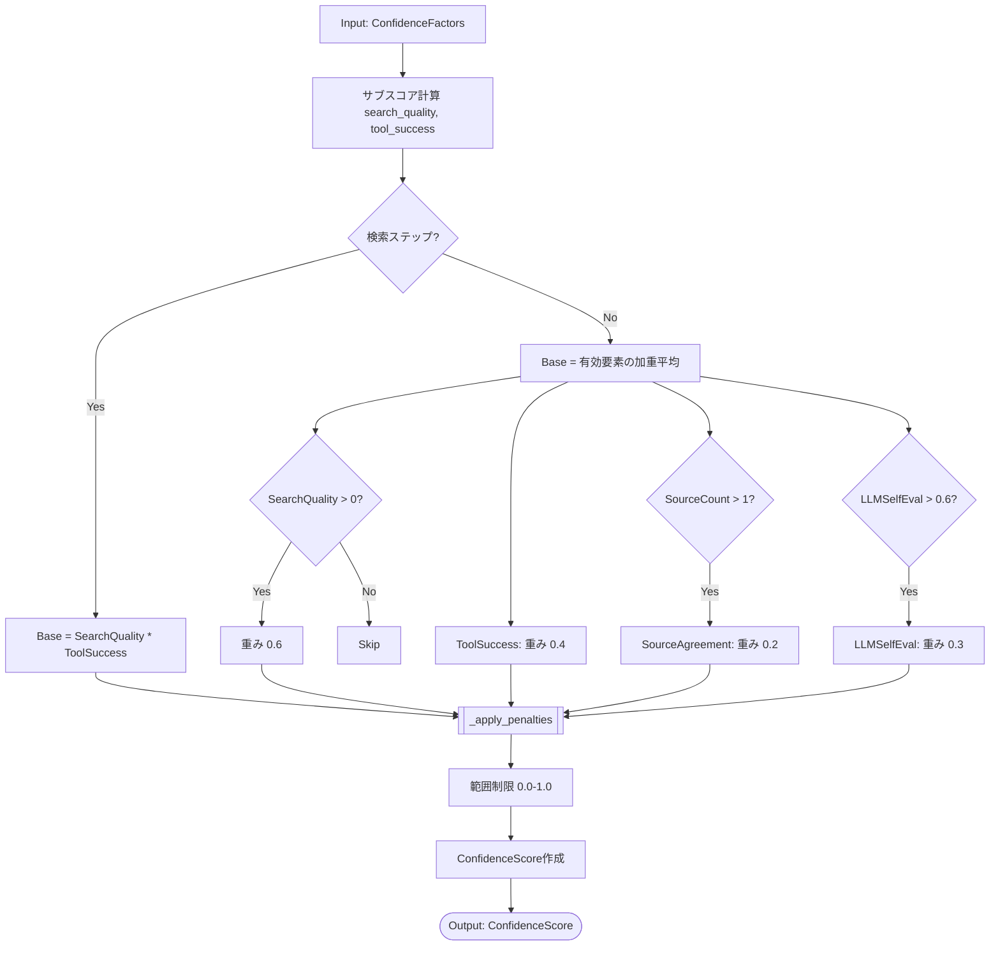
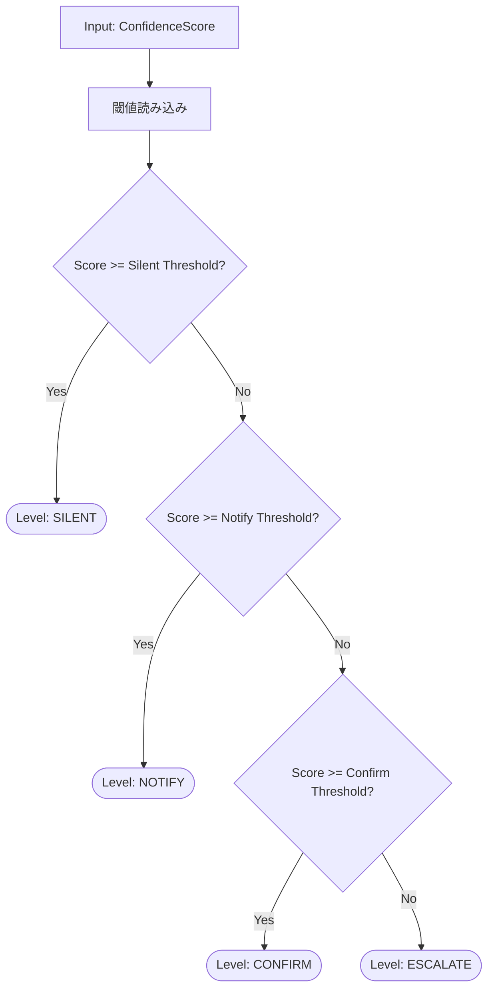
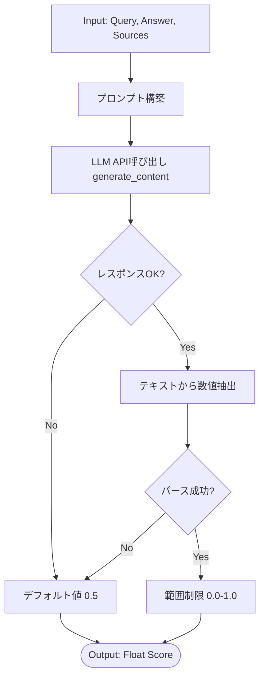
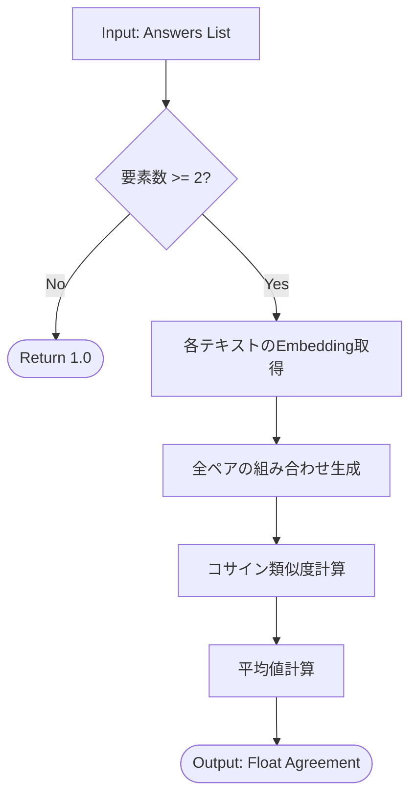
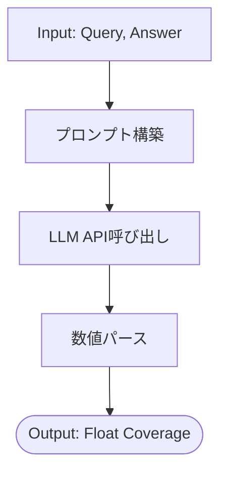
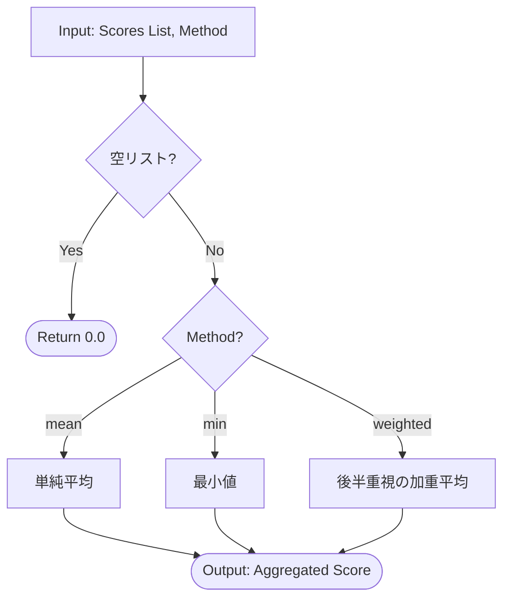

# GRACE Confidence 詳細設計書

**ファイル名:** `grace/confidence.py`

## 概要
GRACE Confidenceは、ハイブリッド方式（重み付き平均 + LLM自己評価）による多軸信頼度計算を実装するモジュールです。RAG検索の品質、ソース間の一致度、LLMによる自己評価、ツール実行の成功率など、複数の要因を統合して信頼度スコア（0.0-1.0）を算出し、それに基づいて介入レベル（Intervention Level）を決定します。

---

## クラス・関数一覧

| 種類 | 名前 | 入力 (Input) | 出力 (Output) | 概要 |
| :--- | :--- | :--- | :--- | :--- |
| **Data Class** | `ConfidenceFactors` | - | - | 信頼度計算に使用される各要素（検索結果数、スコア、LLM評価等）を保持するデータクラス。 |
| **Data Class** | `ConfidenceScore` | - | - | 計算された信頼度スコア、内訳、適用されたペナルティを保持するデータクラス。 |
| **Enum** | `InterventionLevel` | - | - | 介入レベル（SILENT, NOTIFY, CONFIRM, ESCALATE）の列挙型。 |
| **Data Class** | `ActionDecision` | - | - | 信頼度に基づくアクション決定（レベル、理由、推奨アクション）を保持するデータクラス。 |
| **Class** | `ConfidenceCalculator` | Config | - | 信頼度計算のメインロジックを提供するクラス。 |
| Method | `ConfidenceCalculator.calculate` | `ConfidenceFactors` | `ConfidenceScore` | 複数の要因を重み付けして統合し、信頼度スコアを計算する。 |
| Method | `ConfidenceCalculator.decide_action` | `ConfidenceScore` | `ActionDecision` | スコアに基づいて、ユーザー介入の必要性を判定する。 |
| **Class** | `LLMSelfEvaluator` | Config, Model Name | - | LLMを使用して生成された回答の自己評価を行うクラス。 |
| Method | `LLMSelfEvaluator.evaluate` | Query, Answer, Sources | Float (0.0-1.0) | LLMに回答の正確性・適切性・スタイルを評価させ、スコアを返す。 |
| **Class** | `SourceAgreementCalculator` | Config | - | 複数の情報源（回答）間の一致度を計算するクラス。 |
| Method | `SourceAgreementCalculator.calculate` | List[str] (Answers) | Float (0.0-1.0) | Embeddingを用いて回答間のコサイン類似度を計算し、平均一致度を返す。 |
| **Class** | `QueryCoverageCalculator` | Config, Model Name | - | 回答が質問の要素をどれだけ網羅しているかを計算するクラス。 |
| Method | `QueryCoverageCalculator.calculate` | Query, Answer | Float (0.0-1.0) | LLMを使用して質問に対する回答の網羅度を評価する。 |
| **Class** | `ConfidenceAggregator` | Config | - | 複数のステップにわたる信頼度を集計するクラス。 |
| Method | `ConfidenceAggregator.aggregate` | List[ConfidenceScore], Method | Float | 指定された方法（平均、最小値、重み付き平均）でスコアを集計する。 |

---

## 詳細設計 (IPO + Mermaid)

### 1. Method: `ConfidenceCalculator.calculate`

複数の信頼度要因（Factors）を入力とし、設定された重みとロジックに基づいて統合的な信頼度スコアを計算します。

#### IPO

*   **Input:**
    *   `factors`: `ConfidenceFactors` (検索品質、ソース一致度、LLM評価、ツール成功率などの生データ)
*   **Process:**
    1.  検索品質 (`search_quality`)、ツール成功率 (`tool_success`) を個別に計算。
    2.  ステップの種類 (`is_search_step`) に応じてベーススコアの計算ロジックを分岐。
        *   **検索ステップ:** 検索品質をベースとし、ツール成功率を乗算して減点。
        *   **非検索ステップ:** 有効な要素（検索品質、ツール成功率、ソース一致度、LLM評価、網羅度）のみで加重平均を計算。
    3.  特定の条件（検索結果0件、ソースなし等）に基づいてペナルティ関数 (`_apply_penalties`) を適用。
    4.  スコアを 0.0 - 1.0 の範囲に正規化（クランプ）。
*   **Output:**
    *   `ConfidenceScore`: 計算結果のスコア、要素の内訳 (`breakdown`)、適用されたペナルティリスト。

---

### 2. Method: `ConfidenceCalculator.decide_action`

計算された信頼度スコアを閾値と比較し、次のアクション（介入レベル）を決定します。

#### IPO

*   **Input:**
    *   `score`: `ConfidenceScore` (計算済みの信頼度スコア)
*   **Process:**
    1.  設定ファイル (`config.confidence.thresholds`) から閾値を取得。
    2.  スコアと比較してレベルを決定。
        *   `score >= silent` -> `SILENT` (自動進行)
        *   `score >= notify` -> `NOTIFY` (ステータス表示)
        *   `score >= confirm` -> `CONFIRM` (確認推奨)
        *   `else` -> `ESCALATE` (介入必須)
*   **Output:**
    *   `ActionDecision`: 決定されたレベル、理由、推奨アクション。

---

### 3. Method: `LLMSelfEvaluator.evaluate`

LLMを使用して、生成された回答の品質を自己評価します。

#### IPO

*   **Input:**
    *   `query`: ユーザーの質問
    *   `answer`: 生成された回答
    *   `sources`: 使用された情報源リスト (Optional)
*   **Process:**
    1.  評価用プロンプト (`EVAL_PROMPT`) に入力情報を埋め込む。
    2.  LLM (`genai.Client`) にリクエストを送信。
    3.  レスポンスから数値（0.0-1.0）を抽出・パースする。
    4.  パースエラー時はデフォルト値 (0.5) を使用。
*   **Output:**
    *   `float`: 信頼度スコア。

---

### 4. Method: `SourceAgreementCalculator.calculate`

複数の回答（または情報源の内容）が一致しているかを、Embedding類似度を用いて計算します。

#### IPO

*   **Input:**
    *   `answers`: 比較対象のテキストリスト
*   **Process:**
    1.  リスト要素が2つ未満なら `1.0` を返す。
    2.  各テキストのEmbeddingベクトルを生成 (`embed_model` 使用)。
    3.  全ての組み合わせ（ペア）についてコサイン類似度を計算。
    4.  類似度の平均値を算出。
*   **Output:**
    *   `float`: 平均一致度 (0.0-1.0)。

---

### 5. Method: `QueryCoverageCalculator.calculate`

回答が質問の要素をどれだけ網羅しているかをLLMを用いて評価します。

#### IPO

*   **Input:**
    *   `query`: 元の質問
    *   `answer`: 生成された回答
*   **Process:**
    1.  評価用プロンプト (`COVERAGE_PROMPT`) を構築。
    2.  LLMにリクエストを送信。
    3.  レスポンス（数値）をパース。
*   **Output:**
    *   `float`: 網羅度スコア (0.0-1.0)。

---

### 6. Method: `ConfidenceAggregator.aggregate`

複数のステップ（例：検索→推論）で得られた信頼度スコアを統合し、計画全体の信頼度を算出します。

#### IPO

*   **Input:**
    *   `scores`: `ConfidenceScore` のリスト
    *   `method`: 集計方法 (`mean`, `min`, `weighted`)
*   **Process:**
    1.  スコアリストが空なら `0.0` を返す。
    2.  指定された `method` に従って計算。
        *   `mean`: 単純平均。
        *   `min`: 最小値（ボトルネック重視）。
        *   `weighted`: 後半のステップほど重みを大きくする（時系列重視）。
*   **Output:**
    *   `float`: 統合された信頼度スコア。

