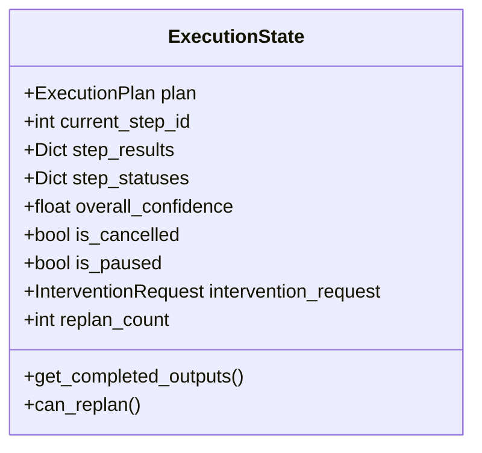
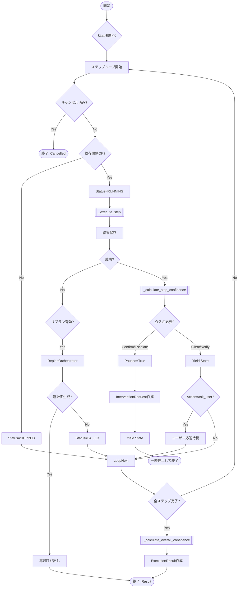
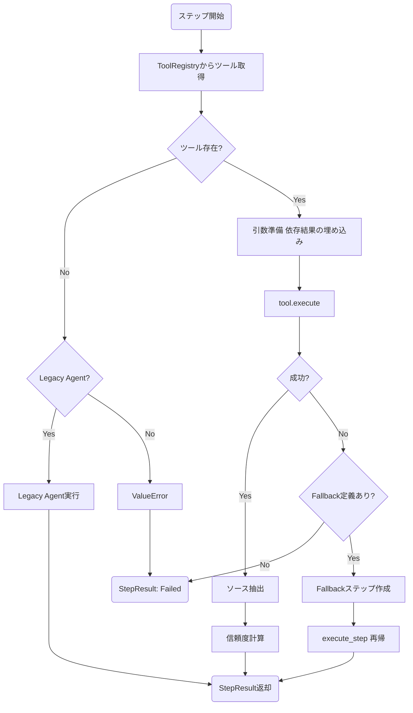
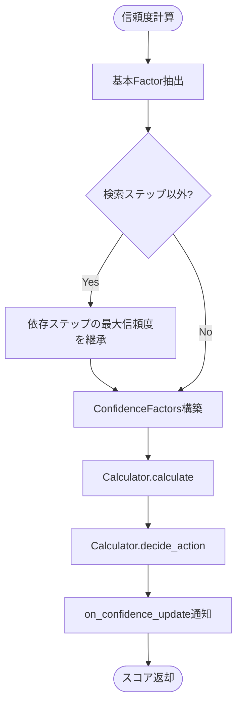
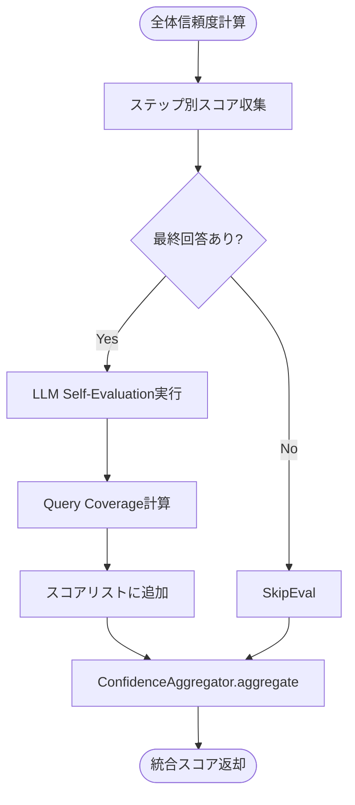

### 評価関数関連の調査：
---
def _calculate_step_confidence
ここを llm化すれば良い！

---
・そもそもスコアとは？
・Evaluate (評価): 実行結果に対し、定量・定性の両面から「信頼度スコア」を算出します。
・「AIの過信を防ぎ、客観的な数値を提示する」
・実行結果の品質を多角的に評価し、0.0 〜 1.0 のスコアを算出します。

executor._calculate_step_confidence
# ConfidenceCalculatorで計算
confidence_score = self.confidence_calculator.calculate(confidence_factors)
confidence = self._calculate_step_confidence(tool_result, step, state)

---
・[OUTPUT]
_calculate_step_confidence はスコア (float) のみを返しますが、その呼び出し元である Executor._execute_step が最終的に生成する
  StepResult の OUTPUT フィールドについて詳細に説明します。

  ---

  StepResult の出力フィールド詳細 (Step 3: Reasoning の場合)

  Step 3 の実行完了時に生成される StepResult オブジェクトの各フィールド構成です。

  1. step_id (int)
   * 値: 3 (通常)
   * 説明: 実行されたステップの識別子。計画 (ExecutionPlan) 内の step_id と一致します。

  2. status (str)
   * 値: "success" (通常), "failed", "partial"
   * 説明: ステップ実行の結果ステータス。
       * "success": ツール実行が例外なく完了し、結果が得られた場合。
       * "failed": 実行中に例外が発生した場合。

  3. output (Optional[str])
   * 値: 【最重要】生成された最終回答テキスト
       * 例: "社内規定によると、リモートワークは週3回まで許可されています。申請は... [Source: rules.pdf]"
   * 説明: ReasoningTool が生成した自然言語による回答です。
       * _format_output メソッドを経由して、必ず文字列型に変換されています。

  4. confidence (float)
   * 値: 0.0 〜 1.0 (例: 0.85)
   * 説明: このステップの信頼度スコア。
       * Step 3 の場合、自身で検索を行わないため、依存元（Step 1, 2）の検索結果の信頼度（最大値）を継承 した値になることが多いです。
       * 計算ロジック: _calculate_step_confidence

  5. sources (List[str])
   * 値: ソース（情報源）のリスト
       * 例: ["rules.pdf", "faq_2024.csv"]
   * 説明: 回答の根拠となったファイル名やID。
       * 注意点: Step 3 の場合、ツール（ReasoningTool）自体はテキストしか返さないことが多いため、ここが空 ([]) になる場合があります。
       * ただし、ReasoningTool が特定のフォーマット（例: JSONや Source: ... という文字列）でソース情報を返した場合、_extract_sources
         メソッドによって抽出されます。
       * また、Step 3 の sources が空であっても、システム全体としては先行ステップ（Step 1, 2）で取得したソースを利用可能です。

  6. error (Optional[str])
   * 値: None (成功時), エラーメッセージ文字列 (失敗時)
   * 説明: 実行中に発生した例外の内容。

  7. execution_time_ms (Optional[int])
   * 値: 実行時間（ミリ秒）
       * 例: 4500 (4.5秒)
   * 説明: ツールの実行開始から終了までにかかった時間。LLM推論の場合、数秒〜数十秒かかることがあります。

  8. token_usage (Optional[dict])
   * 値: トークン消費量
       * 例: {"input_tokens": 1500, "output_tokens": 300}
   * 説明: LLMを利用した場合のコスト計算用データ。
       * ※コード上、StepResult の定義には存在しますが、_execute_step の return 文で明示的にセットしていない場合、None
         になる可能性があります（現在のコードでは省略されているように見えます）。

  ---

  データフローの要約

   1 StepResult(
   2     step_id=3,
   3     status="success",
   4     output="...回答テキスト...",  # ToolResult.output
   5     confidence=0.85,           # _calculate_step_confidence() の結果
   6     sources=[],                # _extract_sources() の結果
   7     error=None,
   8     execution_time_ms=4500
   9 )

  この StepResult が state.step_results[3] に格納され、後のステップや最終結果（ExecutionResult）の生成に利用されます。

---
## Step 3 信頼度評価 (`_calculate_step_confidence`) の入力データ構造

`_calculate_step_confidence` 関数に入力される3つの引数 (`ToolResult`, `PlanStep`, `ExecutionState`) の詳細な構成とフィールドの説明を、**Step 3 (Reasoning) の文脈**で、特に「RAG検索結果」と「最終回答」に着目して解説します。

### 1. `tool_result: ToolResult`

* **定義場所**: `grace/tools.py`
* **Step 3 での意味**: `ReasoningTool`（LLMによる回答生成）の実行結果。ここには「最終回答」が含まれます。

| フィールド名         | 型               | Step 3 での内容 / 説明                                                                                                                       |
| :------------------- | :--------------- | :------------------------------------------------------------------------------------------------------------------------------------------- |
| `success`            | `bool`           | `True`（LLM呼び出し成功時）。失敗時は `False`。                                                                                              |
| `output`             | `Any` (str)      | **【重要：最終回答】** LLMが生成した回答テキストそのもの。 例: `"社内規定によると、リモートワークの上限は週3回です..."`                   |
| `confidence_factors` | `Dict[str, Any]` | 推論に関する統計情報。 例: `{"source_count": 5, "token_usage": {...}, "answer_length": 150}` ※ `ReasoningTool.execute` が設定します。 |
| `error`              | `Optional[str]`  | エラー発生時のメッセージ。成功時は`None`。                                                                                                   |
| `execution_time_ms`  | `Optional[int]`  | ツールの実行にかかった時間（ミリ秒）。                                                                                                       |

### 2. `step: PlanStep`

* **定義場所**: `grace/schemas.py`
* **Step 3 での意味**: 実行中の「Step 3」自体の定義情報。

| フィールド名      | 型              | Step 3 での内容 / 説明                                                                                                                    |
| :---------------- | :-------------- | :---------------------------------------------------------------------------------------------------------------------------------------- |
| `step_id`         | `int`           | `3`（ステップ番号）。                                                                                                                     |
| `action`          | `str`           | `"reasoning"`（アクション種別）。                                                                                                         |
| `description`     | `str`           | `"検索結果を統合して回答を生成する"` などの説明。                                                                                         |
| `depends_on`      | `List[int]`     | `[1, 2]` など。**このステップが依存している先行ステップ（RAG検索など）のIDリスト。** ※ここから `state` を辿って検索結果を取得します。 |
| `query`           | `Optional[str]` | 元のユーザーの質問、または推論用の指示クエリ。                                                                                            |
| `collection`      | `Optional[str]` | （Step 3では通常`None`。検索ステップで使用）                                                                                              |
| `expected_output` | `str`           | `"ユーザーの質問に対する回答"` などの期待値記述。                                                                                         |
| `timeout_seconds` | `int`           | タイムアウト設定（デフォルト30秒）。                                                                                                      |

### 3. `state: ExecutionState`

* **定義場所**: `grace/executor.py`
* **Step 3 での意味**: **これまでの全ステップの実行結果を保持するコンテナ。** ここに「RAG検索結果」が含まれています。

| フィールド名         | 型                      | Step 3 での内容 / 説明                                                                                                          |
| :------------------- | :---------------------- | :------------------------------------------------------------------------------------------------------------------------------ |
| `step_results`       | `Dict[int, StepResult]` | **【重要：RAG検索結果の格納場所】** キーは `step_id`。 `state.step_results[1]` などで先行ステップの結果にアクセスします。 |
| `plan`               | `ExecutionPlan`         | 実行中の計画全体。                                                                                                              |
| `current_step_id`    | `int`                   | `3`（現在実行中のステップID）。                                                                                                 |
| `step_statuses`      | `Dict[int, StepStatus]` | 各ステップの状態（`SUCCESS`, `PENDING` など）。                                                                                 |
| `overall_confidence` | `float`                 | 現時点での全体の信頼度。                                                                                                        |

#### `StepResult` (state.step_results の中身)

* **定義場所**: `grace/schemas.py`
* **Step 1, 2 (RAG検索) の結果として格納されているオブジェクト**

| フィールド名 | 型                 | RAG検索ステップ (Step 1, 2) での内容                                                                                                                                                       |
| :----------- | :----------------- | :----------------------------------------------------------------------------------------------------------------------------------------------------------------------------------------- |
| `step_id`    | `int`              | `1` または `2`。                                                                                                                                                                           |
| `output`     | `Any` (List[Dict]) | **【重要：検索データ実体】** Qdrantからの検索結果リスト。 各要素は `{'score': 0.92, 'payload': {'content': '...', 'source': 'doc1.pdf'}}` のような辞書形式（またはその文字列表現）。 |
| `confidence` | `float`            | その検索ステップ単体の信頼度スコア（例:`0.85`）。                                                                                                                                          |
| `status`     | `str`              | `"success"`。                                                                                                                                                                              |

---

### まとめ：Step 3 評価時のデータの流れ

`_calculate_step_confidence` 内で、「RAG検索結果」と「最終回答」は以下のようにアクセス可能です。

1. **最終回答**:

   * `tool_result.output` にあります。
2. **RAG検索結果 (スコア継承用)**:

   * `step.depends_on` (例: `[1, 2]`) をループし、
   * `state.step_results[1].output` (Step 1の検索結果)
   * `state.step_results[2].output` (Step 2の検索結果)
   * を参照することで取得できます。
   * また、検索の質（信頼度）は `state.step_results[1].confidence` から取得され、Step 3 の信頼度計算に利用（継承）されます。

## Step3の構成 --------

Step 3（Reasoningフェーズ）で実行される reasoning ツールの実体と構成は以下の通りです。

1. 構成概要

* 実行の仕組み:
  * Executor が ToolRegistry から名前 "reasoning" で登録されたツールを取得します。
  * 取得されたツールの execute メソッドが呼び出されます。

2. 担当ファイル・クラス・関数

* ファイル: grace/tools.py
* クラス: ReasoningTool

  * BaseTool を継承したクラスです。
  * name = "reasoning" として定義されています。
* メイン関数: execute

1     def execute(
2         self,
3         query: str,
4         context: Optional[str] = None,
5         sources: Optional[List[Dict]] = None,
6         **kwargs
7     ) -> ToolResult:

* 役割:

1. プロンプト構築: _build_prompt メソッドを呼び出し、ユーザーのクエリ、検索結果（sources）、コンテキストを統合します。
2. LLM呼び出し: Google GenAI SDK (genai.Client) を使用して、指定されたモデル（デフォルトは gemini-2.0-flash-exp
   など）にリクエストを送ります。
3. 結果整形: LLMからの応答（response.text）を ToolResult
   オブジェクトに格納して返します。また、信頼度計算のためのメタデータ（トークン数、ソースの有無など）も付与します。

* 補助関数: _build_prompt

1     def _build_prompt(
2         self,
3         query: str,
4         context: Optional[str],
5         sources: Optional[List[Dict]]
6     ) -> str:

* 役割:
  LLMへの指示（システムプロンプト）、参照情報（検索結果）、ユーザーの質問を一つの文字列に組み立てます。「捏造禁止」「出典の明示」
  などの重要な制約事項もここで指示されます。

3. 初期化と登録の流れ
4. 登録: grace/tools.py の ToolRegistry クラスで登録されます。
   1     # grace/tools.py ToolRegistry._register_default_tools 内
   2     if "reasoning" in enabled_tools:
   3         self.register(ReasoningTool(config=self.config))
5. 呼び出し: grace/executor.py の Executor._execute_step で取得・実行されます。
   1     tool = self.tool_registry.get(step.action) # "reasoning"
   2     tool_result = tool.execute(**kwargs)
6. まとめ

* 実体: grace/tools.py の ReasoningTool クラス。
* 処理: execute メソッドでプロンプト作成とLLM呼び出しを行う。
* LLM: Google GenAI SDK を直接使用。

##### -------------------------------------------------------

### executor.create_executor()

ui/pages/grace_chat_page.py <---get_executor()
executor.create_executor()

# GRACE Executor 詳細設計書

**ファイル名:** `grace/executor.py`

## 概要

GRACE Executorは、Plannerによって生成された実行計画（`ExecutionPlan`）を受け取り、各ステップを順次実行して結果を管理するモジュールです。ツールの実行、信頼度（Confidence）の計算、Human-In-The-Loop（HITL）介入の制御、および失敗時のリプランニング（再計画）を担当します。

---

## クラス・関数一覧

| 種類      | 名前                                     | 説明                                                                                   |
| :-------- | :--------------------------------------- | :------------------------------------------------------------------------------------- |
| **Class** | `ExecutionState`                         | 実行中の状態（現在のステップ、結果、ステータス、中断フラグ等）を保持するデータクラス。 |
| **Class** | `Executor`                               | 計画実行のメインロジックを持つクラス。                                                 |
| Method    | `Executor.__init__`                      | 依存コンポーネント（ツール、Confidence計算機、介入ハンドラ等）の初期化。               |
| Method    | `Executor.execute_plan_generator`        | **[重要]** 計画をジェネレータ形式で実行。UIへのリアルタイム進捗通知に使用。            |
| Method    | `Executor.execute_plan`                  | 計画を一括実行（ブロッキング呼び出し）。                                               |
| Method    | `Executor._execute_step`                 | 個別の`PlanStep` を実行し、ツール呼び出しを行う。                                      |
| Method    | `Executor._check_dependencies`           | ステップ実行前に、依存する先行ステップが成功しているか確認する。                       |
| Method    | `Executor._calculate_step_confidence`    | ステップごとの信頼度を計算し、介入の要否を判定する。                                   |
| Method    | `Executor._calculate_overall_confidence` | 全ステップ完了後に、回答全体の信頼度を計算する（LLM自己評価含む）。                    |
| Method    | `Executor._handle_intervention_*`        | 介入レベル（Notify, Confirm, Escalate）に応じた処理を行う。                            |

---

## 詳細設計

### 1. Class: `ExecutionState`

実行中のコンテキスト情報を保持するデータクラスです。

#### IPO (Input / Process / Output)

* **Input:**
  * `plan`: 実行対象の `ExecutionPlan`
* **Process:**
  * 全ステップのステータスを `PENDING` で初期化
  * 開始時刻の記録
* **Output:**
  * 初期化された `ExecutionState` インスタンス

---

### 2. Method: `Executor.execute_plan_generator`

計画をステップごとに実行し、進捗を随時 `yield` するメインループです。

#### IPO

* **Input:**
  * `plan`: ExecutionPlan
  * `state`: ExecutionState (再開時は既存のState、通常はNone)
* **Process:**
  * ステップをループ処理。
  * 依存関係チェック、ツール実行、信頼度チェック、介入（一時停止）、リプラン判定を行う。
* **Output:**
  * (Yield) `ExecutionState`: 各ステップ終了時や一時停止時の状態
  * (Return) `ExecutionResult`: 最終的な実行結果

---

### 3. Method: `Executor._execute_step`

個別のステップを実行します。ツールの選定、引数の準備、実行、そしてエラー時のフォールバック処理を行います。

#### IPO

* **Input:**
  * `step`: 実行する `PlanStep`
  * `state`: 現在の `ExecutionState` (依存ステップの出力参照用)
* **Process:**
  * `ToolRegistry` からアクションに対応するツールを取得。
  * `_prepare_tool_kwargs` で引数を構築（前のステップの出力などをコンテキスト化）。
  * ツールを実行。
  * 失敗した場合、`fallback` アクションが定義されていればそちらを実行。
* **Output:**
  * `StepResult` (出力、信頼度、ソース、実行時間等を含む)

---

### 4. Method: `Executor._calculate_step_confidence`

ステップ実行結果に基づき信頼度スコアを計算し、次のアクション（介入レベル）を決定します。

#### IPO

* **Input:**
  * `tool_result`: ツール実行結果
  * `step`: PlanStep
  * `state`: ExecutionState
* **Process:**
  * `ConfidenceFactors` (検索結果数、一致度、ツール成功率など) を抽出。
  * 推論ステップなど、自身で検索していない場合は依存元ステップの信頼度を継承するロジックを適用。
  * `ConfidenceCalculator.calculate` でスコア算出。
  * `ConfidenceCalculator.decide_action` で介入レベル (SILENT, NOTIFY, CONFIRM, ESCALATE) を決定。
* **Output:**
  * `float`: 信頼度スコア (0.0 - 1.0)
  * (Side Effect): `step_confidence_scores` への保存、コールバック通知

---

### 5. Method: `Executor._calculate_overall_confidence`

全ステップ完了後に、計画全体としての信頼度を算出します。ここではLLMによる自己評価（Self-Reflection）も行われます。

#### IPO

* **Input:**
  * `state`: 完了した `ExecutionState`
* **Process:**
  * 各ステップの信頼度スコアを収集。
  * LLMを使って最終回答の自己評価 (`llm_evaluator.evaluate`) を実施。
  * クエリ網羅度 (`query_coverage_calculator`) を計算。
  * `ConfidenceAggregator` を使い、ステップ信頼度と自己評価スコアを重み付け統合。
* **Output:**
  * `float`: 統合信頼度スコア (0.0 - 1.0)

