# GRACE Agent 詳細設計書
**(Guided Reasoning with Adaptive Confidence Execution)**

## 1. 概要
GRACEは、**「計画実行（Plan-and-Execute）」**、**「信頼度評価（Confidence-aware）」**、**「人間との協調（Human-in-the-Loop）」** を統合した次世代の自律型エージェントアーキテクチャです。
従来のReAct型エージェントの弱点（迷走、無限ループ、不確実な回答）を克服するため、実行前に明確な計画を立て、ステップごとに信頼度を評価し、必要に応じて動的に計画修正やユーザーへの確認を行います。

### 主な特徴
1.  **Guided (誘導型計画):** ユーザーの質問を分析し、最適な実行計画（ステップ）を事前に生成。
2.  **Adaptive (適応型実行):** 実行結果やエラーに応じて、動的に計画を修正（リプラン）。
3.  **Confidence (信頼度駆動):** RAG検索結果やLLMの自己評価から「信頼度スコア」を算出。
4.  **Execution (堅牢な実行):** 依存関係を考慮したステップ実行と、Legacyシステムとの互換性維持。

---

## 2. モジュール構成
GRACEのコアロジックは `@grace/` ディレクトリ配下に集約されています。

| モジュール | ファイル名 | 役割・責務 |
| :--- | :--- | :--- |
| **Config** | `config.py` | YAML/環境変数からの設定読み込み、Pydanticによる型定義。 |
| **Schemas** | `schemas.py` | 計画(Plan)、ステップ(Step)、結果(Result)などのデータモデル定義。 |
| **Planner** | `planner.py` | ユーザーの質問から「実行計画」を生成するエージェント。複雑度判定も行う。 |
| **Executor** | `executor.py` | 計画を順次実行するステートマシン。UIへのストリーミング、コールバック管理。 |
| **Tools** | `tools.py` | エージェントが使用する機能群（RAG検索、LLM推論、ユーザー質問）。 |
| **Confidence** | `confidence.py` | 実行結果の品質を数値化(0.0-1.0)し、介入レベル(Silent/Confirm等)を決定。 |
| **Intervention** | `intervention.py` | 信頼度が低い場合のユーザー介入（HITL）フローと、閾値の動的調整。 |
| **Replan** | `replan.py` | 失敗時や低信頼度時に、計画を修正・再生成するオーケストレーター。 |

---

## 3. アーキテクチャと処理フロー

### 3.1 ハイレベルフロー図

```mermaid
graph TD
    User[User Input] --> Planner
    Planner -->|Generate| Plan[Execution Plan]
    Plan --> Executor
    
    subgraph Execution Loop
        Executor -->|Check Deps| Step{Next Step}
        Step --> Tool[Execute Tool]
        Tool -->|Result| Confidence[Calc Confidence]
        
        Confidence -->|High Score| Next[Next Step]
        Confidence -->|Low Score| Intervention{Check Intervention}
        
        Intervention -->|Silent/Notify| Next
        Intervention -->|Confirm/Escalate| UserAsk[Ask User]
        UserAsk -->|Feedback| Replan[Replan Manager]
        
        Step -->|Fail| Replan
        Replan -->|New Plan| Executor
    end
    
    Next -->|Loop| Executor
    Executor -->|All Done| Final[Final Answer]
```



### 3.2 詳細処理シーケンス

1.  **計画生成フェーズ (Planner)**
    *   ユーザー入力を受け取り、`Planner` が複雑度を推定。
    *   LLMを使用して JSON形式の `ExecutionPlan` を生成。
    *   コレクション選択（`wikipedia_ja` 推奨など）や依存関係の構築を行う。

2.  **実行フェーズ (Executor)**
    *   `Executor` が計画を受け取り、ステップごとに処理を開始。
    *   Pythonの `Generator` を使用して、UIに進捗状況（`ExecutionState`）を逐次yieldする。
    *   各ステップで `ToolRegistry` からツールを取得して実行。

3.  **信頼度評価フェーズ (Confidence)**
    *   ツール実行結果(`ToolResult`)に基づき、`ConfidenceCalculator` がスコアを算出。
    *   評価要素：
        *   検索ヒット数、スコア平均・分散
        *   ソースの一致度（Source Agreement）
        *   LLM自己評価（Accuracy/Style）
    *   スコアに基づき `ActionDecision`（SILENT, NOTIFY, CONFIRM, ESCALATE）を決定。

4.  **介入・リプランフェーズ (Intervention / Replan)**
    *   **介入:** `CONFIRM` 以上のレベルの場合、実行を一時停止し、ユーザーに確認を求める。
    *   **リプラン:** ステップ失敗やユーザーからの修正要求があった場合、`ReplanManager` が作動。
        *   戦略：部分修正(Partial)、全体作り直し(Full)、代替手段(Fallback)。

---

## 4. 詳細コンポーネント設計

### 4.1 Planner (`grace/planner.py`)
*   **役割:** 自然言語の質問を実行可能なJSON計画に変換。
*   **主なメソッド:**
    *   `create_plan(query)`: Gemini APIを呼び出し、Pydanticモデル準拠の計画を生成。
    *   `estimate_complexity(query)`: キーワードベースおよびLLMベースでタスクの難易度を判定。
*   **Fallback:** LLMによるJSON生成が失敗した場合、定型的な「検索→回答」の2ステップ計画を返す安全策を持つ。

### 4.2 Executor (`grace/executor.py`)
*   **役割:** 計画の実行エンジン。状態管理（完了済みステップ、変数など）を行う。
*   **特徴:**
    *   **Legacy統合:** `run_legacy_agent` アクションを通じて、既存の `agent_main.py` 相当のロジックを1つのステップとして実行可能。
    *   **Generator対応:** `execute_plan_generator` メソッドにより、Streamlit UI等でリアルタイムに進捗を表示可能。
    *   **Context管理:** 前のステップの出力を、次のステップ（Reasoningなど）のコンテキストとして渡す。

### 4.3 Tools (`grace/tools.py`)
*   **RAGSearchTool:**
    *   `agent_tools.py` のロジックをラップ。
    *   結果だけでなく、信頼度計算用の統計情報（分散、最大スコア等）も返す。
*   **ReasoningTool:**
    *   検索結果を元にLLMが回答を生成。
    *   回答の正確性、出典の明示をプロンプトで指示。
*   **AskUserTool:**
    *   ユーザーへの質問が必要な場合に呼び出される（UI側でハンドリング）。

### 4.4 Confidence System (`grace/confidence.py`)
*   **ハイブリッド計算:** ルールベース（検索スコア）とLLMベース（自己評価）を組み合わせる。
*   **介入閾値:** 設定ファイル(`config.yml`)で定義。
    *   `Silent (>0.9)`: 自動進行
    *   `Notify (0.7-0.9)`: 通知のみ
    *   `Confirm (0.4-0.7)`: 確認ダイアログ
    *   `Escalate (<0.4)`: ユーザー入力必須

### 4.5 Dynamic Replan (`grace/replan.py`)
*   **ReplanTrigger:** ステップ失敗、低信頼度、ユーザーフィードバック等をトリガーとする。
*   **戦略:**
    *   `PARTIAL`: 失敗したステップ以降のみ再生成。
    *   `FULL`: 最初から計画を作り直す（クエリ拡張などを伴う）。
    *   `FALLBACK`: 定義された代替アクション（例: RAG失敗→Web検索）へ切り替え。

---

## 5. データ構造 (Schemas)

### ExecutionPlan (計画全体)
```json
{
  "plan_id": "unique_id",
  "original_query": "ユーザーの質問",
  "complexity": 0.5,
  "steps": [ ... ],
  "requires_confirmation": false
}
```

### PlanStep (各ステップ)
```json
{
  "step_id": 1,
  "action": "rag_search",
  "description": "wikipediaからXについて検索",
  "query": "検索クエリ",
  "collection": "wikipedia_ja",
  "depends_on": [],
  "fallback": "reasoning"
}
```

### StepResult (実行結果)
```json
{
  "step_id": 1,
  "status": "success",
  "output": "検索結果データ...",
  "confidence": 0.85,
  "sources": ["doc1.txt"]
}
```

---

## 6. 設定管理
`config/grace_config.yml` および環境変数（`GRACE_` プレフィックス）で管理されます。

*   **LLM設定:** モデル名、Temperature
*   **Confidence重み:** 検索品質、ソース一致度、自己評価の比重
*   **閾値:** 介入レベルの閾値
*   **Qdrant:** 接続先、デフォルトコレクション

---

## 7. 既存システムとの連携
*   `agent_rag.py` (Streamlit UI) に `grace_chat_page` として統合されています。
*   Legacyな `services/agent_service.py` や `agent_tools.py` をライブラリとしてインポートし、RAG検索ロジック等の資産を再利用しています。

---

## 8. IPO設計詳細

### 8.1 Planner (`grace/planner.py`)

**計画生成プロセス**

*   **Input**:
    *   `query` (str): ユーザーからの自然言語の質問
    *   `config`: 設定（使用モデル、Temperature）
*   **Process**:
    1.  **複雑度推定**: キーワードマッチングおよびLLMによりタスクの複雑度（0.0-1.0）を推定。
    2.  **コレクション取得**: Qdrantから利用可能なコレクション一覧を取得。
    3.  **計画生成**: Gemini APIに対し、JSONスキーマ（`ExecutionPlan`）を指定して計画生成を指示。
    4.  **検証**: 生成された計画の依存関係（`depends_on`）や必須フィールドを検証。
    5.  **フォールバック**: 生成失敗時は、安全な「RAG検索→回答」の定型プランを返す。
    
    ```mermaid
    graph TD
        Query[User Query] --> Estimate{Estimate Complexity}
        Estimate -->|Simple| Template[Use Fallback Template]
        Estimate -->|Complex| LLM[LLM Planning with Schema]
        LLM -->|JSON| Validate{Validate Deps}
        Validate -->|OK| Plan[ExecutionPlan]
        Validate -->|Error| Template
        Template --> Plan
    ```
*   **Output**:
    *   `ExecutionPlan`: ステップ分解された実行計画オブジェクト。

### 8.2 Executor (`grace/executor.py`)

**計画実行プロセス**

*   **Input**:
    *   `plan` (ExecutionPlan): 実行対象の計画
    *   `tool_registry`: 利用可能なツールのレジストリ
*   **Process**:
    1.  **状態初期化**: `ExecutionState` を作成し、ステップステータスをPENDINGに設定。
    2.  **ステップループ**:
        *   依存関係が満たされているか確認。
        *   **ツール実行**: `ToolRegistry` からツールを取得し実行。
        *   **信頼度計算**: 結果に基づき `ConfidenceScore` を算出。
        *   **介入判定**: スコアが閾値を下回る場合、`InterventionHandler` に処理を委譲。
        *   **リプラン**: 失敗時は `ReplanOrchestrator` を呼び出し、計画を再構築。
    3.  **結果集約**: 全ステップ完了後、最終的な回答と全体の信頼度をまとめる。
    
    ```mermaid
    graph TD
        Plan[Execution Plan] --> Init[Init State]
        Init --> Loop{Has Next Step?}
        Loop -->|No| Final[Final Result]
        Loop -->|Yes| DepCheck{Deps Met?}
        DepCheck -->|No| Skip[Skip Step]
        DepCheck -->|Yes| Tool[Execute Tool]
        Tool -->|Result| Conf{Calc Confidence}
        Conf -->|High| Next[Next Step]
        Conf -->|Low| Intervention[Intervention Handler]
        Intervention -->|Proceed| Next
        Intervention -->|Modify| Replan[Replan]
        Tool -->|Fail| Replan
        Replan -->|New Plan| Init
        Skip --> Next
        Next --> Loop
    ```
*   **Output**:
    *   `ExecutionResult`: 最終的な実行結果（回答、履歴、信頼度）。
    *   `Generator`: UI更新用のストリーミングイベント。

### 8.3 Confidence System (`grace/confidence.py`)

**信頼度計算プロセス**

*   **Input**:
    *   `factors` (ConfidenceFactors): 検索ヒット数、最大スコア、LLM自己評価など
*   **Process**:
    1.  **正規化**: 各要素（検索スコア、一致度など）を0.0-1.0に正規化。
    2.  **重み付け**: 設定ファイルに基づき、各要素の重要度を反映した加重平均を計算。
        *   検索ステップ: 検索品質重視
        *   推論ステップ: LLM自己評価重視
    3.  **ペナルティ**: 検索結果0件、ツール失敗などの重大な欠陥に対してスコアを減算。
    4.  **決定**: スコアに基づき `ActionDecision`（Silent/Notify/Confirm/Escalate）を出力。
    
    ```mermaid
    graph LR
        Factors[Confidence Factors] --> Normalize[Normalize 0-1]
        Normalize --> Weight[Weighted Average]
        Weight --> Penalty[Apply Penalties]
        Penalty --> Score[Confidence Score]
        Score --> Threshold{Threshold Check}
        Threshold -->|>=0.9| Silent
        Threshold -->|>=0.7| Notify
        Threshold -->|>=0.4| Confirm
        Threshold -->|<0.4| Escalate
    ```
*   **Output**:
    *   `ConfidenceScore`: 最終スコアと内訳。
    *   `ActionDecision`: 推奨される介入レベル。

### 8.4 Intervention System (`grace/intervention.py`)

**介入処理プロセス**

*   **Input**:
    *   `decision` (ActionDecision): 信頼度判定結果
    *   `step` (PlanStep): 現在のステップ情報
*   **Process**:
    1.  **レベル判定**:
        *   `SILENT`/`NOTIFY`: ログ記録のみで `PROCEED` を返す。
        *   `CONFIRM`: ユーザーに確認ダイアログを表示（コールバック実行）。
        *   `ESCALATE`: ユーザーに追加情報入力を要求。
    2.  **動的閾値調整**: ユーザーのフィードバック（正解/不正解）に基づき、閾値を微調整。
    
    ```mermaid
    graph TD
        Decision[Action Decision] --> Check{Level?}
        Check -->|Silent/Notify| Auto[Auto Proceed]
        Check -->|Confirm| AskUser[Request Confirmation]
        Check -->|Escalate| AskInput[Request Input]
        
        AskUser -->|Yes| Proceed
        AskUser -->|No| Cancel
        AskUser -->|Modify| ReplanRequest
        
        AskInput -->|Input| ProceedWithInput
    ```
*   **Output**:
    *   `InterventionResponse`: アクション（Proceed/Modify/Cancel）とユーザー入力。

### 8.5 Replan System (`grace/replan.py`)

**リプランプロセス**

*   **Input**:
    *   `context` (ReplanContext): 失敗ステップ、エラー内容、現状の進捗
*   **Process**:
    1.  **トリガー分析**: リプランの原因（エラー、低信頼度、ユーザー指摘）を特定。
    2.  **戦略決定**:
        *   `PARTIAL`: 失敗したステップ以降のみ再計画。
        *   `FULL`: 最初から計画を作り直す。
        *   `FALLBACK`: 定義された代替手段（Web検索など）に切り替え。
    3.  **計画生成**: Plannerを呼び出し、状況に応じた新しい計画を生成。
    4.  **結合**: 完了済みステップと新しい計画を結合し、整合性を取る。
    
    ```mermaid
    graph TD
        Trigger[Failure/Low Conf] --> Analyze[Analyze Context]
        Analyze --> Strategy{Determine Strategy}
        
        Strategy -->|Partial| Keep[Keep Completed Steps]
        Keep --> ReplanPartial[Replan Remaining]
        
        Strategy -->|Full| ReplanAll[Replan All]
        
        Strategy -->|Fallback| ApplyFallback[Use Fallback Action]
        
        ReplanPartial --> Merge[Merge Plans]
        ReplanAll --> NewPlan
        ApplyFallback --> NewPlan
        
        Merge --> NewPlan[New Execution Plan]
    ```
*   **Output**:
    *   `ReplanResult`: 新しい実行計画、または中止判断。

### 8.6 Tools (`grace/tools.py`)

**ツール実行プロセス**

*   **RAGSearchTool**:
    *   **Input**: Query, Collection
    *   **Process**: `agent_tools.search_rag_knowledge_base` を呼び出し、結果と統計情報（分散、最大スコア）を計算。
    *   **Output**: 検索結果リスト + 信頼度ファクター。
*   **ReasoningTool**:
    *   **Input**: Query, Context, Sources
    *   **Process**: 検索結果をコンテキストに含めたプロンプトを構築し、LLMで回答生成。
    *   **Output**: 回答テキスト。

    ```mermaid
    graph LR
        subgraph RAGSearchTool
            Query --> Legacy[Legacy Search Logic]
            Legacy --> Stats[Calc Stats]
            Stats --> Result[ToolResult]
        end
        
        subgraph ReasoningTool
            Context --> Prompt[Build Prompt]
            Prompt --> LLM[LLM Generate]
            LLM --> Answer[ToolResult]
        end
    ```