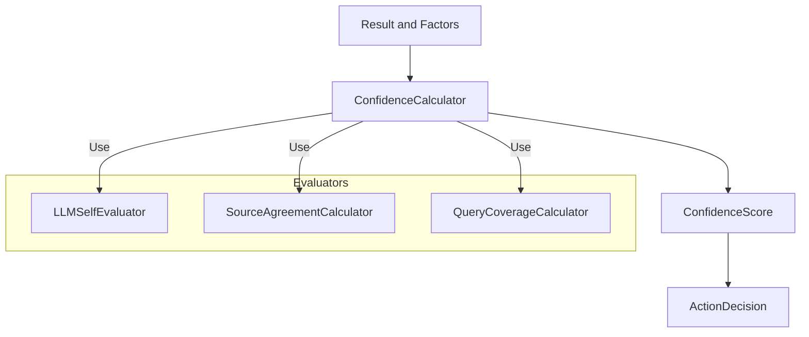
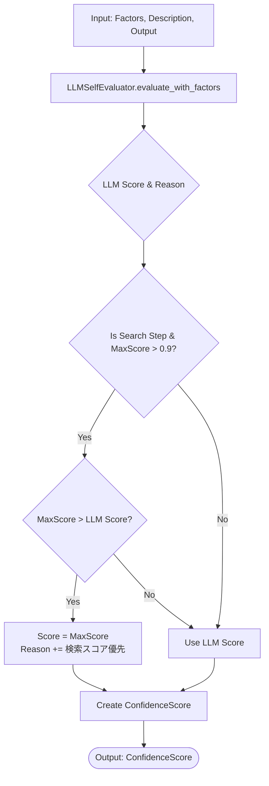
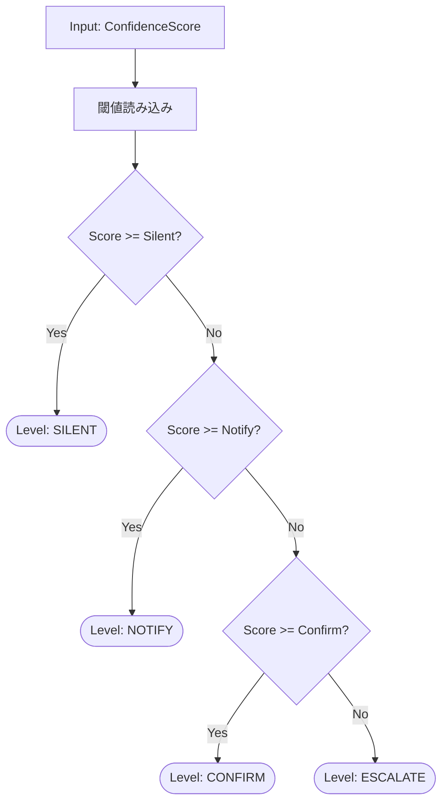
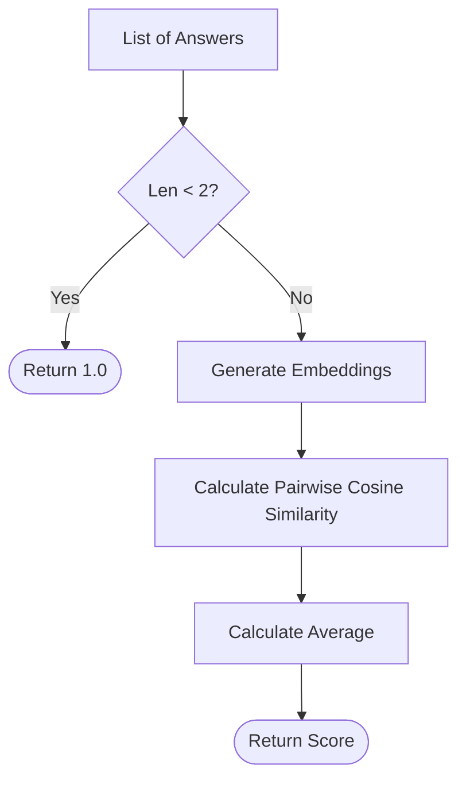
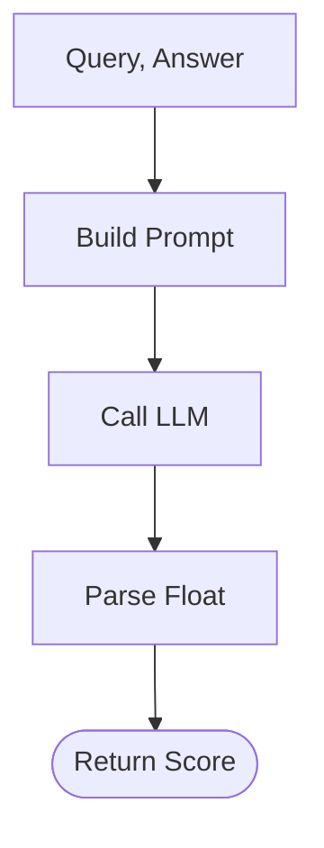
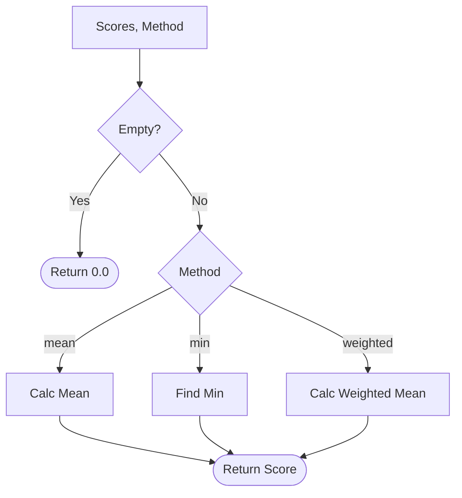

# GRACE Confidence (信頼度計算システム)

## 1. 概要
GRACE Confidenceは、ハイブリッド方式（統計的重み付き平均 + LLM意味的評価）による多軸信頼度計算を実装するモジュールです。
エージェントの各行動に対して、RAG検索の品質、ソース間の一致度、LLMによる自己評価、ツール実行の成功率など、複数の要因を統合して信頼度スコア (0.0 - 1.0) を算出します。

このスコアは `Executor` によって監視され、自動進行するか、ユーザーに介入を求めるか (`Intervention`) の判断基準となります。

**主な特徴:**
*   **Confidence-aware**: 自身の行動に「自信」を持ち、自信がない場合は人間に助けを求めます。
*   **Hybrid Evaluation**: ルールベースの統計計算（検索ヒット数など）と、LLMによる意味理解（回答の適切性など）を組み合わせます。
*   **Guardrails**: LLMの幻覚や過度な慎重さを防ぐため、検索エンジンの生スコアなど確実な指標による補正を行います。

## 2. アーキテクチャ

`ConfidenceCalculator` を中心に、複数の専門的な評価器 (`Evaluator`) が連携して多角的なスコアリングを行います。



## 3. クラス・関数一覧

| 種類 | 名前 | 概要 |
| :--- | :--- | :--- |
| **Main Class** | `ConfidenceCalculator` | 信頼度計算のメインロジック。ルールベース計算(`calculate`)とLLM計算(`llm_calculate`)を提供。 |
| **Evaluator** | `LLMSelfEvaluator` | LLMを使用して生成された回答や実行結果の自己評価を行う。 |
| **Evaluator** | `SourceAgreementCalculator` | 複数の情報源（回答）間の一致度をEmbedding類似度で計算する。 |
| **Evaluator** | `QueryCoverageCalculator` | 回答が質問の要素をどれだけ網羅しているかを計算する。 |
| **Aggregator** | `ConfidenceAggregator` | 複数のステップにわたる信頼度を集計する。 |
| **Data Class** | `ConfidenceFactors` | 信頼度計算に使用される各要素（検索結果数、スコア、LLM評価等）を保持。 |
| **Data Class** | `ConfidenceScore` | 計算された信頼度スコア、内訳、理由を保持。 |
| **Data Class** | `ActionDecision` | 信頼度に基づくアクション決定（SILENT, NOTIFY, CONFIRM, ESCALATE）。 |

## 4. 詳細設計 (IPO + Mermaid)

### 4.1 Method: `ConfidenceCalculator.llm_calculate` (推奨)

LLMを使用して、統計的要因(`factors`)と実行結果の内容(`tool_output`)を総合的に評価し、信頼度を算出します。

#### IPO
*   **Input:**
    *   `factors`: `ConfidenceFactors` (検索品質、ツール成功率などの統計データ)
    *   `step_description`: そのステップの目的
    *   `tool_output`: ツールの実行結果
*   **Process:**
    1.  `LLMSelfEvaluator.evaluate_with_factors` を呼び出し、LLMによる意味的な評価（スコアと理由）を取得。
        *   LLMは、目的達成度、検索品質、ツール成功、ソース一致度を総合判断する。
    2.  **ガードレール適用**: 検索ステップ(`is_search_step`)において、検索エンジンの生スコア(`search_max_score`)が非常に高い(>0.9)場合、LLMの評価より検索スコアを優先して上書きする。
        *   理由: LLMがハルシネーションや過度な慎重さでスコアを不当に低く見積もるのを防ぐため。
    3.  内訳(`breakdown`)と理由(`reason`)を格納したスコアオブジェクトを作成。
*   **Output:**
    *   `ConfidenceScore`: 最終スコアと理由。



---

### 4.2 Method: `ConfidenceCalculator.calculate` (Legacy / Rule-based)

複数の信頼度要因（Factors）を入力とし、設定された重みとロジックに基づいて統合的な信頼度スコアを計算します。主に統計的な計算のみを行いたい場合に使用します。

#### IPO
*   **Input:** `factors` (ConfidenceFactors)
*   **Process:**
    1.  検索品質、ツール成功率を計算。
    2.  ステップの種類に応じてベーススコア計算を分岐（検索ステップ vs その他）。
    3.  有効な要素（検索品質、ツール成功率、ソース一致度、LLM評価、網羅度）で加重平均を算出。
    4.  ペナルティ関数 (`_apply_penalties`) を適用（検索結果0件、ソースなし等は減点）。
    5.  スコアを 0.0 - 1.0 に正規化。
*   **Output:** `ConfidenceScore`

---

### 4.3 Method: `LLMSelfEvaluator.evaluate_with_factors`

統計情報(Factors)と実行コンテキスト(Description, Output)をLLMに提示し、総合的な信頼度をJSON形式で判定させます。

#### IPO
*   **Input:** `description`, `output`, `factors`
*   **Process:**
    1.  プロンプト構築: ステップの目的、実行結果、統計データ（検索ヒット数、スコア等）を埋め込む。
    2.  LLM呼び出し (JSON Mode): スコア(0.0-1.0)と理由を生成させる。
    3.  JSONパース: 結果を取得。
*   **Output:** Dict `{"score": float, "reason": str}`

---

### 4.4 Method: `ConfidenceCalculator.decide_action`

計算された信頼度スコアを閾値と比較し、次のアクション（介入レベル）を決定します。

#### IPO
*   **Input:** `score` (ConfidenceScore)
*   **Process:**
    *   `score >= silent` -> `SILENT` (自動進行)
    *   `score >= notify` -> `NOTIFY` (ステータス表示)
    *   `score >= confirm` -> `CONFIRM` (確認推奨)
    *   `else` -> `ESCALATE` (介入必須)
*   **Output:** `ActionDecision`



---

### 4.5 Method: `SourceAgreementCalculator.calculate`

複数の情報源（または回答）の一致度を計算します。

#### IPO
*   **Input:** `answers` (List[str]): 比較するテキストのリスト
*   **Process:**
    1.  入力が2つ未満の場合、1.0（完全一致）を返す。
    2.  `embed_content` を使用して各テキストのEmbeddingベクトルを生成。
    3.  全てのペアについてコサイン類似度を計算。
    4.  類似度の平均値を算出。
*   **Output:** `float` (0.0 - 1.0)



---

### 4.6 Method: `QueryCoverageCalculator.calculate`

回答が質問の要素をどれだけ網羅しているかをLLMで評価します。

#### IPO
*   **Input:** `query` (str), `answer` (str)
*   **Process:**
    1.  `COVERAGE_PROMPT` に質問と回答を埋め込む。
    2.  LLMに評価を依頼（0.0-1.0の数値出力）。
    3.  レスポンスをパースして数値化。
*   **Output:** `float` (0.0 - 1.0)



---

### 4.7 Method: `ConfidenceAggregator.aggregate`

複数ステップの信頼度スコアを統合して、計画全体の信頼度を算出します。

#### IPO
*   **Input:** `scores` (List[ConfidenceScore]), `method` ("mean", "min", "weighted")
*   **Process:**
    1.  スコアリストが空なら0.0を返す。
    2.  指定された手法で集計:
        *   `mean`: 単純平均。
        *   `min`: 最小値（ボトルネック）。
        *   `weighted`: 後半のステップほど重みを大きくする。
*   **Output:** `float` (Aggregated Score)



## 5. データ構造

### ConfidenceFactors (計算要素)
| フィールド | 型 | 説明 |
| :--- | :--- | :--- |
| `search_result_count` | int | 検索ヒット件数 |
| `search_avg_score` | float | 検索結果の平均類似度 |
| `search_max_score` | float | 検索結果の最高類似度 |
| `source_agreement` | float | 複数ソース間の一致度 (0.0-1.0) |
| `llm_self_confidence` | float | LLMの自己評価スコア |
| `tool_success_rate` | float | ツール実行の成功率 |
| `is_search_step` | bool | 検索ステップかどうか |

### ConfidenceScore (計算結果)
| フィールド | 型 | 説明 |
| :--- | :--- | :--- |
| `score` | float | 最終スコア (0.0 - 1.0) |
| `level` | str | レベル表記 (high, medium, low, very_low) |
| `breakdown` | Dict | スコアの内訳 |
| `reason` | str | スコアの理由 (LLM生成またはルールベース) |
| `penalties_applied` | List | 適用されたペナルティ一覧 |

## 6. 利用方法

```python
from grace.confidence import (
    create_confidence_calculator,
    ConfidenceFactors
)

# Calculatorの初期化
calculator = create_confidence_calculator()

# 実行結果からFactorsを作成 (Executor内で自動生成されます)
factors = ConfidenceFactors(
    search_result_count=5,
    search_max_score=0.85,
    tool_success_rate=1.0,
    is_search_step=True
)

# 信頼度計算 (LLM版 - 推奨)
score = calculator.llm_calculate(
    factors=factors,
    step_description="WikipediaからAIの歴史を検索する",
    tool_output="AIの歴史に関する検索結果: 1956年 ダートマス会議..."
)

print(f"Score: {score.score}")
print(f"Reason: {score.reason}")

# アクション決定
decision = calculator.decide_action(score)
print(f"Action: {decision.level} ({decision.suggested_action})")

if decision.needs_confirmation:
    print("ユーザーに確認を求めます...")
```
