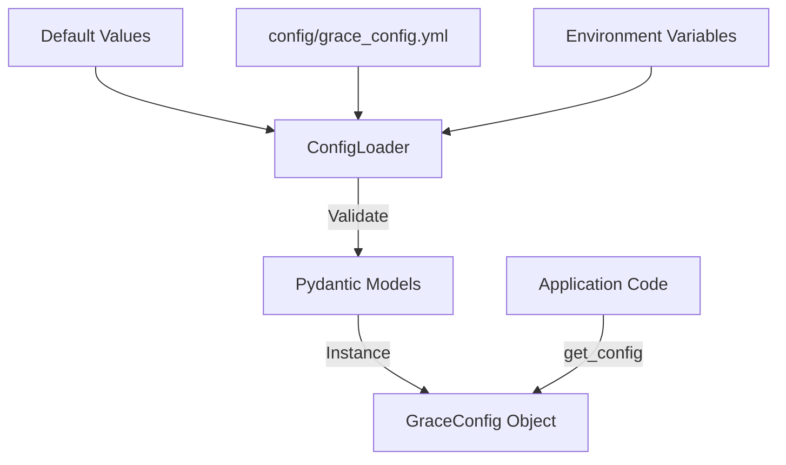

# GRACE Config (設定管理)

## 1. 概要
Configモジュールは、GRACEエージェントの動作に関わる全設定を一元管理します。
YAMLファイル、環境変数、デフォルト値を階層的に読み込み、Pydanticモデルを用いてバリデーションを行うことで、型安全かつ柔軟な設定管理を提供します。

**主な責務:**
*   **Centralized Management**: LLM、RAG、信頼度計算、介入ポリシーなど、分散しがちな設定を単一の構造体で管理。
*   **Hierarchical Loading**: デフォルト値 → YAMLファイル → 環境変数の順で設定を上書きロード。
*   **Validation**: Pydanticによる型チェックと値の検証。
*   **Environment Override**: Dockerやクラウド環境向けに、環境変数 (`GRACE_SECTION_KEY`) による設定変更をサポート。

## 2. モジュール構成

### 2.1 読み込みフロー

`ConfigLoader` が設定ソースを統合し、検証済みの `GraceConfig` オブジェクトを生成します。アプリケーション全体からは `get_config()` 関数を通じてシングルトンインスタンスにアクセスします。



### 2.2 ディレクトリ構成
Config関連ファイルは `grace` パッケージ内に配置されています。

```
grace/
├── config.py            # 【本モジュール】設定定義・ロードロジック
└── ...                  # 他のモジュールからインポートされる
```

設定ファイル（デフォルトパス）: `config/grace_config.yml`

## 3. クラス・関数一覧

### 関数: `get_config`
設定オブジェクトを取得するメインのエントリポイントです。シングルトンパターンにより、初回呼び出し時のみロード処理が走ります。

| 引数 | 説明 |
| :--- | :--- |
| `config_path` | 設定ファイルのパス（任意）。指定がない場合はデフォルトパスを使用。 |

### クラス: `ConfigLoader`
設定の読み込みと優先順位の解決を担当します。

| メソッド名 | 概要 |
| :--- | :--- |
| `load` | 設定を読み込み、キャッシュされたインスタンスを返します。 |
| `reload` | キャッシュを破棄し、再読み込みを行います。 |
| `_apply_env_overrides` | 環境変数を解析し、辞書に適用します。 |

### クラス: `GraceConfig` (Root Model)
全設定のルートとなるPydanticモデルです。以下のサブモデルを含みます。

| フィールド | 型 | 説明 |
| :--- | :--- | :--- |
| `llm` | `LLMConfig` | LLMプロバイダ、モデル名、パラメータ |
| `embedding` | `EmbeddingConfig` | 埋め込みモデルの設定 |
| `confidence` | `ConfidenceConfig` | 信頼度計算の重みと閾値 |
| `intervention` | `InterventionConfig` | ユーザー介入のタイムアウトや回数制限 |
| `replan` | `ReplanConfig` | リプランの回数制限や戦略閾値 |
| `cost` | `CostConfig` | コスト制限設定 |
| `error` | `ErrorConfig` | リトライポリシー |
| `logging` | `LoggingConfig` | ログレベルやファイル設定 |
| `qdrant` | `QdrantConfig` | ベクトルDB接続設定 |
| `tools` | `ToolsConfig` | 有効化するツールのリスト |

## 4. 設定項目詳細 (Sub-Models)

主要な設定項目とデフォルト値の例です。

### ConfidenceConfig
信頼度計算のパラメータを制御します。

```python
class ConfidenceConfig(BaseModel):
    weights: ConfidenceWeights  # 各要素の重み
    thresholds: ConfidenceThresholds  # アクション分岐の閾値
```

*   **Thresholds**:
    *   `silent`: 0.9 (これ以上なら自動進行)
    *   `notify`: 0.7 (通知のみして進行)
    *   `confirm`: 0.4 (ユーザー確認が必要)
    *   (それ未満はエスカレーション)

### LLMConfig
使用するLLMの設定です。

```python
class LLMConfig(BaseModel):
    provider: str = "gemini"
    model: str = "gemini-1.5-flash"
    temperature: float = 0.0
    max_tokens: int = 4096
```

## 5. 環境変数による上書き

`GRACE_` プレフィックスを使用することで、任意の設定を上書きできます。階層構造はアンダースコア `_` で表現します。

| 環境変数名 | 対応する設定 |
| :--- | :--- |
| `GRACE_LLM_MODEL` | `llm.model` |
| `GRACE_CONFIDENCE_THRESHOLDS_CONFIRM` | `confidence.thresholds.confirm` |
| `GRACE_QDRANT_URL` | `qdrant.url` |

## 6. 利用方法

```python
from grace.config import get_config

# 設定の取得
config = get_config()

# 値へのアクセス
print(f"Current Model: {config.llm.model}")
print(f"Confirm Threshold: {config.confidence.thresholds.confirm}")

if some_score < config.confidence.thresholds.confirm:
    # do something...
```
