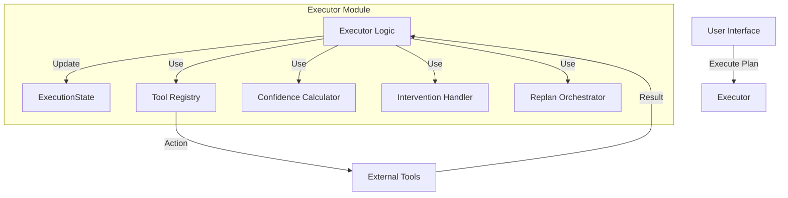
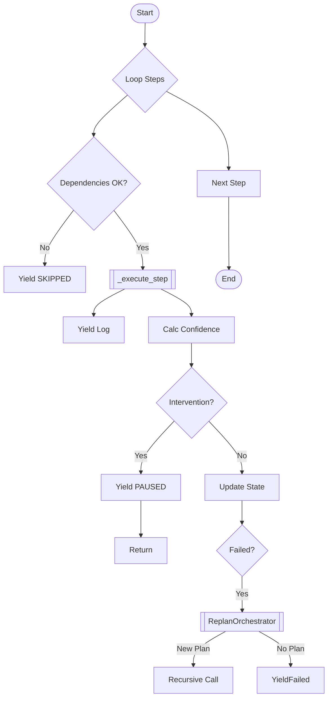
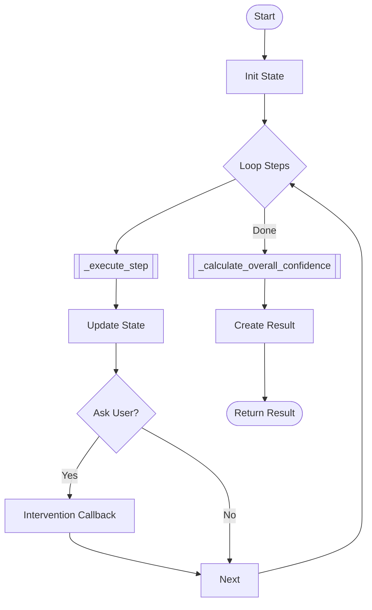
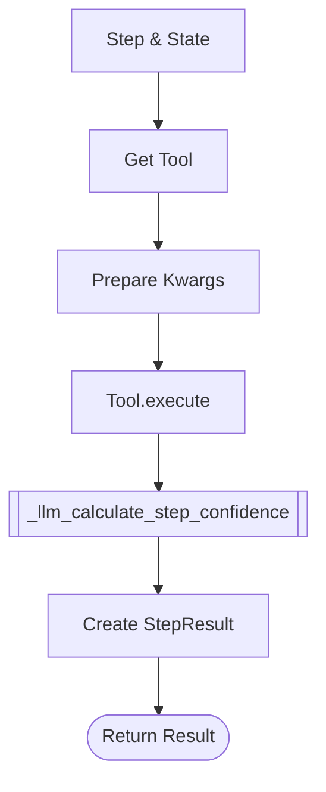
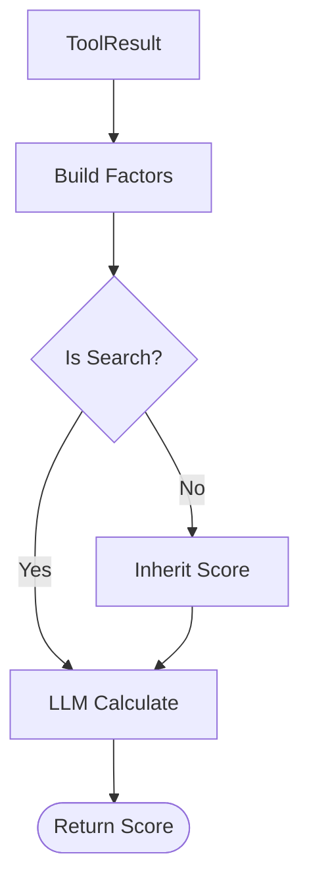
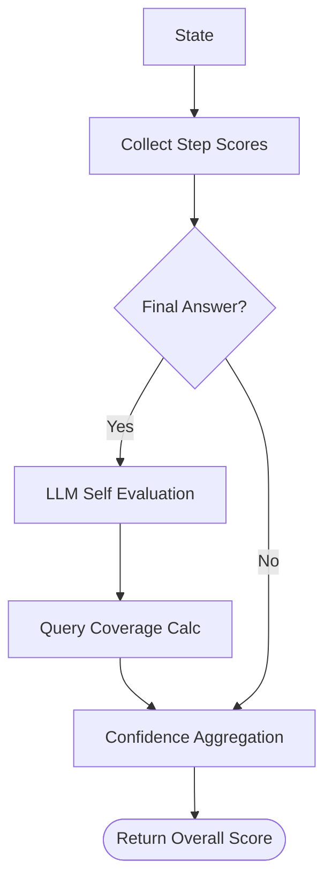
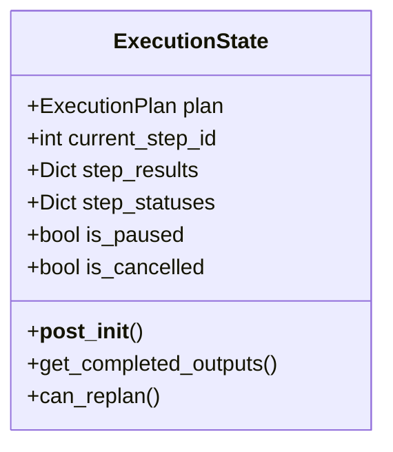

# GRACE Executor (計画実行エージェント)

## 1. 概要
Executorは、Plannerが生成した「実行計画 (ExecutionPlan)」を入力として受け取り、各ステップを順次実行して最終的な回答を導き出すコアモジュールです。
ReActパターンの「Act（行動）」と「Observation（観察）」を担うだけでなく、GRACEの特徴である**信頼度に基づく動的制御 (Confidence-aware Execution)** を実装しています。

**主な責務:**
*   **Tool Execution**: 計画されたアクション（RAG検索、推論など）の実行。
*   **Confidence Calculation**: 実行結果に対する信頼度スコアの算出（LLM活用）。
*   **Intervention**: 信頼度が低い場合のユーザー介入（確認、エスカレーション）の制御。
*   **Replanning**: 失敗時や信頼度不足時の自動再計画。
*   **Streaming**: UI向けのリアルタイム進捗・ログ配信。

## 2. モジュール構成

### 2.1 モジュール相関図

ExecutorはToolRegistryを通じてツールを実行し、ConfidenceCalculatorで評価を行い、必要に応じてInterventionHandlerやReplanOrchestratorと連携します。



### 2.2 ディレクトリ構成
Executor関連ファイルは `grace` パッケージ内に配置されています。

```
grace/
├── executor.py          # 【本モジュール】計画実行ロジック
├── schemas.py           # 実行結果(StepResult, ExecutionResult)の定義
├── tools.py             # 実行されるツール群
├── confidence.py        # 信頼度計算ロジック
├── intervention.py      # 介入ハンドリング
└── replan.py            # 再計画ロジック
```

## 3. クラス・関数一覧

### クラス: `Executor`
計画実行のメインロジックを担うクラスです。

| メソッド名 | 概要 | 主要フィールド/引数 |
| :--- | :--- | :--- |
| `__init__` | コンポーネントの初期化。 | `tool_registry`, `confidence_calculator` 等 |
| `execute_plan_generator` | **[Main]** 計画をジェネレータ形式で実行。 | `plan`: ExecutionPlan |
| `execute_plan` | 計画を一括実行（ブロッキング）。 | `plan`: ExecutionPlan |
| `_execute_step` | 個別ステップの実行制御。 | `step`: PlanStep, `state`: ExecutionState |
| `_llm_calculate_step_confidence` | LLMを使用した信頼度計算。 | `tool_result`, `step`, `state` |
| `_calculate_overall_confidence` | 計画全体の信頼度算出。 | `state`: ExecutionState |

#### Method: `execute_plan_generator` 詳細
UIへのリアルタイム通知を行いながら計画を実行します。

*   **Input**: `plan` (ExecutionPlan)
*   **Process**:
    1.  ステップループ開始。
    2.  依存関係チェック。
    3.  ツール実行 (`_execute_step`) & ログYield。
    4.  信頼度計算 & 介入判定 (Pause/Resume)。
    5.  失敗時のリプランニング。
*   **Output**: Yield `ExecutionState` / Log Dict



#### Method: `execute_plan` 詳細
計画を一括で実行し、最終結果を返します（CLIやバッチ処理用）。内部ロジックはジェネレータ版とほぼ同じですが、Yieldせずに最後まで実行します。

*   **Input**: `plan` (ExecutionPlan)
*   **Process**:
    1.  `ExecutionState` を初期化。
    2.  ステップループを実行。
    3.  各ステップで `_execute_step` を呼び出し、結果をStateに保存。
    4.  介入が必要な場合（`ask_user`等）、コールバック経由で処理。
    5.  全ステップ完了後、`_calculate_overall_confidence` を実行。
*   **Output**: `ExecutionResult`



#### Method: `_execute_step` 詳細
個別のステップを実行し、結果を整形します。

*   **Input**: `step` (PlanStep), `state` (ExecutionState)
*   **Process**:
    1.  ツール取得 (Legacy Agent含む)。
    2.  引数準備 (依存ステップの出力利用)。
    3.  ツール実行。
    4.  信頼度計算 (`_llm_calculate_step_confidence`)。
*   **Output**: `StepResult`



#### Method: `_llm_calculate_step_confidence` 詳細
LLMと統計情報を組み合わせて信頼度を算出します。

*   **Input**: `tool_result`, `step`, `state`
*   **Process**:
    1.  `ConfidenceFactors` (ヒット数、ソース一致度等) を構築。
    2.  検索ステップでない場合、依存元の信頼度を継承。
    3.  `ConfidenceCalculator.llm_calculate` を呼び出し。
*   **Output**: `float` (Score)



#### Method: `_calculate_overall_confidence` 詳細
全ステップ完了後に、計画全体の信頼度を算出します。LLMによる自己評価とクエリ網羅度を含みます。

*   **Input**: `state` (ExecutionState)
*   **Process**:
    1.  各ステップの信頼度スコアを収集。
    2.  最終回答が存在する場合、`LLMSelfEvaluator` で自己評価を実行。
    3.  `QueryCoverageCalculator` でクエリ網羅度を計算。
    4.  `ConfidenceAggregator` でこれらを重み付け統合。
*   **Output**: `float` (Overall Score)



## 4. データクラス一覧

`ExecutionState` は `grace/executor.py` 内で定義され、その他は `grace/schemas.py` 等で定義されています。

| クラス名 | 定義場所 | 概要 | 主要フィールド |
| :--- | :--- | :--- | :--- |
| `ExecutionState` | `executor.py` | 実行中の状態コンテナ。 | `plan`, `current_step_id`, `step_results`, `is_paused` |
| `StepResult` | `schemas.py` | ステップごとの実行結果。 | `status`, `output`, `confidence`, `sources` |
| `ExecutionResult` | `schemas.py` | 最終的な実行結果。 | `final_answer`, `overall_confidence`, `step_results` |

#### Class: `ExecutionState` (ライフサイクル)
実行状態を管理するデータクラスです。

*   **Input**: `plan` (ExecutionPlan)
*   **Process**:
    1.  `__init__`: プランを受け取り、開始時刻を記録。
    2.  `__post_init__`: 全ステップのステータスを `PENDING` に初期化。
    3.  実行中: `step_results`, `step_statuses` が更新される。
*   **Output**: インスタンス自体が状態を保持。



## 5. 利用方法

```python
from grace.executor import create_executor

# Executor初期化
executor = create_executor()

# ジェネレータ形式での実行 (UI向け)
# planはPlannerから生成されたもの
for event in executor.execute_plan_generator(plan):
    if isinstance(event, dict):
        # ログイベント
        print(f"[LOG] {event['content']}")
    else:
        # ExecutionStateの更新
        state = event
        if state.is_paused:
            print("Paused for intervention...")
            break
```