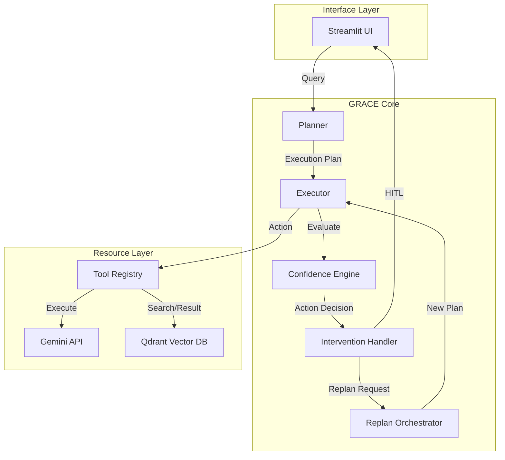
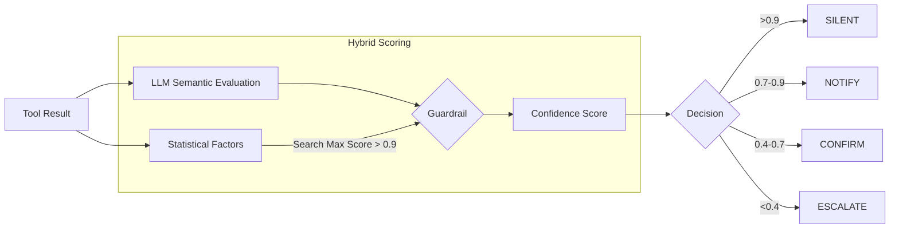

# GRACE Agent アーキテクチャ詳細設計書

## 1. 概要
GRACE (Guided Reasoning with Adaptive Confidence Execution) は、**「計画実行（Plan-and-Execute）」**、**「信頼度評価（Confidence-aware）」**、**「人間との協調（Human-in-the-Loop）」** を統合した次世代の自律型エージェントアーキテクチャです。
従来のReAct型エージェントの弱点（迷走、無限ループ、不確実な回答）を克服するため、実行前に明確な計画を立て、ステップごとに信頼度を評価し、必要に応じて動的に計画修正やユーザーへの確認を行います。

### 核心的コンセプト
1.  **Guided (誘導型計画):** ユーザーの質問を分析し、最適な実行計画（ステップ）を事前に生成。
2.  **Adaptive (適応型実行):** 実行結果やエラーに応じて、動的に計画を修正（リプラン）。
3.  **Confidence (信頼度駆動):** 統計的指標とLLMによる意味的評価を組み合わせたハイブリッドスコアリング。
4.  **Execution (堅牢な実行):** 非同期ストリーミング、介入制御、Legacy互換性を備えた実行エンジン。

---

## 2. モジュール構成と役割分担

| モジュール | 役割・責務 | 主要コンポーネント |
| :--- | :--- | :--- |
| **Planner** | 質問解析とステップ分解 | `create_plan`, `estimate_complexity` |
| **Executor** | 計画の実行・状態管理・ストリーミング | `execute_plan_generator`, `ExecutionState` |
| **Confidence** | 多軸信頼度計算（統計＋LLM） | `llm_calculate`, `LLMSelfEvaluator` |
| **Replan** | 動的な計画修正とフォールバック | `ReplanOrchestrator`, `handle_step_failure` |
| **Intervention** | 人間による介入（HITL）の制御 | `InterventionHandler`, `request_confirmation` |
| **Tools** | 具体的アクションの実装（RAG, 推論） | `RAGSearchTool`, `ReasoningTool` |

---

## 3. ReAct + Reflection の進化形フロー

GRACEは従来のReActを「Plan-and-Execute」の枠組みで構造化し、Reflectionを「Confidence Engine」として独立・高度化させています。

### 3.1 実行プロセス (IPO)

#### Step 1: 計画生成 (Guided Phase)
*   **Input**: 自然言語クエリ
*   **Process**: 複雑度判定 → 重要語句抽出 → LLMによるJSONプラン生成
*   **Output**: `ExecutionPlan` (DAG構造のステップ群)

#### Step 2: ステップ実行 (Execution Phase)
*   **Input**: `PlanStep`, `ExecutionState` (過去の出力)
*   **Process**: ツール呼び出し → 依存データの注入 → コンテキスト構築
*   **Output**: `ToolResult` (生の結果と統計量)

#### Step 3: 信頼度評価 (Reflection Phase)
*   **Input**: `ToolResult`, ステップの目的
*   **Process**: **ハイブリッド・スコアリング**
    1.  統計的Factorsの算出（ヒット数、スコア分散）
    2.  LLMによる意味的評価（`evaluate_with_factors`）
    3.  ガードレール適用（検索スコアが極めて高い場合はLLM評価を上書き）
*   **Output**: `ConfidenceScore`, `ActionDecision`

#### Step 4: 適応と介入 (Adaptive Phase)
*   **Input**: `ActionDecision`, `StepResult`
*   **Process**: 介入レベル判定（Silent/Notify/Confirm/Escalate） → 必要に応じリプラン
*   **Output**: 実行継続, 一時停止, または新計画への差し替え

---

## 4. 信頼度認識型実行 (Confidence-aware Execution)

GRACEの最大の特徴は、各ステップの実行結果をLLMが「監視役」として評価する仕組みです。

### ガードレール・メカニズム
LLMの過度な慎重さやハルシネーションを防ぐため、**「検索システムの生スコアが非常に高い場合（>0.9）、LLMの評価よりも検索スコアを優先する」** という物理的なガードレールを実装しています。これにより、確実な情報がある場合にAIが「自信がない」と誤判定するのを防ぎます。

---

## 5. データ構造と通信プロトコル

### 5.1 実行状態 (ExecutionState)
Executor内部で保持される、実行の「スナップショット」です。
*   `plan`: 実行中の計画
*   `step_results`: 各ステップの出力と信頼度
*   `is_paused`: 介入待ちフラグ
*   `replan_count`: 適応回数

### 5.2 介入プロトコル (InterventionRequest)
UIとExecutor間でやり取りされる介入要求です。
*   `level`: 介入レベル
*   `message`: ユーザーへの表示文
*   `options`: ユーザーが選択可能なアクション（続行、修正、中止）

---

## 6. 既存資産との統合 (Legacy Integration)

GRACEは、以前の `ReActAgent` (Legacy) を「1つの高度なツール」として扱うことができます。
*   `run_legacy_agent` アクション: 複雑な自律推論が必要なステップで、Legacy Agentを呼び出し、その全思考プロセスをGRACEのステップログとして統合します。
*   `RAGSearchTool`: 既存の安定した検索ロジック (`agent_tools.py`) を再利用し、信頼度計算に必要なメタデータのみを追加付与します。