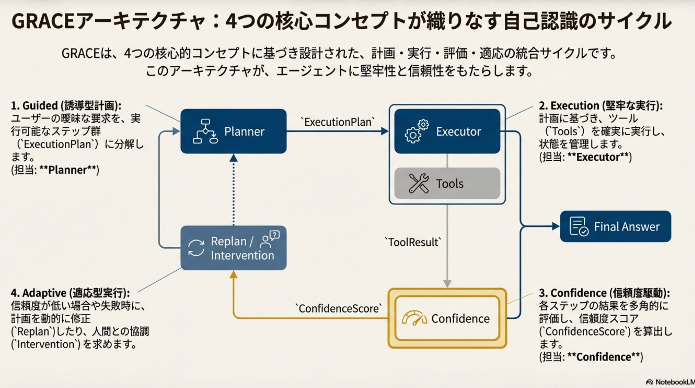
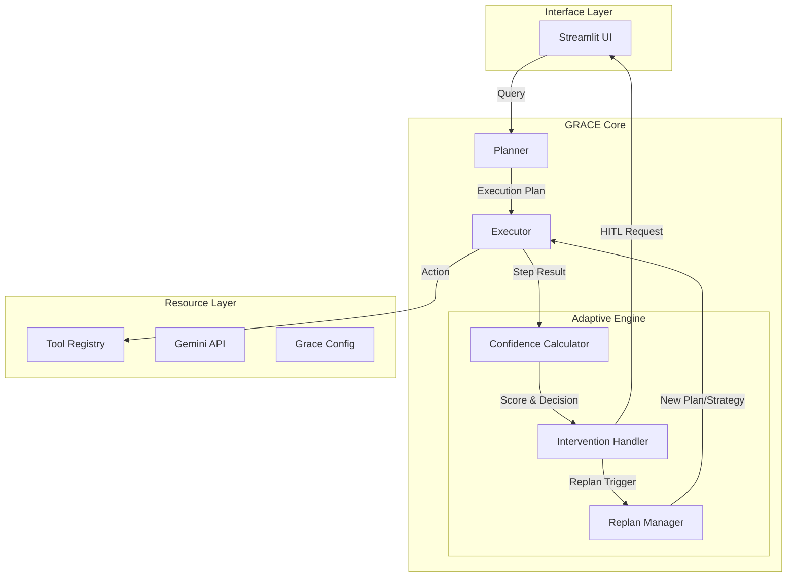
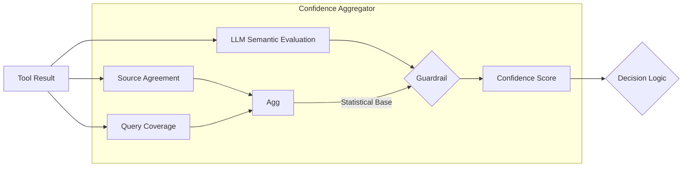

## GRACE Agent アーキテクチャ

## 1. 概要

GRACE (Guided Reasoning with Adaptive Confidence Execution) は、
**「計画実行（Plan-and-Execute）」**、
**「信頼度評価（Confidence-aware）」**、
**「適応型再計画（Adaptive Re-planning）」**
を統合した次世代の自律型エージェントアーキテクチャです。

従来のReAct型エージェントの弱点（迷走、無限ループ、不確実な回答）を克服するため、実行前に明確な計画を立て、ステップごとに信頼度を評価し、必要に応じて動的に計画修正（Re-planning）やユーザーへの確認（Intervention）を行います。

### 核心的コンセプト

1. **Guided (誘導型計画):** ユーザーの質問を分析し、最適な実行計画（ステップ）を事前に生成。
2. **Adaptive (適応型実行):** 実行結果やエラー、低信頼度に応じて、動的に計画を修正（リプラン）。
3. **Confidence (信頼度駆動):** 統計的指標（ソース一致率、網羅率）とLLMによる意味的評価を組み合わせたハイブリッドスコアリング。
4. **Execution (堅牢な実行):** 状態管理、非同期ストリーミング、人間介入制御を備えた実行エンジン。

---

## 2. モジュール構成と役割分担

GRACEは明確に責務が分離されたモジュール群で構成されています。

| モジュール       | 役割・責務                               | 主要コンポーネント (Class/Func)                                                                                                                                             |
| :--------------- | :--------------------------------------- | :-------------------------------------------------------------------------------------------------------------------------------------------------------------------------- |
| **Planner**      | 質問解析と初期計画の生成（ステップ分解） | `Planner`, `create_plan`                                                                                                                                                    |
| **Executor**     | 計画の実行、状態管理、ストリーミング制御 | `Executor`, `ExecutionState`, `StepResult`                                                                                                                                  |
| **Confidence**   | 多軸信頼度計算と集約                     | `ConfidenceCalculator`, `ConfidenceAggregator` `LLMSelfEvaluator` (意味的評価) `SourceAgreementCalculator` (ソース一致率) `QueryCoverageCalculator` (クエリ網羅率) |
| **Intervention** | HITL制御と動的閾値調整                   | `InterventionHandler`, `ConfirmationFlow` `DynamicThresholdAdjuster`, `FeedbackRecord`                                                                                   |
| **Replan**       | **再計画戦略の管理と実行**               | `ReplanManager`, `ReplanOrchestrator` `ReplanStrategy`, `ReplanContext`, `ReplanTrigger`                                                                                 |
| **Tools**        | 具体的アクションの実装                   | `RAGSearchTool`, `ReasoningTool`, `AskUserTool` `ToolRegistry`                                                                                                           |
| **Config**       | 設定管理                                 | `GraceConfig`, `get_config`                                                                                                                                                 |
| **Schemas**      | データ構造定義                           | `ExecutionPlan`, `PlanStep`, `ExecutionResult`                                                                                                                              |

---

## 3. 実行プロセスフロー

GRACEは `Plan -> Execute -> Evaluate -> Adapt` のサイクルを回します。

#### Step 1: 計画生成 (Guided Phase=Plan):

* **Input**: 自然言語クエリ
* **Process**: ユーザー意図解析 → 依存関係解決 → DAG（有向非巡回グラフ）構造の計画生成
* **Component**: `Planner`
* **Output**: `ExecutionPlan`

#### Step 2: ステップ実行 (Execution Loop)

* **Input**: `PlanStep`, `ExecutionState` (過去のコンテキスト)
* **Process**: ツール実行、引数解決
* **Component**: `Executor` -> `Tools`
* **Output**: `ToolResult` (生データ + メタデータ)

#### Step 3: 信頼度評価 (Reflection Phase)

* **Input**: `ToolResult`
* **Process**: 複数のCalculatorによるスコアリングと集約
* **Component**: `ConfidenceCalculator`
* **Output**: `ConfidenceScore`, `ActionDecision`

#### Step 4: 適応と介入 (Adaptive Phase)

* **Input**: `ActionDecision`
* **Process**:
  1. 介入レベル判定 (Silent/Notify/Confirm/Escalate)
  2. 必要に応じユーザー確認 (`InterventionHandler`)
  3. 信頼度不足やエラー時は再計画をトリガー
* **Output**: 実行継続, 停止, または再計画の開始

#### Step 5: 適応型再計画 (Adaptive Phase=Re-planning)

* **Input**: `ReplanTrigger`, `ReplanContext`
* **Process**:
  1. トリガー分析 (失敗原因の特定)
  2. 再計画戦略 (`ReplanStrategy`) の選定
  3. Planner を用いた新しい計画の生成と既存計画との結合
* **Component**: `ReplanManager`, `ReplanOrchestrator`
* **Output**: 更新された `ExecutionPlan` (Step 2 へ戻る)

---

## 4. 信頼度認識型実行 (Confidence-aware Execution)

各ステップの結果に対し、統計的指標と意味的指標を組み合わせて評価します。

* **SourceAgreementCalculator:** 複数の検索結果ソース間で情報が一致しているか（Hallucination検知）。
* **QueryCoverageCalculator:** ユーザークエリの重要キーワードがどれだけ網羅されたか。
* **LLMSelfEvaluator:** LLM自身による「質問に対する回答の適切さ」の自己評価。
* **Guardrail:** 統計的スコアが極めて高い場合、LLMの過度な慎重さを補正する安全機構。

---

## 5. 適応型再計画 (Adaptive Re-planning)

実行中に問題が発生した場合、単なるリトライではなく、状況に応じた「戦略」で計画を修正します。これがGRACEの "Adaptive" の核心です。

### 5.1 Replan Trigger (再計画のきっかけ)

* `LOW_CONFIDENCE`: 信頼度スコアが閾値を下回った場合。
* `TOOL_ERROR`: ツール実行が失敗した場合（APIエラー等）。
* `USER_FEEDBACK`: ユーザー介入により「手順が違う」と指摘された場合。
* `MISSING_INFO`: 必要な情報が見つからなかった場合。

### 5.2 Replan Strategy (再計画戦略)

`ReplanManager` は `ReplanContext` を分析し、以下の戦略から最適解を選択します。

1. **Refinement (詳細化):** 曖昧なステップを複数の具体的ステップに分割する。
2. **Alternative (代替手段):** 別のツールやデータソースを使用するルートに変更する。
3. **Query Expansion (クエリ拡張):** 検索キーワードを変更・拡張して再検索する。
4. **Ask User (ユーザー質問):** 自動解決不可能な場合、ユーザーに追加情報を求めるステップを挿入する。

---

## 6. 人間介入と学習 (Intervention & Learning)

### 6.1 動的閾値調整 (Dynamic Threshold)

`DynamicThresholdAdjuster` は、ユーザーのフィードバック履歴 (`FeedbackRecord`) を蓄積・分析します。

* ユーザーが頻繁に「承認」する場合 → 確認頻度を下げる（信頼度閾値を下げる）。
* ユーザーが頻繁に「修正」する場合 → 確認頻度を上げる（慎重にする）。

### 6.2 介入フロー

1. **InterventionRequest:** ExecutorからUIへ確認要求。
2. **User Action:** ユーザーが承認、修正、または拒否を選択。
3. **InterventionResponse:** 結果をExecutorへ返却。修正指示がある場合は `ReplanManager` へ転送される。

---

## 7. 既存資産との統合 (Legacy Integration)

* `run_legacy_agent` アクションを通じて、旧来の `ReActAgent` ロジックを1つのツールとして呼び出し可能です。
* `GraceConfig` は環境変数およびYAMLファイルから設定をロードし、Legacyな設定値とも互換性を維持します。
