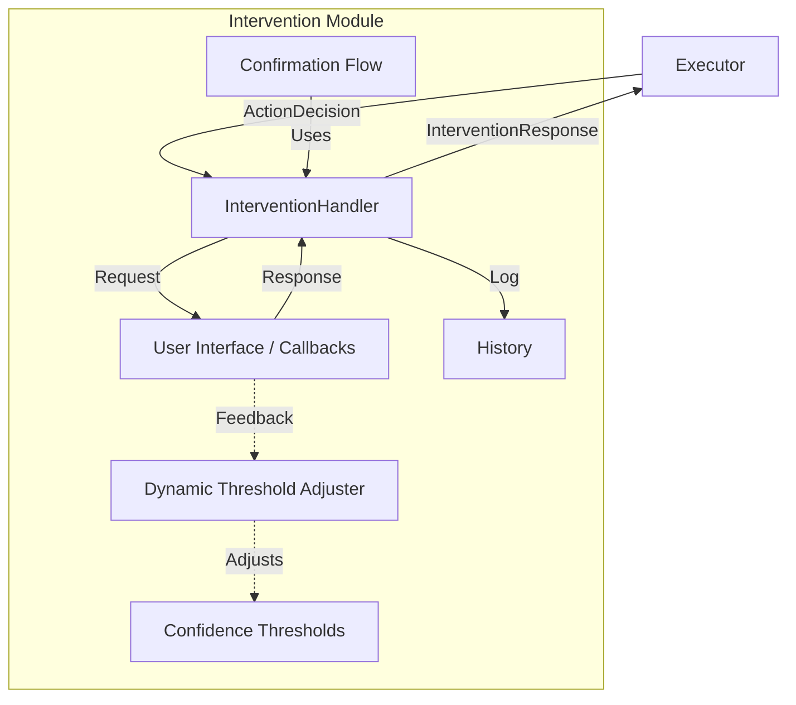
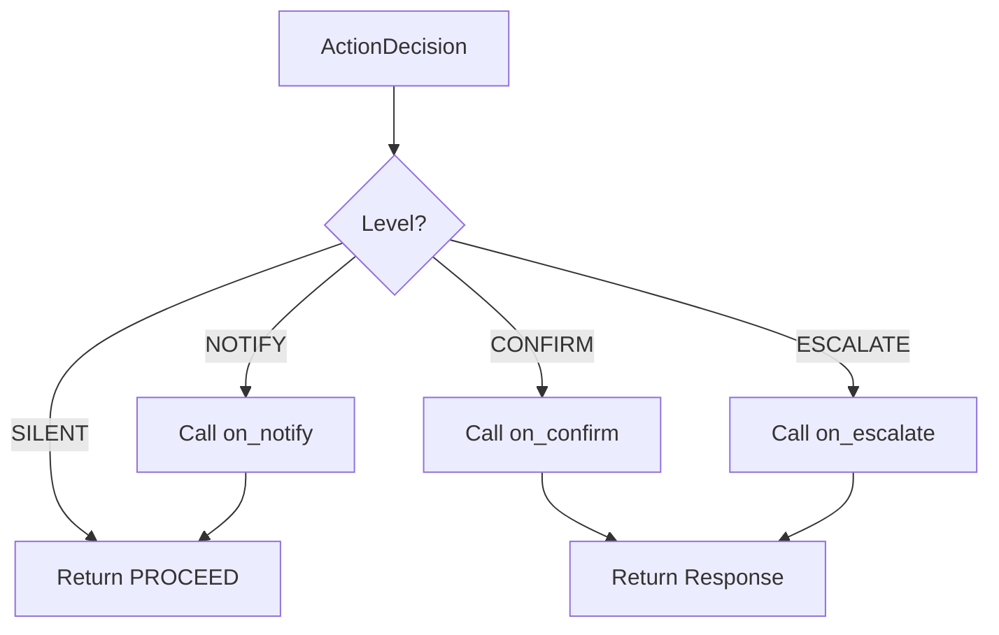

# GRACE Intervention (HITL介入システム)

## 1. 概要
Interventionモジュールは、GRACEエージェントの実行プロセスにおいて、信頼度に基づいた人間（Human-in-the-Loop）との協調を実現するためのインターフェースおよび制御ロジックを提供します。
信頼度が低い場合や確認が必要な重要なステップにおいて、ユーザーへの通知、承認要求、情報提供依頼（エスカレーション）を適切に管理します。

**主な責務:**
*   **Intervention Handling**: 信頼度レベル（SILENT, NOTIFY, CONFIRM, ESCALATE）に応じた適切なアクション（通知、確認、質問）の生成。
*   **User Interaction**: ユーザーからのレスポンス（承認、修正、キャンセル、回答）の処理。
*   **Dynamic Thresholds**: ユーザーのフィードバック履歴に基づき、介入が必要となる信頼度の閾値を動的に調整。
*   **Confirmation Flow**: 計画の確認・修正・再確認のループ処理。

## 2. モジュール構成

### 2.1 モジュール相関図

InterventionHandlerは、ExecutorやConfidenceCalculatorからの決定(`ActionDecision`)を受け取り、登録されたコールバック関数を通じてUI/ユーザーとやり取りを行います。また、DynamicThresholdAdjusterがバックグラウンドで閾値の最適化を行います。



### 2.2 ディレクトリ構成
Intervention関連ファイルは `grace` パッケージ内に配置されています。

```
grace/
├── intervention.py      # 【本モジュール】介入ハンドリングロジック
├── confidence.py        # 信頼度計算・レベル判定（介入のトリガー）
├── executor.py          # 実行エンジン（介入の呼び出し元）
└── schemas.py           # 共通データ構造
```

## 3. クラス・関数一覧

### クラス: `InterventionHandler`
介入リクエストの生成とレスポンス処理を行う中核クラスです。UI層との結合はコールバック関数を通じて行われます。

| メソッド名 | 概要 | 主要フィールド/引数 |
| :--- | :--- | :--- |
| `__init__` | 初期化。コールバック関数を登録。 | `on_notify`, `on_confirm`, `on_escalate` |
| `handle` | アクション決定に基づき介入処理を実行。 | `decision`: ActionDecision, `step` |
| `request_confirmation` | 明示的に計画の確認を要求。 | `plan`: ExecutionPlan |
| `request_clarification` | 明示的に追加情報を要求。 | `question`: str |

#### Method: `handle` 詳細
信頼度レベルに応じて振る舞いを分岐させます。

*   **Input**: `decision` (ActionDecision), `step` (PlanStep)
*   **Process**:
    *   **SILENT**: 何もしない（自動進行）。
    *   **NOTIFY**: `on_notify` コールバックを呼び出し、自動進行。
    *   **CONFIRM**: `on_confirm` コールバックを呼び出し、ユーザー判断（続行/修正/中止）を待つ。
    *   **ESCALATE**: `on_escalate` コールバックを呼び出し、ユーザー入力（回答）を待つ。
*   **Output**: `InterventionResponse`



### クラス: `DynamicThresholdAdjuster`
ユーザーのフィードバック（正誤判定）を学習し、介入頻度を最適化します。

| メソッド名 | 概要 |
| :--- | :--- |
| `record_feedback` | 結果に対するユーザーフィードバックを記録。 |
| `_adjust_thresholds` | 履歴に基づき閾値を上げ下げする。 |
| `get_level` | 現在の閾値に基づいて信頼度からレベルを判定。 |

### クラス: `ConfirmationFlow`
「計画提示 -> ユーザー確認 -> (修正 -> 再提示)」というフローをカプセル化したクラスです。

| メソッド名 | 概要 |
| :--- | :--- |
| `confirm_plan` | ユーザーが承認するまで確認ループを実行。 |

## 4. データクラス・列挙型一覧

### Enum: `InterventionAction`
ユーザー（またはシステム）が選択可能なアクションです。

| アクション | 説明 |
| :--- | :--- |
| `PROCEED` | そのまま進行 |
| `MODIFY` | 計画を修正して進行 |
| `CANCEL` | 処理を中止 |
| `INPUT` | 情報を入力（エスカレーション時） |
| `RETRY` | 再試行 |
| `SKIP` | ステップをスキップ |

### Class: `InterventionRequest` & `InterventionResponse`
UI/ユーザーとのやり取りに使用されるデータ構造です。

*   **Request**: `level`, `message`, `options`, `timeout_seconds`, `plan` 等を含む。
*   **Response**: `action`, `user_input`, `modified_plan` 等を含む。

## 5. 利用方法

```python
from grace.intervention import create_intervention_handler, InterventionResponse, InterventionAction

# 1. コールバック関数の定義 (UI層の実装)
def my_confirm_callback(request):
    print(f"[CONFIRM] {request.message}")
    # 実際はUIで入力を待つ
    return InterventionResponse(action=InterventionAction.PROCEED)

# 2. ハンドラーの作成
handler = create_intervention_handler(
    on_confirm=my_confirm_callback
)

# 3. 介入の実行 (Executor内部で行われる処理)
response = handler.handle(
    decision=some_action_decision,
    step=current_step
)

if response.action == InterventionAction.PROCEED:
    print("Continuing execution...")
```
