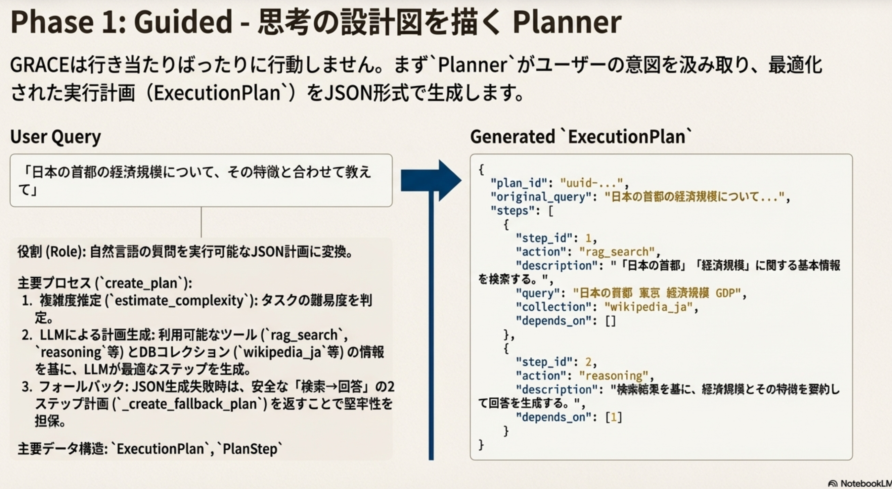
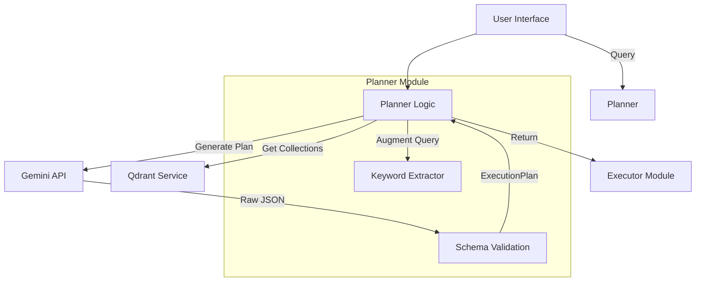
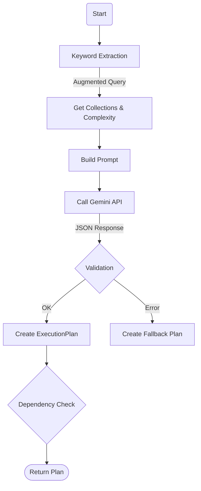
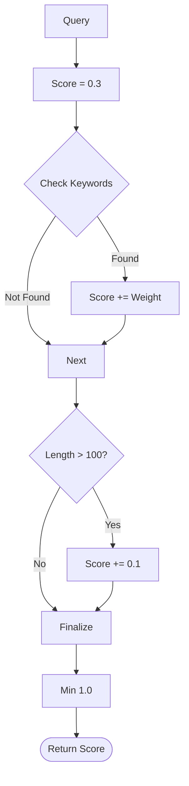
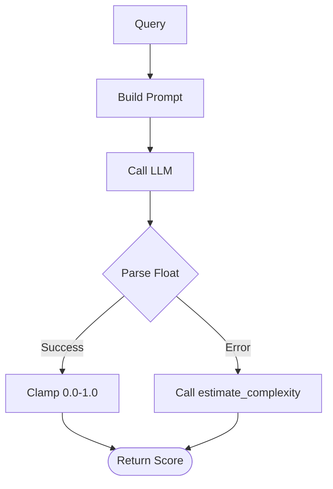
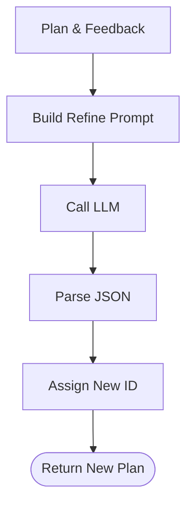
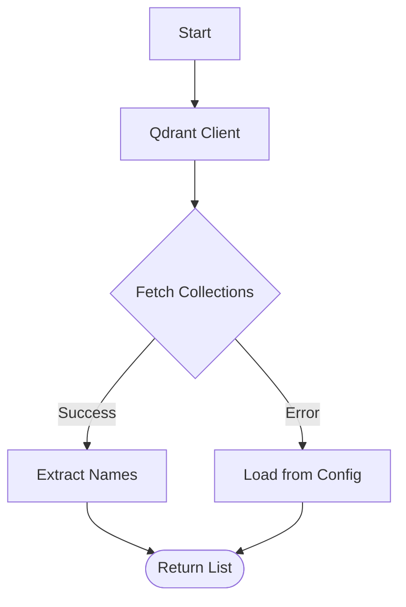

## GRACE Planner (計画生成エージェント)

## 1. 概要

Plannerは、ユーザーの自然言語による質問を解析し、GRACEエージェントが実行可能な構造化された「実行計画 (ExecutionPlan)」に変換するコアモジュールです。
**"Plan-and-Execute"** パターンの "Plan" フェーズを担い、LLMの推論能力を用いて複雑なタスクを適切な粒度のステップ（RAG検索、推論、確認など）に分解します。



## 2. モジュール構成

### 2.1 モジュール相関図

PlannerはUIから入力を受け取り、外部サービス（Qdrant, LLM）やヘルパー（KeywordExtractor）と連携して計画を生成します。



### 2.2 ディレクトリ構成

Plannerは `grace` パッケージの中核コンポーネントの一つです。

```
grace/
├── planner.py           # 【本モジュール】計画生成ロジック
├── schemas.py           # 計画(ExecutionPlan, PlanStep)のデータ構造定義
├── config.py            # 設定読み込み
├── executor.py          # 生成された計画の実行先
└── ...
```

### 2.3 ファイル構成 (Planner関連)


| ファイル           | 役割                                                               |
| :----------------- | :----------------------------------------------------------------- |
| `grace/planner.py` | `Planner` クラスおよびファクトリ関数を定義。プロンプト管理も含む。 |
| `grace/schemas.py` | 計画データのPydanticモデル定義（`ExecutionPlan`など）。            |
| `regex_mecab.py`   | 重要語句抽出ロジック（`KeywordExtractor`）。クエリ拡張に使用。     |

## 3. クラス・関数一覧

### クラス: `Planner`

計画生成のメインロジックを担うクラスです。


| メソッド名                     | 概要                                                       | 入力                   | 出力              |
| :----------------------------- | :--------------------------------------------------------- | :--------------------- | :---------------- |
| `__init__`                     | 初期化。Geminiクライアント、KeywordExtractorの設定を行う。 | `config`, `model_name` | -                 |
| `create_plan`                  | **[Main]** ユーザーの質問から実行計画を生成する。          | `query` (str)          | `ExecutionPlan`   |
| `estimate_complexity`          | ルールベースで質問の複雑度を推定する。                     | `query` (str)          | `float` (0.0-1.0) |
| `estimate_complexity_with_llm` | LLMを使用して質問の複雑度を推定する（高精度版）。          | `query` (str)          | `float` (0.0-1.0) |
| `refine_plan`                  | フィードバックに基づいて既存の計画を修正する。             | `plan`, `feedback`     | `ExecutionPlan`   |
| `_create_fallback_plan`        | 安全なデフォルト計画（2ステップ構成）を生成する。          | `query` (str)          | `ExecutionPlan`   |
| `_get_available_collections`   | Qdrantから利用可能なコレクション一覧を取得する。           | -                      | `list[str]`       |

#### Method: `create_plan` 詳細

ユーザーの質問から実行計画を生成するメイン処理です。

* **Input**: `query` (str)
* **Process**:
  1. `KeywordExtractor` でクエリを拡張（重要キーワード付与）。
  2. `_get_available_collections` でコレクション一覧を取得。
  3. `estimate_complexity` で複雑度を算出。
  4. プロンプト (`PLAN_GENERATION_PROMPT`) を構築し、LLMにJSON生成を要求。
  5. レスポンスを `ExecutionPlan` モデルに変換・検証。
  6. 失敗時は `_create_fallback_plan` で代替計画を返す。
* **Output**: `ExecutionPlan`



#### Method: `estimate_complexity` 詳細

キーワードマッチングによるルールベースの複雑度推定です。

* **Input**: `query` (str)
* **Process**:
  1. ベーススコア 0.3 から開始。
  2. 複雑さを示すキーワード（"比較", "理由", "手順" 等）が含まれるごとにスコアを加算。
  3. 文字列長が長い場合も加算。
  4. 1.0 を上限としてクランプ。
* **Output**: `float` (0.0 - 1.0)



#### Method: `estimate_complexity_with_llm` 詳細

LLMを使用したより高度な複雑度推定です。

* **Input**: `query` (str)
* **Process**:
  1. `COMPLEXITY_ESTIMATION_PROMPT` を構築。
  2. LLMに問い合わせて数値（テキスト）を取得。
  3. floatに変換し、範囲を0.0-1.0に制限。
  4. エラー時は `estimate_complexity` (ルールベース) にフォールバック。
* **Output**: `float` (0.0 - 1.0)



#### Method: `refine_plan` 詳細

ユーザーのフィードバックやエラー情報に基づいて、既存の計画を修正します。

* **Input**: `plan` (ExecutionPlan), `feedback` (str)
* **Process**:
  1. 現在の計画内容とフィードバックを含むプロンプトを構築。
  2. LLMに修正案の生成を依頼。
  3. 新しい `ExecutionPlan` オブジェクトを生成（新しいID付与）。
* **Output**: `ExecutionPlan`



#### Method: `_get_available_collections` 詳細

Qdrantサーバーから実際に存在するコレクション名を取得します。

* **Input**: なし
* **Process**:
  1. `QdrantClient` を初期化。
  2. `get_all_collections` (service wrapper) を呼び出し。
  3. エラー時は設定ファイルのデフォルトリストを返す。
* **Output**: `list[str]` (コレクション名のリスト)



### 関数


| 関数名           | 概要                                             |
| :--------------- | :----------------------------------------------- |
| `create_planner` | `Planner` インスタンスを生成するファクトリ関数。 |

## 4. データクラス一覧

`grace/schemas.py` で定義され、Plannerが入出力する主要なデータ構造です。

### `ExecutionPlan` (計画全体)


| フィールド              | 型               | 説明                               |
| :---------------------- | :--------------- | :--------------------------------- |
| `plan_id`               | `str`            | 計画の一意なID（UUID等）           |
| `original_query`        | `str`            | ユーザーの元の質問                 |
| `complexity`            | `float`          | 推定された複雑度 (0.0 - 1.0)       |
| `estimated_steps`       | `int`            | 推定される総ステップ数             |
| `requires_confirmation` | `bool`           | 実行前にユーザー確認が必要かどうか |
| `steps`                 | `List[PlanStep]` | 実行ステップのリスト               |
| `success_criteria`      | `str`            | 計画が成功したとみなす基準         |

### `PlanStep` (個別のステップ)


| フィールド        | 型              | 説明                                                      |
| :---------------- | :-------------- | :-------------------------------------------------------- |
| `step_id`         | `int`           | ステップ番号 (1, 2, ...)                                  |
| `action`          | `str`           | 実行アクション (`rag_search`, `reasoning`, `ask_user` 等) |
| `description`     | `str`           | ステップの目的・説明                                      |
| `query`           | `Optional[str]` | 検索アクションの場合のクエリ                              |
| `collection`      | `Optional[str]` | 検索対象のコレクション名                                  |
| `depends_on`      | `List[int]`     | このステップが依存する先行ステップID                      |
| `expected_output` | `str`           | このステップの期待成果物                                  |
| `fallback`        | `Optional[str]` | 失敗時の代替アクション                                    |

## 5. プロンプト構成

`grace/planner.py` 内で定義されている主要なプロンプト定数です。

* **`PLAN_GENERATION_PROMPT`**: 計画生成のメインプロンプト。
  * 利用可能なアクションとコレクションを提示。
  * `rag_search` では `wikipedia_ja` を優先するルールを記述。
  * 複雑度の判定基準やJSON形式の強制を含む。
* **`COMPLEXITY_ESTIMATION_PROMPT`**: 複雑度推定用のプロンプト（`estimate_complexity_with_llm`で使用）。

## 6. 利用方法

```python
from grace.planner import create_planner

# Plannerの初期化
planner = create_planner()

# 計画の生成
query = "最新のAI技術について、その倫理的な課題を含めて教えて"
plan = planner.create_plan(query)

# 結果の確認
print(f"Plan ID: {plan.plan_id}")
print(f"Complexity: {plan.complexity}")

for step in plan.steps:
    print(f"Step {step.step_id}: [{step.action}] {step.description}")
    if step.action == "rag_search":
        print(f"  Query: {step.query} (Collection: {step.collection})")
```
