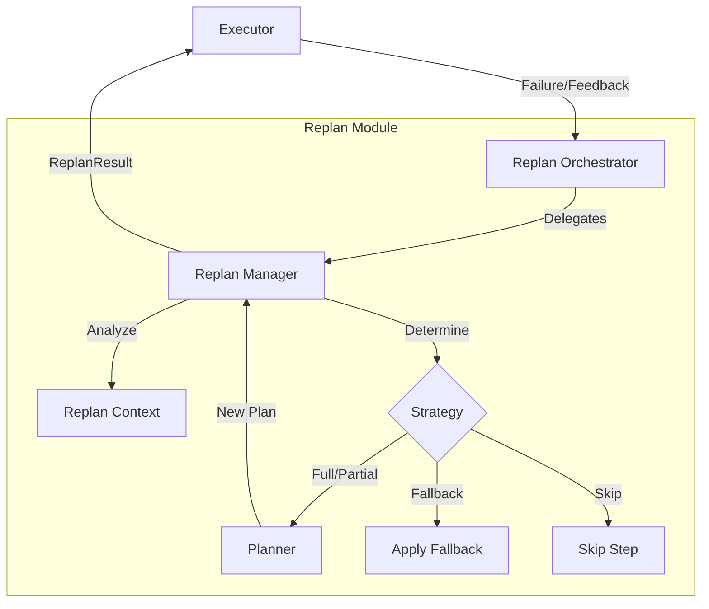
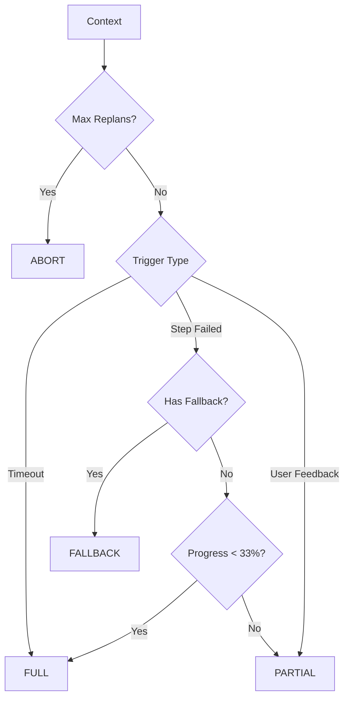

# GRACE Replan (動的リプランニングシステム)

## 1. 概要
Replanモジュールは、Executorによる計画実行中に発生した「失敗」や「低信頼度」、あるいは「ユーザーからのフィードバック」に応じて、実行計画を動的に修正（リプランニング）するシステムです。
静的な計画実行ではなく、状況に応じた適応的な振る舞いを実現し、GRACEのエージェントとしての堅牢性を高めます。

**主な責務:**
*   **Trigger Detection**: ステップ失敗、信頼度低下、ユーザーフィードバックなどのリプラントリガーの検知。
*   **Strategy Determination**: 状況に応じた最適なリプラン戦略（部分再計画、全体再計画、代替案など）の決定。
*   **Plan Regeneration**: Plannerと連携し、失敗したステップ以降の計画を再生成して既存の計画と結合。
*   **Context Management**: エラー内容や完了済みステップの情報を保持し、再計画時のプロンプトに反映。

## 2. モジュール構成

### 2.1 モジュール相関図

Executorが実行失敗や介入を検知すると、ReplanOrchestratorを通じてReplanManagerが戦略を立案し、Plannerを使用して新しい計画を生成します。



### 2.2 ディレクトリ構成
Replan関連ファイルは `grace` パッケージ内に配置されています。

```
grace/
├── replan.py            # 【本モジュール】リプランニングロジック
├── planner.py           # 計画生成（再計画時に使用）
├── executor.py          # 実行エンジン（リプランの呼び出し元）
└── config.py            # 設定（リプラン回数制限など）
```

## 3. クラス・関数一覧

### クラス: `ReplanManager`
リプランの要否判定、戦略決定、新計画生成を行うコアロジッククラスです。

| メソッド名 | 概要 | 主要フィールド/引数 |
| :--- | :--- | :--- |
| `__init__` | コンポーネントの初期化。 | `config`, `planner` |
| `should_replan` | ステップ結果からリプラン要否を判定。 | `step_result`, `replan_count` |
| `should_replan_from_feedback` | ユーザーフィードバックから判定。 | `feedback`, `replan_count` |
| `determine_strategy` | リプランコンテキストに基づき戦略を決定。 | `context`: ReplanContext |
| `create_new_plan` | 戦略に従って新しい計画を生成。 | `context`, `strategy`, `current_plan` |

#### Method: `determine_strategy` 詳細
失敗の状況や進行度に応じて、最適な復旧戦略を選択します。

*   **Input**: `context` (ReplanContext), `current_plan` (ExecutionPlan)
*   **Process**:
    1.  最大リプラン回数チェック (`ABORT`)。
    2.  ステップ失敗かつ代替手段(`fallback`)定義済みなら `FALLBACK`。
    3.  タイムアウトなら `FULL` (全体再計画)。
    4.  序盤(33%未満)の失敗なら `FULL`。
    5.  それ以外は `PARTIAL` (部分再計画)。
*   **Output**: `ReplanStrategy` (Enum)



#### Method: `create_new_plan` 詳細
決定された戦略に基づいて具体的な計画変更を行います。

*   **Input**: `context`, `strategy`, `current_plan`
*   **Process**:
    *   **FULL**: エラー情報やフィードバックをコンテキストに含めて、Plannerでゼロから計画作成。
    *   **PARTIAL**: 完了済みステップを維持し、残りのステップのみPlannerで再生成して結合。
    *   **FALLBACK**: 失敗ステップを定義済みの代替アクションに置換。
    *   **SKIP**: 失敗ステップを削除し、依存関係を修正。
*   **Output**: `ReplanResult` (新計画を含む)

### クラス: `ReplanOrchestrator`
ExecutorとReplanManagerの間を取り持つファサードクラスです。Executorからの呼び出しを簡素化します。

| メソッド名 | 概要 |
| :--- | :--- |
| `handle_step_failure` | ステップ失敗時にリプランフローを実行。 |
| `handle_user_feedback` | ユーザー介入時にリプランフローを実行。 |

## 4. データクラス・列挙型一覧

### Enum: `ReplanTrigger` & `ReplanStrategy`
リプランの原因と対策を定義します。

| Trigger (原因) | 説明 | Strategy (対策) | 説明 |
| :--- | :--- | :--- | :--- |
| `STEP_FAILED` | ステップ実行エラー | `PARTIAL` | 失敗以降を再生成 (標準) |
| `LOW_CONFIDENCE` | 信頼度が閾値未満 | `FULL` | 最初から計画し直し |
| `USER_FEEDBACK` | ユーザーからの指摘 | `FALLBACK` | 定義済み代替案へ切替 |
| `TIMEOUT` | 処理時間切れ | `SKIP` | ステップを飛ばす |
| | | `ABORT` | リプラン断念 |

### Class: `ReplanContext`
リプラン判断に必要な情報を集約したデータクラスです。

| フィールド | 型 | 説明 |
| :--- | :--- | :--- |
| `trigger` | `ReplanTrigger` | リプランのきっかけ |
| `original_query` | `str` | 当初のユーザー質問 |
| `failed_step_id` | `Optional[int]` | 失敗したステップID |
| `error_message` | `Optional[str]` | エラー内容 |
| `completed_results` | `Dict` | 成功したステップの出力 |
| `user_feedback` | `Optional[str]` | ユーザーからの指示 |

## 5. 利用方法

Executor内部から呼び出されることが想定されていますが、単体テスト等では以下のように利用できます。

```python
from grace.replan import create_replan_orchestrator, ReplanTrigger
from grace.schemas import StepResult

# 初期化
orchestrator = create_replan_orchestrator()

# ステップ失敗時のシミュレーション
failed_result = StepResult(
    step_id=2,
    status="failed",
    error="Search API timeout",
    confidence=0.0
)

# リプラン実行
replan_result = orchestrator.handle_step_failure(
    step_result=failed_result,
    current_plan=current_plan,
    completed_results=completed_results,
    replan_count=0
)

if replan_result and replan_result.success:
    print(f"Strategy used: {replan_result.strategy}")
    new_plan = replan_result.new_plan
    # Executorでnew_planを実行再開...
```
