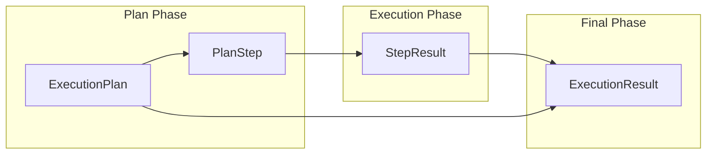

# GRACE Schemas (データモデル定義)

## 1. 概要
Schemasモジュールは、GRACEエージェント内で使用される全ての主要なデータ構造を定義します。
Pydanticモデルを使用することで、プランナー、エグゼキュータ、UI間のデータ交換において型安全性を確保し、実行時の自動バリデーションを提供します。

**主な責務:**
*   **Plan Definition**: 実行ステップ (`PlanStep`) および実行計画全体 (`ExecutionPlan`) の構造定義。
*   **Result Tracking**: 各ステップの実行結果 (`StepResult`) および最終的な回答 (`ExecutionResult`) の構造定義。
*   **Validation Logic**: 依存関係の整合性チェックやID生成などのユーティリティ提供。
*   **Serialization**: 各コンポーネント間でのJSONシリアライズ/デシリアライズの標準化。

## 2. データモデル体系

GRACEのワークフローに従い、データは「計画 (Plan)」から「実行結果 (Result)」へと遷移します。



## 3. クラス一覧

### 3.1 計画関連 (Execution Plan)

#### Class: `PlanStep`
実行計画の最小単位。個々のアクション（検索、推論など）を定義します。

| フィールド | 型 | 説明 |
| :--- | :--- | :--- |
| `step_id` | `int` | ステップ番号（1開始） |
| `action` | `Literal` | `rag_search`, `reasoning`, `ask_user` 等 |
| `description` | `str` | ステップの具体的な目的 |
| `query` | `Optional[str]` | 検索時のクエリ文字列 |
| `depends_on` | `List[int]` | 先行して完了すべきステップIDのリスト |
| `fallback` | `Optional[str]` | 失敗時に実行する代替アクション |

#### Class: `ExecutionPlan`
ユーザーのクエリに対して生成された完全な計画書です。

| フィールド | 型 | 説明 |
| :--- | :--- | :--- |
| `original_query` | `str` | ユーザーの元の質問 |
| `complexity` | `float` | 推定複雑度 (0.0 - 1.0) |
| `steps` | `List[PlanStep]` | 定義された全ステップのリスト |
| `requires_confirmation` | `bool` | 実行前にユーザー承認が必要か |
| `success_criteria` | `str` | 成功とみなす判定基準 |

### 3.2 実行結果関連 (Execution Result)

#### Class: `StepResult`
各 `PlanStep` の実行後に生成される成果物です。

| フィールド | 型 | 説明 |
| :--- | :--- | :--- |
| `step_id` | `int` | 対応するステップのID |
| `status` | `Literal` | `success`, `partial`, `failed` |
| `output` | `Optional[str]` | ステップの出力結果（回答や検索結果） |
| `confidence` | `float` | このステップに対する信頼度 (0.0 - 1.0) |
| `sources` | `List[str]` | 使用された引用ソースのリスト |

#### Class: `ExecutionResult`
全ステップ完了後の最終成果物です。

| フィールド | 型 | 説明 |
| :--- | :--- | :--- |
| `plan_id` | `str` | 関連する計画のID |
| `final_answer` | `Optional[str]` | ユーザーへの最終回答 |
| `overall_confidence` | `float` | 全体を通じた信頼度スコア |
| `step_results` | `List[StepResult]` | 実行された全ステップの履歴 |
| `total_cost_usd` | `Optional[float]` | 実行にかかった概算コスト |

## 4. 列挙型 (Enums)

### Enum: `ActionType`
実行可能なアクションの定義。

*   `rag_search`: ベクトルDBからの情報検索
*   `reasoning`: LLMによる論理推論
*   `ask_user`: ユーザーへの問いかけ
*   `web_search`: Web検索（拡張用）
*   `code_execute`: コード実行（拡張用）

### Enum: `StepStatus`
実行状態の定義。

*   `PENDING`, `RUNNING`, `SUCCESS`, `PARTIAL`, `FAILED`, `SKIPPED`

## 5. ユーティリティ関数

| 関数名 | 概要 |
| :--- | :--- |
| `create_plan_id` | 12文字のハッシュによる一意な計画IDを生成します。 |
| `validate_plan_dependencies` | 計画内の依存関係（存在しないID、循環参照、未来への参照）を検証し、エラーリストを返します。 |

## 6. 利用方法

```python
from grace.schemas import PlanStep, ExecutionPlan

# ステップの作成
step1 = PlanStep(
    step_id=1,
    action="rag_search",
    description="GRACEの概要について検索する",
    query="GRACEエージェントとは？",
    expected_output="GRACEの定義と主要機能のリスト"
)

# 計画の作成
plan = ExecutionPlan(
    original_query="GRACEについて教えて",
    complexity=0.3,
    estimated_steps=1,
    requires_confirmation=False,
    steps=[step1],
    success_criteria="GRACEの基本概念が説明されていること"
)

# Pydanticのバリデーションが自動的に実行される
print(plan.model_dump_json(indent=2))
```
