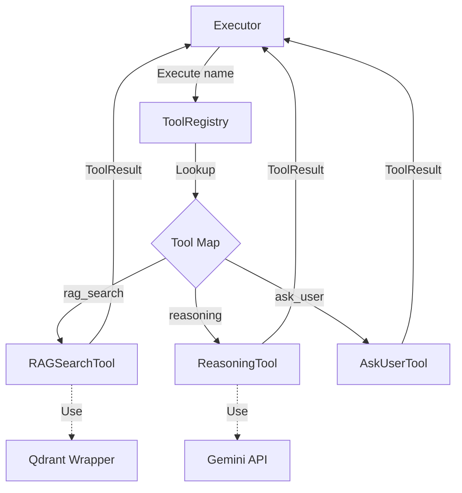
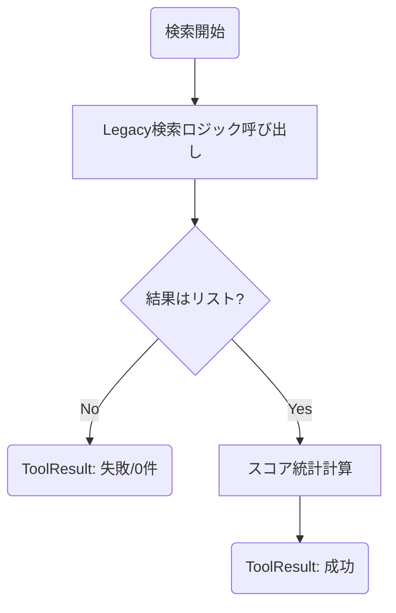
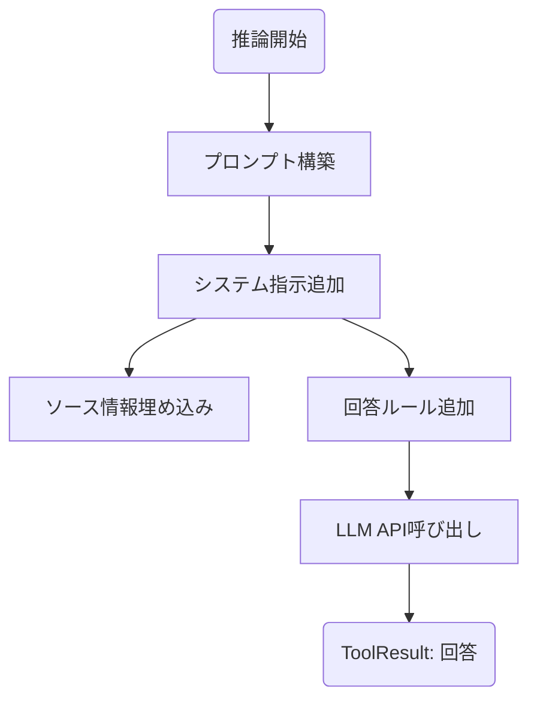
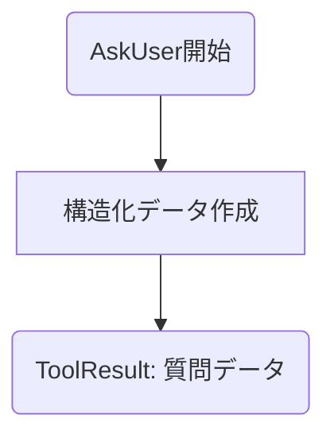
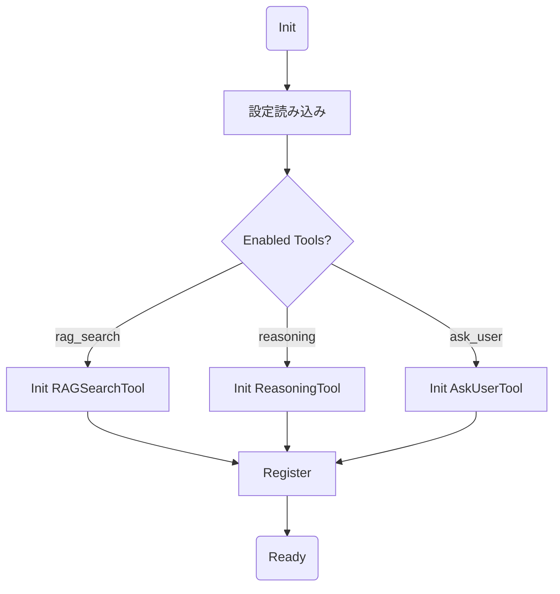

# GRACE Tools (ツール定義)

## 1. 概要
`grace/tools.py` は、GRACEエージェントが実行可能なアクション（ツール）を定義・管理するモジュールです。
Strategyパターンを採用し、RAG検索、LLM推論、ユーザー介入といったエージェントの基本動作を統一的なインターフェース（`BaseTool`）で扱います。
各ツールの実行結果には「信頼度係数（Confidence Factors）」が含まれ、後続のConfidence Score計算（`grace/confidence.py`）に必要な生データを提供します。

## 2. アーキテクチャ

Registryパターンを採用しており、`Executor` は具体的な実装を知らなくても、名前（文字列）だけでツールを実行できます。



## 3. クラス・関数一覧

### ツール実装状況
| ツール名 (enabled名) | クラス名 | ファイル名 | 機能概要 |
| :--- | :--- | :--- | :--- |
| `rag_search` | `RAGSearchTool` | `grace/tools.py` | Qdrantを使用したベクトル検索（`agent_tools.py`へ処理委譲）。 |
| `reasoning` | `ReasoningTool` | `grace/tools.py` | Gemini APIを使用して回答を生成。 |
| `ask_user` | `AskUserTool` | `grace/tools.py` | ユーザーへの質問情報を生成（実際の対話はExecutor/UI担当）。 |
| `web_search` | - | - | (未実装 / 計画中) |

### 主要クラス・関数
| 種類 | 名前 | 説明 |
| :--- | :--- | :--- |
| **DataClass** | `ToolResult` | 実行結果（成功可否、出力、信頼度係数、エラー等）を格納。 |
| **ABC** | `BaseTool` | 全ツールの基底クラス。`execute` メソッドを定義。 |
| **Class** | `ToolRegistry` | ツールの登録・検索・一括実行を行うレジストリ。 |
| Method | `ToolRegistry.register` | ツールインスタンスを登録する。 |
| Method | `ToolRegistry.execute` | 名前でツールを検索し、実行するショートカット。 |
| **Function** | `create_tool_registry` | 設定に基づいてレジストリを作成・初期化するファクトリ関数。 |

## 4. 詳細設計 (IPO + Mermaid)

### 4.1 Class: `RAGSearchTool` (`rag_search`)

ベクトルデータベース（Qdrant）から関連情報を検索します。既存の安定したロジック（`agent_tools.search_rag_knowledge_base_structured`）を再利用しつつ、信頼度計算に必要な統計情報を付与します。

#### IPO (Method: `execute`)
*   **Input:**
    *   `query` (str): 検索クエリ
    *   `collection` (str, optional): 検索対象コレクション
    *   `limit` (int, optional): 件数上限
*   **Process:**
    1.  **Delegate**: `agent_tools` モジュールの検索関数を呼び出し、実際の検索（ベクトル化、フィルタリング等）を実行。
    2.  **Validate**: 結果がリスト形式か確認。
    3.  **Statistics**: 成功時、検索スコアの分布（件数、平均、分散、最大値）を計算し、`confidence_factors` に格納。
*   **Output:** `ToolResult` (検索結果リスト + 信頼度係数)



---

### 4.2 Class: `ReasoningTool` (`reasoning`)

収集した情報（ソース）とコンテキストを元に、LLMを使って回答を生成します。

#### IPO (Method: `execute`)
*   **Input:**
    *   `query` (str): ユーザーの質問
    *   `context` (str, optional): 前ステップまでの文脈
    *   `sources` (List[Dict], optional): RAG検索結果
*   **Process:**
    1.  **Build Prompt**: `_build_prompt` でシステム指示、ソース情報、回答ルール（出典明示・捏造禁止）を含むプロンプトを構築。
    2.  **LLM Call**: Google GenAI SDK (`genai.Client`) に生成リクエストを送信。
    3.  **Metrics**: 回答テキストとトークン使用量を取得。
*   **Output:** `ToolResult` (回答テキスト)



---

### 4.3 Class: `AskUserTool` (`ask_user`)

ユーザーに追加情報や確認を求める必要がある場合に使用します。

#### IPO (Method: `execute`)
*   **Input:**
    *   `question` (str): 質問文
    *   `reason` (str): 質問の理由
    *   `urgency` (str): 緊急度 ("blocking" / "optional")
*   **Process:**
    *   実際のユーザー対話（入力待ち）はここでは行わず、Executorが処理可能な構造化データ（辞書）を作成する。
*   **Output:** `ToolResult` (質問情報を含む辞書)



---

### 4.4 Class: `ToolRegistry`

設定に基づきツールを初期化・管理し、Executorからの呼び出しを仲介します。

#### IPO (Method: `__init__` / `_register_default_tools`)
*   **Input:** `config` (GraceConfig)
*   **Process:**
    1.  設定ファイル（`grace_config.yml`）の `enabled_tools` リストを読み込む。
    2.  有効なツール (`rag_search`, `reasoning`, `ask_user`) のインスタンスを作成。
    3.  内部辞書 `_tools` に登録。
*   **Output:** 初期化されたレジストリインスタンス。

#### IPO (Method: `execute`)
*   **Input:** `name` (ツール名), `kwargs` (引数)
*   **Process:**
    1.  `get(name)` でツールを検索。
    2.  存在すれば `tool.execute(**kwargs)` を呼び出す。
    3.  存在しなければエラー結果を返す。
*   **Output:** `ToolResult`



## 5. データ構造

### ToolResult
各ツールが共通して返す結果オブジェクトです。

| フィールド | 型 | 説明 |
| :--- | :--- | :--- |
| `success` | bool | 実行が成功したか |
| `output` | Any | 実行結果（検索結果リスト、回答テキスト等） |
| `confidence_factors` | Dict | 信頼度計算のための統計情報（例: `{"result_count": 5, "max_score": 0.92}`}） |
| `error` | Optional[str] | エラーメッセージ |
| `execution_time_ms` | Optional[int] | 実行時間 (ms) |

## 6. 利用方法

### レジストリの使用
```python
from grace.tools import create_tool_registry

# レジストリ作成（設定に基づいてデフォルトツールがロードされる）
registry = create_tool_registry()

# ツール一覧
print(registry.list_tools()) 
# -> ['rag_search', 'reasoning', 'ask_user']

# ツール実行
result = registry.execute(
    "rag_search", 
    query="Geminiの特徴は？", 
    collection="wikipedia_ja"
)

if result.success:
    print(f"Found {len(result.output)} results.")
    print(f"Confidence factors: {result.confidence_factors}")
else:
    print(f"Error: {result.error}")
```

### カスタムツールの追加
```python
from grace.tools import BaseTool, ToolResult

class MyCustomTool(BaseTool):
    name = "my_tool"
    description = "カスタム計算ツール"

    def execute(self, x: int, y: int, **kwargs) -> ToolResult:
        return ToolResult(
            success=True,
            output=x + y,
            confidence_factors={"simple_calc": True}
        )

# 登録
registry.register(MyCustomTool())
registry.execute("my_tool", x=10, y=20)
```
