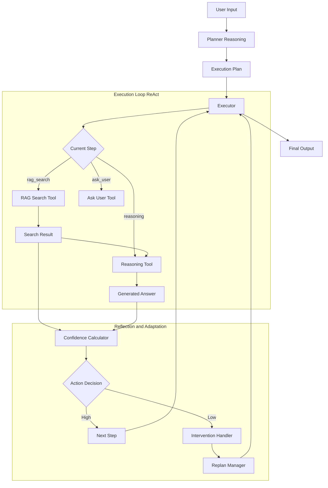

# GRACE Agent アーキテクチャ詳細設計書

## 1. 概要
GRACE (Guided Reasoning with Adaptive Confidence Execution) は、**「計画実行（Plan-and-Execute）」**、**「信頼度評価（Confidence-aware）」**、**「人間との協調（Human-in-the-Loop）」** を統合した次世代の自律型エージェントアーキテクチャです。
従来のReAct型エージェントの弱点（迷走、無限ループ、不確実な回答）を克服するため、実行前に明確な計画を立て、ステップごとに信頼度を評価し、必要に応じて動的に計画修正やユーザーへの確認を行います。

### 主な特徴
1.  **Guided (誘導型計画):** ユーザーの質問を分析し、最適な実行計画（ステップ）を事前に生成。
2.  **Adaptive (適応型実行):** 実行結果やエラーに応じて、動的に計画を修正（リプラン）。
3.  **Confidence (信頼度駆動):** RAG検索結果やLLMの自己評価から「信頼度スコア」を算出。
4.  **Execution (堅牢な実行):** 依存関係を考慮したステップ実行と、Legacyシステムとの互換性維持。

---

## 2. モジュール構成と役割分担

| モジュール | ファイル名 | 役割・責務 | ReAct/Reflection 関連 |
| :--- | :--- | :--- | :--- |
| **Config** | `config.py` | 設定管理 | - |
| **Schemas** | `schemas.py` | データモデル定義 | 計画(`ExecutionPlan`)、ステップ結果(`StepResult`)の定義 |
| **Planner** | `planner.py` | 計画生成エージェント | ユーザーの意図を理解し、ReActのステップを事前に計画する |
| **Executor** | `executor.py` | **実行エンジン (Core)** | **ReActループの制御、ツール実行、Reflectionのトリガー** |
| **Tools** | `tools.py` | ツール定義 | **Actionの実体** (RAG検索, Reasoning等)。`ReasoningTool` がReflectionを含む回答生成を担当 |
| **Confidence** | `confidence.py` | 信頼度計算 | 実行結果(Observation)の品質評価。Reflectionの判断基準 |
| **Intervention** | `intervention.py` | ユーザー介入 | 信頼度が低い場合のHITL介入 |
| **Replan** | `replan.py` | 再計画 | エラーや低信頼度時のReActループの修正 |

---

## 3. ReAct + Reflection の統合と実行フロー

GRACEでは、従来の「単一のループ内でReActとReflectionを行う」方式ではなく、**計画(Plan) → 実行(Execute/Act) → 評価(Reflect/Confidence)** という構造化されたフローを採用し、その中でReActの強力な推論能力を活用しています。

### 3.1 構成図 (Architecture Diagram)



### 3.2 詳細解説

#### 1. Reasoning (推論・計画)
*   **場所:** `grace/planner.py`
*   **処理:** 
    *   ユーザーの入力を受け取り、タスクを解決するためのステップ（思考プロセス）を事前に定義します。
    *   これが従来のReActにおける "Thought" の最初の大きな塊に相当します。
    *   LLMを使って、どのようなツール（Action）をどの順序で使うべきかを決定します。

#### 2. Acting (行動・実行)
*   **場所:** `grace/executor.py` および `grace/tools.py`
*   **処理:**
    *   `Executor` が計画書(`ExecutionPlan`)に従い、ステップごとに指定されたツールを実行します。
    *   **Action:** `grace/tools.py` 内の `RAGSearchTool` や `ReasoningTool` が実行されます。
    *   **Observation:** ツールの実行結果（検索結果や生成テキスト）が `StepResult` として記録されます。

#### 3. Reflection (自己省察・評価)
*   **場所:** `grace/confidence.py` (計算) および `grace/executor.py` (統合)
*   **処理:**
    *   **Confidence Calculator:** ツールの実行結果（Observation）に対して、即座に評価を行います。
        *   RAG検索のスコアは十分か？
        *   複数の情報源で整合性が取れているか？
        *   `LLMSelfEvaluator`: 生成された回答が適切かどうか、LLM自身に自己採点させます（Reflection）。
    *   この評価スコア(`ConfidenceScore`)に基づいて、次の行動（そのまま進むか、ユーザーに聞くか、計画を修正するか）を決定します。

#### 4. Adaptation (適応・再計画)
*   **場所:** `grace/replan.py`
*   **処理:**
    *   Reflectionの結果、信頼度が低い場合やエラーが発生した場合、`ReplanManager` が起動します。
    *   失敗した原因を分析し、新しい計画（ReActループの修正）を生成して `Executor` に渡します。

---

## 4. アーキテクチャ構成要素詳細 (IPO)

GRACEの中核をなす4つの柱について、その目的と処理フローを詳述します。

### 4.1 Guided (誘導型計画) - Planner

*   **概要・目的**:
    *   ユーザーの曖昧な自然言語入力を、実行可能な具体的ステップ（JSON形式の計画書）に変換します。
    *   タスクの複雑度を事前に推定し、単純な検索で済むか、多段階の推論が必要かを判断します。

*   **IPO (Input-Process-Output)**:
    *   **Input**: `query` (ユーザーの質問文字列)
    *   **Process**:
        1.  **複雑度推定**: キーワードマッチングやLLMによる評価でタスク難易度を算出。
        2.  **プロンプト構築**: 利用可能なツールやコレクション情報を文脈に含める。
        3.  **計画生成**: LLM (Gemini) にJSONスキーマに従った計画を出力させる。
        4.  **検証**: 生成された計画の依存関係（DAG）をチェック。
    *   **Output**: `ExecutionPlan` オブジェクト（ステップのリスト、依存関係を含む）。

    ```mermaid
    graph TD
        Input[User Query] --> Estimate{Estimate Complexity}
        Estimate -->|Simple| Template[Use Fallback Template]
        Estimate -->|Complex| Gen[LLM Generation]
        
        Gen -->|JSON| Validate{Validate Dependencies}
        Validate -->|OK| Plan[Execution Plan]
        Validate -->|Error| Template
    ```

### 4.2 Adaptive (適応型実行) - Replan Manager

*   **概要・目的**:
    *   実行中のエラーや、期待した結果が得られなかった場合（検索結果0件など）に、動的に計画を修正します。
    *   ユーザーからのフィードバック（「それは違う」など）に基づいて軌道修正を行います。

*   **IPO**:
    *   **Input**: `ReplanContext` (失敗したステップ、エラー内容、現状の進捗、ユーザーフィードバック)
    *   **Process**:
        1.  **トリガー分析**: リプランの原因（エラー、低信頼度、ユーザー指摘）を特定。
        2.  **戦略決定**:
            *   `PARTIAL`: 失敗したステップ以降のみ再計画。
            *   `FULL`: 最初から計画を作り直す。
            *   `FALLBACK`: 定義された代替手段（Web検索など）に切り替え。
        3.  **計画生成**: Plannerを再利用し、新しい条件で計画を生成。
        4.  **結合**: 完了済みステップと新しい計画をマージ。
    *   **Output**: `ReplanResult` (新しい `ExecutionPlan` または中止判断)。

    ```mermaid
    graph TD
        Trigger[Failure or Low Conf] --> Analyze[Analyze Context]
        Analyze --> Strategy{Determine Strategy}
        
        Strategy -->|Partial| Keep[Keep Completed Steps]
        Keep --> ReplanPartial[Replan Remaining]
        
        Strategy -->|Full| ReplanAll[Replan All]
        
        Strategy -->|Fallback| ApplyFallback[Use Fallback Action]
        
        ReplanPartial --> Merge[Merge Plans]
        ReplanAll --> NewPlan
        ApplyFallback --> NewPlan
        
        Merge --> NewPlan[New Execution Plan]
    ```

### 4.3 Confidence (信頼度駆動) - Confidence Engine

*   **概要・目的**:
    *   エージェントの行動結果を定量的に評価し、過信（ハルシネーション）を防ぎます。
    *   「検索結果のスコア」といった客観指標と、「LLMによる自己評価」といった主観指標を組み合わせます。

*   **IPO**:
    *   **Input**: `ConfidenceFactors` (検索ヒット数, 最大スコア, LLM自己評価値, ソース一致度)
    *   **Process**:
        1.  **正規化**: 各要素を 0.0-1.0 の範囲に正規化。
        2.  **重み付け**: ステップの種類（検索/推論）に応じた重みで加重平均。
        3.  **ペナルティ適用**: 「検索結果ゼロ」などの致命的な欠陥に対してスコアを減算。
        4.  **アクション決定**: 閾値と比較し、次のアクション（Silent/Notify/Confirm/Escalate）を決定。
    *   **Output**: `ConfidenceScore` (スコアと内訳), `ActionDecision` (介入レベル)。

    ```mermaid
    graph LR
        Factors[Confidence Factors] --> Normalize[Normalize 0-1]
        Normalize --> Weight[Weighted Average]
        Weight --> Penalty[Apply Penalties]
        Penalty --> Score[Confidence Score]
        Score --> Threshold{Threshold Check}
        Threshold -->|High| Silent
        Threshold -->|Med| Notify
        Threshold -->|Low| Confirm
        Threshold -->|Bad| Escalate
    ```

### 4.4 Execution (堅牢な実行) - Executor

*   **概要・目的**:
    *   生成された計画を順序通り、あるいは依存関係に従って実行するステートマシンです。
    *   Legacy Agent (ReAct) の機能を「1つのステップ」として内包・統合し、過去の資産を活かします。

*   **IPO**:
    *   **Input**: `ExecutionPlan` (計画書), `ToolRegistry` (利用可能なツール群)
    *   **Process**:
        1.  **状態管理**: 現在のステップ、変数、完了状態を保持。
        2.  **依存解決**: 前のステップの出力（コンテキスト）を次のステップの入力に注入。
        3.  **ツール実行**: 指定されたアクション（RAG検索、推論、Legacy Agent呼び出し）を実行。
        4.  **評価ループ**: 実行直後にConfidence Engineを呼び出し、結果を評価。
        5.  **介入制御**: 評価結果に基づき、一時停止やIntervention Handlerへの委譲を行う。
    *   **Output**: `ExecutionResult` (最終回答、全ステップのログ、統合信頼度)。

    ```mermaid
    graph TD
        Plan[Execution Plan] --> Init[Init State]
        Init --> Loop{Has Next Step?}
        Loop -->|No| Final[Final Result]
        Loop -->|Yes| DepCheck{Deps Met?}
        DepCheck -->|No| Skip[Skip Step]
        DepCheck -->|Yes| Tool[Execute Tool]
        Tool -->|Result| Conf{Calc Confidence}
        Conf -->|High| Next[Next Step]
        Conf -->|Low| Intervention[Intervention Handler]
        Intervention -->|Proceed| Next
        Intervention -->|Modify| Replan[Replan Request]
        Tool -->|Fail| Replan
        Replan -->|New Plan| Init
        Skip --> Next
        Next --> Loop
    ```
