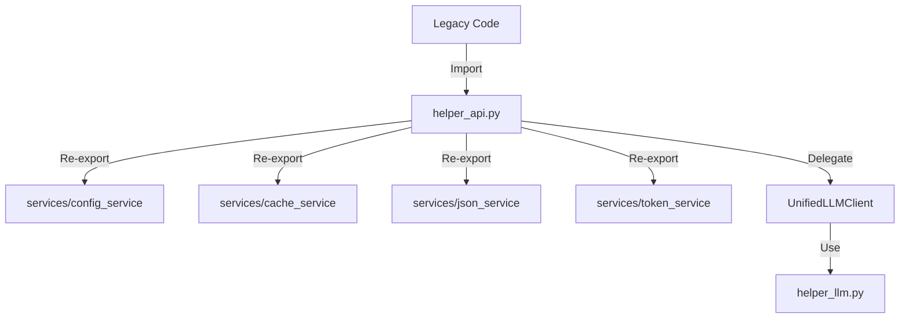
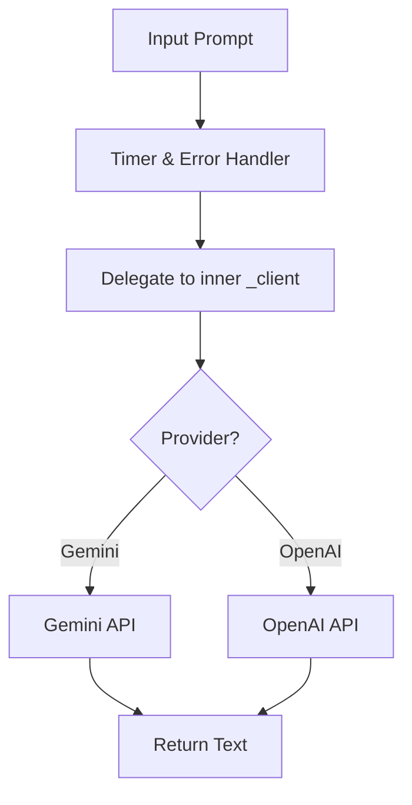
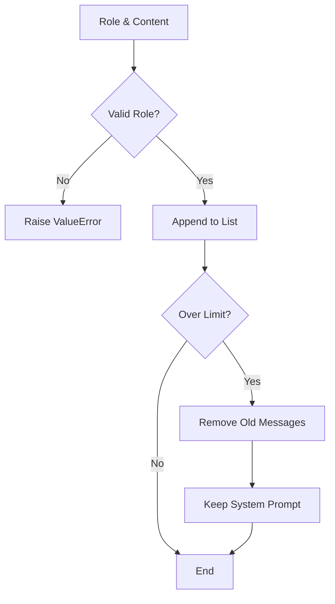

# Helper: API (後方互換レイヤー)

## 1. 概要
`helper_api.py` は、旧来のコードベースとの互換性を維持するための統合レイヤーです。
Gemini, OpenAI APIの型定義やユーティリティ関数を提供しつつ、内部実装は新しい `services/` パッケージや `helper_llm.py`（統合LLMクライアント）に委譲しています。
これにより、既存のコードを変更することなく、バックエンドのロジックをGemini/OpenAI両対応の新しいアーキテクチャに移行することを可能にしています。

**主な責務:**
*   **Backward Compatibility**: `services/` 以下のモジュール（Config, Cache, JSON, Token）を再エクスポートし、旧来のインポートパスを維持。
*   **Unified LLM Interface**: `UnifiedLLMClient` を通じて、プロバイダ（Gemini/OpenAI）を透過的に切り替え可能なインターフェースを提供。
*   **OpenAI Type Definitions**: `EasyInputMessageParam` などのOpenAI固有の型定義を維持。
*   **Utility Decorators**: `error_handler`, `timer` などの汎用デコレータを提供。

## 2. モジュール構成

### 2.1 依存関係

本モジュールは `services/` パッケージと `helper_llm.py` に強く依存し、それらを統合して提供します。



## 3. クラス・関数一覧

### クラス: `UnifiedLLMClient`
GeminiとOpenAIの違いを吸収し、統一されたメソッドでテキスト生成や構造化出力を行うクライアントです。

| メソッド名 | 概要 | 主要引数 |
| :--- | :--- | :--- |
| `__init__` | 指定プロバイダで内部クライアントを初期化。 | `provider` |
| `generate` | テキスト生成を実行。 | `prompt`, `model`, `system_instruction` |
| `generate_structured` | Pydanticモデルに基づいた構造化データ生成。 | `prompt`, `response_schema` |
| `count_tokens` | トークン数をカウント。 | `text`, `model` |

#### Method: `generate` IPO

*   **Input**:
    *   `prompt` (str): ユーザー入力
    *   `model` (str): モデル名
    *   `system_instruction` (str): システムプロンプト
*   **Process**:
    1.  `@error_handler` と `@timer` デコレータによる保護と計測。
    2.  内部の `_client` (GeminiClient or OpenAIClient) の `generate_content` を呼び出し。
    3.  プロバイダ固有の処理（APIコール）。
*   **Output**:
    *   `str`: 生成されたテキスト。



### クラス: `MessageManager`
チャット履歴を管理するユーティリティクラスです。

| メソッド名 | 概要 |
| :--- | :--- |
| `add_message` | 履歴にメッセージを追加（上限管理あり）。 |
| `get_messages` | 全メッセージを取得。 |
| `get_default_messages` | 設定ファイルからデフォルトのシステムプロンプト等を取得。 |

#### Method: `add_message` IPO

*   **Input**:
    *   `role` (RoleType): 'user', 'assistant', 'system' 等
    *   `content` (str): メッセージ本文
*   **Process**:
    1.  ロールの有効性チェック。
    2.  リストに新しいメッセージ辞書を追加。
    3.  メッセージ数が上限（`api.message_limit`）を超えた場合、古いメッセージを削除（ただし最初のシステムプロンプトは維持）。
*   **Output**: なし（内部状態更新）。



### クラス: `ResponseProcessor`
APIレスポンスの解析と保存を担当します。

| メソッド名 | 概要 |
| :--- | :--- |
| `extract_text` | レスポンスオブジェクトからテキスト本文を抽出。 |
| `format_response` | レスポンスをJSONシリアライズ可能な辞書に変換。 |
| `save_response` | レスポンスをJSONファイルとしてログ保存。 |

### デコレータ

| 関数名 | 概要 |
| :--- | :--- |
| `error_handler` | 例外をキャッチし、ログ出力後に再送出する。 |
| `timer` | 関数の実行時間を計測してログ出力する。 |

## 4. 利用方法

### 統合LLMクライアントの使用

```python
from helper_api import create_llm_client

# デフォルト（Gemini）または環境変数指定のプロバイダでクライアント作成
client = create_llm_client()

text = client.generate("Pythonのメリットは？")
print(text)
```

### メッセージ履歴の管理

```python
from helper_api import MessageManager

manager = MessageManager()
manager.add_message("user", "こんにちは")
messages = manager.get_messages()
```
