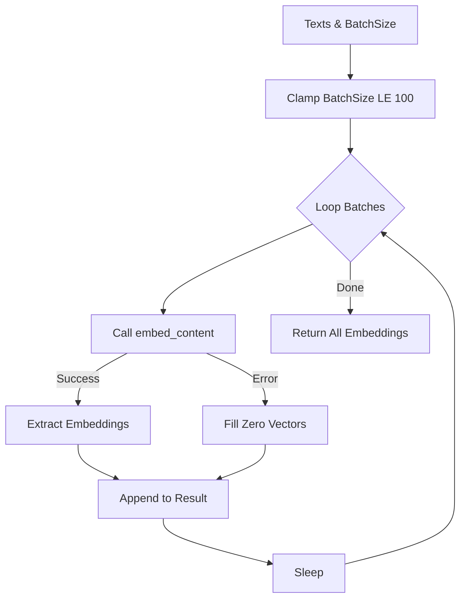

# Helper: Embedding (Embeddingクライアント抽象化)

## 1. 概要
`helper_embedding.py` は、OpenAI API と Gemini API のEmbedding機能を抽象化し、統一されたインターフェースで利用可能にするモジュールです。
モデルごとの違い（次元数、バッチ処理の仕様、レート制限）を隠蔽し、アプリケーション層からは `embed_text` や `embed_texts` を呼び出すだけでベクトル化が可能になります。

**主な責務:**
*   **Abstraction**: プロバイダ（OpenAI/Gemini/FastEmbed）ごとの実装詳細を隠蔽。
*   **Dimensionality Management**: Gemini (3072次元) と OpenAI (1536次元) のデフォルト設定を管理。
*   **Batch Processing**: 効率的なAPI呼び出しのためのバッチ処理とレート制限対策。
*   **Factory Pattern**: `create_embedding_client` 関数によるインスタンス生成の統一。

## 2. モジュール構成

### 2.1 依存関係

OpenAI SDK、Google GenAI SDK、およびFastEmbed（オプション）を使用します。

```mermaid
graph TD
    App[Application Code] -->|Use| Factory[create_embedding_client]
    Factory -->|Create| Client[EmbeddingClient Interface]
    
    Client <|-- OpenAI[OpenAIEmbedding]
    Client <|-- Gemini[GeminiEmbedding]
    
    OpenAI -->|Call| O_API[OpenAI API]
    Gemini -->|Call| G_API[Gemini API]
```

### 2.2 ディレクトリ構成

```
helper_embedding.py      # 【本モジュール】Embedding抽象化
helper_embedding_fastembed.py # FastEmbed実装（ローカル）
```

## 3. クラス・関数一覧

### クラス: `EmbeddingClient` (ABC)
すべてのEmbeddingクライアントの基底となる抽象クラスです。

| メソッド名 | 概要 |
| :--- | :--- |
| `dimensions` (property) | Embeddingベクトルの次元数を返す。 |
| `embed_text` | 単一テキストをベクトル化する。 |
| `embed_texts` | 複数テキストをバッチでベクトル化する。 |

### クラス: `GeminiEmbedding`
Gemini APIを使用した実装です。

*   **次元数**: デフォルト 3072
*   **バッチ制限**: 最大 100 件/リクエスト

#### Method: `embed_texts` IPO (Gemini)

*   **Input**:
    *   `texts` (List[str]): テキストリスト
    *   `batch_size` (int): バッチサイズ (最大100)
*   **Process**:
    1.  `batch_size` が100を超えている場合は100に制限。
    2.  リストをバッチサイズごとに分割してループ。
    3.  `client.models.embed_content` を呼び出し。
    4.  レスポンスから `values` を抽出してリストに追加。
    5.  エラー時はゼロベクトルで埋めて整合性を維持。
    6.  レート制限回避のため、バッチ間に `time.sleep` を挿入。
*   **Output**:
    *   `List[List[float]]`: ベクトルのリスト。



### クラス: `OpenAIEmbedding`
OpenAI APIを使用した実装です。

*   **次元数**: デフォルト 1536
*   **モデル**: `text-embedding-3-small` 等

### ファクトリ関数

| 関数名 | 概要 | 主要引数 |
| :--- | :--- | :--- |
| `create_embedding_client` | プロバイダを指定してクライアントを生成。 | `provider`, `api_key`, `model` |
| `get_embedding_dimensions` | プロバイダごとのデフォルト次元数を取得。 | `provider` |

#### Function: `create_embedding_client` IPO

*   **Input**:
    *   `provider` (str): "gemini", "openai", "fastembed"
    *   `**kwargs`: 各クライアントへの引数
*   **Process**:
    1.  `provider` 文字列を判定。
    2.  対応するクラス (`GeminiEmbedding` 等) をインスタンス化。
    3.  FastEmbedの場合はインポートエラーをハンドリング。
*   **Output**:
    *   `EmbeddingClient`: 具体的なクライアントインスタンス。

## 4. 利用方法

### クライアントの生成と利用

```python
from helper_embedding import create_embedding_client

# Geminiクライアントの作成
client = create_embedding_client(provider="gemini")

# 単一テキスト
vector = client.embed_text("こんにちは")
print(f"Dims: {len(vector)}") # 3072

# バッチ処理
vectors = client.embed_texts(["テキスト1", "テキスト2"])
```

### 次元数の確認

```python
from helper_embedding import get_embedding_dimensions

dims = get_embedding_dimensions("openai")
print(f"OpenAI Dims: {dims}") # 1536
```