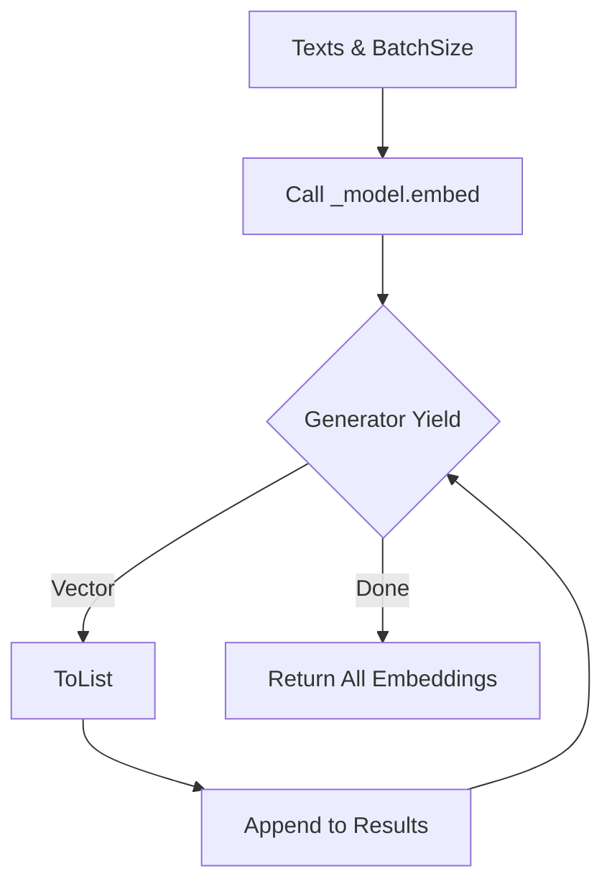

# Helper: FastEmbed (Local Embedding)

## 1. 概要
`helper_embedding_fastembed.py` は、軽量なローカルEmbeddingライブラリである **FastEmbed** を使用した `EmbeddingClient` の実装です。
外部API（OpenAIやGemini）に依存せず、ローカルCPU上で高速にベクトル化を行うことができます。開発環境やオフライン環境、あるいはAPIコストを抑えたい場合に有用です。

**主な責務:**
*   **Local Processing**: 外部APIコールなしでテキストをベクトル化。
*   **FastEmbed Wrapper**: `fastembed` ライブラリをラップし、`EmbeddingClient` インターフェースに適合させる。
*   **Dimension Detection**: 使用するモデルの次元数を動的に検出（ダミー実行による確認）。

## 2. モジュール構成

### 2.1 依存関係

`fastembed` ライブラリが必要です。`helper_embedding` の抽象基底クラスを継承します。

```mermaid
graph TD
    App[Application Code] -->|Use| FastEmbed[FastEmbedEmbedding]
    
    FastEmbed --|> Client[EmbeddingClient (Abstract)]
    FastEmbed -->|Library| Lib[fastembed.TextEmbedding]
    
    Lib -->|Model| Weights[Local Model Weights]
```

### 2.2 ディレクトリ構成

```
helper_embedding_fastembed.py # 【本モジュール】FastEmbed実装
helper_embedding.py           # 抽象基底クラス定義
```

## 3. クラス・関数一覧

### クラス: `FastEmbedEmbedding`
FastEmbedを使用したEmbeddingクライアントの実装クラスです。

| メソッド名 | 概要 | 主要引数 |
| :--- | :--- | :--- |
| `__init__` | モデルのロードと次元数の検出を行う。 | `model_name`, `threads`, `cache_dir` |
| `dimensions` (property) | 検出されたベクトル次元数を返す。 | なし |
| `embed_text` | 単一テキストをベクトル化する。 | `text` |
| `embed_texts` | 複数テキストをバッチでベクトル化する。 | `texts`, `batch_size` |

#### Method: `__init__` IPO

*   **Input**:
    *   `model_name` (str): 使用するモデル名 (default: "BAAI/bge-small-en-v1.5")
    *   `threads` (Optional[int]): 並列スレッド数
    *   `cache_dir` (Optional[str]): モデルキャッシュ先
*   **Process**:
    1.  `fastembed` ライブラリのインポート確認。
    2.  `TextEmbedding` クラスのインスタンス化（モデルロード）。
    3.  ダミーテキスト ("test") を用いて `embed` を実行し、出力ベクトルの次元数を検出。
    4.  検出失敗時はデフォルト値 (384) を設定。
*   **Output**:
    *   初期化されたインスタンス。

#### Method: `embed_texts` IPO

*   **Input**:
    *   `texts` (List[str]): テキストリスト
    *   `batch_size` (int): バッチサイズ (default: 256)
*   **Process**:
    1.  `self._model.embed` ジェネレータ関数を呼び出し、バッチサイズを指定。
    2.  ジェネレータから順次ベクトル（numpy array）を取得。
    3.  `tolist()` でリスト形式に変換し、結果リストに追加。
*   **Output**:
    *   `List[List[float]]`: ベクトルのリスト。



## 4. 利用方法

### 基本的な利用

```python
from helper_embedding_fastembed import FastEmbedEmbedding

# デフォルトモデルで初期化
client = FastEmbedEmbedding()

# ベクトル化
vector = client.embed_text("Hello FastEmbed")
print(f"Dims: {len(vector)}") # 384
```

### 日本語モデルの利用

```python
# 多言語対応モデルを指定
client = FastEmbedEmbedding(model_name="intfloat/multilingual-e5-large")

vectors = client.embed_texts(["こんにちは", "世界"])
```
