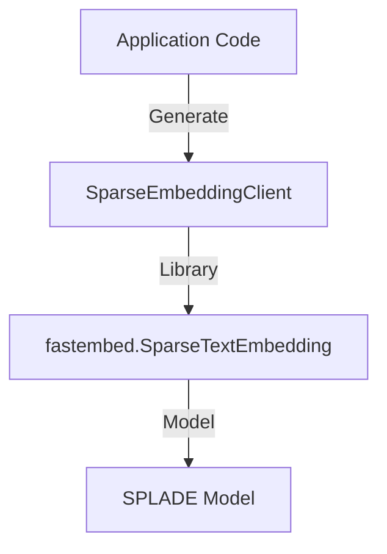
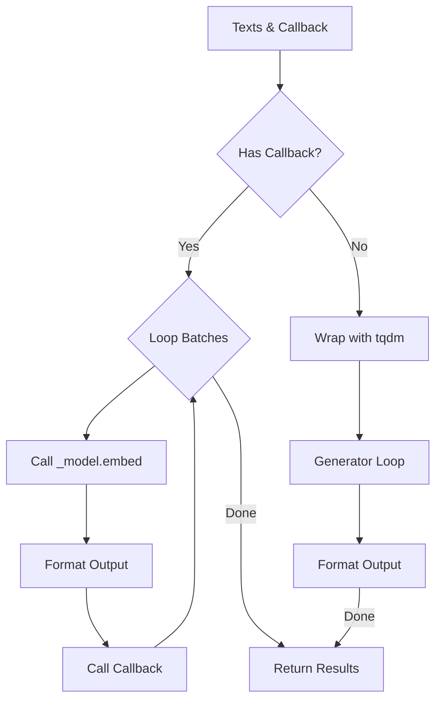

# Helper: Sparse Embedding (SPLADE)

## 1. 概要
`helper_embedding_sparse.py` は、QdrantのHybrid Searchで使用されるSparse Vector（SPLADEモデル）を生成するためのクライアントモジュールです。
FastEmbedライブラリの `SparseTextEmbedding` をラップし、Qdrantと互換性のある形式（indices, values）でベクトルを出力します。

**主な責務:**
*   **Sparse Vectorization**: SPLADEモデルを用いて、テキストからキーワード重要度付きの疎ベクトルを生成。
*   **Qdrant Compatibility**: 出力形式をQdrantのAPI仕様（辞書形式）に適合させる。
*   **Batch Processing**: `tqdm` やコールバック関数を使用した進捗表示付きのバッチ処理。

## 2. モジュール構成

### 2.1 依存関係

`fastembed` ライブラリ（SparseTextEmbedding）に依存します。



### 2.2 ディレクトリ構成

```
helper_embedding_sparse.py # 【本モジュール】Sparse Embedding実装
```

## 3. クラス・関数一覧

### クラス: `SparseEmbeddingClient`
Sparse Embedding生成のメインクラスです。

| メソッド名 | 概要 | 主要引数 |
| :--- | :--- | :--- |
| `__init__` | モデルロードと初期化。 | `model_name`, `threads`, `cache_dir` |
| `embed_text` | 単一テキストをベクトル化。 | `text` |
| `embed_texts` | 複数テキストをバッチでベクトル化。 | `texts`, `batch_size`, `progress_callback` |

#### Method: `embed_text` IPO

*   **Input**:
    *   `text` (str): 入力テキスト
*   **Process**:
    1.  `self._model.embed([text])` を呼び出し。
    2.  結果のジェネレータから最初の要素を取得。
    3.  `_format_output` でQdrant形式に変換。
*   **Output**:
    *   `Dict[str, List[Any]]`: `{'indices': [...], 'values': [...]}` 形式の辞書。

#### Method: `embed_texts` IPO

*   **Input**:
    *   `texts` (List[str]): テキストリスト
    *   `batch_size` (int): バッチサイズ
    *   `progress_callback` (Optional[Callable]): 進捗報告用コールバック
*   **Process**:
    1.  `progress_callback` がある場合:
        *   手動でバッチループを作成。
        *   `_model.embed` を呼び出し、結果を変換してリストに追加。
        *   コールバックを呼び出して進捗更新。
    2.  ない場合:
        *   `tqdm`（あれば）で進捗バーを表示しつつ、ジェネレータを反復処理。
*   **Output**:
    *   `List[Dict]`: ベクトル辞書のリスト。



### ファクトリ関数

| 関数名 | 概要 |
| :--- | :--- |
| `get_sparse_embedding_client` | シングルトンインスタンスを取得するファクトリ。 |

## 4. 利用方法

### 単一テキストのベクトル化

```python
from helper_embedding_sparse import get_sparse_embedding_client

client = get_sparse_embedding_client()
vector = client.embed_text("This is a test")

print(f"Indices: {vector['indices']}")
print(f"Values: {vector['values']}")
```

### バッチ処理

```python
vectors = client.embed_texts(
    ["Hello world", "Sparse vector search"],
    batch_size=2
)
```
