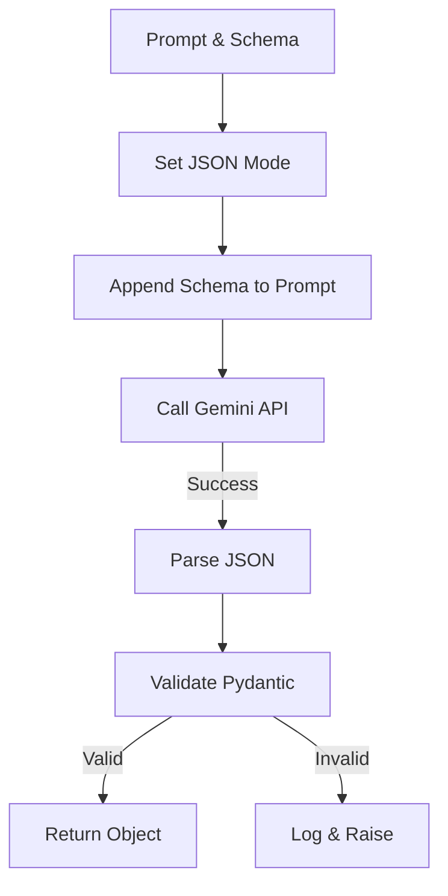
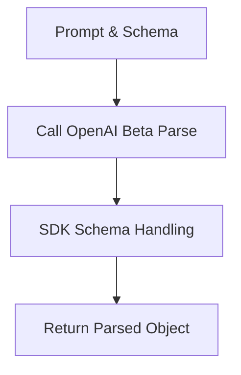

# Helper: LLM (LLMクライアント抽象化)

## 1. 概要
`helper_llm.py` は、OpenAI API と Gemini 3 API (Google GenAI) の差異を吸収し、統一されたインターフェースを提供する抽象化レイヤーです。
テキスト生成 (`generate_content`) と、Pydanticモデルに基づいた構造化出力 (`generate_structured`) の2つの主要機能を提供し、バックエンドの切り替えを容易にします。

**主な責務:**
*   **Unified Interface**: `LLMClient` 抽象基底クラスによるAPIの標準化。
*   **Structured Output**: JSONモードやFunction Callingを活用し、型安全なデータ生成を実現。
*   **Model Management**: 利用可能なモデル、価格、制限などのメタデータ管理。
*   **Token Counting**: モデル固有のトークナイザー（または近似）を用いたトークン計算。

## 2. モジュール構成

### 2.1 依存関係

OpenAI SDK、Google GenAI SDK、およびTikTokenを使用します。

```mermaid
graph TD
    App[Application Code] -->|Use| Factory[create_llm_client]
    Factory -->|Create| Client[LLMClient Interface]
    
    Client <|-- OpenAI[OpenAIClient]
    Client <|-- Gemini[GeminiClient]
    
    OpenAI -->|Call| O_API[OpenAI API]
    Gemini -->|Call| G_API[Gemini API]
```

### 2.2 ディレクトリ構成

```
helper_llm.py            # 【本モジュール】LLM抽象化
```

## 3. クラス・関数一覧

### クラス: `LLMClient` (ABC)
すべてのLLMクライアントの基底となる抽象クラスです。

| メソッド名 | 概要 |
| :--- | :--- |
| `generate_content` | 単純なテキスト生成を行う。 |
| `generate_structured` | 指定されたPydanticスキーマに従ってJSONオブジェクトを生成する。 |
| `count_tokens` | テキストのトークン数を計算する。 |

### クラス: `GeminiClient`
Google GenAI SDKを使用した実装です。

#### Method: `generate_structured` IPO (Gemini)

*   **Input**:
    *   `prompt` (str): プロンプト
    *   `response_schema` (Type[BaseModel]): Pydanticモデルクラス
    *   `model` (Optional[str]): モデル名
*   **Process**:
    1.  モデルインスタンスを初期化。
    2.  `generation_config` で `response_mime_type: "application/json"` を設定。
    3.  プロンプトにJSONスキーマ定義を追加（明示的な指示）。
    4.  `model.generate_content` を呼び出し。
    5.  レスポンスのテキストを `response_schema.model_validate_json` でパース。
*   **Output**:
    *   `BaseModel`: 検証済みのPydanticオブジェクト。



### クラス: `OpenAIClient`
OpenAI SDKを使用した実装です。

#### Method: `generate_structured` IPO (OpenAI)

*   **Input**:
    *   `prompt` (str): プロンプト
    *   `response_schema` (Type[BaseModel]): Pydanticモデルクラス
*   **Process**:
    1.  `client.beta.chat.completions.parse` メソッドを使用。
    2.  `response_format` 引数にPydanticクラスを直接渡す。
    3.  SDKが自動的にJSON Schemaへの変換とパースを行う。
*   **Output**:
    *   `BaseModel`: `response.choices[0].message.parsed` から取得したオブジェクト。



### ファクトリ・ヘルパー関数

| 関数名 | 概要 |
| :--- | :--- |
| `create_llm_client` | プロバイダ ("gemini", "openai") に応じたクライアントを生成。 |
| `get_available_llm_models` | 利用可能なモデル名のリストを返す。 |
| `get_llm_model_pricing` | モデルごとの単価情報を返す。 |

## 4. 利用方法

### テキスト生成

```python
from helper_llm import create_llm_client

client = create_llm_client(provider="gemini")
text = client.generate_content("こんにちは")
print(text)
```

### 構造化データ生成

```python
from pydantic import BaseModel
from helper_llm import create_llm_client

class UserInfo(BaseModel):
    name: str
    age: int

client = create_llm_client(provider="openai")
user = client.generate_structured("私の名前はAlice、25歳です。", UserInfo)

print(user.name, user.age)
```
