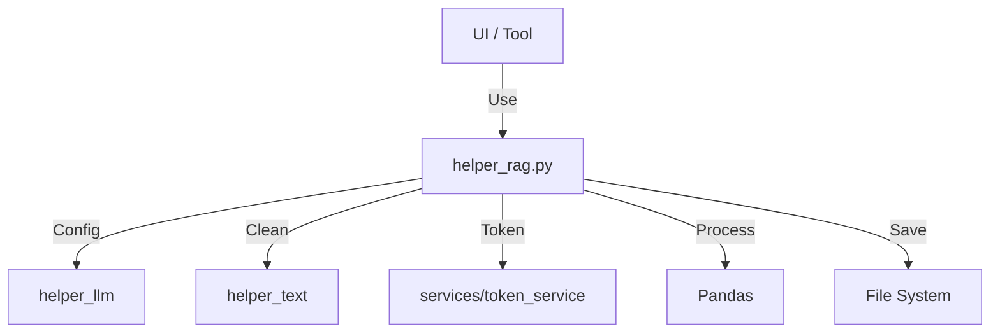
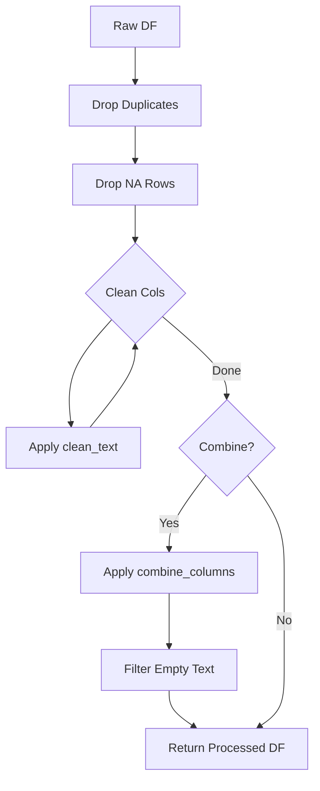

# Helper: RAG (RAG前処理共通ロジック)

## 1. 概要
`helper_rag.py` は、RAG（Retrieval-Augmented Generation）用データ前処理における共通ロジックを提供するヘルパーモジュールです。
Streamlit UIに依存しない純粋なデータ処理機能（読み込み、クリーニング、結合、保存）をここに集約し、`agent_rag.py` (UI) や `tools/rag_data_preprocessor_app.py` (CLI/Standalone App) から利用可能にします。

**主な責務:**
*   **Data Processing**: Pandas DataFrameを用いたデータのクリーニング、正規化、および列結合。
*   **Config Management**: 複数のデータセットタイプ（FAQ, Medical, Legal等）に対応した設定の一元管理。
*   **File I/O**: `OUTPUT/` ディレクトリへの統一されたフォーマットでのファイル保存。
*   **Token Management**: トークン数計算ロジック（`services/token_service` への委譲）。

## 2. モジュール構成

### 2.1 依存関係

データ処理にPandas、設定取得に `helper_llm`, `helper_embedding`、テキスト処理に `helper_text` を使用します。



### 2.2 ディレクトリ構成

```
helper_rag.py            # 【本モジュール】RAG共通ロジック
```

## 3. クラス・関数一覧

### クラス: `RAGConfig`
全データセットタイプの設定を管理する静的クラスです。

| メソッド名 | 概要 |
| :--- | :--- |
| `get_config` | 指定されたデータセットタイプの設定辞書を取得。 |
| `get_all_datasets` | 利用可能な全データセット名のリストを取得。 |
| `get_dataset_by_port` | ポート番号からデータセットタイプを逆引き（Streamlitマルチページ用）。 |

### デコレータ

| 関数名 | 概要 |
| :--- | :--- |
| `safe_execute` | 関数の実行をtry-exceptで囲み、エラー時にNoneを返す安全実行デコレータ。 |

### データ処理関数

| 関数名 | 概要 | 主要引数 |
| :--- | :--- | :--- |
| `load_dataset` | CSVファイルを読み込み、基本検証を行う。 | `uploaded_file`, `dataset_type` |
| `process_rag_data` | クリーニング、重複排除、列結合などの前処理パイプラインを実行。 | `df`, `dataset_type`, `combine` |
| `validate_data` | データセットの品質（必須列、空値、重複）を検証。 | `df`, `dataset_type` |
| `combine_columns` | データセット設定に基づき、複数列を1つのテキストに結合。 | `row`, `dataset_type` |

#### Function: `process_rag_data` IPO

*   **Input**:
    *   `df` (pd.DataFrame): 元データ
    *   `dataset_type` (str): データセット識別子
    *   `combine_columns_option` (bool): 結合を行うか
*   **Process**:
    1.  重複行 (`drop_duplicates`) と完全な空行 (`dropna`) を削除。
    2.  `RAGConfig` から必須カラムを取得し、`clean_text` を適用して正規化。
    3.  `combine_columns_option` がTrueの場合、`combine_columns` を適用して `Combined_Text` カラムを生成。
    4.  空の結合テキストを持つ行を除外。
*   **Output**:
    *   `pd.DataFrame`: 前処理済みデータフレーム。



#### Function: `combine_columns` IPO

*   **Input**:
    *   `row` (pd.Series): データ行
    *   `dataset_type` (str): データセット識別子
*   **Process**:
    1.  設定から `required_columns` を取得。
    2.  各カラムの値をクリーニングしてリストに追加。
    3.  `medical_qa` の場合のみ、特定の列名（Question, Complex_CoT, Response）を優先して結合する特別ロジックを実行。
    4.  リスト内のテキストをスペース区切りで結合。
*   **Output**:
    *   `str`: 結合されたテキスト。

### ファイル保存関数

| 関数名 | 概要 | 主要引数 |
| :--- | :--- | :--- |
| `create_download_data` | DataFrameをCSVおよびテキスト形式の文字列に変換（ダウンロード用）。 | `df`, `include_combined` |
| `save_files_to_output` | 処理済みデータとメタデータを `OUTPUT/` に保存。 | `df`, `dataset_type`, `csv_data` |
| `create_output_directory` | 保存先ディレクトリを作成し、書き込み権限を確認。 | なし |

#### Function: `save_files_to_output` IPO

*   **Input**:
    *   `df_processed`, `dataset_type`, `csv_data`, `text_data`
*   **Process**:
    1.  `create_output_directory` で保存先を準備。
    2.  タイムスタンプ付きのファイル名を生成。
    3.  CSVデータをファイルに書き込み。
    4.  テキストデータがあればファイルに書き込み。
    5.  処理メタデータ（件数、日時、ファイルパス）をJSONとして保存。
*   **Output**:
    *   `Dict[str, str]`: 保存されたファイルのパス辞書。

## 4. 利用方法

### データセットのロードと処理

```python
from helper_rag import load_dataset, process_rag_data

# 読み込み
df, validation = load_dataset("data.csv", "customer_support_faq")

# 前処理
df_clean = process_rag_data(df, "customer_support_faq")
```

### 設定の取得

```python
from helper_rag import RAGConfig

config = RAGConfig.get_config("medical_qa")
print(config["required_columns"])
```
