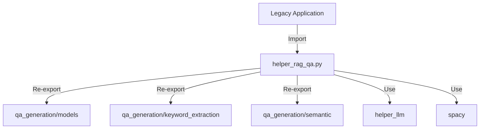
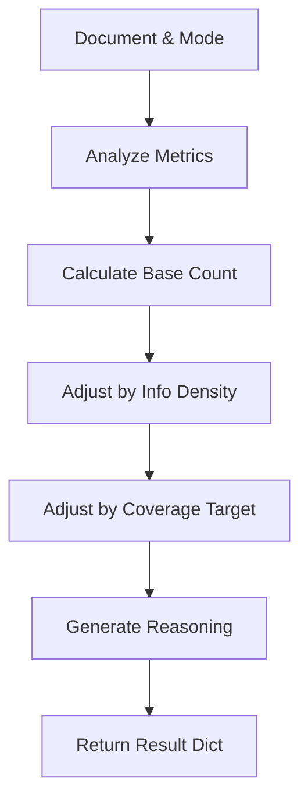

# Helper: RAG QA (Q/A生成ユーティリティ・後方互換)

## 1. 概要
`helper_rag_qa.py` は、RAGシステムのためのQ/Aペア生成に関するユーティリティモジュールです。
現在は主に **後方互換性** のために維持されており、実際の主要ロジックは `qa_generation/` パッケージ（models, keyword_extraction, semantic等）に移行されています。
このモジュールは、旧来のコードベースが参照していたクラスや関数を再エクスポートする役割を担いつつ、一部のレガシーな生成ロジック（ルールベース生成など）を保持しています。

**主な責務:**
*   **Backward Compatibility**: `qa_generation/` パッケージのクラス・関数を再エクスポートし、既存コードの動作を保証。
*   **Legacy Logic**: 新パッケージに完全移行されていない、ルールベースやテンプレートベースのQ/A生成ロジックを提供。
*   **Integration**: 複数の生成手法（LLM, ルール, テンプレート）を組み合わせたハイブリッド生成機能の提供。

## 2. モジュール構成

### 2.1 依存関係

`qa_generation` パッケージに強く依存し、そこから主要な機能をインポートします。



### 2.2 ディレクトリ構成

```
helper_rag_qa.py         # 【本モジュール】後方互換レイヤー
qa_generation/           # 新実装パッケージ
```

## 3. クラス・関数一覧

### 再エクスポートされたクラス（qa_generation/より）

以下のクラスは `qa_generation` パッケージの実装を参照してください。

*   **データモデル**: `QAPair`, `QAPairsList`, `ChainOfThoughtAnalysis` 等
*   **キーワード抽出**: `BestKeywordSelector`, `SmartKeywordSelector`
*   **セマンティック**: `SemanticCoverage`

### クラス: `QACountOptimizer`
文書特性に基づいて最適なQ/A生成数を算出するクラスです。

| メソッド名 | 概要 | 主要引数 |
| :--- | :--- | :--- |
| `calculate_optimal_qa_count` | 文書長や密度から最適数を計算。 | `document`, `mode` |

#### Method: `calculate_optimal_qa_count` IPO

*   **Input**:
    *   `document` (str): 対象文書
    *   `mode` (str): 計算モード ("auto", "evaluation" 等)
*   **Process**:
    1.  文書の基本メトリクス（長さ、トークン数、キーワード密度）を分析。
    2.  モードに応じた基本数（ベースカウント）を決定。
    3.  情報密度（キーワード密度・複雑度）による増減調整。
    4.  カバレッジ目標（推定チャンク数に基づく必要数）による調整。
    5.  決定理由の生成。
*   **Output**:
    *   `Dict[str, Any]`: 最適数、調整経緯、理由を含む辞書。



### クラス: `QAOptimizedExtractor`
`SmartKeywordSelector` を継承し、Q/A生成に特化したキーワード抽出を行うクラスです。

| メソッド名 | 概要 | 主要引数 |
| :--- | :--- | :--- |
| `extract_for_qa_generation` | Q/A生成に必要な全情報（キーワード、関係性、テンプレート）を一括抽出。 | `text`, `qa_count` |
| `extract_keyword_relations` | キーワード間の関係性（is-a, uses等）を抽出。 | `text`, `keywords` |
| `suggest_qa_templates` | キーワード特性に応じた質問テンプレートを提案。 | `keywords_with_context` |

### クラス: `LLMBasedQAGenerator`
LLM (Gemini) を使用してQ/Aを生成するクラスです。

| メソッド名 | 概要 | 主要引数 |
| :--- | :--- | :--- |
| `generate_basic_qa` | 基本的なQ/Aペアを生成。 | `text`, `num_pairs` |
| `generate_diverse_qa` | 多様なタイプ（事実、因果、比較など）のQ/Aを生成。 | `text` |

### クラス: `RuleBasedQAGenerator`
正規表現やSpaCyを使用したルールベースのQ/A生成クラスです。

| メソッド名 | 概要 |
| :--- | :--- |
| `extract_definition_qa` | 「〜とは〜である」形式の定義文を抽出。 |
| `extract_fact_qa` | 日付や場所を含む事実関係を抽出。 |
| `extract_list_qa` | 列挙表現からリスト型Q/Aを生成。 |

### クラス: `HybridQAGenerator`
複数の生成手法を統合したパイプラインクラスです。

| メソッド名 | 概要 | 主要引数 |
| :--- | :--- | :--- |
| `generate_comprehensive_qa` | ルール、テンプレート、LLMを段階的に適用してQ/Aを生成。 | `text`, `target_count` |

#### Method: `generate_comprehensive_qa` IPO

*   **Input**:
    *   `text` (str): ソーステキスト
    *   `target_count` (int): 目標生成数
*   **Process**:
    1.  **Phase 1**: ルールベース生成（定義、事実、列挙）。高信頼度のものを採用。
    2.  **Phase 2**: テンプレートベース生成（エンティティ起点）。重複を除去して追加。
    3.  **Phase 3**: 目標数に満たない場合、LLMで多様なQ/Aを生成して補完。
    4.  **Phase 4**: 品質検証（根拠の有無、矛盾チェック）を実施。
*   **Output**:
    *   `List[Dict]`: 検証済みのQ/Aペアリスト。

```mermaid
graph TD
    Input[Text & Target] --> Phase1[Rule-Based Gen]
    Phase1 --> Phase2[Template-Based Gen]
    
    Phase2 --> CheckCount{Enough QA?}
    CheckCount -- No --> Phase3[LLM Gen (Supplement)]
    CheckCount -- Yes --> Phase4
    
    Phase3 --> Phase4[Quality Validation]
    Phase4 --> Output[Return Validated QAs]
```

## 4. 利用方法

### ハイブリッド生成の実行

```python
from helper_rag_qa import HybridQAGenerator

generator = HybridQAGenerator()
text = "GRACEはGeminiモデルを使用したAIエージェントです..."

# 包括的なQ/A生成
qa_pairs = generator.generate_comprehensive_qa(text, target_count=10)

for qa in qa_pairs:
    print(f"Q: {qa['question']}")
    print(f"A: {qa['answer']}")
```

### 最適Q/A数の計算

```python
from helper_rag_qa import QACountOptimizer

optimizer = QACountOptimizer()
result = optimizer.calculate_optimal_qa_count(text, mode="learning")

print(f"Optimal Count: {result['optimal_count']}")
print(f"Reason: {result['reasoning']}")
```
